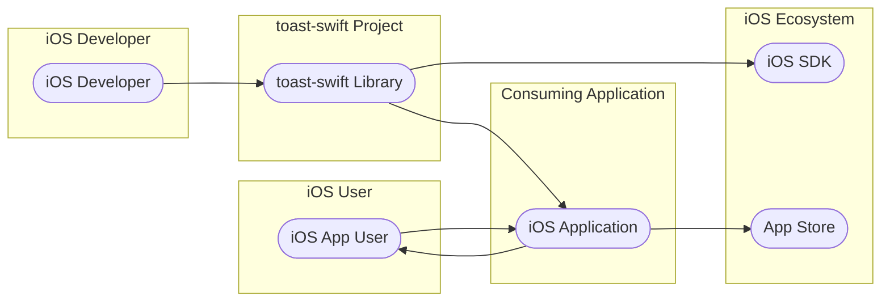
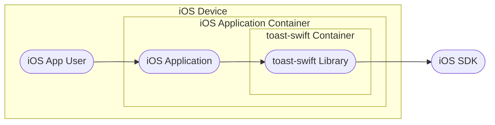
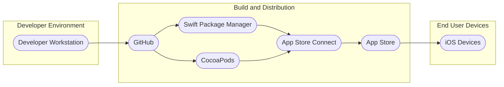
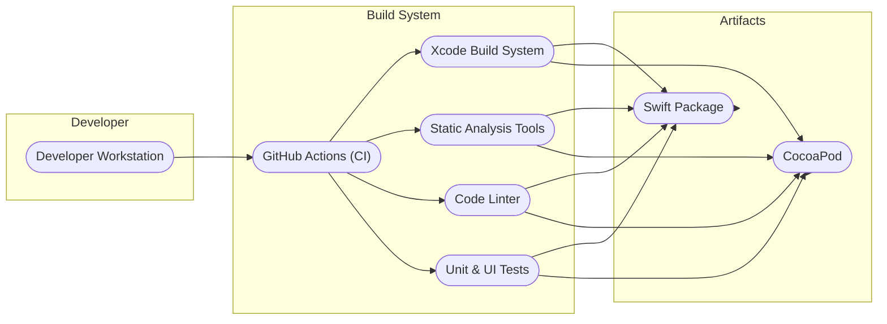

# BUSINESS POSTURE

- Business Priorities and Goals:
  - Enhance user experience in iOS applications by providing a simple and consistent way to display non-intrusive, informative messages to users.
  - Improve user engagement and provide timely feedback within iOS applications, such as success confirmations, warnings, or informational messages.
  - Reduce development time for implementing notification features in iOS apps by offering a reusable and well-tested library.
- Business Risks:
  - User experience degradation if the toast library is unreliable, buggy, or visually unappealing.
  - Potential negative impact on application stability if the library has performance issues or crashes.
  - Limited adoption if the library is difficult to use, poorly documented, or lacks necessary features.
  - Indirect security risks if vulnerabilities in the library are exploited through misuse in consuming applications, although this is less likely for a UI library.

# SECURITY POSTURE

- Existing Security Controls:
  - security control: Code is hosted on GitHub, providing version control and transparency. (Implemented: GitHub Repository)
  - security control: Development likely follows general secure coding practices for Swift and iOS development. (Implemented: Implicitly by developers)
  - security control: Dependency management using Swift Package Manager or CocoaPods, which helps in managing external dependencies. (Implemented: Project setup)
- Accepted Risks:
  - accepted risk:  Indirect security vulnerabilities arising from misuse of the library in consuming applications are considered the responsibility of the application developers.
  - accepted risk:  Limited direct security impact of vulnerabilities within the UI library itself, as it primarily handles visual presentation and not sensitive data processing.
- Recommended Security Controls:
  - security control: Implement static code analysis tools to scan the library code for potential vulnerabilities and coding standard violations.
  - security control: Conduct regular code reviews by experienced developers to identify potential security flaws and improve code quality.
  - security control: Implement automated unit and UI tests to ensure the library functions as expected and to prevent regressions.
  - security control: Consider dependency scanning to ensure that any external dependencies (if introduced in the future) are free from known vulnerabilities.
- Security Requirements:
  - Authentication: Not applicable for a UI library. Authentication is handled by the applications that use this library.
  - Authorization: Not applicable for a UI library. Authorization is handled by the applications that use this library.
  - Input Validation: The library should handle various input types for toast messages (text, images, configurations) and perform basic validation to prevent unexpected behavior or crashes due to malformed input. This is especially relevant for text encoding and image formats.
  - Cryptography: Not applicable for a UI library in its core functionality. Cryptographic operations are handled by the applications that use this library if needed.

# DESIGN

## C4 CONTEXT

- Context Diagram Elements:
  - - Name: iOS App User
    - Type: Person
    - Description: End users who use iOS applications on their devices and interact with toast notifications displayed by applications.
    - Responsibilities: Interact with iOS applications and view toast notifications.
    - Security controls: Device level security controls (passcode, biometrics), application level permissions.
  - - Name: iOS Developer
    - Type: Person
    - Description: Software developers who use the `toast-swift` library to integrate toast notifications into their iOS applications.
    - Responsibilities: Integrate the `toast-swift` library into iOS applications, configure and customize toast notifications, and ensure proper usage within their applications.
    - Security controls: Secure development practices, code review, access control to development environments.
  - - Name: toast-swift Library
    - Type: Software System
    - Description: A Swift library that provides functionality to easily display toast notifications in iOS applications.
    - Responsibilities: Provide a simple API for displaying toast notifications, handle the presentation and animation of toasts, and offer customization options for toast appearance and behavior.
    - Security controls: Input validation, secure coding practices, static code analysis, code review, unit and UI testing.
  - - Name: iOS Application
    - Type: Software System
    - Description: An iOS application developed by iOS developers that integrates the `toast-swift` library to display toast notifications to users.
    - Responsibilities: Utilize the `toast-swift` library to display relevant notifications to users, manage the content and timing of toast messages, and handle user interactions with the application.
    - Security controls: Application level security controls (authentication, authorization, data protection, input validation), secure communication, adherence to App Store security guidelines.
  - - Name: iOS SDK
    - Type: Software System
    - Description: Apple's Software Development Kit for iOS, providing the necessary tools and frameworks for developing iOS applications and libraries.
    - Responsibilities: Provide APIs and functionalities for iOS development, including UI components, system services, and security features.
    - Security controls: Security features provided by the iOS platform, regular security updates from Apple.
  - - Name: App Store
    - Type: Software System
    - Description: Apple's official app distribution platform for iOS applications.
    - Responsibilities: Distribute iOS applications to end users, perform app review process including security checks before publishing applications.
    - Security controls: App review process, code signing, platform security features.

## C4 CONTAINER

- Container Diagram Elements:
  - - Name: iOS Application
    - Type: Application
    - Description: The iOS application that is built by developers and used by end users. It integrates the `toast-swift` library to provide toast notifications.
    - Responsibilities: Application logic, user interface, data handling, utilizing the `toast-swift` library for notifications.
    - Security controls: Application level security controls (authentication, authorization, data protection, input validation), secure communication, adherence to App Store security guidelines.
  - - Name: toast-swift Library
    - Type: Library
    - Description: A Swift library integrated within the iOS application. It provides the specific functionality for displaying toast notifications.
    - Responsibilities: Toast presentation logic, animation, customization options, API for application to trigger toasts.
    - Security controls: Input validation within the library, secure coding practices, static code analysis, code review, unit and UI testing.
  - - Name: iOS SDK
    - Type: Platform Component
    - Description: The iOS Software Development Kit, providing the underlying platform APIs and functionalities that both the iOS Application and the `toast-swift` library rely on.
    - Responsibilities: Providing core iOS functionalities, UI framework, system services, security features.
    - Security controls: Platform level security controls provided by iOS, regular security updates from Apple.
  - - Name: iOS App User
    - Type: Person
    - Description: End user interacting with the iOS application and viewing toast notifications.
    - Responsibilities: Using the iOS application.
    - Security controls: Device level security controls (passcode, biometrics), application level permissions.

## DEPLOYMENT

- Deployment Diagram Elements:
  - - Name: Developer Workstation
    - Type: Environment
    - Description: The local machine used by iOS developers to write code, build, and test the `toast-swift` library and consuming applications.
    - Responsibilities: Code development, local testing, version control.
    - Security controls: Developer workstation security (OS hardening, antivirus, firewall, access control), code repository access control.
  - - Name: GitHub
    - Type: Code Repository
    - Description: A web-based platform for version control and collaboration, hosting the source code of the `toast-swift` library.
    - Responsibilities: Source code management, version control, collaboration, issue tracking.
    - Security controls: Access control, authentication, authorization, audit logging, secure communication (HTTPS).
  - - Name: Swift Package Manager / CocoaPods
    - Type: Package Manager
    - Description: Dependency management tools for Swift projects, used to distribute and integrate the `toast-swift` library into iOS applications.
    - Responsibilities: Package distribution, dependency resolution, library integration.
    - Security controls: Package integrity checks (checksums), repository security, secure distribution channels.
  - - Name: App Store Connect
    - Type: Distribution Platform
    - Description: Apple's platform for developers to submit and manage their iOS applications for distribution on the App Store.
    - Responsibilities: Application submission, app review process, application management, distribution to the App Store.
    - Security controls: Developer account security, app review process, code signing, secure communication (HTTPS).
  - - Name: App Store
    - Type: Distribution Platform
    - Description: Apple's official app store where end users can download and install iOS applications, including those using the `toast-swift` library.
    - Responsibilities: Application distribution to end users, application discovery, updates.
    - Security controls: App review process, platform security features, secure download channels.
  - - Name: iOS Devices
    - Type: Environment
    - Description: End users' iPhones and iPads where iOS applications using the `toast-swift` library are installed and run.
    - Responsibilities: Running iOS applications, displaying toast notifications.
    - Security controls: Device level security controls (OS security, passcode, biometrics, app sandboxing), application level permissions.

## BUILD

- Build Diagram Elements:
  - - Name: Developer Workstation
    - Type: Environment
    - Description: Developer's local machine where code is written and initially tested.
    - Responsibilities: Code development, local builds, initial testing, committing code to version control.
    - Security controls: Developer workstation security, code repository access control.
  - - Name: GitHub Actions (CI)
    - Type: CI/CD System
    - Description: GitHub's built-in CI/CD service used to automate the build, test, and potentially release process of the `toast-swift` library.
    - Responsibilities: Automated build process, running tests, static analysis, linting, creating build artifacts.
    - Security controls: Secure CI/CD pipeline configuration, access control to CI/CD workflows, secret management for credentials, build environment security.
  - - Name: Xcode Build System
    - Type: Build Tool
    - Description: Apple's build system used to compile and build Swift code for iOS platforms.
    - Responsibilities: Compiling Swift code, linking libraries, creating build artifacts (Swift Packages, CocoaPods).
    - Security controls: Build process integrity, dependency management security.
  - - Name: Static Analysis Tools
    - Type: Security Tool
    - Description: Tools used to automatically analyze the source code for potential security vulnerabilities and coding errors without executing the code.
    - Responsibilities: Identifying potential security flaws, enforcing coding standards, improving code quality.
    - Security controls: Tool configuration, vulnerability reporting, integration into CI/CD pipeline.
  - - Name: Code Linter
    - Type: Code Quality Tool
    - Description: Tools used to analyze source code to identify stylistic and programmatic errors, helping to maintain code consistency and quality.
    - Responsibilities: Enforcing coding style guidelines, identifying potential code quality issues.
    - Security controls: Tool configuration, integration into CI/CD pipeline.
  - - Name: Unit & UI Tests
    - Type: Testing Framework
    - Description: Automated tests to verify the functionality and UI behavior of the `toast-swift` library.
    - Responsibilities: Ensuring code correctness, preventing regressions, improving code reliability.
    - Security controls: Test coverage, test environment security.
  - - Name: Swift Package / CocoaPod
    - Type: Build Artifact
    - Description: The packaged and distributable formats of the `toast-swift` library, ready to be consumed by iOS applications.
    - Responsibilities: Library distribution, dependency management.
    - Security controls: Package integrity (checksums, signing), secure distribution channels.

# RISK ASSESSMENT

- Critical Business Processes:
  - Displaying user notifications effectively within iOS applications to enhance user experience and provide feedback.
  - Maintaining the quality and reliability of the `toast-swift` library to ensure smooth integration and operation in consuming applications.
- Data Sensitivity:
  - The `toast-swift` library itself does not directly handle sensitive data. However, the content of the toast messages displayed by applications using this library might contain sensitive information, depending on the application's purpose and usage. The sensitivity of data displayed in toasts is determined by the consuming application, not the library itself.

# QUESTIONS & ASSUMPTIONS

- Questions:
  - Are there any specific performance requirements for the toast library, such as maximum latency or resource consumption?
  - Are there any specific accessibility requirements for toast notifications (e.g., screen reader compatibility)?
  - Are there any plans to extend the library with more advanced features, such as interactive toasts or toast queuing mechanisms?
  - Are there any specific compliance requirements that applications using this library must adhere to (e.g., GDPR, HIPAA)?
- Assumptions:
  - The primary use case for the `toast-swift` library is to enhance user experience in general-purpose iOS applications.
  - The library is intended to be distributed as a Swift Package and/or CocoaPod for easy integration into iOS projects.
  - Developers using the library are responsible for ensuring that the content of toast notifications and the overall application comply with relevant security and privacy regulations.
  - The development and build process for the library will leverage standard iOS development tools and practices, including Xcode and GitHub Actions.