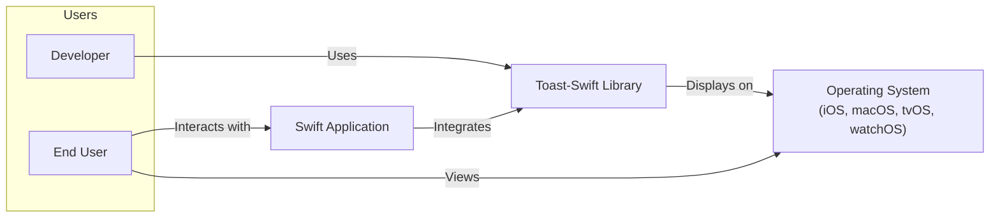
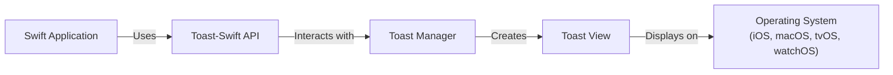
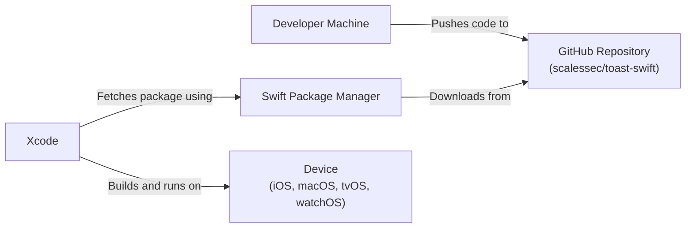
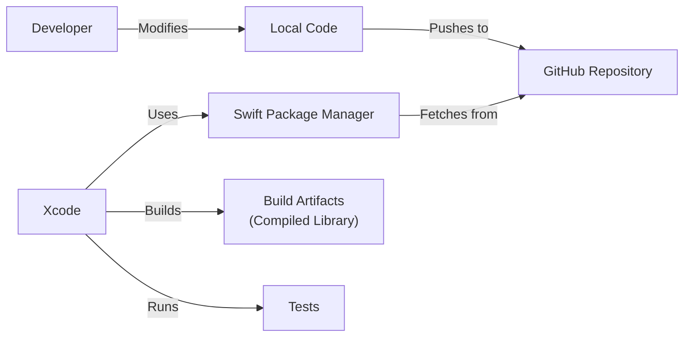

Okay, let's create a design document for the `toast-swift` project.

# BUSINESS POSTURE

Business Priorities and Goals:

*   Provide a lightweight, easy-to-use, and customizable Toast notification library for Swift developers.
*   Enhance the user experience of Swift applications by enabling developers to easily display non-intrusive, informative messages.
*   Offer a well-documented and maintained library that is accessible to developers of all skill levels.
*   Minimize external dependencies to keep the library lightweight and reduce potential conflicts.
*   Support a wide range of iOS, macOS, tvOS and watchOS versions to maximize compatibility.

Most Important Business Risks:

*   **Usability Issues**: If the library is difficult to use, buggy, or lacks essential features, developers may choose alternative solutions, reducing adoption and impact.
*   **Compatibility Problems**: Failure to support a reasonable range of Swift and OS versions could limit the library's usefulness and audience.
*   **Maintainability**: If the codebase is poorly structured or documented, maintaining and updating the library over time could become challenging, leading to stagnation and eventual abandonment.
*   **Security Vulnerabilities**: While the library's scope is limited, vulnerabilities like injection of malicious content into toast messages could potentially be exploited, although the risk is relatively low given the nature of toast notifications.
*   **Lack of Adoption**: If the library fails to gain traction within the Swift developer community, its impact and long-term viability will be limited.

# SECURITY POSTURE

Existing Security Controls:

*   security control: Code Reviews: The project is open-source and subject to community scrutiny, providing an informal code review process. Pull requests are used for contributions, allowing for review before merging.
*   security control: Limited Scope: The library's functionality is focused on displaying temporary messages, reducing the attack surface.
*   security control: No External Dependencies: The library explicitly avoids external dependencies, minimizing the risk of supply chain attacks.
*   security control: Input Sanitization: While not explicitly stated, the library should implicitly handle basic input sanitization to prevent the display of potentially harmful characters or code (e.g., HTML/JavaScript injection). This needs to be verified in the code.

Accepted Risks:

*   accepted risk: Limited Input Validation: The library likely relies on the developer using it to provide reasonably safe content for the toast messages. While basic sanitization might be present, complex attacks might not be fully mitigated.
*   accepted risk: Denial of Service (DoS): While unlikely, a malicious actor could potentially trigger a large number of toast notifications, potentially impacting the user experience, although the impact would likely be minimal and temporary.

Recommended Security Controls:

*   security control: Explicit Input Validation: Implement robust input validation to ensure that only safe content is displayed in toast messages. This should include escaping or rejecting potentially harmful characters or code.
*   security control: Content Security Policy (CSP) (if applicable): If the toast messages are rendered using a WebView (which is unlikely but should be confirmed), implement a CSP to restrict the types of content that can be loaded and executed.
*   security control: Regular Security Audits: Conduct periodic security audits of the codebase to identify and address potential vulnerabilities.
*   security control: Automated Security Scanning: Integrate static analysis tools into the development workflow to automatically detect potential security issues.

Security Requirements:

*   Authentication: Not applicable for this library.
*   Authorization: Not applicable for this library.
*   Input Validation:
    *   The library MUST sanitize user-provided input to prevent the display of malicious content (e.g., HTML/JavaScript injection).
    *   The library SHOULD provide options for developers to customize the level of input validation.
    *   The library SHOULD limit the length of toast messages to prevent excessively long messages from disrupting the user interface.
*   Cryptography: Not directly applicable, but if any sensitive data is temporarily stored or transmitted (which is unlikely), it should be protected using appropriate cryptographic techniques. This is highly unlikely to be a requirement for a toast notification library.

# DESIGN

## C4 CONTEXT

Element Descriptions:

*   Element:
    *   Name: Developer
    *   Type: Person
    *   Description: A software developer who uses the Toast-Swift library in their Swift application.
    *   Responsibilities: Integrates the Toast-Swift library into their application, configures toast messages, and handles user interactions.
    *   Security controls: None directly applicable to the developer role in this context.

*   Element:
    *   Name: End User
    *   Type: Person
    *   Description: The user of the Swift application that utilizes the Toast-Swift library.
    *   Responsibilities: Interacts with the Swift application and views the toast notifications.
    *   Security controls: None directly applicable to the end-user role.

*   Element:
    *   Name: Toast-Swift Library
    *   Type: Software System
    *   Description: The Toast-Swift library itself, providing the functionality to display toast notifications.
    *   Responsibilities: Provides an API for creating and displaying toast messages, manages the display and dismissal of toasts, handles user interactions (if any).
    *   Security controls: Input validation, limited scope.

*   Element:
    *   Name: Swift Application
    *   Type: Software System
    *   Description: A Swift application that integrates the Toast-Swift library.
    *   Responsibilities: Implements the application's core functionality and uses the Toast-Swift library to display notifications.
    *   Security controls: Dependent on the application itself; should follow secure coding practices.

*   Element:
    *   Name: Operating System (iOS, macOS, tvOS, watchOS)
    *   Type: Software System
    *   Description: The underlying operating system on which the Swift application and Toast-Swift library run.
    *   Responsibilities: Provides the platform and resources for the application and library to function.
    *   Security controls: OS-level security features, sandboxing, etc.

## C4 CONTAINER

Element Descriptions:

*   Element:
    *   Name: Swift Application
    *   Type: Software System
    *   Description: A Swift application that integrates the Toast-Swift library.
    *   Responsibilities: Implements the application's core functionality and uses the Toast-Swift library to display notifications.
    *   Security controls: Dependent on the application itself; should follow secure coding practices.

*   Element:
    *   Name: Toast-Swift API
    *   Type: API
    *   Description: The public interface of the Toast-Swift library, exposed to developers.
    *   Responsibilities: Provides methods for creating, configuring, and displaying toast messages.
    *   Security controls: Input validation.

*   Element:
    *   Name: Toast Manager
    *   Type: Component
    *   Description: An internal component of the Toast-Swift library responsible for managing the lifecycle of toast messages.
    *   Responsibilities: Queues toast messages, handles timing and dismissal, manages animations.
    *   Security controls: Limited scope.

*   Element:
    *   Name: Toast View
    *   Type: UI Component
    *   Description: The visual representation of a toast message.
    *   Responsibilities: Displays the toast message content, handles user interactions (e.g., taps, swipes).
    *   Security controls: Input sanitization (to prevent rendering malicious content).

*   Element:
    *   Name: Operating System (iOS, macOS, tvOS, watchOS)
    *   Type: Software System
    *   Description: The underlying operating system.
    *   Responsibilities: Provides the platform and resources.
    *   Security controls: OS-level security features.

## DEPLOYMENT

Possible Deployment Solutions:

1.  **CocoaPods**: A dependency manager for Swift and Objective-C Cocoa projects.
2.  **Swift Package Manager (SPM)**: The official package manager for Swift, integrated into the Swift build system.
3.  **Carthage**: A decentralized dependency manager for Cocoa applications.
4.  **Manual Integration**: Developers can manually add the Toast-Swift source files to their Xcode project.

Chosen Solution: Swift Package Manager (SPM)

SPM is the preferred solution due to its integration with the Swift build system and ease of use. It is also the officially recommended approach by Apple.

Element Descriptions:

*   Element:
    *   Name: Developer Machine
    *   Type: Infrastructure Node
    *   Description: The developer's computer where the code is written and modified.
    *   Responsibilities: Hosts the development environment, source code, and build tools.
    *   Security controls: Standard development machine security practices (e.g., firewall, antivirus).

*   Element:
    *   Name: GitHub Repository (scalessec/toast-swift)
    *   Type: Infrastructure Node
    *   Description: The Git repository hosting the Toast-Swift source code.
    *   Responsibilities: Stores the source code, manages versions, and facilitates collaboration.
    *   Security controls: GitHub's built-in security features, access controls, branch protection rules.

*   Element:
    *   Name: Swift Package Manager
    *   Type: Software System
    *   Description: The package manager that downloads and integrates Toast-Swift into the developer's project.
    *   Responsibilities: Resolves dependencies, downloads package source code, and integrates it into the Xcode project.
    *   Security controls: Package integrity checks (checksums), secure communication with the repository.

*   Element:
    *   Name: Xcode
    *   Type: Software System
    *   Description: The integrated development environment (IDE) used to build and run Swift applications.
    *   Responsibilities: Provides the tools for building, debugging, and deploying the application.
    *   Security controls: Xcode's built-in security features, code signing.

*   Element:
    *   Name: Device (iOS, macOS, tvOS, watchOS)
    *   Type: Infrastructure Node
    *   Description: The physical or simulated device on which the application runs.
    *   Responsibilities: Executes the application and displays the user interface, including toast notifications.
    *   Security controls: Operating system security features, sandboxing.

## BUILD

The build process for Toast-Swift is relatively simple, leveraging the Swift Package Manager (SPM) and Xcode's build system. There isn't a dedicated CI environment mentioned in the repository, but best practices would suggest using one (like GitHub Actions) for automated builds and testing.

Build Process Description:

1.  **Code Modification**: The developer modifies the Toast-Swift source code on their local machine.
2.  **Commit and Push**: Changes are committed to the local Git repository and pushed to the remote GitHub repository.
3.  **Dependency Resolution**: When a project using Toast-Swift is opened in Xcode, SPM resolves the dependency and fetches the Toast-Swift source code from the GitHub repository.
4.  **Build**: Xcode, using the integrated Swift compiler, builds the Toast-Swift library along with the application that uses it.
5.  **Testing**: Xcode runs any unit tests included in the Toast-Swift project.
6.  **Artifact Creation**: The build process produces the compiled Toast-Swift library, which is then linked into the application.

Security Controls in Build Process:

*   security control: Dependency Management (SPM): SPM ensures that the correct version of Toast-Swift is downloaded and integrated, reducing the risk of using outdated or compromised versions.
*   security control: Code Signing (Xcode): Xcode's code signing process helps ensure the integrity and authenticity of the built library.
*   security control: Testing: Unit tests help verify the functionality and security of the code.
*   security control: (Recommended) Static Analysis: Integrating static analysis tools (e.g., SwiftLint, SonarQube) into the build process (ideally via a CI environment like GitHub Actions) can automatically detect potential code quality and security issues.
*   security control: (Recommended) Dependency Scanning: Using tools to scan for known vulnerabilities in dependencies (although Toast-Swift has no external dependencies, this is a general best practice).

# RISK ASSESSMENT

Critical Business Processes:

*   Displaying non-intrusive notifications to the user.
*   Providing developers with an easy-to-use and reliable notification library.

Data Protection:

*   Data Sensitivity: The Toast-Swift library itself does not handle sensitive data directly. The content of the toast messages is provided by the integrating application. Therefore, the sensitivity of the data depends entirely on how the library is used by the developer.
*   Data to Protect: The primary concern is to prevent the display of malicious or unintended content within toast messages. This is more about preventing misuse than protecting specific data.

# QUESTIONS & ASSUMPTIONS

Questions:

*   Are there any plans to add support for custom views or more complex UI elements within toast messages? This could increase the attack surface.
*   Is there any logging or error handling within the library? If so, how is sensitive information handled (if any)?
*   Are there any specific platform-specific security considerations (e.g., differences between iOS, macOS, tvOS, and watchOS)?
*   What is the expected lifespan of this project, and what is the plan for long-term maintenance and security updates?

Assumptions:

*   BUSINESS POSTURE: The primary goal is to provide a useful and widely adopted library, prioritizing ease of use and developer experience.
*   SECURITY POSTURE: The library is assumed to have a relatively low security risk due to its limited scope. However, input validation is crucial to prevent misuse.
*   DESIGN: The library is designed to be lightweight and have minimal dependencies. The architecture is straightforward, focusing on displaying simple toast notifications. The use of SPM is assumed for dependency management.