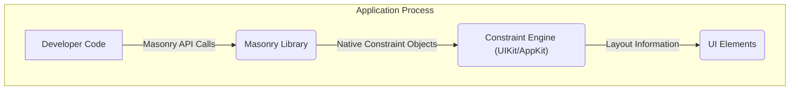
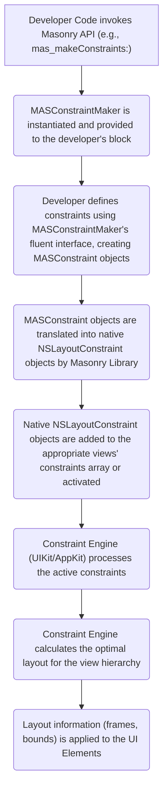

# Project Design Document: Masonry Layout Framework

**Version:** 1.1
**Date:** October 26, 2023
**Author:** AI Software Architect

## 1. Introduction

This document provides a detailed design overview of the Masonry layout framework for iOS and macOS. This document aims to clearly articulate the architecture, components, and data flow within Masonry, serving as a robust foundation for future threat modeling activities. It describes how developers use Masonry to create dynamic and adaptable user interfaces by defining constraints between UI elements, abstracting the complexities of the underlying platform layout engines.

## 2. Goals and Objectives

*   **Clearly define the architecture of the Masonry framework and its interaction with the host application.**
*   **Identify the key components within the Masonry library and their specific responsibilities.**
*   **Describe the detailed data flow within the framework during the constraint definition, resolution, and application processes.**
*   **Provide a comprehensive understanding of how developers interact with the Masonry API and the lifecycle of constraints.**
*   **Establish a solid and detailed foundation for subsequent threat modeling exercises, highlighting potential areas of concern.**

## 3. System Architecture

Masonry operates as an embedded library within an application process. It acts as a higher-level abstraction layer on top of the native iOS (UIKit) and macOS (AppKit) layout systems. The core functionality resides within the application's memory space.

### 3.1. Key Components

*   **Developer Code:** This represents the Swift or Objective-C code written by the application developer. This code utilizes the Masonry framework's API to define, update, or remove layout constraints on `UIView` (iOS) or `NSView` (macOS) objects. This is the primary point of interaction with the framework.
*   **Masonry Library:** This is the core of the framework, responsible for providing a developer-friendly API and translating these high-level constraint definitions into the native constraint objects understood by UIKit and AppKit. Key internal components include:
    *   **`MASConstraintMaker`:** A utility class that provides a fluent interface for creating and managing constraints within a block. It acts as a builder for `MASConstraint` objects.
    *   **`MASConstraint`:** Represents a single layout constraint. It encapsulates information about the constrained attributes, the relationship (e.g., equal, greaterThanOrEqual), and the related view and attribute. It holds references to the involved views and attributes.
    *   **`MASViewAttribute`:** Represents a specific layout attribute of a view (e.g., `mas_top`, `mas_bottom`, `mas_leading`, `mas_trailing`, `mas_width`, `mas_height`, `mas_centerX`, `mas_centerY`, `mas_baseline`). It acts as a wrapper around the underlying view properties.
    *   **`MASLayoutConstraint`:** A lightweight wrapper around the native `NSLayoutConstraint` (iOS) or `NSLayoutConstraint` (macOS) objects. It provides Masonry-specific management and tracking of these native constraints.
    *   **Category Extensions (`UIView+MASAdditions`, `NSView+MASAdditions`):** These extensions add the core Masonry API methods (e.g., `mas_makeConstraints:`, `mas_updateConstraints:`, `mas_remakeConstraints:`) to `UIView` and `NSView`, making the framework easily accessible within the view hierarchy. They manage the association between views and their Masonry-managed constraints.
    *   **Constraint Installation and Management Logic:** This part of the library handles the creation, activation, deactivation, and updating of native layout constraints based on the developer's intent. It ensures that constraints are correctly added to the view hierarchy and managed throughout the view's lifecycle.
*   **Constraint Engine (UIKit/AppKit):** This is the underlying, platform-provided layout engine responsible for resolving the defined constraints and calculating the final layout (frames and bounds) of the views. Masonry relies entirely on this engine for the actual layout computation. It takes the `NSLayoutConstraint` objects as input.
*   **UI Elements:** These are the instances of `UIView` (iOS) or `NSView` (macOS) whose layout is being managed by Masonry. They are the targets of the constraints defined using the framework.

## 4. Data Flow

The process of defining and applying layouts using Masonry involves a distinct data flow:

**Detailed Steps:**

1. **Developer Invokes Masonry API:** The developer calls one of the Masonry API methods (e.g., `mas_makeConstraints:`) on a `UIView` or `NSView` instance. This initiates the constraint definition process.
2. **`MASConstraintMaker` Instantiation:**  Masonry instantiates a `MASConstraintMaker` object and passes it as a parameter to the block provided by the developer. This object provides the interface for defining constraints.
3. **Constraint Definition:** Inside the block, the developer uses the `MASConstraintMaker`'s fluent interface (e.g., `make.top.equalTo(...)`) to define individual constraints. This process creates instances of `MASConstraint`, which store the details of each constraint.
4. **Translation to Native Constraints:** The Masonry library takes the `MASConstraint` objects created by the `MASConstraintMaker` and translates them into instances of `NSLayoutConstraint` (iOS) or `NSLayoutConstraint` (macOS). This involves mapping the high-level Masonry concepts to the properties of the native constraint objects (e.g., `firstItem`, `firstAttribute`, `relation`, `secondItem`, `secondAttribute`, `multiplier`, `constant`, `priority`).
5. **Adding/Activating Native Constraints:** The generated native layout constraints are then added to the `constraints` array of the relevant `UIView` or `NSView` instances, or their `isActive` property is set to `YES`. This registers the constraints with the operating system's layout engine.
6. **Constraint Engine Processing:** The UIKit or AppKit constraint engine periodically (or when triggered by layout updates) processes all the active constraints within the view hierarchy.
7. **Layout Calculation:** The constraint engine uses a sophisticated algorithm (typically a variation of the Simplex algorithm) to solve the system of constraints and determine the optimal size and position (frame and bounds) for each view that satisfies all the defined constraints.
8. **Layout Application:** Once the layout is calculated, the constraint engine updates the `frame`, `bounds`, and `center` properties of the affected `UIView` or `NSView` objects. This results in the visual arrangement of the UI elements on the screen.

## 5. Developer Interaction with Masonry

Developers interact with Masonry primarily through the category extensions on `UIView` and `NSView`. The key methods and concepts include:

*   **Constraint Blocks:** Developers define constraints within blocks passed to methods like `mas_makeConstraints:`, `mas_updateConstraints:`, and `mas_remakeConstraints:`. This provides a structured way to manage constraints.
*   **`mas_makeConstraints:`:** This method is typically used to establish the initial set of constraints for a view. Constraints defined within this block are added only once.
*   **`mas_updateConstraints:`:** This method is called when existing constraints need to be modified. Only the constraints defined within this block are updated, allowing for dynamic layout changes. It's important to manage which constraints are created initially to allow for updates.
*   **`mas_remakeConstraints:`:** This method removes all existing Masonry-managed constraints on a view and applies a new set of constraints defined within the provided block. This is useful for completely redefining the layout.
*   **Fluent Syntax:** Masonry provides a chainable, readable syntax for defining constraints using the `MASConstraintMaker`. This improves code clarity and reduces boilerplate.
*   **View Attributes:** Developers use properties like `mas_top`, `mas_left`, `mas_width`, etc., to refer to specific layout attributes of views.
*   **Constraint Relationships:** Developers specify the relationship between attributes using methods like `equalTo`, `greaterThanOrEqualTo`, and `lessThanOrEqualTo`.
*   **Multipliers and Constants:** Constraints can include multipliers and constants to fine-tune the layout.

## 6. Security Considerations

While Masonry itself is a layout library and doesn't directly handle sensitive data or network communication, potential security considerations arise from its interaction with the application and the underlying platform:

*   **Denial of Service (DoS) through Complex or Conflicting Layouts:**
    *   **Threat:**  Maliciously crafted or excessively complex constraint configurations could lead to exponential increases in the time and resources required by the Constraint Engine to calculate the layout.
    *   **Scenario:** An attacker might provide input that triggers the creation of a large number of interdependent constraints, overwhelming the layout engine and causing the application to become unresponsive.
    *   **Mitigation:** Implement input validation and limits on the complexity of dynamically generated layouts. Monitor application performance for unusual layout activity.
*   **Integer Overflow/Underflow in Constraint Calculations (Indirect):**
    *   **Threat:** Although the primary calculations are done by the OS, extremely large or small values provided through Masonry's API could theoretically lead to issues within the underlying layout engine.
    *   **Scenario:** A developer might unintentionally or maliciously set very large multipliers or constants, potentially causing unexpected behavior in the native layout calculations.
    *   **Mitigation:**  While Masonry doesn't directly perform these calculations, developers should be aware of potential limitations and avoid excessively large or small values. The OS layout engine should have its own safeguards.
*   **Dependency Vulnerabilities:**
    *   **Threat:**  Vulnerabilities could exist within the Masonry library itself or its dependencies (though Masonry has minimal direct dependencies).
    *   **Scenario:** An attacker could exploit a known vulnerability in Masonry to cause unexpected behavior or potentially gain control within the application's process.
    *   **Mitigation:** Regularly update Masonry to the latest version to benefit from security patches. Perform security audits of third-party libraries.
*   **Information Disclosure through Layout (Context-Specific):**
    *   **Threat:** In specific application contexts, the layout of UI elements, controlled by Masonry, could inadvertently reveal sensitive information.
    *   **Scenario:** The presence or absence of a UI element, or its position based on constraints, might signal a particular state or condition that should not be exposed.
    *   **Mitigation:** Carefully consider the information conveyed by the UI layout, especially when dealing with sensitive data. Implement appropriate access controls and data masking.
*   **Abuse of Dynamic Layout Changes:**
    *   **Threat:** Rapid and excessive changes to layout constraints could be exploited to cause performance degradation or unexpected UI flickering.
    *   **Scenario:** An attacker might trigger a rapid sequence of layout updates, consuming CPU resources and potentially making the application unusable.
    *   **Mitigation:** Implement rate limiting or throttling for dynamic layout changes triggered by user input or external events. Optimize layout updates for performance.
*   **Logic Bugs in Constraint Definition:**
    *   **Threat:**  Incorrectly defined constraints by the developer, while not a vulnerability in Masonry itself, can lead to unexpected UI behavior or application crashes.
    *   **Scenario:** Conflicting constraints or constraints that lead to impossible layouts can cause the layout engine to behave unpredictably.
    *   **Mitigation:** Thoroughly test UI layouts under various conditions. Utilize debugging tools to identify and resolve constraint issues.

These security considerations highlight potential areas of concern when using Masonry and emphasize the importance of secure development practices.

## 7. Assumptions and Constraints

*   **Target Platforms:** Masonry is specifically designed for and operates on iOS and macOS.
*   **Reliance on Underlying Layout Engine:** Masonry's functionality is entirely dependent on the correct and secure operation of the underlying UIKit and AppKit Auto Layout engines.
*   **Developer Responsibility:** Secure usage of Masonry relies on developers correctly implementing constraint logic and handling potential edge cases.
*   **No Direct External Communication:** Masonry itself does not initiate any network requests or communicate with external services.
*   **No Direct Data Persistence:** Masonry does not handle the storage or retrieval of persistent data.

## 8. Future Considerations

*   Detailed analysis of the internal algorithms and data structures within the `Masonry Library` for more in-depth threat analysis.
*   Examination of potential interactions and conflicts with other third-party UI libraries or custom layout solutions.
*   Investigation of error handling mechanisms within Masonry and their potential security implications.
*   Analysis of the performance impact of complex constraint scenarios and potential mitigation strategies.

This improved design document provides a more detailed and nuanced understanding of the Masonry layout framework, enhancing its value as a foundation for comprehensive threat modeling activities. The expanded descriptions of components, data flow, and security considerations offer a more robust basis for identifying and mitigating potential risks.
