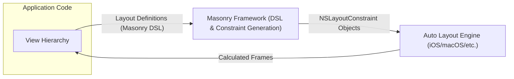

# Project Design Document: Masonry (Swift Layout Framework)

**Version:** 1.1
**Date:** October 26, 2023
**Author:** AI Cloud & Security Architect

## 1. Introduction

This document provides an enhanced and detailed design overview of the Masonry Swift layout framework. It elaborates on the architecture, key components, and the flow of data during the layout process. This refined document serves as a stronger foundation for subsequent threat modeling activities by providing more granular insights into the framework's workings.

## 2. Goals and Objectives

*   Provide a clear, concise, and more detailed description of the Masonry framework's architecture and functionality.
*   Identify key components, their specific responsibilities, and their interactions with each other and the system.
*   Illustrate the data flow within the framework during the layout process with greater clarity on the data being exchanged.
*   Highlight potential areas of interest for security analysis and threat modeling with more specific examples and context.

## 3. High-Level Architecture

Masonry acts as an intermediary layer simplifying the process of defining Auto Layout constraints in iOS, macOS, tvOS, and watchOS applications. It offers a more developer-friendly DSL that is then translated into the standard `NSLayoutConstraint` objects understood by the operating system's layout engine. Essentially, Masonry abstracts away some of the complexity of directly working with `NSLayoutConstraint`.

*   **View Hierarchy:** Represents the application's user interface elements, organized in a hierarchical structure. Developers interact with these views to apply layouts.
*   **Masonry Framework (DSL & Constraint Generation):** This is the core of the Masonry library. It encompasses the DSL used by developers to define layouts and the logic to translate these definitions into concrete `NSLayoutConstraint` objects.
*   **Auto Layout Engine (iOS/macOS/etc.):** The underlying operating system component responsible for taking `NSLayoutConstraint` objects and calculating the precise size and position (frame) of each view in the hierarchy.

## 4. Detailed Architecture

Masonry's internal architecture is composed of several interacting components, each with a specific role in the constraint creation and management process:

*   **`MASConstraint` (Protocol):** Defines the interface for all constraint types within Masonry. It provides a common set of methods for managing constraints, such as activating, deactivating, and updating. Concrete constraint implementations adhere to this protocol.
*   **`MASLayoutConstraint` (Class):** A concrete implementation of the `MASConstraint` protocol. It directly wraps an `NSLayoutConstraint` object, acting as a bridge between Masonry's internal representation and the system's layout engine. It manages the lifecycle and properties of the underlying `NSLayoutConstraint`.
*   **`MASViewAttribute` (Class):** Represents a specific layout attribute of a `UIView` or other layoutable object (e.g., `top`, `bottom`, `leading`, `trailing`, `width`, `height`). It encapsulates information about the attribute and is used to define the relationships between different view attributes in constraints.
*   **`View+MASAdditions` (Extensions):**  Swift extensions added to `UIView` (and similar classes like `NSView` on macOS). These extensions are the primary entry point for developers using Masonry. They provide the expressive DSL for defining constraints. Key methods include:
    *   `mas_makeConstraints(_:)`:  Used to define and install new constraints on a view. This block is executed once per layout pass where these constraints are initially set up.
    *   `mas_updateConstraints(_:)`:  Used to modify existing constraints. This block is called when constraints need to be changed based on application logic or external factors.
    *   `mas_remakeConstraints(_:)`:  Used to remove all existing constraints managed by Masonry on a view and define a new set of constraints.
    *   Read-only accessors for view attributes (e.g., `mas_top`, `mas_leading`, `mas_width`): These provide a convenient way to reference view attributes within the DSL.
*   **Constraint Installers (Internal Logic):**  These are the internal mechanisms within the `MASAdditions` that take the constraint definitions provided in the DSL blocks and translate them into concrete `MASLayoutConstraint` objects wrapping `NSLayoutConstraint`. They handle the creation and installation of these constraints onto the appropriate views.

## 5. Data Flow

The process of applying layout constraints using Masonry involves a specific flow of data between its components and the underlying system:

1. **Constraint Definition (Developer):** The developer uses the Masonry DSL within `mas_makeConstraints`, `mas_updateConstraints`, or `mas_remakeConstraints` blocks. The data here consists of symbolic representations of layout relationships (e.g., "view A's leading edge equals view B's trailing edge plus 10 points").
2. **Attribute Resolution (`MASViewAttribute`):** When the DSL is processed, Masonry resolves the `MASViewAttribute` instances for the involved views. This involves accessing the views' properties to identify the correct layout anchors (e.g., `view.leadingAnchor`). The data exchanged here is information about the specific layout anchors of the views.
3. **Constraint Object Creation (`MASLayoutConstraint`):** The constraint installers within Masonry take the resolved attribute relationships and create instances of `MASLayoutConstraint`. Each `MASLayoutConstraint` encapsulates the parameters needed to create a corresponding `NSLayoutConstraint`. The data at this stage includes the `firstItem`, `firstAttribute`, `relation`, `secondItem`, `secondAttribute`, `multiplier`, and `constant` values that will be used to initialize the `NSLayoutConstraint`.
4. **`NSLayoutConstraint` Instantiation:** The `MASLayoutConstraint` then creates the actual `NSLayoutConstraint` object using the collected parameters.
5. **Constraint Installation (Auto Layout Engine):** The newly created `NSLayoutConstraint` objects are added to the appropriate view or layout guide. This involves calling methods like `addConstraint(_:)` on the relevant view or its superview. The data passed here are the `NSLayoutConstraint` objects themselves.
6. **Layout Calculation (Auto Layout Engine):** The operating system's Auto Layout engine takes the installed `NSLayoutConstraint` objects and calculates the optimal frames for all views in the hierarchy to satisfy these constraints. The input to this stage is the set of active `NSLayoutConstraint` objects. The output is the calculated `frame` for each view.
7. **View Rendering:** The views are then rendered on the screen based on the calculated frames.

```mermaid
graph LR
    subgraph "Developer Code"
        A["Define Constraints (Masonry DSL)"]
    end
    subgraph "Masonry Framework"
        B["Attribute Resolution: MASViewAttribute"]
        C["Constraint Creation: MASLayoutConstraint"]
        D["NSLayoutConstraint Instantiation"]
        E["Constraint Installation"]
    end
    subgraph "Auto Layout Engine"
        F["Layout Calculation"]
    end
    subgraph "Application"
        G["View Rendering"]
    end

    A -- "DSL Definitions" --> B
    B -- "View Attribute Info" --> C
    C -- "NSLayoutConstraint Parameters" --> D
    D -- "NSLayoutConstraint Objects" --> E
    E -- "NSLayoutConstraint Objects" --> F
    F -- "Calculated Frames" --> G
```

## 6. Deployment Considerations

Masonry is typically integrated into an application project as a dependency. Common methods for deployment include:

*   **CocoaPods:**  Specify `pod 'Masonry'` in the `Podfile` and execute `pod install`. This downloads the Masonry library and integrates it into the Xcode workspace.
*   **Carthage:** Add `github "snapkit/masonry"` to the `Cartfile` and run `carthage update`. This builds the Masonry framework, which needs to be manually linked to the application target.
*   **Swift Package Manager (SPM):** Add Masonry as a dependency in the `Package.swift` file of your project. Xcode can then resolve and integrate the package.

The Masonry framework becomes part of the application's binary and executes within the application's process space.

## 7. Technologies Used

*   **Swift:** The primary programming language in which the Masonry framework is written.
*   **Objective-C (Interoperability):** While primarily Swift, Masonry interacts with Apple's UI frameworks (UIKit, AppKit) which have Objective-C roots, requiring Swift's Objective-C interoperability features.
*   **Foundation Framework:** Provides essential data types, collections, and system services used by Masonry.
*   **UIKit (iOS, tvOS), AppKit (macOS), WatchKit (watchOS):** The platform-specific UI frameworks that Masonry helps to manage the layout of.
*   **Auto Layout (Layout Engine):** The underlying constraint-based layout system provided by Apple's operating systems.

## 8. Security Considerations (For Threat Modeling)

When considering the security implications of Masonry, the following areas warrant attention during threat modeling:

*   **Maliciously Crafted Layouts (DoS Potential):** A developer, either intentionally or unintentionally, could define an extremely complex set of constraints that could lead to excessive CPU and memory consumption during the layout calculation phase. This could potentially cause the application to become unresponsive or crash, leading to a denial-of-service. For example, deeply nested views with conflicting or overly complex constraints.
*   **Information Disclosure through Layout Manipulation:** While less direct, if layout decisions are based on sensitive data and not handled carefully, vulnerabilities could arise. For instance, if the visibility or position of a sensitive UI element is solely controlled by a constraint driven by external, untrusted data, it could be manipulated to expose that element inappropriately.
*   **Resource Exhaustion through Constraint Churn:**  Rapidly adding, removing, or updating a large number of constraints in a short period could strain system resources. An attacker might try to trigger this scenario to degrade application performance or cause instability.
*   **Logic Errors in Constraint Resolution Leading to Unexpected UI:** Bugs or vulnerabilities within Masonry's constraint resolution logic could lead to unexpected or incorrect layouts. While not directly a security vulnerability in the traditional sense, this could create usability issues or, in certain contexts, expose unintended information. For example, a flaw in how Masonry handles priority levels of constraints could lead to a crucial element being hidden.
*   **Dependency Vulnerabilities (Indirect):** Although Masonry has few direct dependencies, vulnerabilities in the Swift standard library or the underlying operating system frameworks could indirectly affect Masonry's security. Keeping dependencies updated is crucial.
*   **Integer Overflow/Underflow in Constraint Calculations (Theoretical):** While less likely with modern systems, theoretically, if constraint calculations within Masonry involved integer arithmetic without proper bounds checking, there could be a risk of overflow or underflow leading to unexpected behavior. This would likely be a vulnerability in the underlying Auto Layout engine but is worth considering in a thorough analysis.
*   **Improper Handling of View Hierarchies:** If Masonry mishandles edge cases in view hierarchy manipulation (e.g., constraints involving deallocated views), it could lead to crashes or undefined behavior that could potentially be exploited.

## 9. Future Considerations

*   **Performance Profiling and Optimization Tools:**  Providing built-in tools or guidance for developers to profile the performance of their Masonry-based layouts and identify potential bottlenecks.
*   **Advanced Layout Features:** Exploring the addition of more advanced layout capabilities within the DSL, potentially drawing inspiration from other layout systems.
*   **Improved Debugging and Error Reporting:** Enhancing error messages and debugging aids to make it easier for developers to diagnose and resolve layout issues.
*   **Accessibility Enhancements:** Ensuring that layouts created with Masonry are easily adaptable to accessibility needs and provide good support for assistive technologies.
*   **Formal Verification of Constraint Logic:**  Exploring techniques for formally verifying the correctness of Masonry's constraint resolution logic to reduce the risk of unexpected behavior.

This enhanced design document provides a more in-depth understanding of the Masonry framework, which is essential for conducting a comprehensive threat model and identifying potential security risks.