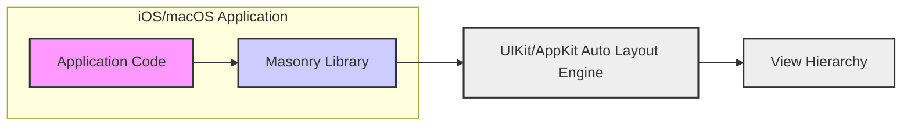

# Project Design Document: Masonry Layout Framework

## 1. Introduction

This document provides a detailed design overview of the Masonry layout framework, an Auto Layout library for iOS and macOS. Masonry simplifies the syntax for creating and managing Auto Layout constraints, making it easier for developers to define complex and dynamic user interfaces. This document is intended to serve as a basis for threat modeling activities, providing a comprehensive understanding of Masonry's architecture, components, and data flow.

**Project Link:** [https://github.com/snapkit/masonry](https://github.com/snapkit/masonry)

**Purpose of Masonry:**

*   To offer a more intuitive, readable, and chainable syntax for Auto Layout in Swift and Objective-C.
*   To minimize the amount of repetitive code typically required for programmatic Auto Layout.
*   To boost developer efficiency when working with intricate UI layouts.

**Target Audience for this Document:**

*   Security engineers conducting threat modeling exercises.
*   Software developers integrating Masonry into their applications.
*   Individuals seeking a deeper understanding of Masonry's internal workings and design.

## 2. System Architecture

Masonry is designed as a library that enhances the built-in Auto Layout framework provided by UIKit (iOS) and AppKit (macOS). It operates as a layer on top of Auto Layout, offering a more streamlined and developer-friendly way to interact with it, rather than replacing it entirely.

### 2.1. Architecture Diagram

**Diagram Description:**

*   **"iOS/macOS Application"**: Represents the encompassing application that incorporates and utilizes the Masonry library for UI layout.
*   **"Application Code"**:  The specific code written by developers within the application that leverages Masonry to define and manage layout constraints for UI elements.
*   **"Masonry Library"**: The Masonry framework itself, acting as an intermediary to translate the simplified, chainable syntax into standard Auto Layout constraints understood by the underlying system.
*   **"UIKit/AppKit Auto Layout Engine"**: The core layout engine provided by Apple's operating systems (iOS and macOS). Masonry interfaces with this engine to apply and resolve layout constraints. This engine is responsible for the heavy lifting of calculating and applying the layout rules to the view hierarchy.
*   **"View Hierarchy"**: The tree-like structure representing the arrangement of UI elements (views) within the application's user interface. Masonry constraints are applied to these views to govern their size, position, and relationships within this hierarchy.

**Key Architectural Points:**

*   **Library Nature:** Masonry is designed as a library that is directly embedded within the application. It is not a standalone service or external process.
*   **Abstraction Layer for Auto Layout:** Masonry serves as an abstraction layer, simplifying the complexities of the native Auto Layout engine. It makes the process of creating and managing `NSLayoutConstraint` objects more developer-friendly and less verbose.
*   **UIKit/AppKit Dependency:** Masonry is inherently dependent on UIKit (for iOS) and AppKit (for macOS). It relies on their fundamental view hierarchy and the Auto Layout engine to function.

## 3. Component Description

Masonry is structured into several key components that collaborate to deliver its streamlined Auto Layout experience.

### 3.1. Core Components

*   **`MASConstraint`**:
    *   *Description:* Represents a single, individual layout constraint. It's the fundamental building block for defining layout rules.
    *   *Function:* Encapsulates all the properties of a constraint, such as the attribute being constrained (e.g., `top`, `width`), the relationship (`equalTo`, `greaterThanOrEqual`), multiplier, constant offset, and priority. It offers a fluent, chainable API for setting these properties. Internally, each `MASConstraint` is eventually translated into a standard `NSLayoutConstraint` object that the system's Auto Layout engine understands.

*   **`MASViewAttribute`**:
    *   *Description:* Represents a specific attribute of a `UIView` (iOS) or `NSView` (macOS) that can be constrained.
    *   *Function:*  Used to identify which aspect of a view is being targeted by a constraint. Examples include `top`, `bottom`, `left`, `right` edges, `width`, `height`, `centerX`, `centerY`, and `baseline`. When defining a constraint, you use `MASViewAttribute` to specify which attributes of different views should be related to each other.

*   **`MASCompositeConstraint`**:
    *   *Description:*  Allows grouping multiple `MASConstraint` objects into a single unit.
    *   *Function:* Provides a way to manage a set of related constraints together. This is useful when you want to apply the same configuration (like priority or insets) to a group of constraints simultaneously. It also offers methods to activate or deactivate all constraints within the group at once, simplifying the management of complex layouts.

*   **`MASLayoutConstraint`**:
    *   *Description:* An internal component within Masonry that acts as a wrapper around `NSLayoutConstraint`.
    *   *Function:* Manages the lifecycle of the underlying `NSLayoutConstraint`. It handles the activation and deactivation of the `NSLayoutConstraint` object, ensuring that constraints are properly added to and removed from the view hierarchy when needed. This component is primarily for Masonry's internal management and is not directly exposed to developers using the library.

*   **`View+MASAdditions` (Category on `UIView`/`NSView`)**:
    *   *Description:*  A category extension added to the `UIView` and `NSView` classes.
    *   *Function:* This is the primary interface through which developers interact with Masonry. It adds methods like `mas_makeConstraints:`, `mas_updateConstraints:`, and `mas_remakeConstraints:` directly to `UIView` and `NSView` objects. These methods provide the chainable, block-based syntax that Masonry is known for, making constraint creation and management concise and readable directly on view instances.

*   **`NSArray+MASAdditions` (Category on `NSArray`)**:
    *   *Description:* A category extension added to the `NSArray` class.
    *   *Function:*  Provides methods to apply constraints to multiple views at once. This is useful for situations where you need to establish consistent layout relationships between a collection of views. It enables batch operations for constraint management, improving efficiency when dealing with lists or grids of UI elements.

### 3.2. Functionalities

*   **Constraint Creation:**
    *   Offers a fluent, chainable, and highly readable syntax for defining layout constraints programmatically.
    *   Supports all standard Auto Layout constraint relationships: `equalTo`, `greaterThanOrEqualTo`, and `lessThanOrEqualTo`.
    *   Allows precise control over constraint parameters, including setting multipliers, constant offsets, and priorities to fine-tune layout behavior.

*   **Constraint Activation and Deactivation:**
    *   Provides mechanisms to efficiently manage the active state of `NSLayoutConstraint` objects.
    *   Enables activation and deactivation of individual constraints or groups of constraints, allowing for dynamic layout changes based on application state or user interactions.

*   **Constraint Updating:**
    *   Offers optimized methods to modify existing constraints without the overhead of recreating them from scratch.
    *   Significantly improves performance when layouts need to be dynamically adjusted in response to data changes, animations, or user input, as updating constraints is generally more efficient than removing and re-adding them.

*   **Constraint Removal:**
    *   Provides methods to remove constraints from views, giving developers control over dynamically altering layout rules.
    *   Facilitates complex UI behaviors where constraints need to be added and removed based on application logic, enabling flexible and adaptable user interfaces.

*   **Simplified Syntax:**
    *   Dramatically reduces the amount of verbose code typically associated with programmatic Auto Layout using the native APIs.
    *   Enhances code readability and maintainability, making it easier for developers to understand and modify layout logic, especially in complex UI scenarios.

## 4. Data Flow

The core data flow in Masonry centers around the lifecycle of layout constraints: their creation, manipulation, and application to the user interface.

**Data Flow Steps:**

1.  **Developer Defines Constraints using Masonry API:**
    *   Developers utilize Masonry's API, primarily through category methods added to `UIView`/`NSView`, to express layout constraints within their application code.
    *   This involves specifying which view attributes should be related, the type of relationship (e.g., equal to, greater than), and the target view or constant value for the constraint.
    *   *Example:* `view1.mas_makeConstraints { make in make.top.equalTo(view2.mas_bottom).offset(10) }` - This code block defines a constraint making the top edge of `view1` equal to the bottom edge of `view2` plus a 10-point offset.

2.  **Masonry Instantiates `MASConstraint` Objects:**
    *   The Masonry API methods invoked by the developer internally create instances of `MASConstraint` objects.
    *   These `MASConstraint` objects serve as data containers, holding all the configuration details for each defined constraint, such as attributes, relationships, and related views or values.

3.  **`MASConstraint` Conversion to `NSLayoutConstraint`:**
    *   When constraints are activated (either implicitly upon creation or explicitly through activation methods), each `MASConstraint` object is translated into its corresponding standard `NSLayoutConstraint` object.
    *   This translation process involves mapping Masonry's higher-level syntax and abstractions to the lower-level, native Auto Layout API of UIKit/AppKit.

4.  **`NSLayoutConstraint` Integration into View Hierarchy:**
    *   The generated `NSLayoutConstraint` objects are then added to the appropriate part of the view hierarchy. Typically, they are added to the `constraints` array of the views being constrained or their nearest common superview.
    *   Once added, the UIKit/AppKit Auto Layout engine takes over the management of these `NSLayoutConstraint` objects.

5.  **Auto Layout Engine Performs Layout Calculation:**
    *   The Auto Layout engine, a system component of iOS/macOS, processes all active `NSLayoutConstraint` objects within the view hierarchy.
    *   It solves the constraint system, which is essentially a set of mathematical equations defined by the constraints, to determine the optimal size and position (frames) for each view in the hierarchy.
    *   This calculation is automatically triggered by the system whenever a layout update is needed, such as when the view hierarchy changes, the window is resized, or the device orientation changes.

6.  **View Layout and Rendering:**
    *   Based on the layout calculations performed by the Auto Layout engine, the frames of the views are updated.
    *   The views are then rendered on the screen according to their newly calculated frames, resulting in the visual presentation of the user interface.

**Data Types Involved:**

*   **View Attributes (e.g., `top`, `bottom`, `width`, `height`):** Represented within Masonry by `MASViewAttribute` objects, which are essentially enumerations or structured data defining the specific attributes of a view that can be constrained.
*   **Constraint Relationships (e.g., `equalTo`, `greaterThanOrEqualTo`):** Defined as part of the Masonry API syntax, these relationships are translated into corresponding constants or enumerations understood by the Auto Layout engine.
*   **Numerical Values (constants, multipliers, offsets):**  Used to fine-tune constraint relationships. These are typically `CGFloat` or `Double` values representing distances, scaling factors, or offsets in points.
*   **`NSLayoutConstraint` Objects:** The fundamental data structure managed by the Auto Layout engine. These objects encapsulate all the information needed to define a layout rule.
*   **View Frames (`CGRect`/`NSRect`):**  The final output of the Auto Layout process. These structures define the rectangular bounds (position and size) of each view in the user interface, determining how they are displayed on screen.

## 5. Security Considerations

As a UI layout library, Masonry's primary function is to manage the visual presentation of an application. It does not directly handle sensitive data processing, network communication, or user authentication. Therefore, direct security vulnerabilities originating within Masonry's code are less likely to be the primary attack vector. However, security considerations are still relevant in the context of how Masonry is employed within an application and its potential indirect impact on overall application security.

**Potential Security-Related Areas to Consider during Threat Modeling:**

*   **Potential Threats:**
    *   **Denial of Service (DoS) via Complex Layouts:** While improbable in typical scenarios, excessively intricate or conflicting constraint configurations *could* theoretically lead to performance degradation or resource exhaustion, especially on resource-constrained devices.
        *   *Threat Scenario:* A malicious actor could attempt to craft extremely complex UI layouts, aiming to overload the Auto Layout engine and cause the application to become unresponsive or crash.
    *   **Logic Errors in Constraint Definitions Leading to UI Misrepresentation:** Incorrectly defined constraints, whether due to developer error or malicious intent, can result in UI elements being displayed in unexpected, misleading, or even obscured ways.
        *   *Threat Scenario:* An attacker might exploit vulnerabilities in application logic that dynamically generate UI layouts using Masonry. By manipulating input data, they could cause critical UI elements (e.g., security warnings, transaction confirmations) to be hidden or misrepresented, potentially leading to user deception or security bypasses. This is more related to application logic flaws than Masonry itself.
    *   **Indirect Dependency Vulnerabilities:** Although Masonry primarily relies on core system frameworks (UIKit/AppKit), future versions *could* potentially introduce indirect dependencies on other libraries. Vulnerabilities in these transitive dependencies could indirectly affect applications using Masonry.
        *   *Threat Scenario:* If a future version of Masonry were to depend on a third-party library with a security vulnerability, applications using that version of Masonry could become indirectly vulnerable.

*   **Mitigations:**
    *   **Thorough UI Performance Testing:** Conduct rigorous performance testing of UI layouts, particularly those that are dynamically generated or highly complex. Pay special attention to performance on low-end devices.
    *   **Code Reviews for Constraint Logic:** Implement code reviews specifically focused on validating the correctness and efficiency of constraint definitions, especially in security-sensitive parts of the application's UI.
    *   **UI Testing and Validation:** Employ UI testing frameworks to automatically verify that UI elements are rendered as intended and that critical UI components are always visible and correctly positioned.
    *   **Dependency Monitoring and Updates:** Regularly update Masonry to the latest version to benefit from bug fixes and potential security improvements. Monitor security advisories related to Masonry and its dependencies (if any arise in the future).
    *   **Secure UI Design Principles:** Adhere to secure UI design principles to minimize the risk of UI-related deception or manipulation. Ensure critical information is always clearly presented and cannot be easily obscured or misrepresented through layout manipulation.

**Important Note:** The primary security focus should remain on the application's core logic, data handling, network interactions, and other areas that are typically more susceptible to vulnerabilities. Masonry is a UI layout tool, and its security relevance is primarily indirect, related to ensuring the robustness, correctness, and predictable behavior of the application's user interface.

## 6. Deployment and Integration

Masonry is distributed as a library that is integrated directly into the application's binary during the development process.

**Integration Methods:**

*   **CocoaPods:** A widely used dependency manager for Swift and Objective-C Cocoa projects. Masonry integration is streamlined by adding it as a dependency in the project's `Podfile`.
*   **Carthage:** Another popular dependency manager that builds project dependencies and provides pre-built binaries. Masonry can be integrated using Carthage by specifying it in the `Cartfile`.
*   **Swift Package Manager (SPM):** Apple's native dependency management tool. Masonry can be integrated by adding its Git repository URL as a package dependency within Xcode.
*   **Manual Integration:**  Involves downloading the Masonry source code directly from GitHub and manually incorporating it into the Xcode project. This method offers more control but requires manual management of updates.

**Deployment:**

*   Masonry is compiled and linked into the application's executable file during the application build process.
*   The library becomes an integral part of the application binary that is distributed to end-users through app stores (like the Apple App Store) or enterprise distribution mechanisms.
*   No separate installation or deployment of Masonry is required on the user's device beyond the installation of the application itself. The library is contained within the application package.

## 7. Threat Modeling Scope

For the purpose of threat modeling related to Masonry, the scope should primarily concentrate on:

*   **Application-Level Threats:** Threats that originate from *how* Masonry is utilized within the application's codebase and UI design. This includes:
    *   Logic flaws or errors in the definition of layout constraints that could lead to unintended UI behavior.
    *   Potential performance implications of excessively complex or inefficient layout configurations.
    *   Unforeseen or undesirable UI rendering or behavior resulting from incorrect or conflicting constraints.

*   **Indirect Threats:**  Consideration of indirect threats, such as potential vulnerabilities in dependencies (though this is less likely for Masonry, which primarily depends on system frameworks).

*   **Context of Use:**  Threat modeling activities should always be conducted within the context of the specific application that is using Masonry. The sensitivity of the data displayed in the UI and the criticality of the UI's accuracy and reliability will significantly influence the severity assessment of potential threats.

**Out of Scope:**

*   **In-depth Code-Level Analysis of Masonry Internals:** Unless there is specific reason to suspect code-level vulnerabilities within Masonry itself, a detailed, line-by-line analysis of Masonry's internal implementation is generally not necessary for initial threat modeling. The focus should be on usage patterns and potential misconfigurations at the application level.
*   **Infrastructure-Level Threats:**  As Masonry is a client-side library operating within the application, infrastructure-level threats (e.g., server-side vulnerabilities, network infrastructure attacks) are not directly relevant to Masonry's security profile.

This document aims to provide a comprehensive design overview of the Masonry layout framework to facilitate effective threat modeling and security analysis for projects that incorporate this library. By gaining a thorough understanding of Masonry's architecture, components, and data flow, security engineers and developers can more effectively identify, assess, and mitigate potential security risks related to UI layout and overall application behavior.