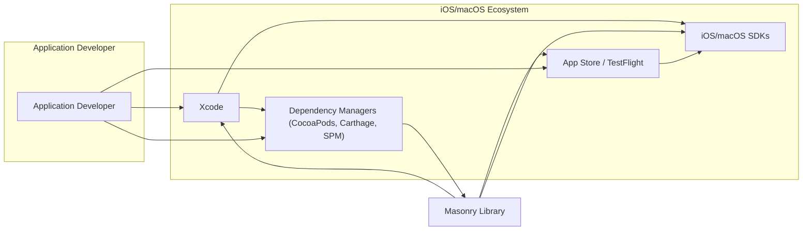
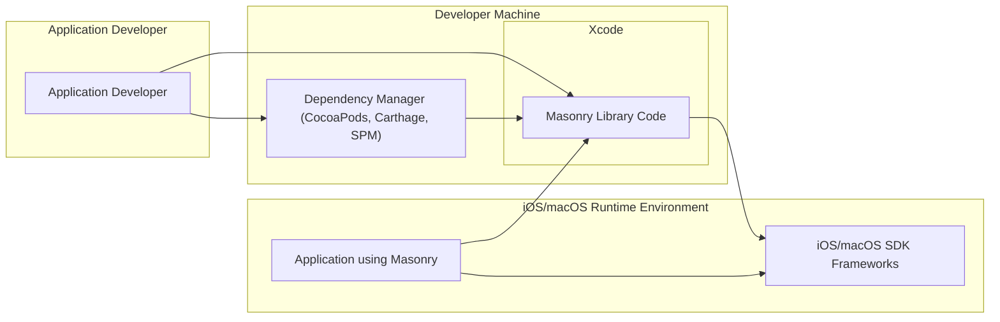

# BUSINESS POSTURE

This project, represented by the Masonry Github repository, aims to provide a robust and flexible layout framework for iOS and macOS developers. The primary business priority is to offer a high-quality, easy-to-use library that simplifies the process of creating complex and responsive user interfaces. The goal is to empower developers to build better applications more efficiently, ultimately contributing to improved user experiences on Apple platforms.

Key business risks associated with this project include:

- Risk of introducing defects or bugs into the library that could lead to application crashes or incorrect UI rendering in applications that depend on Masonry. This could negatively impact the reputation of both the library and applications using it.
- Risk of performance issues within the library that could degrade the performance of applications using Masonry. Performance is critical for user experience, especially in mobile applications.
- Risk of security vulnerabilities being discovered in the library. While a layout library is less likely to directly handle sensitive data, vulnerabilities could potentially be exploited in unforeseen ways within applications that integrate Masonry.
- Risk of developer dissatisfaction if the library is difficult to use, poorly documented, or lacks necessary features. This could lead to decreased adoption and impact the project's goals.

# SECURITY POSTURE

Existing security controls for the Masonry project are primarily focused on standard software development practices:

- security control: Code review process is likely in place for pull requests to ensure code quality and catch potential issues before merging. (Implemented in: Github Pull Request workflow)
- security control: Unit tests are present in the repository, indicating a focus on code correctness and preventing regressions. (Implemented in: Repository's test suite)

Accepted risks for the project, based on the nature of a library and typical open-source development practices, might include:

- accepted risk: Reliance on community contributions, which may introduce unforeseen vulnerabilities or code quality issues if not properly vetted.
- accepted risk: Potential for undiscovered vulnerabilities in dependencies (if any), although a layout library is expected to have minimal external dependencies.
- accepted risk: Bugs in the code that might not be caught by existing testing and review processes.

Recommended security controls to enhance the security posture of the Masonry project:

- recommended security control: Implement automated Static Application Security Testing (SAST) in the CI/CD pipeline to identify potential code-level vulnerabilities early in the development process.
- recommended security control: Introduce dependency scanning to monitor for known vulnerabilities in any external libraries or components used by Masonry (though dependencies are expected to be minimal).
- recommended security control: Consider periodic security audits or penetration testing, especially if the library evolves to handle more complex or potentially sensitive operations.

Security requirements relevant to the Masonry project:

- Authentication: Not directly applicable as Masonry is a library and does not handle user authentication. Applications using Masonry will manage their own authentication mechanisms.
- Authorization: Not directly applicable as Masonry is a layout library and does not manage access control. Authorization is the responsibility of applications using Masonry.
- Input Validation: Important for Masonry's API. The library should validate inputs from developers to prevent unexpected behavior or crashes due to incorrect or malicious input. This includes validating constraints, layout parameters, and other configuration options provided by developers.
- Cryptography: Not directly applicable as Masonry is a layout library and is not expected to handle cryptographic operations. Applications using Masonry will manage their own cryptographic needs.

# DESIGN

## C4 CONTEXT



Context Diagram Elements:

- Element:
    - Name: Application Developer
    - Type: Person
    - Description: Developers who build iOS and macOS applications using Apple's SDKs and tools. They are the primary users of the Masonry library.
    - Responsibilities: Develop applications, integrate third-party libraries like Masonry, and deploy applications to the App Store or TestFlight.
    - Security controls: Responsible for the overall security of their applications, including secure coding practices and proper integration of libraries.

- Element:
    - Name: iOS/macOS SDKs
    - Type: Software System
    - Description: Apple's Software Development Kits for building applications on iOS and macOS platforms. Provides APIs and frameworks used by Masonry and application developers.
    - Responsibilities: Provide core functionalities and APIs for application development, including UI components, system services, and security features.
    - Security controls: Security is managed by Apple at the operating system and SDK level. Applications and libraries rely on the security features provided by the SDKs.

- Element:
    - Name: Xcode
    - Type: Software System
    - Description: Apple's Integrated Development Environment (IDE) used by developers to write, build, test, and debug iOS and macOS applications.
    - Responsibilities: Provide a development environment, compile code, manage project dependencies, and facilitate application deployment.
    - Security controls: Xcode provides some built-in security features like code signing and static analysis. Developers are responsible for using Xcode securely and following secure development practices.

- Element:
    - Name: Dependency Managers (CocoaPods, Carthage, SPM)
    - Type: Software System
    - Description: Tools used by developers to manage external dependencies, including libraries like Masonry, in their projects.
    - Responsibilities: Resolve and download dependencies, integrate them into Xcode projects, and manage library versions.
    - Security controls: Dependency managers rely on package repositories and developers need to be aware of the security of the sources they are using. Security controls include verifying package integrity and using trusted repositories.

- Element:
    - Name: App Store / TestFlight
    - Type: Software System
    - Description: Apple's platforms for distributing applications to end-users. App Store is for public release, and TestFlight is for beta testing.
    - Responsibilities: Host and distribute applications, perform app review processes, and manage application updates.
    - Security controls: Apple performs security checks during the app review process. Developers are responsible for ensuring their applications meet Apple's security guidelines.

- Element:
    - Name: Masonry Library
    - Type: Software System
    - Description: A layout framework for iOS and macOS that simplifies UI development by providing a concise and powerful syntax for defining Auto Layout constraints.
    - Responsibilities: Provide layout functionalities, manage constraints, and ensure efficient and correct UI rendering.
    - Security controls: Focus on code quality, input validation of API parameters, and minimizing potential vulnerabilities within the library itself. Security is also indirectly ensured through code review and testing.

## C4 CONTAINER



Container Diagram Elements:

- Element:
    - Name: Masonry Library Code
    - Type: Container (Code Library)
    - Description: The source code of the Masonry library, written in Objective-C and potentially Swift. It contains the implementation of layout classes, constraint solvers, and API definitions.
    - Responsibilities: Provide layout functionalities to applications, manage constraints, and ensure efficient UI rendering.
    - Security controls: Code review, unit testing, static analysis (recommended), input validation within the library's API.

- Element:
    - Name: Dependency Manager (CocoaPods, Carthage, SPM)
    - Type: Container (Tool)
    - Description: A tool used by developers to download and manage the Masonry library and integrate it into their Xcode projects.
    - Responsibilities: Fetch the Masonry library from repositories, manage versions, and integrate it into the development environment.
    - Security controls: Verifying the integrity of downloaded packages, using trusted package repositories.

- Element:
    - Name: Application using Masonry
    - Type: Container (Application)
    - Description: An iOS or macOS application developed by an application developer that integrates and utilizes the Masonry library for UI layout.
    - Responsibilities: Utilize Masonry to define UI layouts, handle user interactions, and provide application-specific functionalities.
    - Security controls: Responsible for the overall application security, including secure coding practices, input validation, authentication, authorization, and secure data handling.

- Element:
    - Name: iOS/macOS SDK Frameworks
    - Type: Container (Frameworks)
    - Description: Apple's SDK frameworks (e.g., UIKit, AppKit) that provide the underlying UI components and system services used by both Masonry and applications.
    - Responsibilities: Provide core UI elements, system APIs, and platform functionalities.
    - Security controls: Security is managed by Apple at the SDK level. Applications and libraries rely on the security features provided by these frameworks.

## DEPLOYMENT

Deployment Architecture: Developer Integration and App Store Distribution

```mermaid
flowchart LR
    subgraph "Developer Environment"
        A[Developer Machine]
        subgraph "Xcode"
            B[Masonry Library]
            C[Application Code]
        end
    end
    subgraph "Build and Distribution"
        D[Build System (Xcode)]
        E[App Archive]
        F[App Store Connect / TestFlight]
        G[App Store / TestFlight]
    end
    subgraph "End User Device"
        H[iOS/macOS Device]
        I[Installed Application with Masonry]
    end

    A --> D
    B --> D
    C --> D
    D --> E
    E --> F
    F --> G
    G --> H
    H --> I
    I --> B

    linkStyle 0,1,2,3,4,5,6,7,8 stroke-width:1px;
```

Deployment Diagram Elements:

- Element:
    - Name: Developer Machine
    - Type: Infrastructure (Physical Machine)
    - Description: The local computer used by the application developer for writing code, building applications, and testing.
    - Responsibilities: Provide a development environment, host Xcode, and store source code.
    - Security controls: Developer machine security practices, including OS security, antivirus, and access controls.

- Element:
    - Name: Masonry Library
    - Type: Software (Library)
    - Description: The compiled Masonry library integrated into the developer's Xcode project.
    - Responsibilities: Provide layout functionalities within the application.
    - Security controls: Security of the library code itself (as described in previous sections).

- Element:
    - Name: Application Code
    - Type: Software (Application)
    - Description: The application code developed by the developer, which utilizes the Masonry library.
    - Responsibilities: Implement application-specific features and UI, utilize Masonry for layout.
    - Security controls: Application-level security controls, secure coding practices, input validation, authentication, authorization, etc.

- Element:
    - Name: Build System (Xcode)
    - Type: Infrastructure (Software)
    - Description: Xcode's build system that compiles the application code and links the Masonry library into the final application binary.
    - Responsibilities: Compile code, link libraries, create application archives.
    - Security controls: Code signing, build settings to enhance security (e.g., hardening).

- Element:
    - Name: App Archive
    - Type: Artifact (File)
    - Description: The compiled application package (IPA for iOS, APP for macOS) ready for distribution.
    - Responsibilities: Package the application for distribution.
    - Security controls: Code signing, integrity checks during distribution.

- Element:
    - Name: App Store Connect / TestFlight
    - Type: Infrastructure (Cloud Service)
    - Description: Apple's platform for uploading and managing applications for distribution through the App Store and TestFlight.
    - Responsibilities: Host application archives, manage app metadata, facilitate app review process, distribute beta versions via TestFlight.
    - Security controls: Apple's platform security, app review process including security checks.

- Element:
    - Name: App Store / TestFlight
    - Type: Infrastructure (Cloud Service)
    - Description: Apple's platforms for distributing applications to end-users (App Store) and beta testers (TestFlight).
    - Responsibilities: Distribute applications to users, manage app updates.
    - Security controls: Apple's platform security, app review process.

- Element:
    - Name: iOS/macOS Device
    - Type: Infrastructure (Physical Device)
    - Description: End-user's iPhone, iPad, or Mac device where the application is installed and run.
    - Responsibilities: Run the application, provide user interface, execute application logic.
    - Security controls: Device security features (OS security, sandboxing, permissions).

- Element:
    - Name: Installed Application with Masonry
    - Type: Software (Application)
    - Description: The application installed on the end-user's device, including the integrated Masonry library.
    - Responsibilities: Provide application functionalities to the end-user, utilize Masonry for UI layout.
    - Security controls: Application-level security controls running on the device, sandboxing provided by the OS.

## BUILD

Build Process Diagram:

```mermaid
flowchart LR
    A[Developer] --> B[Code Editor (Xcode)]
    B --> C[Source Code (Masonry)]
    C --> D[Build System (Xcode)]
    D --> E[Compilation & Linking]
    E --> F[Unit Tests]
    F -- Pass --> G[Build Artifact (Framework)]
    F -- Fail --> C
    G --> H[Distribution (Dependency Managers)]

    subgraph "Security Checks"
        style I fill:#f9f,stroke:#333,stroke-width:2px
        I[SAST (Recommended)]
        J[Dependency Scan (Recommended)]
    end
    D --> I
    I -- No Issues --> E
    I -- Issues Found --> B
    D --> J
    J -- No Issues --> E
    J -- Issues Found --> B

    linkStyle 0,1,2,3,4,5,6,7,8,9,10,11,12,13 stroke-width:1px;
```

Build Process Description:

1. Developer writes and modifies the Masonry library source code using a code editor, typically Xcode.
2. Source code is managed in a version control system (like Git on Github).
3. The build process is initiated using Xcode's build system.
4. Xcode compiles the Objective-C/Swift code and links necessary components to create a framework.
5. Unit tests are executed to ensure code correctness and prevent regressions. If tests fail, developers need to fix the code and repeat the build process.
6. Recommended security checks are integrated into the build process:
    - Static Application Security Testing (SAST) is performed to identify potential code-level vulnerabilities. If issues are found, developers need to address them.
    - Dependency scanning is performed to check for known vulnerabilities in external dependencies (if any). If issues are found, dependencies might need to be updated or replaced.
7. If unit tests and security checks pass, a build artifact (Masonry framework) is created.
8. The build artifact (framework) is then distributed, typically through dependency managers like CocoaPods, Carthage, or Swift Package Manager, making it available for application developers to integrate into their projects.

Security controls in the build process:

- security control: Code review during pull requests before merging code changes. (Implemented in: Github Pull Request workflow)
- security control: Unit testing to ensure code quality and prevent regressions. (Implemented in: Xcode build process)
- security control: Static Application Security Testing (SAST) (Recommended) to identify potential code vulnerabilities. (To be implemented in: CI/CD pipeline)
- security control: Dependency scanning (Recommended) to check for vulnerabilities in dependencies. (To be implemented in: CI/CD pipeline)

# RISK ASSESSMENT

Critical business process being protected: Providing a reliable and efficient layout framework for iOS and macOS developers. The core process is the development, build, and distribution of the Masonry library.

Data being protected and sensitivity:

- Source code of the Masonry library: Low sensitivity. Source code is publicly available on Github. However, maintaining the integrity and confidentiality of the development process is important to prevent malicious code injection.
- Compiled Masonry framework: Low sensitivity. The compiled library is distributed publicly.
- Developer credentials and build environment secrets: Moderate to High sensitivity. These need to be protected to prevent unauthorized access to the build and distribution pipeline.

# QUESTIONS & ASSUMPTIONS

Questions:

- What is the process for reporting and handling security vulnerabilities in Masonry? Is there a security policy or contact information available?
- Are there any plans to implement automated SAST and dependency scanning in the build process?
- Are there any regular security audits or penetration testing performed on the Masonry library?
- What is the process for managing and updating dependencies of Masonry (if any)?

Assumptions:

- The primary business goal is to provide a functional, reliable, and performant layout library for iOS and macOS developers. Security is important but is considered secondary to functionality and ease of use for a library of this type.
- The development team follows standard software development practices, including code review and unit testing.
- The library is intended to be used in a wide range of iOS and macOS applications, and its security posture indirectly impacts the security of those applications.
- Developers using Masonry are ultimately responsible for the overall security of their applications, including how they utilize and integrate third-party libraries.