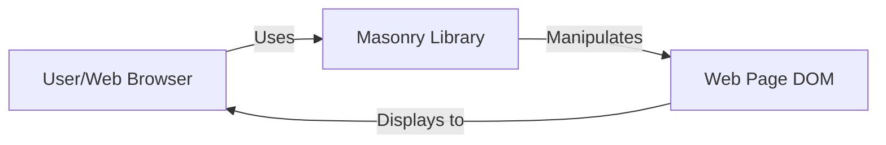
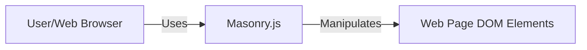
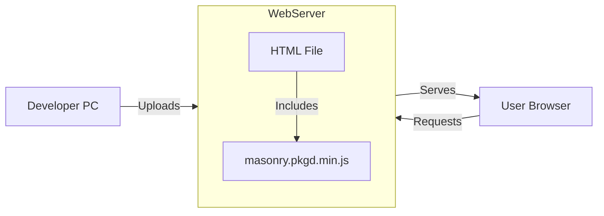
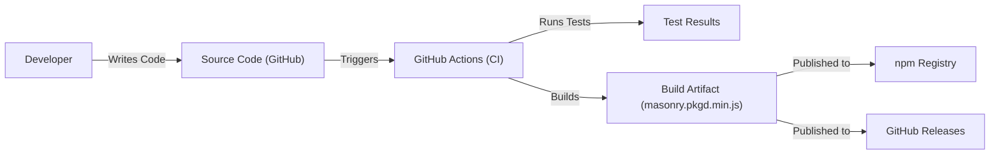

# BUSINESS POSTURE

Business Priorities and Goals:

*   Provide a fast, lightweight, and dependency-free JavaScript library for creating dynamic grid layouts.
*   Offer a simple and easy-to-use API for developers of all skill levels.
*   Ensure cross-browser compatibility and responsiveness.
*   Maintain a small library size to minimize performance impact on websites.
*   Foster an open-source community for contributions and support.

Most Important Business Risks:

*   Malicious code injection through manipulated DOM elements or user-provided content, leading to XSS vulnerabilities.
*   Denial of Service (DoS) attacks targeting the library's layout algorithm, causing performance degradation or crashes.
*   Compatibility issues with future browser updates or other JavaScript libraries, breaking existing implementations.
*   Lack of adoption due to competition from other grid layout libraries or native CSS solutions.
*   Reputational damage due to unaddressed security vulnerabilities or poor performance.

# SECURITY POSTURE

Existing Security Controls:

*   security control: The library itself doesn't directly handle user input or external data, reducing the attack surface. It primarily operates on DOM elements provided by the developer. (Implicit in the library's design and purpose).
*   security control: Dependency-free nature minimizes the risk of supply chain attacks through third-party libraries. (Mentioned in the repository description).
*   security control: The project is open-source, allowing for community review and contributions to identify and fix potential security issues. (GitHub repository).

Accepted Risks:

*   accepted risk: The library relies on the developer to properly sanitize any user-provided content before using it to create or modify DOM elements. This places the responsibility for preventing XSS vulnerabilities on the developer using Masonry.
*   accepted risk: The library's performance may be affected by excessively complex layouts or a large number of grid items. This is inherent to the nature of dynamic grid layouts.

Recommended Security Controls:

*   security control: Implement a Content Security Policy (CSP) to mitigate the impact of potential XSS vulnerabilities. This should be documented as a recommended practice for developers using Masonry.
*   security control: Add unit tests that specifically target potential edge cases and error conditions in the layout algorithm to improve robustness and prevent unexpected behavior.
*   security control: Conduct regular security audits and code reviews to identify and address potential vulnerabilities proactively.

Security Requirements:

*   Authentication: Not applicable, as Masonry is a client-side library that doesn't handle user authentication.
*   Authorization: Not applicable, as Masonry doesn't manage user roles or permissions.
*   Input Validation: While Masonry itself doesn't directly handle user input, it's crucial for developers using the library to validate and sanitize any user-provided content before using it to manipulate the DOM. This should be clearly emphasized in the documentation.
*   Cryptography: Not applicable, as Masonry doesn't handle sensitive data or require cryptographic operations.

# DESIGN

## C4 CONTEXT

Element Descriptions:

*   Element:
    *   Name: User/Web Browser
    *   Type: User
    *   Description: The end-user interacting with a web page that utilizes Masonry.
    *   Responsibilities:
        *   Initiates requests to web pages.
        *   Renders HTML, CSS, and JavaScript.
        *   Displays the web page content to the user.
        *   Handles user interactions with the web page.
    *   Security controls:
        *   Browser security features (e.g., same-origin policy, XSS filters).
        *   User-configured security settings.

*   Element:
    *   Name: Masonry Library
    *   Type: JavaScript Library
    *   Description: The Masonry library responsible for creating the dynamic grid layout.
    *   Responsibilities:
        *   Calculates the positions of grid items.
        *   Manipulates the DOM to arrange grid items.
        *   Handles layout updates triggered by window resizing or content changes.
    *   Security controls:
        *   Dependency-free design.
        *   Open-source codebase for community review.

*   Element:
    *   Name: Web Page DOM
    *   Type: Data
    *   Description: The Document Object Model (DOM) of the web page, which Masonry manipulates to create the grid layout.
    *   Responsibilities:
        *   Represents the structure and content of the web page.
        *   Provides an interface for JavaScript to interact with the page.
    *   Security controls:
        *   Developer-implemented input sanitization and validation.
        *   Content Security Policy (CSP) enforced by the browser.

## C4 CONTAINER

Element Descriptions:

*   Element:
    *   Name: User/Web Browser
    *   Type: User
    *   Description: The end-user interacting with a web page that utilizes Masonry.
    *   Responsibilities:
        *   Initiates requests to web pages.
        *   Renders HTML, CSS, and JavaScript.
        *   Displays the web page content to the user.
        *   Handles user interactions with the web page.
    *   Security controls:
        *   Browser security features (e.g., same-origin policy, XSS filters).
        *   User-configured security settings.

*   Element:
    *   Name: Masonry.js
    *   Type: JavaScript Library File
    *   Description: The compiled JavaScript file containing the Masonry library code.
    *   Responsibilities:
        *   Provides the core functionality for creating and managing grid layouts.
        *   Exposes an API for developers to interact with the library.
    *   Security controls:
        *   Dependency-free design.
        *   Open-source codebase for community review.

*   Element:
    *   Name: Web Page DOM Elements
    *   Type: DOM Elements
    *   Description: Specific DOM elements within the web page that are managed by Masonry to create the grid layout.
    *   Responsibilities:
        *   Represent the individual grid items.
        *   Contain the content to be displayed in the grid.
    *   Security controls:
        *   Developer-implemented input sanitization and validation.

## DEPLOYMENT

Possible Deployment Solutions:

1.  Direct inclusion via `<script>` tag: The developer downloads the `masonry.pkgd.min.js` file and includes it directly in their HTML using a `<script>` tag.
2.  Package managers (npm, Bower): The developer installs Masonry as a dependency using a package manager like npm or Bower. This typically involves adding Masonry to the project's `package.json` file and running an install command.
3.  CDN: The developer includes Masonry from a Content Delivery Network (CDN) using a `<script>` tag with a URL pointing to the CDN-hosted file.

Chosen Solution (Direct Inclusion):

Element Descriptions:

*   Element:
    *   Name: Developer PC
    *   Type: Workstation
    *   Description: The developer's computer used to write and upload code.
    *   Responsibilities:
        *   Code editing and development.
        *   Uploading files to the web server.
    *   Security controls:
        *   Developer's security practices (e.g., strong passwords, secure coding habits).

*   Element:
    *   Name: Web Server
    *   Type: Server
    *   Description: The server hosting the web page and the Masonry library.
    *   Responsibilities:
        *   Storing and serving web files (HTML, CSS, JavaScript).
        *   Handling HTTP requests from clients.
    *   Security controls:
        *   Server-side security measures (e.g., firewalls, intrusion detection systems).
        *   Secure configuration of the web server software.

*   Element:
    *   Name: User Browser
    *   Type: Client Application
    *   Description: The user's web browser used to access the web page.
    *   Responsibilities:
        *   Requesting web pages from the server.
        *   Rendering HTML, CSS, and JavaScript.
        *   Displaying the web page to the user.
    *   Security controls:
        *   Browser security features (e.g., same-origin policy, XSS filters).

*   Element:
    *   Name: HTML File
    *   Type: File
    *   Description: The HTML file of the web page that includes the Masonry library.
    *   Responsibilities:
        *   Defines the structure and content of the web page.
        *   Includes the `<script>` tag to load Masonry.
    *   Security controls:
        *   Developer-implemented input sanitization and validation.

*   Element:
    *   Name: masonry.pkgd.min.js
    *   Type: File
    *   Description: The minified JavaScript file containing the Masonry library.
    *   Responsibilities:
        *   Provides the functionality for creating the grid layout.
    *   Security controls:
        *   Dependency-free design.

## BUILD

Build Process Description:

1.  Developer: The developer writes and modifies the Masonry source code.
2.  Source Code: The code is stored in a GitHub repository.
3.  GitHub Actions: Changes pushed to the repository trigger GitHub Actions, a CI/CD platform.
4.  Runs Tests: GitHub Actions executes the defined test suite (likely unit tests) to ensure code quality and functionality.
5.  Build Artifact: If the tests pass, GitHub Actions builds the production-ready, minified version of the library (`masonry.pkgd.min.js`).
6.  npm Registry: The build artifact is published to the npm registry, making it available for installation via npm.
7.  GitHub Releases: The build artifact is also published as part of a GitHub Release, allowing users to download it directly from the repository.

Security Controls:

*   security control: Automated testing (unit tests) in GitHub Actions helps to identify and prevent regressions and potential vulnerabilities.
*   security control: The build process is automated through GitHub Actions, reducing the risk of manual errors and ensuring consistency.
*   security control: Publishing to npm, a widely used and reputable package registry, provides a degree of trust and verification.
*   security control: GitHub's built-in security features, such as code scanning and vulnerability alerts, can be leveraged to further enhance security.

# RISK ASSESSMENT

Critical Business Processes:

*   Providing a functional and reliable grid layout library.
*   Maintaining a positive reputation and user trust.
*   Ensuring the library's continued use and adoption.

Data Protection:

*   Masonry itself does not handle or store any user data directly.
*   The primary concern is the potential for malicious code injection (XSS) if developers using Masonry do not properly sanitize user-provided content that is used to create or modify DOM elements.
*   Data Sensitivity: The sensitivity of the data depends on the content displayed within the grid layout, which is entirely controlled by the developer using Masonry. Masonry itself does not handle sensitive data.

# QUESTIONS & ASSUMPTIONS

Questions:

*   Are there any specific performance requirements or limitations for Masonry?
*   Are there any plans to integrate Masonry with specific JavaScript frameworks or libraries?
*   What is the process for reporting and addressing security vulnerabilities discovered in Masonry?
*   What level of browser compatibility is required?

Assumptions:

*   BUSINESS POSTURE: The primary goal is to provide a free, open-source, and easy-to-use grid layout library.
*   SECURITY POSTURE: Developers using Masonry are responsible for handling user input and implementing appropriate security measures to prevent XSS vulnerabilities.
*   DESIGN: The library is designed to be lightweight and dependency-free, minimizing its impact on web page performance.
*   DESIGN: The library will be used primarily for displaying static content, and dynamic content updates will be handled responsibly by the developer using Masonry.