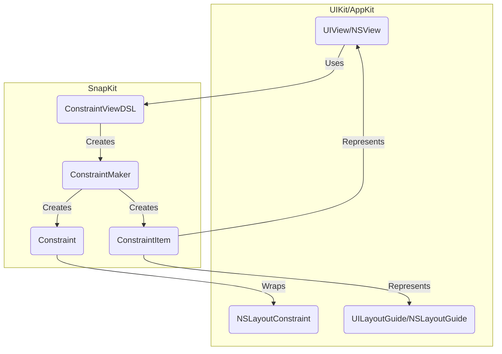

## Project Design Document: SnapKit (Improved)

**1. Introduction**

This document provides an enhanced design overview of the SnapKit library, a Swift DSL (Domain Specific Language) designed to simplify Auto Layout in Apple platform development (iOS, macOS, tvOS, watchOS). This detailed description of SnapKit's architecture, components, and data flow is specifically intended to facilitate thorough threat modeling activities.

**2. Project Overview**

* **Project Name:** SnapKit
* **Project Repository:** [https://github.com/SnapKit/SnapKit](https://github.com/SnapKit/SnapKit)
* **Project Goal:** To offer a more intuitive, readable, and concise syntax for defining Auto Layout constraints in Swift, replacing the more verbose and less maintainable traditional `NSLayoutConstraint` API.
* **Target Platforms:** iOS, macOS, tvOS, watchOS
* **Primary Users:** Developers building applications for Apple platforms who utilize Auto Layout for creating dynamic and adaptable user interfaces.

**3. Architectural Overview**

SnapKit is implemented as a lightweight Swift library that augments the capabilities of `UIView` (and its platform-specific counterparts like `NSView`). It achieves this through Swift extensions and a fluent, chainable interface, enabling developers to express layout constraints in a declarative style.

The fundamental architectural elements of SnapKit are:

* **`ConstraintMaker`:** The core class responsible for the construction and management of layout constraints. It offers a chainable API for specifying the attributes, relationships, and modifiers of a constraint.
* **`ConstraintItem`:** Represents a specific attribute of a view or layout guide that is being constrained (e.g., the `top` of a view, the `width` of a layout guide).
* **`Constraint`:**  An abstraction representing a single Auto Layout constraint. SnapKit encapsulates the underlying platform-specific constraint object (`NSLayoutConstraint` or its equivalent) and provides methods for activation, deactivation, and modification.
* **Extensions on `UIView` (and `NSView`):** SnapKit extends `UIView` (and `NSView`) with computed properties and methods (within the `snp` namespace) to initiate the constraint definition process in a convenient manner (e.g., `snp.makeConstraints`, `snp.remakeConstraints`, `snp.updateConstraints`).
* **Layout Guide Integration:** SnapKit provides seamless support for `UILayoutGuide` and `NSLayoutGuide`, allowing developers to define constraints relative to these guides as easily as to views.

**4. Component Details**

* **`ConstraintMaker`:**
    * **Responsibilities:**
        * Serves as the entry point for defining new constraints or modifying existing ones.
        * Holds a reference to the primary `ConstraintItem` being constrained.
        * Provides a fluent interface for selecting the attribute to be constrained (e.g., `top`, `leading`, `width`).
        * Offers methods for specifying the relationship to another `ConstraintItem` (e.g., `equalTo`, `greaterThanOrEqualTo`).
        * Enables the definition of the related `ConstraintItem` and its attribute.
        * Allows setting constant offsets and multiplicative factors.
        * Ultimately creates and activates the underlying platform-specific layout constraint.
    * **Key Methods:**
        * `makeConstraints(_ maker: (ConstraintMaker) -> Void)`:  The primary method for adding new constraints to a view.
        * `remakeConstraints(_ maker: (ConstraintMaker) -> Void)`: Removes all existing SnapKit-managed constraints on a view and creates new ones.
        * `updateConstraints(_ maker: (ConstraintMaker) -> Void)`: Modifies existing SnapKit-managed constraints on a view that match the defined attributes.
        * Attribute accessors (e.g., `.top`, `.bottom`, `.leading`, `.trailing`, `.width`, `.height`, `.centerX`, `.centerY`, `.edges`, `.size`, `.center`, `.safeAreaLayoutGuide`, `.contentLayoutGuide`, `.frameLayoutGuide`).
        * Relationship methods (e.g., `.equalTo(_:)`, `.greaterThanOrEqualTo(_:)`, `.lessThanOrEqualTo(_:)`).
        * Modifier methods (e.g., `.offset(_:)`, `.inset(_:)`, `.multipliedBy(_:)`, `.priority(_:)`).

* **`ConstraintItem`:**
    * **Responsibilities:**
        * Encapsulates either a `UIView` (or `NSView`) or a `UILayoutGuide` (or `NSLayoutGuide`).
        * Represents a specific layout attribute of the encapsulated item.
        * Used internally by `ConstraintMaker` to represent the items involved in a constraint.
    * **Key Properties:**
        * `view`: An optional reference to the underlying `UIView` or `NSView`.
        * `layoutGuide`: An optional reference to the underlying `UILayoutGuide` or `NSLayoutGuide`.
        * `attribute`: The specific layout attribute being referenced (e.g., `.top`, `.width`).

* **`Constraint`:**
    * **Responsibilities:**
        * Wraps an instance of `NSLayoutConstraint` (or its platform equivalent).
        * Provides methods for programmatically activating and deactivating the constraint.
        * Allows for updating the constant value of the constraint after it has been created.
    * **Key Methods:**
        * `activate()`: Activates the underlying platform layout constraint.
        * `deactivate()`: Deactivates the underlying platform layout constraint.
        * `update(offset:)`: Modifies the constant value of the constraint.

* **Extensions on `UIView` (and `NSView`):**
    * **Responsibilities:**
        * Introduces the `snp` namespace to provide access to SnapKit's constraint management functionality.
        * Offers the primary methods for initiating constraint definition, modification, and removal.
    * **Key Properties:**
        * `snp`: A computed property that returns a `ConstraintViewDSL` instance, which provides access to `makeConstraints`, `remakeConstraints`, and `updateConstraints`.

**5. Data Flow and Constraint Creation Process**

The typical sequence of actions when creating constraints using SnapKit is as follows:

```mermaid
graph LR
    A("Developer invokes `view.snp.makeConstraints { make in ... }`") --> B("`ConstraintViewDSL` instantiates a `ConstraintMaker`");
    B --> C("Developer uses `ConstraintMaker` methods to define constraints (e.g., `make.top.equalTo(superview.snp.top).offset(20)`)");
    C --> D("`ConstraintMaker` creates `ConstraintItem` instances representing the involved views/layout guides and their attributes");
    D --> E("`ConstraintMaker` creates and configures the underlying platform `NSLayoutConstraint` (or equivalent)");
    E --> F("`ConstraintMaker` activates the newly created `NSLayoutConstraint`");
    F --> G("The Auto Layout engine applies the defined constraints to manage the view's layout");
```

**Detailed Breakdown of Data Flow:**

1. **Initiation:** The developer initiates the constraint definition process by calling one of the constraint management methods (`makeConstraints`, `remakeConstraints`, `updateConstraints`) on the `snp` property of a `UIView` (or `NSView`).
2. **`ConstraintMaker` Instantiation:** The `ConstraintViewDSL` (accessed through the `snp` property) creates a new `ConstraintMaker` instance. This instance will be responsible for managing the constraints being defined within the provided closure.
3. **Constraint Definition:** Inside the closure passed to the constraint management method, the developer utilizes the fluent API of the `ConstraintMaker` to define individual constraints. This involves specifying:
    * The attribute of the view being constrained (e.g., `.top`, `.width`).
    * The relationship to another item (e.g., `.equalTo`, `.greaterThanOrEqualTo`).
    * The related item and its attribute (which might involve accessing the `snp` property of another view to create a `ConstraintMaker` for it).
    * Optional modifiers such as constant offsets, insets, or multipliers.
4. **`ConstraintItem` Creation:** As the developer defines constraints using the `ConstraintMaker`'s methods, the `ConstraintMaker` internally creates `ConstraintItem` instances. These instances encapsulate the views or layout guides and their specific attributes that are participating in the constraint.
5. **Platform Constraint Creation and Configuration:** Once a complete constraint definition is provided (e.g., `make.top.equalTo(superview.snp.top).offset(20)`), the `ConstraintMaker` creates an instance of the appropriate platform-specific layout constraint object (`NSLayoutConstraint` on iOS/macOS). It configures the properties of this object (`firstItem`, `firstAttribute`, `relation`, `secondItem`, `secondAttribute`, `multiplier`, and `constant`) based on the information provided through the `ConstraintMaker`'s API.
6. **Constraint Activation:** The `ConstraintMaker` then activates the newly created platform layout constraint. This typically involves setting the `isActive` property of the `NSLayoutConstraint` to `true`.
7. **Auto Layout Engine Engagement:** The activated `NSLayoutConstraint` is then managed by the operating system's Auto Layout engine. This engine calculates and applies the layout based on all active constraints in the view hierarchy.

**6. Dependencies**

SnapKit has a minimal set of dependencies, primarily relying on the underlying platform's Auto Layout framework:

* **iOS/tvOS/watchOS:**  The `UIKit` framework (specifically `UIView`, `NSLayoutConstraint`, `UILayoutGuide`).
* **macOS:** The `AppKit` framework (specifically `NSView`, `NSLayoutConstraint`, `NSLayoutGuide`).

**7. Deployment**

SnapKit is typically integrated into Xcode projects using common Swift dependency management tools:

* **Swift Package Manager (SPM):** By adding SnapKit as a dependency within the `dependencies` array of the `Package.swift` manifest file.
* **CocoaPods:** By specifying SnapKit as a dependency in the project's `Podfile`.
* **Carthage:** By including SnapKit in the project's `Cartfile`.

After integration, developers can import the `SnapKit` module in their Swift source files to begin using its features.

**8. Security Considerations (For Threat Modeling)**

While SnapKit's primary function is UI layout, it's important to consider potential security implications, especially when dealing with dynamic layouts or data influenced by external sources:

* **Denial of Service (DoS) via Constraint Bombs:**  Malicious or poorly designed code could intentionally create an extremely large number of constraints. This could lead to excessive computational overhead for the Auto Layout engine, potentially freezing the UI, consuming excessive resources, and causing the application to become unresponsive. Consider scenarios where user input or remote data could influence the number of constraints created.
* **Unexpected Layout Manipulation Leading to Information Obfuscation/Disclosure:** While not a direct data breach, manipulating constraints in unexpected ways could obscure critical UI elements or, conversely, reveal information that should be hidden. For example, constraints could be dynamically altered to move sensitive information into the visible area or hide important warnings. This is more relevant in applications displaying sensitive data or requiring strict UI integrity.
* **Resource Exhaustion through Constraint Leaks:** If constraints are not properly deactivated or removed when no longer needed, they can accumulate, leading to memory leaks and performance degradation over time. While SnapKit helps manage constraints, improper usage patterns could still lead to this issue. Consider the lifecycle management of views and their associated constraints.
* **Integer Overflow/Underflow in Constraint Calculations (Theoretical):** While less likely with modern Auto Layout implementations, theoretically, manipulating very large or very small constant values or multipliers could potentially lead to integer overflow or underflow issues within the underlying layout calculations. This could result in unexpected layout behavior.
* **Injection through String-Based Constraint Definitions (If any):**  While SnapKit primarily uses a type-safe DSL, if there were any mechanisms to define constraints using string-based formats (which is not the primary approach), this could open up potential injection vulnerabilities if those strings are derived from untrusted sources. *Note: SnapKit does not inherently offer string-based constraint definition in a way that would be directly vulnerable to injection.*

**9. Diagrams**

**Component Diagram:**



**Constraint Creation Flowchart (as detailed in Section 5):**

```mermaid
graph LR
    A("Developer invokes `view.snp.makeConstraints { make in ... }`") --> B("`ConstraintViewDSL` instantiates a `ConstraintMaker`");
    B --> C("Developer uses `ConstraintMaker` methods to define constraints (e.g., `make.top.equalTo(superview.snp.top).offset(20)`)");
    C --> D("`ConstraintMaker` creates `ConstraintItem` instances representing the involved views/layout guides and their attributes");
    D --> E("`ConstraintMaker` creates and configures the underlying platform `NSLayoutConstraint` (or equivalent)");
    E --> F("`ConstraintMaker` activates the newly created `NSLayoutConstraint`");
    F --> G("The Auto Layout engine applies the defined constraints to manage the view's layout");
```

**10. Future Considerations**

* In-depth performance analysis of SnapKit's overhead in scenarios with a very large number of dynamically updated constraints.
* Examination of potential edge cases or error conditions during constraint creation, modification, and removal, and how SnapKit handles these scenarios.
* A dedicated threat modeling session utilizing this design document to systematically identify and assess potential security vulnerabilities and propose mitigation strategies. This should involve considering various attack vectors and the potential impact of successful exploits.
* Investigation into tools or techniques for automatically detecting potential constraint-related performance issues or security vulnerabilities during development.

This improved design document provides a more detailed and nuanced understanding of the SnapKit library, specifically tailored for use in threat modeling activities. The expanded security considerations section offers more concrete examples of potential issues, and the refined descriptions aim for greater clarity and accuracy.
