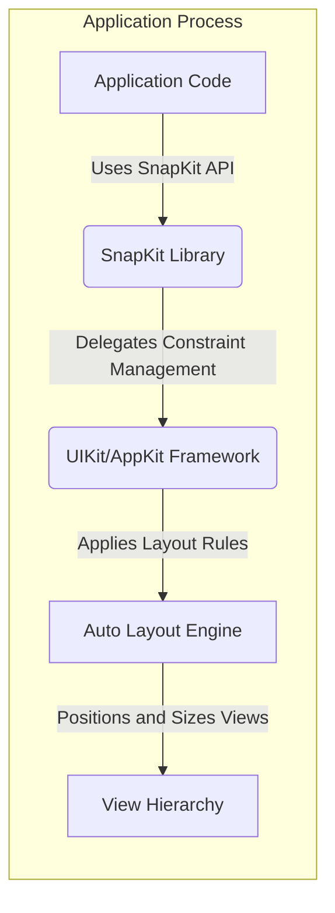
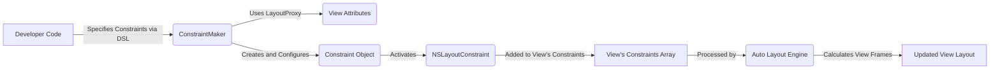

# Project Design Document: SnapKit

**Version:** 1.1
**Date:** October 26, 2023
**Author:** Gemini (AI Architecture Expert)

## 1. Introduction

This document details the architectural design of SnapKit, a Swift DSL that streamlines Auto Layout implementation within Apple platform applications (iOS, macOS, tvOS, and watchOS). The primary purpose of this document is to provide a clear and comprehensive understanding of SnapKit's internal structure and operation, serving as a crucial artifact for subsequent threat modeling exercises. SnapKit enhances developer productivity by offering a more expressive and maintainable syntax for defining layout constraints compared to the verbose native `NSLayoutConstraint` API.

## 2. Goals and Objectives

SnapKit's core goals are to:

* **Abstraction of Complexity:** Shield developers from the intricacies of manual `NSLayoutConstraint` creation and management.
* **Enhanced Code Clarity:**  Promote more readable and self-documenting layout code.
* **Reduced Development Time:**  Accelerate the process of implementing and modifying UI layouts.
* **Improved Code Maintainability:** Simplify the process of updating and debugging layout logic.
* **Cross-Platform Consistency:** Provide a unified approach to Auto Layout across supported Apple platforms.

This design document aims to:

* Clearly articulate the responsibilities and interactions of SnapKit's key architectural components.
* Illustrate the flow of data and control during the constraint definition and activation process.
* Define the boundaries and integration points between SnapKit and the underlying operating system frameworks.
* Establish a solid foundation for identifying potential security vulnerabilities and attack vectors related to the use of SnapKit within an application.

## 3. High-Level Architecture

SnapKit functions as an in-process library directly integrated into the application's codebase. It does not involve any external network communication, persistent data storage, or separate services in its core functionality. Its primary interaction is with the platform-specific UI frameworks (UIKit for iOS, tvOS, watchOS; AppKit for macOS) and their respective Auto Layout engines.

* **Application Code:** The Swift code written by the application developer that utilizes SnapKit's API to define UI layout constraints.
* **SnapKit Library:** The collection of Swift classes, extensions, and protocols that constitute the SnapKit DSL.
* **UIKit/AppKit Framework:** Apple's frameworks providing the foundation for building user interfaces, including the Auto Layout system.
* **Auto Layout Engine:** The operating system component responsible for calculating and applying layout constraints to determine the size and position of views.
* **View Hierarchy:** The tree-like structure representing the UI elements within the application.

## 4. Detailed Design

SnapKit's architecture is centered around providing a fluent and expressive interface for constraint management. The key components and their roles are:

* **`ConstraintMaker`:**
    * The primary entry point for creating constraints on a specific view.
    * Provides a chainable API to specify the view's attributes to be constrained (e.g., `top`, `bottom`, `leading`, `trailing`, `width`, `height`, `centerX`, `centerY`).
    * Offers methods to define the relationship between attributes (e.g., `equalTo`, `greaterThanOrEqualTo`, `lessThanOrEqualTo`).
    * Allows setting constant offsets and multipliers to fine-tune constraint relationships.
    * Internally manages the creation and activation of `NSLayoutConstraint` instances.

* **`ConstraintViewDSL`:**
    * An extension applied to `UIView` (and `NSView` on macOS) that introduces the `snp` property.
    * The `snp` property provides convenient access to a `ConstraintMaker` instance specifically associated with that view.
    * This enables developers to start defining constraints directly from a view instance using syntax like `myView.snp.makeConstraints { make in ... }`.

* **`Constraint` (Protocol and Implementations):**
    * A protocol defining the common interface for managing layout constraints.
    * Concrete implementations (internal to SnapKit) encapsulate the underlying `NSLayoutConstraint` object.
    * Provides methods to `activate()`, `deactivate()`, `update(offset:)`, `update(inset:)`, and `constraint` (to access the underlying `NSLayoutConstraint`).

* **`LayoutProxy`:**
    * An internal helper class representing a specific layout attribute of a view (e.g., `view.snp.top`, `view.snp.width`).
    * Facilitates the fluent syntax by acting as an intermediary in the constraint definition chain.
    * Holds references to the associated view and the specific attribute being targeted.

* **`MultipliedBy` and `DividedBy`:**
    * Structures used to apply multiplicative factors to constraint relationships.
    * Enable proportional sizing and positioning of views.

* **`Offset` and `Inset`:**
    * Structures used to add constant offsets or insets to constraint relationships.
    * Allow for precise adjustments to view positioning.

**Detailed Workflow of Constraint Creation:**

1. The developer accesses the `snp` property of a `UIView` or `NSView`.
2. This returns an instance of `ConstraintMaker`.
3. The developer uses the `ConstraintMaker`'s methods (e.g., `makeConstraints`, `updateConstraints`, `remakeConstraints`) to begin defining constraints within a closure.
4. Inside the closure, the developer accesses specific view attributes via the `ConstraintMaker` (e.g., `make.top`). This returns a `LayoutProxy`.
5. The developer then specifies the relationship to another attribute or constant using methods like `equalTo()`, passing in another `LayoutProxy` or a constant value. This often involves `MultipliedBy`, `DividedBy`, `Offset`, or `Inset`.
6. Internally, SnapKit creates and configures the corresponding `NSLayoutConstraint` object.
7. The `Constraint` object is then activated, adding the `NSLayoutConstraint` to the appropriate view's constraints array.

```mermaid
graph LR
    A["UIView/NSView"] -- "access snp property" --> B("ConstraintViewDSL");
    B -- "returns" --> C("ConstraintMaker");
    C -- "access attribute (e.g., .top)" --> D("LayoutProxy");
    D -- "define relationship (e.g., .equalTo)" --> E("LayoutProxy or Constant");
    E -- "creates and configures" --> F("Constraint Object");
    F -- "activates" --> G("NSLayoutConstraint");
```

## 5. Data Flow

The primary data flow within SnapKit revolves around the definition and activation of layout constraints.

1. **Constraint Specification:** The developer's code provides the declarative specification of the desired layout constraints using SnapKit's DSL. This includes identifying the views involved, the attributes to be constrained, and the relationships between them, along with any multipliers or offsets.

2. **`ConstraintMaker` Processing:** The `ConstraintMaker` receives the developer's specifications and orchestrates the creation of `Constraint` objects. It uses `LayoutProxy` instances to represent the involved view attributes.

3. **`NSLayoutConstraint` Instantiation and Configuration:** The `Constraint` object encapsulates the creation and configuration of the underlying `NSLayoutConstraint` instance, based on the parameters provided through the `ConstraintMaker`.

4. **Constraint Activation:** When the `Constraint` is activated, the encapsulated `NSLayoutConstraint` is added to the appropriate view's `constraints` array, making it active within the Auto Layout engine.

5. **Layout Engine Calculation:** The Auto Layout engine processes all active constraints in the view hierarchy to calculate the optimal frames (position and size) for each view.

## 6. Security Considerations (Preliminary)

While SnapKit primarily deals with UI layout and doesn't inherently handle sensitive data or network communication, potential security considerations can arise from its usage within an application:

* **Denial of Service (DoS) via Constraint Bombs:** A malicious actor or a vulnerability in application logic could lead to the creation of an extremely large number of complex and conflicting constraints. This "constraint bomb" could overwhelm the Auto Layout engine, leading to excessive CPU and memory consumption, potentially freezing the UI or crashing the application. This is primarily an application-level concern but highlights the potential impact of uncontrolled constraint creation.

* **Logic Errors Leading to UI Spoofing/Deception:** Incorrect or malicious usage of SnapKit could result in unexpected or misleading UI layouts. An attacker might exploit this to create UI elements that mimic legitimate system interfaces or overlay genuine content with deceptive elements, potentially leading to phishing or other social engineering attacks.

* **Resource Exhaustion through Inefficient Layouts:** While not a direct vulnerability in SnapKit itself, poorly designed layouts using SnapKit could lead to inefficient layout calculations, consuming excessive resources (CPU, memory, battery). This could degrade the user experience and potentially make the device more susceptible to other attacks if resources are depleted.

* **Indirect Code Injection (Application Level):** If an attacker can inject arbitrary code into the application that uses SnapKit, they could potentially manipulate the layout logic to achieve malicious goals. This is a broader application security issue, but the flexibility of SnapKit could be a tool used in such attacks.

**Threats to be considered during Threat Modeling:**

* **Malicious Constraint Manipulation:** Could an attacker influence the constraint logic to cause UI rendering issues, DoS, or deceptive UI?
* **Unintended Constraint Conflicts:** Can uncontrolled or poorly managed constraints lead to unexpected behavior or resource issues?
* **Information Disclosure via UI Layout:** Could the layout be manipulated to reveal sensitive information that should be hidden or obscured?

## 7. Deployment Model

SnapKit is typically integrated into application projects using dependency management tools:

* **Swift Package Manager (SPM):** The recommended approach for modern Swift projects. Developers add the SnapKit repository URL as a package dependency in their `Package.swift` file or through Xcode's UI.
* **CocoaPods:** A popular dependency manager for Objective-C and Swift projects. SnapKit is specified in a `Podfile`, and dependencies are installed using the `pod install` command.
* **Carthage:** A decentralized dependency manager. SnapKit is listed in a `Cartfile`, and dependencies are built using the `carthage update` command.

Once integrated, the SnapKit library is linked with the application binary and runs entirely within the application's process space.

## 8. Dependencies

SnapKit has minimal external dependencies. Its core functionality relies primarily on:

* **Swift Standard Library:**  Provides fundamental data types and functionalities.
* **UIKit (for iOS, tvOS, watchOS):**  Provides the basic building blocks for iOS application user interfaces, including `UIView` and `NSLayoutConstraint`.
* **AppKit (for macOS):**  Provides the basic building blocks for macOS application user interfaces, including `NSView` and `NSLayoutConstraint`.

## 9. Assumptions and Constraints

* **Trust in Underlying Frameworks:** SnapKit relies on the correct and secure implementation of Apple's UIKit/AppKit and Auto Layout frameworks.
* **Developer Responsibility:** Developers are responsible for using SnapKit correctly and avoiding the creation of malicious or excessively complex constraint scenarios.
* **In-Process Execution:** SnapKit code executes within the security context of the application process.
* **No Implicit Network Activity:** The core functionality of SnapKit does not involve any network communication.

## 10. Future Considerations

Potential future developments or extensions of SnapKit could introduce new security considerations:

* **Integration with Declarative UI Frameworks (e.g., SwiftUI):** If SnapKit were to be adapted for use within more declarative UI frameworks, the interaction model and potential security implications might change.
* **Server-Driven UI Layout with SnapKit:** If SnapKit were used to interpret layout instructions received from a remote server, vulnerabilities related to data integrity, authentication, and malicious server responses would need to be addressed.

This detailed design document provides a comprehensive overview of SnapKit's architecture and operation. This information is essential for effectively conducting threat modeling and identifying potential security risks associated with its use in application development.