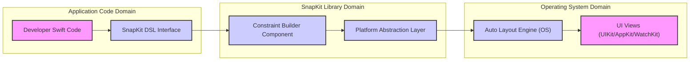

Okay, I will improve the SnapKit project design document based on your feedback. Here is the improved version, focusing on clarity, detail, and security considerations for threat modelling, while adhering to markdown formatting, mermaid syntax, and using lists instead of tables.

```markdown
# Project Design Document: SnapKit (Improved)

## 1. Project Overview

### 1.1. Project Name
SnapKit

### 1.2. Project Description
SnapKit is a Swift-based Domain Specific Language (DSL) designed to streamline the creation and management of Auto Layout constraints within Apple ecosystem applications (iOS, macOS, tvOS, and watchOS). It offers a more developer-friendly, readable, and concise syntax for programmatically defining UI layouts compared to directly using Apple's standard Auto Layout APIs. The primary goal of SnapKit is to boost developer efficiency and enhance the maintainability of UI layout code in Swift projects.

### 1.3. Project Goals
*   **Abstraction of Auto Layout Complexity:** To abstract away the verbosity and complexity of native Auto Layout API, providing a simpler interface.
*   **Improved Code Readability:** To significantly improve the readability of layout code, making it easier to understand and maintain.
*   **Reduced Code Boilerplate:** To minimize the amount of repetitive code required for constraint creation and management, leading to cleaner codebases.
*   **Cross-Platform Support:** To ensure consistent and reliable constraint definition across iOS, macOS, tvOS, and watchOS platforms, simplifying cross-platform development.
*   **Seamless Integration:** To be easily integrated into both new and existing Swift projects with minimal configuration.
*   **Enhanced Developer Productivity:** To ultimately increase developer productivity by reducing the time and effort spent on UI layout tasks.

### 1.4. Target Audience
*   Swift developers working on iOS, macOS, tvOS, and watchOS applications who utilize Auto Layout for UI design.
*   Developers seeking a more efficient, expressive, and maintainable approach to programmatic UI layout definition.
*   Teams looking to standardize and simplify Auto Layout practices across their projects.

## 2. System Architecture

### 2.1. High-Level Architecture Diagram



**Diagram Description:**

*   **"Developer Swift Code"**: Represents the Swift code written by application developers. This is the entry point where developers utilize SnapKit to define UI layouts.
*   **"SnapKit DSL Interface"**:  This is the Domain Specific Language exposed by SnapKit. Developers interact with this interface using Swift syntax to express layout constraints in a declarative manner.
*   **"Constraint Builder Component"**:  The core component within the SnapKit library responsible for parsing the DSL instructions and translating them into concrete Auto Layout constraint objects (`NSLayoutConstraint` or `LayoutAnchor` based).
*   **"Platform Abstraction Layer"**: This layer within SnapKit handles the platform-specific differences between UIKit (iOS/tvOS), AppKit (macOS), and WatchKit (watchOS) Auto Layout implementations. It ensures a consistent API for developers regardless of the target platform.
*   **"Auto Layout Engine (OS)"**: The underlying Auto Layout engine provided by the operating system (iOS, macOS, watchOS). SnapKit leverages this engine to perform the actual layout calculations and constraint resolution.
*   **"UI Views (UIKit/AppKit/WatchKit)"**: The UI elements (views) that are being positioned and sized on the screen based on the Auto Layout constraints defined using SnapKit.

### 2.2. Component Description

*   **SnapKit DSL (Domain Specific Language):**
    *   **Purpose:** Provides a fluent and expressive Swift syntax for defining Auto Layout constraints programmatically.
    *   **Features:**
        *   Method chaining for concise constraint definitions (e.g., `view.snp.makeConstraints { make in ... }`).
        *   Closure-based syntax for grouping related constraints.
        *   Properties representing common constraint attributes: `top`, `bottom`, `leading`, `trailing`, `width`, `height`, `centerX`, `centerY`, `edges`, `size`, `center`.
        *   Relational operators: `equalTo`, `greaterThanOrEqualTo`, `lessThanOrEqualTo`.
        *   Support for multipliers and offsets in constraints.
        *   Ability to define constraints relative to superviews, sibling views, and the view itself.
        *   Intuitive syntax for updating and removing constraints.

*   **SnapKit Library Core:**
    *   **Constraint Builder:**
        *   **Functionality:** Parses the SnapKit DSL code and constructs corresponding `NSLayoutConstraint` objects (or utilizes `NSLayoutAnchor` for newer APIs).
        *   **Input:** SnapKit DSL expressions written in Swift.
        *   **Output:** Array of `NSLayoutConstraint` objects ready to be activated.
    *   **View Extensions (`snp` namespace):**
        *   **Purpose:** Extends `UIView`, `UIViewController`, and other relevant UI classes to provide the `snp` namespace as the entry point for using the SnapKit DSL.
        *   **Mechanism:** Uses Swift extensions to add the `snp` property, which provides access to constraint-related functionalities.
    *   **Constraint Management Utilities:**
        *   **Functionality:** Provides helper methods and utilities for managing constraints created with SnapKit, including:
            *   Activation and deactivation of constraints.
            *   Updating constraint constants and priorities.
            *   Removing constraints.
            *   Retrieving existing constraints.
    *   **Platform Abstraction Layer:**
        *   **Purpose:**  Handles differences in Auto Layout implementations across different Apple platforms (UIKit, AppKit, WatchKit).
        *   **Mechanism:** Uses conditional compilation and platform-specific code to ensure SnapKit works consistently across all supported platforms, abstracting away platform-specific API variations.
    *   **Error Handling and Assertions:**
        *   **Functionality:** Includes assertions and error handling mechanisms to catch common constraint definition errors during development.
        *   **Scope:** Primarily focuses on developer-facing errors in DSL usage, as runtime Auto Layout errors are generally handled by the OS.

*   **Auto Layout Engine (UIKit/AppKit/WatchKit):**
    *   **Functionality:** Apple's built-in constraint-based layout engine.
    *   **Responsibility:** Solves the constraint system, calculates view frames, and manages layout updates.
    *   **Interaction with SnapKit:** SnapKit generates standard `NSLayoutConstraint` objects that are then passed to and managed by this engine. SnapKit acts as a higher-level interface to this engine.

## 3. Data Flow

### 3.1. Constraint Definition and Activation Flow

1.  **Developer Defines Constraints using SnapKit DSL:** A developer writes Swift code using SnapKit's DSL within their application to specify layout constraints for UI views. This typically starts with accessing the `snp` namespace of a `UIView` and using methods like `makeConstraints`, `remakeConstraints`, or `updateConstraints`.
2.  **SnapKit DSL Parsing and Constraint Builder Invocation:** When the SnapKit DSL code is executed, the `Constraint Builder` component within the SnapKit library parses the DSL instructions.
3.  **`NSLayoutConstraint` Object Creation:** The `Constraint Builder` translates the parsed DSL into concrete instances of `NSLayoutConstraint` (or utilizes `NSLayoutAnchor` APIs). Each DSL statement might result in one or more `NSLayoutConstraint` objects.
4.  **Constraint Activation (Implicit or Explicit):** SnapKit automatically activates the created `NSLayoutConstraint` objects. Activation typically involves adding the constraints to the appropriate view's `constraints` array or setting `isActive = true`. SnapKit handles the correct scope for constraint activation (e.g., adding to the view's superview if necessary).
5.  **Auto Layout Engine Processing:** The activated constraints are passed to the underlying operating system's Auto Layout engine.
6.  **Layout Calculation and Resolution:** The Auto Layout engine takes all active constraints within the view hierarchy into account, resolves conflicts, and calculates the optimal layout solution to satisfy the constraints as much as possible.
7.  **UI View Layout Update:** Based on the calculations from the Auto Layout engine, the frames (position and size) of the UI views are updated. The views are then re-rendered on the screen according to the new layout.

### 3.2. Constraint Update Flow

1.  **Developer Initiates Constraint Update:** The developer decides to modify existing constraints, typically in response to application state changes, user interactions, or animations. This is often done using `updateConstraints` or `remakeConstraints` blocks in SnapKit.
2.  **Constraint Modification via SnapKit:** SnapKit provides methods within the `updateConstraints` block to modify the properties of existing constraints. This might involve changing the `constant`, `multiplier`, or `priority` of a constraint.
3.  **Underlying `NSLayoutConstraint` Property Update:** SnapKit directly modifies the properties of the underlying `NSLayoutConstraint` objects that were previously created and activated.
4.  **Auto Layout Engine Re-evaluation Triggered:** Modifying `NSLayoutConstraint` properties automatically triggers the Auto Layout engine to re-evaluate the layout. The engine is notified of the changes and marks the layout as needing recalculation.
5.  **Layout Recalculation and Resolution:** The Auto Layout engine re-runs its constraint solving algorithm, taking the updated constraints into account along with all other active constraints.
6.  **UI View Re-layout and Rendering:** The UI views are re-laid out and re-rendered based on the newly calculated layout, reflecting the constraint updates.

## 4. Technology Stack

### 4.1. Core Programming Language
*   **Swift:** SnapKit is primarily developed using Swift.

### 4.2. Core Frameworks and Libraries
*   **Swift Standard Library:** Utilized for core language features and functionalities.
*   **Foundation Framework:** Apple's foundational framework providing basic data types, collections, and operating system services.
*   **UIKit (iOS, tvOS):** Apple's UI framework for iOS and tvOS application development.
*   **AppKit (macOS):** Apple's UI framework for macOS application development.
*   **WatchKit (watchOS):** Apple's UI framework for watchOS application development.
*   **Auto Layout (as part of UIKit/AppKit/WatchKit):** The fundamental constraint-based layout system that SnapKit builds upon.

### 4.3. Build and Dependency Management Tools
*   **Swift Package Manager (SPM):** Recommended and increasingly standard for Swift dependency management and project building.
*   **CocoaPods:** A widely adopted dependency manager for Swift and Objective-C projects, also supported for SnapKit integration.
*   **Carthage:** Another decentralized dependency manager, also supported for integrating SnapKit.

### 4.4. Development Environment
*   **Xcode:** Apple's Integrated Development Environment (IDE) is the primary development environment for Swift and Apple platform development, and thus for SnapKit development and usage.

## 5. Deployment Model

### 5.1. Distribution and Packaging
SnapKit is distributed as a source code library. There are no pre-compiled binaries distributed directly. Developers integrate it into their projects by including the source code (or a package reference) using dependency managers.

### 5.2. Integration Methods
*   **Swift Package Manager Integration:** Add SnapKit as a dependency in the `Package.swift` manifest file of a Swift Package or Xcode project. Xcode directly supports SPM integration.
*   **CocoaPods Integration:** Add SnapKit to the `Podfile` and run `pod install` to integrate it into an Xcode workspace.
*   **Carthage Integration:** Add SnapKit to the `Cartfile` and run `carthage update` to build the framework and integrate it into an Xcode project.
*   **Manual Submodule Integration (Less Common):**  While possible, manually adding SnapKit as a Git submodule and integrating the source files into an Xcode project is less common and generally not recommended due to the benefits of dependency managers.

### 5.3. Runtime Environment
SnapKit executes within the application's process on the target Apple platform (iOS, macOS, tvOS, watchOS). It relies on the operating system's Auto Layout engine being available at runtime. There are no separate server-side components or external dependencies at runtime beyond the standard Apple OS frameworks.

## 6. Security Considerations for Threat Modelling

This section provides a more detailed initial security consideration for threat modelling SnapKit.

### 6.1. Dependency Chain Vulnerabilities
*   **Threat:** SnapKit depends on the Swift language itself, the Swift Standard Library, and Apple's UIKit/AppKit/WatchKit frameworks. Vulnerabilities in any of these underlying dependencies could indirectly impact applications using SnapKit. For example, a bug in the Swift compiler or a security flaw in UIKit could potentially be exploited in applications that utilize SnapKit.
*   **Mitigation:**
    *   **Regular Updates:** Keep SnapKit updated to the latest stable version to benefit from bug fixes and security patches released by the SnapKit maintainers.
    *   **Monitor Security Advisories:** Stay informed about security advisories and release notes for Swift, Xcode, and Apple's operating systems and frameworks. Address any reported vulnerabilities promptly by updating development tools and dependencies.
    *   **Dependency Management Security:** Ensure that dependency management tools (SPM, CocoaPods, Carthage) are configured to fetch dependencies from trusted and secure sources. Verify the integrity of downloaded packages if possible (e.g., using checksums).

### 6.2. Constraint Logic Errors Leading to UI Issues or DoS
*   **Threat:** While SnapKit simplifies constraint definition, developers can still introduce logical errors in their constraint code. Overly complex, conflicting, or computationally expensive constraint setups could lead to:
    *   **Unexpected UI Layouts:** Incorrect or broken UI layouts that negatively impact user experience.
    *   **Performance Degradation:** Excessive CPU or memory usage due to complex constraint solving, leading to slow UI rendering and application unresponsiveness (Denial of Service).
    *   **Layout Thrashing:** Repeated and unnecessary layout calculations causing performance bottlenecks.
*   **Mitigation:**
    *   **Thorough Code Reviews:** Conduct rigorous code reviews of all layout code that uses SnapKit to identify potential logical errors, overly complex constraints, and potential performance bottlenecks.
    *   **Comprehensive UI Testing:** Implement unit and UI tests to verify that layouts behave as expected across different screen sizes, orientations, and data conditions. Include performance tests to detect layout-related performance regressions.
    *   **Performance Profiling and Monitoring:** Use Xcode Instruments (specifically the Core Animation and Auto Layout instruments) to profile application performance and identify any layout-related performance issues. Monitor CPU and memory usage in production to detect potential DoS scenarios caused by complex layouts.
    *   **Constraint Complexity Awareness:** Educate developers on best practices for efficient Auto Layout usage and the potential performance implications of overly complex constraint systems.

### 6.3. Indirect Code Injection (Very Low Probability, but Consider for Completeness)
*   **Threat:** Although highly improbable in typical SnapKit usage, if application code were to dynamically generate SnapKit DSL code based on untrusted external input (e.g., user-provided strings), there *theoretically* could be a remote risk of unintended code execution or manipulation of the UI in unexpected ways. This is not a vulnerability in SnapKit itself, but rather a potential misuse of dynamic code generation in conjunction with SnapKit.
*   **Mitigation:**
    *   **Avoid Dynamic DSL Generation from Untrusted Input:**  Never dynamically construct SnapKit DSL code directly from untrusted external input. Treat any external data as potentially malicious and do not use it to directly generate code.
    *   **Input Sanitization and Validation (If Dynamic DSL Generation is Absolutely Necessary - Highly Discouraged):** If dynamic DSL generation is unavoidable (which is highly unlikely and generally bad practice for UI layout), rigorously sanitize and validate all external input to ensure it cannot be used to inject malicious code or manipulate the intended layout logic. However, it's strongly recommended to avoid this approach entirely.

### 6.4. Information Disclosure via Verbose Logging (Application Code Issue, but Relevant)
*   **Threat:**  If application code that uses SnapKit implements overly verbose logging or error reporting, it *could* inadvertently disclose sensitive information about the application's UI structure, internal data, or even potentially user data through constraint descriptions or error messages. This is not a vulnerability in SnapKit itself, but a potential issue in how developers use logging in their applications.
*   **Mitigation:**
    *   **Secure Logging Practices:** Implement secure logging practices in application code. Avoid logging sensitive information in constraint descriptions or error messages.
    *   **Context-Aware Logging:** Ensure logging is context-aware and only logs necessary information at appropriate levels (e.g., debug vs. release builds).
    *   **Review Logging Output:** Regularly review application logs to ensure no sensitive information is being inadvertently exposed through layout-related logging.

### 6.5. Constraint Conflicts and Unexpected Behavior
*   **Threat:**  Incorrectly defined or conflicting constraints, even when using SnapKit's simplified syntax, can lead to unexpected UI behavior, layout ambiguities, and potentially application crashes or freezes in edge cases. While Auto Layout is designed to handle conflicts, complex or circular constraint dependencies can sometimes lead to unpredictable outcomes.
*   **Mitigation:**
    *   **Careful Constraint Design:** Design constraint systems carefully, ensuring constraints are well-defined, non-conflicting, and achieve the intended layout behavior.
    *   **Use SnapKit's Debugging Aids:** Utilize SnapKit's features and Xcode's Auto Layout debugging tools to identify and resolve constraint conflicts and ambiguities during development.
    *   **Runtime Constraint Conflict Monitoring (If Necessary):** In critical applications, consider implementing runtime monitoring for constraint conflicts or layout errors to detect and potentially handle unexpected layout situations gracefully.

This improved design document provides a more detailed and structured overview of SnapKit, with enhanced security considerations for threat modelling. It should serve as a better foundation for a more in-depth threat modelling exercise.