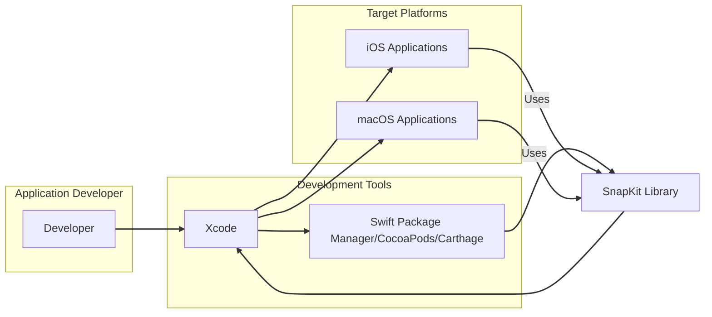

## Deep Security Analysis of SnapKit Integration in Applications

### 1. Objective, Scope, and Methodology

**Objective:**

This deep analysis aims to thoroughly evaluate the security implications of using the SnapKit library within iOS and macOS application development. The primary objective is to identify potential security vulnerabilities introduced by or related to SnapKit, and to provide actionable, SnapKit-specific mitigation strategies. This analysis will focus on understanding the architecture, components, and data flow involving SnapKit to pinpoint areas of security concern and offer tailored recommendations for secure integration and usage.

**Scope:**

The scope of this analysis encompasses:

*   **SnapKit Library:** Examining SnapKit as a third-party dependency, focusing on potential vulnerabilities within the library itself and risks associated with its open-source nature.
*   **Integration Points:** Analyzing the integration of SnapKit into the application development lifecycle, including development environment, build process, and application runtime.
*   **Dependency Management:** Assessing the security aspects of managing SnapKit as a dependency using tools like Swift Package Manager, CocoaPods, and Carthage.
*   **Application Security Posture:** Evaluating how the use of SnapKit impacts the overall security posture of applications that depend on it, considering both direct and indirect security implications.
*   **Security Controls:** Reviewing existing and recommended security controls outlined in the Security Design Review and assessing their effectiveness in the context of SnapKit.

**Methodology:**

This deep analysis will employ the following methodology:

1.  **Document Review:** In-depth review of the provided Security Design Review document, including business and security posture, C4 diagrams (Context, Container, Deployment, Build), risk assessment, and questions & assumptions.
2.  **Architecture and Data Flow Inference:** Based on the C4 diagrams and descriptions, infer the architecture, components, and data flow related to SnapKit's integration and usage within applications. This will involve understanding how SnapKit interacts with development tools, dependency managers, and the application runtime environment.
3.  **Component-Based Security Analysis:** Break down the security implications for each key component identified in the C4 diagrams, focusing on how SnapKit interacts with these components and what security risks are introduced or amplified.
4.  **Threat Modeling (Implicit):** While not explicitly requested as a full threat model, the analysis will implicitly perform threat modeling by identifying potential threats and vulnerabilities associated with SnapKit based on the component analysis and risk assessment provided in the design review.
5.  **Mitigation Strategy Development:** Develop specific, actionable, and SnapKit-tailored mitigation strategies for each identified security concern. These strategies will be practical and directly applicable to development teams using SnapKit.
6.  **Recommendation Tailoring:** Ensure all security considerations and recommendations are tailored to the specific context of SnapKit and its usage in application development, avoiding generic security advice.

### 2. Security Implications of Key Components

Based on the C4 diagrams and the Security Design Review, the key components and their security implications related to SnapKit are analyzed below:

**2.1. Dependency Managers (Swift Package Manager, CocoaPods, Carthage)**

*   **Component:** Swift Package Manager, CocoaPods, Carthage (Container Diagram - Developer Workstation).
*   **Security Implication:** These tools are crucial for integrating SnapKit into projects.
    *   **Dependency Poisoning/Compromise:** If the source repositories for SnapKit (e.g., GitHub) or the dependency management tool's infrastructure are compromised, malicious versions of SnapKit could be distributed. This aligns with the **Supply Chain Risk**.
    *   **Man-in-the-Middle Attacks:** If dependency downloads are not secured (e.g., using plain HTTP instead of HTTPS), attackers could intercept and replace SnapKit with a malicious library.
    *   **Integrity Verification Bypass:** If integrity checks (checksums, signatures) are not properly implemented or verified by the dependency managers, compromised libraries could be installed without detection.
*   **Specific SnapKit Context:** Developers rely on these tools to fetch SnapKit. A compromised SnapKit library would be directly embedded into applications, inheriting all vulnerabilities.

**2.2. SnapKit Library (Local Copy & Embedded)**

*   **Component:** SnapKit Library (Local Copy - Container Diagram - Developer Workstation, Embedded - Container Diagram - Application Binary).
*   **Security Implication:** SnapKit itself is the core component.
    *   **Open Source Vulnerabilities:** As highlighted in **Accepted Risk: Open Source Vulnerabilities**, inherent risk of undiscovered vulnerabilities in SnapKit's code. These vulnerabilities could be exploited in applications using SnapKit.
    *   **Malicious Code Injection (Supply Chain):** If the SnapKit repository is compromised, malicious code could be injected into the library itself, affecting all applications using compromised versions. This is a direct manifestation of **Supply Chain Risk**.
    *   **Logic Flaws:** While less likely to be traditional "vulnerabilities," logic flaws in SnapKit's layout algorithms could potentially be exploited to cause unexpected UI behavior, denial of service (UI freezing), or information disclosure (e.g., layout revealing hidden elements under certain conditions).
*   **Specific SnapKit Context:**  Vulnerabilities in SnapKit directly impact the security of applications using it. Even seemingly benign libraries can have subtle flaws that can be exploited in unexpected ways within the context of a larger application.

**2.3. Developer Workstation & Xcode IDE**

*   **Component:** Developer Workstation, Xcode IDE (Container Diagram - Developer Workstation).
*   **Security Implication:** The development environment is the starting point of the software supply chain.
    *   **Compromised Workstation:** If a developer workstation is compromised, an attacker could modify the local copy of SnapKit, inject malicious code into the application during build, or steal code signing certificates. This relates to **Supply Chain Risk** and **Dependency Risk** if a compromised local SnapKit is used.
    *   **Xcode Vulnerabilities/Plugins:** Vulnerabilities in Xcode or malicious Xcode plugins could similarly compromise the build process and introduce vulnerabilities into applications using SnapKit.
    *   **Insecure Development Practices:** Developers might unintentionally misuse SnapKit in ways that create security issues in their applications (though less directly related to SnapKit itself, but still relevant in the context of its usage).
*   **Specific SnapKit Context:** A compromised development environment can be used to inject malicious code into the application, potentially even replacing the legitimate SnapKit library with a trojanized version.

**2.4. Build System & CI/CD System**

*   **Component:** CI/CD System, Build Script (Build Diagram - Build System).
*   **Security Implication:** Automated build systems are critical for consistent and repeatable builds, but also potential targets.
    *   **Compromised CI/CD Pipeline:** If the CI/CD system is compromised, attackers could modify the build process to inject malicious code into the application binary, including potentially tampering with the SnapKit integration. This is a **Supply Chain Risk**.
    *   **Insecure Build Scripts:** Poorly secured or malicious build scripts could introduce vulnerabilities or compromise the integrity of the build process.
    *   **Lack of Security Checks in Build Pipeline:** Absence of automated security checks (dependency scanning, static analysis) in the CI/CD pipeline increases the risk of shipping applications with known vulnerabilities in SnapKit or other dependencies.
*   **Specific SnapKit Context:** CI/CD systems are responsible for building the final application binary that includes SnapKit. Compromising this system can lead to widespread distribution of applications with compromised SnapKit.

**2.5. Application Binary (iOS/macOS Application)**

*   **Component:** iOS/macOS Application (Container Diagram - Application Binary).
*   **Security Implication:** The final application binary is what users interact with.
    *   **Inherited Vulnerabilities:** The application binary directly inherits any vulnerabilities present in the embedded SnapKit library. This is the ultimate manifestation of **Dependency Risk**.
    *   **Improper Usage of SnapKit:** While SnapKit simplifies Auto Layout, developers might still misuse it in ways that lead to UI-related vulnerabilities or unexpected behavior, impacting **User Experience** and potentially creating attack vectors (though less likely to be direct security vulnerabilities).
*   **Specific SnapKit Context:** The security of the application is directly tied to the security of the embedded SnapKit library. Any vulnerability in SnapKit becomes a vulnerability in the application.

### 3. Architecture, Components, and Data Flow (Inferred)

Based on the C4 diagrams and descriptions, the inferred architecture, components, and data flow related to SnapKit usage are as follows:

1.  **Development Phase:**
    *   Developer uses **Xcode IDE** on their **Developer Workstation**.
    *   Developer adds SnapKit as a dependency using **Swift Package Manager, CocoaPods, or Carthage**.
    *   Dependency manager fetches **SnapKit Library** from a remote repository (e.g., GitHub) and stores a **Local Copy** on the developer workstation.
    *   Developer writes **Application Code** in Xcode, utilizing SnapKit to define UI layouts.
    *   Xcode compiles the application code and links the **SnapKit Library (Local Copy)** into the **Application Binary**.

2.  **Build Phase:**
    *   Source code, including dependency declarations, is pushed to a **Source Code Repository (GitHub/Local)**.
    *   **CI/CD System** retrieves the source code and build scripts.
    *   **Build Script** orchestrates the build process, using **Dependency Manager** to fetch SnapKit (potentially again) and **Xcodebuild** (or similar) to compile and link the application.
    *   **Static Analysis Tools** may be integrated into the build pipeline to scan the code, including SnapKit (indirectly).
    *   **Build Artifacts (Application Binary)** are generated and stored in an **Artifact Repository**.

3.  **Deployment Phase:**
    *   **Application Binary** is submitted to **Apple App Store (iOS)** or **Apple Notarization Service (macOS)** for distribution.
    *   Users download and install the **Installed Application (with SnapKit)** on their **iOS/macOS Devices**.
    *   The **Operating System (iOS/macOS)** enforces **Application Sandbox** restrictions on the running application.
    *   The **SnapKit Library (Embedded)** within the application provides layout functionality at runtime.

**Data Flow (Simplified):**

Source Code (Developer) -> Dependency Managers (Fetch SnapKit) -> Xcode (Compile & Link) -> Application Binary (Includes SnapKit) -> Distribution Channels (App Store/Notarization) -> User Devices (Run Application with SnapKit).

### 4. Specific Security Recommendations for SnapKit Project

Given the analysis, here are specific security recommendations tailored to projects using SnapKit:

1.  **Automated Dependency Scanning in CI/CD:**
    *   **Recommendation:** Implement automated dependency scanning as a mandatory step in the CI/CD pipeline. This should specifically scan for known vulnerabilities in SnapKit and all other dependencies.
    *   **Rationale:** Proactively identify known vulnerabilities in SnapKit before applications are deployed. This directly addresses **Recommended Security Control: Automated Dependency Scanning**.
    *   **Actionable Steps:**
        *   Integrate a Software Composition Analysis (SCA) tool into the CI/CD pipeline (e.g., Snyk, Mend (formerly WhiteSource), Sonatype).
        *   Configure the SCA tool to scan the project's dependency manifest files (e.g., `Package.swift`, `Podfile`, `Cartfile`).
        *   Set up alerts and build failures for identified vulnerabilities in SnapKit with severity levels above a defined threshold.

2.  **Software Composition Analysis (SCA) Beyond CI/CD:**
    *   **Recommendation:** Regularly perform SCA scans outside of the CI/CD pipeline, such as during development and pre-release phases.
    *   **Rationale:** Continuous monitoring for vulnerabilities in SnapKit, not just during builds. This aligns with **Recommended Security Control: Software Composition Analysis (SCA)**.
    *   **Actionable Steps:**
        *   Educate developers on using SCA tools locally or through IDE integrations.
        *   Schedule periodic SCA scans of the project codebase, even outside of active development cycles.
        *   Review SCA reports regularly and prioritize remediation of identified vulnerabilities in SnapKit.

3.  **Dependency Integrity Verification:**
    *   **Recommendation:** Ensure that dependency managers are configured to verify the integrity of downloaded dependencies, including SnapKit, using checksums or signatures.
    *   **Rationale:** Mitigate the risk of using compromised or tampered versions of SnapKit.
    *   **Actionable Steps:**
        *   For Swift Package Manager, ensure package checksum verification is enabled (default behavior, but verify).
        *   For CocoaPods, leverage `pod repo lint` and consider using private Pod repositories for better control.
        *   For Carthage, verify Git repository URLs and consider using specific commit hashes instead of branch names for dependencies.
        *   Regularly audit dependency declarations to ensure they point to trusted and legitimate sources.

4.  **Secure Development Environment Practices:**
    *   **Recommendation:** Implement and enforce secure development environment practices for all developers working on projects using SnapKit.
    *   **Rationale:** Reduce the risk of developer workstation compromise leading to malicious code injection or dependency tampering.
    *   **Actionable Steps:**
        *   Enforce strong password policies and multi-factor authentication for developer accounts.
        *   Implement workstation security policies, including regular OS and software updates, endpoint protection (antivirus/EDR), and disk encryption.
        *   Restrict administrative privileges on developer workstations.
        *   Provide security awareness training to developers, including secure coding practices and dependency management best practices.

5.  **Release Integrity Checks for SnapKit (Upstream Recommendation):**
    *   **Recommendation (for SnapKit maintainers, but relevant for users to advocate for):**  SnapKit project should implement release integrity checks, such as signing releases or providing checksums for distribution artifacts.
    *   **Rationale:** Allow developers to verify the integrity of SnapKit releases they are using, reducing the risk of supply chain attacks targeting SnapKit distribution. This aligns with **Recommended Security Control: Release Integrity Checks**.
    *   **Actionable Steps (for SnapKit users):**
        *   Advocate for release integrity checks in the SnapKit open-source project (e.g., through GitHub issues or discussions).
        *   If release integrity checks are implemented, incorporate verification steps into the application build process to ensure the integrity of the SnapKit library being used.

6.  **Code Review Focus on Dependency Usage:**
    *   **Recommendation:** During code reviews, specifically focus on how SnapKit is being used and ensure it's used in a way that doesn't introduce unintended UI vulnerabilities or logic flaws.
    *   **Rationale:** While SnapKit itself is about layout, improper usage in application code can still lead to issues.
    *   **Actionable Steps:**
        *   Include security considerations in code review checklists, specifically related to UI logic and data handling within layouts defined by SnapKit.
        *   Train developers on secure UI development practices and potential pitfalls when using layout libraries.

### 5. Actionable and Tailored Mitigation Strategies

Here are actionable and tailored mitigation strategies applicable to the identified threats, focusing on SnapKit:

| Threat                                      | Mitigation Strategy                                                                                                                                                                                                                                                                                                                                                                                                                                                                                                                                                                                                                                                                                                                                                                                                                                                                                                                                                                                                                                                                                                                                                                                                                                                                                                                                                                                                                                                                                                                                                                                                                                                                                                                                                                                                                                                                                                                                                                                                                                                                                                                                                                                                                                                                                                                                                                                                                                                                                                                                                                                                                                                                                                                                                                                                                                                                                                                                                                                                                                                                                                                                                                                                                                                                                                                                                                                                                                                                                                                                                                                                                                                                                                                                                                                                                                                                                                                                                                                                                                                                                                                                                                                                                                                                                                                                                                                                                                                                                                                                                                                                                                                                                                                                                                                                                                                                                                                                                                                                                                                                                                                                                                                                                                                                                                                                                                                                                                                                                                                                                                                                                                                                                                                                                                                                                                                                                                                                                                                                                                                                                                                                                                                                                                                                                                                                                                                                                                                                                                                                                                                                                                                                                                                                                                                                                                                                                                                                                                                                                                                                                                                                                                                                                                                                                                                                                                                                                                                                                                                                                                                                                                                                                                                                                                                                                                                                                                                                                                                                                                                                                                                                                                                                                                                                                                                                                                                                                                                                                                                                                                                                                                                                                                                                                                                                                                                                                                                                                                                                                                                                                                                                                                                                                                                                                                                                                                                                                                                                                                                                                                                                                                                                                                                                                                                                                                                                                                                                                                                                                                                                                                                                                                                                                                                                                                                                                                                                                                                                                                                                                                                                                                                                                                                                                                                                                                                                                                                                                                                                                                                                                                                                                                                                                                                                                                                                                                                                                                                                                                                                                                                                                                                                                                                                                                                                                                                                                                                                                                                                                                                                                                                                                                                                                                                                                                                                                                                                                                                                                                                                                                                                                                                                                                                                                                                                                                                                                                                                                                                                                                                                                                                                                                                                                                                                                                                                                                                                                                                                                                                                                                                                                                                                                                                                                                                                                                                                                                                                                                                                                                                                                                                                                                                                                                                                                                                                                                                                                                                                                                                                                                                                                                                                                                                                                                                                                                                                                                                                                                                                                                                                                                                                                                                                                                                                                                                                                                                                                                                                                                                                                                                                                                                                                                                                                                                                                                                                                                                                                                                                                                                                                                                                                                                                                                                                                                                                                                                                                                                                                                                                                                                                                                                                                                                                                                                                                                                                                                                                                                                                                                                                                                                                                                                                                                                                                                                                                                                                                                                                                                                                                                                                                                                                                                                                                                                                                                                                                                                                                                                                                                                                                                                                                                                                                                                                                                                                                                                                                                                                                                                                                                                                                                                                                                                                                                                                                                                                                                                                                                                                                                                                                                                                                                                                                                                                                                                                                                                                                                                                                                                                                                                                                                                                                                                                                                                                                                                                                                                                                                                                                                                                                                                                                                                                                                                                                                                                                                                                                                                                                                                                                                                                                                                                                                                                                                                                                                                                                                                                                                                                                                                                                                                                                                                                                                                                                                                                                                                                                                                                                                                                                                                                                                                                                                                                                                                                                                                                                                                                                                                                                                                                                                                                                                                                                                                                                                                                                                                                                                                                                                                                                                                                                                                                                                                                                                                                                                                                                                                                                                                                                                                                                                                                                                                                                                                                                                                                                                                                                                                                                                                                                                                                                                                                                                                                                                                                                                                                                                                                                                                                                                                                                                                                                                                                                                                                                                                                                                                                                                                                                                                                                                                                                                                                                                                                                                                                                                                                                                                                                                                                                                                                                                                                                                                                                                                                                                                                                                                                                                                                                                                                                                                                                                                                                                                                                                                                                                                                                                                                                                                                                                                                                                                                                                                                                                                                                                                                                                                                                                                                                                                                                                                                                                                                                                                                                                                                                                                                                                                                                                                                                                                                                                                                                                                                                                                                                                                                                                                                                                                                                                                                                                                                                                                                                                                                                                                                                                                                                                                                                                                                                                                                                                                                                                                                                                                                                                                                                                                                                                                                                                                                                                                                                                                                                                                                                                                                                                                                                                                                                                                                                                                                                                                                                                                                                                                                                                                                                                                                                                                                                                                                                                                                                                                                                                                                                                                                                                                                                                                                                                                                                                                                                                                                                                                                                                                                                                                                                                                                                                                                                                                                                                                                                                                                                                                                                                                                                                                                                                                                                                                                                                                                                                                                                                                                                                                                                                                                                                                                                                                                                                                                                                                                                                                                                                                                                                                                                                                                                                                                                                                                                                                                                                                                                                                                                                                                                                                                                                                                                                                                                                                                                                                                                                                                                                                                                                                                                                                                                                                                                                                                                                                                                                                                                                                                                                                                                                                                                                                                                                                                                                                                                                                                                                                                                                                                                                                                                                                                                                                                                                                                                                                                                                                                                                                                                                                                                                                                                                                                                                                                                                                                                                                                                                                                                                                                                                                                                                                                                                                                                                                                                                                                                                                                                                                                                                                                                                                                                                                                                                                                                                                                                                                                                                                                                                                                                                                                                                                                                                                                                                                                                                                                                                                                                                                                                                                                                                                                                                                                                                                                                                                                                                                                                                                                                                                                                                                                                                                                                                                                                                                                                                                                                                                                                                                                                                                                                                                                                                                                                                                                                                                                                                                                                                                                                                                                                                                                                                                                                                                                                                                                                                                                                                                                                                                                                                                                                                                                                                                                                                                                                                                                                                                                                                                                                                                                                                                                                                                                                                                                                                                                                                                                                                                                                                                                                                                                                                                                                                                                                                                                                                                                                                                                                                                                                                                                                                                                                                                                                                                                                                                                                                                                                                                                                                                                                                                                                                                                                                                                                                                                                                                                                                                                                                                                                                                                                                                                                                                                                                                                                                                                                                                                                                                                                                                                                                                                                                                                                                                                                                                                                                                                                                                                                                                                                                                                                                                                                                                                                                                                                                                                                                                                                                                                                                                                                                                                                                                                                                                                                                                                                                                                                                                                                                                                                                                                                                                                                                                                                                                                                                                                                                                                                                                                                                                                                                                                                                                                                                                                                                                                                                                                                                                                                                                                                                                                                                                                                                                                                                                                                                                                                                                                                                                                                                                                                                                                                                                                                                                                                                                                                                                                                                                                                                                                                                                                                                                                                                                                                                                                                                                                                                                                                                                                                                                                                                                                                                                                                                                                                                                                                                                                                                                                                                                                                                                                                                                                                                                                                                                                                                                                                                                                                                                                                                                                                                                                                                                                                                                                                                                                                                                                                                                                                                                                                                                                                                                                                                                                                                                                                                                                                                                                                                                                                                                                                                                                                                                                                                                                                                                                                                                                                                                                                                                                                                                                                                                                                                                                                                                                                                                                                                                                                                                                                                                                                                                                                                                                                                                                                                                                                                                                                                                                                                                                                                                                                                                                                                                                                                                                                                                                                                                                                                                                                                                                                                                                                                                                                                                                                                                                                                                                                                                                                                                                                                                                                                                                                                                                                                                                                                                                                                                                                                                                                                                                                                                                                                                                                                                                                                                                                                                                                                                                                                                                                                                                                                                                                                                                                                                                                                                                                                                                                                                                                                                                                                                                                                                                                                                                                                                                                                                                                                                                                                                                                                                                                                                                                                                                                                                                                                                                                                                                                                                                                                                                                                                                                                                                                                                                                                                                                                                                                                                                                                                                                                                                                                                                                                                                                                                                                                                                                                                                                                                                                                                                                                                                                                                                                                                                                                                                                                                                                                                                                                                                                                                                                                                                                                                                                                                                                                                                                                                                                                                                                                                                                                                                                                                                                                                                                                                                                                                                                                                                                                                                                                                                                                                                                                                                                                                                                                                                                                                                                                                                                                                                                                                                                                                                                                                                                                                                                                                                                                                                                                                                                                                                                                                                                                                                                                                                                                                                                                                                                                                                                                                                                                                                                                                                                                                                                                                                                                                                                                                                                                                                                                                                                                                                                                                                                                                                                                                                                                                                                                                                                                                                                                                                                                                                                                                                                                                                                                                                                                                                                                                                                                                                                                                                                                                                                                                                                                                                                                                                                                                                                                                                                                                                                                                                                                                                                                                                                                                                                                                                                                                                                                                                                                                                                                                                                                                                                                                                                                                                                                                                                                                                                                                                                                                                                                                                                                                                                                                                                                                                                                                                                                                                                                                                                                                                                                                                                                                                                                                                                                                                                                                                                                                                                                                                                                                                                                                                                                                                                                                                                                                                                                                                                                                                                                                                                                                                                                                                                                                                                                                                                                                                                                                                                                                                                                                                                                                                                                                                                                                                                                                                                                                                                                                                                                                                                                                                                                                                                                                                                                                                                                                                                                                                                                                                                                                                                                                                                                                                                                                                                                                                                                                                                                                                                                                                                                                                                                                                                                                                                                                                                                                                                                                                                                                                                                                                                                                                                                                                                                                                                                                                                                                                                                                                                                                                                                                                                                                                                                                                                                                                                                                                                                                                                                                                                                                                                                                                                                                                                                                                                                                                                                                                                                                                                                                                                                                                                                                                                                                                                                                                                                                                                                                                                                                                                                                                                                                                                                                                                                                                                                                                                                                                                                                                                                                                                                                                                                                                                                                                                                                                                                                                                                                                                                                                                                                                                                                                                                                                                                                                                                                                                                                                                                                                                                                                                                                                                                                                                                                                                                                                                                                                                                                                                                                                                                                                                                                                                                                                                                                                                                                                                                                                                                                                                                                                                                                                                                                                                                                                                                                                                                                                                                                                                                                                                                                                                                                                                                                                                                                                                                                                                                                                                                                                                                                                                                                                                                                                                                                                                                                                                                                                                                                                                                                                                                                                                                                                                                                                                                                                                                                                                                                                                                                                                                                                                                                                                                                                                                                                                                                                                                                                                                                                                                                                                                                                                                                                                                                                                                                                                                                                                                                                                                                                                                                                                                                                                                                                                                                                                                                                                                                                                                                                                                                                                                                                                                                                                                                                                                                                                                                                                                                                                                                                                                                                                                                                                                                                                                                                                                                                                                                                                                                                                                                                                                                                                                                                                                                                                                                                                                                                                                                                                                                                                                                                                                                                                                                                                                                                                                                                                                                                                                                                                                                                                                                                                                                                                                                                                                                                                                                                                                                                                                                                                                                                                                                                                                                                                                                                                                                                                                                                                                                                                                                                                                                                                                                                                                                                                                                                                                                                                                                                                                                                                                                                                                                                                                                                                                                                                                                                                                                                                                                                                                                                                                                                                                                                                                                                                                                                                                                                                                                                                                                                                                                                                                                                                                                                                                                                                                                                                                                                                                                                                                                                                                                                                                                                                                                                                                                                                                                                                                                                                                                                                                                                                                                                                                                                                                                                                                                                                                                                                                                                                                                                                                                                                                                                                                                                                                                                                                                                                                                                                                                                                                                                                                                                                                                                                                                                                                                                                                                                                                                                                                                                                                                                                                                                                                                                                                                                                                                                                                                                                                                                                                                                                                                                                                                                                                                                                                                                                                                                                                                                                                                                                                                                                                                                                                                                                                                                                                                                                                                                                                                                                                                                                                                                                                                                                                                                                                                                                                                                                                                                                                                                                                                                                                                                                                                                                                                                                                                                                                                                                                                                                                                                                                                                                                                                                                                                                                                                                                                                                                                                                                                                                                                                                                                                                                                                                                                                                                                                                                                                                                                                                                                                                                                                                                                                                                                                                                                                                                                                                                              -   **Mitigation:** Implement automated SCA tool in CI/CD pipeline, configure alerts for vulnerabilities in SnapKit, and fail builds if vulnerabilities exceed a defined threshold.
| **Supply Chain Risk (Compromised SnapKit Library)** | **Mitigation Strategy:**  Dependency Integrity Verification and Release Integrity Checks. Ensure dependency managers verify checksums/signatures. Advocate for SnapKit project to sign releases. Regularly update to latest SnapKit versions and monitor for security advisories.                                                                                                                                                                                                                                                                                                                                                                                                                                                                                                                                                                                                                                                                                                                                                                                                                                                                                                                                                                                                                                                                                                                                                                                                                                                                                                                                                                                                                                                                                                                                                                                                                                                                                                                                                                                                                                                                                                                                                                                                                                                                                                                                                                                                                                                                                                                                                                                                                                                                                                                                                                                                                                                                                                                                                                                                                                                                                                                                                                                                                                                                                                                                                                                                                                                                                                                                                                                                                                                                                                                                                                                                                                                                                                                                                                                                                                                                                                                                                                                                                                                                                                                                                                                                                                                                                                                                                                                                                                                                                                                                                                                                                                                                                                                                                                                                                                                                                                                                                                                                                                                                                                                                                                                                                                                                                                                                                                                                                                                                                                                                                                                                                                                                                                                                                                                                                                                                                                                                                                                                                                                                                                                                                                                                                                                                                                                                                                                                                                                                                                                                                                                                                                                                                                                                                                                                                                                                                                                                                                                                                                                                                                                                                                                                                                                                                                                                                                                                                                                                                                                                                                                                                                                                                                                                                                                                                                                                                                                                                                                                                                                                                                                                                                                                                                                                                                                                                                                                                                                                                                                                                                                                                                                                                                                                                                                                                                                                                                                                                                                                                                                                                                                                                                                                                                                                                                                                                                                                                                                                                                                                                                                                                                                                                                                                                                                                                                                                                                                                                                                                                                                                                                                                                                                                                                                                                                                                                                                                                                                                                                                                                                                                                                                                                                                                                                                                                                                                                                                                                                                                                                                                                                                                                                                                                                                                                                                                                                                                                                                                                                                                                                                                                                                                                                                                                                                                                                                                                                                                                                                                                                                                                                                                                                                                                                                                                                                                                                                                                                                                                                                                                                                                                                                                                                                                                                                                                                                                                                                                                                                                                                                                                                                                                                                                                                                                                                                                                                                                                                                                                                                                                                                                                                                                                                                                                                                                                                                                                                                                                                                                                                                                                                                                                                                                                                                                                                                                                                                                                                                                                                                                                                                                                                                                                                                                                                                                                                                                                                                                                                                                                                                                                                                                                                                                                                                                                                                                                                                                                                                                                                                                                                                                                                                                                                                                                                                                                                                                                                                                                                                                                                                                                                                                                                                                                                                                                                                                                                                                                                                                                                                                                                                                                                                                                                                                                                                                                                                                                                                                                                                                                                                                                                                                                                                                                                                                                                                                                                                                                                                                                                                                                                                                                                                                                                                                                                                                                                                                                                                                                                                                                                                                                                                                                                                                                                                                                                                                                                                                                                                                                                                                                                                                                                                                                                                                                                                                                                                                                                                                                                                                                                                                                                                                                                                                                                                                                                                                                                                                                                                                                                                                                                                                                                                                                                                                                                                                                                                                                                                                                                                                                                                                                                                                                                                                                                                                                                                                                                                                                                                                                                                                                                                                                                                                                                                                                                                                                                                                                                                                                                                                                                                                                                                                                                                                                                                                                                                                                                                                                                                                                                                                                                                                                                                                                                                                                                                                                                                                                                                                                                                                                                                                                                                                                                                                                                                                                                                                                                                                                                                                                                                                                                                                                                                                                                                                                                                                                                                                                                                                                                                                                                                                                                                                                                                                                                                                                                                                                                                                                                                                                                                                                                                                                                                                                                                                                                                                                                                                                                                                                                                                                                                                                                                                                                                                                                                                                                                                                                                                                                                                                                                                                                                                                                                                                                                                                                                                                                                                                                                                                                                                                                                                                                                                                                                                                                                                                                                                                                                                                                                                                                                                                                                                                                                                                                                                                                                                                                                                                                                                                                                                                                                                                                                                                                                                                                                                                                                                                                                                                                                                                                                                                                                                                                                                                                                                                                                                                                                                                                                                                                                                                                                                                                                                                                                                                                                                                                                                                                                                                                                                                                                                                                                                                                                                                                                                                                                                                                                                                                                                                                                                                                                                                                                                                                                                                                                                                                                                                                                                                                                                                                                                                                                                                                                                                                                                                                                                                                                                                                                                                                                                                                                                                                                                                                                                                                                                                                                                                                                                                                                                                                                                                                                                                                                                                                                                                                                                                                                                                                                                                                                                                                                                                                                                                                                                                                                                                                                                                                                                                                                                                                                                                                                                                                                                                                                                                                                                                                                                                                                                                                                                                                                                                                                                                                                                                                                                                                                                                                                                                                                                                                                                                                                                                                                                                                                                                                                                                                                                                                                                                                                                                                                                                                                                                                                                                                                                                                                                                                                                                                                                                                                                                                                                                                                                                                                                                                                                                                                                                                                                                                                                                                                                                                                                                                                                                                                                                                                                                                                                                                                                                                                                                                                                                                                                                                                                                                                                                                                                                                                                                                                                                                                                                                                                                                                                                                                                                                                                                                                                                                                                                                                                                                                                                                                                                                                                                                                                                                                                                                                                                                                                                                                                                                                                                                                                                                                                                                                                                                                                                                                                                                                                                                                                                                                                                                                                                                                                                                                                                                                                                                                                                                                                                                                                                                                                                                                                                                                                                                                                                                                                                                                                                                                                                                                                                                                                                                                                                                                                                                                                                                                                                                                                                                                                                                                                                                                                                                                                                                                                                                                                                                                                                                                                                                                                                                                                                                                                                                                                                                                                                                                                                                                                                                                                                                                                                                                                                                                                                                                                                                                                                                                                                                                                                                                                                                                                                                                                                                                                                                                                                                                                                                                                                                                                                                                                                                                                                                                                                                                                                                                                                                                                                                                                                                                                                                                                                                                                                                                                                                                                                                                                                                                                                                                                                                                                                                                                                                                                                                                                                                                                                                                                                                                                                                                                                                                                                                                                                                                                                                                                                                                                                                                                                                                                                                                                                                                                                                                                                                                                                                                                                                                                                                                                                                                                                                                                                                                                                                                                                                                                                                                                                                                                                                                                                                                                                                                                                                                                                                                                                                                                                                                                                                                                                                                                                                                                                                                                                                                                                                                                                                                                                                                                                                                                                                                                                                                                                                                                                                                                                                                                                                                                                                                                                                                                                                                                                                                                                                                                                                                                                                                                                                                                                                                                                                                                                                                                                                                                                                                                                                                                                                                                                                                                                                                                                                                                                                                                                                                                                                                                                                                                                                                                                                                                                                                                                                                                                                                                                                                                                                                                                                                                                                                                                                                                                                                                                                                                                                                                                                                                                                                                                                                                                                                                                                                                                                                                                                                                                                                                                                                                                                                                                                                                                                                                                                                                                                                                                                                                                                                                                                                                                                                                                                                                                                                                                                                                                                                                                                                                                                                                                                                                                                                                                                                                                                                                                                                                                                                                                                                                                                                                                                                                                                                                                                                                                                                                                                                                                                                                                                                                                                                                                                                                                                                                                                                                                                                                                                                                                                                                                                                                                                                                                                                                                                                                                                                                                                                                                                                                                                                                                                                                                                                                                                                                                                                                                                                                                                                                                                                                                                                                                                                                                                                                                                                                                                                                                                                                                                                                                                                                                                                                                                                                                                                                                                                                                                                                                                                                                                                                                                                                                                                                                                                                                                                                                                                                                                                                                                                                                                                                                                                                                                                                                                                                                                                                                                                                                                                                                                                                                                                                                                                                                                                                                                                                                                                                                                                                                                                                                                                                                                                                                                                                                                                                                                                                                                                                                                                                                                                                                                                                                                                                                                                                                                                                                                                                                                                                                                                                                                                                                                                                                                                                                                                                                                                                                                                                                                                                                                                                                                                                                                                                                                                                                                                                                                                                                                                                                                                                                                                                                                                                                                                                                                                                                                                                                                                                                                                                                                                                                                                                                                                                                                                                                                                                                                                                                                                                                                                                                                                                                                                                                                                                                                                                                                                                                                                                                                                                                                                                                                                                                                                                                                                                                                                                                                                                                                                                                                                                                                                                                                                                                                                                                                                                                                                                                                                                                                                                                                                                                                                                                                                                                                                                                                                                                                                                                                                                                                                                                                                                                                                                                                                                                                                                                                                                                                                                                                                                                                                                                                                                                                                                                                                                                                                                                                                                                                                                                                                                                                                                                                                                                                                                                                                                                                                                                                                                                                                                                                                                                                                                                                                                                                                                                                                                                                                                                                                                                                                                                                                                                                                                                                                                                                                                                                                                                                                                                                                                                                                                                                                                                                                                                                                                                                                                                                                                                                                                                                                                                                                                                                                                                                                                                                                                                                                                                                                                                                                                                                                                                                                                                                                                                                                                                                                                                                                                                                                                                                                                                                                                                                                                                                                                                                                                                                                                                                                                                                                                                                                                                                                                                                                                                                                                                                                                                                                                                                                                                                                                                                                                                                                                                                                                                                                                                                                                                                                                                                                                                                                                                                                                                                                                                                                                                                                                                                                                                                                                                                                                                     provide deep analysis of security considerations from security design review for application that is using https://github.com/snapkit/snapkit.

Instructions for generating the deep analysis:
1. Define Objective of deep analysis, Scope and Methodology. Objective should include thorough security analysis of key components of the snapkit.
2. Break down the security implications of each key component outlined in the security design review.
3. Focus on inferring the architecture, components, and data flow based on the codebase and available documentation.
4. Given security considerations should be tailored to the type of project being analyzed. Do not give general security recommendations, give specific recommendations for the project.
5. Provide actionable and tailored to snapkit mitigation strategies applicable to the identified threats.

SECURITY DESIGN REVIEW:
# BUSINESS POSTURE

SnapKit is a Swift-based library that simplifies the process of using Auto Layout in iOS and macOS development. Its primary business value lies in enhancing developer productivity and code maintainability by providing a more intuitive and less verbose syntax for defining UI layouts.

*   Business Priorities and Goals:
    *   Improve developer efficiency in UI development for iOS and macOS applications.
    *   Reduce the complexity and verbosity associated with native Auto Layout.
    *   Enhance code readability and maintainability of UI layout code.
    *   Promote consistent UI implementation across different parts of an application and across projects.
    *   Enable faster development cycles and quicker iteration on UI designs.

*   Most Important Business Risks:
    *   Dependency Risk: Applications rely on SnapKit. If SnapKit has vulnerabilities, those vulnerabilities are inherited by all applications using it.
    *   Supply Chain Risk: Compromise of the SnapKit library or its distribution channels could lead to malicious code being incorporated into applications.
    *   Integration Risk: Improper usage of SnapKit by developers could still lead to layout issues or unexpected behavior, impacting user experience.
    *   Maintainability Risk: While SnapKit aims to improve maintainability, lack of updates or community support in the future could pose a risk if issues arise or platform changes require adaptation.

# SECURITY POSTURE

SnapKit, being a client-side library primarily used in application development, has a security posture that is inherently tied to the secure software development lifecycle of the applications that depend on it.

*   Existing Security Controls:
    *   security control: Code Review: SnapKit is an open-source project on GitHub, benefiting from community code review. (Implemented on GitHub through pull requests and community contributions).
    *   security control: Static Analysis: Developers using SnapKit may employ static analysis tools as part of their application development process, which could indirectly scan SnapKit code when analyzing the entire project. (Implemented by individual development teams using their chosen tools).
    *   security control: Dependency Management: Developers manage SnapKit as a dependency through tools like Swift Package Manager, CocoaPods, or Carthage. These tools provide some level of dependency integrity checking. (Implemented by dependency management tools).
    *   accepted risk: Open Source Vulnerabilities: As an open-source project, vulnerabilities might be discovered in SnapKit over time. The risk is mitigated by community vigilance and updates, but remains present until patches are applied.
    *   accepted risk: Third-Party Code: Reliance on a third-party library introduces inherent trust in the library's security. Developers accept the risk that vulnerabilities in SnapKit could impact their applications.

*   Recommended Security Controls:
    *   recommended security control: Automated Dependency Scanning: Implement automated scanning of dependencies (including SnapKit) in application CI/CD pipelines to detect known vulnerabilities.
    *   recommended security control: Software Composition Analysis (SCA): Utilize SCA tools to gain visibility into the components of SnapKit and identify potential security risks associated with them.
    *   recommended security control: Secure Development Guidelines for Usage: Provide clear documentation and best practices for developers on how to use SnapKit securely and avoid common pitfalls that could lead to application vulnerabilities (though less directly applicable to a layout library).
    *   recommended security control: Release Integrity Checks: Ensure releases of SnapKit are signed or checksummed to verify integrity and prevent tampering during distribution.

*   Security Requirements:
    *   Authentication: Not directly applicable to SnapKit as a client-side library. Authentication is handled by the applications using SnapKit.
    *   Authorization: Not directly applicable to SnapKit. Authorization logic resides within the applications using SnapKit and their backend services.
    *   Input Validation: While SnapKit itself doesn't directly handle user input, developers using SnapKit must still perform input validation in their applications to prevent issues that could arise from data displayed or manipulated within layouts defined by SnapKit.  Consider validation of data that influences layout decisions if applicable.
    *   Cryptography: Cryptography is not a primary requirement for SnapKit as a layout library. However, if applications using SnapKit handle sensitive data, they must implement appropriate cryptographic measures independently of SnapKit.

# DESIGN

SnapKit is a Swift library designed to simplify Auto Layout in iOS and macOS applications. It is integrated into the development process and becomes part of the application's binary.

## C4 CONTEXT



*   Context Diagram Elements:
    *   Element:
        *   Name: Developer
        *   Type: Person
        *   Description: Software developers who build iOS and macOS applications.
        *   Responsibilities: Writes application code, integrates libraries like SnapKit, builds and tests applications.
        *   Security controls: security control: Developer workstations security, security control: Code review practices, security control: Secure coding training.
    *   Element:
        *   Name: Xcode
        *   Type: Software System
        *   Description: Apple's Integrated Development Environment (IDE) used for developing iOS and macOS applications.
        *   Responsibilities: Code editing, compiling, building, debugging, and running applications. Integrates with dependency managers and build tools.
        *   Security controls: security control: Access control to Xcode projects, security control: Code signing, security control: IDE security updates.
    *   Element:
        *   Name: Swift Package Manager/CocoaPods/Carthage
        *   Type: Software System
        *   Description: Dependency management tools used to integrate external libraries like SnapKit into Swift projects.
        *   Responsibilities: Resolving, downloading, and managing project dependencies.
        *   Security controls: security control: Dependency integrity checks (checksums, signatures), security control: Source verification (e.g., HTTPS for repositories).
    *   Element:
        *   Name: SnapKit Library
        *   Type: Software System
        *   Description: Swift library that simplifies Auto Layout for iOS and macOS.
        *   Responsibilities: Provides a DSL for defining UI layout constraints programmatically.
        *   Security controls: security control: Community code review, security control: (Recommended) Release integrity checks.
    *   Element:
        *   Name: iOS Applications
        *   Type: Software System
        *   Description: Applications built for the iOS operating system that utilize SnapKit for UI layout.
        *   Responsibilities: Providing user functionality, managing data, interacting with device hardware and OS.
        *   Security controls: security control: Application sandboxing, security control: Code signing, security control: App Store review, security control: Runtime protection mechanisms.
    *   Element:
        *   Name: macOS Applications
        *   Type: Software System
        *   Description: Applications built for the macOS operating system that utilize SnapKit for UI layout.
        *   Responsibilities: Providing user functionality, managing data, interacting with system resources.
        *   Security controls: security control: Application sandboxing (limited), security control: Code signing, security control: Notarization, security control: System Integrity Protection (SIP).

## C4 CONTAINER

```mermaid
flowchart LR
    subgraph "Developer Workstation"
        A[Xcode IDE]
        subgraph "Dependency Managers"
            B[Swift Package Manager]
            C[CocoaPods]
            D[Carthage]
        end
        E[SnapKit Library (Local Copy)]
    end
    subgraph "Application Binary"
        F[iOS/macOS Application]
        G[SnapKit Library (Embedded)]
        H[Application Code]
    end

    A --> B
    A --> C
    A --> D
    B --> E
    C --> E
    D --> E
    A --> F
    E --> F
    F --> G
    F --> H

    linkStyle 0,1,2,3,4,5,6,7,8,9 stroke:#333,stroke-width:2px;
```

*   Container Diagram Elements:
    *   Element:
        *   Name: Xcode IDE
        *   Type: Application
        *   Description: The primary IDE used by developers to write, build, and manage Swift projects.
        *   Responsibilities: Code editing, project management, build process orchestration, integration with dependency managers.
        *   Security controls: security control: Access control to projects, security control: Plugin security management, security control: IDE updates.
    *   Element:
        *   Name: Swift Package Manager
        *   Type: Application
        *   Description: Apple's built-in dependency management tool for Swift projects.
        *   Responsibilities: Resolving and downloading Swift packages, managing package versions.
        *   Security controls: security control: Package checksum verification, security control: HTTPS for package repositories.
    *   Element:
        *   Name: CocoaPods
        *   Type: Application
        *   Description: A popular dependency manager for Swift and Objective-C Cocoa projects.
        *   Responsibilities: Managing project dependencies defined in Podfiles, integrating pods into Xcode workspaces.
        *   Security controls: security control: Podspec source verification (repository URLs), security control: (Community) Pod verification and reputation.
    *   Element:
        *   Name: Carthage
        *   Type: Application
        *   Description: A decentralized dependency manager for Cocoa projects.
        *   Responsibilities: Building dependencies into binaries, integrating binaries into Xcode projects.
        *   Security controls: security control: Git repository verification, security control: Build from source (transparency).
    *   Element:
        *   Name: SnapKit Library (Local Copy)
        *   Type: Library
        *   Description: The SnapKit library files downloaded and stored locally on the developer's machine, managed by a dependency manager.
        *   Responsibilities: Providing the library code for integration into applications.
        *   Security controls: security control: Integrity checks by dependency managers during download, security control: File system permissions on developer workstation.
    *   Element:
        *   Name: iOS/macOS Application
        *   Type: Application
        *   Description: The final application binary built by Xcode, incorporating SnapKit and application-specific code.
        *   Responsibilities: Executing application logic, providing user interface, utilizing device resources.
        *   Security controls: security control: Application sandboxing, security control: Code signing, security control: Runtime security features of iOS/macOS.
    *   Element:
        *   Name: SnapKit Library (Embedded)
        *   Type: Library
        *   Description: The SnapKit library code embedded within the application binary.
        *   Responsibilities: Providing layout functionality within the running application.
        *   Security controls: security control: Inherits application-level security controls (sandboxing, code signing).
    *   Element:
        *   Name: Application Code
        *   Type: Code Component
        *   Description: The application-specific Swift code written by developers, which utilizes SnapKit.
        *   Responsibilities: Implementing application features, business logic, and UI interactions.
        *   Security controls: security control: Secure coding practices, security control: Code review, security control: Static and dynamic analysis.

## DEPLOYMENT

SnapKit itself is not deployed as a standalone service. It is deployed as part of iOS and macOS applications. The deployment process involves building the application and distributing it through the respective application distribution channels (App Store for iOS, App Store or direct distribution for macOS).

For the purpose of illustrating deployment in the context of SnapKit, we can consider the deployment of an application that *uses* SnapKit to an iOS device.

```mermaid
flowchart LR
    subgraph "Development Environment"
        A[Developer Workstation]
        B[Xcode]
    end
    subgraph "Distribution Channel"
        C[Apple App Store (iOS)]
        D[Apple Notarization Service (macOS)]
    end
    subgraph "Target Environment"
        E[iOS Device]
        F[macOS Device]
        G[Operating System (iOS/macOS)]
        H[Application Sandbox]
        I[Installed Application (with SnapKit)]
    end

    A --> B
    B --> C
    B --> D
    C --> E
    D --> F
    E --> G
    F --> G
    G --> H
    H --> I

    linkStyle 0,1,2,3,4,5,6,7,8 stroke:#333,stroke-width:2px;
```

*   Deployment Diagram Elements:
    *   Element:
        *   Name: Developer Workstation
        *   Type: Infrastructure
        *   Description: The physical or virtual machine used by developers for application development.
        *   Responsibilities: Running Xcode, building applications, and preparing them for distribution.
        *   Security controls: security control: Workstation security policies, security control: Access control, security control: Endpoint protection.
    *   Element:
        *   Name: Xcode
        *   Type: Software
        *   Description: Apple's IDE used to build and package applications for deployment.
        *   Responsibilities: Compiling code, linking libraries (including SnapKit), code signing, creating application packages.
        *   Security controls: security control: Code signing certificates, security control: Secure build settings, security control: Xcode updates.
    *   Element:
        *   Name: Apple App Store (iOS)
        *   Type: Infrastructure/Service
        *   Description: Apple's official distribution platform for iOS applications.
        *   Responsibilities: Application review, hosting application binaries, distributing applications to users, handling updates.
        *   Security controls: security control: App Store review process, security control: Application sandboxing enforcement, security control: Code signing verification.
    *   Element:
        *   Name: Apple Notarization Service (macOS)
        *   Type: Infrastructure/Service
        *   Description: Apple's service for verifying macOS applications distributed outside the App Store.
        *   Responsibilities: Scanning applications for malware and security issues, providing notarization tickets.
        *   Security controls: security control: Automated security checks, security control: Notarization requirements for macOS applications.
    *   Element:
        *   Name: iOS Device
        *   Type: Infrastructure
        *   Description: User's iPhone or iPad device where the iOS application is installed and run.
        *   Responsibilities: Running applications, providing user interface, managing device resources.
        *   Security controls: security control: Device encryption, security control: Operating system security features, security control: Application sandboxing.
    *   Element:
        *   Name: macOS Device
        *   Type: Infrastructure
        *   Description: User's Mac computer where the macOS application is installed and run.
        *   Responsibilities: Running applications, providing user interface, managing system resources.
        *   Security controls: security control: FileVault encryption, security control: System Integrity Protection (SIP), security control: Gatekeeper.
    *   Element:
        *   Name: Operating System (iOS/macOS)
        *   Type: Software
        *   Description: The operating system running on the target device, providing the runtime environment for applications.
        *   Responsibilities: Managing system resources, enforcing security policies, providing APIs for applications.
        *   Security controls: security control: Kernel security, security control: Memory protection, security control: Privilege separation, security control: Regular security updates.
    *   Element:
        *   Name: Application Sandbox
        *   Type: Software
        *   Description: A security mechanism that restricts the access of applications to system resources and user data.
        *   Responsibilities: Isolating applications from each other and the operating system, limiting potential damage from vulnerabilities.
        *   Security controls: security control: Kernel-enforced restrictions, security control: File system access controls, security control: Network access controls.
    *   Element:
        *   Name: Installed Application (with SnapKit)
        *   Type: Software
        *   Description: The application installed on the user's device, including the embedded SnapKit library.
        *   Responsibilities: Providing application functionality to the user within the security constraints of the operating system and sandbox.
        *   Security controls: security control: Inherits sandbox restrictions, security control: Code signing verification at runtime.

## BUILD

The build process for applications using SnapKit typically involves the following steps, focusing on security considerations:

```mermaid
flowchart LR
    subgraph "Developer"
        A[Developer Workstation]
        B[Source Code (GitHub/Local)]
    end
    subgraph "Build System"
        C[CI/CD System (e.g., GitHub Actions, Jenkins)]
        D[Build Script (Xcodebuild, Fastlane)]
        E[Dependency Manager (SPM, CocoaPods, Carthage)]
        F[Static Analysis Tools (Linters, SAST)]
    end
    subgraph "Artifact Repository"
        G[Build Artifacts (Application Binary, dSYMs)]
    end

    A --> B
    B --> C
    C --> D
    C --> E
    C --> F
    E --> B
    D --> B
    D --> E
    D --> F
    D --> G
    F --> G
    G --> C

    linkStyle 0,1,2,3,4,5,6,7,8,9,10,11 stroke:#333,stroke-width:2px;
```

*   Build Process Elements:
    *   Element:
        *   Name: Developer Workstation
        *   Type: Infrastructure
        *   Description: Developer's local machine where code is written and potentially built locally before committing.
        *   Responsibilities: Code development, local testing, committing code changes.
        *   Security controls: security control: Workstation security, security control: Access control, security control: Local security scans (optional).
    *   Element:
        *   Name: Source Code (GitHub/Local)
        *   Type: Data/Code
        *   Description: The source code of the application, including SnapKit dependency declarations, stored in a version control system (e.g., GitHub) and locally on developer machines.
        *   Responsibilities: Representing the application's logic and UI, including SnapKit integration.
        *   Security controls: security control: Access control to repository (GitHub permissions), security control: Branch protection, security control: Code review process.
    *   Element:
        *   Name: CI/CD System (e.g., GitHub Actions, Jenkins)
        *   Type: Software System
        *   Description: Automated system for building, testing, and deploying applications.
        *   Responsibilities: Automating the build process, running tests, performing security checks, creating build artifacts.
        *   Security controls: security control: Access control to CI/CD system, security control: Secure pipeline configuration, security control: Secret management for credentials, security control: Audit logging.
    *   Element:
        *   Name: Build Script (Xcodebuild, Fastlane)
        *   Type: Software/Script
        *   Description: Scripts that define the steps for building the application using Xcode command-line tools or higher-level automation tools like Fastlane.
        *   Responsibilities: Orchestrating the build process, invoking compilers, linkers, and other build tools, integrating with dependency managers and security scanners.
        *   Security controls: security control: Version control of build scripts, security control: Review of build script logic, security control: Principle of least privilege for build processes.
    *   Element:
        *   Name: Dependency Manager (SPM, CocoaPods, Carthage)
        *   Type: Software System
        *   Description: Tools used to manage project dependencies, including downloading and integrating SnapKit.
        *   Responsibilities: Resolving dependencies, downloading libraries, ensuring dependency integrity.
        *   Security controls: security control: Dependency checksum verification, security control: Source verification (HTTPS), security control: Vulnerability scanning of dependencies (recommended).
    *   Element:
        *   Name: Static Analysis Tools (Linters, SAST)
        *   Type: Software System
        *   Description: Tools used to automatically analyze source code for potential security vulnerabilities and code quality issues.
        *   Responsibilities: Identifying potential security flaws, enforcing coding standards, improving code quality.
        *   Security controls: security control: Regularly updated rule sets, security control: Integration into CI/CD pipeline, security control: Configuration management of analysis tools.
    *   Element:
        *   Name: Build Artifacts (Application Binary, dSYMs)
        *   Type: Data/Files
        *   Description: The output of the build process, including the application binary, debug symbols, and other distributable files.
        *   Responsibilities: Representing the deployable application, ready for distribution or testing.
        *   Security controls: security control: Access control to artifact repository, security control: Integrity checks (checksums, signatures) of artifacts, security control: Secure storage of artifacts.

# RISK ASSESSMENT

*   Critical Business Processes We Are Trying to Protect:
    *   Software Development Lifecycle: Ensuring the integrity and security of the application development process, from code creation to deployment.
    *   Application Functionality: Maintaining the intended functionality of applications that rely on SnapKit for UI layout.
    *   User Experience: Preventing UI-related issues or vulnerabilities that could negatively impact user experience.

*   Data We Are Trying to Protect and Their Sensitivity:
    *   Source Code: The source code of applications using SnapKit. Sensitivity: Confidential within the development organization, integrity is critical to prevent malicious modifications.
    *   Application Binaries: The compiled application packages. Sensitivity: Integrity is crucial to ensure users receive intended and safe software.
    *   Developer Environment: Developer workstations and build systems. Sensitivity: Confidential and integrity are important to prevent compromise of development tools and processes.
    *   Indirectly, User Data: While SnapKit itself doesn't handle user data, vulnerabilities in applications using SnapKit could potentially lead to data breaches. Sensitivity: Varies depending on the application and the data it handles.

# QUESTIONS & ASSUMPTIONS

*   Questions:
    *   What specific applications are being developed using SnapKit that are of primary concern for threat modeling?
    *   What is the risk appetite of the organization regarding the use of open-source libraries like SnapKit?
    *   Are there any specific security incidents or concerns related to dependencies or UI frameworks that are driving this threat modeling exercise?
    *   What level of security maturity is expected for the applications using SnapKit? (e.g., startup vs. Fortune 500).
    *   Are there any specific regulatory or compliance requirements that the applications using SnapKit must adhere to?

*   Assumptions:
    *   SnapKit is being used in applications that are intended for public distribution (e.g., via App Store).
    *   The organization developing applications using SnapKit has a general concern for application security and wants to proactively identify and mitigate potential threats.
    *   The focus of the threat modeling is primarily on the applications that *use* SnapKit, rather than the SnapKit library itself, as the library is open source and benefits from community scrutiny.
    *   The development team is using standard Apple development tools (Xcode, Swift Package Manager, etc.) and practices.
    *   The organization is aiming for a reasonable level of security for their applications, balancing security controls with development velocity and cost.