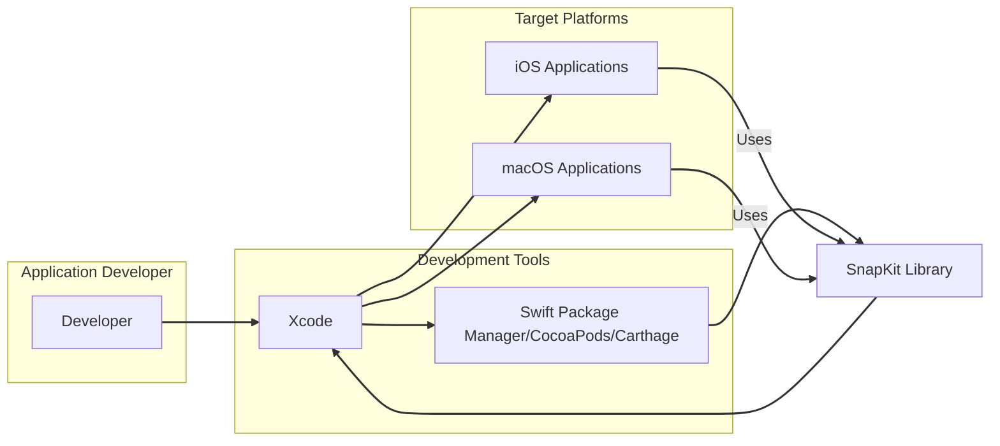

# BUSINESS POSTURE

SnapKit is a Swift-based library that simplifies the process of using Auto Layout in iOS and macOS development. Its primary business value lies in enhancing developer productivity and code maintainability by providing a more intuitive and less verbose syntax for defining UI layouts.

*   Business Priorities and Goals:
    *   Improve developer efficiency in UI development for iOS and macOS applications.
    *   Reduce the complexity and verbosity associated with native Auto Layout.
    *   Enhance code readability and maintainability of UI layout code.
    *   Promote consistent UI implementation across different parts of an application and across projects.
    *   Enable faster development cycles and quicker iteration on UI designs.

*   Most Important Business Risks:
    *   Dependency Risk: Applications rely on SnapKit. If SnapKit has vulnerabilities, those vulnerabilities are inherited by all applications using it.
    *   Supply Chain Risk: Compromise of the SnapKit library or its distribution channels could lead to malicious code being incorporated into applications.
    *   Integration Risk: Improper usage of SnapKit by developers could still lead to layout issues or unexpected behavior, impacting user experience.
    *   Maintainability Risk: While SnapKit aims to improve maintainability, lack of updates or community support in the future could pose a risk if issues arise or platform changes require adaptation.

# SECURITY POSTURE

SnapKit, being a client-side library primarily used in application development, has a security posture that is inherently tied to the secure software development lifecycle of the applications that depend on it.

*   Existing Security Controls:
    *   security control: Code Review: SnapKit is an open-source project on GitHub, benefiting from community code review. (Implemented on GitHub through pull requests and community contributions).
    *   security control: Static Analysis: Developers using SnapKit may employ static analysis tools as part of their application development process, which could indirectly scan SnapKit code when analyzing the entire project. (Implemented by individual development teams using their chosen tools).
    *   security control: Dependency Management: Developers manage SnapKit as a dependency through tools like Swift Package Manager, CocoaPods, or Carthage. These tools provide some level of dependency integrity checking. (Implemented by dependency management tools).
    *   accepted risk: Open Source Vulnerabilities: As an open-source project, vulnerabilities might be discovered in SnapKit over time. The risk is mitigated by community vigilance and updates, but remains present until patches are applied.
    *   accepted risk: Third-Party Code: Reliance on a third-party library introduces inherent trust in the library's security. Developers accept the risk that vulnerabilities in SnapKit could impact their applications.

*   Recommended Security Controls:
    *   recommended security control: Automated Dependency Scanning: Implement automated scanning of dependencies (including SnapKit) in application CI/CD pipelines to detect known vulnerabilities.
    *   recommended security control: Software Composition Analysis (SCA): Utilize SCA tools to gain visibility into the components of SnapKit and identify potential security risks associated with them.
    *   recommended security control: Secure Development Guidelines for Usage: Provide clear documentation and best practices for developers on how to use SnapKit securely and avoid common pitfalls that could lead to application vulnerabilities (though less directly applicable to a layout library).
    *   recommended security control: Release Integrity Checks: Ensure releases of SnapKit are signed or checksummed to verify integrity and prevent tampering during distribution.

*   Security Requirements:
    *   Authentication: Not directly applicable to SnapKit as a client-side library. Authentication is handled by the applications using SnapKit.
    *   Authorization: Not directly applicable to SnapKit. Authorization logic resides within the applications using SnapKit and their backend services.
    *   Input Validation: While SnapKit itself doesn't directly handle user input, developers using SnapKit must still perform input validation in their applications to prevent issues that could arise from data displayed or manipulated within layouts defined by SnapKit.  Consider validation of data that influences layout decisions if applicable.
    *   Cryptography: Cryptography is not a primary requirement for SnapKit as a layout library. However, if applications using SnapKit handle sensitive data, they must implement appropriate cryptographic measures independently of SnapKit.

# DESIGN

SnapKit is a Swift library designed to simplify Auto Layout in iOS and macOS applications. It is integrated into the development process and becomes part of the application's binary.

## C4 CONTEXT



*   Context Diagram Elements:
    *   Element:
        *   Name: Developer
        *   Type: Person
        *   Description: Software developers who build iOS and macOS applications.
        *   Responsibilities: Writes application code, integrates libraries like SnapKit, builds and tests applications.
        *   Security controls: security control: Developer workstations security, security control: Code review practices, security control: Secure coding training.
    *   Element:
        *   Name: Xcode
        *   Type: Software System
        *   Description: Apple's Integrated Development Environment (IDE) used for developing iOS and macOS applications.
        *   Responsibilities: Code editing, compiling, building, debugging, and running applications. Integrates with dependency managers and build tools.
        *   Security controls: security control: Access control to Xcode projects, security control: Code signing, security control: IDE security updates.
    *   Element:
        *   Name: Swift Package Manager/CocoaPods/Carthage
        *   Type: Software System
        *   Description: Dependency management tools used to integrate external libraries like SnapKit into Swift projects.
        *   Responsibilities: Resolving, downloading, and managing project dependencies.
        *   Security controls: security control: Dependency integrity checks (checksums, signatures), security control: Source verification (e.g., HTTPS for repositories).
    *   Element:
        *   Name: SnapKit Library
        *   Type: Software System
        *   Description: Swift library that simplifies Auto Layout for iOS and macOS.
        *   Responsibilities: Provides a DSL for defining UI layout constraints programmatically.
        *   Security controls: security control: Community code review, security control: (Recommended) Release integrity checks.
    *   Element:
        *   Name: iOS Applications
        *   Type: Software System
        *   Description: Applications built for the iOS operating system that utilize SnapKit for UI layout.
        *   Responsibilities: Providing user functionality, managing data, interacting with device hardware and OS.
        *   Security controls: security control: Application sandboxing, security control: Code signing, security control: App Store review, security control: Runtime protection mechanisms.
    *   Element:
        *   Name: macOS Applications
        *   Type: Software System
        *   Description: Applications built for the macOS operating system that utilize SnapKit for UI layout.
        *   Responsibilities: Providing user functionality, managing data, interacting with system resources.
        *   Security controls: security control: Application sandboxing (limited), security control: Code signing, security control: Notarization, security control: System Integrity Protection (SIP).

## C4 CONTAINER

```mermaid
flowchart LR
    subgraph "Developer Workstation"
        A[Xcode IDE]
        subgraph "Dependency Managers"
            B[Swift Package Manager]
            C[CocoaPods]
            D[Carthage]
        end
        E[SnapKit Library (Local Copy)]
    end
    subgraph "Application Binary"
        F[iOS/macOS Application]
        G[SnapKit Library (Embedded)]
        H[Application Code]
    end

    A --> B
    A --> C
    A --> D
    B --> E
    C --> E
    D --> E
    A --> F
    E --> F
    F --> G
    F --> H

    linkStyle 0,1,2,3,4,5,6,7,8,9 stroke:#333,stroke-width:2px;
```

*   Container Diagram Elements:
    *   Element:
        *   Name: Xcode IDE
        *   Type: Application
        *   Description: The primary IDE used by developers to write, build, and manage Swift projects.
        *   Responsibilities: Code editing, project management, build process orchestration, integration with dependency managers.
        *   Security controls: security control: Access control to projects, security control: Plugin security management, security control: IDE updates.
    *   Element:
        *   Name: Swift Package Manager
        *   Type: Application
        *   Description: Apple's built-in dependency management tool for Swift projects.
        *   Responsibilities: Resolving and downloading Swift packages, managing package versions.
        *   Security controls: security control: Package checksum verification, security control: HTTPS for package repositories.
    *   Element:
        *   Name: CocoaPods
        *   Type: Application
        *   Description: A popular dependency manager for Swift and Objective-C Cocoa projects.
        *   Responsibilities: Managing project dependencies defined in Podfiles, integrating pods into Xcode workspaces.
        *   Security controls: security control: Podspec source verification (repository URLs), security control: (Community) Pod verification and reputation.
    *   Element:
        *   Name: Carthage
        *   Type: Application
        *   Description: A decentralized dependency manager for Cocoa projects.
        *   Responsibilities: Building dependencies into binaries, integrating binaries into Xcode projects.
        *   Security controls: security control: Git repository verification, security control: Build from source (transparency).
    *   Element:
        *   Name: SnapKit Library (Local Copy)
        *   Type: Library
        *   Description: The SnapKit library files downloaded and stored locally on the developer's machine, managed by a dependency manager.
        *   Responsibilities: Providing the library code for integration into applications.
        *   Security controls: security control: Integrity checks by dependency managers during download, security control: File system permissions on developer workstation.
    *   Element:
        *   Name: iOS/macOS Application
        *   Type: Application
        *   Description: The final application binary built by Xcode, incorporating SnapKit and application-specific code.
        *   Responsibilities: Executing application logic, providing user interface, utilizing device resources.
        *   Security controls: security control: Application sandboxing, security control: Code signing, security control: Runtime security features of iOS/macOS.
    *   Element:
        *   Name: SnapKit Library (Embedded)
        *   Type: Library
        *   Description: The SnapKit library code embedded within the application binary.
        *   Responsibilities: Providing layout functionality within the running application.
        *   Security controls: security control: Inherits application-level security controls (sandboxing, code signing).
    *   Element:
        *   Name: Application Code
        *   Type: Code Component
        *   Description: The application-specific Swift code written by developers, which utilizes SnapKit.
        *   Responsibilities: Implementing application features, business logic, and UI interactions.
        *   Security controls: security control: Secure coding practices, security control: Code review, security control: Static and dynamic analysis.

## DEPLOYMENT

SnapKit itself is not deployed as a standalone service. It is deployed as part of iOS and macOS applications. The deployment process involves building the application and distributing it through the respective application distribution channels (App Store for iOS, App Store or direct distribution for macOS).

For the purpose of illustrating deployment in the context of SnapKit, we can consider the deployment of an application that *uses* SnapKit to an iOS device.

```mermaid
flowchart LR
    subgraph "Development Environment"
        A[Developer Workstation]
        B[Xcode]
    end
    subgraph "Distribution Channel"
        C[Apple App Store (iOS)]
        D[Apple Notarization Service (macOS)]
    end
    subgraph "Target Environment"
        E[iOS Device]
        F[macOS Device]
        G[Operating System (iOS/macOS)]
        H[Application Sandbox]
        I[Installed Application (with SnapKit)]
    end

    A --> B
    B --> C
    B --> D
    C --> E
    D --> F
    E --> G
    F --> G
    G --> H
    H --> I

    linkStyle 0,1,2,3,4,5,6,7,8 stroke:#333,stroke-width:2px;
```

*   Deployment Diagram Elements:
    *   Element:
        *   Name: Developer Workstation
        *   Type: Infrastructure
        *   Description: The physical or virtual machine used by developers for application development.
        *   Responsibilities: Running Xcode, building applications, and preparing them for distribution.
        *   Security controls: security control: Workstation security policies, security control: Access control, security control: Endpoint protection.
    *   Element:
        *   Name: Xcode
        *   Type: Software
        *   Description: Apple's IDE used to build and package applications for deployment.
        *   Responsibilities: Compiling code, linking libraries (including SnapKit), code signing, creating application packages.
        *   Security controls: security control: Code signing certificates, security control: Secure build settings, security control: Xcode updates.
    *   Element:
        *   Name: Apple App Store (iOS)
        *   Type: Infrastructure/Service
        *   Description: Apple's official distribution platform for iOS applications.
        *   Responsibilities: Application review, hosting application binaries, distributing applications to users, handling updates.
        *   Security controls: security control: App Store review process, security control: Application sandboxing enforcement, security control: Code signing verification.
    *   Element:
        *   Name: Apple Notarization Service (macOS)
        *   Type: Infrastructure/Service
        *   Description: Apple's service for verifying macOS applications distributed outside the App Store.
        *   Responsibilities: Scanning applications for malware and security issues, providing notarization tickets.
        *   Security controls: security control: Automated security checks, security control: Notarization requirements for macOS applications.
    *   Element:
        *   Name: iOS Device
        *   Type: Infrastructure
        *   Description: User's iPhone or iPad device where the iOS application is installed and run.
        *   Responsibilities: Running applications, providing user interface, managing device resources.
        *   Security controls: security control: Device encryption, security control: Operating system security features, security control: Application sandboxing.
    *   Element:
        *   Name: macOS Device
        *   Type: Infrastructure
        *   Description: User's Mac computer where the macOS application is installed and run.
        *   Responsibilities: Running applications, providing user interface, managing system resources.
        *   Security controls: security control: FileVault encryption, security control: System Integrity Protection (SIP), security control: Gatekeeper.
    *   Element:
        *   Name: Operating System (iOS/macOS)
        *   Type: Software
        *   Description: The operating system running on the target device, providing the runtime environment for applications.
        *   Responsibilities: Managing system resources, enforcing security policies, providing APIs for applications.
        *   Security controls: security control: Kernel security, security control: Memory protection, security control: Privilege separation, security control: Regular security updates.
    *   Element:
        *   Name: Application Sandbox
        *   Type: Software
        *   Description: A security mechanism that restricts the access of applications to system resources and user data.
        *   Responsibilities: Isolating applications from each other and the operating system, limiting potential damage from vulnerabilities.
        *   Security controls: security control: Kernel-enforced restrictions, security control: File system access controls, security control: Network access controls.
    *   Element:
        *   Name: Installed Application (with SnapKit)
        *   Type: Software
        *   Description: The application installed on the user's device, including the embedded SnapKit library.
        *   Responsibilities: Providing application functionality to the user within the security constraints of the operating system and sandbox.
        *   Security controls: security control: Inherits sandbox restrictions, security control: Code signing verification at runtime.

## BUILD

The build process for applications using SnapKit typically involves the following steps, focusing on security considerations:

```mermaid
flowchart LR
    subgraph "Developer"
        A[Developer Workstation]
        B[Source Code (GitHub/Local)]
    end
    subgraph "Build System"
        C[CI/CD System (e.g., GitHub Actions, Jenkins)]
        D[Build Script (Xcodebuild, Fastlane)]
        E[Dependency Manager (SPM, CocoaPods, Carthage)]
        F[Static Analysis Tools (Linters, SAST)]
    end
    subgraph "Artifact Repository"
        G[Build Artifacts (Application Binary, dSYMs)]
    end

    A --> B
    B --> C
    C --> D
    C --> E
    C --> F
    E --> B
    D --> B
    D --> E
    D --> F
    D --> G
    F --> G
    G --> C

    linkStyle 0,1,2,3,4,5,6,7,8,9,10,11 stroke:#333,stroke-width:2px;
```

*   Build Process Elements:
    *   Element:
        *   Name: Developer Workstation
        *   Type: Infrastructure
        *   Description: Developer's local machine where code is written and potentially built locally before committing.
        *   Responsibilities: Code development, local testing, committing code changes.
        *   Security controls: security control: Workstation security, security control: Access control, security control: Local security scans (optional).
    *   Element:
        *   Name: Source Code (GitHub/Local)
        *   Type: Data/Code
        *   Description: The source code of the application, including SnapKit dependency declarations, stored in a version control system (e.g., GitHub) and locally on developer machines.
        *   Responsibilities: Representing the application's logic and UI, including SnapKit integration.
        *   Security controls: security control: Access control to repository (GitHub permissions), security control: Branch protection, security control: Code review process.
    *   Element:
        *   Name: CI/CD System (e.g., GitHub Actions, Jenkins)
        *   Type: Software System
        *   Description: Automated system for building, testing, and deploying applications.
        *   Responsibilities: Automating the build process, running tests, performing security checks, creating build artifacts.
        *   Security controls: security control: Access control to CI/CD system, security control: Secure pipeline configuration, security control: Secret management for credentials, security control: Audit logging.
    *   Element:
        *   Name: Build Script (Xcodebuild, Fastlane)
        *   Type: Software/Script
        *   Description: Scripts that define the steps for building the application using Xcode command-line tools or higher-level automation tools like Fastlane.
        *   Responsibilities: Orchestrating the build process, invoking compilers, linkers, and other build tools, integrating with dependency managers and security scanners.
        *   Security controls: security control: Version control of build scripts, security control: Review of build script logic, security control: Principle of least privilege for build processes.
    *   Element:
        *   Name: Dependency Manager (SPM, CocoaPods, Carthage)
        *   Type: Software System
        *   Description: Tools used to manage project dependencies, including downloading and integrating SnapKit.
        *   Responsibilities: Resolving dependencies, downloading libraries, ensuring dependency integrity.
        *   Security controls: security control: Dependency checksum verification, security control: Source verification (HTTPS), security control: Vulnerability scanning of dependencies (recommended).
    *   Element:
        *   Name: Static Analysis Tools (Linters, SAST)
        *   Type: Software System
        *   Description: Tools used to automatically analyze source code for potential security vulnerabilities and code quality issues.
        *   Responsibilities: Identifying potential security flaws, enforcing coding standards, improving code quality.
        *   Security controls: security control: Regularly updated rule sets, security control: Integration into CI/CD pipeline, security control: Configuration management of analysis tools.
    *   Element:
        *   Name: Build Artifacts (Application Binary, dSYMs)
        *   Type: Data/Files
        *   Description: The output of the build process, including the application binary, debug symbols, and other distributable files.
        *   Responsibilities: Representing the deployable application, ready for distribution or testing.
        *   Security controls: security control: Access control to artifact repository, security control: Integrity checks (checksums, signatures) of artifacts, security control: Secure storage of artifacts.

# RISK ASSESSMENT

*   Critical Business Processes We Are Trying to Protect:
    *   Software Development Lifecycle: Ensuring the integrity and security of the application development process, from code creation to deployment.
    *   Application Functionality: Maintaining the intended functionality of applications that rely on SnapKit for UI layout.
    *   User Experience: Preventing UI-related issues or vulnerabilities that could negatively impact user experience.

*   Data We Are Trying to Protect and Their Sensitivity:
    *   Source Code: The source code of applications using SnapKit. Sensitivity: Confidential within the development organization, integrity is critical to prevent malicious modifications.
    *   Application Binaries: The compiled application packages. Sensitivity: Integrity is crucial to ensure users receive intended and safe software.
    *   Developer Environment: Developer workstations and build systems. Sensitivity: Confidential and integrity are important to prevent compromise of development tools and processes.
    *   Indirectly, User Data: While SnapKit itself doesn't handle user data, vulnerabilities in applications using SnapKit could potentially lead to data breaches. Sensitivity: Varies depending on the application and the data it handles.

# QUESTIONS & ASSUMPTIONS

*   Questions:
    *   What specific applications are being developed using SnapKit that are of primary concern for threat modeling?
    *   What is the risk appetite of the organization regarding the use of open-source libraries like SnapKit?
    *   Are there any specific security incidents or concerns related to dependencies or UI frameworks that are driving this threat modeling exercise?
    *   What level of security maturity is expected for the applications using SnapKit? (e.g., startup vs. Fortune 500).
    *   Are there any specific regulatory or compliance requirements that the applications using SnapKit must adhere to?

*   Assumptions:
    *   SnapKit is being used in applications that are intended for public distribution (e.g., via App Store).
    *   The organization developing applications using SnapKit has a general concern for application security and wants to proactively identify and mitigate potential threats.
    *   The focus of the threat modeling is primarily on the applications that *use* SnapKit, rather than the SnapKit library itself, as the library is open source and benefits from community scrutiny.
    *   The development team is using standard Apple development tools (Xcode, Swift Package Manager, etc.) and practices.
    *   The organization is aiming for a reasonable level of security for their applications, balancing security controls with development velocity and cost.