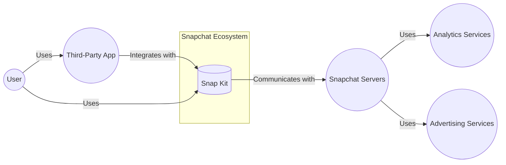
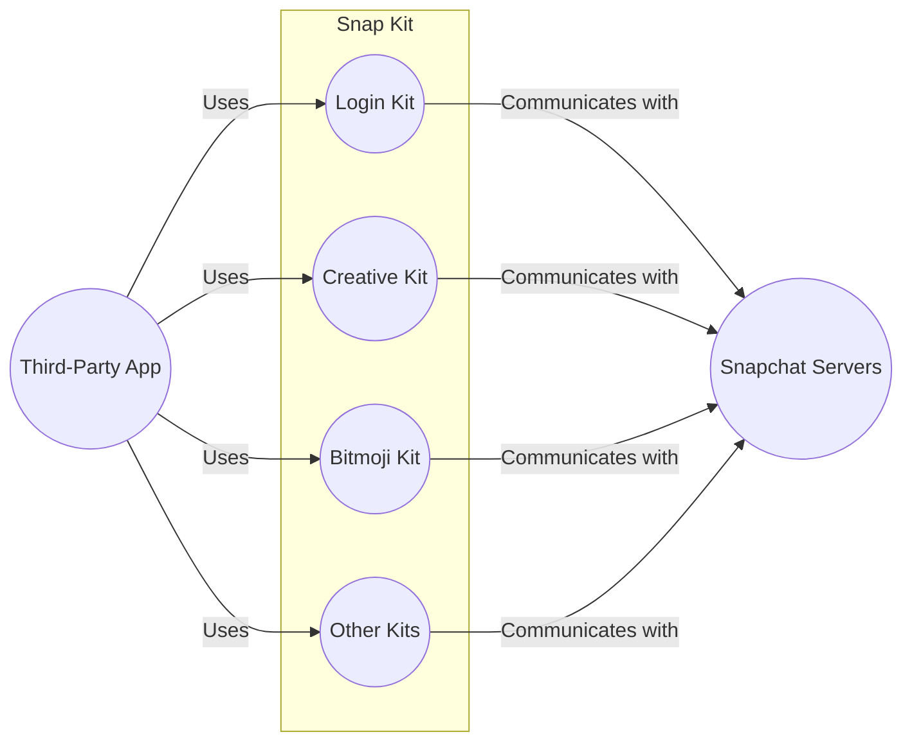
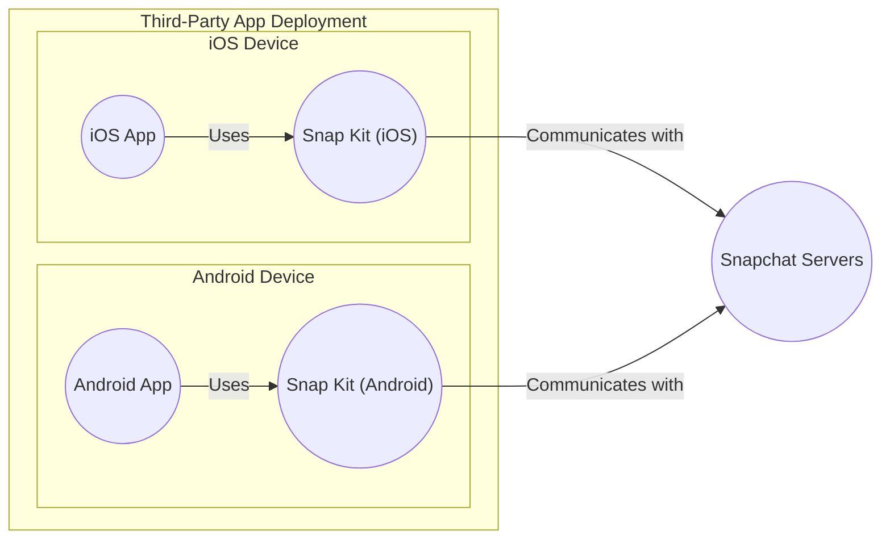
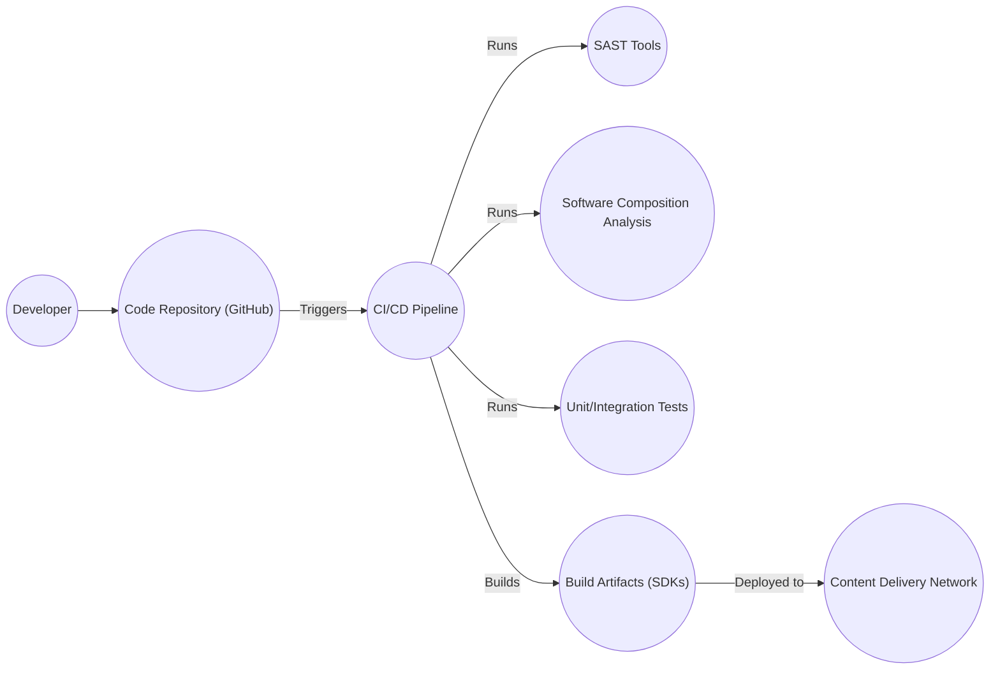

Okay, let's create a design document for the Snap Kit project, focusing on aspects relevant for threat modeling.

# BUSINESS POSTURE

Snap Kit is a library of developer tools that lets Snapchatters use some of their favorite Snapchat features in other apps, and lets those apps integrate some of their features into Snapchat. It appears to be a crucial component for expanding the Snapchat ecosystem and driving user engagement by integrating with third-party applications.  The primary business goals likely include:

*   Increased user engagement and retention on Snapchat.
*   Expansion of the Snapchat platform's reach and features through third-party integrations.
*   Monetization opportunities through partnerships and data sharing (though this is speculative and needs confirmation).
*   Maintaining user privacy and data security to uphold user trust and comply with regulations.
*   Attracting and retaining developers to build on the Snap Kit platform.

Based on these goals, the most important business risks are:

*   Data breaches or privacy violations affecting Snapchat users or partner app users.
*   Unauthorized access to Snapchat user data or functionality.
*   Malicious use of Snap Kit to spread malware, spam, or phishing attacks.
*   Reputational damage due to security incidents or privacy concerns.
*   Non-compliance with relevant data privacy regulations (e.g., GDPR, CCPA).
*   SDK vulnerabilities that could be exploited to compromise either Snapchat or integrating applications.
*   Lack of adoption by developers due to complexity, security concerns, or inadequate functionality.

# SECURITY POSTURE

Based on the provided GitHub repository, here's an assessment of the existing security controls and accepted risks.  It's important to note that this is based on a *public* repository, and internal security measures are likely more comprehensive.

*   security control: Code reviews: Evident from the pull request process on GitHub, suggesting a process for peer review before merging code changes. Location: GitHub repository's pull request process.
*   security control: Limited documentation: The repository contains some documentation, but it's not exhaustive, especially regarding security specifics. Location: README.md and other markdown files in the repository.
*   security control: Use of examples: The repository contains examples, which can help developers understand how to use the SDK correctly. Location: examples directory.
*   accepted risk: Limited public information on security architecture: The public repository does not provide deep insight into the backend infrastructure, security architecture, or specific security controls implemented on Snapchat's servers. This is expected, but it's an accepted risk from the perspective of analyzing the public-facing SDK.
*   accepted risk: Reliance on third-party developers: Snap Kit's security inherently relies on third-party developers implementing the SDK securely in their applications. Snap cannot fully control the security practices of these external developers.
*   accepted risk: Potential for vulnerabilities in dependencies: Like any software project, Snap Kit likely relies on third-party libraries, which could contain vulnerabilities.

Recommended Security Controls (High Priority):

*   Implement a comprehensive Software Security Development Lifecycle (SSDLC) with specific security checks at each stage.
*   Perform regular static and dynamic code analysis (SAST and DAST) to identify vulnerabilities.
*   Conduct penetration testing and vulnerability assessments on a regular basis.
*   Implement a robust dependency management process to track and update third-party libraries.
*   Provide detailed security documentation and guidelines for developers using Snap Kit.
*   Establish a vulnerability disclosure program to encourage responsible reporting of security issues.
*   Implement strong authentication and authorization mechanisms for API access.
*   Enforce data encryption in transit and at rest.
*   Implement robust logging and monitoring to detect and respond to security incidents.

Security Requirements:

*   Authentication:
    *   Snap Kit must securely authenticate applications integrating with Snapchat.
    *   User authentication should leverage Snapchat's existing authentication mechanisms (e.g., OAuth 2.0).
    *   API keys or other secrets used for authentication must be securely managed and protected from unauthorized access.
*   Authorization:
    *   Snap Kit must enforce granular authorization controls to limit the access of third-party applications to user data and Snapchat functionality.
    *   The principle of least privilege should be applied, granting only the necessary permissions to each application.
    *   User consent should be obtained before granting access to sensitive data or features.
*   Input Validation:
    *   All input received from third-party applications must be strictly validated to prevent injection attacks (e.g., SQL injection, cross-site scripting).
    *   Data received from third-party apps should be treated as untrusted.
    *   Input validation should be performed on both the client-side (Snap Kit SDK) and server-side (Snapchat backend).
*   Cryptography:
    *   All sensitive data transmitted between Snap Kit and Snapchat servers, and between Snap Kit and third-party applications, must be encrypted using strong, industry-standard encryption protocols (e.g., TLS 1.3).
    *   Cryptographic keys must be securely managed and protected from unauthorized access.
    *   Data at rest should be encrypted where appropriate.
*   Data Protection:
    *   Implement data loss prevention (DLP) measures.
    *   Ensure compliance with relevant data privacy regulations.
    *   Provide clear and transparent privacy policies to users.

# DESIGN

## C4 CONTEXT

Element Descriptions:

*   Element:
    *   Name: User
    *   Type: Person
    *   Description: A user of Snapchat and/or a third-party application that integrates with Snap Kit.
    *   Responsibilities: Uses Snapchat and third-party apps, provides data, interacts with features.
    *   Security controls: Relies on security controls implemented by Snapchat, Snap Kit, and the third-party app.

*   Element:
    *   Name: Third-Party App
    *   Type: Software System
    *   Description: An application developed by a third-party that integrates with Snapchat using Snap Kit.
    *   Responsibilities: Provides specific functionality to the user, integrates with Snap Kit to access Snapchat features and data.
    *   Security controls: Responsible for implementing secure coding practices, protecting user data, and securely integrating with Snap Kit.

*   Element:
    *   Name: Snap Kit
    *   Type: Software System (SDK)
    *   Description: A library of developer tools provided by Snapchat to enable integration with third-party applications.
    *   Responsibilities: Provides APIs for accessing Snapchat features, manages authentication and authorization, handles communication with Snapchat servers.
    *   Security controls: Implements authentication and authorization mechanisms, performs input validation, encrypts communication, provides secure APIs.

*   Element:
    *   Name: Snapchat Servers
    *   Type: Software System
    *   Description: The backend infrastructure of Snapchat, including servers, databases, and APIs.
    *   Responsibilities: Stores user data, manages Snapchat features, processes requests from Snap Kit and third-party apps.
    *   Security controls: Implements robust security measures, including access controls, encryption, intrusion detection, and prevention systems.

*   Element:
    *   Name: Analytics Services
    *   Type: Software System
    *   Description: Services used by Snapchat to collect and analyze data about user behavior and app usage.
    *   Responsibilities: Collects usage data, provides analytics dashboards, helps improve the Snapchat platform.
    *   Security controls: Implements data anonymization and aggregation techniques, protects collected data from unauthorized access.

*   Element:
    *   Name: Advertising Services
    *   Type: Software System
    *   Description: Services used by Snapchat to display advertisements to users.
    *   Responsibilities: Delivers targeted ads, tracks ad performance, manages ad revenue.
    *   Security controls: Complies with privacy regulations, protects user data from misuse, prevents malicious ads.

## C4 CONTAINER

Element Descriptions:

*   Element:
    *   Name: Login Kit
    *   Type: Container (Library/Module)
    *   Description: Provides functionality for authenticating users with Snapchat.
    *   Responsibilities: Handles user login, manages authentication tokens, provides access to user profile information.
    *   Security controls: Implements secure authentication protocols (e.g., OAuth 2.0), protects authentication tokens, validates user identity.

*   Element:
    *   Name: Creative Kit
    *   Type: Container (Library/Module)
    *   Description: Allows sharing content to Snapchat from a third party app.
    *   Responsibilities: Provides APIs for creating and sharing content, handles media formatting and validation.
    *   Security controls: Validates content to prevent malicious content, enforces size and format restrictions, protects against injection attacks.

*   Element:
    *   Name: Bitmoji Kit
    *   Type: Container (Library/Module)
    *   Description: Provides functionality for integrating Bitmoji avatars into third-party applications.
    *   Responsibilities: Allows users to access and use their Bitmoji avatars, handles avatar rendering and customization.
    *   Security controls: Protects user's Bitmoji data, prevents unauthorized access to avatars, ensures data privacy.

*   Element:
    *   Name: Other Kits
    *   Type: Container (Library/Module)
    *   Description: Represents other potential kits or modules within Snap Kit.
    *   Responsibilities: Varies depending on the specific kit.
    *   Security controls: Varies depending on the specific kit, but should follow general security principles.

*   Element:
    *   Name: Third-Party App
    *   Type: Software System
    *   Description: An application developed by a third-party that integrates with Snapchat using Snap Kit.
    *   Responsibilities: Provides specific functionality to the user, integrates with Snap Kit to access Snapchat features and data.
    *   Security controls: Responsible for implementing secure coding practices, protecting user data, and securely integrating with Snap Kit.

*   Element:
    *   Name: Snapchat Servers
    *   Type: Software System
    *   Description: The backend infrastructure of Snapchat.
    *   Responsibilities: Stores user data, manages Snapchat features, processes requests from Snap Kit.
    *   Security controls: Implements robust security measures, including access controls, encryption, intrusion detection.

## DEPLOYMENT

Possible Deployment Solutions:

1.  **Mobile SDK (iOS and Android):** Snap Kit is primarily a mobile SDK, deployed as a library that is integrated into third-party iOS and Android applications.
2.  **Server-to-Server API (Potential):** While the focus is on the mobile SDK, there might be server-to-server APIs for certain functionalities, requiring deployment on Snapchat's servers.

Chosen Solution (Mobile SDK):

Element Descriptions:

*   Element:
    *   Name: iOS App
    *   Type: Mobile Application
    *   Description: A third-party iOS application that integrates with Snap Kit.
    *   Responsibilities: Provides specific functionality to the user, integrates with Snap Kit to access Snapchat features.
    *   Security controls: Relies on iOS platform security features, secure coding practices, and secure integration with Snap Kit.

*   Element:
    *   Name: Snap Kit (iOS)
    *   Type: Library (SDK)
    *   Description: The iOS version of the Snap Kit SDK, deployed as a library within the third-party app.
    *   Responsibilities: Provides APIs for accessing Snapchat features, handles communication with Snapchat servers.
    *   Security controls: Implements authentication and authorization, encrypts communication, performs input validation.

*   Element:
    *   Name: Android App
    *   Type: Mobile Application
    *   Description: A third-party Android application that integrates with Snap Kit.
    *   Responsibilities: Provides specific functionality to the user, integrates with Snap Kit to access Snapchat features.
    *   Security controls: Relies on Android platform security features, secure coding practices, and secure integration with Snap Kit.

*   Element:
    *   Name: Snap Kit (Android)
    *   Type: Library (SDK)
    *   Description: The Android version of the Snap Kit SDK, deployed as a library within the third-party app.
    *   Responsibilities: Provides APIs for accessing Snapchat features, handles communication with Snapchat servers.
    *   Security controls: Implements authentication and authorization, encrypts communication, performs input validation.
*   Element:
    *   Name: Snapchat Servers
    *   Type: Software System
    *   Description: The backend infrastructure of Snapchat.
    *   Responsibilities: Stores user data, manages Snapchat features, processes requests from Snap Kit.
    *   Security controls: Implements robust security measures, including access controls, encryption, intrusion detection.

## BUILD

Build Process Description:

1.  **Developer:** Developers write code and push changes to the code repository (GitHub).
2.  **Code Repository (GitHub):** The central repository for the Snap Kit source code.
3.  **CI/CD Pipeline:** A continuous integration and continuous delivery pipeline is triggered by code changes. This pipeline automates the build, testing, and deployment process.  (Specific CI system not specified in the public repository, but likely exists - e.g., Jenkins, GitHub Actions, CircleCI, etc.).
4.  **SAST Tools:** Static Application Security Testing tools are run as part of the pipeline to analyze the source code for potential vulnerabilities.
5.  **Software Composition Analysis (SCA):** SCA tools are used to identify and analyze the third-party dependencies used by Snap Kit, checking for known vulnerabilities.
6.  **Unit/Integration Tests:** Automated tests are executed to verify the functionality and security of the code.
7.  **Build Artifacts (SDKs):** The build process produces the Snap Kit SDKs for iOS and Android as build artifacts.
8.  **Content Delivery Network (CDN):** The SDKs are likely deployed to a CDN for distribution to developers.

Security Controls in Build Process:

*   security control: Code reviews (via GitHub pull requests).
*   security control: SAST tools to identify code vulnerabilities.
*   security control: SCA tools to manage and assess third-party dependency risks.
*   security control: Automated testing to verify functionality and security.
*   security control: Secure build environment (assuming a secure CI/CD system is used).
*   security control: Artifact signing (likely, but not confirmed from the public repository) to ensure the integrity of the distributed SDKs.

# RISK ASSESSMENT

*   Critical Business Processes:
    *   User authentication and authorization.
    *   Data sharing between Snapchat and third-party apps.
    *   Content creation and sharing (Creative Kit).
    *   Bitmoji integration (Bitmoji Kit).
    *   Maintaining user privacy and data security.
    *   SDK distribution and updates.

*   Data Sensitivity:
    *   **High Sensitivity:**
        *   Usernames and passwords (indirectly, through authentication tokens).
        *   User profile information (name, age, location, etc.).
        *   User contacts and social graph.
        *   User-generated content (photos, videos, messages).
        *   Bitmoji avatar data.
        *   Usage data and analytics.
    *   **Medium Sensitivity:**
        *   Application metadata (app name, version, etc.).
        *   Device information (device type, OS version, etc.).
    *   **Low Sensitivity:**
        *   Publicly available information.

# QUESTIONS & ASSUMPTIONS

*   Questions:
    *   What specific CI/CD system is used for building and deploying Snap Kit?
    *   What are the details of the authentication and authorization mechanisms used between Snap Kit and Snapchat servers? (OAuth 2.0 is assumed, but specifics are needed).
    *   What specific SAST and SCA tools are used in the build pipeline?
    *   What are the internal security controls implemented on Snapchat's servers?
    *   What is the process for managing and updating third-party dependencies?
    *   Is there a vulnerability disclosure program in place?
    *   Are there any server-to-server APIs used by Snap Kit, and if so, what are their security controls?
    *   What are the specific data retention policies for user data accessed through Snap Kit?
    *   How are API keys or other secrets used for authentication managed and protected?
    *   Is there a mechanism for revoking access for compromised or malicious third-party applications?

*   Assumptions:
    *   Snapchat has a robust internal security team and infrastructure.
    *   OAuth 2.0 or a similar secure protocol is used for authentication.
    *   A CI/CD pipeline is used for building and deploying Snap Kit.
    *   SAST and SCA tools are used as part of the build process.
    *   Data is encrypted in transit and at rest where appropriate.
    *   Third-party developers are responsible for the security of their own applications.
    *   Snapchat has processes in place to comply with relevant data privacy regulations.
    *   The public GitHub repository does not represent the entirety of Snap Kit's security architecture.
    *   Regular security audits and penetration testing are conducted.