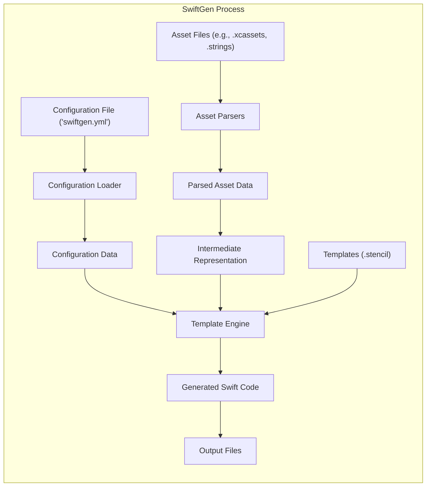
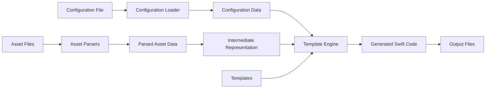

# Project Design Document: SwiftGen

**Version:** 1.1
**Date:** October 26, 2023
**Author:** Gemini (AI Language Model)

## 1. Introduction

This document provides a detailed design overview of the SwiftGen project, a command-line tool written in Swift that automates the generation of strongly-typed Swift code for various assets, such as images, colors, strings, and interface builder elements. This document aims to provide a comprehensive understanding of the project's architecture, data flow, and key components, which is crucial for subsequent threat modeling activities. This revision includes more detail on specific components and potential security considerations.

## 2. Goals

The primary goals of SwiftGen are:

*   To eliminate the use of magic strings when referencing assets in Swift code, reducing errors and improving refactoring.
*   To enhance code maintainability and reduce the risk of typos associated with manual string-based asset referencing.
*   To enforce type safety when accessing assets, catching potential errors at compile time rather than runtime.
*   To offer a flexible and extensible system for handling diverse asset types through its modular design and templating capabilities.
*   To integrate seamlessly into Xcode build processes, automating asset code generation as part of the development workflow.

## 3. High-Level Architecture

SwiftGen functions as a command-line tool that processes asset files based on a configuration file and generates Swift source code. The core operational stages are:

*   **Configuration Loading:**  The process of reading and parsing the `swiftgen.yml` configuration file to determine how assets should be processed.
*   **Asset Parsing and Extraction:** Analyzing specified asset files (e.g., `.xcassets`, `.strings`, color definition files) to extract relevant information about the assets.
*   **Intermediate Representation Generation:** Transforming the extracted asset data into a structured, language-agnostic intermediate representation.
*   **Template Processing and Code Generation:** Applying predefined or custom templates to the intermediate representation to generate Swift code, which is then written to output files.

## 4. Detailed Component Design

### 4.1. Configuration Loader

*   **Responsibility:**  To load, parse, and validate the `swiftgen.yml` configuration file.
*   **Functionality:**
    *   Locates the `swiftgen.yml` file by searching in the current directory and its ancestors, or by using a user-specified path.
    *   Parses the YAML structure of the configuration file using a YAML parsing library.
    *   Validates the configuration against a defined schema, checking for required fields, correct data types, and valid values.
    *   Handles errors during parsing and validation, providing informative messages to the user.
    *   Provides the parsed configuration data as structured objects to other SwiftGen components.
*   **Key Aspects:**
    *   Utilizes a YAML parsing library, likely `Yams`.
    *   Implements a configuration schema to ensure the configuration file is well-formed.
    *   Includes error handling for invalid YAML syntax or schema violations.

### 4.2. Asset Parsers

*   **Responsibility:** To analyze various types of asset files and extract relevant asset information.
*   **Functionality:**
    *   Dispatches to specific parser implementations based on the asset type and configuration settings.
    *   Parses different file formats:
        *   `.xcassets` folders: Extracts information about images, colors, data assets, and their variations (e.g., dark mode, scale).
        *   `.strings` files: Extracts key-value pairs for localized strings.
        *   `.colorset` files: Extracts color definitions.
        *   `.plist` files: Extracts data from property list files.
        *   Interface Builder files (`.storyboard`, `.xib`): Extracts identifiers for segues, view controllers, and other elements.
    *   Handles file reading, error handling for corrupted or malformed files, and data extraction specific to each format.
    *   Transforms the extracted data into a consistent intermediate representation.
*   **Key Aspects:**
    *   Employs a modular design, allowing for the addition of new parsers for different asset types.
    *   Includes error handling for file access issues and invalid file formats.
    *   The intermediate representation acts as a contract between parsers and template engine.

### 4.3. Intermediate Representation Generator

*   **Responsibility:** To transform the raw, parsed asset data into a structured, standardized format.
*   **Functionality:**
    *   Receives the extracted data from the Asset Parsers.
    *   Organizes the data into a hierarchical structure that represents the assets and their properties.
    *   Ensures consistency and uniformity in the data format, regardless of the original asset file type.
    *   May perform some basic data processing or transformation to simplify template logic.
*   **Key Aspects:**
    *   Provides a clear and consistent data structure for the Template Engine to work with.
    *   Decouples the parsing logic from the template rendering logic.

### 4.4. Template Engine

*   **Responsibility:** To process templates using the intermediate representation to generate Swift code.
*   **Functionality:**
    *   Loads template files, typically in the Stencil template language format.
    *   Utilizes the Stencil engine to interpret the template syntax.
    *   Receives the intermediate representation data and makes it available within the template context.
    *   Renders the templates by iterating through the data and substituting placeholders with asset information.
    *   Allows for conditional logic, loops, and filters within the templates to customize the generated code.
*   **Key Aspects:**
    *   Leverages the power and flexibility of the Stencil templating engine.
    *   Supports custom templates, allowing users to tailor the generated code to their specific needs.
    *   Template files define the structure, naming conventions, and content of the generated Swift code.

### 4.5. Code Generator

*   **Responsibility:** To write the generated Swift code to the specified output file(s).
*   **Functionality:**
    *   Receives the rendered output strings from the Template Engine.
    *   Creates or overwrites the output files at the specified paths.
    *   Handles file encoding (typically UTF-8).
    *   May include optional formatting steps (though often relies on external formatters).
    *   Provides error handling for file system operations, such as permission issues or disk space errors.
*   **Key Aspects:**
    *   Performs file system interactions.
    *   Includes error handling for file writing operations.

## 5. Data Flow

The data progresses through SwiftGen in a defined sequence of transformations:

1. The **Configuration Loader** reads and parses the **Configuration File**, producing **Configuration Data**.
2. Based on the **Configuration Data**, the appropriate **Asset Parsers** read and analyze the specified **Asset Files**, generating **Parsed Asset Data**.
3. The **Intermediate Representation Generator** transforms the **Parsed Asset Data** into a structured **Intermediate Representation**.
4. The **Template Engine** combines the **Configuration Data**, **Intermediate Representation**, and **Templates** to produce the **Generated Swift Code**.
5. The **Code Generator** writes the **Generated Swift Code** to the designated **Output Files**.

## 6. Key Components and Modules

*   **`swiftgen` Executable:** The primary command-line interface that orchestrates the entire process.
*   **`SwiftGenKit`:** A framework containing the core logic for configuration loading, parsing, intermediate representation generation, and code generation.
    *   **`Config` Module:** Handles configuration file loading and management.
    *   **`Parsers` Module:** Contains specific implementations for parsing different asset types (e.g., `AssetsCatalog`, `Strings`, `InterfaceBuilder`).
    *   **`Stencil` Integration:** Manages the interaction with the Stencil templating engine.
    *   **`Generators` Module:** Responsible for the overall code generation process, coordinating template application and file writing.
*   **`Stencil`:** The external templating engine used for generating code.
*   **`Yams`:** The external library used for parsing YAML configuration files.
*   **`ArgumentParser`:** The external library used for handling command-line arguments.

## 7. Dependencies

SwiftGen relies on the following key external libraries and frameworks:

*   **Swift Standard Library:** Provides fundamental Swift language features.
*   **Yams:** A Swift library for parsing and emitting YAML.
*   **Stencil:** A simple and powerful template engine for Swift.
*   **ArgumentParser:** A library for parsing command-line arguments in Swift.
*   Potentially other smaller utility libraries for specific tasks.

## 8. Deployment and Usage

SwiftGen is typically deployed and used within an Xcode project as part of the build process:

*   **Installation:** Can be installed via package managers like Homebrew, Mint, or integrated directly using Swift Package Manager.
*   **Configuration:** A `swiftgen.yml` file is created at the root of the project or a specified location to configure asset locations, output paths, and template settings.
*   **Xcode Integration:** The `swiftgen` command is added as a "Run Script Phase" in the Xcode project's Build Phases. This ensures that asset code is regenerated every time the project is built.
*   **Execution:** When the Xcode project is built, the `swiftgen` command is executed, processing the assets and generating the corresponding Swift code files.
*   **Code Utilization:** The generated Swift code (e.g., enums, structs) is then used within the project's source code to access assets in a type-safe and refactor-friendly manner.

## 9. Security Considerations (Pre-Threat Modeling)

This section outlines potential security considerations relevant to SwiftGen, which will be further investigated during a dedicated threat modeling exercise:

*   **Configuration File Security:**
    *   **Risk:** The `swiftgen.yml` file may contain sensitive path information or potentially custom script execution commands if extensions are supported.
    *   **Consideration:** Secure storage and access control for `swiftgen.yml` are necessary.
*   **Asset File Parsing Vulnerabilities:**
    *   **Risk:** Maliciously crafted asset files (e.g., excessively large images, strings with format string vulnerabilities) could potentially crash SwiftGen or lead to unexpected behavior.
    *   **Consideration:** Implement robust input validation and sanitization within the Asset Parsers to handle potentially malicious content.
*   **Template Injection:**
    *   **Risk:** If users can provide arbitrary custom templates, there's a risk of template injection vulnerabilities, potentially allowing execution of arbitrary code during the template rendering process.
    *   **Consideration:**  Carefully evaluate the security implications of allowing custom templates and consider sandboxing or restricting template capabilities.
*   **Dependency Vulnerabilities:**
    *   **Risk:** Vulnerabilities in SwiftGen's dependencies (e.g., `Yams`, `Stencil`) could be exploited if not kept up-to-date.
    *   **Consideration:** Regularly update dependencies and monitor for known vulnerabilities. Employ Software Composition Analysis (SCA) tools.
*   **Output File Handling:**
    *   **Risk:** Incorrectly configured output paths could lead to overwriting important project files.
    *   **Consideration:** Implement safeguards to prevent writing to critical locations and provide clear warnings to users.
*   **Command Injection (Potential Extensions):**
    *   **Risk:** If SwiftGen allows extensions or plugins that execute external commands based on configuration or asset content, there's a risk of command injection vulnerabilities.
    *   **Consideration:**  Carefully design and sanitize inputs for any extension mechanisms.
*   **Information Disclosure:**
    *   **Risk:** Error messages or logging could potentially reveal sensitive information about the project structure or file paths.
    *   **Consideration:** Review error handling and logging mechanisms to prevent excessive information disclosure.

This improved design document provides a more detailed and nuanced understanding of SwiftGen's architecture and potential security considerations, making it a more effective resource for subsequent threat modeling activities.
