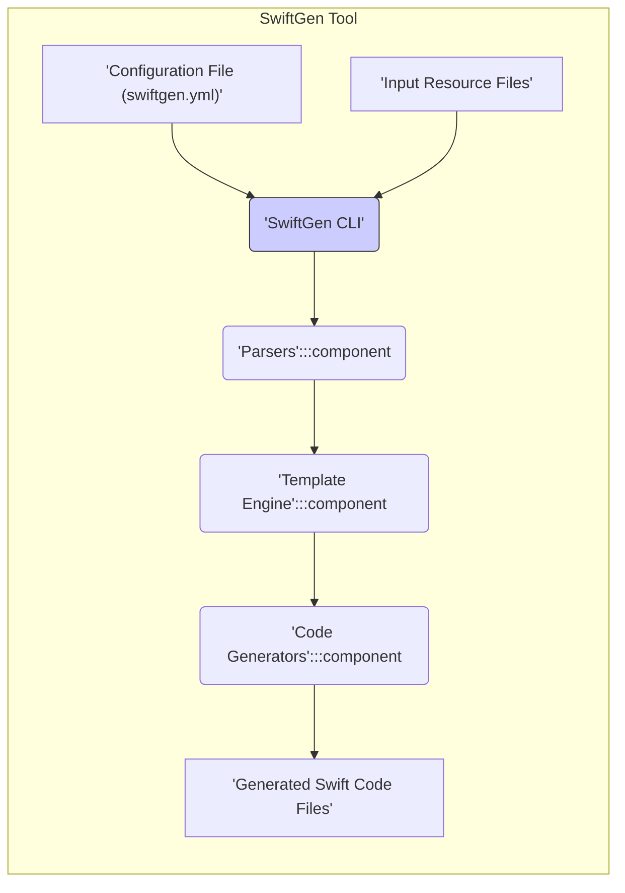
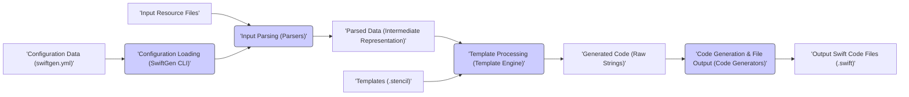

# Project Design Document: SwiftGen (Improved)

## 1. Introduction

### 1.1. Project Overview

SwiftGen is a command-line tool designed to streamline and enhance the development of Swift applications by automating the generation of Swift code for project resources. It addresses common issues like:

*   **Typographical Errors:** Eliminates string-based resource access, preventing typos in resource names (e.g., image names, string keys).
*   **Lack of Compile-Time Safety:** Provides compile-time checks for resource existence and type correctness, catching errors early in the development cycle.
*   **Maintainability Issues:** Centralizes resource management and code generation, improving project maintainability and reducing boilerplate code.

SwiftGen parses various resource file formats commonly used in iOS, macOS, watchOS, and tvOS development, including:

*   **Asset Catalogs (`.xcassets`):** Generates code for images, colorsets, and data assets.
*   **Colors Files (`.colors`, `.txt`, `.clr`, `.json`, `.yaml`, `.plist`):** Supports multiple color definition formats.
*   **Core Data Models (`.xcdatamodeld`):** Generates code for entity and attribute names.
*   **Fonts Files (`.ttf`, `.otf`):** Provides access to font family and font names.
*   **Interface Builder Files (`.storyboard`, `.xib`):** Generates code for scenes, segues, and identifiers.
*   **JSON and YAML Files (`.json`, `.yaml`, `.yml`):** Allows access to structured data within these files.
*   **Property List Files (`.plist`):** Supports access to data in plist files.
*   **Strings Files (`.strings`):** Generates code for localized strings.

The generated Swift code typically consists of enums, structs, and static functions, offering a type-safe and developer-friendly API to access project resources.

### 1.2. Purpose of this Document

This document provides a detailed design specification for the SwiftGen project. It aims to:

*   **Define the system architecture:** Describe the major components and their interactions.
*   **Illustrate data flow:** Explain how data is processed within SwiftGen.
*   **Detail key components:** Elaborate on the functionality and security relevance of each component.
*   **Outline initial security considerations:** Identify potential security risks and suggest mitigation strategies.

This document is intended to be a living document, updated as the project evolves. It serves as a crucial input for threat modeling activities and security audits.

### 1.3. Target Audience

*   Security Architects and Threat Modeling Teams responsible for assessing the security posture of SwiftGen and projects using SwiftGen.
*   SwiftGen Core Developers and Maintainers who need a comprehensive understanding of the system design for development and maintenance.
*   Security Auditors tasked with evaluating the security of SwiftGen.
*   Advanced SwiftGen Users who want to understand the tool's internals for customization or security analysis.

## 2. System Architecture

### 2.1. High-Level Architecture Diagram



### 2.2. Component Description

*   **Configuration File (`swiftgen.yml`):**
    *   **Purpose:** Defines the behavior of SwiftGen for a specific project. It's a YAML file that specifies input files, output paths, parsers, templates, and other settings.
    *   **Details:**
        *   Specifies input paths using glob patterns to locate resource files.
        *   Defines output paths for generated Swift code files, allowing customization of file locations and names.
        *   Maps resource types to specific parsers (e.g., `strings` parser for `.strings` files).
        *   Selects templates for code generation, either built-in templates or custom templates.
        *   Can include project-specific settings and parameters for parsers and templates.
    *   **Example:**
        ```yaml
        strings:
          inputs: path/to/your/strings/*.strings
          outputs:
            templateName: structured-swift5
            outputFile: Generated/Strings.swift
        colors:
          inputs: path/to/your/colors.txt
          outputs:
            outputFile: Generated/Colors.swift
        ```

*   **SwiftGen CLI (Command Line Interface):**
    *   **Purpose:** The entry point and orchestrator of the SwiftGen tool. It handles command-line argument parsing, configuration loading, and execution flow.
    *   **Details:**
        *   Parses command-line arguments to accept configuration file paths, commands (e.g., `config`, `run`), and options.
        *   Loads and validates the `swiftgen.yml` configuration file.
        *   Dispatches tasks to relevant parsers based on the configuration.
        *   Manages the execution of parsers, template engine, and code generators in the correct sequence.
        *   Handles error reporting and logging throughout the process.
        *   Provides a user-friendly command-line interface for interacting with SwiftGen.

*   **Parsers:**
    *   **Purpose:** Responsible for reading, validating, and extracting data from various input resource file formats. Each parser is specialized for a specific resource type.
    *   **Details:**
        *   **Input:** Takes file paths from the configuration and reads the content of the resource files.
        *   **Validation:** Performs format validation to ensure input files adhere to the expected syntax and structure for their respective types.
        *   **Data Extraction:** Extracts relevant resource information (e.g., string keys and values from `.strings` files, image names from asset catalogs, color values from color files).
        *   **Intermediate Representation:** Transforms the extracted data into a standardized, in-memory data structure (intermediate representation - IR). This IR is typically a dictionary or tree-like structure that is easily consumable by the template engine.
        *   **Error Handling:** Handles parsing errors gracefully, providing informative error messages to the user and potentially logging errors.
    *   **Examples:** `ColorsParser`, `StringsParser`, `ImagesParser`, `StoryboardsParser`, `JSONParser`, `YAMLParser`, `PlistParser`, `FontsParser`, `CoreDataParser`.

*   **Template Engine:**
    *   **Purpose:** Processes Stencil templates using the intermediate representation data from parsers to generate raw Swift code strings.
    *   **Details:**
        *   **Template Loading:** Loads Stencil templates from either built-in templates or custom template paths specified in the configuration.
        *   **Context Creation:** Creates a context for the template engine, populated with the intermediate representation data produced by the parsers.
        *   **Template Rendering:** Executes the Stencil template engine, which interprets the template syntax, substitutes variables with data from the context, and generates raw Swift code strings.
        *   **Template Logic:** Templates contain a mix of static Swift code and Stencil templating language constructs (e.g., loops, conditionals, variable access) to dynamically generate code based on the parsed data.
        *   **Error Handling:** Handles template rendering errors, such as syntax errors in templates or undefined variables in the context.

*   **Code Generators:**
    *   **Purpose:** Takes the raw Swift code strings generated by the template engine and writes them to output files at the specified locations.
    *   **Details:**
        *   **File Path Handling:** Receives output file paths from the configuration.
        *   **File Creation/Overwriting:** Creates new output files or overwrites existing files based on configuration and file system operations.
        *   **Code Writing:** Writes the raw Swift code strings to the output files.
        *   **File System Operations:** Manages file system interactions, including creating directories if necessary.
        *   **Error Handling:** Handles file writing errors, such as permission issues or disk space limitations.

*   **Generated Swift Code Files:**
    *   **Purpose:** The final output of SwiftGen. These are Swift source code files containing type-safe code for accessing project resources.
    *   **Details:**
        *   **Content:** Contains Swift code (enums, structs, static functions, etc.) generated based on the input resources and templates.
        *   **Integration:** These files are intended to be included in Swift projects and compiled along with the application code.
        *   **Benefits:** Provides type-safe access to resources, improves code readability, reduces errors, and enhances maintainability.

## 3. Data Flow

### 3.1. Data Flow Diagram



### 3.2. Data Description

*   **Configuration Data (`swiftgen.yml`):**
    *   **Type:** YAML file content, parsed into in-memory data structures (dictionaries, arrays, strings).
    *   **Format:** YAML, adhering to YAML syntax rules.
    *   **Content Examples:**
        *   `inputs: ["path/to/images.xcassets", "path/to/strings.strings"]` (Array of strings - file paths)
        *   `outputs: { templateName: "structured-swift5", outputFile: "Generated/Assets.swift" }` (Dictionary - output settings)
        *   `parsers: { strings: { separator: "_" } }` (Nested dictionary - parser-specific options)

*   **Input Resource Files:**
    *   **Type:** Files of various formats, depending on the resource type.
    *   **Formats:** `.xcassets` (binary archive), `.strings` (plain text), `.colors` (various text formats), `.storyboard` (XML), `.json` (JSON), `.yaml` (YAML), `.plist` (XML or binary), `.ttf`/`.otf` (binary font files), `.xcdatamodeld` (binary archive).
    *   **Content:** Format and structure are specific to each file type. For example, `.strings` files contain key-value pairs of localized strings, while `.xcassets` contain image assets and metadata.

*   **Parsed Data (Intermediate Representation - IR):**
    *   **Type:** In-memory data structures (Swift dictionaries, arrays, structs, enums).
    *   **Format:** Parser-specific, but generally structured and standardized for template consumption.
    *   **Examples:**
        *   For `.strings` files: `[ ["key": "greeting", "value": "Hello, world!"], ["key": "farewell", "value": "Goodbye!"] ]` (Array of dictionaries representing string entries).
        *   For `.xcassets`: `[ "images": [ "AppIcon", "Background" ], "colors": [ "PrimaryColor", "SecondaryColor" ] ]` (Dictionary containing lists of image and color names).

*   **Templates (`.stencil`):**
    *   **Type:** Text files containing Stencil template syntax and static Swift code.
    *   **Format:** Stencil template language, a text-based templating language.
    *   **Content:** Mix of:
        *   Static Swift code that will be directly included in the generated output.
        *   Stencil tags and variables to access and manipulate the parsed data.
        *   Control flow structures (e.g., `for` loops, `if` conditions) to generate code dynamically.

*   **Generated Code (Raw Strings):**
    *   **Type:** String data.
    *   **Format:** Plain text, representing Swift code.
    *   **Content:** Raw Swift code generated by the template engine, ready to be written to files.

*   **Output Swift Code Files (`.swift`):**
    *   **Type:** Files containing Swift source code.
    *   **Format:** Plain text, valid Swift syntax.
    *   **Content:** Generated Swift code (enums, structs, functions) that provides type-safe access to project resources.

## 4. Key Components

### 4.1. Input Parsers

*   **Functionality:**
    *   **File Reading:** Reads the content of input resource files from disk.
    *   **Format Validation:** Validates the syntax and structure of input files against expected formats. For example, ensures `.strings` files are valid property lists, `.json` files are valid JSON, etc.
    *   **Data Extraction:** Extracts relevant resource information based on the file type. This involves parsing the file content and identifying key data points.
    *   **Data Transformation:** Transforms the extracted data into a standardized intermediate representation (IR), making it consistent and easy to use by the template engine, regardless of the input file format.
    *   **Error Reporting:** Provides detailed and informative error messages when parsing fails, including file paths, line numbers (if applicable), and descriptions of the parsing errors.
    *   **Example Validation Checks:**
        *   For JSON/YAML: Validates against schema if one is defined or checks for basic JSON/YAML syntax errors.
        *   For `.strings`: Checks for correct key-value pair format and valid string encoding.
        *   For `.xcassets`: Verifies the structure of the asset catalog and the presence of required metadata files.

*   **Security Relevance:**
    *   **Input Sanitization:** Parsers are the first line of defense against potentially malicious or malformed input files. Robust parsing and validation are crucial to prevent vulnerabilities.
    *   **Denial of Service Prevention:**  Parsers should be designed to handle large or complex input files without consuming excessive resources, preventing potential DoS attacks.
    *   **Path Traversal Prevention:** While parsers themselves don't directly handle file paths, they are part of the input processing pipeline. Ensuring that file paths provided to parsers are validated and sanitized earlier in the process (e.g., in the CLI or configuration loading) is important to prevent path traversal vulnerabilities.

### 4.2. Template Engine

*   **Functionality:**
    *   **Template Loading and Caching:** Loads templates from disk or built-in resources and may cache them in memory for performance.
    *   **Context Management:** Manages the data context provided to templates, ensuring only necessary and safe data is accessible within templates.
    *   **Template Interpretation:** Interprets Stencil template syntax, executing template logic (loops, conditionals, filters) and substituting variables with data from the context.
    *   **Code Generation:** Generates raw Swift code strings based on the template logic and data.
    *   **Error Handling:** Handles template rendering errors, such as syntax errors in templates or attempts to access undefined variables. Provides informative error messages to developers.
    *   **Security Features of Stencil:** Stencil, being a templating language designed for code generation, inherently provides some level of security by limiting the capabilities within templates. It is not designed for general-purpose programming, reducing the risk of complex logic or unintended side effects within templates.

*   **Technology:** Stencil (Swift templating language).
*   **Security Relevance:**
    *   **Template Injection Mitigation:** Stencil's design helps mitigate template injection vulnerabilities because it is not designed to execute arbitrary code. However, careful template design is still necessary to avoid unintended code generation.
    *   **Principle of Least Privilege:** The template engine should only provide access to the necessary data from the parsed input. Avoid exposing sensitive or unnecessary data to the template context.
    *   **Template Integrity:** Ensure that templates are stored securely and protected from unauthorized modification, as templates directly control the generated code.

### 4.3. Code Generators

*   **Functionality:**
    *   **Output Path Resolution:** Resolves output file paths based on configuration and potentially performs path validation.
    *   **Directory Creation:** Creates necessary output directories if they don't exist.
    *   **File Writing:** Writes the generated Swift code strings to the specified output files.
    *   **File Overwriting Handling:** Handles file overwriting based on configuration settings (e.g., always overwrite, only overwrite if changed, prevent overwriting).
    *   **File Permissions:** Sets appropriate file permissions for generated files, if necessary.
    *   **Error Handling:** Handles file system errors during file creation and writing, such as permission errors, disk space issues, or path errors.
    *   **Atomic File Writes (Ideally):**  Implement atomic file writes to prevent data corruption or incomplete files in case of interruptions during the writing process.

*   **Security Relevance:**
    *   **Output Path Validation:** Crucial to prevent writing generated code to unintended or sensitive locations. Output paths should be validated to ensure they are within the expected project output directory.
    *   **Preventing Malicious File Overwrites:**  Careful handling of file overwriting is necessary to avoid accidental or malicious overwriting of important project files.
    *   **File System Security:**  Ensure that file system operations are performed securely and follow best practices to prevent vulnerabilities related to file permissions, race conditions, or other file system issues.

### 4.4. Configuration

*   **Functionality:**
    *   **Configuration File Loading:** Loads the `swiftgen.yml` configuration file from disk.
    *   **YAML Parsing:** Parses the YAML configuration file into in-memory data structures.
    *   **Schema Validation:** Validates the configuration data against a predefined schema to ensure it is well-formed and contains all required parameters.
    *   **Parameter Validation:** Validates individual configuration parameters, such as input and output paths, template names, and parser options, ensuring they are valid and within acceptable ranges.
    *   **Error Reporting:** Provides informative error messages for configuration errors, such as invalid YAML syntax, missing required parameters, or invalid parameter values.
    *   **Default Configuration:** Provides default configuration values for common settings, reducing the need for extensive configuration in simple cases.

*   **Format:** YAML (`.yml` or `.yaml`).
*   **Security Relevance:**
    *   **Configuration Parsing Robustness:** The YAML parsing process should be robust and resistant to denial-of-service attacks caused by maliciously crafted YAML files. Use a well-vetted and secure YAML parsing library.
    *   **Configuration Validation:**  Strict validation of the configuration file is essential to prevent unexpected behavior or vulnerabilities caused by invalid or malicious configuration settings.
    *   **Access Control to Configuration:**  Protect the `swiftgen.yml` file from unauthorized modification, as it controls the behavior of SwiftGen and the generated code.

### 4.5. Command Line Interface (CLI)

*   **Functionality:**
    *   **Argument Parsing:** Parses command-line arguments and options provided by the user. Uses a robust argument parsing library to handle various argument formats and options.
    *   **Command Dispatch:** Dispatches execution to different SwiftGen commands (e.g., `config`, `run`, `templates`) based on user input.
    *   **Configuration Loading (Delegation):** Delegates configuration loading to the Configuration component.
    *   **Orchestration:** Orchestrates the execution of parsers, template engine, and code generators in the correct order.
    *   **User Interaction:** Provides a command-line interface for users to interact with SwiftGen, displaying progress, errors, and output messages.
    *   **Help and Usage Information:** Provides comprehensive help and usage information to guide users on how to use SwiftGen and its commands.
    *   **Logging and Error Reporting:** Implements logging and error reporting mechanisms to track execution flow and report errors to the user.

*   **Technology:** Likely uses a Swift library for command-line argument parsing (e.g., `ArgumentParser`).
*   **Security Relevance:**
    *   **Command-Line Argument Injection Prevention:**  While less likely in SwiftGen's context, ensure that command-line arguments are parsed and handled securely to prevent potential injection vulnerabilities if arguments were to be used in shell commands or file paths (though SwiftGen primarily operates within its own process).
    *   **Error Output Security:** Avoid revealing sensitive information in error messages or logs, such as internal paths or system details.
    *   **Secure Handling of User Input:**  Treat user input from the command line with caution and validate it appropriately before using it in file paths or other operations.

## 5. Security Considerations (Detailed)

### 5.1. Input Validation (Detailed)

*   **Potential Risks:**
    *   **Path Traversal:** Attackers could manipulate input file paths in the configuration or command line to access files outside the intended project directory. For example, using paths like `../../sensitive_file.txt`.
    *   **Denial of Service (DoS) via Large Files:** Providing extremely large input files could exhaust server resources (memory, CPU) during parsing, leading to DoS.
    *   **Denial of Service (DoS) via Complex Files:**  Maliciously crafted files with deeply nested structures (e.g., in JSON/YAML) could cause parsers to consume excessive resources and slow down or crash the system.
    *   **Format String Vulnerabilities (Indirect):** While less direct in Swift, if dependencies used by parsers have format string vulnerabilities, SwiftGen could be indirectly affected.
    *   **Injection Attacks (Unlikely but consider):** In highly unusual scenarios where input data is dynamically generated and not properly sanitized before being used in parsing logic, injection attacks might theoretically be possible, though very unlikely in SwiftGen's typical use case.

*   **Mitigation Strategies:**
    *   **Strict Path Validation and Sanitization:**
        *   Use path canonicalization to resolve symbolic links and relative paths to absolute paths.
        *   Validate that input paths are within the expected project directory or a defined allowed paths list.
        *   Sanitize input paths to remove or escape potentially harmful characters.
    *   **Input File Size Limits:**
        *   Implement limits on the maximum size of input files to prevent DoS attacks via large files.
        *   Reject files exceeding the size limit with an informative error message.
    *   **Complexity Limits for Structured Files:**
        *   For parsers handling structured files (JSON, YAML, XML), implement limits on nesting depth and complexity to prevent DoS attacks via complex files.
        *   Reject files exceeding complexity limits with an error.
    *   **Dependency Security Audits:**
        *   Regularly audit dependencies used by parsers for known vulnerabilities, including format string vulnerabilities.
        *   Update dependencies to secure versions promptly.
    *   **Secure Coding Practices in Parsers:**
        *   Follow secure coding practices when developing parsers to avoid introducing vulnerabilities.
        *   Perform thorough testing of parsers, including fuzzing and negative testing with malformed input files.

### 5.2. Template Security (Detailed)

*   **Potential Risks:**
    *   **Template Injection (Highly Unlikely in Typical Use):** If user-controlled data were to be dynamically inserted into templates without proper escaping, template injection vulnerabilities could theoretically arise. However, in SwiftGen's typical use, templates are authored by developers and are static, making this risk extremely low.
    *   **Logic Errors Leading to Insecure Code:**  Poorly designed template logic could unintentionally generate insecure Swift code, such as code with vulnerabilities or unexpected behavior.
    *   **Information Disclosure via Templates:** Templates could unintentionally expose sensitive information if they are not carefully designed and reviewed.
    *   **Unauthorized Template Modification:** If templates are not properly protected, unauthorized modification could lead to malicious code generation.

*   **Mitigation Strategies:**
    *   **Treat Templates as Code:**
        *   Apply code review processes to templates, just like regular code.
        *   Follow secure coding practices when writing templates.
        *   Test templates thoroughly to ensure they generate the expected and secure code.
    *   **Principle of Least Privilege for Template Data:**
        *   Provide templates with only the necessary data from the parsed input.
        *   Avoid exposing sensitive or unnecessary information in the template context.
    *   **Template Security Audits:**
        *   Regularly audit templates for potential security issues and logic errors.
    *   **Template Integrity Protection:**
        *   Store templates in a secure location with appropriate access controls.
        *   Use version control to track changes to templates and facilitate auditing.
    *   **Static Analysis of Generated Code:**
        *   Consider using static analysis tools to scan the generated Swift code for potential vulnerabilities.

### 5.3. Output Handling (Detailed)

*   **Potential Risks:**
    *   **Path Traversal in Output Paths:** Attackers could manipulate output paths in the configuration or command line to write generated code to unintended locations, potentially overwriting sensitive files or gaining unauthorized access.
    *   **Malicious File Overwrites:**  Incorrect or malicious configuration could lead to overwriting important project files with generated code, causing data loss or project corruption.
    *   **Insecure File Permissions:** Generated files might be created with overly permissive file permissions, potentially exposing them to unauthorized access.
    *   **Race Conditions in File Operations:** In rare scenarios, race conditions during file creation or writing could lead to data corruption or other file system vulnerabilities.

*   **Mitigation Strategies:**
    *   **Strict Output Path Validation and Sanitization:**
        *   Validate output paths to ensure they are within the expected project output directory.
        *   Sanitize output paths to remove or escape potentially harmful characters.
        *   Use absolute paths or resolve relative paths to absolute paths to prevent ambiguity.
    *   **Controlled File Overwriting Policies:**
        *   Provide clear configuration options for file overwriting behavior (e.g., always overwrite, only overwrite if changed, prevent overwriting).
        *   Default to safer overwrite policies (e.g., only overwrite if changed or prevent overwriting).
        *   Warn users clearly when files are about to be overwritten.
    *   **Secure File Permissions:**
        *   Set appropriate file permissions for generated files to restrict access to authorized users or processes.
        *   Follow the principle of least privilege when setting file permissions.
    *   **Atomic File Writes:**
        *   Implement atomic file writes to ensure that file writes are completed fully or not at all, preventing data corruption in case of interruptions.
    *   **Error Handling and Logging:**
        *   Implement robust error handling for file system operations.
        *   Log file system operations and errors for auditing and debugging purposes.

### 5.4. Dependency Management (Detailed)

*   **Potential Risks:**
    *   **Vulnerabilities in Dependencies:** SwiftGen relies on external libraries (e.g., Stencil, YAML parsing libraries, command-line argument parsing libraries). Vulnerabilities in these dependencies could indirectly affect SwiftGen's security.
    *   **Supply Chain Attacks:** Compromised dependencies could be used to inject malicious code into SwiftGen, potentially affecting users who use SwiftGen in their projects.
    *   **Dependency Conflicts:** Incompatible or conflicting dependencies could lead to unexpected behavior or vulnerabilities.
    *   **Outdated Dependencies:** Using outdated dependencies with known vulnerabilities increases the risk of security breaches.

*   **Mitigation Strategies:**
    *   **Dependency Scanning and Auditing:**
        *   Use dependency scanning tools (e.g., OWASP Dependency-Check, Snyk) to identify known vulnerabilities in dependencies.
        *   Regularly audit dependencies manually to assess their security posture.
    *   **Dependency Updates:**
        *   Keep dependencies up-to-date with the latest secure versions.
        *   Automate dependency updates where possible, but carefully review updates before applying them.
    *   **Dependency Pinning:**
        *   Pin dependency versions to specific versions to ensure consistent builds and reduce the risk of unexpected changes due to dependency updates.
    *   **Software Bill of Materials (SBOM):**
        *   Generate and maintain a Software Bill of Materials (SBOM) for SwiftGen to track dependencies and their versions.
        *   Use SBOMs to facilitate vulnerability management and supply chain security analysis.
    *   **Dependency Integrity Verification:**
        *   Verify the integrity of downloaded dependencies (e.g., using checksums or signatures) to ensure they have not been tampered with.
    *   **Minimal Dependency Principle:**
        *   Minimize the number of dependencies SwiftGen relies on to reduce the attack surface and complexity of dependency management.
    *   **Secure Dependency Resolution:**
        *   Use secure dependency resolution mechanisms to prevent dependency confusion attacks or other supply chain attacks.

This improved design document provides a more detailed and comprehensive overview of SwiftGen's architecture and security considerations. It should serve as a valuable resource for threat modeling and security analysis.