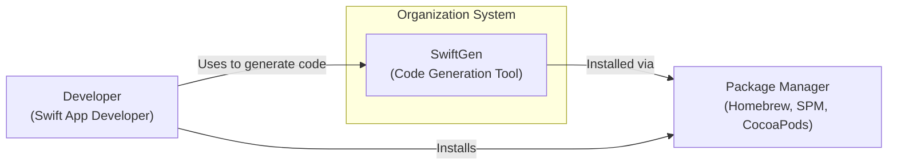
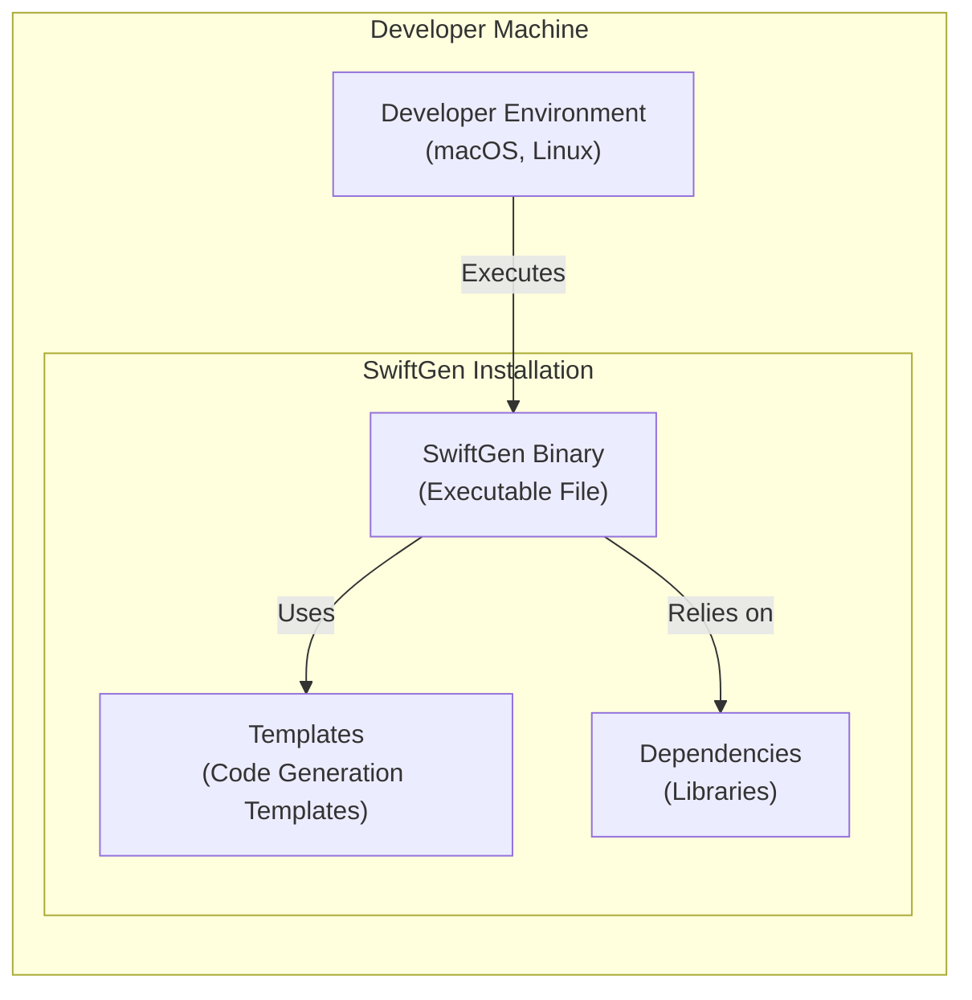
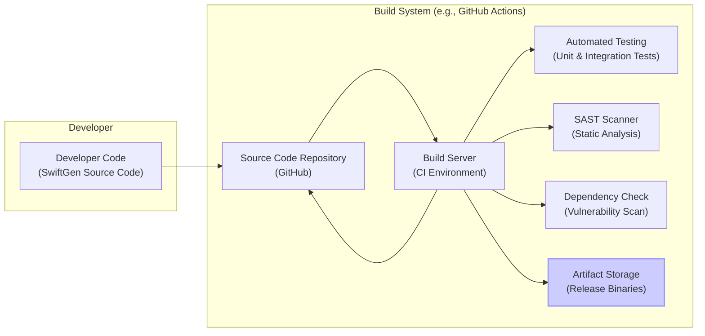

# BUSINESS POSTURE

This project, SwiftGen, aims to streamline iOS, macOS, watchOS, and tvOS development by automating the generation of Swift code for accessing resources like images, colors, storyboards, localized strings, and more.

Business Priorities and Goals:
- Improve developer productivity by reducing manual code writing for resource access.
- Enhance code maintainability by centralizing resource references and reducing magic strings.
- Increase type safety in resource handling, minimizing runtime errors due to incorrect resource names.
- Reduce the risk of typos and inconsistencies when referencing resources across the codebase.
- Facilitate easier refactoring and renaming of resources.

Business Risks:
- Dependency on a third-party tool for core development workflows.
- Potential for vulnerabilities in the generated code if SwiftGen itself has security flaws.
- Risk of build process disruption if SwiftGen becomes unavailable or incompatible.
- Misconfiguration of SwiftGen leading to incorrect or insecure code generation.
- Supply chain risks associated with dependencies of SwiftGen.

# SECURITY POSTURE

Existing Security Controls:
- security control: Open Source Code - The source code is publicly available on GitHub, allowing for community review and scrutiny. Implemented: GitHub Repository.
- security control: Dependency Management - SwiftGen uses dependency management tools (like CocoaPods, Swift Package Manager) to manage its dependencies. Implemented: `Package.swift`, `Podfile`.
- security control: Code Review - Contributions to SwiftGen are likely subject to code review by maintainers. Implemented: GitHub Pull Request process.

Accepted Risks:
- accepted risk: Reliance on Community Security - Security of SwiftGen relies on the vigilance of the open-source community to identify and report vulnerabilities.
- accepted risk: Dependency Vulnerabilities - Vulnerabilities in SwiftGen's dependencies could introduce security risks.
- accepted risk: Build Environment Security - Security of the build environment used to compile and distribute SwiftGen is assumed to be reasonably secure.

Recommended Security Controls:
- security control: Dependency Scanning - Implement automated dependency scanning to identify and address known vulnerabilities in SwiftGen's dependencies.
- security control: Static Application Security Testing (SAST) - Integrate SAST tools into the development pipeline to automatically analyze SwiftGen's code for potential security flaws.
- security control: Code Signing - Code sign the distributed binaries of SwiftGen to ensure integrity and authenticity.
- security control: Input Validation - Implement robust input validation to prevent SwiftGen from being exploited through maliciously crafted resource files.

Security Requirements:
- Authentication: Not applicable. SwiftGen is a command-line tool and does not require user authentication.
- Authorization: Not applicable. SwiftGen operates within the user's local file system and permissions are managed by the operating system.
- Input Validation:
    - Requirement: SwiftGen must validate all input files (e.g., storyboards, strings files, asset catalogs) to prevent processing of malicious or malformed files that could lead to unexpected behavior or vulnerabilities.
    - Requirement: SwiftGen must sanitize input data to prevent injection attacks if it were to ever generate code that interacts with external systems (though currently it primarily generates Swift code).
- Cryptography: Not applicable. SwiftGen does not inherently require cryptographic operations in its core functionality. If future features require cryptography, appropriate libraries and secure practices must be used.

# DESIGN

## C4 CONTEXT



Context Diagram Elements:

- Element:
    - Name: Developer
    - Type: Person
    - Description: Software developers who build iOS, macOS, watchOS, and tvOS applications using Swift. They use SwiftGen to automate code generation for resources.
    - Responsibilities: Uses SwiftGen to improve development workflow, configures SwiftGen for their projects, integrates generated code into their applications.
    - Security controls: Responsible for securely configuring SwiftGen and using it in a secure development environment.

- Element:
    - Name: SwiftGen
    - Type: Software System
    - Description: A command-line tool that generates Swift code to provide type-safe access to application resources (assets, storyboards, strings, etc.).
    - Responsibilities: Parses resource files, generates Swift code based on templates and configurations, outputs generated code to specified locations.
    - Security controls: Input validation of resource files, secure code generation practices, dependency management, build process security.

- Element:
    - Name: Package Manager
    - Type: Software System
    - Description: Tools like Homebrew, Swift Package Manager (SPM), and CocoaPods used to distribute and install SwiftGen.
    - Responsibilities: Package and distribute SwiftGen, manage installation and updates of SwiftGen for developers.
    - Security controls: Package integrity checks, secure distribution channels, vulnerability scanning of packages.

## C4 CONTAINER

```mermaid
flowchart LR
    subgraph "Developer Machine"
        subgraph "SwiftGen Container"
            SwiftGenCLI["SwiftGen CLI\n(Command-Line Interface)"]
            Parser["Parser\n(Resource File Parsers)"]
            Generator["Generator\n(Code Generation Engine)"]
            ConfigHandler["Config Handler\n(Configuration Processing)"]
        end
        DeveloperProject["Developer Project\n(Swift Application Project)"]
    end

    DeveloperProject -->|Uses generated code| SwiftGenCLI
    SwiftGenCLI -->|Parses resource files| Parser
    SwiftGenCLI -->|Generates Swift code| Generator
    SwiftGenCLI -->|Handles configuration| ConfigHandler
    Developer -->>|Configures and runs| SwiftGenCLI
    SwiftGenCLI -->>|Outputs generated code to| DeveloperProject
```

Container Diagram Elements:

- Element:
    - Name: SwiftGen CLI
    - Type: Application
    - Description: The command-line interface of SwiftGen, the main executable that developers interact with.
    - Responsibilities: Accepts user commands and configurations, orchestrates parsing and code generation, handles input and output operations.
    - Security controls: Input validation of command-line arguments and configuration files, secure handling of file system operations, logging and error handling.

- Element:
    - Name: Parser
    - Type: Component
    - Description: Responsible for parsing various resource file formats (e.g., XML for storyboards, strings files, asset catalogs).
    - Responsibilities: Reads and interprets resource files, extracts relevant information, handles different file formats and versions.
    - Security controls: Input validation of resource file content, error handling for malformed files, prevention of parser vulnerabilities (e.g., XML External Entity injection if applicable).

- Element:
    - Name: Generator
    - Type: Component
    - Description: The code generation engine that takes parsed resource data and templates to generate Swift code.
    - Responsibilities: Applies templates to parsed data, generates Swift code in the desired format, handles different code generation scenarios.
    - Security controls: Secure template processing, prevention of code injection vulnerabilities in generated code, output sanitization if necessary.

- Element:
    - Name: Config Handler
    - Type: Component
    - Description: Manages the configuration of SwiftGen, including reading configuration files (e.g., `swiftgen.yml`) and applying settings.
    - Responsibilities: Loads and parses configuration files, validates configuration settings, provides configuration data to other components.
    - Security controls: Input validation of configuration files, secure handling of configuration data, prevention of configuration-related vulnerabilities.

- Element:
    - Name: Developer Project
    - Type: Container
    - Description: The Swift application project being developed by the developer, which integrates the code generated by SwiftGen.
    - Responsibilities: Consumes and utilizes the generated Swift code, integrates it into the application's codebase, benefits from type-safe resource access.
    - Security controls: Secure coding practices within the developer project, proper usage of generated code, overall application security.

## DEPLOYMENT

Deployment Architecture: Local Developer Machine



Deployment Diagram Elements:

- Element:
    - Name: Developer Environment
    - Type: Infrastructure
    - Description: The operating system and environment on the developer's local machine where SwiftGen is executed (typically macOS or Linux).
    - Responsibilities: Provides the runtime environment for SwiftGen, manages file system access, executes the SwiftGen binary.
    - Security controls: Operating system security controls, user account permissions, local security policies.

- Element:
    - Name: SwiftGen Binary
    - Type: Software
    - Description: The compiled executable file of SwiftGen, installed on the developer's machine.
    - Responsibilities: Executes SwiftGen's functionality, performs code generation, interacts with the file system.
    - Security controls: Code signing (recommended), file system permissions, protection against unauthorized modification.

- Element:
    - Name: Templates
    - Type: Data
    - Description: Code generation templates used by SwiftGen to generate Swift code. These are typically bundled with SwiftGen or can be custom.
    - Responsibilities: Provide the structure and logic for code generation, define the format of the output code.
    - Security controls: Template integrity, protection against template injection vulnerabilities (though less likely in this context), secure storage and distribution of templates.

- Element:
    - Name: Dependencies
    - Type: Software
    - Description: Libraries and frameworks that SwiftGen depends on to function correctly.
    - Responsibilities: Provide supporting functionalities for SwiftGen, such as parsing, file handling, and code generation.
    - Security controls: Dependency vulnerability scanning, using trusted dependency sources, regular updates of dependencies.

## BUILD



Build Process Description:
1. Developer writes and commits code changes to the SwiftGen source code repository (e.g., GitHub).
2. A build system (e.g., GitHub Actions, Jenkins) is triggered by code changes.
3. The build server retrieves the latest source code from the repository.
4. The build process compiles the SwiftGen source code into executable binaries.
5. Automated tests (unit and integration tests) are executed to ensure code quality and functionality.
6. Static Application Security Testing (SAST) tools are used to scan the codebase for potential security vulnerabilities.
7. Dependency check tools are used to scan dependencies for known vulnerabilities.
8. If all checks pass, the build artifacts (executables, packages) are stored in an artifact storage (e.g., GitHub Releases).
9. The build system may also update the source code repository with build status and release information.

Build Security Controls:
- security control: Secure Build Environment - Use a hardened and regularly updated build environment to minimize the risk of compromise.
- security control: Automated Build Process - Automate the build process to ensure consistency and repeatability, reducing manual errors.
- security control: Source Code Management - Use a version control system (Git/GitHub) to track code changes and ensure code integrity.
- security control: Static Application Security Testing (SAST) - Integrate SAST tools to automatically detect potential security vulnerabilities in the code.
- security control: Dependency Scanning - Implement dependency scanning to identify and manage vulnerabilities in third-party libraries.
- security control: Automated Testing - Comprehensive automated testing (unit, integration) to ensure code quality and reduce the likelihood of introducing vulnerabilities.
- security control: Code Signing - Sign the release binaries to ensure integrity and authenticity, allowing users to verify the source of the software.
- security control: Access Control - Restrict access to the build system and artifact storage to authorized personnel only.

# RISK ASSESSMENT

Critical Business Processes Protected:
- Software Development Process - SwiftGen directly supports and enhances the software development process for Swift-based applications by improving developer productivity and code quality.

Data Protected and Sensitivity:
- SwiftGen Tool Itself (Source Code, Binaries) - Sensitivity: Medium to High. Compromise could lead to distribution of malicious versions of SwiftGen, impacting many developers and projects.
- Resource Files (Input to SwiftGen) - Sensitivity: Low to Medium. These files (storyboards, strings, assets) are typically part of the application codebase and may contain sensitive information depending on the application's nature. Exposure could lead to information disclosure, but the direct risk is generally lower than compromising the tool itself.
- Generated Code (Output of SwiftGen) - Sensitivity: Low to Medium. Generated code is part of the application codebase. Vulnerabilities in generated code could introduce application-level security issues.

# QUESTIONS & ASSUMPTIONS

Questions:
- What is the current process for dependency management and vulnerability scanning for SwiftGen's dependencies?
- Are there any existing SAST tools integrated into the development workflow for SwiftGen?
- Is code signing currently implemented for SwiftGen release binaries?
- What is the process for handling security vulnerabilities reported by the community or identified through security testing?
- Are there any specific security requirements or compliance standards that SwiftGen needs to adhere to?

Assumptions:
- BUSINESS POSTURE: The primary goal of SwiftGen is to improve developer productivity and code quality in Swift development. Security is a secondary but important consideration.
- SECURITY POSTURE: Current security controls are primarily focused on open-source best practices and community review. There is room for improvement in automated security testing and supply chain security.
- DESIGN: SwiftGen is primarily a command-line tool executed locally by developers. The deployment model is focused on distribution through package managers and direct downloads. The build process is assumed to be using standard CI/CD practices, but security aspects can be enhanced.