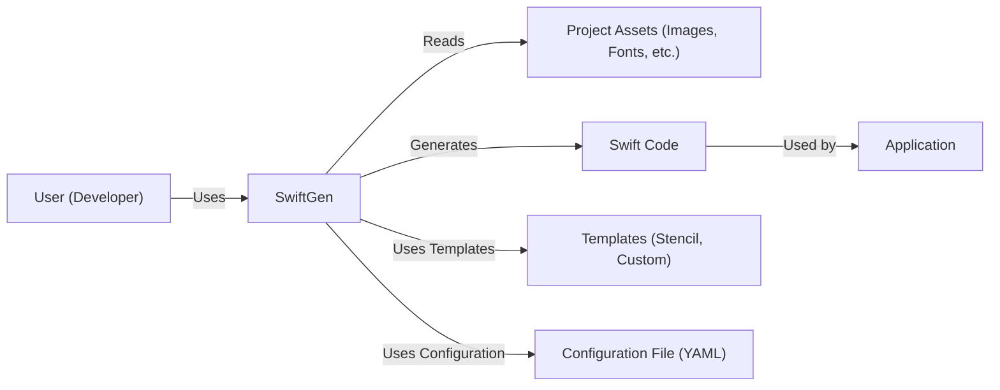
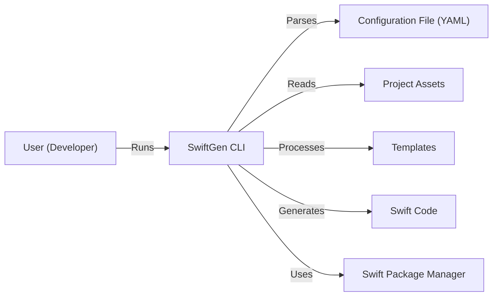
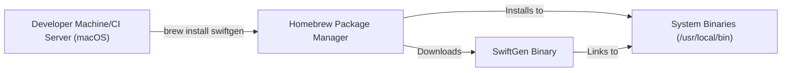
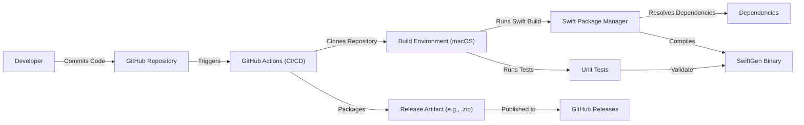

# BUSINESS POSTURE

Business Priorities and Goals:

*   Automate the generation of Swift code for resources like images, fonts, colors, and localized strings.
*   Improve developer productivity by reducing boilerplate code and potential errors.
*   Enhance code maintainability and consistency across projects.
*   Provide a flexible and customizable tool that can be adapted to different project needs and coding styles.
*   Maintain an active and supportive open-source community.

Business Risks:

*   Malicious code injection: If SwiftGen is compromised, it could be used to inject malicious code into projects that use it. This is a critical risk, given SwiftGen's role in code generation.
*   Supply chain attacks: Dependencies of SwiftGen could be compromised, leading to the introduction of vulnerabilities.
*   Incorrect code generation: Bugs in SwiftGen could lead to the generation of incorrect or buggy code, potentially causing runtime errors or unexpected behavior in applications.
  Denial of service. SwiftGen can be tricked to generate very large files that will consume all available resources.
*   Data breaches (indirect): While SwiftGen doesn't directly handle sensitive data, the code it generates might interact with such data. Flaws in the generated code could indirectly contribute to data breaches.
*   Community abandonment: If the project is abandoned by its maintainers, it could become outdated, vulnerable, and unsupported.

# SECURITY POSTURE

Existing Security Controls:

*   security control: Code Reviews: Pull requests are reviewed by maintainers before merging. (Implicit in the GitHub workflow).
*   security control: Community vigilance: The open-source nature of the project allows for community scrutiny and reporting of potential issues.
*   security control: Static Analysis: Some level of static analysis is likely performed, either manually or through integrated tools in the development environment (Xcode).
*   security control: Dependency Management: Swift Package Manager is used to manage dependencies, providing some level of version control and auditing.
*   security control: Testing: The project includes unit tests to verify the functionality of the code generator.

Accepted Risks:

*   accepted risk: Limited formal security audits: As an open-source project, it likely lacks the resources for regular, comprehensive security audits.
*   accepted risk: Reliance on community contributions: The project's security relies heavily on the contributions and vigilance of the community.
*   accepted risk: Potential for zero-day vulnerabilities: Like any software, SwiftGen is susceptible to undiscovered vulnerabilities.

Recommended Security Controls:

*   security control: Implement SAST (Static Application Security Testing) tools in the CI/CD pipeline to automatically scan for vulnerabilities in each build.
*   security control: Implement DAST (Dynamic Application Security Testing) or IAST (Interactive Application Security Testing) to test the tool's behavior at runtime.
*   security control: Conduct regular security audits, potentially through bug bounty programs or community-driven security reviews.
*   security control: Implement a Software Bill of Materials (SBOM) to track all dependencies and their versions, making it easier to identify and address vulnerabilities.
*   security control: Use a dependency vulnerability scanner (e.g., Dependabot, Snyk) to automatically detect and report known vulnerabilities in dependencies.
*   security control: Harden the build process to prevent tampering and ensure the integrity of the generated artifacts.
*   security control: Provide clear security guidelines and best practices for users of SwiftGen.
*   security control: Implement fuzzing to test SwiftGen with unexpected inputs and identify potential crashes or vulnerabilities.

Security Requirements:

*   Authentication: Not directly applicable to SwiftGen, as it's a command-line tool. However, access to the GitHub repository and any associated CI/CD pipelines should be protected with strong authentication.
*   Authorization: Not directly applicable to SwiftGen itself. However, access control should be enforced for repository management and build processes.
*   Input Validation: SwiftGen must properly validate all inputs, including template files, configuration files, and command-line arguments, to prevent code injection and other vulnerabilities. This is crucial.
*   Cryptography: Not directly applicable, as SwiftGen doesn't handle sensitive data directly. However, if SwiftGen were to interact with APIs or services that require authentication, it should use secure cryptographic practices.
*   Output Encoding: SwiftGen should ensure that the generated code is properly encoded to prevent vulnerabilities like cross-site scripting (XSS) if the generated code is used in web contexts (though this is unlikely).
*   Error Handling: SwiftGen should handle errors gracefully and provide informative error messages without revealing sensitive information.

# DESIGN

## C4 CONTEXT

Element Descriptions:

*   Element:
    *   Name: User (Developer)
    *   Type: Person
    *   Description: A developer who uses SwiftGen to generate Swift code.
    *   Responsibilities: Runs SwiftGen, configures it, provides templates, and integrates the generated code into their application.
    *   Security controls: None directly applicable to the user, but user should follow secure coding practices.

*   Element:
    *   Name: SwiftGen
    *   Type: Software System
    *   Description: The core SwiftGen tool, a command-line utility.
    *   Responsibilities: Parses configuration, reads assets, processes templates, and generates Swift code.
    *   Security controls: Input validation, secure template processing, secure dependency management, regular security audits, SAST, DAST.

*   Element:
    *   Name: Project Assets (Images, Fonts, etc.)
    *   Type: Data
    *   Description: The resource files (images, fonts, colors, localized strings) that SwiftGen processes.
    *   Responsibilities: Provide the data for code generation.
    *   Security controls: None directly applicable, but assets should be managed securely.

*   Element:
    *   Name: Swift Code
    *   Type: Data
    *   Description: The Swift code generated by SwiftGen.
    *   Responsibilities: Provides type-safe access to project assets within the application.
    *   Security controls: Code reviews, static analysis (of the generated code).

*   Element:
    *   Name: Application
    *   Type: Software System
    *   Description: The application that uses the Swift code generated by SwiftGen.
    *   Responsibilities: Utilizes the generated code to access and display resources.
    *   Security controls: Standard application security measures.

*   Element:
    *   Name: Templates (Stencil, Custom)
    *   Type: Data
    *   Description: Templates that define how SwiftGen generates code.
    *   Responsibilities: Control the structure and content of the generated code.
    *   Security controls: Template validation, sandboxing (if possible), secure template storage.

*   Element:
    *   Name: Configuration File (YAML)
    *   Type: Data
    *   Description: A YAML file that configures SwiftGen's behavior.
    *   Responsibilities: Specifies input files, output paths, template choices, and other settings.
    *   Security controls: Input validation, secure configuration file storage.

## C4 CONTAINER

Since SwiftGen is a relatively simple command-line tool, the Container diagram is essentially an expansion of the Context diagram.

Element Descriptions:

*   Element:
    *   Name: User (Developer)
    *   Type: Person
    *   Description: A developer who uses SwiftGen to generate Swift code.
    *   Responsibilities: Runs SwiftGen, configures it, provides templates, and integrates the generated code into their application.
    *   Security controls: None directly applicable.

*   Element:
    *   Name: SwiftGen CLI
    *   Type: Container (Command-Line Tool)
    *   Description: The main executable of SwiftGen.
    *   Responsibilities: Parses command-line arguments, reads configuration, loads templates, processes assets, and generates Swift code.
    *   Security controls: Input validation, secure template processing, secure dependency management, regular security audits, SAST, DAST.

*   Element:
    *   Name: Configuration File (YAML)
    *   Type: Data
    *   Description: A YAML file that configures SwiftGen's behavior.
    *   Responsibilities: Specifies input files, output paths, template choices, and other settings.
    *   Security controls: Input validation, secure configuration file storage.

*   Element:
    *   Name: Project Assets
    *   Type: Data
    *   Description: The resource files (images, fonts, colors, localized strings) that SwiftGen processes.
    *   Responsibilities: Provide the data for code generation.
    *   Security controls: None directly applicable.

*   Element:
    *   Name: Templates
    *   Type: Data
    *   Description: Templates that define how SwiftGen generates code.
    *   Responsibilities: Control the structure and content of the generated code.
    *   Security controls: Template validation, sandboxing (if possible), secure template storage.

*   Element:
    *   Name: Swift Code
    *   Type: Data
    *   Description: The Swift code generated by SwiftGen.
    *   Responsibilities: Provides type-safe access to project assets within the application.
    *   Security controls: Code reviews, static analysis (of the generated code).

*   Element:
    *   Name: Swift Package Manager
    *   Type: Container (Dependency Manager)
    *   Description: Used to manage SwiftGen's dependencies.
    *   Responsibilities: Resolves and downloads dependencies.
    *   Security controls: Dependency vulnerability scanning, SBOM.

## DEPLOYMENT

SwiftGen is a command-line tool, and its "deployment" typically involves installation on a developer's machine or a CI/CD server. Several deployment options exist:

1.  **Homebrew:** `brew install swiftgen` (macOS)
2.  **Mint:** `mint install swiftgen/swiftgen` (Swift-specific tool)
3.  **CocoaPods:** (Less common, but possible)
4.  **Manual Build:** Cloning the repository and building from source.
5.  **As a Swift Package:** Including SwiftGen as a dependency in another Swift package (for build-time code generation).

We'll describe the Homebrew deployment, as it's a common and recommended method.

Element Descriptions:

*   Element:
    *   Name: Developer Machine/CI Server (macOS)
    *   Type: Infrastructure Node
    *   Description: The machine where SwiftGen is being installed.
    *   Responsibilities: Runs the Homebrew installation command.
    *   Security controls: OS-level security controls, secure network configuration.

*   Element:
    *   Name: Homebrew Package Manager
    *   Type: Software
    *   Description: The Homebrew package manager for macOS.
    *   Responsibilities: Downloads, verifies, and installs software packages.
    *   Security controls: Homebrew's built-in security mechanisms (checksum verification, code signing checks).

*   Element:
    *   Name: SwiftGen Binary
    *   Type: Artifact
    *   Description: The compiled SwiftGen executable.
    *   Responsibilities: The core functionality of SwiftGen.
    *   Security controls: Code signing (if implemented), build process hardening.

*   Element:
    *   Name: System Binaries (/usr/local/bin)
    *   Type: Infrastructure Node (Directory)
    *   Description: The directory where Homebrew installs executables.
    *   Responsibilities: Makes SwiftGen accessible via the command line.
    *   Security controls: File system permissions.

## BUILD

The build process for SwiftGen involves compiling the Swift source code into an executable. This is typically done using Xcode or the Swift Package Manager. The repository uses GitHub Actions for CI/CD.

Security Controls in the Build Process:

*   security control: GitHub Actions: Provides a secure and automated build environment.
*   security control: Swift Package Manager: Manages dependencies, providing some level of security through versioning and checksums.
*   security control: Unit Tests: Verify the functionality of the code and help prevent regressions.
*   security control: (Recommended) SAST: Integrate a static analysis tool into the GitHub Actions workflow to scan for vulnerabilities.
*   security control: (Recommended) Dependency Scanning: Use a tool like Dependabot or Snyk to automatically detect vulnerabilities in dependencies.
*   security control: (Recommended) Code Signing: Sign the released binaries to ensure their integrity and authenticity.

# RISK ASSESSMENT

Critical Business Processes:

*   Code generation for Swift projects: SwiftGen's primary function is to generate code, and any disruption to this process would impact developers who rely on it.
*   Maintaining the open-source project: The health and activity of the SwiftGen community are crucial for its continued development and support.

Data:

*   Project Assets (Low Sensitivity): SwiftGen processes project assets (images, fonts, etc.), but these are generally not considered highly sensitive data. However, localized strings *could* contain sensitive information, depending on the application.
*   Templates (Medium Sensitivity): Custom templates could potentially contain sensitive information or logic.
*   Configuration Files (Low-Medium Sensitivity): Configuration files might contain paths or settings that could be exploited if exposed.
*   Generated Swift Code (Low-Medium Sensitivity): The generated code itself is not inherently sensitive, but it could interact with sensitive data within the application. The sensitivity depends on the application's context.
*   Source Code (Medium Sensitivity): The SwiftGen source code itself is valuable and should be protected from unauthorized modification.

# QUESTIONS & ASSUMPTIONS

Questions:

*   Are there any specific compliance requirements (e.g., GDPR, HIPAA) that apply to applications built using SwiftGen? (This would influence the sensitivity of the generated code.)
*   What is the expected level of security expertise of the typical SwiftGen user? (This informs the need for user-friendly security guidance.)
*   Are there any plans to expand SwiftGen's functionality in ways that might introduce new security concerns (e.g., interacting with external APIs)?
*   What is the process for handling reported security vulnerabilities?
*   Are there any specific threat models or attack scenarios that the maintainers are particularly concerned about?

Assumptions:

*   BUSINESS POSTURE: The primary goal is to provide a useful and reliable tool for the Swift development community. Security is important, but it's balanced against the need for ease of use and maintainability.
*   SECURITY POSTURE: The project relies on a combination of community vigilance, code reviews, and basic security practices. There is room for improvement in terms of formal security audits and automated security testing.
*   DESIGN: SwiftGen is a relatively simple command-line tool with a well-defined scope. The main security concerns revolve around input validation, template processing, and dependency management. The deployment model is straightforward, typically involving installation via a package manager. The build process is automated using GitHub Actions.