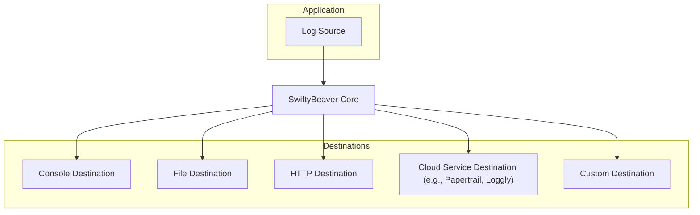
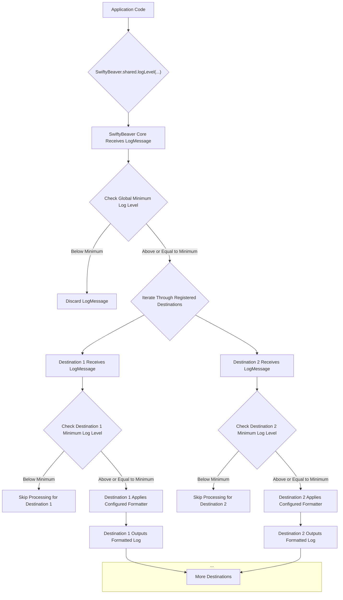

# Project Design Document: SwiftyBeaver Logging Library

**Version:** 1.1
**Date:** October 26, 2023
**Author:** AI Software Architect

## 1. Introduction

This document provides a detailed design overview of the SwiftyBeaver logging library for Swift. It outlines the architecture, components, data flow, and key considerations relevant for subsequent threat modeling activities. This document aims to provide a comprehensive understanding of the system's internal workings and external interactions, focusing on aspects pertinent to security analysis.

## 2. Goals and Objectives

The primary goals of SwiftyBeaver are to provide:

*   A flexible and extensible logging framework for Swift applications.
*   Support for multiple log destinations (e.g., console, file, network).
*   Customizable log formatting with pluggable formatters.
*   Easy integration into existing Swift projects via Swift Package Manager or other dependency managers.
*   A clear and concise API for logging messages with different severity levels.
*   Mechanisms for controlling log output based on severity and destination.

## 3. High-Level Architecture

The SwiftyBeaver library employs a modular architecture centered around a core logging engine and a set of pluggable destinations. This design allows for easy extension and customization of logging behavior.

*   **Log Source:** Any module or part of the application code that initiates a log event by calling the SwiftyBeaver API.
*   **SwiftyBeaver Core:** The central processing unit of the library, responsible for receiving log messages, applying global configurations, and dispatching them to the registered destinations.
*   **Destinations:** Independent modules responsible for the final output of log messages to specific targets, each potentially with its own formatting and delivery logic.

## 4. Component Design

This section provides a more detailed breakdown of the key components within the SwiftyBeaver library.

### 4.1. SwiftyBeaver Core

The core component orchestrates the logging process and manages the interaction between log sources and destinations.

*   **`SwiftyBeaver` Class (Singleton):**
    *   Provides the primary API entry points for logging messages at different severity levels (`verbose`, `debug`, `info`, `warning`, `error`).
    *   Maintains a collection of registered `Destination` instances.
    *   Receives `LogMessage` instances from the application.
    *   Iterates through the registered destinations and dispatches a copy of the `LogMessage` to each.
    *   Manages global configuration settings such as the minimum log level applied across all destinations (unless overridden by a specific destination).
    *   Potentially includes mechanisms for adding and removing destinations dynamically.
*   **`LogMessage` Struct:**
    *   A value type representing a single log event.
    *   Immutable once created, ensuring data integrity during processing.
    *   Contains essential information about the log event:
        *   `level`: An enumeration representing the severity of the log message (e.g., `LogLevel.verbose`).
        *   `message`: The actual log message string, potentially containing interpolated values.
        *   `file`: The name of the source code file where the log originated.
        *   `function`: The name of the function where the log originated.
        *   `line`: The line number within the source code file.
        *   `date`: A `Date` object representing the time the log event occurred.
        *   `thread`: Information about the thread on which the log occurred.
*   **`Formatters` (Protocols and Implementations):**
    *   Responsible for transforming the structured `LogMessage` into a string representation suitable for output by a specific destination.
    *   Defined by a protocol (`LogFormatter`) that requires a `format` method taking a `LogMessage` and returning a `String`.
    *   Provides default formatters (e.g., a simple text formatter, a JSON formatter).
    *   Allows developers to create custom formatters to tailor the output format for specific needs. Formatters are typically configured per destination.

### 4.2. Destinations

Destinations handle the final output of formatted log messages to various targets. Each destination encapsulates the logic for formatting and delivering logs to a specific medium.

*   **`BaseDestination` Class (Abstract):**
    *   Serves as the foundation for all concrete destinations, providing common functionality.
    *   Defines the core interface for destinations, including:
        *   `log(level:message:file:function:line:context:)`: Receives a `LogMessage` from the `SwiftyBeaver` core.
        *   `format(message:)`: Applies the destination's configured formatter to the `LogMessage`.
        *   `minLevel`: A configurable property to set the minimum log level for this specific destination, overriding the global setting.
        *   Error handling mechanisms for output failures.
    *   May include default implementations for common tasks.
*   **`ConsoleDestination` Class:**
    *   A concrete `Destination` that outputs formatted log messages to the standard output or standard error streams.
    *   May offer options for colorizing output based on log level for improved readability in the console.
    *   Typically synchronous, meaning the logging call blocks until the message is written to the console.
*   **`FileDestination` Class:**
    *   A concrete `Destination` that writes formatted log messages to a specified file on the local file system.
    *   Configuration options include:
        *   File path and name.
        *   Log rotation strategies (e.g., based on file size, date, or time intervals).
        *   Asynchronous writing to a background thread to avoid blocking the main application thread.
        *   File locking mechanisms to prevent data corruption if multiple processes write to the same log file.
    *   Error handling for file access issues (e.g., permissions, disk space).
*   **`HTTPDestination` Class:**
    *   A concrete `Destination` that sends formatted log messages to a remote HTTP endpoint.
    *   Requires configuration of:
        *   Target URL (HTTPS should be enforced for security).
        *   HTTP method (e.g., POST, PUT).
        *   Custom HTTP headers for authentication or content type.
        *   Request body format (e.g., JSON, plain text).
        *   Timeout settings for network requests.
        *   Retry mechanisms and backoff strategies for handling transient network errors.
    *   May support batching of log messages to reduce the number of HTTP requests.
    *   Security considerations include secure storage of API keys or authentication tokens if required by the remote endpoint.
*   **`CloudDestination` Classes (e.g., `PapertrailDestination`, `LogglyDestination`):**
    *   Concrete `Destination` classes designed to integrate with specific cloud-based logging services.
    *   Encapsulate the specific API interactions, authentication methods, and data formats required by each service.
    *   Configuration typically involves providing API keys or tokens specific to the chosen service.
    *   Error handling for API communication failures and potential rate limiting.
*   **`CustomDestination` (Protocol or Abstract Class):**
    *   Provides a mechanism for developers to create their own custom destinations by implementing the `BaseDestination` protocol or inheriting from an abstract base class.
    *   Allows for integration with specialized logging systems or data stores.

## 5. Data Flow

The following diagram illustrates the detailed flow of a log message through the SwiftyBeaver library, highlighting key processing steps.

1. The application code initiates a log event by calling a logging method on the `SwiftyBeaver` singleton, creating a `LogMessage`.
2. The `SwiftyBeaver` core receives the `LogMessage`.
3. The core checks if the log message's level meets the globally configured minimum log level.
4. If the log level is below the global minimum, the message is discarded, and no further processing occurs.
5. If the log level is sufficient, the core iterates through the registered `Destination` instances.
6. For each `Destination`, the core passes a copy of the `LogMessage`.
7. The `Destination` checks if the log message's level meets its own configured minimum log level (which can override the global setting).
8. If the log level is below the destination's minimum, processing for that destination is skipped.
9. If the log level is sufficient, the `Destination` applies its configured `Formatter` to the `LogMessage`, generating a formatted string.
10. The `Destination` outputs the formatted log message to its target (e.g., console, file, network), handling any destination-specific logic and potential errors.

## 6. Security Considerations

This section details security considerations relevant for threat modeling, categorized by component and data flow.

*   **Sensitive Data Logging:**
    *   **Threat:** Unintentional logging of sensitive information (e.g., user credentials, API keys, personal data) into log messages.
    *   **Mitigation:** Implement strict guidelines and code reviews to prevent logging of sensitive data. Consider using data masking or redaction techniques within custom formatters. Educate developers on secure logging practices.
*   **Log Injection:**
    *   **Threat:** Attackers injecting malicious content into log messages through user-controlled input that is subsequently logged. This could lead to vulnerabilities in log analysis tools or downstream systems that process logs.
    *   **Mitigation:** Sanitize or encode user-provided input before including it in log messages. Avoid directly embedding unsanitized user input into log strings.
*   **Secure Transmission (HTTP Destination):**
    *   **Threat:** Interception or tampering of log data transmitted over the network if HTTPS is not used. Exposure of sensitive information if transmitted in plain text.
    *   **Mitigation:** Enforce the use of HTTPS for all `HTTPDestination` configurations. Implement proper authentication and authorization mechanisms at the receiving endpoint. Securely manage any API keys or tokens used for authentication.
*   **Log File Security (File Destination):**
    *   **Threat:** Unauthorized access, modification, or deletion of log files if file system permissions are not properly configured.
    *   **Mitigation:** Implement appropriate file system permissions to restrict access to log files to authorized users and processes only. Consider encrypting log files at rest for highly sensitive environments.
*   **Cloud Service Security (Cloud Destinations):**
    *   **Threat:** Security vulnerabilities within the third-party cloud logging service. Exposure of log data due to misconfiguration of the cloud service.
    *   **Mitigation:** Choose reputable cloud logging providers with strong security practices. Follow the provider's recommendations for secure configuration, including access control and data retention policies. Securely manage API keys or tokens used to authenticate with the cloud service.
*   **Configuration Management:**
    *   **Threat:** Exposure or unauthorized modification of SwiftyBeaver configuration, potentially leading to logging to unintended destinations or the disclosure of sensitive configuration data (e.g., API keys in HTTP destinations).
    *   **Mitigation:** Store SwiftyBeaver configuration securely. Avoid hardcoding sensitive configuration data directly in the application code. Use environment variables or secure configuration management tools.
*   **Error Handling:**
    *   **Threat:** Insufficient error handling in destinations could lead to dropped log messages without notification, hindering debugging and security monitoring.
    *   **Mitigation:** Implement robust error handling within each destination to gracefully handle output failures (e.g., network errors, file access issues). Consider logging errors encountered during the logging process itself.
*   **Performance and Resource Consumption:**
    *   **Threat:** Excessive logging, especially to resource-intensive destinations (e.g., remote HTTP endpoints), could lead to performance degradation or denial-of-service conditions.
    *   **Mitigation:** Carefully configure log levels and destinations to avoid excessive logging. Implement asynchronous logging where appropriate to minimize impact on the main application thread. Monitor resource consumption related to logging.
*   **Dependency Security:**
    *   **Threat:** Vulnerabilities in SwiftyBeaver's dependencies could introduce security risks.
    *   **Mitigation:** Regularly update SwiftyBeaver's dependencies to the latest secure versions. Use dependency scanning tools to identify potential vulnerabilities.

## 7. Deployment Model

SwiftyBeaver is typically integrated into Swift applications as a library dependency. This can be achieved through:

*   **Swift Package Manager:** Adding SwiftyBeaver as a dependency in the `Package.swift` file.
*   **CocoaPods:** Adding SwiftyBeaver to the `Podfile`.
*   **Carthage:** Adding SwiftyBeaver to the `Cartfile`.

The application code then initializes and configures SwiftyBeaver with the desired destinations and settings during the application startup process.

## 8. Assumptions and Constraints

*   Developers are responsible for configuring SwiftyBeaver and its destinations securely, including setting appropriate log levels, securing network connections, and managing access to log files.
*   The security of third-party cloud logging services is the responsibility of the respective providers. SwiftyBeaver assumes these services implement adequate security measures.
*   Performance considerations for logging are generally acceptable for most applications, but developers should be aware of potential overhead and optimize logging configurations for performance-critical applications.
*   SwiftyBeaver relies on the underlying operating system and network infrastructure for basic security functions (e.g., file system permissions, network transport security).

## 9. Future Considerations

*   **Enhanced Filtering Capabilities:** Implementing more advanced filtering options within the core and destinations, allowing for more granular control over which log messages are processed and output.
*   **Structured Logging:**  Further enhancing support for structured logging formats (e.g., JSON) to facilitate easier parsing and analysis by log management systems.
*   **Centralized Configuration:** Exploring mechanisms for managing SwiftyBeaver configuration from a central location, potentially using configuration files or remote configuration services.
*   **Metrics and Monitoring Integration:**  Adding built-in support for emitting metrics related to logging activity, enabling integration with monitoring and alerting systems.
*   **Log Sampling:** Implementing log sampling techniques to reduce the volume of logs generated in high-traffic environments while still capturing representative data.

This improved design document provides a more detailed and security-focused overview of the SwiftyBeaver logging library, offering a solid foundation for comprehensive threat modeling activities. The added details on component functionality, data flow, and specific security considerations should enable a more thorough analysis of potential vulnerabilities and attack vectors.