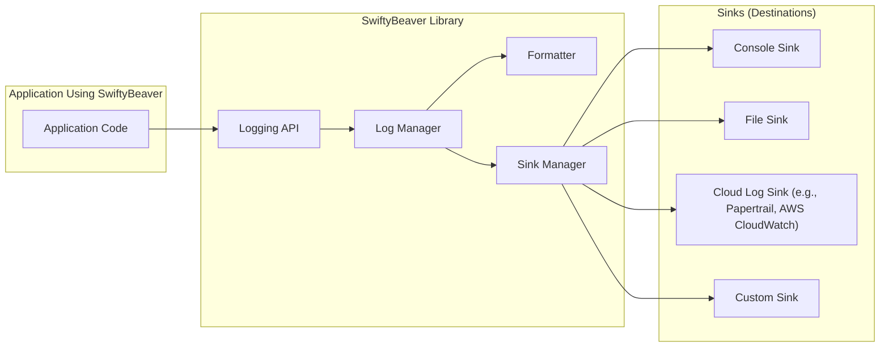

# Project Design Document: SwiftyBeaver Logging Library

**Version:** 1.1
**Date:** October 26, 2023
**Author:** AI Software Architect

## 1. Introduction

This document provides an enhanced and detailed design overview of the SwiftyBeaver logging library, an open-source logging framework for Swift platforms. This document aims to clearly articulate the architecture, components, and data flow within SwiftyBeaver, with a specific focus on providing the necessary information for effective threat modeling and security analysis.

## 2. Project Overview

SwiftyBeaver is a versatile logging library for Swift developers, offering a unified and streamlined approach to managing log messages. It allows developers to send log output to various configurable destinations (sinks), including the console, local files, and numerous cloud-based logging services. The library prioritizes ease of use and flexibility in handling log output.

## 3. Architecture Diagram

## 4. Component Details

*   **Application Code:** The Swift application that integrates the SwiftyBeaver library. This component initiates the logging process by calling SwiftyBeaver's logging methods.
*   **SwiftyBeaver Library:** The central framework encompassing several key modules:
    *   **Logging API:** Provides the public interface for developers to generate log messages with different severity levels (e.g., `verbose`, `debug`, `info`, `warning`, `error`).
    *   **Log Manager:**  The core component responsible for receiving log messages from the API, applying configured filters based on log levels, and routing messages to the appropriate sinks.
    *   **Formatter:**  Transforms raw log messages into a structured format suitable for output. SwiftyBeaver supports customizable formatters, allowing developers to define the structure and content of log entries.
    *   **Sink Manager:**  Manages the collection of registered sinks. It iterates through the active sinks and dispatches formatted log messages to each one.
*   **Sinks (Destinations):**  Individual modules responsible for handling the output of log messages to specific destinations.
    *   **Console Sink:**  Directs formatted log messages to the standard output or standard error streams of the running application. This is primarily used for development and debugging.
    *   **File Sink:** Writes formatted log messages to a designated file on the local file system. Configuration options include:
        *   **File Path:** Specifies the location of the log file.
        *   **File Rotation:**  Mechanisms for rotating log files based on size or time to prevent them from growing indefinitely.
        *   **File Permissions:**  The operating system permissions assigned to the created log files.
        *   **Write Mode:**  Whether to append to an existing file or overwrite it.
    *   **Cloud Log Sink:**  Transmits formatted log messages to external cloud-based logging services. Specific implementations vary but generally involve:
        *   **Papertrail Sink:** Sends logs over TCP or TLS to the Papertrail service. Requires a Papertrail API token for authentication.
        *   **AWS CloudWatch Sink:** Utilizes the AWS SDK for Swift to send log events to Amazon CloudWatch Logs. Requires appropriate AWS credentials and IAM permissions configured for the environment.
        *   **Other Cloud Sinks:**  Implementations for other services like Splunk, Loggly, etc., each with their specific authentication and transmission protocols.
    *   **Custom Sink:**  Allows developers to implement their own sink logic to send logs to any desired destination or format not covered by the built-in sinks. This offers significant extensibility but also introduces potential security risks if not implemented carefully.

## 5. Data Flow

The journey of a log message through SwiftyBeaver follows these steps:

1. **Log Message Creation:** The application code invokes a SwiftyBeaver logging method (e.g., `log.debug("User logged in")`). This creates a log message object containing the message, log level, source information (file, function, line), and timestamp.
2. **Reception by Log Manager:** The `Log Manager` receives the log message object.
3. **Log Level Filtering:** The `Log Manager` checks the configured minimum log level for each registered sink. If the message's log level is below the minimum for a particular sink, the message is discarded for that sink.
4. **Formatting:** If the message passes the level filter for a sink, the `Log Manager` passes the log message object to the configured `Formatter`. The `Formatter` transforms the raw log message into a formatted string according to the defined format pattern. This might involve adding timestamps, log levels, source information, and other contextual data.
5. **Dispatch to Sink Manager:** The formatted log message is then passed to the `Sink Manager`.
6. **Sink Iteration:** The `Sink Manager` iterates through the list of registered and active sinks.
7. **Transmission to Sinks:** For each sink, the `Sink Manager` calls the sink's specific method for handling the formatted log message:
    *   **Console Sink:** Writes the formatted string to the console output stream.
    *   **File Sink:**  Appends the formatted string to the configured log file. This involves file system operations.
    *   **Cloud Log Sink:**  Transmits the formatted string to the remote logging service using the sink's specific communication protocol and authentication mechanism. This involves network operations.
    *   **Custom Sink:**  Invokes the custom logic implemented within the sink to handle the formatted log message.

## 6. Key Security Considerations

This section details potential security risks associated with SwiftyBeaver and suggests mitigation strategies.

*   **Data Confidentiality:**
    *   **Risk:** Logging sensitive information (e.g., API keys, passwords, personal data) directly in log messages can lead to unauthorized disclosure if log files or cloud logging destinations are compromised.
    *   **Mitigation:**
        *   Implement strict policies to avoid logging sensitive data.
        *   Sanitize or redact sensitive information before logging.
        *   Consider using more secure methods for handling sensitive data instead of logging.
    *   **Risk:** Unauthorized access to log files stored by the `File Sink`.
    *   **Mitigation:**
        *   Set restrictive file system permissions on log files and directories.
        *   Store log files in secure locations.
        *   Consider encrypting log files at rest.
    *   **Risk:** Interception of log data transmitted to cloud logging services.
    *   **Mitigation:**
        *   Ensure that cloud log sinks use secure communication protocols like TLS/HTTPS.
        *   Verify the security configurations of the cloud logging service.

*   **Data Integrity:**
    *   **Risk:** Malicious actors could tamper with log files stored by the `File Sink`, potentially obscuring their activities or injecting false information.
    *   **Mitigation:**
        *   Implement file integrity monitoring solutions.
        *   Store logs in write-only or append-only storage.
        *   Consider using digital signatures or checksums for log files.
    *   **Risk:**  Log injection vulnerabilities where attackers inject malicious content into log messages, potentially leading to the execution of arbitrary commands by log analysis tools or exploitation of vulnerabilities in systems that process logs.
    *   **Mitigation:**
        *   Sanitize and validate all user-provided input before including it in log messages.
        *   Use parameterized logging or structured logging to separate data from the log message template.

*   **Authentication and Authorization:**
    *   **Risk:**  Compromised credentials used by cloud log sinks could allow unauthorized access to the logging service or the ability to send malicious logs.
    *   **Mitigation:**
        *   Securely manage API keys, tokens, and other credentials used for cloud logging. Avoid hardcoding credentials in the application.
        *   Utilize environment variables or secure configuration management systems for storing credentials.
        *   Leverage IAM roles and permissions for cloud services where applicable.
    *   **Risk:**  Unauthorized modification of SwiftyBeaver's configuration could lead to logs being redirected to unintended destinations or logging being disabled.
    *   **Mitigation:**
        *   Secure the configuration files or mechanisms used by SwiftyBeaver.
        *   Restrict access to configuration settings.

*   **Availability:**
    *   **Risk:**  Excessive logging or misconfigured sinks could lead to performance issues or denial of service conditions.
    *   **Mitigation:**
        *   Implement appropriate log levels and filtering to reduce the volume of logs.
        *   Configure file rotation and size limits for the `File Sink`.
        *   Monitor the performance of logging operations.
        *   Implement rate limiting for sending logs to cloud services if supported.
    *   **Risk:**  Failure of a cloud logging service could impact the application if it relies heavily on remote logging.
    *   **Mitigation:**
        *   Implement error handling and fallback mechanisms for cloud log sinks.
        *   Consider using multiple logging destinations for redundancy.

*   **Custom Sink Security:**
    *   **Risk:**  Security vulnerabilities in custom sinks implemented by developers could introduce new attack vectors.
    *   **Mitigation:**
        *   Follow secure development practices when implementing custom sinks.
        *   Thoroughly review and test custom sink implementations for potential vulnerabilities.
        *   Ensure proper input validation and output encoding within custom sinks.

## 7. Deployment Model

The deployment of SwiftyBeaver is tightly coupled with the deployment of the application it's integrated into. Here are common deployment scenarios and their security implications:

*   **Mobile Applications (iOS, iPadOS, macOS):**
    *   **Deployment:** The SwiftyBeaver library is bundled within the application package. Log files are typically stored within the application's sandbox. Cloud logging relies on the device's network connection.
    *   **Security Implications:**
        *   Sandbox restrictions limit access to log files by other applications.
        *   Device compromise could expose log data.
        *   Network security is crucial for protecting data sent to cloud sinks.
*   **Server-Side Applications (Linux, macOS):**
    *   **Deployment:** SwiftyBeaver is included as a dependency in the server application. Log files are typically stored in designated directories on the server's file system.
    *   **Security Implications:**
        *   Server security is paramount for protecting log files and preventing unauthorized access.
        *   File system permissions must be carefully configured.
        *   Network security is critical for cloud logging.
*   **Command-Line Tools:**
    *   **Deployment:** SwiftyBeaver is integrated into the command-line tool. Log output is often directed to the console or temporary files.
    *   **Security Implications:**
        *   Less persistent logging may reduce the window of opportunity for attackers to access logs.
        *   If writing to files, standard file security practices apply.

## 8. Technology Stack

*   **Primary Language:** Swift
*   **Core Framework:** Foundation
*   **Supported Platforms:** iOS, iPadOS, macOS, tvOS, watchOS, Linux
*   **Potential Dependencies (depending on configured sinks):**
    *   **Networking:** `Foundation.URLSession` (for HTTP-based cloud sinks), `Network` framework (for more advanced networking).
    *   **Cloud Provider SDKs:**
        *   `AWSSDK.Core`, `AWSSDK.CloudWatchLogs` (for AWS CloudWatch Sink)
        *   Potentially other SDKs for different cloud logging providers.
    *   **File System Operations:** `Foundation.FileManager`
    *   **Concurrency:** `Dispatch` framework for asynchronous logging.

## 9. Assumptions and Constraints

*   Developers integrating SwiftyBeaver are responsible for configuring the library and sinks securely.
*   The security of external logging services is the responsibility of the respective service providers.
*   This design document focuses on the security aspects of SwiftyBeaver itself and its direct interactions with sinks. The security of the application using SwiftyBeaver is a separate concern.
*   The document assumes the underlying operating system and network infrastructure have basic security measures in place.

## 10. Future Considerations

*   **Built-in Log File Encryption:**  Adding native support for encrypting log files written by the `File Sink` using platform-specific encryption APIs.
*   **Secure Credential Management Integration:** Providing mechanisms or guidance for integrating with secure credential management systems (e.g., Keychain on Apple platforms, dedicated secret management services) to avoid storing sensitive credentials directly in configuration.
*   **Enhanced Log Sanitization Features:**  Offering built-in functions or middleware to automatically sanitize or redact sensitive data from log messages based on predefined patterns or rules.
*   **Rate Limiting at the Library Level:** Implementing rate limiting within SwiftyBeaver to prevent excessive logging from overwhelming sinks, regardless of individual sink capabilities.
*   **Centralized Configuration Management:** Exploring options for managing SwiftyBeaver configurations centrally, especially in distributed environments.
*   **Auditing of Logging Events:**  Adding the ability to audit changes to SwiftyBeaver's configuration or significant logging events.
*   **Support for Secure Syslog:**  Implementing a sink that supports secure syslog (syslog over TLS) for transmitting logs to centralized logging servers.
