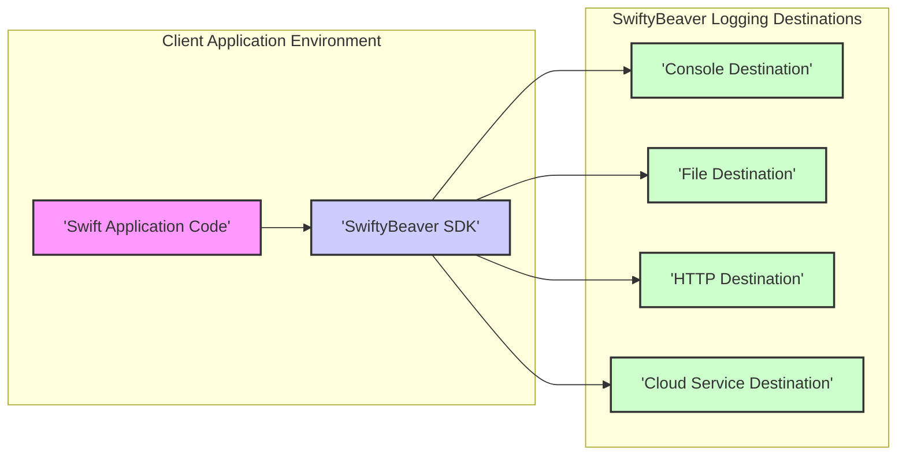
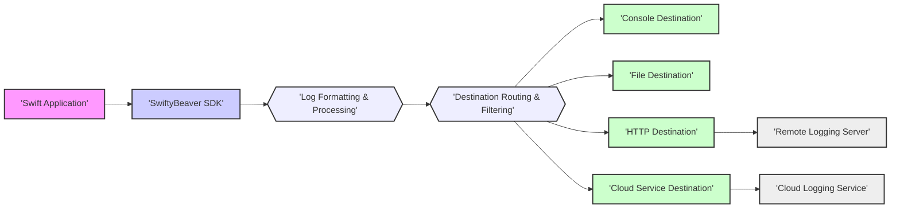

# SwiftyBeaver Project Design Document for Threat Modeling - Improved Version

## 1. Introduction

### 1.1. Project Overview

SwiftyBeaver is a sophisticated logging library meticulously crafted for Swift development across diverse Apple platforms (iOS, macOS, tvOS, watchOS) and Linux. It empowers developers with a highly adaptable and extensible logging solution, facilitating the routing of log messages to a variety of destinations, including the local console, persistent files, and remote cloud-based logging services. SwiftyBeaver is engineered to streamline the logging workflow, offering advanced features such as customizable log formatting, granular log level control, and asynchronous logging capabilities to minimize performance impact on applications.

### 1.2. Purpose of this Document

This document serves as a comprehensive and detailed design specification for the SwiftyBeaver project. Its primary purpose is to provide a robust foundation for conducting thorough threat modeling activities. By clearly delineating the system's architectural blueprint, data flow pathways, and critical components, this document aims to equip security professionals and development teams with the necessary insights to proactively identify potential security vulnerabilities and assess the inherent risks associated with SwiftyBeaver and its integration within various application environments.

### 1.3. Target Audience

This document is specifically tailored for the following key stakeholders:

*   **Security Architects and Engineers:** To gain a deep understanding of the system's architectural nuances for effective threat modeling, security risk assessments, and the development of mitigation strategies.
*   **Software Developers:** To acquire a comprehensive grasp of SwiftyBeaver's internal architecture, security considerations during the software development lifecycle, and best practices for secure integration.
*   **DevOps and Operations Teams:** To understand the deployment methodologies, operational aspects, and security implications of SwiftyBeaver within production and staging environments, ensuring secure and reliable logging infrastructure.

## 2. System Architecture

### 2.1. High-Level Architecture Diagram

### 2.2. Component Description

*   **Swift Application Code:** This represents the custom application logic developed by users, which incorporates the SwiftyBeaver SDK to enable logging functionalities. It is the source of log messages generated through the SwiftyBeaver API calls embedded within the application's codebase.
*   **SwiftyBeaver SDK:** This is the core library, acting as the central logging engine, seamlessly integrated into Swift applications. It provides the programmatic API for initiating logging events, manages the formatting of log messages according to defined rules, and intelligently routes these messages to the pre-configured destinations based on the application's logging configuration.
*   **Console Destination:** A fundamental, built-in destination designed to output log messages directly to the standard console output streams. This is commonly observed in development environments like Xcode's console or the system console for debugging and immediate feedback.
*   **File Destination:** A destination type that persists log messages by writing them into local files stored on the device or server's file system. This is useful for persistent logging and later analysis. Configuration options often include log rotation strategies to manage file size and storage.
*   **HTTP Destination:** A network-enabled destination responsible for transmitting log messages over the HTTP or HTTPS protocol to a designated remote server or centralized logging service endpoint. This enables remote log aggregation and analysis.
*   **Cloud Service Destination:** This category encompasses destinations that facilitate the transmission of logs to various third-party cloud logging platforms and services. Examples include integrations with Papertrail, Elasticsearch, Loggly, and similar services. These are often implemented as extensions or modular components to SwiftyBeaver, leveraging service-specific APIs for log delivery.

## 3. Data Flow

### 3.1. Data Flow Diagram

### 3.2. Data Types and Sensitivity

The core data unit processed by SwiftyBeaver is the **log message**. Each log message is structured and typically contains the following elements:

*   **Log Level:**  A categorical indicator of the log message's importance or severity. Standard levels include: `verbose`, `debug`, `info`, `warning`, and `error`. These levels help in filtering and prioritizing logs based on their criticality.
*   **Message String:** The primary textual content of the log, intended for human readability. It can incorporate dynamic data through string interpolation and formatting, allowing for contextual logging.
*   **Timestamp:** A precise record of when the log event occurred, crucial for log sequencing, analysis, and debugging time-sensitive issues.
*   **Function Name:**  The identifier of the function in the source code where the log message was generated. This aids in pinpointing the origin of log events within the application's execution flow.
*   **File Name:** The name of the source code file that contains the logging statement. Along with the function name, it provides precise location context for the log event.
*   **Line Number:** The specific line number within the source code file where the logging statement resides. This offers the most granular level of location tracking for debugging.
*   **Thread Information:** Details about the execution thread in which the log message was generated. Useful for diagnosing concurrency issues and understanding multi-threaded application behavior.
*   **Optional Metadata:**  A mechanism for developers to attach custom, structured data to log messages. This can include contextual information relevant to the application's domain or specific events being logged, enhancing log analysis capabilities.

**Sensitivity of Logged Data:**

It is paramount to recognize that log messages can inadvertently contain sensitive information, depending on the application's logging practices and the data being processed. Potential categories of sensitive data that might be unintentionally logged include:

*   **Personally Identifiable Information (PII):** This encompasses data that can identify an individual, such as usernames, email addresses, IP addresses, session identifiers, device identifiers, location data, and potentially even names or phone numbers if not carefully managed.
*   **Authentication Credentials:** While strongly discouraged, there's a risk of accidentally logging API keys, authentication tokens, passwords, or other secrets if logging practices are not secure and developers are not vigilant.
*   **Business-Critical Data:** Logs might inadvertently capture sensitive business information, such as transaction details, financial records, internal system configurations, proprietary algorithms, or customer-specific data, which could have confidentiality implications if exposed.
*   **Health Information (PHI):** In healthcare applications, logs could potentially contain Protected Health Information (PHI) subject to regulations like HIPAA, requiring stringent security and privacy controls.
*   **Payment Card Information (PCI):** Applications handling financial transactions must be extremely cautious to avoid logging PCI data, as it falls under strict compliance standards like PCI DSS.

**Crucial Security Practice:** Developers must exercise extreme caution and implement robust practices to prevent the logging of sensitive information. If logging sensitive data is absolutely necessary for debugging critical issues, it must be handled with stringent security measures, including encryption, redaction, secure storage, and restricted access controls, adhering to relevant data privacy regulations and compliance standards.

## 4. Key Components

### 4.1. SwiftyBeaver Client (SDK)

*   **Functionality:**
    *   **Intuitive Logging API:** Provides a developer-friendly and straightforward API for generating log messages within Swift applications. This API includes distinct functions for each log level (e.g., `verbose()`, `debug()`, `info()`, `warning()`, `error()`), enabling semantic logging.
    *   **Flexible Configuration Management:** Allows developers to programmatically configure logging behavior, including specifying active destinations, setting log level thresholds for each destination (e.g., different levels for console vs. remote server), and defining custom formatting rules. Configuration is typically done in code during application setup.
    *   **Customizable Log Formatting:** Offers powerful formatters to structure log messages before they are dispatched to destinations. Formatters can include timestamps with various precision levels, log level indicators, function and file names, line numbers, thread information, and the inclusion of custom metadata fields. Developers can tailor the log output format to suit their specific needs and analysis tools.
    *   **Versatile Destination Management:** Manages a collection of logging destinations. Developers can easily add and configure multiple destinations simultaneously, allowing logs to be concurrently routed to the console, files, and remote services.
    *   **Asynchronous Logging Operations:** Implements asynchronous logging mechanisms to ensure that logging operations, especially those involving I/O-intensive tasks like file writing or network transmissions, do not block the main application thread. This is crucial for maintaining application responsiveness and performance, particularly in mobile and UI-driven applications.
    *   **Log Filtering Capabilities:** Provides filtering mechanisms to selectively process log messages based on criteria such as log levels. This allows for fine-grained control over which messages are sent to specific destinations, optimizing logging overhead and focusing on relevant information. More advanced filtering based on message content or metadata might be possible through custom formatters or destination logic.

*   **Security Considerations:**
    *   **Secure Configuration Handling:**  The security of destination configurations is paramount. If configurations include sensitive credentials like API keys for cloud services or authentication tokens for HTTP destinations, the SDK must ensure these are handled securely. This includes avoiding hardcoding credentials in source code and recommending secure storage mechanisms like keychain (for mobile apps), environment variables, or secure configuration files.
    *   **Input Sanitization of Log Messages:** While primarily designed for logging, the SDK should consider basic input sanitization for log messages, especially if custom formatters are used that might process user-provided data within log messages. This is to mitigate potential risks if logs are processed by systems vulnerable to injection attacks based on log content. However, the primary responsibility for preventing injection vulnerabilities lies with the application code generating the logs and the systems consuming the logs.
    *   **Dependency Security Management:**  The SwiftyBeaver SDK itself might rely on external dependencies. Regular dependency scanning and updates are crucial to address any known vulnerabilities in these dependencies. A well-maintained dependency management process is essential for the SDK's overall security posture.

### 4.2. Destinations - Detailed Breakdown

Destinations are the output channels for log messages, each with specific functionalities and security implications.

*   **Console Destination:**
    *   **Functionality:**  Outputs formatted log messages to the standard console streams (stdout and stderr). This is the simplest destination, primarily intended for development-time debugging and immediate log visibility during local execution.
    *   **Security Considerations:**
        *   **Low Direct Security Risk:** Generally poses a low direct security risk as console output is typically local and transient.
        *   **Accidental Exposure in Production:**  However, care should be taken to ensure console logging is not inadvertently enabled or excessively verbose in production environments, as console logs might be captured in container logs or system logs, potentially exposing sensitive information if not properly managed in the deployment environment.

*   **File Destination:**
    *   **Functionality:** Persists log messages by writing them to files on the local file system. Offers configuration options for file naming, directory location, and log rotation (e.g., based on file size, time intervals, or log count) to manage log file growth and storage.
    *   **Security Considerations:**
        *   **File System Permissions:** **Critical:** Log files must be stored with restrictive file permissions to prevent unauthorized access, modification, or deletion. Permissions should be set to allow only the application process and authorized system administrators to read and write log files.
        *   **Secure Storage Location:** The choice of storage location is important. Log files should ideally be stored on secure storage volumes. For sensitive applications, consider encrypted file systems or storage locations. Avoid storing logs in publicly accessible directories.
        *   **Log Rotation and Retention Policies:** Implement robust log rotation and retention policies to manage storage space and comply with data privacy regulations. Define how long logs are retained, how they are rotated, and secure deletion procedures for old logs, especially if they contain sensitive data.
        *   **Path Traversal Vulnerabilities (Configuration):** If the file path for log storage is configurable, ensure proper input validation to prevent path traversal vulnerabilities, where malicious users might attempt to write logs to unintended locations outside the designated log directory.

*   **HTTP Destination:**
    *   **Functionality:** Transmits log messages over HTTP or, crucially, HTTPS to a remote logging server. This enables centralized log aggregation and analysis. Configuration includes the target server URL, HTTP headers, and authentication mechanisms.
    *   **Security Considerations:**
        *   **Mandatory HTTPS:** **Absolutely Essential:**  **Always use HTTPS** to encrypt log messages in transit. Sending logs over plain HTTP exposes log data to eavesdropping and man-in-the-middle attacks, especially if logs contain sensitive information. SwiftyBeaver should strongly encourage or even enforce HTTPS for HTTP destinations.
        *   **Authentication and Authorization Mechanisms:**  Securely authenticate with the remote logging server. Common methods include:
            *   **API Keys/Tokens:**  Use API keys or bearer tokens for authentication. These keys must be treated as secrets and managed securely (see "Secure Configuration Handling" in SDK section).
            *   **Basic Authentication:**  Less secure than token-based authentication but sometimes used. If used, ensure HTTPS is strictly enforced.
            *   **Client Certificates:**  For higher security, client certificate authentication can be employed.
        *   **Secure Credential Management:**  API keys, tokens, and any other credentials used for HTTP authentication must be stored and managed securely. Avoid hardcoding them in the application. Utilize secure configuration practices.
        *   **Remote Logging Server Security:** The security of the remote logging server is paramount. Ensure the server itself is hardened, regularly patched, and protected against vulnerabilities. A compromised logging server can lead to a breach of all logged data.
        *   **Data Injection Risks (Server-Side):**  Consider potential injection vulnerabilities on the remote logging server if it processes log messages in ways that could be exploited (e.g., SQL injection if logs are stored in a database, command injection if logs are processed by scripts). The server-side logging infrastructure must be designed to mitigate these risks.
        *   **Rate Limiting and DoS Protection:** Implement rate limiting on the HTTP destination to prevent denial-of-service (DoS) attacks against the logging server by flooding it with excessive log messages.

*   **Cloud Service Destinations (e.g., Papertrail, Elasticsearch, Loggly, AWS CloudWatch, Azure Monitor, Google Cloud Logging):**
    *   **Functionality:** Integrates with various cloud-based logging services, simplifying log aggregation, storage, analysis, and alerting in cloud environments. Typically implemented as separate extensions or modules, each tailored to a specific cloud service's API.
    *   **Examples:** Destinations for popular services like:
        *   **Papertrail:**  Uses its API for log ingestion.
        *   **Elasticsearch:**  Sends logs to Elasticsearch clusters, often via HTTP or dedicated client libraries.
        *   **Loggly:**  Integrates with Loggly's logging platform.
        *   **AWS CloudWatch Logs, Azure Monitor Logs, Google Cloud Logging:**  Destinations for major cloud providers' native logging services.
    *   **Security Considerations:**
        *   **API Key and Credential Management (Cloud Provider Specific):**  Securely manage API keys, access keys, service account credentials, or other authentication mechanisms required by each cloud logging service. Cloud providers often offer best practices for credential management, such as using IAM roles, managed identities, or secure secret storage services (e.g., AWS Secrets Manager, Azure Key Vault, Google Secret Manager).
        *   **Third-Party Service Security Posture:**  Reliance on the security of the chosen third-party cloud logging service provider. Understand their security certifications (e.g., SOC 2, ISO 27001), data protection policies, and incident response procedures.
        *   **Data Privacy and Regulatory Compliance (Cloud Provider Specific):**  Ensure compliance with relevant data privacy regulations (GDPR, CCPA, HIPAA, etc.) when using cloud logging services, especially if logging PII or other sensitive data. Consider data residency requirements and the cloud provider's data processing agreements.
        *   **Access Control within Cloud Logging Service:**  Leverage the access control mechanisms provided by the cloud logging service (e.g., IAM policies, role-based access control) to restrict access to logs to only authorized personnel. Implement the principle of least privilege.
        *   **Data Encryption at Rest and in Transit (Cloud Provider Responsibility):** Cloud providers are typically responsible for encrypting data at rest and in transit within their services. Verify the encryption mechanisms used by the chosen cloud logging service and ensure they meet your security requirements.
        *   **Vendor Lock-in and Data Portability:** Consider the implications of vendor lock-in when using cloud-specific logging services. Evaluate data portability options and the ability to migrate logs to other systems if needed in the future.

### 4.3. Configuration - Security Aspects

*   **Functionality:** SwiftyBeaver's configuration dictates its logging behavior. Key configuration aspects include:
    *   **Destination Activation:**  Enabling or disabling specific destinations (Console, File, HTTP, Cloud).
    *   **Log Level Thresholds per Destination:** Setting different minimum log levels for each destination. For example, `debug` and above for console, but only `warning` and `error` for remote HTTP destination to reduce noise and bandwidth.
    *   **Log Formatting Rules per Destination:**  Applying different formatters to log messages based on the destination. This allows tailoring log output for different consumers (human-readable console logs vs. machine-parseable logs for analysis tools).
    *   **Destination-Specific Settings:**  Configuration parameters unique to each destination type, such as:
        *   File path and rotation settings for File Destination.
        *   HTTP endpoint URL, custom headers, authentication details for HTTP Destination.
        *   API keys, service-specific configuration parameters for Cloud Service Destinations.

*   **Security Considerations:**
    *   **Secure Configuration Storage:**  **Crucial:** Configuration, especially if it contains sensitive information (API keys, server URLs with credentials, etc.), must be stored securely.
        *   **Avoid Hardcoding:** Never hardcode sensitive configuration directly in application source code.
        *   **Environment Variables:**  Use environment variables for sensitive configuration, especially in containerized environments.
        *   **Secure Configuration Files:** If using configuration files, ensure they are stored with appropriate file permissions, are encrypted if necessary, and are not publicly accessible.
        *   **Key Management Systems (KMS):** For highly sensitive applications, consider using dedicated Key Management Systems or secret management services (like AWS Secrets Manager, Azure Key Vault, HashiCorp Vault) to store and retrieve sensitive configuration values securely.
    *   **Configuration Injection Vulnerabilities:** If configuration is loaded from external sources (e.g., configuration files, remote configuration servers), ensure robust input validation and sanitization to prevent configuration injection attacks. Maliciously crafted configuration data could potentially be used to alter logging behavior in unintended ways or even execute arbitrary code in vulnerable scenarios (though less likely in a logging library context, but still a good security principle).
    *   **Default Configuration Review:**  Carefully review SwiftyBeaver's default configuration settings. Ensure that default settings are secure and do not inadvertently enable insecure logging practices or expose sensitive information by default. For example, default destinations should not be overly verbose in production, and default formatters should not unintentionally include sensitive data.

## 5. Security Considerations - Detailed Threat Areas

This section expands on the security considerations, outlining potential threat areas for SwiftyBeaver and systems that integrate it.

*   **5.1. Authentication and Authorization Threats:**
    *   **Threat:** Weak or Missing Authentication for HTTP/Cloud Destinations.
        *   **Description:** If HTTP or Cloud destinations are not properly authenticated, unauthorized parties could potentially intercept or tamper with log messages in transit or gain unauthorized access to the remote logging server/service and the entire log history.
        *   **Mitigation:** Enforce strong authentication mechanisms (API keys, tokens, client certificates), always use HTTPS, and securely manage credentials.
    *   **Threat:** Credential Exposure.
        *   **Description:** API keys, tokens, or other credentials for remote logging destinations could be accidentally exposed if hardcoded in source code, stored insecurely in configuration files, or leaked through insecure transmission channels.
        *   **Mitigation:**  Adopt secure credential management practices: use environment variables, secure configuration stores, KMS, and avoid hardcoding. Implement secrets scanning in CI/CD pipelines to detect accidental credential commits.
    *   **Threat:** Lack of Authorization Controls within SwiftyBeaver Itself.
        *   **Description:** While SwiftyBeaver primarily focuses on log delivery, in more complex deployments involving server-side log processing or log management platforms, insufficient authorization controls could allow unauthorized users to access, modify, or delete logs, potentially hindering security investigations or causing data breaches.
        *   **Mitigation:** Implement robust access control mechanisms within the remote logging infrastructure and log management platforms, leveraging role-based access control (RBAC) to restrict access based on the principle of least privilege.

*   **5.2. Data in Transit Security Threats:**
    *   **Threat:** Man-in-the-Middle (MITM) Attacks on Log Data.
        *   **Description:** If logs are transmitted over unencrypted HTTP, attackers could intercept network traffic, eavesdrop on log messages, and potentially steal sensitive information contained within the logs.
        *   **Mitigation:** **Mandatory HTTPS for HTTP Destinations.**  Ensure all network communication for log transmission is encrypted using TLS/SSL (HTTPS).
    *   **Threat:** Data Tampering in Transit.
        *   **Description:** Without encryption and integrity checks, attackers could potentially tamper with log messages in transit, altering log data or injecting false log entries, which could compromise the integrity of audit trails and security logs.
        *   **Mitigation:** HTTPS provides both encryption and data integrity. Ensure HTTPS is used. Consider end-to-end encryption for highly sensitive logs if required, although HTTPS generally provides sufficient transport security.

*   **5.3. Data at Rest Security Threats:**
    *   **Threat:** Unauthorized Access to Log Files (File Destination).
        *   **Description:** If log files stored by the File Destination are not properly secured with file system permissions, unauthorized users or processes could gain access to read, modify, or delete log data.
        *   **Mitigation:** Implement strict file system permissions on log files and directories. Use appropriate user and group ownership. Regularly audit file permissions.
    *   **Threat:** Data Breach from Cloud Logging Service.
        *   **Description:** A security breach at the cloud logging service provider could potentially expose all logs stored within that service, leading to a large-scale data breach if sensitive information is logged.
        *   **Mitigation:** Choose reputable cloud logging providers with strong security track records and certifications. Understand their security practices and data protection policies. Implement access controls within the cloud service. Consider data minimization and avoid logging highly sensitive data if possible.
    *   **Threat:** Insecure Log Retention and Disposal.
        *   **Description:** Retaining logs for longer than necessary increases the risk of data breaches. Insecure deletion of logs might leave residual data recoverable by attackers.
        *   **Mitigation:** Define and enforce clear log retention policies based on legal and business requirements. Implement secure log deletion procedures that ensure data is irrecoverable when logs are no longer needed.

*   **5.4. Logging and Monitoring Security Threats:**
    *   **Threat:** Insufficient Security Logging.
        *   **Description:** If SwiftyBeaver is not used to log security-relevant events within the application itself (e.g., authentication attempts, authorization failures, security configuration changes), security monitoring and incident response capabilities will be limited.
        *   **Mitigation:** Utilize SwiftyBeaver to log security-relevant events at appropriate log levels (e.g., `warning`, `error`). Define a comprehensive security logging strategy.
    *   **Threat:** Log Integrity Compromise.
        *   **Description:** If log data is not protected against tampering, attackers could potentially modify or delete logs to cover their tracks after a security incident, hindering forensic investigations.
        *   **Mitigation:** Consider using log integrity mechanisms, such as digital signatures or cryptographic hashing, to ensure log data integrity, especially for security-critical logs. Centralized logging systems often provide log integrity features.
    *   **Threat:** Lack of Monitoring of SwiftyBeaver Operations.
        *   **Description:** If SwiftyBeaver's own operations and potential errors (e.g., destination failures, configuration errors) are not monitored, issues with logging infrastructure might go unnoticed, leading to gaps in logging coverage and potential security blind spots.
        *   **Mitigation:** Implement monitoring of SwiftyBeaver's logging processes and destinations. Log SwiftyBeaver's internal errors and warnings. Monitor destination connectivity and log delivery success rates.

*   **5.5. Input Validation and Injection Threats:**
    *   **Threat:** Log Injection Attacks (Indirect).
        *   **Description:** While SwiftyBeaver itself is less directly vulnerable to injection attacks, if log messages contain user-controlled data that is not properly sanitized and is subsequently processed by downstream systems (e.g., log analysis tools, SIEM systems, databases), these systems might be vulnerable to injection attacks (e.g., log injection leading to command injection in a log processing script).
        *   **Mitigation:** Sanitize user-controlled data before including it in log messages. Implement robust input validation and sanitization in all systems that process and consume log data.
    *   **Threat:** Configuration Injection.
        *   **Description:** If SwiftyBeaver's configuration is loaded from untrusted sources or parsed insecurely, attackers might be able to inject malicious configuration data to alter logging behavior or potentially exploit vulnerabilities in the configuration parsing process (though less likely in this context).
        *   **Mitigation:** Load configuration from trusted sources only. Implement input validation for configuration data. Use secure configuration parsing libraries.

*   **5.6. Sensitive Data Logging Threats:**
    *   **Threat:** Unintentional Logging of Sensitive Data (PII, Secrets, etc.).
        *   **Description:** Developers might inadvertently log sensitive data in log messages, especially during development or debugging, without realizing the security and privacy implications.
        *   **Mitigation:** Educate developers about secure logging practices and the risks of logging sensitive data. Implement code review processes to identify and prevent sensitive data logging. Use static analysis tools to detect potential sensitive data logging.
    *   **Threat:** Exposure of Sensitive Data in Logs.
        *   **Description:** Logs containing sensitive data, if not properly secured, could be exposed in various ways: through unauthorized access to log files, breaches of logging servers/services, or accidental disclosure of logs.
        *   **Mitigation:** Implement all the data at rest and data in transit security measures described above. Consider data minimization – log only necessary information. Implement log redaction or masking techniques to remove or obfuscate sensitive data in logs if logging is unavoidable.

## 6. Conclusion

This improved design document provides a more in-depth and security-focused analysis of the SwiftyBeaver project. It details the architecture, data flow, and key components with a strong emphasis on security considerations relevant for threat modeling. The expanded security considerations and threat areas outlined in section 5 offer a comprehensive starting point for a detailed threat modeling exercise. By addressing these potential threats and implementing the suggested mitigations, organizations can significantly enhance the security posture of applications utilizing SwiftyBeaver and ensure the confidentiality, integrity, and availability of their logging infrastructure and sensitive log data. This document serves as a valuable resource for security professionals and development teams to proactively build and maintain secure logging practices around SwiftyBeaver.