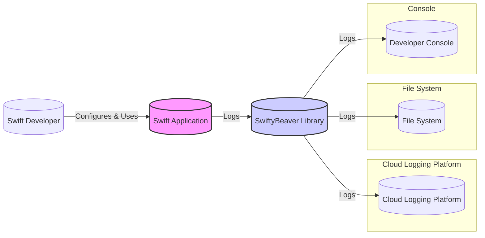
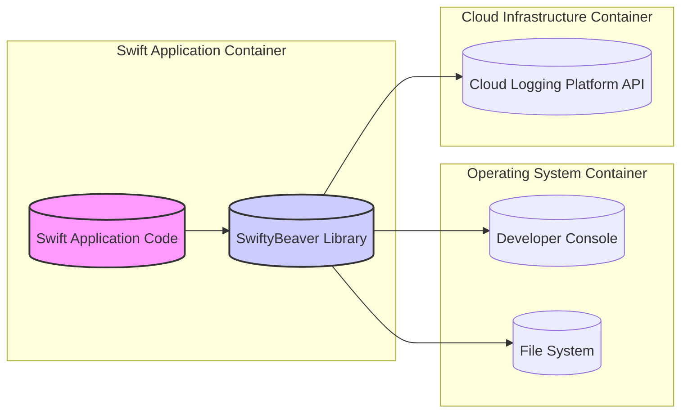

# BUSINESS POSTURE

- Business Priorities:
  - Provide a versatile and easy-to-use logging solution for Swift developers across different platforms (iOS, macOS, tvOS, watchOS, Linux).
  - Enable efficient debugging, monitoring, and analysis of Swift applications through comprehensive logging capabilities.
  - Support various log destinations to accommodate different development and production environments.
- Business Goals:
  - Increase developer productivity by simplifying the logging process in Swift applications.
  - Improve application quality and stability by providing detailed insights into application behavior through logs.
  - Offer a flexible and extensible logging framework that can be adapted to diverse project needs.
- Business Risks:
  - Exposure of sensitive information if logs are not handled securely. Logs might inadvertently contain personal data, API keys, or internal system details.
  - Performance overhead introduced by logging, potentially impacting application responsiveness, especially in performance-critical applications.
  - Reliability of log delivery, ensuring logs are consistently and accurately transmitted to designated destinations without loss or corruption.
  - Compatibility issues with different Swift versions and platforms, requiring ongoing maintenance and updates.

# SECURITY POSTURE

- Existing Security Controls:
  - security control: Code review process for contributions to the SwiftyBeaver library. (Implemented via GitHub pull request reviews - described in GitHub repository contribution guidelines).
  - security control: Dependency management using Swift Package Manager. (Implemented via `Package.swift` file in the repository).
  - security control: Basic input sanitization within the library to prevent crashes due to malformed log messages. (Implicitly implemented within the library's core logic).
- Accepted Risks:
  - accepted risk: Potential for user misconfiguration leading to insecure logging practices (e.g., logging sensitive data in production, insecure log destinations). Mitigation relies on user awareness and best practices.
  - accepted risk: Vulnerabilities in third-party dependencies. Mitigation relies on dependency updates and security scanning (not explicitly mentioned in the repository, but standard practice).
  - accepted risk: Denial of Service (DoS) if excessive logging is triggered, potentially overwhelming log destinations or application resources. Mitigation relies on rate limiting and appropriate logging levels configured by the user.
- Recommended Security Controls:
  - recommended security control: Implement automated security scanning (SAST/DAST) in the CI/CD pipeline for the SwiftyBeaver library to identify potential vulnerabilities in the code.
  - recommended security control: Provide documentation and examples on secure logging practices, emphasizing data sanitization, secure log destination configuration, and appropriate logging levels for different environments.
  - recommended security control: Encourage and facilitate community security audits and vulnerability reporting through a clear security policy and responsible disclosure process.
- Security Requirements:
  - Authentication:
    - If SwiftyBeaver is configured to send logs to external services (e.g., cloud logging platforms), ensure that authentication mechanisms are used to securely connect and transmit logs. This is dependent on the chosen log destination and should be configured by the user of the library.
  - Authorization:
    - Access control to logs is primarily the responsibility of the user and the chosen log destination. SwiftyBeaver itself does not implement authorization. Users should ensure that access to log data is appropriately restricted based on sensitivity.
  - Input Validation:
    - SwiftyBeaver should perform input validation on log messages to prevent injection attacks or unexpected behavior. This includes handling various data types and encoding formats safely.
    - Users should be advised to sanitize sensitive data before logging to prevent accidental exposure.
  - Cryptography:
    - If sensitive data is logged, users should be advised to encrypt the data before logging it using appropriate cryptographic techniques. SwiftyBeaver itself does not provide built-in encryption for log messages.
    - When transmitting logs to external services, ensure that communication channels are encrypted (e.g., HTTPS) to protect log data in transit. This is dependent on the chosen log destination and its configuration.

# DESIGN

## C4 CONTEXT



- Context Diagram Elements:
  - - Name: Swift Application
    - Type: Software System
    - Description: The Swift application that utilizes the SwiftyBeaver logging library to generate and manage logs. This could be an iOS app, macOS application, or server-side Swift application.
    - Responsibilities: Generate log messages during runtime, configure SwiftyBeaver with desired destinations and logging levels, and handle application logic.
    - Security controls: Application-level security controls, input validation for application data, secure data handling within the application.
  - - Name: SwiftyBeaver Library
    - Type: Software System / Library
    - Description: The SwiftyBeaver logging library, integrated into Swift applications, responsible for receiving log messages from the application and routing them to configured destinations.
    - Responsibilities: Receive log messages from the Swift application, format log messages, route logs to configured destinations (Console, File System, Cloud Logging Platform), and manage logging levels.
    - Security controls: Input validation for log messages, secure handling of log destinations configurations, and protection against library vulnerabilities.
  - - Name: Developer Console
    - Type: External System
    - Description: The console or terminal where developers view logs during development and debugging. This is typically the standard output of the application.
    - Responsibilities: Display log messages for developers to monitor application behavior during development.
    - Security controls: Access control to developer machines, limited exposure of sensitive data in console logs during production.
  - - Name: File System
    - Type: External System
    - Description: Local file system where logs can be stored as files. This can be on the device running the application or a server.
    - Responsibilities: Store log messages in files for later analysis and auditing.
    - Security controls: File system permissions to restrict access to log files, encryption of log files at rest if they contain sensitive data.
  - - Name: Cloud Logging Platform
    - Type: External System
    - Description: External cloud-based logging services (e.g., AWS CloudWatch, Google Cloud Logging, Azure Monitor) where logs can be sent for centralized storage, analysis, and monitoring.
    - Responsibilities: Receive, store, index, and provide tools for analyzing logs sent from SwiftyBeaver.
    - Security controls: Authentication and authorization for accessing the cloud logging platform, encryption of logs in transit and at rest within the platform, and security controls provided by the cloud provider.
  - - Name: Swift Developer
    - Type: Person
    - Description: Developers who use the SwiftyBeaver library in their Swift applications to implement logging functionality.
    - Responsibilities: Configure SwiftyBeaver, integrate it into Swift applications, define logging levels and destinations, and analyze logs for debugging and monitoring.
    - Security controls: Secure development practices, awareness of secure logging principles, and responsible handling of log data.

## C4 CONTAINER



- Container Diagram Elements:
  - - Name: Swift Application Code
    - Type: Container / Application Component
    - Description: The Swift application's codebase that utilizes the SwiftyBeaver library. This includes application logic, business logic, and integration with other application components.
    - Responsibilities: Generate log messages using SwiftyBeaver API, implement application features, and interact with other application components.
    - Security controls: Application-level security controls, input validation, secure coding practices, and authorization within the application.
  - - Name: SwiftyBeaver Library
    - Type: Container / Library
    - Description: The SwiftyBeaver library container, providing logging functionalities to the Swift application. It encapsulates the core logging logic, formatting, and routing capabilities.
    - Responsibilities: Receive log requests from the Swift Application Code, format log messages, manage log destinations, and send logs to configured outputs.
    - Security controls: Input validation for log messages, secure configuration handling, and protection against library-level vulnerabilities.
  - - Name: Developer Console
    - Type: Container / Output Interface
    - Description: The standard output stream of the operating system where console logs are displayed.
    - Responsibilities: Display text-based log messages for developers.
    - Security controls: Operating system-level access controls to the console, limited exposure of sensitive data in console logs in non-development environments.
  - - Name: File System
    - Type: Container / Data Store
    - Description: The local file system used for storing log files. This could be a local disk or network-attached storage.
    - Responsibilities: Persistently store log messages in files, manage file storage and retrieval.
    - Security controls: File system permissions, access control lists (ACLs), encryption at rest for log files containing sensitive data, and regular log rotation and archiving.
  - - Name: Cloud Logging Platform API
    - Type: Container / API Interface
    - Description: The API endpoint of a cloud logging platform that SwiftyBeaver interacts with to send logs over the network.
    - Responsibilities: Receive log messages over network connections, authenticate requests, and ingest logs into the cloud logging platform.
    - Security controls: API authentication (API keys, tokens), HTTPS encryption for communication, rate limiting, and security controls provided by the cloud logging platform.

## DEPLOYMENT

- Deployment Architecture Options:
  - Embedded Library Deployment: SwiftyBeaver is directly embedded within the Swift application's binary. This is the most common deployment model for libraries.
  - No Separate Deployment Infrastructure: SwiftyBeaver itself does not require a separate deployment infrastructure. It is deployed as part of the application.

- Detailed Deployment (Embedded Library Deployment):

```mermaid
flowchart LR
    subgraph Developer Machine
        DEV[("Developer Machine")]
        Xcode[("Xcode IDE")]
        AppCode[("Swift Application Code")]
        SBCode[("SwiftyBeaver Library Code")]
        Xcode --> AppCode
        Xcode --> SBCode
    end
    subgraph Target Environment (e.g., iOS Device, macOS Server)
        TE[("Target Environment")]
        OS[("Operating System")]
        AppBinary[("Swift Application Binary")]
        SBBinary[("SwiftyBeaver Library Binary")]
        OS --> AppBinary
        AppBinary --> SBBinary
        subgraph Log Destinations
            Console[("Console Output")]
            File[("Log Files")]
            Cloud[("Cloud Logging")]
        end
        AppBinary --> Console
        AppBinary --> File
        AppBinary --> Cloud
    end
    DEV --> TE: Deploy Application
    style AppBinary fill:#f9f,stroke:#333,stroke-width:2px
    style SBBinary fill:#ccf,stroke:#333,stroke-width:2px
```

- Deployment Diagram Elements:
  - - Name: Developer Machine
    - Type: Infrastructure / Environment
    - Description: The development machine used by Swift developers to write code, build, and test Swift applications.
    - Responsibilities: Development, building, and testing of Swift applications and libraries.
    - Security controls: Access control to developer machines, secure development environment, and code repository security.
  - - Name: Xcode IDE
    - Type: Software / Development Tool
    - Description: Apple's Integrated Development Environment (IDE) commonly used for Swift development, including building and packaging Swift applications.
    - Responsibilities: Code editing, compilation, building, debugging, and deployment of Swift applications.
    - Security controls: Secure software development practices within the IDE, plugin security, and access control to project files.
  - - Name: Swift Application Code
    - Type: Software / Codebase
    - Description: The source code of the Swift application that integrates and uses the SwiftyBeaver library.
    - Responsibilities: Application logic, business functionality, and utilizing SwiftyBeaver for logging.
    - Security controls: Secure coding practices, input validation, authorization, and application-level security measures.
  - - Name: SwiftyBeaver Library Code
    - Type: Software / Library Codebase
    - Description: The source code of the SwiftyBeaver library, included as a dependency in the Swift application project.
    - Responsibilities: Providing logging functionalities to the Swift application.
    - Security controls: Code review, security testing, and dependency management.
  - - Name: Target Environment
    - Type: Infrastructure / Environment
    - Description: The environment where the Swift application is deployed and executed. This could be an iOS device, macOS server, or other supported platforms.
    - Responsibilities: Running the Swift application and SwiftyBeaver library, providing resources and services for the application.
    - Security controls: Operating system security, network security, physical security of the environment, and access control to the environment.
  - - Name: Operating System
    - Type: Infrastructure / Software
    - Description: The operating system running on the target environment (e.g., iOS, macOS, Linux).
    - Responsibilities: Managing system resources, providing security features, and running applications.
    - Security controls: Operating system security hardening, patching, access control, and security configurations.
  - - Name: Swift Application Binary
    - Type: Software / Executable
    - Description: The compiled and packaged binary of the Swift application, including the embedded SwiftyBeaver library.
    - Responsibilities: Executing application logic and utilizing SwiftyBeaver for logging in the target environment.
    - Security controls: Application security controls, runtime security measures, and protection against reverse engineering.
  - - Name: SwiftyBeaver Library Binary
    - Type: Software / Library Binary
    - Description: The compiled binary of the SwiftyBeaver library, embedded within the Swift application binary.
    - Responsibilities: Providing logging functionalities at runtime within the application.
    - Security controls: Library security features and protection against vulnerabilities.
  - - Name: Console Output
    - Type: Infrastructure / Output
    - Description: The standard output stream in the target environment, used for displaying console logs.
    - Responsibilities: Displaying log messages in the console.
    - Security controls: Access control to the console output in production environments.
  - - Name: Log Files
    - Type: Infrastructure / Data Store
    - Description: Files stored in the file system of the target environment, used for persistent log storage.
    - Responsibilities: Storing log messages in files.
    - Security controls: File system permissions, encryption at rest for log files, and log rotation.
  - - Name: Cloud Logging
    - Type: Infrastructure / External Service
    - Description: Cloud-based logging services used as a destination for logs from SwiftyBeaver.
    - Responsibilities: Receiving, storing, and processing logs in the cloud.
    - Security controls: Cloud platform security controls, authentication and authorization for accessing cloud logging services, and encryption in transit and at rest.

## BUILD

```mermaid
flowchart LR
    subgraph Developer
        DEV[("Swift Developer")]
        CodeRepo[("Code Repository (GitHub)")]
        DEV --> CodeRepo: Code Commit
    end
    subgraph CI/CD System (e.g., GitHub Actions)
        CI[("CI/CD System")]
        CodeRepo --> CI: Code Checkout
        Build[("Build & Test")]
        CI --> Build: Trigger Build
        SAST[("SAST Scanner")]
        Build --> SAST: Code Analysis
        Lint[("Linter")]
        Build --> Lint: Code Style Check
        Artifacts[("Build Artifacts (Swift Package)")]
        Build --> Artifacts: Package Creation
        Publish[("Package Registry (e.g., Swift Package Index)")]
        Artifacts --> Publish: Package Publish
    end
    Publish --> User: Package Download
    style Artifacts fill:#ccf,stroke:#333,stroke-width:2px
```

- Build Process Description:
  - Developer commits code changes to the GitHub repository.
  - CI/CD system (e.g., GitHub Actions) is triggered upon code commit.
  - CI/CD system checks out the code from the repository.
  - Build process compiles the Swift code, runs unit tests, and performs static analysis security testing (SAST) and linting.
  - SAST scanner analyzes the code for potential security vulnerabilities.
  - Linter checks the code for style and code quality issues.
  - Build artifacts (Swift Package) are created.
  - Build artifacts are published to a package registry (e.g., Swift Package Index or GitHub Packages).
  - Users (Swift developers) can download and integrate the SwiftyBeaver Swift Package into their projects.

- Build Process Security Controls:
  - security control: Secure Code Repository (GitHub): Access control, branch protection, and audit logging for the code repository. (Implemented by GitHub platform).
  - security control: CI/CD Pipeline Security: Secure configuration of CI/CD workflows, access control to CI/CD system, and secrets management for credentials. (Implemented by CI/CD system configuration).
  - security control: Automated Build Process: Ensures consistent and repeatable builds, reducing the risk of manual errors and malicious modifications. (Implemented by CI/CD workflows).
  - security control: Static Application Security Testing (SAST): Automated SAST scanner integrated into the build pipeline to detect potential security vulnerabilities in the code. (To be implemented in CI/CD workflow).
  - security control: Code Linting: Automated linter to enforce code style and quality, improving code maintainability and reducing potential security issues related to code complexity. (Implemented in CI/CD workflow).
  - security control: Dependency Scanning: Scan dependencies for known vulnerabilities during the build process. (To be implemented in CI/CD workflow).
  - security control: Artifact Signing: Sign build artifacts (Swift Packages) to ensure integrity and authenticity. (Optional, can be implemented for enhanced supply chain security).
  - security control: Secure Package Registry: Use a secure package registry with access controls and integrity checks to host and distribute the SwiftyBeaver Swift Package. (Implemented by chosen package registry platform).

# RISK ASSESSMENT

- Critical Business Processes We Are Trying to Protect:
  - Application Monitoring and Debugging: Ensuring developers have access to reliable and informative logs to diagnose issues, monitor application performance, and maintain application stability.
  - Data Integrity and Confidentiality (of logs): Protecting the integrity and confidentiality of log data, especially if logs contain sensitive information.
  - Application Availability and Performance: Minimizing the performance impact of logging and ensuring that logging does not negatively affect application availability or responsiveness.

- Data We Are Trying to Protect and Their Sensitivity:
  - Log Data: Log data can vary significantly in sensitivity depending on what is logged by the application.
    - Low Sensitivity: Debug logs, informational messages, performance metrics that do not contain personally identifiable information (PII) or sensitive system details.
    - Medium Sensitivity: Application errors, warnings, user actions, and system events that might contain some PII or internal system information but are not considered highly confidential.
    - High Sensitivity: Audit logs, security events, and logs that explicitly contain highly sensitive data such as passwords, API keys, financial information, or protected health information (PHI).
  - Sensitivity Level Determination: The sensitivity of log data is determined by the application context and what information is configured to be logged. Users of SwiftyBeaver are responsible for classifying the sensitivity of their log data and implementing appropriate security measures.

# QUESTIONS & ASSUMPTIONS

- Questions:
  - What types of applications will be using SwiftyBeaver (e.g., mobile apps, server-side applications, embedded systems)? This will help understand the deployment environments and potential threat landscape.
  - What are the typical log destinations that users will configure (e.g., local files, cloud logging services, custom endpoints)? This will inform the security considerations for log transmission and storage.
  - What level of sensitivity is expected for the log data generated by applications using SwiftyBeaver? This will determine the necessary security controls for data protection.
  - Are there any specific compliance requirements (e.g., GDPR, HIPAA, PCI DSS) that applications using SwiftyBeaver might need to adhere to? This will influence the security and privacy requirements for logging.

- Assumptions:
  - BUSINESS POSTURE Assumptions:
    - The primary business goal is to provide a useful and reliable logging library for Swift developers.
    - Performance and ease of use are key priorities for the library.
    - Security is important, but not the absolute top priority compared to functionality and usability for a general-purpose logging library.
  - SECURITY POSTURE Assumptions:
    - Users of SwiftyBeaver are responsible for configuring the library securely and handling sensitive data appropriately in their applications.
    - Security controls for log destinations are primarily the responsibility of the chosen destination (e.g., operating system, cloud provider).
    - The SwiftyBeaver library itself should be free from vulnerabilities and follow secure coding practices.
  - DESIGN Assumptions:
    - SwiftyBeaver is primarily used as an embedded library within Swift applications.
    - Log destinations are configurable and can include console, file system, and cloud logging platforms.
    - The build process involves standard Swift package management and CI/CD practices.