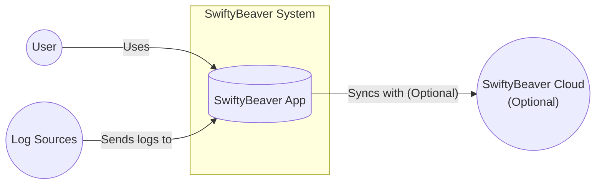
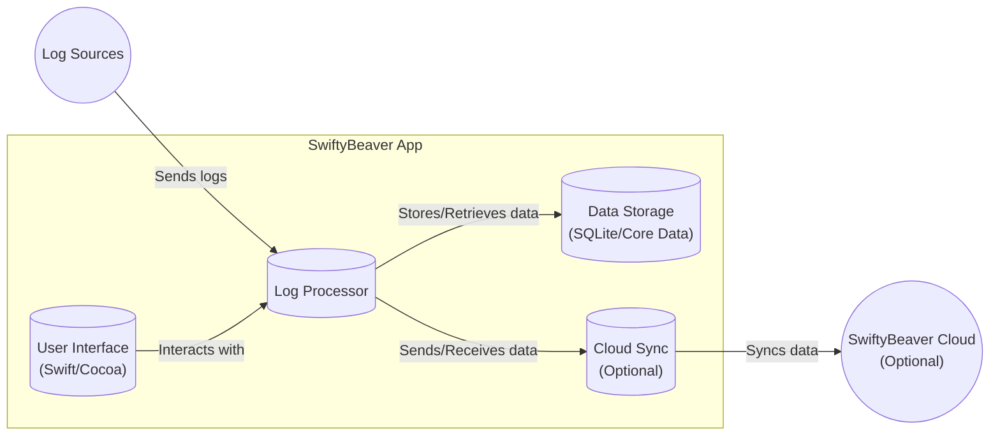
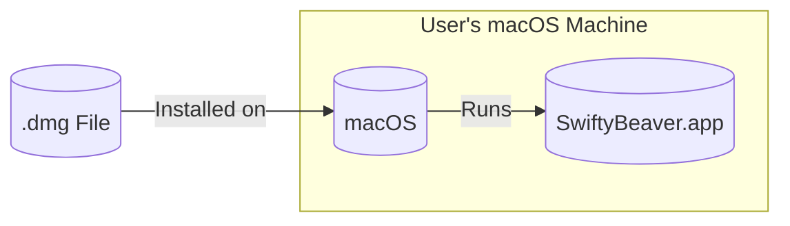
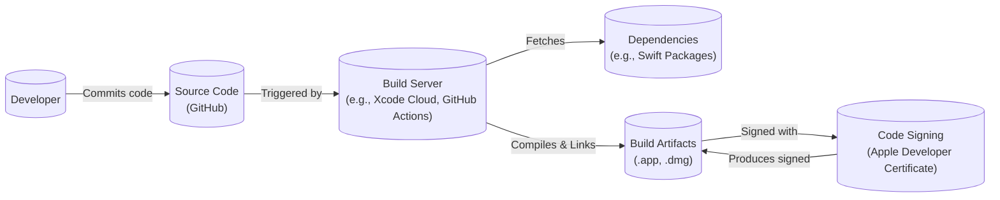

Okay, let's create a design document for the SwiftyBeaver project based on the provided GitHub repository.

# BUSINESS POSTURE

SwiftyBeaver is a log management and analytics platform, positioned as a native macOS application. It appears to be targeting individual developers, small teams, and potentially larger organizations that need a convenient way to collect, analyze, and visualize log data, primarily on macOS systems.

Business Priorities:

*   Provide a user-friendly, native macOS experience for log management.
*   Offer a performant solution capable of handling large volumes of log data.
*   Enable efficient searching, filtering, and analysis of logs.
*   Support various log formats and sources.
*   Potentially offer cloud-based features for collaboration and centralized log storage (implied by SwiftyBeaver Cloud).

Business Goals:

*   Gain user adoption and establish a strong presence in the macOS developer community.
*   Generate revenue through potential premium features, subscriptions, or cloud services.
*   Build a reputation for reliability, security, and ease of use.

Most Important Business Risks:

*   Data Loss/Corruption: Loss of user log data due to bugs, system failures, or security breaches would severely damage user trust and the product's reputation.
*   Security Vulnerabilities: Exploitable vulnerabilities in the application or its cloud components could lead to unauthorized access to sensitive log data, potentially exposing user systems or infrastructure.
*   Performance Bottlenecks: Inability to handle large log volumes or complex queries efficiently would hinder usability and limit adoption.
*   Competition: The log management space is crowded, with many established players and open-source alternatives. SwiftyBeaver needs to differentiate itself effectively.
*   Lack of Adoption: Failure to attract a sufficient user base would make the project unsustainable.

# SECURITY POSTURE

Existing Security Controls (based on the GitHub repository and general knowledge of macOS development):

*   security control: Code Signing: The macOS application is likely code-signed to ensure its authenticity and integrity. (Inferred from standard macOS development practices).
*   security control: Sandboxing: The application may utilize macOS sandboxing to restrict its access to system resources and user data. (Inferred from standard macOS development practices and project description).
*   security control: TLS/SSL: Communication with any cloud services (SwiftyBeaver Cloud) would likely use TLS/SSL to encrypt data in transit. (Inferred from standard security practices).
*   security control: Encryption at Rest: If storing log data locally, encryption at rest might be used to protect the data on disk. (Not explicitly mentioned, but a common practice).
*   security control: Input Validation: The application likely performs some level of input validation to prevent injection attacks or processing of malformed log data. (Inferred from general security best practices).

Accepted Risks:

*   accepted risk: Local Data Storage: Storing log data locally on the user's machine introduces the risk of data loss if the machine is compromised or fails.
*   accepted risk: Third-Party Dependencies: The project likely relies on third-party libraries, which could introduce vulnerabilities if not kept up-to-date.
*   accepted risk: Limited Auditing: The open-source nature of the project provides some level of transparency, but a formal security audit may not have been conducted.

Recommended Security Controls:

*   Implement robust input validation and sanitization to prevent injection attacks (e.g., XSS, command injection) if user-provided input is used in any display or processing logic.
*   Regularly update all third-party dependencies to address known vulnerabilities. Use dependency scanning tools.
*   Consider implementing more granular access controls and authentication mechanisms, especially for cloud-based features.
*   Provide options for users to encrypt their log data at rest, even when stored locally.
*   Implement comprehensive logging and auditing within the application itself to track security-relevant events.
*   Perform regular security assessments, including penetration testing and code reviews.

Security Requirements:

*   Authentication:
    *   If cloud features are used, strong authentication mechanisms (e.g., multi-factor authentication) should be implemented.
    *   Local access to the application should be protected by the user's macOS login credentials.
*   Authorization:
    *   Access control mechanisms should be in place to restrict access to sensitive log data based on user roles or permissions (if applicable).
    *   Ensure that users can only access their own logs or logs they are explicitly authorized to view.
*   Input Validation:
    *   All input from external sources (log files, network connections, user input) must be validated and sanitized to prevent injection attacks.
    *   Implement strict parsing logic for different log formats to avoid vulnerabilities.
*   Cryptography:
    *   Use strong, industry-standard cryptographic algorithms for encryption (e.g., AES-256 for data at rest, TLS 1.2+ for data in transit).
    *   Securely manage cryptographic keys.
    *   Avoid using weak or outdated cryptographic protocols.

# DESIGN

## C4 CONTEXT

C4 CONTEXT Elements Description:

*   Element: User
    *   Name: User
    *   Type: Person
    *   Description: A user of the SwiftyBeaver application, typically a developer or system administrator.
    *   Responsibilities: Interacts with the SwiftyBeaver application to view, analyze, and manage logs.
    *   Security Controls: macOS user account authentication.
*   Element: SwiftyBeaver App
    *   Name: SwiftyBeaver App
    *   Type: Software System
    *   Description: The core SwiftyBeaver macOS application.
    *   Responsibilities: Collects, parses, stores, and displays log data. Provides user interface for log analysis.
    *   Security Controls: Code signing, sandboxing (likely), input validation, potential encryption at rest.
*   Element: Log Sources
    *   Name: Log Sources
    *   Type: External System
    *   Description: Various sources of log data, such as local files, system logs, network streams, etc.
    *   Responsibilities: Generate log data.
    *   Security Controls: Dependent on the specific log source (e.g., syslog security, application-level logging security).
*   Element: SwiftyBeaver Cloud (Optional)
    *   Name: SwiftyBeaver Cloud
    *   Type: External System
    *   Description: An optional cloud-based service for centralized log storage, collaboration, and potentially advanced analytics.
    *   Responsibilities: Stores log data, provides user authentication and authorization, enables collaboration features.
    *   Security Controls: TLS/SSL for communication, strong authentication, access controls, data encryption at rest (likely).

## C4 CONTAINER

C4 CONTAINER Elements Description:

*   Element: User Interface
    *   Name: User Interface
    *   Type: Component (Swift/Cocoa)
    *   Description: The graphical user interface of the SwiftyBeaver application, built using Swift and Cocoa frameworks.
    *   Responsibilities: Displays log data, provides controls for filtering, searching, and analysis. Handles user interaction.
    *   Security Controls: Input validation, secure handling of user credentials (if applicable).
*   Element: Log Processor
    *   Name: Log Processor
    *   Type: Component
    *   Description: The core logic for processing log data.
    *   Responsibilities: Parses log entries, extracts relevant information, performs filtering and searching, manages data storage.
    *   Security Controls: Input validation, secure parsing logic, protection against denial-of-service attacks (e.g., resource limits).
*   Element: Data Storage
    *   Name: Data Storage
    *   Type: Component (SQLite/Core Data)
    *   Description: The local data storage mechanism, likely using SQLite or Core Data.
    *   Responsibilities: Stores log data persistently on the user's machine.
    *   Security Controls: Potential encryption at rest, file system permissions (managed by macOS).
*   Element: Cloud Sync (Optional)
    *   Name: Cloud Sync
    *   Type: Component
    *   Description: An optional component for synchronizing log data with SwiftyBeaver Cloud.
    *   Responsibilities: Securely transmits log data to the cloud, handles synchronization conflicts, manages cloud credentials.
    *   Security Controls: TLS/SSL for communication, secure storage of cloud credentials, robust error handling.
*   Element: Log Sources
    *   Name: Log Sources
    *   Type: External System
    *   Description: Various sources of log data.
    *   Responsibilities: Generate log data.
    *   Security Controls: Dependent on the specific log source.
*   Element: SwiftyBeaver Cloud (Optional)
    *   Name: SwiftyBeaver Cloud
    *   Type: External System
    *   Description: Optional cloud service.
    *   Responsibilities: Stores log data, provides user authentication.
    *   Security Controls: TLS/SSL, strong authentication.

## DEPLOYMENT

Possible Deployment Solutions:

1.  Direct Download (.dmg): The application is packaged as a .dmg file and distributed directly to users.
2.  Mac App Store: The application is distributed through the Mac App Store.
3.  Homebrew Cask: The application is distributed via Homebrew Cask.

Chosen Deployment Solution (Direct Download .dmg):

DEPLOYMENT Elements Description:

*   Element: .dmg File
    *   Name: .dmg File
    *   Type: Artifact
    *   Description: The distributable package containing the SwiftyBeaver application.
    *   Responsibilities: Provides a self-contained installer for the application.
    *   Security Controls: Code signing.
*   Element: macOS
    *   Name: macOS
    *   Type: Operating System
    *   Description: The user's macOS operating system.
    *   Responsibilities: Provides the runtime environment for the SwiftyBeaver application.
    *   Security Controls: macOS built-in security features (Gatekeeper, XProtect, etc.).
*   Element: SwiftyBeaver.app
    *   Name: SwiftyBeaver.app
    *   Type: Application
    *   Description: The installed SwiftyBeaver application.
    *   Responsibilities: Runs the SwiftyBeaver application.
    *   Security Controls: Code signing, sandboxing (likely).

## BUILD

Build Process Description:

1.  Developer commits code changes to the GitHub repository.
2.  A build server (e.g., Xcode Cloud, GitHub Actions, or a local build machine) is triggered by the commit.
3.  The build server fetches the source code and any required dependencies (e.g., Swift packages).
4.  The build server compiles the code and links it with the necessary libraries.
5.  Static analysis tools (linters, SAST scanners) are run as part of the build process to identify potential code quality and security issues.
6.  The build server produces build artifacts, such as the .app bundle and the .dmg installer.
7.  The build artifacts are code-signed using an Apple Developer Certificate to ensure their authenticity and integrity.
8.  The signed build artifacts are made available for distribution.

Security Controls in Build Process:

*   Source Code Management: Using Git and GitHub provides version control and auditability of code changes.
*   Dependency Management: Swift Package Manager (or similar) is used to manage dependencies, allowing for tracking and updating of third-party libraries.
*   Static Analysis: Linters and SAST scanners are used to identify potential vulnerabilities and code quality issues during the build process.
*   Code Signing: The application is code-signed to ensure its authenticity and prevent tampering.
*   Build Automation: Using a build server (e.g., Xcode Cloud, GitHub Actions) ensures a consistent and reproducible build process.
*   Supply Chain Security: Regularly review and update dependencies to mitigate the risk of supply chain attacks. Consider using software composition analysis (SCA) tools.

# RISK ASSESSMENT

Critical Business Processes:

*   Log Collection: The ability to reliably collect log data from various sources.
*   Log Storage: Secure and reliable storage of log data, both locally and in the cloud (if applicable).
*   Log Analysis: Providing efficient tools for searching, filtering, and analyzing log data.
*   User Interface: A user-friendly and responsive interface for interacting with the application.

Data Sensitivity:

*   Log Data: The sensitivity of log data varies greatly depending on the source and content. It can range from non-sensitive debugging information to highly sensitive data containing PII, credentials, or proprietary business information.
    *   High Sensitivity: Logs containing PII, credentials, API keys, financial data, or other confidential information.
    *   Medium Sensitivity: Logs containing internal system information, IP addresses, user activity data, or error messages that could reveal vulnerabilities.
    *   Low Sensitivity: Debugging logs, performance metrics, or other non-sensitive information.

# QUESTIONS & ASSUMPTIONS

Questions:

*   What specific log formats and sources are supported by SwiftyBeaver?
*   What are the details of the "SwiftyBeaver Cloud" service, including its architecture, security features, and pricing model?
*   What are the performance characteristics of the application, particularly when handling large log volumes?
*   What are the plans for future development and feature enhancements?
*   Has a formal security audit or penetration test been conducted?
*   What is the mechanism for handling user data privacy and compliance with regulations like GDPR?
*   What level of access control is implemented? Are there different user roles or permissions?

Assumptions:

*   BUSINESS POSTURE: The primary target audience is developers and small teams using macOS.
*   BUSINESS POSTURE: Revenue generation is a long-term goal, potentially through premium features or cloud services.
*   SECURITY POSTURE: The application utilizes standard macOS security features like code signing and sandboxing.
*   SECURITY POSTURE: Communication with cloud services uses TLS/SSL.
*   DESIGN: The application uses a local data storage mechanism like SQLite or Core Data.
*   DESIGN: The optional cloud sync component handles secure data transfer to SwiftyBeaver Cloud.
*   DESIGN: The build process involves standard tools and practices for macOS development.
*   DESIGN: The project is actively maintained and updated.