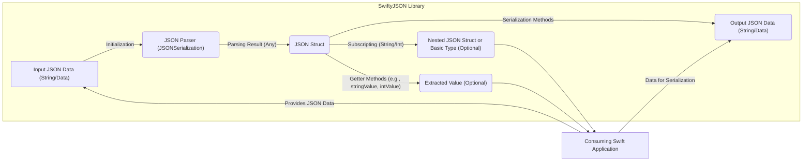
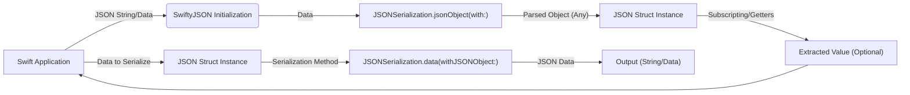

# Project Design Document: SwiftyJSON

**Version:** 1.1
**Date:** October 26, 2023
**Author:** AI Software Architect

## 1. Introduction

This document provides an enhanced and detailed design overview of the SwiftyJSON library, an open-source Swift library for parsing and serializing JSON data. This revised document aims to provide a more in-depth understanding of the library's architecture, data flow, and key components, with a stronger emphasis on aspects relevant to threat modeling and security considerations.

## 2. Project Overview

SwiftyJSON is a widely adopted Swift library designed to simplify the process of working with JSON data within Swift applications. It offers a more intuitive and expressive syntax for accessing and manipulating JSON structures compared to the standard `JSONSerialization` approach, thereby reducing boilerplate code and improving developer experience. The library's core focus is on providing a "Swifty" and user-friendly interface for common JSON operations.

## 3. Goals

* Provide a straightforward and intuitive Application Programming Interface (API) for parsing JSON data in Swift.
* Offer a safe and robust mechanism for accessing values within a JSON structure, with built-in handling for potentially missing or `nil` values.
* Support a comprehensive range of JSON data types, including objects, arrays, strings, numbers (integers and floating-point), and booleans.
* Facilitate the easy serialization of Swift objects back into valid JSON format.
* Maintain a lightweight footprint with minimal external dependencies to reduce the risk of dependency-related vulnerabilities.

## 4. Non-Goals

* Implementing comprehensive and customizable JSON schema validation against predefined schemas.
* Providing advanced JSON transformation or querying capabilities beyond basic access and manipulation (e.g., filtering, complex data transformations).
* Handling network requests or the process of fetching JSON data from external sources. SwiftyJSON's responsibility is strictly limited to the parsing and serialization of existing JSON data.
* Offering real-time JSON streaming or incremental parsing of large JSON datasets.

## 5. System Architecture

SwiftyJSON's architecture is centered around the `JSON` struct, which acts as a wrapper around the underlying parsed JSON data. The library provides various methods and subscripting options to interact with this data.

**Components:**

* **`JSON` Struct:** The central component of the library. It encapsulates the parsed JSON data internally, typically represented as a Swift `Any` type (usually a `Dictionary<String, Any>` or `[Any]`). This struct provides the primary interface for interacting with the JSON data.
* **Initialization Methods:**  A set of methods responsible for creating `JSON` instances from different input formats:
    * `init(data: Data)`: Initializes a `JSON` instance from `Data`, typically UTF-8 encoded JSON.
    * `init(jsonObject: Any)`: Initializes from a pre-parsed JSON object, such as those obtained from `JSONSerialization` or other JSON parsing mechanisms.
    * `init(jsonString: String)`: Initializes from a JSON string. This internally converts the string to `Data` and uses the `init(data:)` method.
* **JSON Parser (`JSONSerialization`):**  SwiftyJSON leverages Swift's built-in `JSONSerialization` class from the `Foundation` framework to perform the actual parsing of JSON `Data` into Swift objects. This component is crucial for converting the raw JSON input into a usable format.
* **Subscripting:** Provides convenient access to values within the JSON structure using string keys for objects (e.g., `json["name"]`) and integer indices for arrays (e.g., `json[0]`). Subscripting operations return another `JSON` instance, allowing for chained access to nested elements. Crucially, these return optional `JSON` types to handle cases where the key or index doesn't exist.
* **Getter Methods:** A collection of type-safe methods for extracting values from the `JSON` struct with specific types (e.g., `stringValue`, `intValue`, `boolValue`, `arrayValue`, `dictionaryValue`). These methods return optionals of the expected type, providing a safer way to access data and handle potential type mismatches or missing values.
* **Serialization Methods:** Methods responsible for converting the `JSON` struct back into JSON data:
    * `rawData(options:)`: Returns the JSON data as a `Data` object. Options allow for controlling the output format (e.g., pretty printing).
    * `rawString(encoding:, options:)`: Returns the JSON data as a `String` with a specified encoding.

## 6. Data Flow

The typical data flow within SwiftyJSON involves the following stages:

1. **Input:** The consuming Swift application provides JSON data to SwiftyJSON, typically as a `String` or `Data` object.
2. **Initialization:**  One of the `JSON` struct's initialization methods is called, receiving the input JSON data.
3. **Parsing:** Internally, the initialization methods utilize Swift's `JSONSerialization` to parse the input `Data` into a native Swift object (either a `Dictionary<String, Any>` or an `[Any]` array). This is where the raw JSON is transformed into a structured representation.
4. **Encapsulation:** The parsed Swift object is then stored within the newly created `JSON` struct instance.
5. **Access and Manipulation:** The application code interacts with the `JSON` struct using subscripting or getter methods to retrieve specific values. SwiftyJSON handles the necessary casting and optional unwrapping, providing a more streamlined API. If a requested key or index is not found, or the type is incorrect, the getter methods return `nil`.
6. **Output (Serialization):** When the application needs to convert the `JSON` data back into a JSON format, it calls one of the serialization methods (`rawData(options:)` or `rawString(encoding:, options:)`). These methods take the internal Swift object and use `JSONSerialization` to generate the JSON `Data` or `String`.

## 7. Security Considerations

While SwiftyJSON primarily focuses on data parsing and serialization, several security considerations are important for applications utilizing this library:

* **Denial of Service (DoS) via Large or Deeply Nested JSON Payloads:** Parsing extremely large JSON payloads or those with excessive nesting can lead to significant memory consumption and CPU usage, potentially causing a denial of service. This vulnerability lies primarily in the parsing process handled by `JSONSerialization`. Applications should implement safeguards against processing excessively large or complex JSON inputs.
* **Integer Overflow/Underflow during Numeric Value Extraction:** If the JSON data contains very large integer values that exceed the limits of Swift's integer types (e.g., `Int`, `Int64`), attempting to extract these values using methods like `intValue` could lead to integer overflow or underflow, resulting in unexpected behavior or potential crashes. Developers should be mindful of the potential range of numeric values in the JSON data.
* **Type Confusion and Unexpected `nil` Values:** While SwiftyJSON provides type-safe getters, incorrect assumptions about the underlying JSON structure or improper usage of the API can lead to type casting errors or unexpected `nil` values. Applications must handle these optional values gracefully to prevent runtime errors or unexpected behavior. Malicious actors could craft JSON payloads with unexpected types to exploit this.
* **Dependency Chain Vulnerabilities:** Although SwiftyJSON has minimal direct dependencies, it relies on the `Foundation` framework and specifically `JSONSerialization`. Vulnerabilities within these underlying Apple-provided components could indirectly affect applications using SwiftyJSON. Staying updated with system updates and security patches is crucial.
* **Lack of Built-in Schema Validation:** SwiftyJSON does not perform any inherent JSON schema validation. If the application relies on a specific JSON structure, it's the application's responsibility to implement validation logic after parsing. Maliciously crafted JSON that deviates from the expected schema could bypass application logic and introduce vulnerabilities.
* **Error Handling in Consuming Application:** The robustness of the application depends heavily on how it handles potential parsing errors or `nil` values returned by SwiftyJSON. Insufficient or incorrect error handling can expose vulnerabilities or lead to unexpected application states. For instance, failing to check for `nil` after accessing a potentially missing key could lead to a crash.
* **Injection Attacks (Indirect):** While SwiftyJSON itself doesn't directly introduce injection vulnerabilities, if the data extracted from the JSON is subsequently used in contexts susceptible to injection (e.g., constructing SQL queries or HTML), then vulnerabilities could arise. Proper sanitization and encoding of data extracted from JSON are crucial.

## 8. Dependencies

SwiftyJSON has a very lean dependency structure, primarily relying on the following component of the Swift standard library:

* **`Foundation` Framework:**  Specifically, the `JSONSerialization` class for the core parsing and serialization functionalities, as well as fundamental data types like `String`, `Data`, `Dictionary`, and `Array`.

## 9. Deployment

SwiftyJSON is typically integrated into Swift projects as a dependency using various dependency management tools:

* **Swift Package Manager (SPM):** The officially recommended method for managing dependencies in Swift projects.
* **CocoaPods:** A widely used dependency manager for macOS and iOS development.
* **Carthage:** Another popular decentralized dependency manager for macOS and iOS.

Once integrated, the SwiftyJSON library is linked with the application during the build process, making its functionalities available for use within the application's codebase.

## 10. Future Considerations (Security Implications)

Future enhancements to SwiftyJSON could introduce new security considerations:

* **Performance Optimizations (Potential Side-Effects):** While performance improvements are generally desirable, changes to the parsing logic could inadvertently introduce new vulnerabilities if not carefully implemented and tested.
* **Asynchronous Parsing (Concurrency Risks):** Introducing asynchronous parsing capabilities might introduce concurrency-related vulnerabilities if not handled correctly (e.g., race conditions, data corruption).
* **More Granular Error Reporting (Information Disclosure):** While more detailed error messages can be helpful for debugging, they could potentially expose sensitive information about the application's internal workings or data structure to attackers if not carefully managed in production environments.
* **Integration with Data Binding Frameworks (Attack Surface Expansion):** Tighter integration with other frameworks could potentially expand the attack surface if vulnerabilities exist in those frameworks or in the integration points.

This enhanced document provides a more detailed design overview of the SwiftyJSON library, with a stronger focus on security considerations relevant for threat modeling. The expanded descriptions of the architecture, data flow, and potential vulnerabilities should provide a more robust foundation for identifying and mitigating security risks associated with using this library.