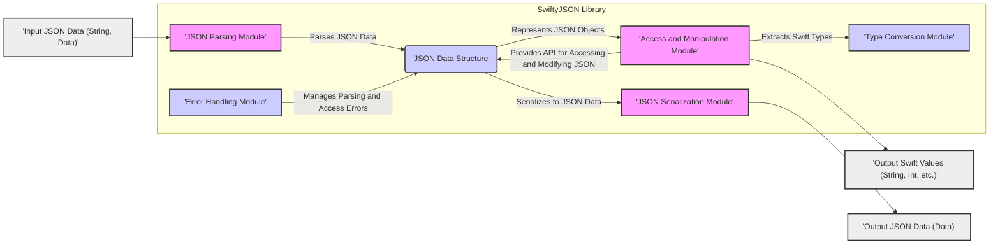
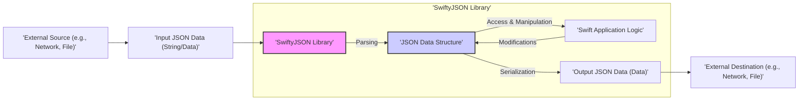

# Project Design Document: SwiftyJSON (Improved)

## 1. Project Overview

### 1.1. Project Goals

The SwiftyJSON project is a mature and widely-used Swift library designed to simplify working with JSON data in Swift applications. Its primary goals are:

- **Simplicity:** Provide an exceptionally easy-to-use and intuitive API for parsing and accessing JSON data, abstracting away complexities of manual JSON handling.
- **Readability:** Significantly enhance code clarity when dealing with JSON, reducing verbose and error-prone boilerplate code often associated with native JSON parsing.
- **Safety:** Offer a robust and safer approach to accessing JSON values, minimizing the risk of runtime crashes due to unexpected data types or missing keys by leveraging optionals and type-safe accessors.
- **Swift Idiomatic:** Seamlessly integrate with Swift's language paradigms and coding conventions, feeling like a natural extension of the Swift language for JSON manipulation.
- **Performance:** Provide reasonable performance for common JSON operations, balancing ease of use with efficiency.

### 1.2. Target Audience

The target audience for SwiftyJSON remains Swift developers across various platforms who need to efficiently and safely handle JSON data. This includes developers building:

- iOS, macOS, watchOS, and tvOS applications for Apple ecosystems.
- Server-side Swift applications using frameworks like Vapor or Kitura.
- Command-line tools and scripts written in Swift that process JSON data.
- Cross-platform Swift projects that interact with web services or data formats reliant on JSON.
- Educational purposes for developers learning Swift and JSON handling.

### 1.3. Key Features

SwiftyJSON continues to offer these core features:

- **Effortless JSON Parsing:** Converts JSON data from various sources (`String`, `Data`, URL responses, etc.) into a SwiftyJSON object with minimal code.
- **Intuitive Subscripting:** Provides highly readable and convenient access to JSON values using subscript syntax with strings (for dictionary keys) and integers (for array indices), mirroring JSON structure.
- **Safe Optional Chaining:** Employs Swift's optional chaining extensively to enable safe traversal of nested JSON structures, preventing unexpected nil dereferencing and crashes.
- **Type-Safe Value Extraction:** Offers a comprehensive set of methods to safely extract JSON values as specific Swift types (e.g., `String`, `Int`, `Bool`, `Double`, `Array`, `Dictionary`, custom types), with default values or optional returns for robustness.
- **Robust Error Handling:** Incorporates error handling mechanisms to gracefully manage parsing failures and invalid data access, providing informative error information when needed.
- **Simple JSON Serialization:** Converts SwiftyJSON objects back into JSON data (`Data`) for sending data or storage, maintaining data integrity.
- **Lightweight and Dependency-Free:** Remains a small, focused library with no external runtime dependencies beyond the standard Swift SDK, reducing project bloat and dependency management overhead.
- **Active Community and Maturity:** Benefits from a long history, active community support, and continuous maintenance, making it a reliable choice for production environments.

## 2. System Architecture

### 2.1. Component Diagram

### 2.2. Component Description

- **2.2.1. 'JSON Parsing Module':**
    - **Functionality:**  The initial entry point for JSON data. This module takes raw JSON data (as `String`, `Data`, or potentially other input types) and transforms it into SwiftyJSON's internal representation. It performs lexical and syntactic analysis to validate JSON format against specifications (RFC 8259).
    - **Implementation Details:**  Likely leverages Swift's `JSONSerialization` class from the `Foundation` framework for core parsing, benefiting from platform-optimized JSON processing. May include additional pre-processing or input sanitization steps.
    - **Security Relevance:** **Critical for security.** This module is the first line of defense against potentially malicious JSON input. Vulnerabilities here could lead to injection attacks, denial-of-service, or unexpected behavior due to parsing errors. Robust parsing and error handling are paramount.

- **2.2.2. 'JSON Data Structure':**
    - **Functionality:**  The heart of SwiftyJSON, this component represents the parsed JSON data in memory. It's designed to hold JSON objects, arrays, strings, numbers, booleans, and null values in a structured and easily accessible manner.
    - **Implementation Details:** Implemented using Swift's `enum` type, likely with associated values to represent the different JSON value types. This enum-based structure enables type-safe operations and efficient memory management. The `JSON` enum is the central type.
    - **Security Relevance:** **Important for data integrity and safe access.** The design of this structure influences how securely and efficiently JSON data is stored and manipulated within the library. Type safety enforced by enums helps prevent type-related errors and potential vulnerabilities arising from incorrect data interpretation. Memory management within this structure is also crucial to prevent leaks or crashes.

- **2.2.3. 'Access and Manipulation Module':**
    - **Functionality:** Provides the user-facing API for interacting with the 'JSON Data Structure'. This module enables developers to access, traverse, and potentially modify JSON data using intuitive subscripting (e.g., `json["key"]`, `json[0]`) and method calls. It facilitates navigation through nested JSON structures.
    - **Implementation Details:** Achieved through Swift extensions and methods on the `JSON` enum. Subscripting is likely implemented using Swift's dynamic features or custom subscript implementations to provide flexible access. Optional chaining is heavily utilized for safe navigation.
    - **Security Relevance:** **Crucial for preventing unintended access and errors.** This module must ensure that access to JSON values is safe and predictable. It should prevent out-of-bounds access for arrays and handle missing keys in objects gracefully, typically returning optionals to signal potential absence of data and avoid runtime exceptions.

- **2.2.4. 'Type Conversion Module':**
    - **Functionality:**  Responsible for safely converting JSON values stored in the 'JSON Data Structure' into concrete Swift types (e.g., `String`, `Int`, `Bool`, `Array<String>`, `Dictionary<String, Int>`). It provides a set of type-specific accessors (e.g., `stringValue`, `intValue`, `arrayValue`) that handle type checking and return optionals or default values to prevent runtime errors if the JSON value doesn't match the expected type.
    - **Implementation Details:** Implemented as methods within the `JSON` enum. These methods use Swift's type casting (`as?`, `as!`) and optional handling to perform conversions safely. Default values are often provided as parameters to these methods for fallback scenarios.
    - **Security Relevance:** **Essential for type safety and preventing data corruption.** This module ensures that JSON data is interpreted correctly as Swift types, preventing type-related vulnerabilities or unexpected behavior in the application logic. Proper type validation and safe conversion are key to data integrity.

- **2.2.5. 'JSON Serialization Module':**
    - **Functionality:**  Performs the reverse operation of parsing, converting the internal 'JSON Data Structure' back into raw JSON data (`Data`). This is used when the application needs to send JSON data over a network, store it in a file, or pass it to other systems expecting JSON format.
    - **Implementation Details:**  Likely utilizes Swift's `JSONSerialization` class to convert the internal `JSON` representation back into JSON `Data`. It handles encoding and formatting of JSON according to specifications.
    - **Security Relevance:** **Important for data integrity and preventing injection in output.** Serialization must correctly encode data to JSON format and avoid introducing any vulnerabilities during the process. It should ensure that the serialized JSON is valid and doesn't inadvertently include malicious content if the original data was manipulated.

- **2.2.6. 'Error Handling Module':**
    - **Functionality:**  Centralized component for managing errors that can occur throughout the SwiftyJSON library, specifically during JSON parsing and value access. It handles scenarios like malformed JSON input, attempts to access non-existent keys, or type mismatches during conversion.
    - **Implementation Details:**  Employs Swift's error handling mechanisms, potentially using `Result` types or throwing custom `Error` enums to propagate errors to the user code. SwiftyJSON likely defines its own error types to provide more context-specific error information.
    - **Security Relevance:** **Crucial for application stability and preventing information disclosure.** Proper error handling prevents application crashes due to unexpected JSON data. Error messages should be informative for debugging but must avoid revealing sensitive internal details that could be exploited by attackers. Secure logging of errors is also important.

## 3. Data Flow

### 3.1. Data Flow Diagram

### 3.2. Data Input

- **Sources:** JSON data enters SwiftyJSON from diverse sources:
    - **Network Requests:**  Fetching JSON responses from web APIs (REST, GraphQL, etc.) using `URLSession` or networking libraries.
    - **Local Files:** Reading JSON data from files stored locally on the device or server using `FileManager`.
    - **In-Memory Strings/Data:** JSON data already present within the application's memory, perhaps constructed programmatically or received from other modules.
    - **User Input (Less Common):** In some scenarios, applications might process JSON data directly input by users, though this is less typical for SwiftyJSON's primary use cases.

- **Formats:** SwiftyJSON primarily accepts JSON data in these formats:
    - `String`: A Swift `String` containing JSON text encoded in UTF-8.
    - `Data`: Raw `Data` representing JSON in UTF-8 encoding. This is the most common and efficient format for handling binary data.
    - Potentially other formats that can be readily converted to `Data` or `String` before parsing.

- **Validation:** The 'JSON Parsing Module' performs initial validation of the input data to ensure it conforms to the JSON specification (RFC 8259). This includes:
    - **Syntax Validation:** Checking for correct JSON syntax (brackets, commas, colons, quotes).
    - **Encoding Validation:** Ensuring the data is in UTF-8 encoding or handling encoding appropriately.
    - **Basic Structure Validation:** Verifying the top-level element is a valid JSON type (object or array).

### 3.3. Data Processing

1. **Parsing Initiation:** Input JSON Data (`String` or `Data`) is passed to the 'JSON Parsing Module'.
2. **Parsing and Structuring:** The 'JSON Parsing Module' parses the input data, validating its JSON format and constructing the internal 'JSON Data Structure' in memory.
3. **Access and Manipulation via API:** Swift Application Logic interacts with the 'JSON Data Structure' through the 'Access and Manipulation Module' API. This involves:
    - **Retrieving Values:** Accessing specific JSON values using subscripting or type-safe accessors.
    - **Traversing Structure:** Navigating through nested JSON objects and arrays.
    - **(Potentially) Modifying Data:** While SwiftyJSON is primarily read-oriented, some manipulation might be possible through its API (though less common).
4. **Type Conversion as Needed:** When accessing values, the 'Type Conversion Module' is invoked to safely convert JSON values to desired Swift types.
5. **Error Handling Throughout:** If any errors occur during parsing, access, or type conversion, the 'Error Handling Module' manages and propagates these errors back to the application logic.

### 3.4. Data Output

- **Formats:** SwiftyJSON primarily outputs JSON data in the following format:
    - `Data`: JSON data serialized back into `Data` in UTF-8 encoding. This is the standard format for transmitting or storing JSON.

- **Destinations:** Output JSON `Data` can be used for:
    - **Network Responses:** Sending JSON data as responses from server-side Swift applications or as part of client-side network requests.
    - **File Storage:** Writing JSON data to local files for configuration, caching, or data persistence.
    - **Inter-Process Communication:**  Using JSON as a serialization format for communication between different processes or applications.
    - **Further Processing:** Passing serialized JSON data to other parts of the Swift application or external systems.

- **Serialization Process:** The 'JSON Serialization Module' takes the internal 'JSON Data Structure' and converts it back into JSON `Data` for output, ensuring correct JSON formatting and encoding.

## 4. Dependencies

### 4.1. External Dependencies

SwiftyJSON is intentionally designed to be lightweight and dependency-free. It has **zero external runtime dependencies** beyond the Swift Standard Library and the `Foundation` framework. This is a significant advantage for security and maintainability, as it reduces the attack surface and eliminates concerns about vulnerabilities in external libraries.

### 4.2. Internal Dependencies (within Swift Standard Library & Foundation)

SwiftyJSON relies on core components of the Swift ecosystem:

- **`Foundation` Framework (Apple's Core Foundation Framework bridged to Swift):**
    - `Data`: Fundamental type for handling raw byte data, essential for JSON processing.
    - `String`: For string manipulation, encoding, and decoding of JSON text.
    - `JSONSerialization`: The underlying Objective-C based API in `Foundation` that performs the heavy lifting of JSON parsing and serialization. SwiftyJSON likely wraps and simplifies `JSONSerialization`.
    - Bridged Objective-C types like `NSNumber`, `NSArray`, `NSDictionary`: These might be used internally by `JSONSerialization` and are handled transparently by Swift and SwiftyJSON.
    - `PropertyListSerialization` (Potentially): While primarily for Property Lists, it might be indirectly involved in how `JSONSerialization` handles certain data types.

- **Swift Standard Library:**
    - Core Swift types: `Int`, `Bool`, `Double`, `Optional`, `enum`, `struct`, `Any`, `AnyObject`, etc.
    - Collection types: `Array`, `Dictionary`.
    - Error handling mechanisms: `Error` protocol, `Result` type, `throws`.
    - Memory management features: Automatic Reference Counting (ARC).

These internal dependencies are part of the standard Swift and Apple platform SDKs, maintained by Apple, and are generally considered highly reliable and secure.

## 5. Security Considerations

### 5.1. Input Validation Robustness

- **Threat:** Maliciously crafted or malformed JSON input could exploit vulnerabilities in the parsing process, leading to crashes, unexpected behavior, or even remote code execution in extreme cases (though less likely in a well-designed JSON parser).
- **SwiftyJSON's Approach:** SwiftyJSON relies on `JSONSerialization` (or its own parsing logic, if any, on top of it) for JSON syntax validation. It is expected to handle invalid JSON gracefully by returning errors or nil optionals, preventing application crashes.
- **Threat Modeling Consideration:**
    - **Fuzz Testing:** Conduct fuzz testing with a wide range of malformed JSON inputs (syntax errors, type mismatches, encoding issues, oversized data, deeply nested structures) to assess SwiftyJSON's robustness and error handling.
    - **Specific Vulnerability Checks:** Investigate known JSON parsing vulnerabilities (e.g., Billion Laughs attack, JSON bombs) and verify SwiftyJSON's resilience against them.
    - **Resource Limits:** Evaluate if SwiftyJSON imposes or relies on underlying system limits to prevent resource exhaustion from extremely large or complex JSON inputs.

### 5.2. Error Handling and Information Disclosure Mitigation

- **Threat:** Overly verbose or poorly designed error messages generated by SwiftyJSON could inadvertently reveal sensitive information about the application's internal structure, data, or environment to potential attackers.
- **SwiftyJSON's Approach:** SwiftyJSON provides error handling, but the content and verbosity of error messages need careful review.
- **Threat Modeling Consideration:**
    - **Error Message Review:** Examine all error messages generated by SwiftyJSON in various error scenarios (parsing errors, type conversion failures, access errors).
    - **Information Leakage Assessment:** Ensure error messages are informative for developers during debugging but do not expose sensitive details (e.g., internal file paths, database connection strings, user-specific data) in production environments.
    - **Custom Error Handling:** Implement custom error handling in applications using SwiftyJSON to sanitize or redact error messages before displaying them to users or logging them in production.

### 5.3. Resource Exhaustion Prevention

- **Threat:** Processing exceptionally large JSON payloads or deeply nested structures could consume excessive memory, CPU, or other system resources, leading to denial-of-service (DoS) conditions or impacting application performance.
- **SwiftyJSON's Approach:** SwiftyJSON's performance and memory footprint should be evaluated, especially when dealing with potentially untrusted or very large JSON inputs.
- **Threat Modeling Consideration:**
    - **Performance Benchmarking:** Benchmark SwiftyJSON's performance (parsing time, memory usage) with JSON payloads of varying sizes and complexities.
    - **Resource Limits Implementation:** Consider implementing application-level limits on the size and complexity of JSON payloads that the application will process to prevent resource exhaustion attacks.
    - **Streaming Parsing (If Applicable):** Investigate if SwiftyJSON or underlying `JSONSerialization` supports streaming parsing for very large JSON documents to reduce memory footprint (though SwiftyJSON is generally in-memory).

### 5.4. Code Injection Vulnerability (Low Likelihood)

- **Threat:** Although highly unlikely in a JSON parsing library like SwiftyJSON, a theoretical risk exists if the library were to dynamically execute code based on JSON content (which is not its intended purpose).
- **SwiftyJSON's Approach:** SwiftyJSON is designed as a data parsing and manipulation library. It is not intended to execute code embedded within JSON data.
- **Threat Modeling Consideration:**
    - **Code Review (If Possible):** Review SwiftyJSON's source code (if feasible and relevant) to confirm that there are no features or code paths that could lead to code injection vulnerabilities.
    - **Functionality Verification:** Verify that SwiftyJSON strictly interprets JSON as data and does not attempt to execute any part of it as code.

### 5.5. Memory Safety and Memory Management

- **Threat:** Memory safety issues (e.g., buffer overflows, use-after-free, memory leaks) in SwiftyJSON's implementation or in the underlying `JSONSerialization` could lead to crashes, data corruption, or exploitable vulnerabilities.
- **SwiftyJSON's Approach:** Swift's Automatic Reference Counting (ARC) helps mitigate many memory safety issues. However, vulnerabilities could still arise in native code within `Foundation` or due to incorrect memory management practices.
- **Threat Modeling Consideration:**
    - **Static Analysis:** Use static analysis tools to scan SwiftyJSON's code (and potentially `Foundation` if source is available) for potential memory safety issues.
    - **Memory Profiling:** Perform memory profiling of applications using SwiftyJSON to detect potential memory leaks or excessive memory consumption.
    - **Dependency Security (Foundation):** Rely on Apple's security practices and updates for the `Foundation` framework, as SwiftyJSON depends on it.

### 5.6. Dependency Security (Swift Standard Library & Foundation)

- **Threat:** Although internal dependencies, vulnerabilities in the Swift Standard Library or `Foundation` framework could indirectly affect SwiftyJSON and applications using it.
- **SwiftyJSON's Approach:** SwiftyJSON relies on these core Apple-maintained frameworks.
- **Threat Modeling Consideration:**
    - **Stay Updated:** Keep Swift toolchain and platform SDKs updated to benefit from security patches and improvements in the Swift Standard Library and `Foundation`.
    - **Apple Security Advisories:** Monitor Apple's security advisories for any reported vulnerabilities in these core frameworks that might impact applications using SwiftyJSON.
    - **Limited Mitigation:** Direct mitigation within SwiftyJSON for vulnerabilities in these core dependencies is generally not possible; reliance is placed on Apple's security maintenance.

## 6. Deployment and Usage

### 6.1. Deployment Methods

SwiftyJSON's deployment is straightforward due to its nature as a Swift library. Common methods include:

- **Swift Package Manager (SPM):** The recommended and increasingly standard way to manage Swift dependencies. Add SwiftyJSON as a dependency in the `dependencies` array of your `Package.swift` manifest file.
- **CocoaPods:** A widely used dependency manager for Swift and Objective-C Cocoa projects, particularly for iOS and macOS development. Integrate SwiftyJSON by adding it to your `Podfile` and running `pod install`.
- **Carthage:** A decentralized dependency manager for Cocoa projects. Add SwiftyJSON to your `Cartfile` and follow Carthage build instructions.
- **Manual Integration (Less Common, Not Recommended for Dependency Management):** Download the `SwiftyJSON.swift` file directly from the GitHub repository and include it in your Swift project. This method bypasses dependency management and is generally discouraged for larger projects.

### 6.2. Usage Scenarios

SwiftyJSON is versatile and applicable in numerous scenarios:

- **Mobile App Development (iOS, watchOS, tvOS):** Parsing JSON data from backend APIs for mobile applications, handling app configuration fetched in JSON format, processing local JSON data files.
- **Server-Side Swift Development:** Building RESTful APIs and web services using Swift frameworks (Vapor, Kitura, etc.) that handle JSON requests and responses, processing JSON data in server-side applications.
- **Command-Line Tools and Scripts:** Creating Swift-based command-line tools that parse, manipulate, and generate JSON data for scripting, automation, or data processing tasks.
- **Data Processing and Analysis Applications:** Working with JSON datasets for data transformation, analysis, and reporting in Swift applications.
- **Inter-service Communication:** Utilizing JSON as a serialization format for communication between microservices or different components of a distributed system written in Swift.
- **Testing and Prototyping:** Rapidly prototyping and testing Swift code that interacts with JSON data due to SwiftyJSON's ease of use.
- **Educational Purposes:** Learning and teaching Swift and JSON handling concepts using SwiftyJSON as a simplified and accessible library.

This improved design document provides a more detailed and security-focused overview of SwiftyJSON, suitable for in-depth threat modeling and security analysis of projects that depend on this library. It emphasizes security considerations in each component and data flow stage, offering actionable points for threat modeling exercises.