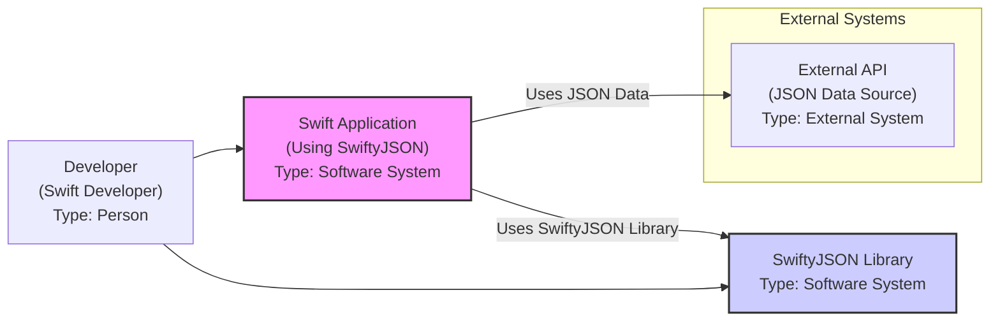
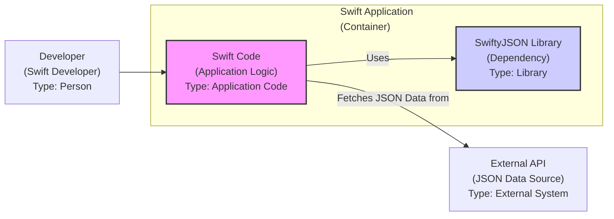
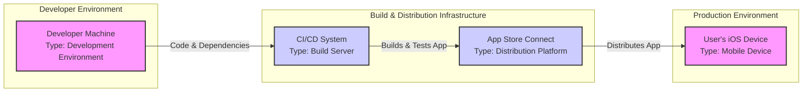
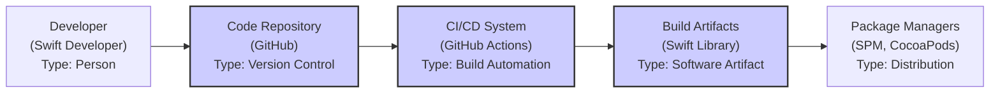

# BUSINESS POSTURE

This project, SwiftyJSON, is an open-source Swift library designed to simplify working with JSON data in Swift applications.

- Business Priorities and Goals:
  - Simplify JSON parsing in Swift.
  - Provide an easy-to-use and intuitive API for accessing JSON data.
  - Improve developer productivity when working with JSON.
  - Ensure robustness and reliability in JSON handling.
  - Maintain compatibility with various Swift versions and platforms.
  - Foster a community around the library for continuous improvement and support.

- Business Risks:
  - Incorrect JSON parsing leading to application errors or unexpected behavior.
  - Security vulnerabilities in the library that could be exploited by malicious JSON data, potentially impacting applications using SwiftyJSON.
  - Performance bottlenecks in JSON parsing affecting application responsiveness.
  - Lack of maintenance or community support leading to stagnation and security issues over time.
  - Incompatibility with future Swift versions, requiring significant updates or migration.

# SECURITY POSTURE

- Existing Security Controls:
  - security control: Code is publicly available on GitHub for community review. (Implemented: GitHub Repository)
  - security control: Issue tracking system on GitHub for reporting bugs and potential vulnerabilities. (Implemented: GitHub Issues)
  - accepted risk: Reliance on community contributions for security vulnerability identification and patching.
  - accepted risk: Limited formal security testing or dedicated security team for the project.

- Recommended Security Controls:
  - security control: Implement automated Static Application Security Testing (SAST) in the CI/CD pipeline to identify potential code-level vulnerabilities.
  - security control: Integrate dependency scanning to identify and manage vulnerabilities in third-party dependencies used by the library (if any).
  - security control: Establish a clear process for reporting and handling security vulnerabilities, including a security policy and contact information.
  - security control: Conduct periodic code reviews with a security focus, involving experienced security engineers if possible.
  - security control: Consider adding fuzz testing to identify potential parsing vulnerabilities when handling malformed or malicious JSON inputs.

- Security Requirements:
  - Authentication: Not applicable for a library. Authentication is the responsibility of the applications using SwiftyJSON.
  - Authorization: Not applicable for a library. Authorization is the responsibility of the applications using SwiftyJSON.
  - Input Validation:
    - security requirement: Robustly parse and validate JSON input to prevent injection attacks or denial-of-service vulnerabilities caused by malformed or excessively large JSON data.
    - security requirement: Handle various JSON data types and structures correctly and securely.
    - security requirement: Implement error handling for invalid JSON input to prevent application crashes and provide informative error messages (without revealing sensitive information).
  - Cryptography: Not directly applicable for a JSON parsing library itself. Cryptographic operations would be the responsibility of applications using SwiftyJSON if they need to handle sensitive data within JSON. However, SwiftyJSON should not introduce vulnerabilities that could compromise cryptographic operations in consuming applications.

# DESIGN

## C4 CONTEXT

- Context Diagram Elements:
  - - Name: External API (JSON Data Source)
    - Type: External System
    - Description: External systems or services that provide JSON data to Swift applications. These could be web services, databases, or other data sources.
    - Responsibilities: Provide JSON data in a defined format. Implement their own security controls for data access and integrity.
    - Security controls: API authentication, authorization, input validation, rate limiting (external system responsibility).
  - - Name: Swift Application (Using SwiftyJSON)
    - Type: Software System
    - Description: Swift applications developed by developers that utilize the SwiftyJSON library to parse and process JSON data.
    - Responsibilities: Fetch JSON data from external sources, use SwiftyJSON to parse the data, process the parsed data, and present or store the information. Implement application-level security controls.
    - Security controls: Application-level authentication, authorization, input validation (in addition to SwiftyJSON's parsing), output encoding, secure data storage, and logging.
  - - Name: Developer (Swift Developer)
    - Type: Person
    - Description: Software developers who use SwiftyJSON to build Swift applications.
    - Responsibilities: Write Swift code, integrate SwiftyJSON into their projects, handle JSON data within their applications, and ensure the security of their applications.
    - Security controls: Secure development practices, code review, dependency management, and secure configuration of development environments.
  - - Name: SwiftyJSON Library
    - Type: Software System
    - Description: The SwiftyJSON open-source library itself, responsible for parsing JSON data in Swift.
    - Responsibilities: Parse JSON data provided by Swift applications, provide an API for accessing JSON elements, and handle potential errors during parsing.
    - Security controls: Input validation (JSON parsing logic), memory safety, and protection against common vulnerabilities like buffer overflows or injection attacks within the parsing logic.

## C4 CONTAINER

- Container Diagram Elements:
  - - Name: Swift Code (Application Logic)
    - Type: Application Code
    - Description: The custom Swift code written by developers that forms the core logic of the Swift application. This code utilizes the SwiftyJSON library and interacts with external systems.
    - Responsibilities: Implement application-specific features, fetch data, process data (including JSON data parsed by SwiftyJSON), manage application state, and interact with users or other systems.
    - Security controls: Application-level authentication, authorization, input validation (application-specific), output encoding, secure data storage, logging, and secure session management.
  - - Name: SwiftyJSON Library (Dependency)
    - Type: Library
    - Description: The SwiftyJSON library integrated as a dependency within the Swift application.
    - Responsibilities: Parse JSON strings into a usable Swift object structure, provide methods for accessing and manipulating JSON data, and handle JSON parsing errors.
    - Security controls: Input validation (JSON parsing logic), memory safety, and protection against common vulnerabilities within the library code.
  - - Name: External API (JSON Data Source)
    - Type: External System
    - Description: External systems or services providing JSON data, as described in the Context Diagram.
    - Responsibilities: Provide JSON data. Implement their own security controls.
    - Security controls: API authentication, authorization, input validation, rate limiting (external system responsibility).
  - - Name: Developer (Swift Developer)
    - Type: Person
    - Description: Developers who write the Swift application code and integrate the SwiftyJSON library.
    - Responsibilities: Develop, test, and maintain the Swift application, including the integration and usage of SwiftyJSON.
    - Security controls: Secure development practices, code review, dependency management, and secure configuration of development environments.

## DEPLOYMENT

For a library like SwiftyJSON, "deployment" refers to how it is integrated into a Swift application's build and distribution process.  The library itself is not deployed as a standalone service.  The deployment diagram focuses on the Swift application that *uses* SwiftyJSON.

We will consider a simplified deployment scenario where a Swift application using SwiftyJSON is deployed to a user's iOS device.

- Deployment Diagram Elements:
  - - Name: Developer Machine
    - Type: Development Environment
    - Description: The local machine used by a Swift developer to write code, including the Swift application and its dependencies like SwiftyJSON.
    - Responsibilities: Code development, local testing, and managing project dependencies.
    - Security controls: Developer machine security (OS hardening, antivirus), secure code storage (version control), and secure development practices.
  - - Name: CI/CD System
    - Type: Build Server
    - Description: An automated system (e.g., GitHub Actions, Jenkins) that builds, tests, and potentially deploys the Swift application.
    - Responsibilities: Automated building, testing, static analysis, and packaging of the Swift application.
    - Security controls: Secure build environment, access control to CI/CD system, secure storage of build artifacts, and integration of security scanning tools in the pipeline.
  - - Name: App Store Connect
    - Type: Distribution Platform
    - Description: Apple's platform for distributing iOS applications to users via the App Store.
    - Responsibilities: Application distribution, app review process, and managing app updates.
    - Security controls: Apple's app review process, code signing, and platform security features.
  - - Name: User's iOS Device
    - Type: Mobile Device
    - Description: The end-user's iOS device where the Swift application is installed and run.
    - Responsibilities: Running the Swift application, processing JSON data (using SwiftyJSON indirectly), and user data storage.
    - Security controls: Mobile OS security features, app sandboxing, user permissions, and device encryption.

## BUILD

- Build Process Description:
  - Developer writes Swift code for SwiftyJSON and commits it to a code repository (e.g., GitHub).
  - A CI/CD system (e.g., GitHub Actions) is triggered by code changes.
  - The CI/CD system automatically builds the SwiftyJSON library, runs unit tests, and may perform static analysis and security checks (SAST).
  - Successful builds produce build artifacts, which are the compiled SwiftyJSON library.
  - These build artifacts are then published to package managers (like Swift Package Manager, CocoaPods, Carthage) or directly to GitHub Releases, making the library available for developers to integrate into their Swift projects.

- Build Process Security Controls:
  - security control: Secure Code Repository (GitHub): Access control, branch protection, and audit logging for code changes.
  - security control: Automated Build Process (CI/CD): Use of a trusted CI/CD system (e.g., GitHub Actions), secure configuration of build pipelines, and access control to CI/CD configurations.
  - security control: Static Application Security Testing (SAST): Integrate SAST tools into the CI/CD pipeline to automatically scan the code for potential vulnerabilities during the build process.
  - security control: Dependency Scanning:  If SwiftyJSON depends on other libraries (unlikely for a simple JSON parser, but good practice), dependency scanning should be included to identify vulnerable dependencies.
  - security control: Unit Testing: Comprehensive unit tests to ensure the library functions as expected and to catch regressions.
  - security control: Code Signing/Verification: While not directly applicable to a library, ensure that release processes and distribution mechanisms are secure and prevent tampering. For applications using SwiftyJSON, code signing is crucial.
  - security control: Build Artifact Integrity: Ensure the integrity of build artifacts during the build and publishing process to prevent tampering or corruption.

# RISK ASSESSMENT

- Critical Business Processes:
  - For SwiftyJSON itself, the critical process is providing a reliable and secure JSON parsing library for the Swift community. Failure in this process can impact a large number of Swift applications relying on it.
  - For applications using SwiftyJSON, critical business processes depend on the application's functionality. However, any application that relies on correctly parsing JSON data for its core functions has a critical dependency on SwiftyJSON's reliability and security.

- Data Sensitivity:
  - SwiftyJSON itself does not store or manage data. It processes JSON data provided by applications.
  - The sensitivity of the data being processed depends entirely on the applications using SwiftyJSON. JSON data can contain highly sensitive information (e.g., personal data, financial data, authentication tokens).
  - If SwiftyJSON has vulnerabilities that lead to incorrect parsing or data manipulation, it could indirectly compromise the confidentiality, integrity, or availability of sensitive data processed by applications using it.

# QUESTIONS & ASSUMPTIONS

- Questions:
  - What is the intended scope of usage for SwiftyJSON? Is it primarily for mobile applications, server-side Swift, or both? (Assumption: General-purpose JSON parsing library for Swift).
  - Are there any specific performance requirements or constraints for SwiftyJSON? (Assumption: Performance is important, but correctness and security are paramount).
  - What is the process for reporting and handling security vulnerabilities in SwiftyJSON currently? (Assumption: Informal, relying on GitHub issues. Recommendation: Formalize the process).
  - Are there any existing automated security checks in the SwiftyJSON build process? (Assumption: Likely limited. Recommendation: Implement SAST and dependency scanning).

- Assumptions:
  - SwiftyJSON is intended to be a widely used, general-purpose JSON parsing library for Swift.
  - Security and reliability are important considerations for SwiftyJSON users.
  - The project is maintained by a community of developers, rather than a dedicated security team.
  - Applications using SwiftyJSON handle a variety of JSON data, potentially including sensitive information.
  - The primary distribution mechanism for SwiftyJSON is through Swift package managers and GitHub.