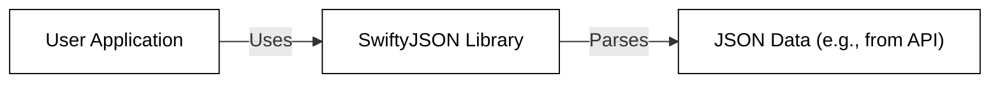
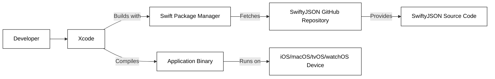
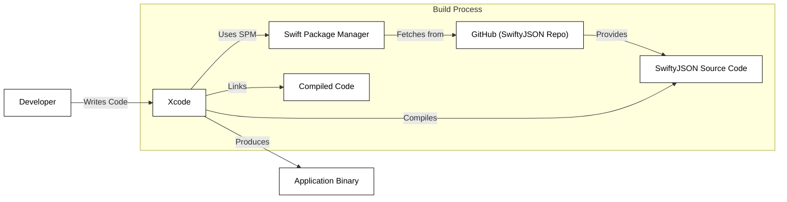

# Project Design Document: SwiftyJSON

## BUSINESS POSTURE

Business Priorities and Goals:

*   Provide a simplified and more user-friendly way to handle JSON data in Swift.
*   Reduce the complexity and verbosity of native Swift JSON parsing.
*   Improve developer productivity when working with JSON APIs.
*   Offer a robust and well-tested solution for JSON handling.
*   Maintain backward compatibility as Swift evolves.

Business Risks:

*   Data corruption or loss due to incorrect JSON parsing.
*   Security vulnerabilities introduced by improper handling of untrusted JSON data (e.g., injection attacks).
*   Performance bottlenecks due to inefficient JSON processing.
*   Compatibility issues with different Swift versions or platforms.
*   Maintenance overhead and difficulty in adapting to changes in JSON standards or API responses.
*   Reliance on external dependencies that may introduce their own risks.

## SECURITY POSTURE

Existing Security Controls:

*   security control: Type safety: SwiftyJSON leverages Swift's strong type system to help prevent common errors related to incorrect type assumptions. (Implemented in the library's core logic).
*   security control: Error handling: The library provides mechanisms for handling errors that may occur during JSON parsing, such as invalid JSON format or missing keys. (Implemented through the `error` property and optional chaining).
*   security control: Community review: Being an open-source project, SwiftyJSON benefits from community scrutiny, which can help identify and address potential security issues. (Described in the project's GitHub repository and community forums).
*   security control: Unit tests: The project includes a suite of unit tests to ensure the correctness and stability of the library's functionality. (Described in the project's README and test suite).

Accepted Risks:

*   accepted risk: Potential for vulnerabilities if used to parse extremely large or deeply nested JSON structures, potentially leading to denial-of-service (DoS) attacks. This is a common risk with JSON parsing libraries.
*   accepted risk: The library itself does not perform input sanitization. It is the responsibility of the user to ensure that the JSON data being parsed is safe and does not contain malicious content.

Recommended Security Controls:

*   security control: Input validation: While SwiftyJSON doesn't do this directly, developers *must* validate and sanitize any external data *before* passing it to SwiftyJSON. This is crucial to prevent injection attacks.
*   security control: Size limits: Implement checks to limit the size of the JSON data being parsed to mitigate potential DoS attacks.
*   security control: Depth limits: Implement checks to limit the nesting depth of the JSON data to mitigate potential stack overflow vulnerabilities.

Security Requirements:

*   Authentication: Not directly applicable to this library, as it focuses on JSON parsing, not authentication. Authentication should be handled at the application or API level.
*   Authorization: Not directly applicable to this library. Authorization should be handled at the application or API level.
*   Input Validation: *Crucially important*. Developers using SwiftyJSON MUST validate and sanitize all JSON input before parsing it. This includes checking for data types, lengths, and expected formats. This is the developer's responsibility, not the library's.
*   Cryptography: Not directly applicable to this library. If the JSON data contains sensitive information, it should be encrypted at the source and decrypted after parsing, using appropriate cryptographic libraries. SwiftyJSON does not handle encryption/decryption.

## DESIGN

### C4 CONTEXT

Context Diagram Element Description:

*   User Application
    *   Name: User Application
    *   Type: Software System
    *   Description: The application that utilizes SwiftyJSON to parse JSON data.
    *   Responsibilities: Making API requests, handling responses, using SwiftyJSON to process JSON data, displaying data to the user, handling user interactions.
    *   Security controls: Input validation, output encoding, authentication, authorization, session management, error handling.

*   SwiftyJSON
    *   Name: SwiftyJSON Library
    *   Type: Library
    *   Description: A Swift library that simplifies JSON parsing.
    *   Responsibilities: Providing a convenient API for accessing and manipulating JSON data, handling errors during parsing.
    *   Security controls: Type safety, error handling.

*   JSON Data
    *   Name: JSON Data
    *   Type: Data
    *   Description: JSON data obtained from an external source, such as an API.
    *   Responsibilities: Representing data in a structured format.
    *   Security controls: Data validation and sanitization (should be performed by the User Application *before* passing to SwiftyJSON).

### C4 CONTAINER

Since SwiftyJSON is a library, the container diagram is essentially the same as the context diagram. It's a single component.

Container Diagram Element Description:

*   User Application
    *   Name: User Application
    *   Type: Software System
    *   Description: The application that utilizes SwiftyJSON to parse JSON data.
    *   Responsibilities: Making API requests, handling responses, using SwiftyJSON to process JSON data, displaying data to the user, handling user interactions.
    *   Security controls: Input validation, output encoding, authentication, authorization, session management, error handling.

*   SwiftyJSON
    *   Name: SwiftyJSON Library
    *   Type: Library
    *   Description: A Swift library that simplifies JSON parsing.
    *   Responsibilities: Providing a convenient API for accessing and manipulating JSON data, handling errors during parsing.
    *   Security controls: Type safety, error handling.

*   JSON Data
    *   Name: JSON Data
    *   Type: Data
    *   Description: JSON data obtained from an external source, such as an API.
    *   Responsibilities: Representing data in a structured format.
    *   Security controls: Data validation and sanitization (should be performed by the User Application *before* passing to SwiftyJSON).

### DEPLOYMENT

SwiftyJSON is typically integrated into a Swift project using dependency managers like Swift Package Manager, CocoaPods, or Carthage.  It's not "deployed" in the traditional sense of a server-side application.

Deployment Solutions:

1.  Swift Package Manager (Recommended): Integrated directly into Xcode.
2.  CocoaPods: A popular dependency manager for Cocoa projects.
3.  Carthage: A decentralized dependency manager.
4.  Manual Integration: Downloading the source code and adding it to the project.

Chosen Solution (Swift Package Manager):

Deployment Diagram Element Description:

*   Developer
    *   Name: Developer
    *   Type: Person
    *   Description: The developer writing the Swift application.
    *   Responsibilities: Writing code, integrating SwiftyJSON, building the application.
    *   Security controls: Secure coding practices.

*   Xcode
    *   Name: Xcode
    *   Type: IDE
    *   Description: Apple's integrated development environment.
    *   Responsibilities: Providing tools for development, building, and debugging.
    *   Security controls: Code signing, sandboxing.

*   Swift Package Manager
    *   Name: Swift Package Manager
    *   Type: Tool
    *   Description: Swift's built-in dependency manager.
    *   Responsibilities: Fetching and managing dependencies.
    *   Security controls: Package signing (future feature).

*   SwiftyJSON GitHub Repository
    *   Name: SwiftyJSON GitHub Repository
    *   Type: Repository
    *   Description: The source code repository for SwiftyJSON.
    *   Responsibilities: Hosting the SwiftyJSON source code.
    *   Security controls: Access controls, code review processes.

*   SwiftyJSON Source Code
    *   Name: SwiftyJSON Source Code
    *   Type: Code
    *   Description: The source code of the SwiftyJSON library.
    *   Responsibilities: Providing JSON parsing functionality.
    *   Security controls: Type safety, error handling.

*   Application Binary
    *   Name: Application Binary
    *   Type: Executable
    *   Description: The compiled application.
    *   Responsibilities: Running the application logic.
    *   Security controls: OS-level security features.

*   iOS/macOS/tvOS/watchOS Device
    *   Name: iOS/macOS/tvOS/watchOS Device
    *   Type: Device
    *   Description: The device on which the application runs.
    *   Responsibilities: Executing the application.
    *   Security controls: OS-level security features, sandboxing.

### BUILD

The build process for SwiftyJSON, when integrated via Swift Package Manager, is handled automatically by Xcode.

Build Process Description:

1.  The developer writes code in Xcode, including integrating SwiftyJSON via Swift Package Manager.
2.  Xcode, using Swift Package Manager, fetches the SwiftyJSON source code from its GitHub repository.
3.  Xcode compiles the SwiftyJSON source code along with the application's code.
4.  Xcode links the compiled code to create the final application binary.

Security Controls in Build Process:

*   security control: Dependency Management: Swift Package Manager handles fetching the correct version of SwiftyJSON, reducing the risk of manually including incorrect or compromised code.
*   security control: Code Signing: Xcode automatically code-signs the application binary, ensuring its integrity and authenticity.
*   security control: Compiler Warnings and Errors: Xcode's compiler provides warnings and errors that can help identify potential security issues in the code.
*   security control: Static Analysis: Xcode includes static analysis tools that can detect potential vulnerabilities.

## RISK ASSESSMENT

Critical Business Processes:

*   Accurate and reliable processing of JSON data from APIs.
*   Maintaining application functionality that depends on external data.
*   Protecting user data that may be contained within JSON responses.

Data Sensitivity:

*   The sensitivity of the data handled by SwiftyJSON depends entirely on the *content* of the JSON data being parsed. SwiftyJSON itself does not inherently handle sensitive data, but it *can* be used to process it.
*   If the JSON data contains Personally Identifiable Information (PII), financial data, authentication tokens, or other sensitive information, then the data is highly sensitive.
*   If the JSON data contains only public or non-sensitive information, then the data is low sensitivity.
*   The application using SwiftyJSON *must* treat the data appropriately based on its sensitivity.

## QUESTIONS & ASSUMPTIONS

Questions:

*   What specific APIs will be providing the JSON data that SwiftyJSON will be parsing? (This is crucial for understanding the data format and potential security risks.)
*   What is the expected size and complexity of the JSON data? (This helps assess potential DoS risks.)
*   What level of error handling and logging is required for the application?
*   Are there any specific regulatory requirements (e.g., GDPR, HIPAA) that apply to the data being processed?

Assumptions:

*   BUSINESS POSTURE: The primary goal is to simplify JSON parsing in Swift. The developers using the library are assumed to have a basic understanding of security best practices.
*   SECURITY POSTURE: The JSON data being parsed may come from untrusted sources. Developers are responsible for validating and sanitizing the input. The library itself is well-maintained and regularly updated.
*   DESIGN: SwiftyJSON will be integrated using Swift Package Manager. The application will run on Apple platforms (iOS, macOS, tvOS, watchOS). The build process will be handled by Xcode.