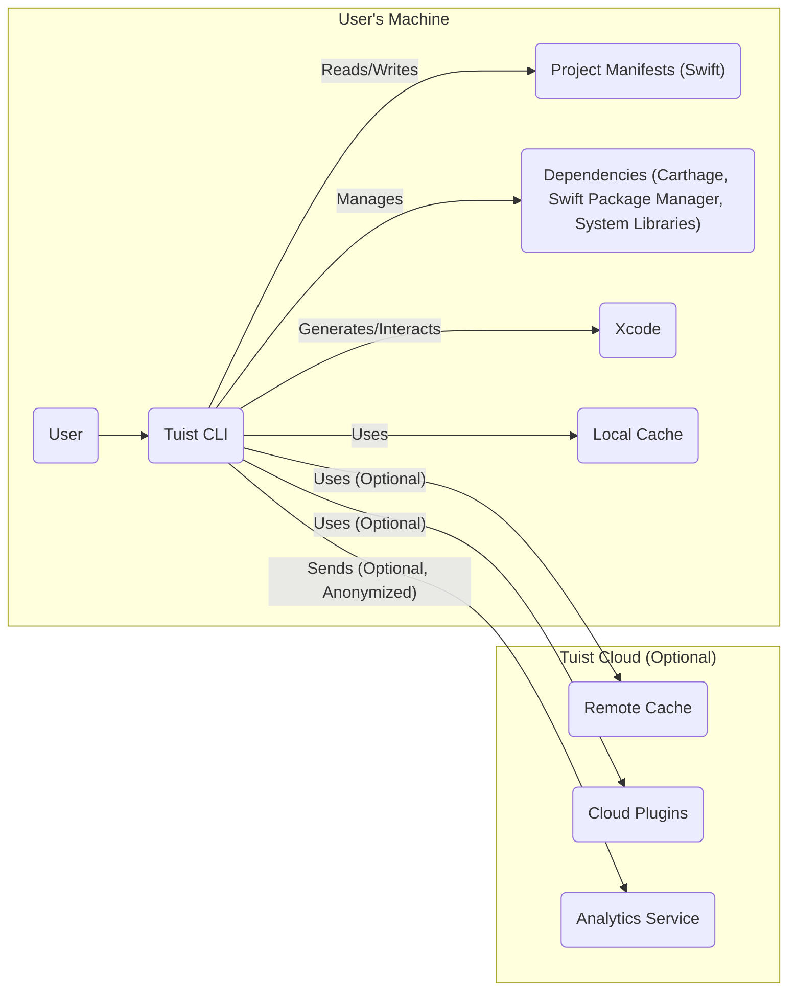
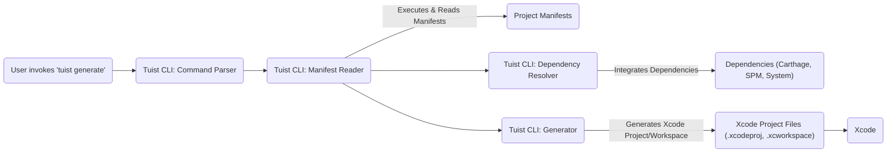
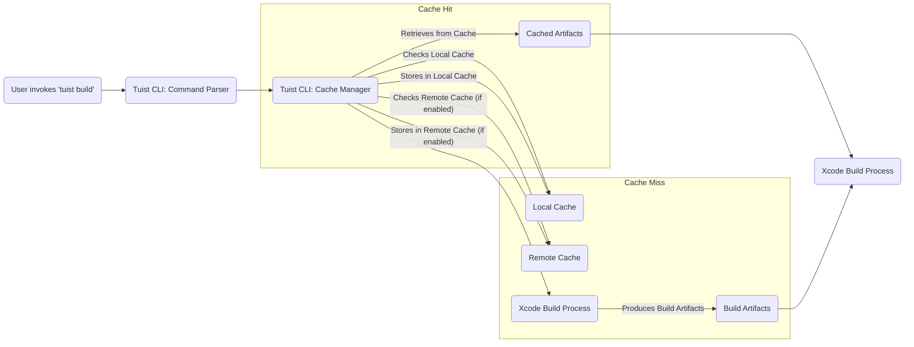
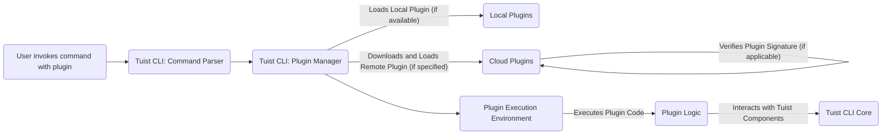

# Project Design Document: Tuist

**Version:** 1.1
**Date:** October 26, 2023
**Author:** AI Software Architect

## 1. Introduction

This document provides an enhanced design overview of Tuist, a command-line interface (CLI) tool meticulously engineered to generate, maintain, and interact with Xcode projects at scale. This revised document offers a more granular understanding of Tuist's architecture, components, and data flow, specifically tailored to serve as a robust foundation for subsequent threat modeling endeavors.

## 2. Goals and Objectives

The core objectives driving the development of Tuist are:

* **Scalability:** To facilitate the efficient management of expansive, modularized Xcode projects, accommodating growth and complexity.
* **Maintainability:** To champion a declarative paradigm for project definition, thereby minimizing manual Xcode project editing and the associated risk of merge conflicts.
* **Consistency:** To enforce uniform project settings and configurations across diverse developer environments and teams, ensuring predictability.
* **Automation:** To automate repetitive tasks such as project generation, dependency management, and code generation, freeing up developer time.
* **Extensibility:** To empower users to augment Tuist's inherent capabilities through the development and integration of plugins and custom scripts.
* **Performance:** To ensure that project generation and interaction are performed efficiently, minimizing build times and developer friction.

## 3. Target Audience

This document is specifically crafted for:

* Security engineers tasked with performing threat modeling and security assessments of the Tuist ecosystem.
* Developers actively contributing to the Tuist project, requiring a deep understanding of its architecture.
* DevOps engineers responsible for the seamless integration of Tuist into continuous integration and continuous delivery (CI/CD) pipelines.
* Individuals seeking a comprehensive and detailed understanding of Tuist's internal mechanisms and operational flow.

## 4. System Architecture

Tuist's architecture is centered around a powerful CLI tool that interacts with declarative manifest files and a suite of internal components to effectively manage Xcode projects.

### 4.1. High-Level Architecture Diagram

### 4.2. Component Description

* **User:** The software developer or automation system invoking the Tuist CLI to perform project management tasks.
* **Tuist CLI:** The central command-line interface, responsible for parsing user commands, interpreting project manifests, orchestrating internal components, and managing the overall workflow.
* **Project Manifests (Swift):**  Swift files (e.g., `Project.swift`, `Workspace.swift`, `Package.swift`) that declaratively define the structure, targets, dependencies (internal and external), settings, and code generation rules for Xcode projects and workspaces.
* **Dependencies (Carthage, Swift Package Manager, System Libraries):** External software libraries and frameworks managed by dependency management tools like Carthage and Swift Package Manager, as well as system-level libraries required by the project.
* **Xcode:** Apple's integrated development environment (IDE) which consumes the generated project and workspace files for building, running, debugging, and testing applications.
* **Local Cache:** A directory on the user's machine where Tuist stores cached build artifacts and derived data to accelerate subsequent builds and operations.
* **Remote Cache (Optional):** A remote storage service (e.g., AWS S3, Google Cloud Storage, Azure Blob Storage) used to share cached build artifacts across different machines and environments, significantly speeding up CI/CD pipelines.
* **Cloud Plugins (Optional):** Remotely hosted plugins that extend Tuist's functionality, offering features beyond the core capabilities.
* **Analytics Service (Optional):** A service that collects anonymized usage data to help the Tuist team understand how the tool is being used and identify areas for improvement.

### 4.3. Detailed Component Breakdown

* **Tuist CLI:**
    * **Command Parser:**  Analyzes and interprets user-provided commands and their associated arguments, directing the flow of execution.
    * **Manifest Reader:**  Parses the Swift-based manifest files, extracting the declarative project definitions and configurations. This involves executing Swift code, which introduces potential risks.
    * **Generator:**  Transforms the abstract manifest definitions into concrete Xcode project and workspace files (`.xcodeproj`, `.xcworkspace`), populating them with the specified structure and settings.
    * **Cache Manager:**  Orchestrates the caching of build artifacts, managing both the local cache and the interaction with the optional Remote Cache, including uploading and downloading artifacts.
    * **Plugin Manager:**  Discovers, loads, and executes both local and remote plugins, extending Tuist's functionality. This involves executing potentially untrusted code.
    * **Dependency Resolver:**  Integrates and manages project dependencies declared through Carthage, Swift Package Manager, and potentially system libraries.
    * **Code Generation Engine:** Executes code generation scripts and templates defined within the manifests, automating the creation of boilerplate code.
    * **Updater:**  Handles the process of updating the Tuist CLI to newer versions, potentially downloading and executing code from external sources.
    * **Analytics Client:**  Collects and transmits anonymized usage data to the Tuist analytics service (if enabled).

* **Project Manifests:**
    * **Project.swift:**  The primary manifest file defining a single Xcode project, encompassing its targets, dependencies, build settings, file groups, and code signing configurations.
    * **Workspace.swift:** Defines an Xcode workspace, aggregating multiple related projects and enabling shared schemes and settings.
    * **Package.swift:**  Used for defining Swift packages that can be integrated into Tuist-managed projects.
    * **Config.swift:**  Contains global configuration settings applicable to the entire project or workspace, influencing Tuist's behavior.
    * **Templates:** Reusable definitions and scripts for generating new components, files, or code snippets within the project, promoting consistency.
    * **Plugin.swift:** Defines local plugins that extend Tuist's functionality within the scope of a specific project.

* **Local Cache:**
    * **Storage:**  A file system directory on the user's machine storing cached build products, derived data, and potentially downloaded dependencies.
    * **Invalidation Logic:** Mechanisms to determine when cached artifacts are stale and need to be regenerated.

* **Remote Cache:**
    * **Storage:**  Backend object storage (e.g., AWS S3 buckets, Google Cloud Storage buckets, Azure Blob containers) for storing and retrieving cached build artifacts.
    * **Authentication/Authorization:**  Security mechanisms (e.g., API keys, access tokens, IAM roles) to control access to the cache and prevent unauthorized modifications.
    * **Metadata Storage:**  Stores metadata associated with cached artifacts, such as build settings, dependency versions, and timestamps, to ensure cache correctness.
    * **Transfer Protocol:** Typically HTTPS for secure transfer of cached artifacts.

* **Cloud Plugins:**
    * **Plugin Code:**  Executable code hosted on remote servers, extending Tuist's capabilities with custom commands and functionalities.
    * **Plugin Manifest:**  A file describing the plugin's purpose, author, version, required Tuist version, and any necessary permissions or dependencies.
    * **Distribution Mechanism:**  Methods for downloading and installing plugins, often involving Git repositories or direct downloads.

* **Analytics Service:**
    * **Data Collection:**  Receives anonymized usage data from Tuist CLI instances.
    * **Data Processing:**  Aggregates and analyzes the collected data to identify trends and areas for improvement.
    * **Storage:**  Stores the collected analytics data.

## 5. Data Flow

The typical data flow within Tuist involves the user initiating commands, which trigger the parsing of manifest files and the subsequent generation or manipulation of Xcode projects.

### 5.1. Project Generation Flow

### 5.2. Build Caching Flow (with Remote Cache)

### 5.3. Plugin Execution Flow

## 6. Security Considerations

This section provides a more detailed examination of potential security considerations for Tuist.

* **Manifest Injection Vulnerabilities:**
    * **Risk:** If an attacker gains write access to project manifest files, they could inject malicious Swift code that gets executed during manifest parsing, potentially leading to arbitrary code execution on the developer's machine or in the CI/CD environment.
    * **Mitigation:** Implement strict file system permissions for manifest files, enforce code review processes for manifest changes, and consider using tooling to detect potentially malicious code within manifests.
* **Supply Chain Attacks via Dependencies:**
    * **Risk:** Tuist relies on external dependency managers. If a malicious actor compromises a dependency hosted on Carthage or Swift Package Manager, this could introduce vulnerabilities into projects managed by Tuist.
    * **Mitigation:** Regularly update dependencies to patch known vulnerabilities, utilize dependency scanning tools to identify vulnerable dependencies, and consider using private dependency repositories with stricter controls. Employ techniques like Software Bill of Materials (SBOM) to track dependencies.
* **Remote Cache Security Breaches:**
    * **Risk:** Unauthorized access to the Remote Cache could allow attackers to inject compromised build artifacts. When other developers or CI/CD systems retrieve these poisoned artifacts, it could lead to the deployment of vulnerable or malicious software.
    * **Mitigation:** Implement robust authentication and authorization mechanisms for the Remote Cache, such as API keys with restricted permissions, IAM roles, or short-lived access tokens. Enforce HTTPS for all communication with the Remote Cache. Consider using content addressable storage for cached artifacts to ensure immutability.
* **Risks Associated with Cloud Plugins:**
    * **Risk:** Malicious Cloud Plugins, if not properly vetted, could execute arbitrary code on the user's machine with the privileges of the Tuist CLI process. This could lead to data exfiltration, system compromise, or other malicious activities.
    * **Mitigation:** Implement a strong plugin verification mechanism, including signature verification by trusted authorities. Consider sandboxing plugin execution to limit their access to system resources. Clearly communicate the risks associated with using third-party plugins and provide mechanisms for users to report suspicious plugins.
* **Security Implications of Local Plugins:**
    * **Risk:** Similar to Cloud Plugins, locally installed plugins from untrusted sources can pose a security risk by executing arbitrary code.
    * **Mitigation:** Educate users about the risks of running untrusted code. Implement mechanisms for users to review the code of local plugins before execution.
* **Insecure Secrets Management Practices:**
    * **Risk:** Developers might inadvertently hardcode sensitive information (API keys, passwords, certificates) within manifest files or code generation templates, which could then be exposed in version control or cached artifacts.
    * **Mitigation:** Strongly discourage hardcoding secrets. Promote the use of environment variables, dedicated secrets management tools (like HashiCorp Vault or AWS Secrets Manager), or secure keychains. Implement checks to prevent secrets from being stored in the cache.
* **Vulnerabilities in Tuist CLI Update Mechanism:**
    * **Risk:** If the Tuist CLI update process is compromised, attackers could distribute malicious versions of the CLI, potentially gaining control over developer machines.
    * **Mitigation:** Use secure channels (HTTPS) for downloading updates. Implement signature verification for downloaded updates to ensure their authenticity and integrity.
* **Code Generation Template Security:**
    * **Risk:** If code generation templates or scripts are compromised, they could introduce vulnerabilities (e.g., cross-site scripting vulnerabilities in generated web code) into the generated codebase.
    * **Mitigation:** Secure the storage and access to code generation templates and scripts. Implement code review processes for changes to these components. Sanitize inputs used in code generation to prevent injection attacks.
* **Insufficient Permissions and Access Control:**
    * **Risk:** Lax file system permissions on Tuist's configuration directories, cache directories, or plugin directories could allow unauthorized users or processes to modify critical files or execute malicious code.
    * **Mitigation:** Adhere to the principle of least privilege when configuring file system permissions. Regularly review and audit permissions.
* **Analytics Data Privacy:**
    * **Risk:** While the intent is to collect anonymized data, there's a potential risk of inadvertently collecting personally identifiable information or sensitive project details.
    * **Mitigation:** Implement strict data anonymization and pseudonymization techniques. Clearly document what data is collected and how it is used. Provide users with the option to opt out of analytics collection.

## 7. Deployment Considerations

Tuist is typically deployed as a command-line tool installed on individual developer workstations and within CI/CD environments.

* **Installation Methods:**  Common installation methods include package managers like Homebrew, dedicated tools like Mint, and manual downloads of pre-built binaries.
* **CI/CD Integration:**  Tuist commands are seamlessly integrated into CI/CD pipelines to automate project generation, dependency management, and building processes as part of the software delivery lifecycle.
* **Configuration:**  The primary means of configuring Tuist is through the declarative Swift manifest files residing within the project repository, allowing for version-controlled and reproducible project setups.

## 8. Future Considerations

* **Enhanced Plugin Security Framework:**  Developing a more robust framework for plugin security, including mandatory signature verification, fine-grained permission models, and isolated execution environments (sandboxing).
* **Integrated Secrets Management Capabilities:**  Exploring the integration of built-in features for securely managing secrets within Tuist, potentially leveraging secure enclaves or integration with existing secrets management providers.
* **Advanced Remote Cache Security Features:**  Investigating more sophisticated authentication and authorization mechanisms for the Remote Cache, such as mutual TLS or integration with cloud provider IAM systems.
* **Static Analysis Integration for Manifests:**  Integrating with static analysis tools to automatically identify potential security vulnerabilities or misconfigurations within the Swift manifest files before they are applied.
* **Formal Security Audits:**  Conducting regular formal security audits by independent security experts to identify and address potential vulnerabilities in the Tuist codebase and architecture.

This revised document provides a more in-depth and security-focused design overview of Tuist, intended to be a valuable resource for threat modeling and security assessments. It highlights potential security risks and suggests mitigation strategies to enhance the overall security posture of projects utilizing Tuist.