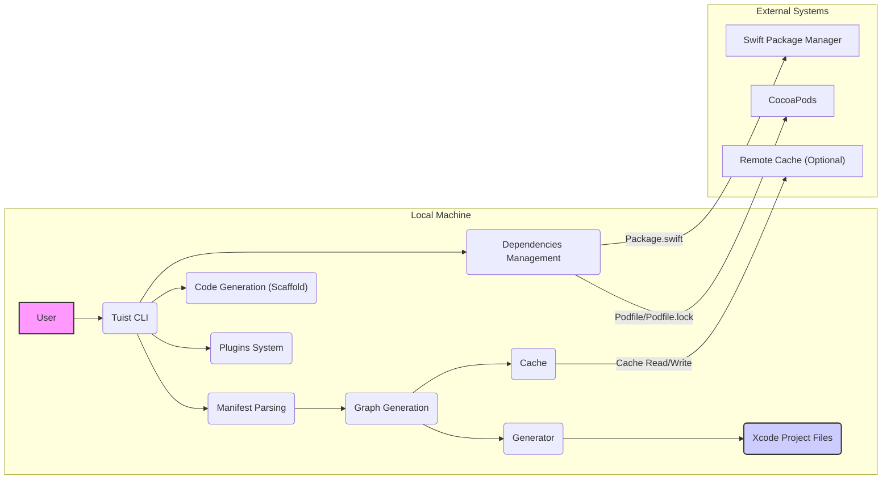

# Project Design Document: Tuist

**Version:** 1.1
**Date:** October 26, 2023
**Author:** AI Cloud & Security Architect

## 1. Introduction

This document provides an enhanced and more detailed architectural design of the Tuist project. It elaborates on the key components, their interactions, data flow, and potential security considerations. This document will serve as a robust foundation for subsequent threat modeling activities, enabling a deeper understanding of the system's attack surface.

### 1.1. Purpose

The primary purpose of this document is to provide a comprehensive and granular understanding of the Tuist project's architecture to facilitate effective and thorough threat modeling. It aims to clearly define the system boundaries, meticulously identify key components and their sub-components, and describe their interactions with a focus on potential security implications.

### 1.2. Scope

This document covers the core functionality of the Tuist CLI tool, focusing on its local execution, interaction with the file system, and integration with external tools. It includes detailed aspects related to project generation, management, code generation, dependency resolution, and plugin execution. While acknowledging potential cloud integrations, the primary focus remains on the client-side architecture and its immediate environment.

### 1.3. Target Audience

This document is intended for:

* Security engineers and architects responsible for performing detailed threat modeling and security assessments.
* Developers working on the Tuist project, requiring a deep understanding of its internal workings.
* DevOps engineers responsible for deploying, managing, and securing environments where Tuist is utilized.

## 2. Overview

Tuist is a sophisticated command-line interface (CLI) tool engineered to empower developers in managing complex iOS, macOS, watchOS, and tvOS projects. Its core mission is to enhance project maintainability, foster scalability, and optimize the developer experience by introducing a declarative project definition paradigm. Instead of direct manipulation within Xcode's project editor, developers define their projects using expressive Swift manifest files. Tuist then acts as a project generator, transforming these manifests into fully functional Xcode projects.

## 3. Architectural Design

The Tuist architecture comprises several interconnected components, each with specific responsibilities:

* **CLI Interface:**
    * **Responsibility:** Serves as the primary interaction point for users.
    * **Functionality:** Handles command-line argument parsing, validation, and routing commands to the appropriate core functionalities. Manages user input and output.
* **Manifest Parsing:**
    * **Responsibility:** Interprets the declarative project definitions.
    * **Functionality:** Reads and parses Swift manifest files (`Project.swift`, `Workspace.swift`, `Dependencies.swift`, etc.). Executes the Swift code within these manifests to extract project configuration.
* **Graph Generation:**
    * **Responsibility:** Creates an in-memory representation of the project structure.
    * **Functionality:** Builds a directed graph representing targets, dependencies (internal and external), and their relationships based on the parsed manifests. This graph is crucial for understanding project interdependencies.
* **Generator:**
    * **Responsibility:** Transforms the project graph into Xcode project files.
    * **Functionality:** Utilizes templates and logic to generate the `.xcodeproj` and `.xcworkspace` files, including build settings, schemes, and file references.
* **Cache:**
    * **Responsibility:** Optimizes performance by storing and reusing generated data.
    * **Functionality:** Stores generated project data, resolved dependencies, and potentially build products. Retrieves cached data to avoid redundant computations. Supports both local and potentially remote caching mechanisms.
* **Dependencies Management:**
    * **Responsibility:** Handles the integration of external libraries.
    * **Functionality:** Integrates with dependency managers like Swift Package Manager (SPM) by parsing `Package.swift` files and CocoaPods by parsing `Podfile` and `Podfile.lock`. Fetches and links external dependencies into the generated project.
* **Code Generation (Scaffold):**
    * **Responsibility:** Facilitates the creation of new project components.
    * **Functionality:** Generates boilerplate code, files, and directory structures based on predefined templates and user specifications.
* **Plugins System:**
    * **Responsibility:** Extends Tuist's core functionality.
    * **Functionality:** Allows developers to create and integrate custom plugins written in Swift. Plugins can hook into various stages of Tuist's execution to modify behavior or add new features.
* **Cloud Integration (Optional):**
    * **Responsibility:** Provides optional remote services.
    * **Functionality:** Enables features like remote caching of generated artifacts, potentially distributed builds, and collaborative project management.



## 4. Data Flow

The data flow within Tuist follows a structured sequence of operations:

1. **User Command Initiation:** The user executes a Tuist command via the CLI, providing necessary arguments and options.
2. **CLI Processing:** The Tuist CLI parses the command and its arguments, validating the input.
3. **Manifest Retrieval and Parsing:** Tuist locates and reads the Swift manifest files (`Project.swift`, `Workspace.swift`, etc.) within the project directory. The Manifest Parsing component executes the Swift code within these files to extract project configuration details.
4. **Project Graph Construction:** The Graph Generation component analyzes the parsed manifest data and constructs an in-memory representation of the project, including targets, dependencies, and their relationships.
5. **Dependency Resolution:**
    * If the manifests declare Swift Package Manager dependencies, Tuist interacts with SPM to resolve and potentially download the required packages, parsing `Package.swift` files.
    * If CocoaPods dependencies are declared, Tuist interacts with CocoaPods, parsing `Podfile` and `Podfile.lock` to integrate the necessary pods.
6. **Cache Lookup:** Tuist checks the Cache for previously generated project data or resolved dependencies.
7. **Project Generation (if cache miss):** If the necessary data is not in the cache, the Generator component uses the project graph and predefined templates to create the Xcode project files (`.xcodeproj`) and workspace files (`.xcworkspace`).
8. **Cache Population (if project generated):** The newly generated project data is stored in the Cache for future use.
9. **Xcode Project Files Output:** The generated Xcode project files are written to the file system.
10. **Plugin Execution (Conditional):** If plugins are configured for the current command or project, they are executed at appropriate stages, potentially interacting with the graph or the generation process.
11. **Code Generation (Optional):** If the user invokes the `scaffold` command, the Code Generation component uses templates and user-provided information to create new code files and project structures.

```mermaid
graph LR
    A["User Command"] --> B{"Tuist CLI"};
    B --> C{"Parse Manifests"};
    C --> D{"Build Project Graph"};
    D --> E{"Resolve Dependencies"};
    E -- "SPM Resolution" --> F["Swift Package Manager"];
    E -- "CocoaPods Resolution" --> G["CocoaPods"];
    D --> H{"Check Cache"};
    H -- "Cache Hit" --> I["Retrieve Cached Data"];
    H -- "Cache Miss" --> J{"Generate Xcode Project"};
    J --> K{"Write Xcode Project Files"};
    J --> H;  % Update Cache after generation
    I --> K;
    B --> L{"Execute Plugins (Conditional)"};
    B --> M{"Code Generation (Optional)"};
    style A fill:#f9f,stroke:#333,stroke-width:2px
    style K fill:#ccf,stroke:#333,stroke-width:2px
```

## 5. Security Considerations

This section details potential security considerations, categorized for clarity, based on the architectural design. These points will be thoroughly investigated during the threat modeling process.

* **Manifest Execution Vulnerabilities:**
    * **Threat:** Malicious code injection within manifest files. Since manifests are Swift code, compromised files could execute arbitrary commands during parsing.
    * **Impact:** Potential for arbitrary code execution on the developer's machine.
* **Dependency Management Risks:**
    * **Threat:** Introduction of vulnerabilities through compromised or malicious dependencies fetched by SPM or CocoaPods.
    * **Impact:** Security flaws in the generated Xcode project, potentially leading to application vulnerabilities.
    * **Threat:** Dependency confusion attacks where a malicious package with the same name as an internal one is introduced.
    * **Impact:** Inclusion of malicious code into the project.
* **Plugin Security Concerns:**
    * **Threat:** Malicious plugins executing arbitrary code within the Tuist process.
    * **Impact:** Full compromise of the developer's environment or the generated project.
    * **Threat:** Plugins accessing sensitive information or manipulating the file system in unintended ways.
    * **Impact:** Data breaches or project corruption.
* **Cache-Related Threats:**
    * **Threat:** Cache poisoning, where malicious or incorrect data is introduced into the cache.
    * **Impact:** Generation of flawed or malicious Xcode projects for multiple users.
    * **Threat:** Unauthorized access to the cache, potentially revealing project configurations or sensitive information.
    * **Impact:** Information disclosure.
* **Local File System Interaction Risks:**
    * **Threat:** Vulnerabilities arising from improper handling of file paths, permissions, or file contents.
    * **Impact:** Unauthorized file access, modification, or deletion.
    * **Threat:** Symbolic link attacks where Tuist might be tricked into accessing files outside the intended project scope.
    * **Impact:** Access to sensitive data or system files.
* **Remote Code Execution via Plugins:**
    * **Threat:** Plugins that fetch and execute code from remote sources without proper verification.
    * **Impact:** Introduction of arbitrary malicious code.
* **Secrets Management Weaknesses:**
    * **Threat:** Accidental inclusion of sensitive information (API keys, tokens, passwords) within manifest files or plugin code.
    * **Impact:** Exposure of credentials leading to unauthorized access.
* **Supply Chain Security of Tuist Itself:**
    * **Threat:** Compromise of the Tuist distribution channels or build process.
    * **Impact:** Users downloading and executing a backdoored version of Tuist.
* **Cloud Integration Security Issues (If Enabled):**
    * **Threat:** Vulnerabilities in authentication and authorization mechanisms for accessing remote caches or other cloud services.
    * **Impact:** Unauthorized access to cached data or cloud resources.
    * **Threat:** Data breaches or leaks of project information stored in the cloud.
    * **Impact:** Confidentiality violations.
    * **Threat:** Man-in-the-middle attacks during communication with cloud services.
    * **Impact:** Compromise of data in transit.

## 6. Deployment

Tuist is typically deployed as a command-line tool on developer workstations and within CI/CD environments. Common installation methods include:

* **Package Managers:**
    * **Homebrew (macOS):** A widely used package manager for macOS, simplifying installation and updates.
    * **Mint (Swift Package Manager based):** Installation and management using the Swift Package Manager.
* **Binary Releases:** Downloading pre-compiled binaries from the official Tuist GitHub releases. This requires manual management of updates.
* **CI/CD Integration:** Tuist is often included as a dependency within CI/CD pipelines to automate Xcode project generation as part of the build process. This ensures consistent project setup across different environments. The installation method within CI/CD might vary depending on the platform (e.g., using Docker images with Tuist pre-installed).

## 7. Trust Boundaries

Identifying trust boundaries is crucial for threat modeling. In the context of Tuist:

* **Boundary 1: User's Local Machine:** This is the primary trust boundary. Tuist operates within the user's environment with the permissions granted to the user.
* **Boundary 2: External Dependency Managers (SPM, CocoaPods):** Tuist trusts these tools to provide legitimate and secure dependencies. However, vulnerabilities within these systems can impact Tuist.
* **Boundary 3: Plugin Execution Environment:** Plugins execute within the Tuist process, blurring the trust boundary. Malicious plugins can gain the same level of access as Tuist itself.
* **Boundary 4: Remote Cache (Optional):** If remote caching is enabled, this introduces a new trust boundary. Tuist needs to trust the remote cache service for data integrity and security.

## 8. Future Considerations

Anticipated future enhancements that could influence the architecture and security landscape include:

* **Enhanced Cloud Integration:** Expanding cloud features for more robust remote caching, distributed builds, and centralized project management, potentially introducing new trust boundaries and security considerations.
* **Web-Based User Interface:** A web UI for project management and configuration could simplify usage but also introduce web application security concerns.
* **Granular Plugin API:**  A more detailed plugin API allowing finer-grained control over Tuist's internals, potentially increasing the attack surface if not carefully designed.
* **Integrated Security Scanning:** Incorporating tools to automatically scan manifests and generated projects for known vulnerabilities, improving the overall security posture.
* **Stricter Plugin Sandboxing:** Implementing mechanisms to isolate plugin execution and limit their access to system resources, mitigating the risks associated with malicious plugins.

This enhanced document provides a more granular and detailed understanding of the Tuist project's architecture, explicitly highlighting potential security considerations and trust boundaries. This information will be invaluable for conducting a comprehensive and effective threat modeling exercise.