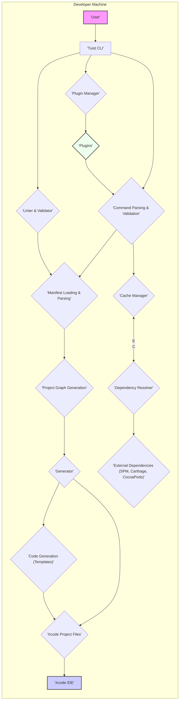
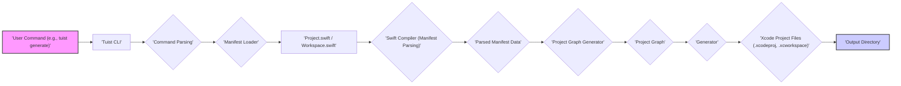

# Project Design Document: Tuist - Xcode Project Generation Tool

**Version:** 1.1
**Date:** October 27, 2023
**Author:** AI Software Architect

## 1. Project Overview

### 1.1. Project Name
Tuist

### 1.2. Project Description
Tuist is an open-source, command-line tool designed to revolutionize Xcode project management, particularly for large and modular projects. It shifts the paradigm from manual `.xcodeproj` and `.xcworkspace` file management to declarative project definition using Swift manifests. By defining project structures and configurations as code, Tuist enhances project maintainability, scalability, and consistency across development teams. Key features include:

- **Declarative Project Definition:** Projects are defined using Swift code, enabling programmatic and reusable configurations, version control, and easier collaboration.
- **Project Generation:** Tuist generates Xcode projects from these Swift manifests, ensuring consistent project setups across different environments and reducing manual configuration errors that can lead to inconsistencies and build issues.
- **Dependency Management Integration:** Seamlessly integrates with industry-standard dependency managers like Swift Package Manager (SPM), Carthage, and CocoaPods, simplifying dependency management and ensuring consistent dependency resolution.
- **Code Generation & Templating:** Supports custom code generation and project scaffolding through templates, automating repetitive tasks and promoting project standardization.
- **Project Linting & Validation:** Offers built-in linting and validation tools to enforce project configuration best practices, identify potential issues early, and maintain project health.
- **Caching Mechanisms:** Implements intelligent caching mechanisms to significantly speed up project generation, dependency resolution, and other operations, improving developer productivity.
- **Extensibility and Plugins:** Designed to be extensible through plugins, allowing developers to customize and extend Tuist's functionality to meet specific project needs.

### 1.3. Project Goals
- Radically simplify and standardize Xcode project management workflows.
- Dramatically improve the scalability and maintainability of large iOS and macOS projects by promoting modularity and code-based configuration.
- Significantly reduce merge conflicts and eliminate inconsistencies commonly found in manually managed project files.
- Enable faster project setup and streamline onboarding for new team members by providing a clear and code-defined project structure.
- Enhance project build times through optimized project structures, efficient dependency management, and intelligent caching.
- Foster a more collaborative and consistent development environment across teams working on Xcode projects.

### 1.4. Target Audience
- iOS and macOS developers working on projects of all sizes, with a particular focus on medium to large-scale and modular projects.
- Development teams seeking to adopt infrastructure-as-code principles for their Xcode projects to improve consistency and collaboration.
- Organizations aiming to standardize their Xcode project management practices across multiple teams and projects to ensure maintainability and reduce technical debt.
- Developers interested in leveraging code generation and templating to automate project setup and reduce repetitive tasks.

## 2. Architecture Overview

### 2.1. System Architecture Diagram

### 2.2. Component Description

- **User:** The developer who interacts with Tuist through the command-line interface to manage Xcode projects. The user initiates commands, defines project manifests, and consumes the generated Xcode projects.
- **Tuist CLI:** The central command-line interface application. It serves as the entry point for all Tuist operations, receiving user commands, orchestrating different components, and providing feedback to the user. It handles argument parsing, command routing, and error reporting.
- **Command Parsing & Validation:** This component is responsible for interpreting user commands entered into the CLI. It parses the command and its arguments, validates them against the defined command syntax and expected inputs, and then routes the validated command to the appropriate handler within Tuist. This ensures that only valid commands are processed, preventing unexpected behavior.
- **Manifest Loading & Parsing:** This crucial component loads and parses the Swift manifest files (e.g., `Project.swift`, `Workspace.swift`, `Config.swift`) that declaratively define the project structure, targets, settings, and dependencies. It leverages the Swift compiler (or a Swift evaluation engine) to execute the Swift code within these manifest files and extract the project configuration data into an internal representation.
- **Project Graph Generation:**  This component takes the parsed manifest data as input and constructs an in-memory representation of the entire project as a graph. This project graph models the relationships between targets, dependencies (internal and external), files, settings, and other project components. It provides a structured and interconnected view of the project, which is used by other components for generation, linting, and caching.
- **Generator:** The core component responsible for translating the abstract project graph into concrete Xcode project files (`.xcodeproj`, `.xcworkspace`) and supporting files. It iterates through the project graph and generates the necessary XML files and directory structures that Xcode understands. This involves mapping Tuist's declarative definitions to Xcode's project file format, handling various Xcode project settings, build configurations, and target dependencies.
- **Xcode Project Files:** These are the output of Tuist's generation process. They are the standard Xcode project and workspace files (`.xcodeproj`, `.xcworkspace`) that developers can open and use within the Xcode IDE to build, run, debug, and test their applications. Tuist aims to generate projects that are functionally equivalent to, or better than, manually created projects, but with improved consistency and maintainability.
- **Cache Manager:** This component implements caching mechanisms to optimize Tuist's performance. It caches various aspects of the project generation process, including parsed manifests, resolved dependencies, and even generated Xcode projects themselves. By reusing cached data when possible, the Cache Manager significantly speeds up subsequent Tuist executions, especially for large projects or when only minor changes have been made.
- **Dependency Resolver:**  Responsible for resolving both internal and external project dependencies. For external dependencies, it integrates with dependency managers like Swift Package Manager, Carthage, and CocoaPods. It reads dependency specifications from the manifests, interacts with the respective dependency managers to fetch and resolve dependencies, and then integrates these dependencies into the generated Xcode project (e.g., by adding frameworks, libraries, or source files to targets).
- **External Dependencies (SPM, Carthage, CocoaPods):** These represent the external dependency management tools that Tuist integrates with. Tuist leverages these tools to manage third-party libraries and frameworks, allowing projects to depend on external code while maintaining a consistent and reproducible build environment.
- **Code Generation (Templates):** This component provides functionality for generating code files, project components, or even entire modules based on predefined templates. Templates can be defined within the project or as external plugins. This allows for automating repetitive code creation tasks, enforcing coding standards, and scaffolding new features or modules quickly.
- **Xcode IDE:** Apple's Integrated Development Environment (Xcode) is the primary tool used by developers to work with the Xcode projects generated by Tuist. Developers use Xcode to build, run, debug, test, and deploy applications defined and generated by Tuist.
- **Linter & Validator:** This component is responsible for analyzing the project manifests and the generated project graph to identify potential issues, enforce best practices, and validate project configurations. It can perform checks for dependency cycles, naming conventions, code style, and other project-specific rules. The Linter & Validator helps maintain project quality and consistency.
- **Plugin Manager:** Tuist is designed to be extensible through plugins. The Plugin Manager component handles the discovery, loading, and management of Tuist plugins. Plugins can extend Tuist's functionality by adding new commands, generators, linters, or modifying existing behavior. This allows developers to customize Tuist to fit their specific project needs and workflows.
- **Plugins:** These are external modules that extend Tuist's functionality. Plugins can be developed and distributed separately from Tuist core and can provide custom commands, generators, linters, or modify Tuist's behavior. Plugins enhance Tuist's flexibility and adaptability.

## 3. Data Flow

### 3.1. Project Generation Data Flow Diagram

### 3.2. Data Flow Description

1. **User Command Initiation:** The developer starts the project generation process by entering a Tuist command, such as `tuist generate`, in the command-line interface. This command signals Tuist to generate Xcode project files based on the project's manifest definitions.
2. **Tuist CLI Reception:** The Tuist CLI receives the user command as input. This is the initial point of interaction with the Tuist tool.
3. **Command Parsing and Validation:** The CLI passes the command to the Command Parsing component. This component analyzes the command string, breaks it down into its constituent parts (command name, arguments, options), and validates it against the expected command syntax and rules.
4. **Manifest Loader Invocation:** If the command is valid and requires project generation (like `tuist generate`), the Command Parsing component invokes the Manifest Loader component.
5. **Manifest File Location and Loading:** The Manifest Loader is responsible for locating and loading the project manifest files. It typically searches for files named `Project.swift`, `Workspace.swift`, and `Config.swift` in the current directory and its subdirectories.
6. **Swift Compiler Execution (Manifest Parsing):** The Manifest Loader passes the located manifest files to the Swift Compiler (or a Swift evaluation engine). The Swift Compiler executes the Swift code within these manifest files. This execution interprets the declarative project definitions written in Swift.
7. **Parsed Manifest Data Extraction:** As the Swift Compiler executes the manifest files, it extracts the project configuration data. This data includes information about targets, dependencies, settings, files, and other project aspects defined in the Swift code. The output is structured data representing the project's configuration.
8. **Project Graph Generation:** The Parsed Manifest Data is then fed into the Project Graph Generator. This component takes the structured data and constructs an in-memory graph representation of the entire project. The graph represents the relationships and dependencies between all project elements.
9. **Project Graph Creation:** The Project Graph Generator builds the Project Graph. This graph is a central data structure that holds a complete and interconnected model of the project, ready for further processing.
10. **Generator Invocation:** Once the Project Graph is built, the Generator component is invoked.
11. **Xcode Project Files Generation:** The Generator takes the Project Graph as input and traverses it to generate the Xcode project files. It translates the abstract project representation in the graph into the concrete XML-based format of `.xcodeproj` and `.xcworkspace` files. This includes creating project settings, target configurations, file references, and dependency links within the Xcode project files.
12. **Output to Directory:** Finally, the generated Xcode Project Files (`.xcodeproj`, `.xcworkspace`) are written to the specified output directory, which is usually the project's root directory or a designated output folder. The project generation process is now complete, and the developer can open and use the generated Xcode project in Xcode IDE.

## 4. Key Components in Detail

### 4.1. Manifest Loading and Parsing

- **Functionality:**  Locates, loads, and parses Swift manifest files (`Project.swift`, `Workspace.swift`, `Config.swift`, etc.). Executes the Swift code within these files using the Swift compiler (or a Swift evaluation engine) to extract project configuration data. Handles potential errors during file loading and Swift code execution.
- **Technology:** Swift compiler/evaluation engine, File system access (read operations).
- **Security Considerations:**
    - **Threat:** **Malicious Manifest Execution (Code Injection):** Manifest files contain Swift code that is executed by Tuist. If a malicious actor can inject arbitrary Swift code into a manifest file (e.g., through a compromised repository or supply chain attack), this code will be executed with the privileges of the user running Tuist. This could lead to arbitrary code execution, data exfiltration, or system compromise.
        - **Mitigation:**
            - **Input Validation (Manifest Structure):**  While full code validation is impossible, Tuist could perform basic structural validation of manifest files to detect obvious anomalies.
            - **Sandboxing/Isolation (Manifest Execution):** Explore sandboxing or process isolation techniques to limit the capabilities of the Swift execution environment during manifest parsing. This could restrict file system access, network access, and other potentially dangerous operations.
            - **Code Review and Auditing (Manifests):** Encourage developers to carefully review and audit manifest files, especially those from external sources or contributions.
            - **Principle of Least Privilege (Tuist Execution):**  Advise users to run Tuist with the minimum necessary privileges to limit the impact of potential vulnerabilities.
    - **Threat:** **Manifest File Tampering (Integrity):** If manifest files are tampered with after being created but before being parsed by Tuist, this could lead to unexpected or malicious project configurations being generated.
        - **Mitigation:**
            - **File Integrity Checks (Checksums/Signatures):**  Consider using file checksums or digital signatures to verify the integrity of manifest files, especially in collaborative environments or when manifests are stored in version control.
            - **Secure File Storage:** Ensure manifest files are stored in secure locations with appropriate access controls to prevent unauthorized modification.
    - **Threat:** **Dependency on Swift Compiler Vulnerabilities:** Tuist relies on the Swift compiler for manifest parsing. Vulnerabilities in the Swift compiler itself could potentially be exploited through crafted manifest files.
        - **Mitigation:**
            - **Keep Swift Compiler Updated:**  Ensure Tuist is compatible with and tested against the latest stable and secure versions of the Swift compiler.
            - **Monitor Swift Compiler Security Advisories:**  Stay informed about security advisories related to the Swift compiler and take appropriate action if vulnerabilities are discovered that could impact Tuist.

### 4.2. Project Generator

- **Functionality:** Translates the project graph into Xcode project files (`.xcodeproj`, `.xcworkspace`). Handles Xcode project file format specifics, project settings, target configurations, build settings, file references, and dependency links.
- **Technology:** File system operations (write operations), Xcode project file format specifications (XML-based).
- **Security Considerations:**
    - **Threat:** **Malformed Xcode Project Generation (Project Corruption):**  Errors or vulnerabilities in the project generation logic could lead to the creation of malformed or corrupted Xcode project files that are unusable or exhibit unexpected behavior in Xcode.
        - **Mitigation:**
            - **Robust Generation Logic & Testing:**  Implement robust and well-tested project generation logic. Employ thorough unit and integration testing to ensure the generated Xcode projects are valid and function as expected.
            - **Xcode Project Validation (Post-Generation):**  Consider adding a post-generation validation step to check the generated Xcode project files for common errors or inconsistencies using Xcode's built-in validation tools or external linters.
    - **Threat:** **Insecure Xcode Project Settings (Misconfiguration):**  The generator might inadvertently or maliciously configure Xcode project settings in a way that introduces security vulnerabilities into the built application (e.g., disabling security features, insecure build settings, exposing sensitive information).
        - **Mitigation:**
            - **Secure Defaults for Xcode Settings:**  Use secure default values for Xcode project settings. Avoid enabling insecure options unless explicitly required and justified.
            - **Security-Focused Project Templates:**  Provide secure project templates that incorporate security best practices in Xcode project settings.
            - **Linting for Insecure Settings:**  Implement linting rules to detect and flag potentially insecure Xcode project settings in the generated projects.
    - **Threat:** **Output File Handling Vulnerabilities (File Overwrite/Permissions):**  Incorrect file handling during project generation could lead to vulnerabilities such as unintended file overwrites, insecure file permissions on generated files, or creation of files in unexpected locations.
        - **Mitigation:**
            - **Secure File System Operations:**  Use secure file system APIs and practices to prevent file overwrite vulnerabilities and ensure correct file permissions are set on generated files.
            - **Output Directory Validation:**  Validate the output directory to ensure it is a safe and expected location. Prevent writing generated files to system directories or other sensitive locations without explicit user confirmation.

### 4.3. Dependency Resolver

- **Functionality:** Resolves project dependencies, both internal (within the project) and external (using SPM, Carthage, CocoaPods). Interacts with external dependency managers, downloads dependencies, and integrates them into the generated Xcode project.
- **Technology:** Integration with SPM, Carthage, CocoaPods command-line tools/APIs, Network access (for downloading dependencies), File system access (for dependency caching and integration).
- **Security Considerations:**
    - **Threat:** **Dependency Source Compromise (Supply Chain Attack):**  Tuist relies on external dependency sources (SPM repositories, Carthage repositories, CocoaPods repositories). If these sources are compromised, malicious dependencies could be introduced into the project.
        - **Mitigation:**
            - **Dependency Pinning/Locking:**  Encourage and facilitate dependency pinning or locking to ensure consistent dependency versions are used and to mitigate against malicious updates.
            - **Dependency Source Verification (HTTPS, Signatures):**  Use HTTPS for all dependency downloads to ensure communication security. Where possible, verify dependency integrity using checksums, digital signatures, or other verification mechanisms provided by dependency managers.
            - **Dependency Auditing Tools:**  Integrate with or recommend dependency auditing tools that can scan project dependencies for known vulnerabilities.
    - **Threat:** **Dependency Download Vulnerabilities (Man-in-the-Middle):**  If dependency downloads are not secured (e.g., using HTTP instead of HTTPS), they could be vulnerable to man-in-the-middle attacks, where malicious actors intercept and replace legitimate dependencies with compromised ones.
        - **Mitigation:**
            - **Enforce HTTPS for Dependency Downloads:**  Strictly enforce the use of HTTPS for all dependency downloads to prevent man-in-the-middle attacks.
            - **Certificate Pinning (for critical dependencies):**  Consider certificate pinning for highly critical dependencies to further enhance download security.
    - **Threat:** **Dependency Confusion/Substitution Attacks:**  Attackers might attempt to introduce malicious dependencies with names similar to legitimate ones, hoping that developers will mistakenly include them in their projects.
        - **Mitigation:**
            - **Dependency Namespace Management:**  Encourage the use of clear and unambiguous dependency namespaces to reduce the risk of dependency confusion.
            - **Repository Whitelisting/Blacklisting:**  Consider allowing users to whitelist or blacklist trusted dependency repositories to control the sources from which dependencies are allowed to be downloaded.
            - **Dependency Review Process:**  Implement a dependency review process to carefully examine and vet all external dependencies before they are incorporated into the project.

### 4.4. Cache Manager

- **Functionality:** Implements caching of generated projects, resolved dependencies, parsed manifests, and other intermediate results to speed up Tuist operations. Manages cache storage, retrieval, and invalidation.
- **Technology:** File system storage (cache directory), Caching algorithms (e.g., key-based caching, time-based invalidation).
- **Security Considerations:**
    - **Threat:** **Cache Poisoning:**  If an attacker can inject malicious data into the Tuist cache, subsequent Tuist operations might use this poisoned cache data, leading to the generation of compromised Xcode projects or other unexpected behavior.
        - **Mitigation:**
            - **Cache Integrity Protection (Checksums/Signatures):**  Protect cached data integrity by using checksums or digital signatures to verify that cached data has not been tampered with.
            - **Cache Access Controls:**  Restrict access to the cache directory to prevent unauthorized modification of cached data. Use appropriate file system permissions.
            - **Cache Invalidation Mechanisms:**  Implement robust cache invalidation mechanisms to ensure that outdated or potentially compromised cached data is invalidated and refreshed when necessary.
    - **Threat:** **Cache Data Leakage (Information Disclosure):**  If the cache is not stored securely, sensitive information that might be present in cached data (e.g., project configurations, dependency information) could be exposed to unauthorized users.
        - **Mitigation:**
            - **Secure Cache Storage Location:**  Store the cache in a secure location with appropriate file system permissions to prevent unauthorized access. Consider encrypting the cache data at rest if it contains highly sensitive information.
            - **Principle of Least Privilege (Cache Access):**  Ensure that only Tuist and authorized processes have access to the cache directory.
    - **Threat:** **Cache Exhaustion/Denial of Service:**  An attacker might attempt to fill up the cache with a large amount of data, potentially leading to disk space exhaustion and denial of service for Tuist operations.
        - **Mitigation:**
            - **Cache Size Limits and Eviction Policies:**  Implement cache size limits and eviction policies (e.g., LRU - Least Recently Used) to prevent the cache from growing indefinitely and consuming excessive disk space.
            - **Cache Monitoring and Management Tools:**  Provide tools or mechanisms for users to monitor cache usage and manage the cache (e.g., clear cache, configure cache size limits).

### 4.5. Command Line Interface (CLI)

- **Functionality:** Provides the user interface for interacting with Tuist. Parses user commands, validates input, invokes Tuist components, and displays output to the user.
- **Technology:** Command-line argument parsing libraries, Standard input/output (stdin/stdout/stderr).
- **Security Considerations:**
    - **Threat:** **Command Injection:**  If the CLI does not properly sanitize user-provided input before using it in system commands or shell executions, it could be vulnerable to command injection attacks. Attackers could inject malicious commands into Tuist commands, leading to arbitrary code execution on the user's machine.
        - **Mitigation:**
            - **Input Sanitization and Validation:**  Thoroughly sanitize and validate all user-provided input to the CLI to prevent command injection vulnerabilities. Use parameterized commands or safe APIs for system interactions instead of directly constructing shell commands from user input.
            - **Principle of Least Privilege (CLI Execution):**  Run the Tuist CLI with the minimum necessary privileges. Avoid running it as root or with elevated privileges unless absolutely required and justified.
    - **Threat:** **Information Disclosure through CLI Output:**  Error messages, verbose output, or debug logs from the CLI might inadvertently disclose sensitive information, such as file paths, configuration details, or internal system information, to unauthorized users.
        - **Mitigation:**
            - **Secure Error Handling and Logging:**  Implement secure error handling and logging practices. Avoid displaying sensitive information in error messages or verbose output. Log sensitive information securely and only when necessary for debugging or auditing purposes.
            - **Output Sanitization:**  Sanitize CLI output to remove or mask any potentially sensitive information before displaying it to the user.
    - **Threat:** **Denial of Service through CLI Input:**  Maliciously crafted CLI input or excessively long commands could potentially cause the CLI to consume excessive resources (CPU, memory) or crash, leading to a denial of service.
        - **Mitigation:**
            - **Input Length Limits and Validation:**  Implement input length limits and validation rules to prevent excessively long or malformed commands from being processed.
            - **Resource Limits (CLI Process):**  Consider setting resource limits (e.g., CPU time, memory usage) for the Tuist CLI process to prevent it from consuming excessive resources and impacting system stability.

## 5. Technology Stack

- **Programming Language:** Swift (primarily)
- **Build System:** Swift Package Manager (for building Tuist itself)
- **Dependency Management:** Swift Package Manager, Carthage, CocoaPods (for project dependency integration)
- **Operating Systems:** macOS (primary target), Linux (with potential support and ongoing improvements)
- **Xcode:** Xcode project file format (`.xcodeproj`, `.xcworkspace`), Xcode command-line tools (e.g., `xcodegen`, `xcodebuild` - potentially used indirectly or for validation)
- **Templating Engine:** Potentially a Swift-based templating engine or a custom implementation for code generation.
- **Caching Mechanism:** File system-based caching, potentially using Swift's `FileManager` APIs and custom caching logic.

## 6. Deployment Model

- **Installation:**
    - **Homebrew (macOS):** Recommended installation method for macOS users. `brew install tuist`.
    - **Binary Releases (GitHub):** Download pre-compiled binary releases from Tuist's GitHub releases page.
    - **Building from Source:** Developers can build Tuist from source using Swift Package Manager.
- **Execution Environment:**
    - **Local Developer Machines:** Tuist is designed to run locally on developer machines (macOS and Linux).
    - **Command-Line Tool:** Executed as a command-line tool from the terminal.
- **Usage:**
    - **Project Directory:** Developers navigate to their project directory in the terminal and execute `tuist` commands.
    - **Manifest-Driven Workflow:** Developers define their Xcode projects using Swift manifests and use Tuist commands to generate, lint, and manage these projects.
- **Integration:**
    - **Xcode IDE Integration:** Generates standard Xcode projects that are fully compatible with Xcode IDE. Developers use Xcode to build, run, debug, and test applications generated by Tuist.
    - **CI/CD Integration:** Tuist can be integrated into CI/CD pipelines to automate project generation and validation as part of the build and deployment process.

## 7. Security Considerations (Detailed and Threat Modeling Focused)

This section expands on the initial security considerations and provides a more threat modeling focused perspective, aligning with the detailed component analysis in Section 4.

- **Manifest Execution Security (Threat: Code Injection, Integrity):**
    - **Threat Model Input:** Maliciously crafted or tampered manifest files. Compromised repositories or supply chain.
    - **Threats:** Code injection through manifest execution, manifest file tampering leading to unexpected project configurations.
    - **Mitigations (Threat Modeling Perspective):**
        - **Input Validation:** Implement structural validation of manifests (limited effectiveness against sophisticated attacks).
        - **Sandboxing/Isolation:** Explore sandboxing technologies to restrict manifest execution environment (complex implementation).
        - **Code Review & Auditing:** Emphasize developer responsibility for manifest security.
        - **File Integrity Checks:** Consider checksums/signatures for manifest files (adds complexity).
        - **Principle of Least Privilege:** Run Tuist with minimal privileges.
- **Project Generator Security (Threat: Malformed Projects, Insecure Settings, File Handling):**
    - **Threat Model Input:** Flawed generation logic, malicious templates, incorrect output directory configurations.
    - **Threats:** Generation of malformed Xcode projects, insecure Xcode project settings, file overwrite/permission vulnerabilities.
    - **Mitigations (Threat Modeling Perspective):**
        - **Robust Testing:** Rigorous unit and integration testing of generation logic.
        - **Xcode Project Validation:** Post-generation validation using Xcode tools.
        - **Secure Defaults & Templates:** Prioritize secure defaults and provide secure project templates.
        - **Linting for Settings:** Implement linting rules for insecure Xcode settings.
        - **Secure File Operations:** Use safe file system APIs and validate output directories.
- **Dependency Resolver Security (Threat: Supply Chain Attacks, MITM, Dependency Confusion):**
    - **Threat Model Input:** Compromised dependency repositories, insecure network connections, dependency name squatting.
    - **Threats:** Supply chain attacks through malicious dependencies, man-in-the-middle attacks during dependency downloads, dependency confusion attacks.
    - **Mitigations (Threat Modeling Perspective):**
        - **Dependency Pinning/Locking:** Essential for supply chain security and reproducibility.
        - **HTTPS Enforcement:** Mandatory for dependency downloads.
        - **Dependency Source Verification:** Implement checksum/signature verification where possible.
        - **Dependency Auditing:** Integrate with or recommend dependency auditing tools.
        - **Repository Whitelisting:** Allow users to control trusted dependency sources.
        - **Dependency Review Process:** Encourage manual review of dependencies.
- **Cache Manager Security (Threat: Cache Poisoning, Data Leakage, DoS):**
    - **Threat Model Input:** Unauthorized access to cache storage, vulnerabilities in cache management logic, excessive cache usage.
    - **Threats:** Cache poisoning, leakage of sensitive data from cache, denial of service through cache exhaustion.
    - **Mitigations (Threat Modeling Perspective):**
        - **Cache Integrity Protection:** Checksums/signatures for cached data.
        - **Cache Access Controls:** Restrict access to cache directory using file permissions.
        - **Secure Cache Storage:** Store cache in secure location, consider encryption.
        - **Cache Invalidation:** Robust invalidation mechanisms.
        - **Cache Size Limits & Eviction:** Implement limits and eviction policies.
        - **Cache Monitoring:** Provide tools for monitoring and managing cache.
- **CLI Security (Threat: Command Injection, Information Disclosure, DoS):**
    - **Threat Model Input:** Maliciously crafted CLI input, verbose output settings, unhandled errors.
    - **Threats:** Command injection vulnerabilities, information disclosure through CLI output, denial of service through CLI input.
    - **Mitigations (Threat Modeling Perspective):**
        - **Input Sanitization & Validation:** Critical for preventing command injection.
        - **Secure Error Handling & Logging:** Avoid disclosing sensitive information in output.
        - **Output Sanitization:** Sanitize CLI output before display.
        - **Input Length Limits:** Limit command and argument lengths.
        - **Resource Limits:** Consider resource limits for CLI process.
        - **Principle of Least Privilege:** Run CLI with minimal privileges.

This improved design document provides a more detailed and security-focused overview of Tuist, making it more suitable for threat modeling activities. It highlights potential threats and suggests mitigations from a threat modeling perspective, focusing on inputs, threats, and actionable mitigations for each key component.