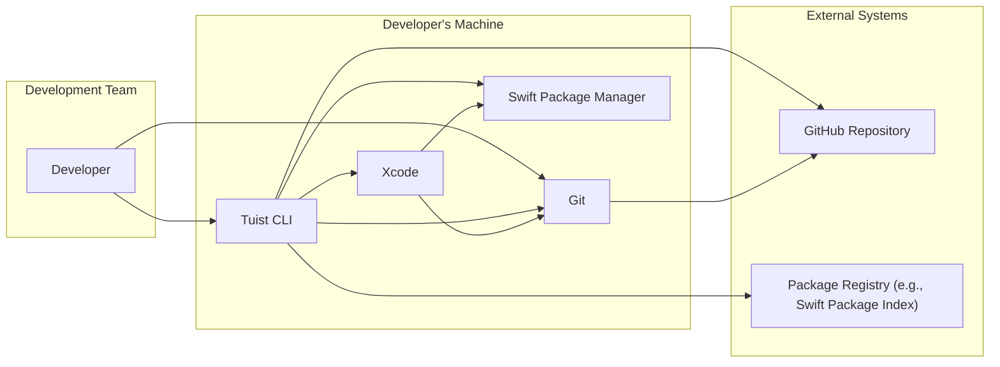
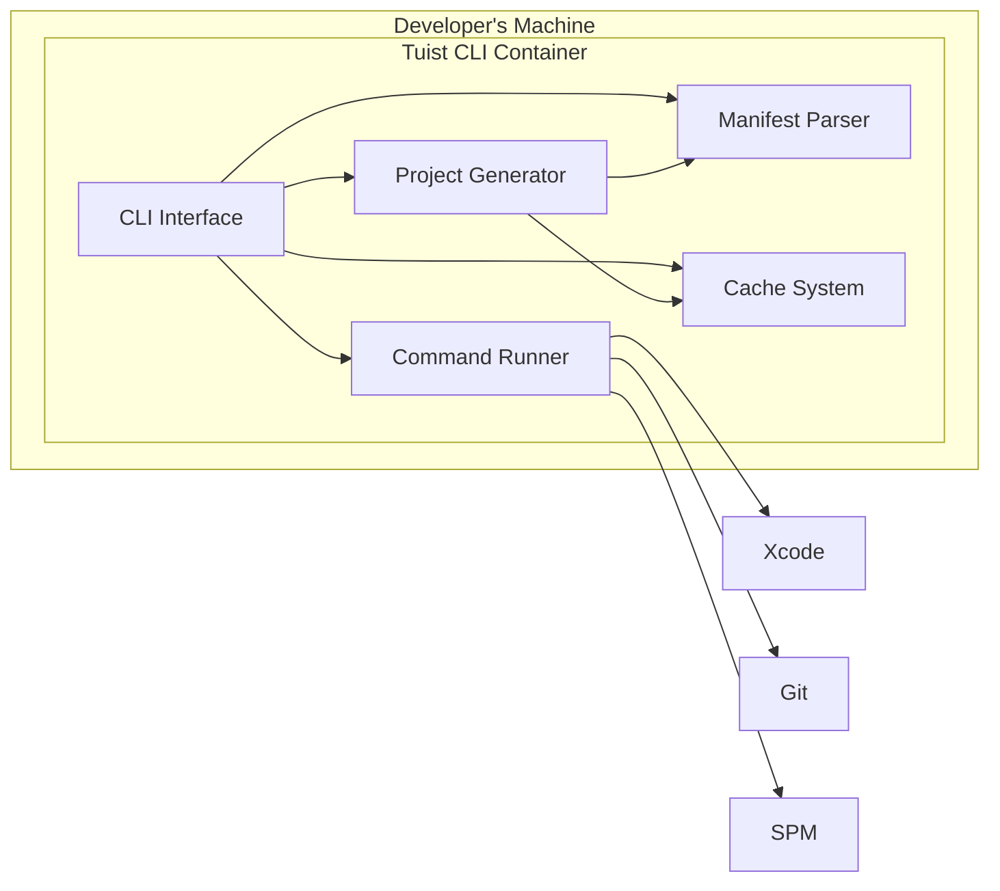
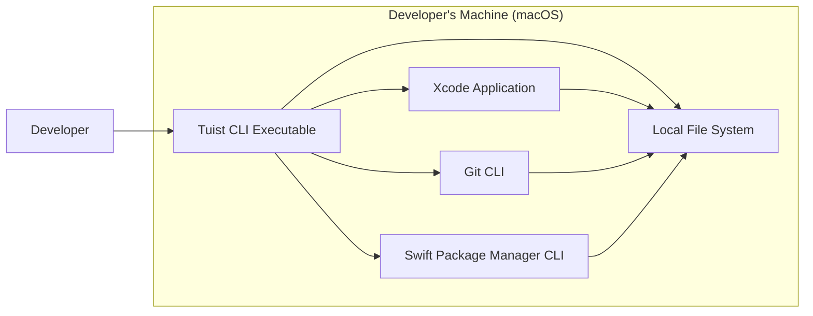
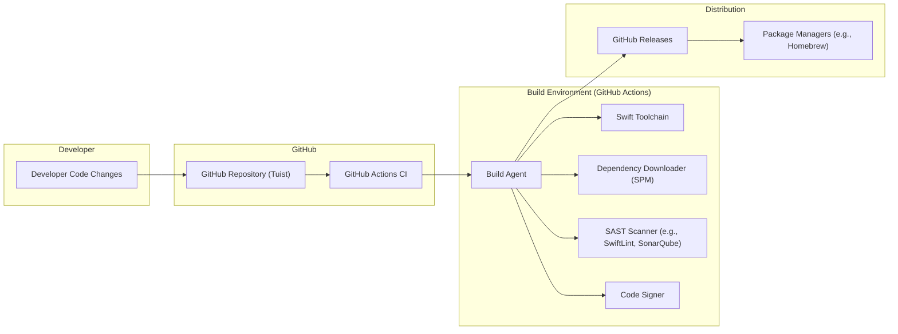

# BUSINESS POSTURE

Tuist is a command-line tool designed to enhance the development experience for iOS, macOS, and other Apple platform projects, particularly large and modular ones.

Business Priorities and Goals:
- Improve developer productivity by reducing Xcode project complexity and build times.
- Enforce project consistency and best practices through code generation and project structure management.
- Facilitate modularization and code sharing across teams and projects.
- Streamline onboarding of new developers to large projects.
- Reduce merge conflicts and improve code maintainability.

Business Risks:
- Dependency on Tuist for project generation and management could create a single point of failure if Tuist becomes unavailable or has critical bugs.
- Incorrectly generated or configured projects by Tuist could lead to build failures, runtime errors, or security vulnerabilities in the final application.
- Security vulnerabilities in Tuist itself could be exploited to compromise developer environments or the generated projects.
- Migration to Tuist might require significant upfront investment in time and resources, and potential disruption to existing workflows.
- Lack of adoption or community support could lead to project stagnation and reduced long-term viability.

# SECURITY POSTURE

Existing Security Controls:
- security control: GitHub repository with version control for source code and changes. Implemented in: GitHub.
- security control: Code review process for pull requests. Implemented in: GitHub pull request workflow.
- security control: Dependency management using Swift Package Manager. Implemented in: Swift Package Manager and `Package.swift` manifests.
- security control: Build process defined in Swift code, allowing for inspection and customization. Implemented in: Tuist codebase.

Accepted Risks:
- accepted risk: Reliance on third-party dependencies managed by Swift Package Manager. Risk is mitigated by using version pinning and dependency review processes.
- accepted risk: Potential vulnerabilities in the Swift toolchain and underlying operating system. Risk is mitigated by keeping development environment up to date with security patches.
- accepted risk: Exposure of source code and project configurations in a public GitHub repository. Risk is mitigated by not storing sensitive secrets directly in the repository and using environment variables or secure vault solutions for secrets management in generated projects.

Recommended Security Controls:
- security control: Implement automated security scanning (SAST/DAST) in the CI/CD pipeline to detect potential vulnerabilities in the Tuist codebase.
- security control: Conduct regular security audits and penetration testing of Tuist to identify and address security weaknesses.
- security control: Implement dependency vulnerability scanning to identify and mitigate risks from vulnerable dependencies.
- security control: Provide secure configuration guidelines and best practices for users to generate secure projects with Tuist.
- security control: Implement code signing and verification for Tuist releases to ensure integrity and prevent tampering.

Security Requirements:
- Authentication: Not directly applicable to Tuist itself as a command-line tool. Authentication might be relevant for future features if Tuist integrates with online services or platforms.
- Authorization: Not directly applicable to Tuist itself. Authorization is relevant in the context of the generated projects, which should implement appropriate authorization mechanisms.
- Input Validation: Tuist should perform robust input validation on all user-provided inputs, such as project names, paths, configurations, and manifest files, to prevent injection attacks and unexpected behavior.
- Cryptography: Cryptography might be used for secure caching mechanisms or for features like code signing in the future. If implemented, strong cryptographic algorithms and best practices should be followed.

# DESIGN

## C4 CONTEXT

Context Diagram Elements:

- Name: Developer
  - Type: Person
  - Description: Software developers who use Tuist to manage and build their projects.
  - Responsibilities: Uses Tuist CLI to generate, manage, and build Xcode projects. Writes code and project configurations. Commits code changes to Git.
  - Security controls: Local machine security controls, user authentication to development machine and Git.

- Name: Tuist CLI
  - Type: Software System
  - Description: Command-line tool written in Swift that automates Xcode project generation, management, and build processes.
  - Responsibilities: Reads project manifests, generates Xcode projects, interacts with Git for version control, manages dependencies using Swift Package Manager, and invokes Xcode build tools.
  - Security controls: Input validation, secure handling of project configurations, code signing for releases (recommended).

- Name: Xcode
  - Type: Software System
  - Description: Apple's Integrated Development Environment (IDE) used for developing applications for Apple platforms.
  - Responsibilities: Builds, runs, and debugs applications generated by Tuist. Provides developer interface for code editing and project management.
  - Security controls: Code signing, sandboxing, security features of the operating system.

- Name: Git
  - Type: Software System
  - Description: Distributed version control system used for managing source code and project history.
  - Responsibilities: Stores source code, project configurations, and Tuist manifests. Tracks changes and facilitates collaboration among developers.
  - Security controls: Repository access controls, branch protection, commit signing (optional).

- Name: Swift Package Manager (SPM)
  - Type: Software System
  - Description: Dependency management tool for Swift projects.
  - Responsibilities: Resolves and downloads project dependencies defined in `Package.swift` manifests.
  - Security controls: Dependency verification, checksum validation, secure download channels.

- Name: GitHub Repository
  - Type: External System
  - Description: Git repository hosting the Tuist project source code and issue tracking.
  - Responsibilities: Stores Tuist source code, manages contributions, and tracks issues and feature requests.
  - Security controls: Access controls, branch protection, vulnerability scanning (GitHub Security Features).

- Name: Package Registry (e.g., Swift Package Index)
  - Type: External System
  - Description: Public or private registries hosting Swift packages that can be used as dependencies in Tuist projects.
  - Responsibilities: Provides Swift packages for dependency resolution by Swift Package Manager.
  - Security controls: Package verification, reputation scoring (Swift Package Index), secure package hosting.

## C4 CONTAINER

Container Diagram Elements:

- Name: Tuist CLI Container
  - Type: Container
  - Description: Represents the Tuist command-line application as a whole, encompassing all its internal components.
  - Responsibilities: Provides the overall functionality of Tuist, orchestrating project generation, management, and build processes.
  - Security controls: Input validation at CLI interface, secure inter-component communication within the container.

- Name: CLI Interface
  - Type: Component
  - Description: Handles user interaction through the command line, parsing commands and arguments.
  - Responsibilities: Accepts user commands, validates input, and delegates tasks to other components.
  - Security controls: Input validation, command parsing security.

- Name: Manifest Parser
  - Type: Component
  - Description: Parses project manifest files (e.g., `Project.swift`, `Workspace.swift`) written in Swift to understand project structure and configuration.
  - Responsibilities: Reads and interprets manifest files, validates manifest syntax and semantics, and provides structured data to other components.
  - Security controls: Secure parsing of Swift code, prevention of code injection through manifest files.

- Name: Project Generator
  - Type: Component
  - Description: Generates Xcode project files (e.g., `.xcodeproj`, `.xcworkspace`) based on parsed project manifests.
  - Responsibilities: Creates Xcode project structure, configures targets, schemes, and settings based on manifest definitions.
  - Security controls: Secure project generation logic, prevention of insecure project configurations.

- Name: Cache System
  - Type: Component
  - Description: Caches build artifacts and project generation results to speed up subsequent builds and project generation.
  - Responsibilities: Stores and retrieves cached data, manages cache invalidation, and ensures cache integrity.
  - Security controls: Secure cache storage, cache integrity checks, prevention of cache poisoning.

- Name: Command Runner
  - Type: Component
  - Description: Executes external commands such as invoking Xcode build tools, Git commands, and Swift Package Manager.
  - Responsibilities: Executes commands on the underlying operating system, manages command execution, and handles command output.
  - Security controls: Secure command execution, input sanitization for external commands, prevention of command injection.

## DEPLOYMENT

Deployment Environment: Developer's Local Machine (macOS)

Deployment Diagram Elements:

- Name: Developer's Machine (macOS)
  - Type: Deployment Environment
  - Description: The local macOS machine used by developers to run Tuist and develop projects.
  - Responsibilities: Provides the runtime environment for Tuist, Xcode, Git, and Swift Package Manager. Hosts the file system where projects are stored.
  - Security controls: Operating system security controls, user account controls, endpoint security software.

- Name: Tuist CLI Executable
  - Type: Software Instance
  - Description: The compiled and installed Tuist command-line tool executable.
  - Responsibilities: Executes Tuist commands, interacts with other tools and the file system.
  - Security controls: Code signing, file system permissions, access controls.

- Name: Xcode Application
  - Type: Software Instance
  - Description: The installed Xcode application on the developer's machine.
  - Responsibilities: Builds, runs, and debugs projects generated by Tuist.
  - Security controls: Application sandboxing, code signing, operating system security features.

- Name: Git CLI
  - Type: Software Instance
  - Description: The Git command-line client installed on the developer's machine.
  - Responsibilities: Manages version control operations for projects.
  - Security controls: File system permissions, access controls, SSH key management for remote repositories.

- Name: Swift Package Manager CLI
  - Type: Software Instance
  - Description: The Swift Package Manager command-line tool included with the Swift toolchain.
  - Responsibilities: Manages project dependencies.
  - Security controls: Secure package download and verification, file system permissions.

- Name: Local File System
  - Type: Infrastructure
  - Description: The file system on the developer's machine where projects, Tuist configuration, and cached data are stored.
  - Responsibilities: Stores project files, Tuist configuration, and cached data.
  - Security controls: File system permissions, access controls, disk encryption (optional).

## BUILD

Build Process Description:

1. Developer writes code changes and commits them to the GitHub Repository.
2. GitHub Actions CI is triggered by code changes (e.g., push, pull request).
3. GitHub Actions CI spins up a Build Agent (virtual machine or container).
4. Build Agent uses the Swift Toolchain to compile the Tuist project.
5. Dependency Downloader (Swift Package Manager) downloads project dependencies.
6. SAST Scanner performs static analysis security scans on the codebase.
7. Code Signer signs the compiled Tuist executable.
8. Build artifacts (Tuist CLI executable) are uploaded to GitHub Releases.
9. Package Managers (e.g., Homebrew) can distribute Tuist releases to users.

Build Security Controls:
- security control: Automated CI/CD pipeline using GitHub Actions for build automation and repeatability. Implemented in: GitHub Actions workflows.
- security control: Source code hosted on GitHub with access controls and version history. Implemented in: GitHub repository settings.
- security control: Dependency management using Swift Package Manager with `Package.swift` manifest for reproducible builds. Implemented in: Swift Package Manager.
- security control: Static Application Security Testing (SAST) using linters and security scanners in the CI pipeline. Recommended: SwiftLint, SonarQube or similar.
- security control: Code signing of release binaries to ensure integrity and authenticity. Implemented in: GitHub Actions workflow using code signing certificates.
- security control: Release artifacts published to GitHub Releases for distribution. Implemented in: GitHub Releases feature.
- security control: Potential distribution through package managers like Homebrew, which have their own security review processes. Implemented in: Homebrew package submission process.

# RISK ASSESSMENT

Critical Business Processes:
- Development of iOS, macOS, and other Apple platform applications using Tuist.
- Generation and management of Xcode projects for these applications.
- Building and testing these applications using Xcode and related tools.
- Maintaining consistency and modularity in large projects.
- Onboarding new developers to projects using Tuist.

Data Sensitivity:
- Project configurations defined in Swift manifest files (`Project.swift`, `Workspace.swift`). Sensitivity: Low to Medium. These files define project structure and build settings, which are generally not considered highly sensitive but could contain information about project architecture and dependencies.
- Source code of Tuist itself. Sensitivity: Low to Medium. Publicly available on GitHub, but modifications could introduce vulnerabilities.
- Cached build artifacts and project generation results. Sensitivity: Low. Primarily performance optimization data, but potential for cache poisoning if compromised.
- Developer's local machine environment and configurations. Sensitivity: Medium to High. Developer machines can contain sensitive information and access to internal systems.

# QUESTIONS & ASSUMPTIONS

Questions:
- What is the intended audience for Tuist? Is it primarily for internal use within a specific organization, or is it intended for broader public use?
- Are there any specific regulatory compliance requirements that Tuist needs to adhere to (e.g., GDPR, HIPAA)?
- Are there any plans to integrate Tuist with online services or platforms in the future?
- What is the process for handling security vulnerabilities reported in Tuist? Is there a security contact or vulnerability disclosure policy?
- What are the performance requirements for Tuist, and how does caching contribute to meeting these requirements?

Assumptions:
- Tuist is primarily used by software developers to improve their productivity and project management.
- Security is a secondary concern compared to functionality and ease of use, but still important for maintaining developer trust and preventing potential risks.
- Tuist is intended to be used in development environments and does not directly handle sensitive user data or interact with production systems.
- The primary deployment environment for Tuist is developer's local macOS machines.
- The project is open-source and community-driven, relying on contributions and public scrutiny for code quality and security.