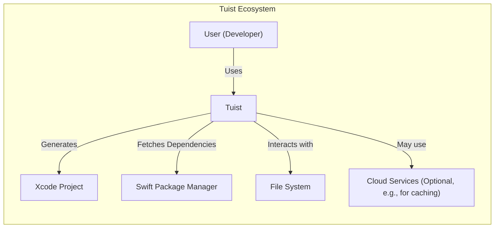
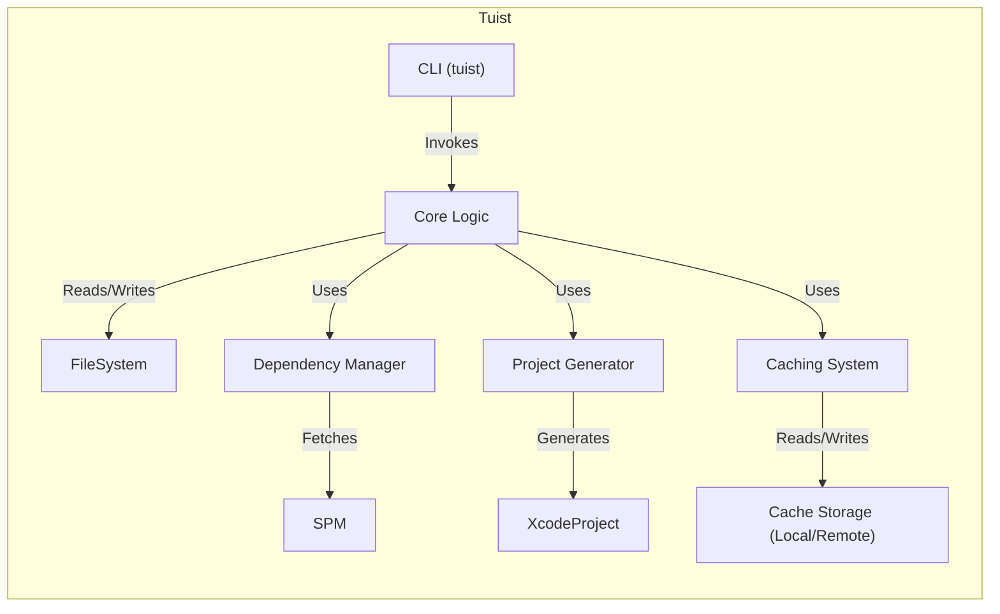

Okay, let's create a design document for the Tuist project, focusing on aspects relevant for threat modeling.

# BUSINESS POSTURE

Tuist is a command-line tool (CLI) designed to streamline the development and maintenance of Xcode projects, particularly at scale.  It aims to improve developer productivity, project maintainability, and build performance.  It appears to be an open-source project, likely driven by a community and potentially backed by one or more companies that rely on it.

Priorities:

*   Developer Productivity: Reduce time spent on project configuration and build-related tasks.
*   Project Maintainability:  Make it easier to manage complex Xcode projects with many targets and dependencies.
*   Build Performance:  Improve build times and reduce resource consumption.
*   Community Adoption:  Encourage widespread use and contribution to the project.
*   Consistency and Reliability: Ensure that Xcode projects are generated consistently and reliably across different environments and machines.

Goals:

*   Provide a declarative way to define Xcode projects.
*   Automate common tasks like generating Xcode projects, managing dependencies, and building.
*   Enable caching of build artifacts to speed up build times.
*   Offer a plugin system for extending functionality.
*   Support multiple platforms (macOS, iOS, tvOS, watchOS).

Business Risks:

*   Supply Chain Attacks:  Vulnerabilities in Tuist's dependencies or build process could be exploited to inject malicious code into generated Xcode projects. This is the most significant risk.
*   Incorrect Project Generation:  Bugs in Tuist could lead to incorrectly generated Xcode projects, causing build failures, runtime errors, or security vulnerabilities in the *resulting* applications.
*   Data Loss/Corruption:  Errors in Tuist could potentially lead to the loss or corruption of project files, although this is less likely given its primary function.
*   Performance Degradation:  Poorly optimized Tuist code or configurations could negatively impact build times, counteracting its intended benefits.
*   Lack of Adoption: If Tuist fails to gain sufficient traction, it may become unmaintained, leading to compatibility issues and security risks over time.
*   Compatibility Issues: Changes in Xcode or related tools could break Tuist's functionality, requiring significant effort to maintain compatibility.

# SECURITY POSTURE

Existing Security Controls:

*   security control: Code Reviews: Pull requests are used on GitHub, implying a code review process before merging changes. (Described in GitHub repository's contribution guidelines).
*   security control: Static Analysis: The project likely uses SwiftLint or similar tools to enforce code style and identify potential issues. (Inferred from common practice and project structure).
*   security control: Dependency Management: The project uses Swift Package Manager (SPM) for managing dependencies. (Described in the `Package.swift` file).
*   security control: Testing: The project includes unit and integration tests. (Observed in the project structure and CI configuration).
*   security control: CI/CD: GitHub Actions are used for continuous integration, running tests and checks on every push and pull request. (Described in the `.github/workflows` directory).
*   security control: Issue Tracking: GitHub Issues are used to track bugs and feature requests, including security vulnerabilities. (Visible on the GitHub repository).

Accepted Risks:

*   accepted risk: Dependency Vulnerabilities: While SPM is used, there's an inherent risk of vulnerabilities in third-party dependencies. This is mitigated by regular updates and monitoring, but the risk remains.
*   accepted risk: Limited Formal Security Audits: As an open-source project, it's unlikely that Tuist undergoes regular, formal security audits by external experts.
*   accepted risk: User-Controlled Input: Tuist processes user-provided configuration files (e.g., `Project.swift`), which could potentially contain malicious code or configurations if the user's system is compromised.

Recommended Security Controls:

*   security control: Software Composition Analysis (SCA): Implement an SCA tool (e.g., Dependabot, Snyk) to automatically scan for known vulnerabilities in dependencies and generate alerts or pull requests for updates.
*   security control: Static Application Security Testing (SAST): Integrate a SAST tool into the CI pipeline to analyze the Tuist codebase for potential security vulnerabilities.
*   security control: Fuzzing: Introduce fuzz testing to identify edge cases and potential vulnerabilities related to input parsing and processing.
*   security control: Code Signing: Ensure that released binaries of Tuist are code-signed to verify their authenticity and integrity.
*   security control: Security Documentation: Create dedicated security documentation, including a security policy, vulnerability reporting guidelines, and best practices for users.

Security Requirements:

*   Authentication: Not directly applicable to Tuist itself, as it's a CLI tool that operates locally. However, interactions with remote services (e.g., fetching dependencies) should use appropriate authentication mechanisms (e.g., SSH keys, access tokens).
*   Authorization: Not directly applicable in the same way as a web application. However, Tuist should operate with the least necessary privileges on the user's system.
*   Input Validation: Tuist must rigorously validate all user-provided input, including configuration files, command-line arguments, and environment variables. This is crucial to prevent code injection and other vulnerabilities.  Specific areas of concern:
    *   Path Validation: Ensure that file paths are properly sanitized to prevent directory traversal attacks.
    *   Data Type Validation:  Verify that input values conform to expected data types and ranges.
    *   Command Injection Prevention:  Avoid constructing shell commands directly from user input. Use system APIs for executing processes whenever possible.
*   Cryptography:
    *   Secure Dependency Fetching:  Ensure that dependencies are fetched over secure channels (HTTPS) and that their integrity is verified (e.g., using checksums or signatures).
    *   Caching: If sensitive data is cached, it should be encrypted at rest.
    *   Plugin System: If the plugin system allows loading external code, ensure that plugins are loaded securely and their integrity is verified.

# DESIGN

## C4 CONTEXT



Element Descriptions:

*   Element:
    *   Name: User (Developer)
    *   Type: Person
    *   Description: A software developer using Tuist to manage their Xcode projects.
    *   Responsibilities: Writes Tuist configuration files, runs Tuist commands, builds and runs the generated Xcode projects.
    *   Security controls: Uses secure coding practices, keeps their system secure, reports any security issues found in Tuist.

*   Element:
    *   Name: Tuist
    *   Type: Software System
    *   Description: The Tuist command-line tool.
    *   Responsibilities: Parses configuration files, generates Xcode projects, manages dependencies, provides caching functionality, executes build commands.
    *   Security controls: Input validation, secure dependency management, secure coding practices, regular security updates.

*   Element:
    *   Name: Xcode Project
    *   Type: Output
    *   Description: The generated Xcode project files (`.xcodeproj`, `.xcworkspace`).
    *   Responsibilities: Defines the structure and build settings of the developer's application.
    *   Security controls: Inherits security settings from the Tuist configuration and Xcode defaults. Relies on the security of the underlying platform (macOS, iOS, etc.).

*   Element:
    *   Name: Swift Package Manager
    *   Type: External System
    *   Description: The package manager used by Tuist to resolve and fetch dependencies.
    *   Responsibilities: Downloads and manages Swift packages.
    *   Security controls: Uses HTTPS for fetching packages, verifies package integrity (checksums).

*   Element:
    *   Name: File System
    *   Type: External System
    *   Description: The local file system where Tuist operates.
    *   Responsibilities: Stores Tuist configuration files, generated Xcode projects, and cached data.
    *   Security controls: Relies on the operating system's file system security (permissions, access control lists).

*   Element:
    *   Name: Cloud Services (Optional)
    *   Type: External System
    *   Description: Optional cloud services that Tuist might integrate with, such as remote caching services.
    *   Responsibilities: Varies depending on the specific service.
    *   Security controls: Depends on the security features of the chosen cloud service (authentication, authorization, encryption).

## C4 CONTAINER



Element Descriptions:

*   Element:
    *   Name: CLI (tuist)
    *   Type: Command-Line Interface
    *   Description: The entry point for users to interact with Tuist.
    *   Responsibilities: Parses command-line arguments, handles user input, invokes core logic.
    *   Security controls: Input validation, command-line argument parsing.

*   Element:
    *   Name: Core Logic
    *   Type: Component
    *   Description: The main component containing Tuist's business logic.
    *   Responsibilities: Coordinates all other components, manages the overall workflow.
    *   Security controls: Secure coding practices, internal API security.

*   Element:
    *   Name: Dependency Manager
    *   Type: Component
    *   Description: Handles dependency resolution and fetching.
    *   Responsibilities: Interacts with Swift Package Manager, manages dependency graphs.
    *   Security controls: Secure communication with SPM, dependency integrity verification.

*   Element:
    *   Name: Project Generator
    *   Type: Component
    *   Description: Generates Xcode project files.
    *   Responsibilities: Creates `.xcodeproj` and `.xcworkspace` files based on the Tuist configuration.
    *   Security controls: Secure generation of project files, proper handling of file paths.

*   Element:
    *   Name: Caching System
    *   Type: Component
    *   Description: Manages the caching of build artifacts.
    *   Responsibilities: Stores and retrieves cached data, determines cache hits and misses.
    *   Security controls: Secure storage of cached data (encryption if necessary), cache invalidation mechanisms.

*   Element:
    *   Name: Cache Storage (Local/Remote)
    *   Type: Data Store
    *   Description: The storage location for cached data. Can be local or remote.
    *   Responsibilities: Stores and retrieves cached data.
    *   Security controls: Depends on the storage type (local file system security or cloud service security).

*   Element:
    *   Name: File System
    *   Type: External System
    *   Description: The local file system.
    *   Responsibilities: Stores configuration files, generated projects, and potentially cached data.
    *   Security controls: Relies on operating system file system security.

*   Element:
    *   Name: SPM
    *   Type: External System
    *   Description: Swift Package Manager.
    *   Responsibilities: Resolves and fetches dependencies.
    *   Security controls: Uses HTTPS, verifies package integrity.

*   Element:
    *   Name: XcodeProject
    *   Type: Output
    *   Description: The generated Xcode project.
    *   Responsibilities: Defines the structure and build settings of the application.
    *   Security controls: Inherits security from Tuist configuration and Xcode defaults.

## DEPLOYMENT

Possible Deployment Solutions:

1.  Homebrew:  A common way to install command-line tools on macOS.
2.  Manual Download:  Users can download pre-built binaries from GitHub releases.
3.  Build from Source:  Users can clone the repository and build Tuist themselves.
4.  Mint: Swift package manager that can install and run Swift command line tools.

Chosen Solution (Homebrew):

```mermaid
graph LR
    subgraph Deployment (Homebrew)
        Developer["Developer"] -- Pushes code to --> GitHub
        GitHubActions["GitHub Actions (CI)"] -- Builds and Tests --> Artifact["Tuist Binary"]
        Artifact -- Uploaded to --> GitHubReleases["GitHub Releases"]
        HomebrewFormula["Homebrew Formula"] -- Points to --> GitHubReleases
        UserMachine["User's Machine"] -- Installs via --> Homebrew
        Homebrew -- Downloads from --> GitHubReleases
    end
```

Element Descriptions:

*   Element:
    *   Name: Developer
    *   Type: Person
    *   Description: A Tuist developer contributing code.
    *   Responsibilities: Writes code, submits pull requests.
    *   Security controls: Uses secure coding practices, keeps their system secure.

*   Element:
    *   Name: GitHub
    *   Type: External System
    *   Description: The source code repository and collaboration platform.
    *   Responsibilities: Hosts the Tuist source code, manages pull requests, issues, etc.
    *   Security controls: GitHub's built-in security features (authentication, authorization, etc.).

*   Element:
    *   Name: GitHub Actions (CI)
    *   Type: CI/CD System
    *   Description: The continuous integration system used by Tuist.
    *   Responsibilities: Builds and tests Tuist on every push and pull request.
    *   Security controls: Runs in a sandboxed environment, uses secure access tokens.

*   Element:
    *   Name: Artifact (Tuist Binary)
    *   Type: Build Artifact
    *   Description: The compiled Tuist binary.
    *   Responsibilities: The executable file that users run.
    *   Security controls: Code signing (recommended).

*   Element:
    *   Name: GitHub Releases
    *   Type: Release Management System
    *   Description: GitHub's feature for managing releases.
    *   Responsibilities: Stores released versions of Tuist binaries.
    *   Security controls: GitHub's built-in security features.

*   Element:
    *   Name: Homebrew Formula
    *   Type: Package Definition
    *   Description: A formula that tells Homebrew how to install Tuist.
    *   Responsibilities: Specifies the download URL, dependencies, and installation steps.
    *   Security controls: Homebrew's security mechanisms (checksum verification).

*   Element:
    *   Name: User's Machine
    *   Type: Deployment Environment
    *   Description: The developer's computer where Tuist is installed.
    *   Responsibilities: Runs Tuist.
    *   Security controls: Relies on the operating system's security.

*   Element:
    *   Name: Homebrew
    *   Type: Package Manager
    *   Description: A package manager for macOS.
    *   Responsibilities: Downloads, installs, and manages software packages.
    *   Security controls: Uses HTTPS, verifies checksums of downloaded packages.

## BUILD


Build Process Description:

1.  Developer commits code to the GitHub repository.
2.  GitHub Actions is triggered by the commit.
3.  The workflow checks out the code.
4.  Linting is performed using SwiftLint (or a similar tool) to enforce code style and identify potential issues.
5.  The project is built using `swift build`.
6.  Tests are run using `swift test`.
7.  If all tests pass, the project is packaged into a binary artifact.
8.  The artifact is uploaded to GitHub Releases.

Security Controls in Build Process:

*   security control: Linting: Enforces code style and identifies potential code quality issues, which can indirectly improve security.
*   security control: Automated Testing: Unit and integration tests help ensure the correctness and reliability of the code, reducing the likelihood of vulnerabilities.
*   security control: CI/CD: GitHub Actions provides a consistent and automated build environment, reducing the risk of manual errors and ensuring that security checks are always performed.
*   security control: Dependency Management: SPM helps manage dependencies securely, although SCA is still recommended.
*   security control: Sandboxed Build Environment: GitHub Actions runs in a sandboxed environment, limiting the potential impact of malicious code during the build process.

# RISK ASSESSMENT

Critical Business Processes:

*   Xcode Project Generation: The core function of Tuist is to generate valid and functional Xcode projects. Any disruption or compromise of this process is critical.
*   Dependency Management: Tuist relies on external dependencies. Managing these dependencies securely and reliably is crucial.
*   Build Automation: Tuist automates many build-related tasks. Ensuring the integrity and reliability of this automation is important.

Data to Protect:

*   Source Code (Low Sensitivity): The Tuist source code itself is publicly available, so its confidentiality is not a primary concern. However, its integrity is critical.
*   User Project Files (Variable Sensitivity): Tuist processes user project files, which may contain sensitive information depending on the user's project. The sensitivity varies greatly.
*   Cached Data (Potentially Sensitive): Cached build artifacts could potentially contain sensitive information, depending on the user's project.
*   Configuration Files (Potentially Sensitive): Tuist configuration files (`Project.swift`, etc.) may contain secrets or sensitive project settings.

# QUESTIONS & ASSUMPTIONS

Questions:

*   Are there any specific compliance requirements (e.g., GDPR, HIPAA) that Tuist needs to consider, even indirectly?
*   What is the expected threat model for Tuist users? Are they primarily concerned with malicious actors, accidental errors, or both?
*   Are there any plans to integrate with specific cloud services for caching or other features?
*   What is the process for handling security vulnerability reports?
*   Is there a budget allocated for security tooling or audits?
*   What level of assurance is required for the generated Xcode projects (e.g., are they used for critical applications)?
*   How are secrets (e.g., API keys, signing certificates) managed within Tuist projects?
*   What is the long-term maintenance plan for Tuist, and how will security be addressed over time?

Assumptions:

*   BUSINESS POSTURE: The primary goal is to improve developer productivity and project maintainability, with security as a secondary but important consideration. The project has a moderate risk appetite, typical of an open-source project.
*   SECURITY POSTURE: The project follows basic secure development practices but may lack formal security processes and tooling. The developers are security-conscious but may not be security experts.
*   DESIGN: Tuist operates primarily on the local file system and interacts with external services (SPM, potentially cloud services) in a limited way. The design is modular and well-structured. The deployment is done via Homebrew. The build process is automated using GitHub Actions.