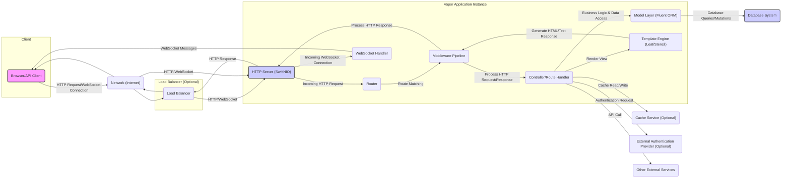

## Project Design Document: Vapor Web Framework (Improved)

**1. Introduction**

This document provides a detailed architectural design of the Vapor web framework, based on the repository at [https://github.com/vapor/vapor](https://github.com/vapor/vapor). Its primary goal is to offer a clear understanding of the framework's structure, core components, and data flow to facilitate effective threat modeling and security analysis.

**1.1. Purpose**

The primary purpose of this document is to serve as a comprehensive architectural blueprint of the Vapor framework. This blueprint will be the foundation for identifying potential security threats, assessing risks, and developing appropriate mitigation strategies.

**1.2. Scope**

This document focuses on the internal architecture and interactions within the core Vapor framework libraries. It does not cover specific applications built using Vapor, nor does it detail the underlying operating system, hardware infrastructure, or specific configurations of deployed applications. The scope is limited to the software components directly part of the Vapor project.

**1.3. Target Audience**

This document is intended for individuals and teams involved in the security and development of Vapor and applications built upon it:

* Security engineers responsible for threat modeling, penetration testing, and security audits.
* Developers contributing to the Vapor framework.
* Architects designing systems that utilize the Vapor framework.
* DevOps engineers involved in deploying and maintaining Vapor applications.

**2. Overview**

Vapor is a high-performance, server-side Swift web framework designed for building scalable and robust web applications, APIs, and network services. It leverages Swift's strengths in type safety, speed, and concurrency, offering a modern and efficient development experience. Vapor adopts a modular architecture, allowing developers to integrate only the necessary components for their projects. It follows several key architectural patterns, including Model-View-Controller (MVC) and a strong emphasis on asynchronous programming.

**Key Architectural Features:**

* **Asynchronous, Non-Blocking I/O:** Built on SwiftNIO, enabling high concurrency and efficient resource utilization.
* **Modular Design:**  Composed of independent, reusable components.
* **Middleware-Based Request Processing:**  Allows for intercepting and modifying requests and responses.
* **Convention over Configuration:**  Provides sensible defaults to streamline development.
* **Extensible and Customizable:**  Allows developers to extend and customize the framework's functionality.

**3. Architectural Design**

**3.1. Component Description**

* **Client (Browser/API Client):** The initiator of requests to the Vapor application. This can be a web browser, a mobile application, a command-line tool, or another service.
* **Network (Internet):** The communication infrastructure through which requests and responses are transmitted.
* **Load Balancer (Optional):** Distributes incoming network traffic across multiple Vapor application instances to improve performance, scalability, and availability.
* **Vapor Application Instance:** A running instance of the Vapor framework, responsible for handling incoming requests and generating responses.
    * **HTTP Server (SwiftNIO):** The foundation for handling network connections and processing HTTP requests and responses. SwiftNIO provides a low-level, high-performance, non-blocking I/O framework.
    * **Router:**  Responsible for mapping incoming HTTP requests to specific route handlers or controllers based on the request's method and path.
    * **Middleware Pipeline:** A sequence of handlers that intercept and process HTTP requests before they reach the route handler and responses before they are sent back to the client. Middleware can perform tasks like authentication, logging, request modification, and security checks.
    * **Controller/Route Handler:** Contains the application's business logic for handling specific routes. It receives the request, interacts with models and services, and generates a response.
    * **Model Layer (Fluent ORM):** An Object-Relational Mapper (ORM) that provides an abstraction layer for interacting with databases using Swift code. It handles database queries, migrations, and schema management.
    * **Template Engine (Leaf/Stencil):**  A component for rendering dynamic content by combining templates with data. Leaf is Vapor's primary templating engine.
    * **WebSocket Handler:** Manages persistent, bidirectional communication channels between the client and the server using the WebSocket protocol.
* **Database System:** The persistent storage system used by the application to store and retrieve data. Vapor supports various database systems through Fluent.
* **Cache Service (Optional):** A temporary data storage layer used to improve application performance by storing frequently accessed data in memory or a fast storage medium.
* **External Authentication Provider (Optional):** External services used for user authentication, such as OAuth providers (e.g., Google, Facebook).
* **Other External Services:**  Any other external APIs or services that the Vapor application interacts with (e.g., payment gateways, email services).

**3.2. Data Flow (HTTP Request)**

1. **Client Initiates Request:** A client sends an HTTP request to the Vapor application.
2. **Network Transmission:** The request travels through the internet.
3. **Load Balancer (Optional):** If present, the load balancer distributes the request to an available Vapor application instance.
4. **HTTP Server Receives Request:** The SwiftNIO-based HTTP server in the Vapor instance receives the incoming request.
5. **Routing:** The Router component analyzes the request's method and path to find a matching route definition.
6. **Middleware Processing:** The request passes through the configured middleware pipeline. Each middleware component can inspect or modify the request and response.
7. **Route Handler Invocation:** The Router invokes the appropriate controller method or route handler associated with the matched route.
8. **Business Logic Execution:** The controller/handler executes the application's business logic, which may involve:
    * Interacting with the Model Layer (Fluent) to query or modify data in the database.
    * Rendering a template using the Template Engine.
    * Interacting with external services.
    * Reading from or writing to the Cache Service.
9. **Response Generation:** The controller/handler generates an HTTP response.
10. **Middleware Processing (Response):** The response passes back through the middleware pipeline, allowing middleware to perform actions on the response before it's sent.
11. **HTTP Server Sends Response:** The HTTP server sends the generated response back to the client.
12. **Network Transmission:** The response travels through the internet.
13. **Client Receives Response:** The client receives the HTTP response.

**3.3. Data Flow (WebSocket Connection)**

1. **Client Initiates Connection:** A client sends a WebSocket handshake request to the Vapor application.
2. **Network Transmission:** The request travels through the internet.
3. **Load Balancer (Optional):** If present, the load balancer directs the connection to a Vapor instance.
4. **HTTP Server Upgrades Connection:** The HTTP server recognizes the upgrade request and establishes a WebSocket connection.
5. **WebSocket Handler Invocation:** The connection is handed off to the designated WebSocket handler.
6. **Bidirectional Communication:** The client and server can now exchange messages in real-time through the WebSocket connection.

**4. Key Components in Detail**

* **SwiftNIO:**  A foundational component providing asynchronous, event-driven networking capabilities. Its non-blocking I/O model allows Vapor to handle a large number of concurrent connections efficiently.
* **Routing System:**  A flexible system for defining routes that map specific URL patterns and HTTP methods to corresponding handlers. It supports route parameters, optional parameters, and route groups for organization.
* **Middleware:**  A powerful mechanism for implementing cross-cutting concerns. Common middleware includes:
    * **Authentication:** Verifying user credentials.
    * **Authorization:** Controlling access to resources based on user roles or permissions.
    * **Logging:** Recording request and response information.
    * **Error Handling:**  Managing exceptions and generating appropriate error responses.
    * **Content Security Policy (CSP):**  Protecting against XSS attacks.
    * **Cross-Origin Resource Sharing (CORS):**  Managing cross-origin requests.
* **Fluent ORM:**  Provides a type-safe and expressive way to interact with databases. It supports various database backends through drivers and offers features like:
    * **Schema Migrations:**  Managing database schema changes.
    * **Query Builder:**  Constructing database queries using Swift code.
    * **Model Relationships:**  Defining relationships between database tables.
    * **Data Validation:**  Ensuring data integrity.
* **Template Engines (Leaf/Stencil):**  Enable the creation of dynamic web pages by embedding logic and data within templates. Leaf is Vapor's preferred templating engine, offering a Swift-based syntax.
* **WebSocket Implementation:**  Provides support for real-time, bidirectional communication using the WebSocket protocol, enabling features like live updates and interactive applications.

**5. Security Considerations**

This section outlines potential security considerations based on the architectural design. This serves as a starting point for a more in-depth threat modeling exercise.

* **Input Validation & Sanitization:**  Ensuring all data received from clients is validated and sanitized to prevent injection attacks (e.g., SQL injection, XSS, command injection).
* **Authentication & Authorization:** Implementing robust authentication mechanisms to verify user identities and secure authorization policies to control access to resources. Consider various authentication methods (e.g., session-based, token-based).
* **Session Management:**  Securely managing user sessions to prevent session hijacking and fixation attacks. Employ secure session identifiers and proper session expiration.
* **Cross-Site Scripting (XSS) Prevention:**  Implementing measures to prevent the injection of malicious scripts into web pages, including output encoding and using Content Security Policy (CSP).
* **Cross-Site Request Forgery (CSRF) Prevention:**  Protecting against unauthorized actions performed on behalf of authenticated users by using anti-CSRF tokens.
* **Data Protection (In Transit & At Rest):**  Ensuring the confidentiality and integrity of sensitive data by using HTTPS for communication and encrypting data at rest in the database.
* **Dependency Management:**  Regularly updating dependencies to patch known security vulnerabilities. Utilize dependency scanning tools.
* **Error Handling & Logging:**  Implementing secure error handling to prevent information leakage and comprehensive logging for auditing and security monitoring. Avoid exposing sensitive information in error messages.
* **Rate Limiting & Throttling:**  Protecting against denial-of-service attacks by limiting the number of requests from a single source.
* **Security Headers:**  Utilizing HTTP security headers (e.g., Strict-Transport-Security, X-Frame-Options, X-Content-Type-Options) to enhance security.
* **WebSocket Security:**  Securing WebSocket connections using WSS (WebSocket Secure) and implementing appropriate authentication and authorization for WebSocket communication.

**6. Dependencies**

Vapor relies on a number of external libraries and frameworks, categorized as follows:

* **Networking:**
    * SwiftNIO (for asynchronous networking)
    * NIOFoundationCompat
* **Core Swift Libraries:**
    * Foundation
    * Dispatch
* **Concurrency & Asynchronicity:**
    * AsyncKit
* **Logging & Metrics:**
    * Logging
    * Metrics
* **Data Handling & Utilities:**
    * Crypto
    * URLRouting
* **Database Integration (Fluent):**
    * FluentKit
    * Specific database drivers (e.g., `fluent-postgres-driver`, `fluent-mysql-driver`)
* **Templating:**
    * Leaf
    * Stencil
* **Testing:**
    * XCTest

**7. Deployment Considerations**

The security of a deployed Vapor application is heavily influenced by the deployment environment and configuration. Key security considerations for deployment include:

* **HTTPS Configuration:**  Ensuring that HTTPS is properly configured with valid SSL/TLS certificates to encrypt all communication between the client and the server.
* **Firewall Configuration:**  Configuring firewalls to restrict access to the application and only allow necessary ports and protocols.
* **Network Segmentation:**  Isolating the application server from other parts of the infrastructure to limit the impact of a potential breach.
* **Operating System Security:**  Keeping the underlying operating system and its components up-to-date with security patches.
* **Containerization Security (if using Docker/Kubernetes):**  Following security best practices for container image creation and orchestration.
* **Secrets Management:**  Securely managing sensitive information like database credentials and API keys, avoiding hardcoding them in the application.
* **Regular Security Audits & Penetration Testing:**  Conducting periodic security assessments to identify and address potential vulnerabilities in the deployed application and infrastructure.

**8. Conclusion**

This improved design document provides a more detailed and structured overview of the Vapor web framework's architecture, highlighting key components, data flows, and security considerations. This document serves as a valuable resource for understanding the framework's inner workings and will be instrumental in conducting thorough threat modeling activities to ensure the security of Vapor-based applications. The next step involves leveraging this document to perform a systematic threat analysis and develop appropriate security controls.