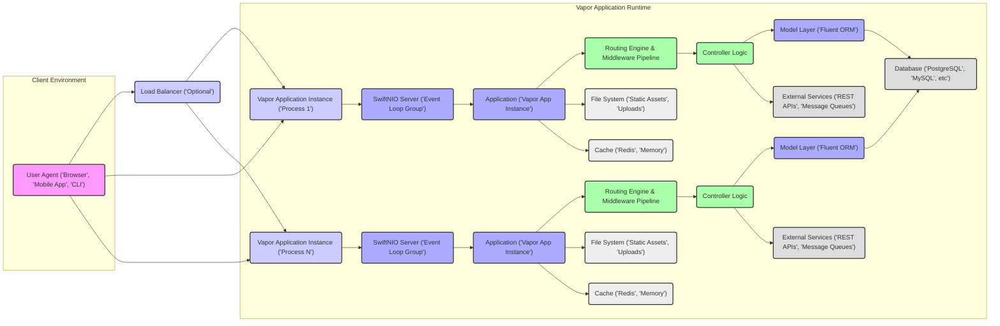

## Project Design Document: Vapor Web Framework - Improved

**1. Introduction**

This document provides an enhanced and detailed architectural design of the Vapor web framework, a server-side Swift framework for building robust web applications, RESTful APIs, and other networked services. This revised document aims to offer a more granular understanding of the framework's internal structure, component interactions, and data handling mechanisms, specifically tailored for subsequent threat modeling exercises.

**2. Goals and Objectives**

*   Present a refined and more detailed explanation of the Vapor framework's architecture and its core principles.
*   Clearly define the responsibilities, interactions, and boundaries of each key component within the framework.
*   Illustrate the intricate flow of data and requests throughout the application lifecycle within Vapor.
*   Provide a comprehensive list of technologies and dependencies that underpin the framework's functionality.
*   Serve as a robust and accurate foundation for conducting thorough threat modeling and security assessments.

**3. High-Level Architecture**

The Vapor framework is designed with a modular and layered architecture, emphasizing separation of concerns. It efficiently manages incoming requests, routes them through a middleware pipeline, and dispatches them to appropriate handlers. Leveraging Swift's asynchronous capabilities via SwiftNIO is central to its performance.

**4. Component Breakdown**

This section provides a more detailed breakdown of the key components within the Vapor framework, outlining their specific responsibilities and interactions:

*   **Server (SwiftNIO):**
    *   Core responsibility: Handling low-level networking operations using non-blocking I/O.
    *   Manages event loops for efficient processing of concurrent connections.
    *   Listens on specified ports for incoming network connections (typically HTTP/1.1, HTTP/2, or WebSockets).
    *   Responsible for the initial parsing of incoming data streams into HTTP requests.
    *   Provides the foundation for Vapor's asynchronous request handling.
*   **Application (`Application` Object):**
    *   Represents the central instance of a Vapor application.
    *   Manages the lifecycle of the application, including startup and shutdown.
    *   Holds references to key services and components (e.g., router, middleware, database connection pool).
    *   Provides a central point for configuring the application's behavior.
*   **Routing Engine:**
    *   Core responsibility: Mapping incoming HTTP requests to specific handler functions.
    *   Maintains a collection of defined routes, each associated with a specific HTTP method and URI pattern.
    *   Performs efficient matching of incoming request URIs against defined routes, including support for dynamic parameters.
    *   Supports route grouping and namespacing for better organization of application endpoints.
    *   Generates URLs based on defined routes, facilitating the creation of links within the application.
*   **Middleware Pipeline:**
    *   Core responsibility: Providing a chain of interceptors that can process requests and responses.
    *   Each middleware component performs a specific task, such as authentication, logging, or request modification.
    *   Middleware is executed in a predefined order, allowing for layered processing of requests.
    *   Provides a mechanism for cross-cutting concerns to be addressed in a modular and reusable way.
    *   Examples of common middleware:
        *   `FileMiddleware`: Serves static files from a specified directory.
        *   `CORSMiddleware`: Configures Cross-Origin Resource Sharing headers.
        *   `ErrorMiddleware`: Catches and handles errors that occur during request processing.
        *   Custom middleware for authentication, authorization, and logging.
*   **Controller:**
    *   Core responsibility: Implementing the application's business logic for specific routes.
    *   Receives processed requests from the middleware pipeline.
    *   Interacts with models to retrieve or manipulate data.
    *   Invokes services to perform specific tasks or interact with external systems.
    *   Generates responses to be sent back to the client, often in formats like JSON or HTML.
*   **Model Layer (Fluent ORM):**
    *   Core responsibility: Providing an abstraction layer for interacting with databases.
    *   Allows developers to define data models using Swift structs or classes.
    *   Provides a query builder interface for constructing database queries in a type-safe manner.
    *   Supports various database backends through different adapter packages (e.g., PostgreSQL, MySQL, SQLite, MongoDB).
    *   Handles database migrations, allowing for schema changes to be managed and applied programmatically.
    *   Provides features like relationships between models, data validation, and eager loading.
*   **Services:**
    *   Core responsibility: Encapsulating reusable business logic or interactions with external systems.
    *   Promotes modularity and testability by separating concerns.
    *   Can represent connections to third-party APIs, message queues (e.g., Kafka, RabbitMQ), or other internal services.
    *   Often implemented as protocols or concrete types that can be registered and accessed through Vapor's service container.
*   **Request and Response Objects:**
    *   `Request`: Represents an incoming HTTP request, providing access to:
        *   Headers.
        *   Body (data sent by the client).
        *   Query parameters.
        *   Route parameters.
        *   Cookies.
        *   File uploads.
    *   `Response`: Represents the HTTP response to be sent back to the client, allowing for setting:
        *   Status code (e.g., 200 OK, 404 Not Found).
        *   Headers (e.g., Content-Type, Cache-Control).
        *   Body (data to be sent to the client).
        *   Cookies.
*   **Configuration System (`Environment`, `Configuration`):**
    *   Core responsibility: Managing application settings and environment-specific configurations.
    *   Allows for defining different configurations for development, testing, and production environments.
    *   Supports loading configuration values from various sources, including:
        *   Environment variables.
        *   Command-line arguments.
        *   Configuration files (e.g., `.env` files).
    *   Provides a type-safe way to access configuration values within the application.
*   **Logging System (`Logger`):**
    *   Core responsibility: Recording application events, errors, and debugging information.
    *   Supports different logging levels (e.g., debug, info, warning, error).
    *   Allows for configuring different logging backends (e.g., console, file, external services).
    *   Provides a structured way to log messages with metadata.
*   **Swift Package Manager (SPM) Integration:**
    *   Core responsibility: Managing project dependencies and build process.
    *   Defines the project structure and dependencies in the `Package.swift` file.
    *   Handles fetching, building, and linking dependencies.

**5. Data Flow (Detailed)**

This section provides a more granular view of how a typical HTTP request is processed within a Vapor application:

```mermaid
graph LR
    A("Client Request ('HTTP Request')") --> B("SwiftNIO Server ('Receives Request')")
    B --> C("HTTP Parser ('Parses Request')")
    C --> D("Request Object ('Populated')")
    D --> E("Application Router ('Route Matching')")
    E -- "Route Found" --> F("Middleware Pipeline ('Execution Start')")
    subgraph "Middleware Pipeline"
        F --> G("Middleware 1 ('Pre-processing')")
        G --> H("Middleware 2")
        H --> I("Middleware N")
        I --> J("Controller Action ('Invocation')")
    end
    J --> K{"Data Interaction ('Model/Service')"}
    K -- "Database Interaction" --> L("Database ('Query Execution')")
    K -- "External API Call" --> M("External Service ('API Request')")
    L --> K
    M --> K
    K --> N("Response Object ('Generation')")
    subgraph "Middleware Pipeline (Reverse)"
        N --> O("Middleware N ('Post-processing')")
        O --> P("Middleware 2")
        P --> Q("Middleware 1")
    end
    Q --> R("Response Serializer ('Formats Response')")
    R --> S("SwiftNIO Server ('Sends Response')")
    S --> T("Client Response ('HTTP Response')")

    style A fill:#f9f,stroke:#333,stroke-width:2px
    style B fill:#ccf,stroke:#333,stroke-width:2px
    style C fill:#ccf,stroke:#333,stroke-width:2px
    style D fill:#aaf,stroke:#333,stroke-width:2px
    style E fill:#aaf,stroke:#333,stroke-width:2px
    style F fill:#aaffaa,stroke:#333,stroke-width:2px
    style G fill:#aaffaa,stroke:#333,stroke-width:2px
    style H fill:#aaffaa,stroke:#333,stroke-width:2px
    style I fill:#aaffaa,stroke:#333,stroke-width:2px
    style J fill:#aaffaa,stroke:#333,stroke-width:2px
    style K fill:#aaffaa,stroke:#333,stroke-width:2px
    style L fill:#dddddd,stroke:#333,stroke-width:2px
    style M fill:#dddddd,stroke:#333,stroke-width:2px
    style N fill:#aaf,stroke:#333,stroke-width:2px
    style O fill:#aaffaa,stroke:#333,stroke-width:2px
    style P fill:#aaffaa,stroke:#333,stroke-width:2px
    style Q fill:#aaffaa,stroke:#333,stroke-width:2px
    style R fill:#ccf,stroke:#333,stroke-width:2px
    style S fill:#ccf,stroke:#333,stroke-width:2px
    style T fill:#f9f,stroke:#333,stroke-width:2px
```

Detailed steps:

*   A client sends an HTTP request to the server.
*   SwiftNIO receives the request and passes it to the HTTP parser.
*   The HTTP parser processes the raw bytes into a structured `Request` object.
*   The application router attempts to match the request's method and URI to a defined route.
*   If a matching route is found, the request enters the middleware pipeline.
*   Each middleware in the pipeline processes the request (e.g., authentication, logging).
*   The request reaches the designated controller action.
*   The controller action executes business logic, potentially interacting with the model layer (Fluent) or external services.
*   Data is retrieved from or persisted to the database via Fluent.
*   Calls are made to external APIs or services as needed.
*   The controller action generates a `Response` object.
*   The response travels back through the middleware pipeline in reverse order for post-processing (e.g., adding headers).
*   The response serializer formats the `Response` object into a byte stream.
*   SwiftNIO sends the formatted response back to the client.

**6. Security Considerations (Detailed)**

This section expands on the security considerations, providing more specific examples and potential vulnerabilities:

*   **Input Validation & Sanitization:**
    *   Vulnerability: Injection attacks (SQL injection, command injection, XSS).
    *   Mitigation:
        *   Use Fluent's parameterized queries to prevent SQL injection.
        *   Sanitize user input before displaying it in HTML to prevent XSS.
        *   Validate data types and formats to prevent unexpected input.
        *   Use appropriate encoding for output (e.g., HTML escaping).
*   **Authentication and Authorization:**
    *   Vulnerability: Unauthorized access to resources, privilege escalation.
    *   Mitigation:
        *   Implement robust authentication mechanisms (e.g., JWT, OAuth 2.0).
        *   Enforce granular authorization rules based on user roles or permissions.
        *   Protect sensitive credentials and secrets.
        *   Use secure password hashing algorithms.
*   **Cross-Site Scripting (XSS):**
    *   Vulnerability: Malicious scripts injected into web pages, leading to data theft or session hijacking.
    *   Mitigation:
        *   Sanitize user-generated content before rendering it in HTML.
        *   Use Content Security Policy (CSP) headers to restrict the sources of allowed content.
        *   Employ templating engines that automatically escape output.
*   **Cross-Site Request Forgery (CSRF):**
    *   Vulnerability: Unauthorized actions performed on behalf of an authenticated user.
    *   Mitigation:
        *   Implement CSRF protection mechanisms (e.g., synchronizer tokens).
        *   Use `SameSite` cookie attribute.
*   **SQL Injection:**
    *   Vulnerability: Attackers manipulating database queries to gain unauthorized access or modify data.
    *   Mitigation:
        *   Always use parameterized queries or prepared statements provided by Fluent.
        *   Avoid constructing SQL queries by concatenating user input directly.
*   **Dependency Management:**
    *   Vulnerability: Using outdated dependencies with known security flaws.
    *   Mitigation:
        *   Regularly update project dependencies using Swift Package Manager.
        *   Monitor dependency vulnerability databases for known issues.
*   **HTTPS/TLS Configuration:**
    *   Vulnerability: Man-in-the-middle attacks, eavesdropping on sensitive data.
    *   Mitigation:
        *   Enforce HTTPS for all communication.
        *   Use strong TLS configurations and up-to-date certificates.
        *   Implement HTTP Strict Transport Security (HSTS) headers.
*   **Rate Limiting and Denial of Service (DoS) Prevention:**
    *   Vulnerability: Application being overwhelmed by excessive requests.
    *   Mitigation:
        *   Implement rate limiting middleware to restrict the number of requests from a single IP address.
        *   Use techniques like request queuing or load shedding.
*   **Error Handling and Information Disclosure:**
    *   Vulnerability: Leaking sensitive information through error messages.
    *   Mitigation:
        *   Implement generic error pages for production environments.
        *   Log detailed error information securely without exposing it to the client.
*   **Security Headers:**
    *   Vulnerability: Lack of protection against common web attacks.
    *   Mitigation:
        *   Utilize security headers like `Content-Security-Policy`, `X-Content-Type-Options`, `X-Frame-Options`, and `Referrer-Policy`.

**7. Technologies Used**

*   **Swift (Version 5.x):** The primary language for development.
*   **Swift Package Manager (SPM):** For managing dependencies and building the project.
*   **Apple NIO (version 2.x):** A low-level networking framework providing building blocks for high-performance, event-driven servers.
*   **Foundation:** Apple's core library providing fundamental data types and system services.
*   **Fluent (version 4.x):** Vapor's ORM for interacting with databases.
*   **Database Drivers (Fluent Adapters):**
    *   `fluent-postgres-driver`
    *   `fluent-mysql-driver`
    *   `fluent-sqlite-driver`
    *   `fluent-mongo-driver`
*   **HTTP/1.1 and HTTP/2 Support:** Built-in through NIO.
*   **WebSockets (through `swift-nio-websocket`):** For real-time communication.
*   **Logging Backends (e.g., `swift-log`):** For structured logging.
*   **Testing Framework (XCTest):** For unit and integration testing.

**8. Deployment Considerations (Expanded)**

Vapor applications offer flexibility in deployment strategies:

*   **macOS:** Primarily for local development and testing. Easy setup and debugging.
*   **Linux (Ubuntu, CentOS, etc.):** The most common platform for production deployments due to stability and performance.
    *   Deployment methods: Direct execution, systemd services, process managers (e.g., Supervisor).
*   **Docker Containers:** Encapsulating the application and its dependencies for consistent deployment across different environments.
    *   Orchestration with Kubernetes or Docker Compose for scaling and management.
*   **Cloud Platforms:**
    *   **AWS:** Elastic Compute Cloud (EC2), Elastic Container Service (ECS), Elastic Kubernetes Service (EKS), AWS Lambda (for smaller APIs).
    *   **Google Cloud:** Compute Engine, Kubernetes Engine (GKE), Cloud Run (container-based serverless).
    *   **Azure:** Virtual Machines, Azure Kubernetes Service (AKS), Azure Container Instances, Azure Functions.
    *   **Heroku:** Platform-as-a-Service offering simplified deployment and management.
*   **Serverless Environments (Limited):** While Vapor is primarily a server-based framework, smaller API endpoints or background tasks could potentially be deployed as serverless functions with some adaptation.

**9. Future Considerations**

*   Enhanced support for gRPC for building microservices.
*   Improved tooling for monitoring and observability.
*   Further development of security-focused middleware components.
*   More comprehensive documentation and examples for advanced features.
*   Exploration of integration with other Swift ecosystem technologies.
*   Performance benchmarking and optimization efforts for specific use cases.
