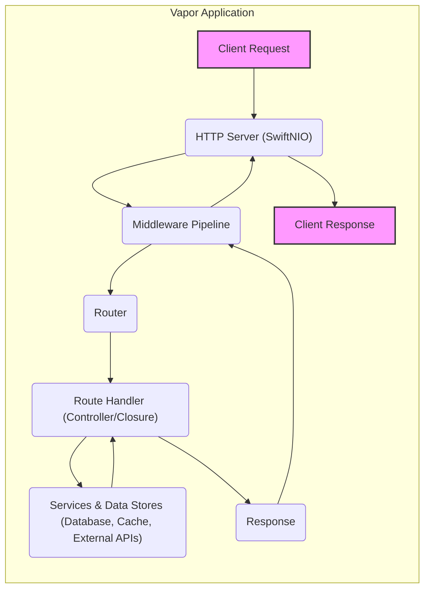
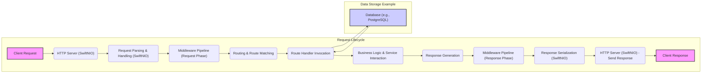
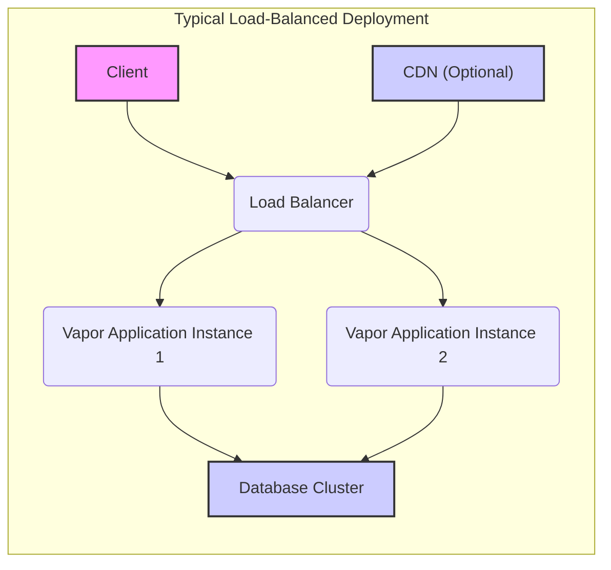

# Vapor Web Framework - Project Design Document for Threat Modeling (Improved)

## 1. Introduction

This document provides an enhanced design overview of the Vapor web framework, an open-source Swift framework for building robust and scalable web applications, APIs, and other network applications. It is designed to be a comprehensive resource for threat modeling activities, offering a detailed understanding of Vapor's architecture, components, data flow, and deployment strategies. This understanding is crucial for identifying and mitigating potential security vulnerabilities effectively.

Vapor is engineered for performance, developer experience, and extensibility, leveraging Swift's type safety and modern language paradigms. This document focuses on architectural elements relevant to security analysis and does not delve into granular code-level details. For in-depth code information, please consult the official Vapor documentation and the GitHub repository: [https://github.com/vapor/vapor](https://github.com/vapor/vapor).

Vapor is suitable for developers building a wide range of applications, from simple REST APIs to complex, server-rendered web applications and real-time communication systems. Its architecture is designed to be modular and adaptable to various deployment environments.

## 2. System Overview

Vapor is a server-side Swift web framework providing a rich ecosystem for developing modern web applications. Its core functionalities include:

*   **HTTP Server & Client:**  Built on SwiftNIO, offering high-performance, non-blocking HTTP/1.1 and HTTP/2 support for both server and client-side operations.
*   **Routing System:**  A declarative and flexible routing mechanism to map HTTP requests to specific handlers, supporting route parameters, grouping, and middleware.
*   **Middleware Pipeline:**  A powerful and extensible middleware system allowing request and response processing at various stages, enabling cross-cutting concerns like logging, security, and request modification.
*   **ORM (Fluent):**  An Object-Relational Mapper (ORM) providing an expressive and type-safe interface for interacting with various databases (e.g., PostgreSQL, MySQL, SQLite, MongoDB).
*   **Templating Engines:**  Support for server-side rendering using templating engines like Leaf, enabling dynamic HTML generation.
*   **Security Toolkit:**  Built-in and extensible security features including:
    *   Authentication and authorization mechanisms.
    *   Password hashing and verification utilities.
    *   Protection against common web vulnerabilities.
    *   Middleware for security headers and CORS.
*   **Testing Framework (XCTest integration):**  Seamless integration with Swift's XCTest framework for writing unit, integration, and API tests.
*   **Vapor Toolbox (CLI):**  A command-line interface tool for project bootstrapping, code generation, database migrations, and deployment tasks.
*   **WebSocket Support:**  Built-in support for WebSocket communication, enabling real-time features in applications.

Vapor applications are typically compiled into standalone executables and can be deployed on various platforms, including bare metal servers, virtual machines, containers (Docker), and cloud platforms. They are designed for concurrency and scalability, making them suitable for high-traffic applications.

## 3. Architecture Design

### 3.1. Component Diagram

### 3.2. Component Descriptions

*   **"Client Request"**: Represents an incoming HTTP request initiated by a client, such as a web browser, mobile application, or another service. This is the entry point for external interactions with the Vapor application.
*   **"HTTP Server (SwiftNIO)"**:  Vapor's core HTTP server, built upon the SwiftNIO framework. SwiftNIO provides a high-performance, event-driven, non-blocking I/O platform. The HTTP Server component is responsible for:
    *   Listening for incoming network connections.
    *   Handling TCP/IP and TLS/SSL handshake.
    *   Parsing raw HTTP request data into structured request objects.
    *   Dispatching requests to the middleware pipeline.
    *   Sending HTTP responses back to clients.
*   **"Middleware Pipeline"**: A chain of interceptors that process HTTP requests and responses. Middleware components are executed sequentially and can:
    *   Inspect and modify requests before they reach the route handler.
    *   Perform authentication and authorization checks.
    *   Log request details.
    *   Handle errors and exceptions.
    *   Add security headers to responses.
    *   Compress response bodies.
    *   Implement rate limiting.
    *   Provide CORS support.
    *   Serve static files.
    *   Route requests to different backends.
*   **"Router"**:  The routing component is responsible for mapping incoming HTTP requests to the appropriate route handler based on:
    *   HTTP method (GET, POST, PUT, DELETE, etc.).
    *   Request path (URL).
    *   Headers (optionally).
    The router uses a pattern-matching system to find the best matching route and extract parameters from the URL path. It also supports route grouping and applying middleware at the route level.
*   **"Route Handler (Controller/Closure)"**:  Application-specific code that handles the business logic for a particular route. Route handlers can be:
    *   Closures (anonymous functions) for simple routes.
    *   Methods within Controller classes for more complex applications, following MVC patterns.
    Handlers are responsible for:
        *   Processing request data.
        *   Interacting with services and data stores.
        *   Generating and returning HTTP responses.
*   **"Services & Data Stores (Database, Cache, External APIs)"**: Represents the backend services and data storage mechanisms used by the application. Examples include:
    *   **Database (SQL/NoSQL)**: Persistent storage for application data. Vapor's Fluent ORM supports various databases like PostgreSQL, MySQL, MongoDB, and SQLite.
    *   **Cache (Redis, Memcached)**: In-memory or distributed caching systems to improve performance by storing frequently accessed data.
    *   **Message Queues (RabbitMQ, Kafka)**: For asynchronous task processing and inter-service communication.
    *   **External APIs (Third-party services)**: Integration with external services for functionalities like payment processing, social media integration, or data enrichment.
    *   **File Storage (Object Storage, Local Filesystem)**: For storing files uploaded by users or generated by the application.
*   **"Response"**:  The HTTP response object generated by the route handler. It encapsulates:
    *   Response body (data, HTML, JSON, etc.).
    *   HTTP status code (e.g., 200 OK, 404 Not Found, 500 Internal Server Error).
    *   Response headers (e.g., Content-Type, Cache-Control, Security Headers).
*   **"Client Response"**: The final HTTP response sent back to the client by the HTTP server, after passing through the response middleware pipeline.

### 3.3. Data Flow Diagram

### 3.4. Data Flow Description

1.  **"Client Request"**: An HTTP request is initiated by a client and sent to the Vapor application's exposed endpoint.
2.  **"HTTP Server (SwiftNIO)"**: The SwiftNIO-based HTTP server receives the request, manages the connection, and handles low-level networking details.
3.  **"Request Parsing & Handling (SwiftNIO)"**: SwiftNIO parses the raw HTTP request data, including headers, body, method, and URL, into a structured request object. It manages connection pooling and keeps-alive connections.
4.  **"Middleware Pipeline (Request Phase)"**: The request object is passed through the configured middleware pipeline in the order defined. Each middleware component can inspect, modify, or reject the request. This phase is crucial for request pre-processing, including authentication, authorization, logging, and input validation.
5.  **"Routing & Route Matching"**: The Router component analyzes the request URL and HTTP method to find a matching route definition. It extracts route parameters and determines the appropriate route handler to invoke.
6.  **"Route Handler Invocation"**: The designated route handler (controller action or closure) is executed to process the request.
7.  **"Business Logic & Service Interaction"**: The route handler executes the core application logic. This may involve:
    *   Data validation and sanitization.
    *   Database queries (using Fluent ORM).
    *   Interactions with other services (cache, external APIs, message queues).
    *   Business rule execution and data manipulation.
8.  **"Response Generation"**: The route handler constructs an HTTP response object. This includes setting:
    *   Response body (data, error messages, HTML content, etc.).
    *   HTTP status code indicating the outcome of the request.
    *   Response headers (content type, caching directives, security headers, etc.).
9.  **"Middleware Pipeline (Response Phase)"**: The generated response object is passed back through the middleware pipeline in reverse order. Middleware components in this phase can process or modify the response before it is sent to the client. This is used for response post-processing, such as adding security headers, compression, and logging response details.
10. **"Response Serialization (SwiftNIO)"**: SwiftNIO serializes the response object back into raw HTTP response data, ready for transmission over the network.
11. **"HTTP Server (SwiftNIO) - Send Response"**: The HTTP server sends the serialized response data back to the client over the established connection.
12. **"Client Response"**: The client receives and processes the HTTP response, completing the request-response cycle.

## 4. Deployment Architecture

### 4.1. Deployment Diagram

### 4.2. Deployment Description

Vapor applications offer flexible deployment options, ranging from simple setups to complex, highly available and scalable architectures. Common deployment scenarios include:

*   **Single Server Deployment**:
    *   Vapor application and database (if required) are deployed on a single server.
    *   Suitable for development, testing, and low-traffic internal applications.
    *   **Security Considerations**: Server hardening, firewall configuration, regular security updates are crucial. Exposing database ports directly to the internet is highly discouraged.
*   **Load Balanced Deployment**:
    *   Multiple instances of the Vapor application are deployed behind a load balancer.
    *   Load balancer distributes traffic across instances, improving availability and scalability.
    *   Database is typically deployed on a separate server or cluster for performance and resilience.
    *   **Security Considerations**: Load balancer configuration (SSL termination, health checks), secure communication between load balancer and application instances (if applicable), and database security are important.
*   **Containerized Deployment (Docker, Kubernetes)**:
    *   Vapor applications are packaged as Docker containers and orchestrated using platforms like Kubernetes.
    *   Provides portability, scalability, isolation, and easier management.
    *   Ideal for microservices architectures and cloud-native deployments.
    *   **Security Considerations**: Container image security scanning, Kubernetes security configurations (network policies, RBAC), secrets management within Kubernetes, and secure container registry access are critical.
*   **Cloud Platform Deployment (AWS, GCP, Azure)**:
    *   Leveraging cloud services for deployment and infrastructure management.
    *   **AWS**: EC2, ECS, EKS, Elastic Beanstalk, Serverless (Lambda with custom runtime).
    *   **GCP**: Compute Engine, Kubernetes Engine, App Engine (flexible), Cloud Functions (custom runtime).
    *   **Azure**: Virtual Machines, AKS, App Service, Azure Functions (custom runtime).
    *   Cloud platforms offer managed services for databases, load balancing, caching, and security.
    *   **Security Considerations**: Cloud platform security best practices, IAM (Identity and Access Management) configuration, network security groups/firewalls, secure storage of cloud resources, and utilizing cloud-native security services are essential.
*   **CDN Integration (Content Delivery Network)**:
    *   Optional CDN can be placed in front of the load balancer or application instances to cache static content (images, CSS, JavaScript).
    *   Improves performance for geographically distributed users and reduces load on the application servers.
    *   **Security Considerations**: CDN configuration (SSL/TLS, origin protection), ensuring CDN does not cache sensitive data, and protection against CDN-specific attacks.

General Deployment Security Considerations:

*   **Network Security**: Firewalls, network segmentation, intrusion detection/prevention systems (IDS/IPS).
*   **Operating System & Server Hardening**: Secure OS configurations, disabling unnecessary services, regular patching.
*   **Secure Configuration of Services**: Properly configuring databases, caches, and other services with strong passwords, access controls, and security best practices.
*   **TLS/SSL Encryption**: Enforcing HTTPS for all communication between clients and the application, and internally between components where sensitive data is transmitted.
*   **Secrets Management**: Securely managing API keys, database credentials, encryption keys using environment variables, vault solutions, or cloud secret management services.
*   **Monitoring and Logging**: Implementing comprehensive monitoring and logging for security incident detection and auditing.

## 5. Security Considerations (Categorized)

This section outlines security considerations for Vapor applications, categorized for better organization and comprehensiveness.

### 5.1. Input Validation & Data Handling

*   **Input Validation**:
    *   **Description**: Validate all user inputs from requests (body, query parameters, headers, file uploads) against expected formats, types, and ranges.
    *   **Threats**: Injection attacks (SQL, Command, XSS, LDAP), data corruption, application crashes.
    *   **Mitigation**: Use strong input validation libraries, define validation rules, sanitize inputs, and employ output encoding to prevent XSS.
*   **Data Sanitization**:
    *   **Description**: Sanitize user-provided data before storing or processing it to remove potentially harmful characters or code.
    *   **Threats**: Injection attacks, data integrity issues.
    *   **Mitigation**: Use appropriate sanitization functions based on the data context (e.g., HTML escaping, URL encoding).
*   **File Upload Security**:
    *   **Description**: Securely handle file uploads to prevent malicious file uploads and directory traversal.
    *   **Threats**: Remote code execution, data breaches, denial of service.
    *   **Mitigation**: Validate file types and sizes, use allowlists for file extensions, scan uploaded files for malware, store uploaded files outside the web root, and generate unique filenames.

### 5.2. Authentication & Authorization

*   **Authentication**:
    *   **Description**: Verify the identity of users or clients accessing the application.
    *   **Threats**: Unauthorized access, identity theft, privilege escalation.
    *   **Mitigation**: Implement strong authentication mechanisms (e.g., password-based, multi-factor authentication, OAuth 2.0, API keys), use secure password hashing algorithms (bcrypt, Argon2), and protect against brute-force attacks (rate limiting, account lockout).
*   **Authorization**:
    *   **Description**: Control access to resources and functionalities based on user roles or permissions.
    *   **Threats**: Unauthorized access to sensitive data or functionalities, privilege escalation.
    *   **Mitigation**: Implement role-based access control (RBAC) or attribute-based access control (ABAC), enforce least privilege principle, and validate authorization at every access point.
*   **Session Management**:
    *   **Description**: Securely manage user sessions to maintain user state across requests.
    *   **Threats**: Session hijacking, session fixation, session replay attacks.
    *   **Mitigation**: Use secure session identifiers (cryptographically random), store session data securely (server-side), implement proper session expiration and timeout, regenerate session IDs after authentication, and use HTTP-only and secure flags for session cookies.

### 5.3. Data Protection & Cryptography

*   **Data in Transit Protection**:
    *   **Description**: Encrypt data transmitted between the client and server, and between internal components.
    *   **Threats**: Man-in-the-middle attacks, eavesdropping, data interception.
    *   **Mitigation**: Enforce HTTPS for all communication, use TLS/SSL with strong cipher suites, and consider encryption for internal service-to-service communication if necessary.
*   **Data at Rest Protection**:
    *   **Description**: Encrypt sensitive data stored in databases, file systems, and backups.
    *   **Threats**: Data breaches, unauthorized access to stored data.
    *   **Mitigation**: Use database encryption features, encrypt sensitive files at rest, and securely manage encryption keys.
*   **Cryptographic Key Management**:
    *   **Description**: Securely generate, store, and manage cryptographic keys used for encryption, signing, and other security operations.
    *   **Threats**: Key compromise, unauthorized access to encrypted data, integrity breaches.
    *   **Mitigation**: Use secure key generation practices, store keys in secure locations (hardware security modules, vault solutions), implement key rotation, and restrict access to keys.

### 5.4. Operational & Infrastructure Security

*   **Error Handling & Logging**:
    *   **Description**: Implement secure error handling and comprehensive logging for security monitoring and incident response.
    *   **Threats**: Information leakage through error messages, insufficient logging for security audits, delayed incident detection.
    *   **Mitigation**: Avoid exposing sensitive information in error messages, implement centralized and secure logging, log security-relevant events (authentication failures, authorization violations, input validation errors), and monitor logs for suspicious activity.
*   **Dependency Management**:
    *   **Description**: Manage and update application dependencies to patch known vulnerabilities in third-party libraries.
    *   **Threats**: Exploitation of vulnerabilities in outdated dependencies, supply chain attacks.
    *   **Mitigation**: Use dependency management tools, regularly update dependencies, and monitor security advisories for vulnerabilities in used libraries.
*   **Rate Limiting & DDoS Protection**:
    *   **Description**: Implement rate limiting and DDoS protection mechanisms to prevent abuse and denial-of-service attacks.
    *   **Threats**: Application unavailability, resource exhaustion, service disruption.
    *   **Mitigation**: Implement rate limiting at the application and infrastructure level, use web application firewalls (WAFs), and consider CDN services with DDoS protection capabilities.
*   **Security Headers**:
    *   **Description**: Configure HTTP security headers to enhance client-side security and mitigate common web vulnerabilities.
    *   **Threats**: XSS, clickjacking, MIME-sniffing attacks, insecure connections.
    *   **Mitigation**: Set appropriate security headers like `Content-Security-Policy`, `X-Frame-Options`, `X-XSS-Protection`, `Strict-Transport-Security`, `Referrer-Policy`, and `Permissions-Policy`.
*   **CORS (Cross-Origin Resource Sharing)**:
    *   **Description**: Properly configure CORS policies to control which origins are allowed to access the application's resources.
    *   **Threats**: Cross-site request forgery (CSRF), unauthorized access from untrusted origins.
    *   **Mitigation**: Define restrictive CORS policies, allow only trusted origins, and avoid using wildcard (`*`) for allowed origins in production.

## 6. Conclusion

This improved design document provides a more detailed and structured overview of the Vapor web framework's architecture, data flow, deployment strategies, and security considerations. By categorizing security aspects, it offers a more comprehensive foundation for conducting thorough threat modeling. This document serves as a valuable resource for security professionals and developers to identify potential vulnerabilities and develop effective mitigation strategies for Vapor-based applications. The next step is to utilize this document to perform a detailed threat modeling exercise, focusing on each component and data flow path to uncover specific threats and define appropriate security controls.