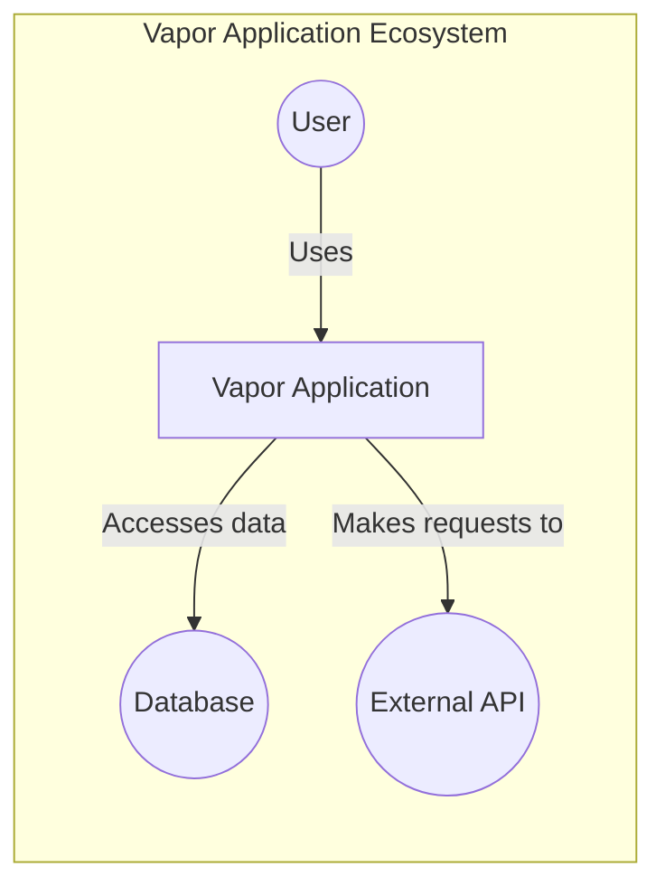
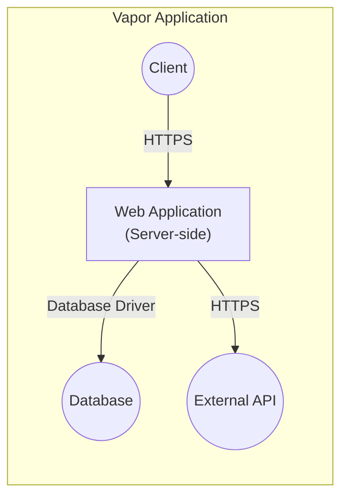
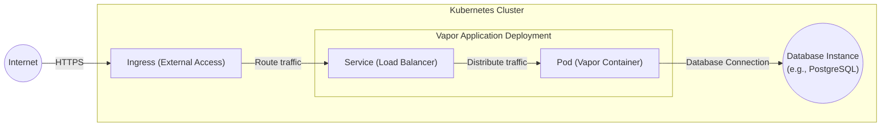
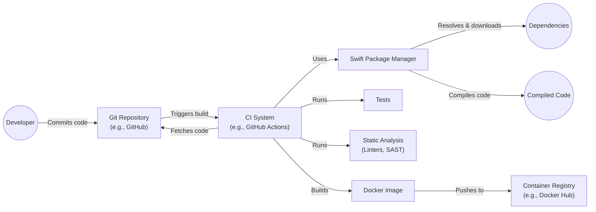

Okay, let's create a design document for the Vapor project, focusing on aspects relevant for threat modeling.

# BUSINESS POSTURE

Vapor is a web framework for Swift.  It's positioned as a flexible and performant alternative to other web frameworks, targeting developers who prefer Swift for both client-side (e.g., iOS, macOS) and server-side development.  The project is open-source and community-driven, with a focus on ease of use, extensibility, and performance.

Priorities:

*   Provide a stable, reliable, and performant web framework.
*   Maintain a clean, well-documented, and easy-to-use API.
*   Foster a strong and active community.
*   Ensure the framework is secure by default, minimizing common web vulnerabilities.
*   Enable developers to build secure applications easily.

Goals:

*   Become a leading web framework for Swift developers.
*   Attract a large and diverse community of contributors.
*   Support a wide range of use cases, from simple APIs to complex web applications.
*   Be a trusted and secure platform for building web services.

Business Risks:

*   Security vulnerabilities in the framework could lead to widespread exploitation of applications built with Vapor. This is the most critical risk.
*   Lack of adoption due to competition from other frameworks or perceived complexity.
*   Inability to keep up with changes in the Swift language and ecosystem.
*   Community fragmentation or lack of contribution.
*   Reputational damage due to security incidents or poor performance.

# SECURITY POSTURE

Existing Security Controls (based on the repository and common practices):

*   security control: Input validation: Vapor provides mechanisms for validating user input, helping to prevent common vulnerabilities like Cross-Site Scripting (XSS) and SQL injection. Described in documentation and implemented in routing and request handling.
*   security control: Parameterized queries: Vapor's database integrations (e.g., Fluent) encourage the use of parameterized queries, mitigating SQL injection risks. Described in documentation and implemented in database interaction layer.
*   security control: Templating engine (Leaf): Leaf, the recommended templating engine, provides features for escaping output, reducing XSS vulnerabilities. Described in documentation and implemented in view rendering.
*   security control: Routing security: Vapor's routing system allows developers to define routes and middleware, enabling control over access to resources. Described in documentation and implemented in routing layer.
*   security control: Middleware: Vapor's middleware architecture allows developers to implement custom security checks, such as authentication, authorization, and rate limiting. Described in documentation and implemented in request processing pipeline.
*   security control: Cryptography: Vapor provides access to Swift's CryptoKit and other cryptographic libraries, enabling developers to implement secure data handling. Described in documentation and implemented in separate modules.
*   security control: Dependency management: Swift Package Manager (SPM) is used for managing dependencies, allowing for tracking and updating of libraries. Described in documentation and implemented in project structure.
*   security control: Regular updates: The Vapor team and community actively maintain the framework, releasing updates to address security vulnerabilities and bugs. Described in release notes and implemented in project lifecycle.
*   security control: Security Policy: Vapor has a security policy that describes how to report vulnerabilities. Described in SECURITY.md file.
*   security control: Code reviews: Contributions to the Vapor codebase are subject to code review, helping to identify and prevent potential security issues. Described in contributing guidelines and implemented in development workflow.

Accepted Risks:

*   accepted risk: Reliance on third-party dependencies: While SPM helps manage dependencies, vulnerabilities in third-party libraries could still impact Vapor applications.
*   accepted risk: Developer error: Vapor provides tools for building secure applications, but developers can still introduce vulnerabilities through incorrect usage or custom code.
*   accepted risk: Zero-day vulnerabilities: Unknown vulnerabilities in Vapor or its dependencies could be exploited before patches are available.

Recommended Security Controls:

*   Implement Content Security Policy (CSP) middleware to mitigate XSS and data injection attacks.
*   Provide built-in support for Cross-Origin Resource Sharing (CORS) configuration.
*   Offer robust session management with secure cookie handling (HTTP-only, secure flags).
*   Include anti-CSRF (Cross-Site Request Forgery) token mechanisms.
*   Provide guidance and tools for secure file handling (e.g., preventing directory traversal).
*   Integrate with security scanning tools (static and dynamic analysis) in the CI/CD pipeline.

Security Requirements:

*   Authentication:
    *   Support for various authentication methods (e.g., API keys, JWT, OAuth 2.0).
    *   Secure password storage using strong hashing algorithms (e.g., bcrypt, Argon2).
    *   Account lockout mechanisms to prevent brute-force attacks.
    *   Session management with secure cookie handling.

*   Authorization:
    *   Role-Based Access Control (RBAC) or Attribute-Based Access Control (ABAC) mechanisms.
    *   Fine-grained control over access to resources and actions.
    *   Clear separation of privileges.

*   Input Validation:
    *   Strict validation of all user input, including headers, query parameters, and request bodies.
    *   Whitelist-based validation whenever possible.
    *   Clear error handling for invalid input.

*   Cryptography:
    *   Use of strong, industry-standard cryptographic algorithms.
    *   Secure key management practices.
    *   Protection of sensitive data in transit and at rest.
    *   Support for HTTPS (TLS) by default.

# DESIGN

## C4 CONTEXT

Element List:

*   Element:
    *   Name: User
    *   Type: Person
    *   Description: Represents a user interacting with the Vapor application, typically through a web browser or mobile app.
    *   Responsibilities: Initiates requests, views responses, provides input.
    *   Security controls: Browser security features, user-implemented security practices.

*   Element:
    *   Name: Vapor Application
    *   Type: Software System
    *   Description: The web application built using the Vapor framework.
    *   Responsibilities: Handles user requests, processes data, interacts with databases and external APIs, renders responses.
    *   Security controls: Input validation, output encoding, authentication, authorization, session management, CSRF protection, secure configuration.

*   Element:
    *   Name: External API
    *   Type: Software System
    *   Description: Any external API that the Vapor application interacts with (e.g., payment gateways, social media APIs).
    *   Responsibilities: Provides specific services or data to the Vapor application.
    *   Security controls: API keys, OAuth 2.0, rate limiting, input validation, secure communication (HTTPS).

*   Element:
    *   Name: Database
    *   Type: Software System
    *   Description: The database used by the Vapor application to store and retrieve data.
    *   Responsibilities: Stores data persistently, provides data access mechanisms.
    *   Security controls: Access control, encryption at rest, parameterized queries, database user permissions, auditing.

## C4 CONTAINER

Element List:

*   Element:
    *   Name: Client
    *   Type: Web Browser / Mobile App
    *   Description: Represents the client-side application interacting with the Vapor web application.
    *   Responsibilities: Sends requests to the server, renders responses, handles user interaction.
    *   Security controls: Browser security features, secure coding practices (for mobile apps).

*   Element:
    *   Name: Web Application (Server-side)
    *   Type: Web Application
    *   Description: The core Vapor application, running on a server, handling requests and generating responses.
    *   Responsibilities: Routing, request handling, middleware processing, business logic, data access, response generation.
    *   Security controls: Input validation, output encoding, authentication, authorization, session management, CSRF protection, secure configuration, error handling.

*   Element:
    *   Name: Database
    *   Type: Database
    *   Description: The database system used by the Vapor application.
    *   Responsibilities: Stores and retrieves data.
    *   Security controls: Access control, encryption at rest, parameterized queries, database user permissions, auditing.

*   Element:
    *   Name: External API
    *   Type: External Service
    *   Description: Any external API used by the Vapor application.
    *   Responsibilities: Provides external services or data.
    *   Security controls: API keys, OAuth 2.0, rate limiting, input validation, secure communication (HTTPS).

## DEPLOYMENT

Possible Deployment Solutions:

1.  Traditional Server (e.g., Ubuntu, CentOS) with a process manager (e.g., systemd, supervisord).
2.  Docker Container deployed to a container orchestration platform (e.g., Kubernetes, AWS ECS, Docker Swarm).
3.  Serverless platform (e.g., AWS Lambda, Google Cloud Functions, Azure Functions) - although this might require significant adaptation of the Vapor application structure.
4.  PaaS (Platform as a Service) offerings like Heroku, DigitalOcean App Platform, etc.

Chosen Solution (for detailed description): Docker Container on Kubernetes.

Element List:

*   Element:
    *   Name: Internet
    *   Type: External Network
    *   Description: The public internet.
    *   Responsibilities: Routes traffic to the Kubernetes cluster.
    *   Security controls: Network firewalls, DDoS protection.

*   Element:
    *   Name: Ingress
    *   Type: Kubernetes Ingress
    *   Description: Provides external access to the Vapor application, handling routing and TLS termination.
    *   Responsibilities: Routes incoming traffic to the appropriate service, terminates TLS connections.
    *   Security controls: TLS certificates, access control rules, web application firewall (WAF).

*   Element:
    *   Name: Service
    *   Type: Kubernetes Service
    *   Description: Provides a stable endpoint for accessing the Vapor application pods.
    *   Responsibilities: Load balances traffic across multiple pods.
    *   Security controls: Network policies.

*   Element:
    *   Name: Pod
    *   Type: Kubernetes Pod
    *   Description: Contains one or more Docker containers running the Vapor application.
    *   Responsibilities: Executes the Vapor application code.
    *   Security controls: Container security context, resource limits, network policies.

*   Element:
    *   Name: Database Instance
    *   Type: Managed Database Service (e.g., AWS RDS, Google Cloud SQL)
    *   Description: The managed database service used by the Vapor application.
    *   Responsibilities: Provides a database instance for the application.
    *   Security controls: Access control, encryption at rest, firewall rules, database user permissions, auditing.

*   Element:
    *   Name: Vapor Container
    *   Type: Docker Container
    *   Description: The Docker container image containing the compiled Vapor application and its dependencies.
    *   Responsibilities: Runs the Vapor application in an isolated environment.
    *   Security controls: Minimal base image, secure build process, vulnerability scanning.

## BUILD

The Vapor project uses Swift Package Manager (SPM) for building and dependency management.  A typical build process would involve:

1.  Developer writes code and commits to a Git repository (e.g., GitHub).
2.  A Continuous Integration (CI) system (e.g., GitHub Actions, Jenkins) is triggered by the commit.
3.  The CI system checks out the code.
4.  SPM resolves and downloads dependencies.
5.  SPM compiles the code, running tests.
6.  (Optional) Static analysis tools (e.g., linters, security scanners) are run on the code.
7.  (Optional) A Docker image is built, containing the compiled application and its runtime dependencies.
8.  (Optional) The Docker image is pushed to a container registry (e.g., Docker Hub, AWS ECR).

Security Controls in Build Process:

*   security control: Dependency management with SPM: Tracks and manages dependencies, allowing for updates and vulnerability checks.
*   security control: Automated testing: Unit and integration tests help ensure code quality and prevent regressions.
*   security control: Static analysis: Linters and SAST tools can identify potential security vulnerabilities in the code before deployment.
*   security control: Secure Docker image build: Using minimal base images, avoiding unnecessary dependencies, and scanning for vulnerabilities in the image.
*   security control: Authenticated access to container registry: Protecting the container registry with strong authentication and authorization.
*   security control: CI/CD pipeline security: Protecting the CI/CD system itself from unauthorized access and tampering.

# RISK ASSESSMENT

Critical Business Processes:

*   Serving web requests reliably and efficiently.
*   Protecting user data and privacy.
*   Maintaining the integrity and availability of the application.
*   Providing a secure platform for developers to build upon.

Data to Protect and Sensitivity:

*   User data (e.g., usernames, passwords, email addresses, personal information): High sensitivity.
*   Application data (depending on the specific application built with Vapor): Variable sensitivity, potentially including sensitive business data, financial information, or personal data.
*   Session data: Medium sensitivity.
*   API keys and secrets: High sensitivity.
*   Source code: Medium sensitivity.

# QUESTIONS & ASSUMPTIONS

Questions:

*   What specific types of applications are most commonly built with Vapor (e.g., e-commerce, social media, internal tools)? This helps prioritize security controls for common use cases.
*   What is the expected scale of deployments (e.g., number of users, requests per second)? This informs performance and scalability considerations.
*   What are the specific compliance requirements (e.g., GDPR, HIPAA, PCI DSS) that Vapor applications need to meet?
*   What level of support is provided for different database systems?
*   Are there any plans to integrate with specific security services or tools (e.g., vulnerability scanners, intrusion detection systems)?

Assumptions:

*   BUSINESS POSTURE: The Vapor project prioritizes security and aims to provide a secure framework by default.
*   SECURITY POSTURE: Developers using Vapor are expected to have a basic understanding of web security principles and best practices.
*   DESIGN: The deployment environment will be properly secured, with appropriate network segmentation, access controls, and monitoring.
*   DESIGN: The database will be configured securely, with encryption at rest and in transit, and strong access controls.
*   DESIGN: External APIs used by Vapor applications will be accessed securely, with appropriate authentication and authorization.
*   DESIGN: The build process will include security checks, such as static analysis and vulnerability scanning.