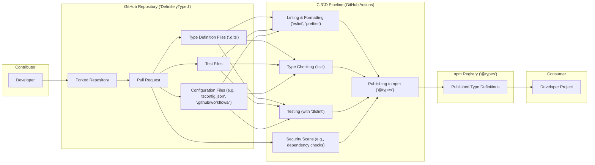

# Project Design Document: DefinitelyTyped

**Version:** 1.1
**Date:** October 26, 2023
**Author:** AI Software Architect

## 1. Introduction

This document provides a detailed design overview of the DefinitelyTyped project, hosted on GitHub at [https://github.com/DefinitelyTyped/DefinitelyTyped](https://github.com/DefinitelyTyped/DefinitelyTyped). This document aims to capture the key architectural components, data flows, and interactions within the project to facilitate future threat modeling activities. It focuses on the infrastructure and processes directly related to the DefinitelyTyped repository and its management, with a particular emphasis on aspects relevant to security.

## 2. Goals and Objectives

The primary goal of DefinitelyTyped is to provide high-quality, community-maintained TypeScript declaration files (`.d.ts`) for popular JavaScript libraries. These declaration files enable TypeScript developers to leverage strong typing with these libraries, enhancing code quality, maintainability, and the overall developer experience.

Key objectives include:

*   Maintaining a comprehensive and up-to-date collection of type definitions for a wide range of JavaScript libraries.
*   Ensuring the accuracy, consistency, and quality of the type definitions through rigorous testing and review processes.
*   Providing a collaborative and welcoming platform for community contributions and knowledge sharing.
*   Automating the processes of building, testing, reviewing, and publishing type definitions to ensure efficiency and reliability.
*   Making the type definitions easily discoverable and accessible to developers through the npm registry.

## 3. Target Audience

This document is intended for:

*   Security engineers tasked with performing threat modeling, security assessments, and penetration testing of the DefinitelyTyped project and its related infrastructure.
*   Developers who contribute to and maintain the DefinitelyTyped project, providing them with a clear understanding of the system's architecture and security considerations.
*   Operations and infrastructure teams responsible for supporting the project's infrastructure and ensuring its security and availability.
*   Anyone seeking a detailed understanding of the project's architecture, data flows, and security posture.

## 4. Scope

This design document covers the following aspects of the DefinitelyTyped project, focusing on elements relevant to security:

*   The structure of the GitHub repository, including key directories and their purpose.
*   The detailed contribution workflow for submitting, reviewing, and merging type definitions, highlighting potential security checkpoints.
*   The automated testing and validation processes, including the tools and methodologies used to ensure the quality and security of contributions.
*   The publishing mechanism for making type definitions available on the npm registry, including the involved steps and potential vulnerabilities.
*   The key roles and responsibilities within the project, particularly those with elevated privileges.
*   The technologies, tools, and infrastructure components involved in the project's operation.

This document does *not* cover:

*   The internal implementation details of the JavaScript libraries for which type definitions are provided.
*   The specific content and structure of individual type definition files beyond their role in the overall workflow.
*   The end-user experience of consuming type definitions in their projects, except where it directly relates to the security of the DefinitelyTyped distribution process.

## 5. High-Level Architecture

The DefinitelyTyped project operates as a collaborative, largely automated system for managing and distributing TypeScript declaration files. The core components and their interactions are illustrated below, emphasizing the flow of contributions and the automated checks involved:

## 6. Key Components

This section provides a more detailed description of the major components, highlighting aspects relevant to security:

*   **Contributor:** Individual developers who contribute type definitions. Security risks here include compromised accounts leading to malicious contributions.
*   **GitHub Repository ('DefinitelyTyped'):** The central, authoritative source of type definitions. Security considerations include access control, branch protection rules, and the integrity of the repository itself.
    *   **Forked Repository:** Contributors typically work on a fork of the main repository. This provides isolation but also introduces the risk of outdated or malicious forks.
    *   **Pull Request:** The primary mechanism for submitting contributions. This is a critical point for security review and automated checks.
    *   **Type Definition Files ('.d.ts'):** The core assets. Malicious or poorly written definitions can introduce vulnerabilities or type errors in consuming projects.
    *   **Test Files:** Crucial for verifying the correctness of type definitions. Insufficient or compromised tests can lead to the acceptance of flawed definitions.
    *   **Configuration Files:** Control the build, test, and linting processes. Tampering with these files could bypass security checks.
*   **CI/CD Pipeline (GitHub Actions):** Automates the validation and publishing process. This is a significant attack surface if compromised.
    *   **Linting & Formatting ('eslint', 'prettier'):** Enforces code style. While primarily for consistency, it can also catch some basic security issues.
    *   **Type Checking ('tsc'):**  Ensures the type definitions are syntactically correct. This is a fundamental security check.
    *   **Testing (with 'dtslint'):** A specialized linter for declaration files, enforcing best practices and identifying potential issues.
    *   **Security Scans (e.g., dependency checks):**  Crucial for identifying known vulnerabilities in dependencies used by the build process. This should include checks for outdated or insecure dependencies.
    *   **Publishing to npm ('@types'):**  The final step in making type definitions available. Secure credentials management and access control are vital here.
*   **npm Registry ('@types'):** The public repository where type definitions are hosted. Security concerns include package integrity and the potential for typosquatting attacks.
*   **Consumer:** Developers who use the published type definitions. They rely on the integrity and security of the `@types` packages.

## 7. Data Flow

The data flow within DefinitelyTyped, with a focus on security-relevant stages, is as follows:

1. **Contribution Initiation:** A developer creates or modifies type definition files in their forked repository.
2. **Pull Request Submission:** The developer submits a pull request to the main DefinitelyTyped repository. This action triggers the CI/CD pipeline.
3. **Automated Security and Quality Checks:** The CI/CD pipeline performs a series of automated checks:
    *   **Linting and Formatting:** Ensures code style consistency, potentially catching basic errors.
    *   **Type Checking:** Verifies the syntactic correctness of the type definitions.
    *   **dtslint Testing:**  Applies specialized linting rules for declaration files, identifying potential issues.
    *   **Security Scanning:** Analyzes dependencies for known vulnerabilities. *This step is crucial for preventing supply chain attacks.*
4. **Code Review:** Maintainers and community members review the pull request, examining the code for correctness, quality, and potential security issues. *This human review is a critical security control.*
5. **Iteration and Updates:** The contributor addresses feedback and updates the pull request. The automated checks are re-run to ensure the changes haven't introduced new issues.
6. **Merging:** Once the pull request passes all checks and receives sufficient approvals, it is merged into the main branch. *Access control for merging is a key security consideration.*
7. **Automated Publishing:** Upon merging, the CI/CD pipeline automatically triggers the publishing process. This involves building the package and publishing it to the npm registry using securely stored credentials. *Secure credential management is paramount here.*
8. **Publication on npm:** The type definitions are published to the npm registry under the `@types` scope.
9. **Consumption by Developers:** Developers install the published type definitions using package managers. *They implicitly trust the integrity of the `@types` packages.*

## 8. Security Considerations (Detailed)

This section expands on the initial security considerations, providing more specific examples and potential mitigations:

*   **Malicious Contributions:**
    *   **Threat:** A contributor with malicious intent submits type definitions containing vulnerabilities or backdoors (though less likely in type definitions compared to executable code).
    *   **Mitigation:** Rigorous code review processes, automated static analysis tools, and community scrutiny. Strong contributor guidelines and a code of conduct.
*   **Compromised Contributor Accounts:**
    *   **Threat:** An attacker gains access to a contributor's GitHub account and submits malicious pull requests.
    *   **Mitigation:** Encouraging strong passwords and multi-factor authentication for contributors. Monitoring for suspicious activity.
*   **Supply Chain Attacks:**
    *   **Threat:** Attackers compromise dependencies used in the CI/CD pipeline or the publishing process to inject malicious code into the published packages.
    *   **Mitigation:** Regularly scanning dependencies for known vulnerabilities using tools like Dependabot or Snyk. Pinning dependency versions. Using a secure build environment. Employing Software Bill of Materials (SBOM).
*   **Compromised CI/CD Pipeline:**
    *   **Threat:** Attackers gain control of the GitHub Actions workflows or the secrets used for publishing, allowing them to publish malicious packages.
    *   **Mitigation:** Securely storing and managing secrets using GitHub Secrets. Implementing workflow protections and approvals. Regularly auditing CI/CD configurations. Employing least privilege principles for workflow permissions.
*   **Vulnerabilities in Tooling:**
    *   **Threat:** Vulnerabilities in tools like `tsc`, `dtslint`, `eslint`, or `prettier` could be exploited to introduce malicious code or bypass security checks.
    *   **Mitigation:** Keeping tooling up-to-date with the latest security patches. Regularly reviewing the security advisories for these tools.
*   **Denial of Service (DoS):**
    *   **Threat:** Attackers could attempt to overload the GitHub repository with spam pull requests or target the CI/CD infrastructure to disrupt the project's operations.
    *   **Mitigation:** Implementing rate limiting and abuse detection mechanisms on GitHub. Utilizing GitHub's infrastructure protections.
*   **Data Integrity:**
    *   **Threat:** Unauthorized modifications to type definition files or configuration files could compromise the integrity of the project.
    *   **Mitigation:** Utilizing Git's integrity checks. Implementing branch protection rules to prevent direct pushes to critical branches. Requiring code reviews for all changes.
*   **Typosquatting:**
    *   **Threat:** Malicious actors could create packages with names similar to legitimate `@types` packages to trick developers into installing them.
    *   **Mitigation:**  Community awareness and reporting mechanisms. npm's package naming policies.

## 9. Technologies Used

*   **GitHub:** Version control, collaboration platform, issue tracking, and CI/CD infrastructure (GitHub Actions).
*   **TypeScript:** The core language for type definitions and test files.
*   **Node.js and npm:** Runtime environment and package manager for development, testing, and publishing.
*   **dtslint:** A specialized linter for TypeScript declaration files.
*   **ESLint and Prettier:** Code linting and formatting tools to ensure code quality and consistency.
*   **Various Security Scanning Tools:** (e.g., Dependabot, Snyk, or similar) for identifying vulnerabilities in dependencies.
*   **npm Registry:** The public registry for distributing packages.

## 10. Deployment Model

DefinitelyTyped is primarily a code repository hosted on GitHub. The build, test, and publishing processes are executed within the GitHub Actions environment, a cloud-based CI/CD service. The resulting type definition packages are deployed to the npm registry, a publicly accessible service. The project relies heavily on the security and availability of both GitHub and npm.

## 11. Future Considerations

*   **Enhanced Security Scanning Integration:** Implementing more comprehensive and automated security scanning tools directly within the CI/CD pipeline, including static analysis security testing (SAST).
*   **Formal Security Audits:** Conducting regular, independent security audits of the project's infrastructure, code, and processes.
*   **Improved Reviewer Training:** Providing training and resources for reviewers to better identify potential security vulnerabilities in contributions.
*   **Strengthening Identity and Access Management:**  Reviewing and strengthening access controls for maintainers and those with publishing privileges.
*   **Adopting a Security Champion Model:** Identifying and empowering individuals within the community to champion security best practices.
*   **Implementing Content Security Policy (CSP) for any web-based interfaces (if applicable).**
*   **Regular Penetration Testing:** Conducting periodic penetration testing to identify potential weaknesses in the project's infrastructure and workflows.

This document provides a comprehensive design overview of the DefinitelyTyped project, emphasizing aspects relevant to security. This information is intended to serve as a valuable resource for conducting thorough threat modeling and implementing appropriate security measures.
