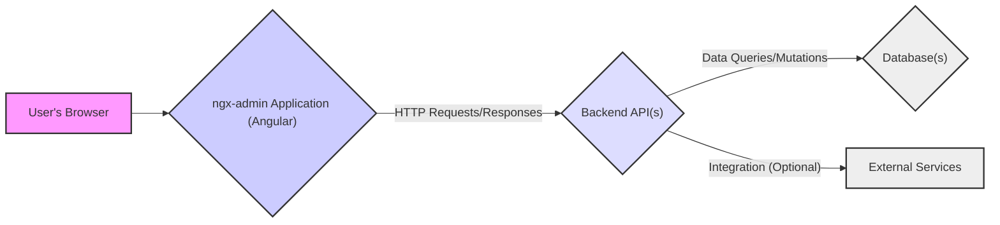
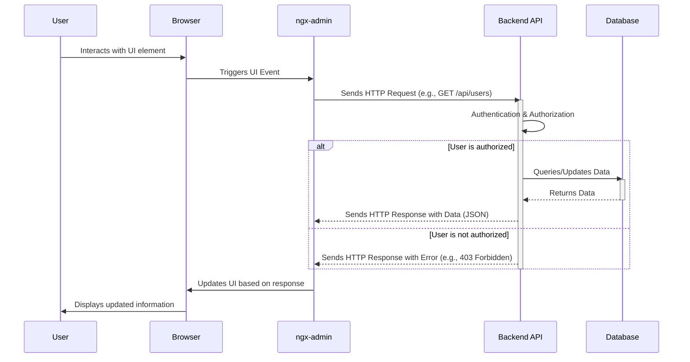

# Project Design Document: ngx-admin Dashboard Template

**Version:** 1.1
**Date:** October 26, 2023
**Author:** AI Software Architect

## 1. Introduction

This document provides a detailed design overview of the `ngx-admin` project, an open-source Angular admin dashboard template. This document is intended to serve as a foundational artifact for subsequent threat modeling activities, offering a comprehensive understanding of the system's architecture, components, interactions, and data flow. This understanding is critical for identifying potential security vulnerabilities.

## 2. Goals and Objectives

The primary goal of `ngx-admin` is to empower developers with a reusable, customizable, and well-structured foundation for building sophisticated admin interfaces. Key objectives include:

*   Providing a rich and visually appealing set of UI components and pre-built, responsive layouts.
*   Offering a modular and extensible architecture based on Angular best practices, facilitating customization and integration.
*   Serving as a practical demonstration of effective Angular development patterns and techniques.
*   Accelerating the development lifecycle of admin dashboards by providing a solid starting point.
*   Illustrating and supporting common authentication and authorization patterns typically found in web applications.

## 3. Architectural Overview

`ngx-admin` is fundamentally a client-side, single-page application (SPA) constructed using the Angular framework. It operates within the user's web browser and relies on communication with external backend service(s) via standard HTTP protocols.

**Components:**

*   **User's Browser:** The runtime environment where the compiled `ngx-admin` application executes. It renders the user interface, interprets JavaScript, and manages user interactions.
*   **ngx-admin Application (Angular):** The core frontend application built with Angular. It encompasses UI components, routing logic, state management, user interaction handling, and communication with backend APIs.
*   **Backend API(s):**  One or more independent backend services responsible for core business logic, data persistence, authentication, authorization, and potentially integration with other systems. The technology stack for the backend is not prescribed by `ngx-admin`.
*   **Database(s):** Persistent storage solutions utilized by the backend API(s) to store and manage application data. The specific database technology depends on the backend implementation.
*   **External Services:** Optional third-party services that the backend API(s) might interact with to extend functionality (e.g., payment processors, email services, analytics platforms).

## 4. Detailed Component Description

### 4.1. ngx-admin Application (Frontend)

*   **Angular Framework (Core):** Provides the foundational structure, dependency injection, data binding mechanisms, and component-based architecture for the application.
*   **Nebular UI Library:**  A suite of reusable and visually consistent UI components (buttons, forms, tables, layouts, themes) that accelerate development and ensure a cohesive user experience. This is a key dependency introducing its own potential vulnerabilities.
*   **Angular Router:** Manages navigation within the application, mapping URLs to specific components and enabling a single-page application experience. Incorrect configuration can lead to unauthorized access.
*   **Angular Modules:**  Organize related components, services, and directives into logical units, promoting modularity and maintainability.
*   **Angular Services:**  Encapsulate reusable business logic, data fetching (typically via HTTP to backend APIs), and state management. These are critical points for security considerations related to API interactions.
*   **Authentication Module (Frontend):** Handles user login and logout flows within the frontend. It might store authentication tokens temporarily in browser memory or session storage. It relies heavily on the backend for actual authentication.
*   **Authorization Logic (Frontend):** Implements client-side checks to control user access to specific features and views based on roles or permissions received from the backend. This is a UI-level control and should not be solely relied upon for security.
*   **Themeing and Styling Infrastructure:** Allows for customization of the application's visual appearance. Care must be taken to prevent CSS injection vulnerabilities.
*   **Angular CLI (Command Line Interface):**  Provides tools for development, building, testing, and deployment of the Angular application.
*   **State Management Libraries (Optional - e.g., NgRx, Akita, RxJS Subjects):**  Manage application state in a centralized and predictable manner, facilitating data sharing and updates across components. Improper state management can lead to data leaks or inconsistencies.
*   **Interceptors (Angular HTTP Client):** Allow for interception and modification of HTTP requests and responses. These can be used for adding authentication headers, logging, or error handling, but must be implemented securely.

### 4.2. Backend API(s)

*   **Technology Stack (Variable):** The specific technologies used for the backend are independent of `ngx-admin`. Common choices include Node.js (with Express or NestJS), Python (with Django or Flask), Java (with Spring Boot), or .NET.
*   **RESTful API Endpoints:**  The backend typically exposes a set of well-defined API endpoints following REST principles, which the `ngx-admin` frontend consumes via HTTP. Secure design of these endpoints is crucial.
*   **Authentication and Authorization (Backend):**  The authoritative source for verifying user identity and controlling access to resources. Common mechanisms include JWT (JSON Web Tokens), OAuth 2.0, or traditional session-based authentication. Robust implementation is paramount.
*   **Business Logic Layer:**  Contains the core application logic and rules, processing requests from the frontend and interacting with the data access layer.
*   **Data Access Layer (DAL):**  Responsible for interacting with the database(s), abstracting away the specifics of the database technology. Properly parameterized queries are essential to prevent SQL injection.
*   **Security Measures (Backend):**  Encompasses various techniques to protect the backend from attacks, including input validation, sanitization, rate limiting, protection against common web vulnerabilities (OWASP Top Ten), and secure configuration.

### 4.3. Database(s)

*   **Type (Variable):** The type of database depends on the application's requirements. Options include relational databases (e.g., PostgreSQL, MySQL), NoSQL databases (e.g., MongoDB, Couchbase), or graph databases.
*   **Data Storage and Persistence:**  Responsible for the persistent storage of application data. Proper data modeling and schema design are important for security and integrity.
*   **Access Control Mechanisms:**  Database-level security features that control which users or services can access and modify data. Principle of least privilege should be enforced.

## 5. Data Flow

The typical data flow within an application built with `ngx-admin` involves the following sequence of actions:

1. **User Interaction:** A user interacts with the `ngx-admin` interface within their web browser (e.g., navigates to a page, submits a form, clicks a button).
2. **Frontend Event Handling:** The browser triggers an event, which is handled by the `ngx-admin` application's Angular components.
3. **API Request Initiation:** The `ngx-admin` application, through its services, initiates an HTTP request to a specific endpoint of the Backend API. This request may include user input, parameters, and authentication credentials (e.g., a JWT).
4. **Backend Request Processing:** The Backend API receives the HTTP request. It first authenticates the user (verifies their identity) and then authorizes the request (checks if the user has permission to perform the requested action).
5. **Business Logic Execution:** If authorized, the Backend API executes the relevant business logic to fulfill the request. This might involve data retrieval, manipulation, or creation.
6. **Database Interaction (if necessary):** The Backend API interacts with the database(s) to retrieve or persist data as required by the business logic.
7. **API Response Generation:** The Backend API constructs an HTTP response containing the requested data (e.g., in JSON format), a status code indicating success or failure, and potentially other relevant information.
8. **Frontend Response Handling:** The `ngx-admin` application receives the HTTP response from the Backend API.
9. **UI Update:** The `ngx-admin` application updates the user interface based on the received data or status code, providing feedback to the user.

## 6. Security Considerations (Pre-Threat Model)

This section highlights potential security considerations and vulnerabilities that should be examined during a formal threat modeling exercise.

*   **Frontend-Specific Risks:**
    *   **Cross-Site Scripting (XSS):** Vulnerabilities in templates or custom components that allow attackers to inject malicious scripts into the application, potentially stealing user credentials or performing actions on their behalf.
    *   **Insecure Client-Side Data Handling:**  Storing sensitive information in local storage or session storage without proper encryption, making it vulnerable to access by malicious scripts.
    *   **Exposure of Sensitive Information:**  Accidental inclusion of API keys, secrets, or internal implementation details in the client-side code, which can be discovered by inspecting the JavaScript.
    *   **Dependency Vulnerabilities (Frontend):**  Using outdated or vulnerable versions of Angular, Nebular, or other JavaScript libraries, which can be exploited by attackers. Regular dependency updates are crucial.
    *   **Insufficient Content Security Policy (CSP):**  A lack of a strong CSP can make the application more susceptible to XSS attacks by not restricting the sources from which the browser can load resources.
    *   **Client-Side Logic Vulnerabilities:** Flaws in the frontend logic that could be exploited to bypass authorization checks or manipulate data before sending it to the backend.

*   **Authentication and Authorization Weaknesses:**
    *   **Weak or Non-Existent Backend Authentication:**  Lack of proper mechanisms to verify user identity on the backend, allowing unauthorized access.
    *   **Insecure Token Management:**  Improper storage or handling of authentication tokens (e.g., storing JWTs in local storage without precautions), making them susceptible to theft.
    *   **Insufficient Authorization Checks (Backend):**  Not adequately verifying user permissions before granting access to resources or performing actions on the backend.
    *   **Vulnerabilities in Authentication Flows:**  Susceptibility to attacks like session fixation, cross-site request forgery (CSRF) during login, or brute-force attacks on login endpoints.

*   **Backend API Security Deficiencies:**
    *   **SQL Injection:** Vulnerabilities in database queries where user-supplied input is not properly sanitized, allowing attackers to execute arbitrary SQL commands.
    *   **Insecure API Endpoints:**  API endpoints that expose sensitive data without proper authorization or use insecure methods (e.g., GET requests for sensitive operations).
    *   **Lack of Input Validation (Backend):**  Failure to validate and sanitize user input on the backend, leading to vulnerabilities like command injection or data corruption.
    *   **Cross-Site Request Forgery (CSRF):**  Vulnerabilities that allow attackers to trick authenticated users into performing unintended actions on the web application.
    *   **Denial of Service (DoS) Vulnerabilities:**  Flaws that can be exploited to overload the backend server and make it unavailable to legitimate users.
    *   **Exposure of Sensitive Configuration Data:**  Storing API keys, database credentials, or other sensitive information in easily accessible configuration files or environment variables.
    *   **Insecure Direct Object References (IDOR):**  Lack of proper authorization when accessing resources based on user-supplied IDs, allowing users to access resources they shouldn't.

*   **Communication Channel Security:**
    *   **Lack of HTTPS Encryption:**  Communication between the browser and the backend not being encrypted using HTTPS, allowing attackers to eavesdrop on sensitive data.
    *   **Insecure Handling of API Keys and Secrets:**  Storing API keys or other secrets directly in the frontend code or version control.

*   **Dependency Management Risks (Backend):**
    *   Using outdated or vulnerable backend libraries and frameworks, which can introduce security flaws.

*   **Deployment Environment Security:**
    *   Insecure server configurations, exposing unnecessary services or ports.
    *   Lack of proper firewall rules or network segmentation.

## 7. Dependencies

The `ngx-admin` project relies on a range of dependencies, which can be broadly categorized:

*   **Core Angular Ecosystem:**
    *   `@angular/core`: The fundamental modules of the Angular framework.
    *   `@angular/common`: Common directives, pipes, and services.
    *   `@angular/compiler`:  The Angular compiler.
    *   `@angular/router`:  For navigation and routing within the application.
    *   `@angular/forms`:  For handling forms and user input.
    *   `@angular/platform-browser`:  For running the application in a web browser.
    *   `@angular/platform-browser-dynamic`: For dynamic compilation.
    *   `@angular/cli`:  The Angular command-line interface.
*   **UI Library:**
    *   `@nebular/*`:  The Nebular UI library components and themes.
*   **Reactive Programming:**
    *   `rxjs`:  For asynchronous and event-based programming.
*   **State Management (Optional):**
    *   `@ngrx/*` (if NgRx is used)
    *   `@datorama/akita` (if Akita is used)
*   **Build and Development Tools:**
    *   `typescript`:  The primary programming language.
    *   `node.js` and `npm` or `yarn`: For package management and running development scripts.
*   **Other Utility Libraries:**  Various other npm packages for specific functionalities.

The backend API will have its own separate set of dependencies based on its chosen technology stack and required functionalities.

## 8. Deployment Model

`ngx-admin`, being a frontend application, is typically deployed as a set of static files. Common deployment strategies include:

*   **Static Web Server:** Deploying the compiled application files to a web server like Nginx or Apache, which serves the files directly to the user's browser.
*   **Content Delivery Network (CDN):** Distributing the static assets across a geographically distributed network of servers for improved performance and availability.
*   **Cloud Storage (e.g., AWS S3, Google Cloud Storage, Azure Blob Storage):**  Storing the static files in cloud storage and configuring it for public access.
*   **Integration with Backend Deployment:**  In some cases, the frontend application might be served by the same server or infrastructure as the backend API.

Key considerations for deployment include:

*   **HTTPS Configuration:**  Ensuring that the web server or CDN is configured to serve the application over HTTPS using valid SSL/TLS certificates.
*   **Caching Strategy:**  Implementing appropriate caching mechanisms to improve performance and reduce server load.
*   **Security Headers:**  Configuring security-related HTTP headers (e.g., Content Security Policy, HTTP Strict Transport Security, X-Frame-Options) to enhance security.
*   **Deployment Pipeline:**  Establishing an automated deployment pipeline for efficient and reliable deployments.

The backend API will have its own deployment model, which might involve deploying to cloud platforms (e.g., AWS, Azure, Google Cloud), containerization (e.g., Docker, Kubernetes), or traditional server deployments.

## 9. Conclusion

This revised design document provides a more detailed and nuanced understanding of the `ngx-admin` project. It elaborates on the architecture, components, data flow, and critically, expands on the initial security considerations. This document serves as a solid foundation for conducting a thorough threat modeling exercise, allowing security professionals and developers to identify and mitigate potential vulnerabilities effectively. By understanding the intricacies of the system, we can build more secure and robust applications leveraging the `ngx-admin` template.