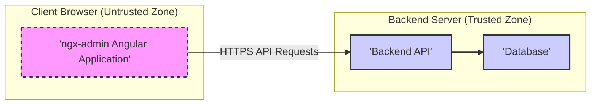

# Project Design Document: ngx-admin Dashboard Template

**Project Name:** ngx-admin Dashboard Template

**Project Repository:** [https://github.com/akveo/ngx-admin](https://github.com/akveo/ngx-admin)

**Document Version:** 1.1

**Date:** 2023-10-27

**Author:** Gemini (AI Expert)

## 1. Introduction

This document provides an enhanced design overview of the ngx-admin project, an open-source Angular admin dashboard template. Building upon the previous version, this iteration aims for greater clarity, detail, and a stronger focus on aspects relevant to threat modelling.  This document serves as a robust foundation for subsequent threat modelling activities, offering a comprehensive understanding of the system's architecture, components, technologies, and security considerations.

ngx-admin is a sophisticated frontend template constructed using Angular, Nebular, and a suite of modern web technologies. It delivers a production-ready user interface (UI) ideal for developing admin panels, data dashboards, and content management systems (CMS). While primarily a frontend application, its design anticipates seamless integration with backend services to create complete application experiences. This document comprehensively covers both the frontend architecture of ngx-admin and its typical interaction patterns with backend systems, providing a holistic view for security analysis.

## 2. Project Goals and Scope

*   **Goal:** To provide a highly reusable, customizable, and feature-rich Angular-based admin dashboard template that accelerates development and promotes best practices in frontend architecture.
*   **Scope:** This document focuses on the architectural design of the ngx-admin template and its standard integration points with backend systems, specifically from a security perspective. It encompasses:
    *   Refined high-level architecture overview, emphasizing security zones.
    *   Detailed component descriptions with security implications highlighted.
    *   Data flow analysis, tracing data origins and destinations for security context.
    *   Technology stack inventory, identifying potential technology-specific vulnerabilities.
    *   Typical deployment architecture patterns, outlining common deployment security concerns.
    *   In-depth high-level security considerations, expanded to guide threat modelling.

*   **Out of Scope:**
    *   Specific backend implementations (ngx-admin's backend-agnostic nature remains a core characteristic).
    *   Granular code-level security audits (this document prepares for, but does not replace, code review).
    *   Execution of threat modelling itself (this document is a prerequisite for effective threat modelling).
    *   Extensive customization guides for ngx-admin (focus remains on the core template design).
    *   Performance optimization strategies (while important, security is the primary focus here).

## 3. Architecture Overview - Security Focused

ngx-admin maintains a component-based architecture, characteristic of modern Angular applications, but with a security-conscious lens. It operates as a Single Page Application (SPA) within the user's web browser, minimizing server-side rendering and maximizing client-side interactivity. Communication with backend services via APIs is central to its operation, facilitating data exchange and application logic execution.

The following architectural diagram highlights security zones and data flow paths, crucial for threat modelling:



**Security Zone Definitions:**

*   **Client Browser (Untrusted Zone):** This zone represents the user's web browser, an environment inherently untrusted from the application's perspective.  Code running here is vulnerable to client-side attacks and should not be relied upon for enforcing security policies.  Data handled in this zone should be considered potentially compromised.
*   **Backend Server (Trusted Zone):** This zone encompasses the backend API and database servers, assumed to be under the application owner's control and considered a more trusted environment. Security controls are primarily enforced within this zone. However, even within this zone, defense-in-depth principles should be applied.

**Components (Security Context):**

*   **ngx-admin Angular Application (Frontend - Untrusted Zone):**  Responsible for UI rendering and user interaction within the untrusted browser environment. Security concerns here include client-side vulnerabilities (XSS), exposure of sensitive data in the browser's memory, and reliance on backend security for critical functions.
*   **Backend API (Trusted Zone):**  Acts as the gatekeeper to application data and logic.  Crucial for enforcing authentication, authorization, input validation, and protecting against server-side attacks.  This component resides within the trusted zone.
*   **Database (Trusted Zone):** Stores persistent application data within the trusted zone. Security focuses on access control, data encryption, and preventing unauthorized data access or modification.

## 4. Component Breakdown - Security Implications

### 4.1. ngx-admin Angular Application (Frontend - Untrusted Zone)

*   **Functionality (Security Perspective):**
    *   **UI Rendering (XSS Risk):**  Dynamically renders UI based on data, creating potential XSS vulnerabilities if data is not properly sanitized by the backend and handled securely by the frontend.
    *   **User Interaction Handling (Input Handling):** Captures user input, which must be treated as untrusted and should *never* be directly used in sensitive operations or backend queries without backend validation.
    *   **Navigation and Routing (Authorization UI):**  Controls navigation, which can be used to implement frontend-level authorization UI (hiding/showing features), but *must not* be relied upon for actual security enforcement.
    *   **Data Presentation (Data Exposure):** Displays data received from the backend.  Care must be taken to avoid exposing sensitive data unnecessarily in the UI or browser's developer tools.
    *   **API Communication (Secure Communication):** Initiates API requests to the backend.  Ensuring HTTPS and secure API communication protocols is critical.
    *   **State Management (Client-Side Storage):** Manages application state, which may include temporary data.  Sensitive data should *never* be stored persistently in client-side storage (local storage, session storage, cookies) without strong encryption and careful consideration of risks.
    *   **Authentication & Authorization (Frontend UI/Token Handling):**  Handles frontend aspects of authentication, typically managing tokens (e.g., JWT) received from the backend. Secure storage and handling of tokens in the browser are crucial.  Frontend authorization is primarily UI-driven and not a security control.

*   **Technologies Used (Security Relevance):**
    *   **Angular (Security Framework):**  Provides built-in security features (XSS protection, sanitization).  Proper utilization of Angular's security mechanisms is essential.
    *   **TypeScript (Type Safety):**  Offers type safety, potentially reducing certain types of programming errors that could lead to vulnerabilities.
    *   **HTML (DOM Manipulation):**  Direct DOM manipulation should be minimized and carefully reviewed for potential XSS risks.
    *   **CSS (Styling/UI Redress):**  While primarily for styling, CSS vulnerabilities (e.g., UI redress attacks) are less common but should be considered in specific contexts.
    *   **JavaScript (Client-Side Logic):**  Client-side JavaScript is inherently untrusted.  Security-sensitive logic should reside on the backend.
    *   **Nebular UI Framework (Component Security):**  Reliance on a third-party UI framework introduces a dependency on its security.  Regularly update Nebular and review security advisories.
    *   **RxJS (Asynchronous Operations):**  Improper handling of asynchronous operations can sometimes lead to race conditions or vulnerabilities.
    *   **ngx-translate (Localization Security):**  Localization files should be carefully managed to prevent injection of malicious content through translation strings.
    *   **ECharts/Leaflet (Third-Party Libraries):**  Using third-party libraries introduces dependencies on their security.  Keep libraries updated and review security advisories.

*   **Data Flow (within Frontend - Security Perspective):**
    *   **User Interaction -> Component Logic (Input Sanitization - Frontend *Not* Responsible):** Frontend components should *not* be responsible for primary input sanitization. This is a backend responsibility. Frontend may perform basic UI-level validation for user experience.
    *   **Component Logic -> API Service (Secure API Calls):** API services must ensure secure communication (HTTPS) and proper handling of API requests and responses.
    *   **API Service -> Backend API (Network Security):** Network communication between frontend and backend must be secured (HTTPS).
    *   **Backend API -> API Service (Response Handling):** API services must handle backend responses securely, especially error responses that might reveal sensitive information.
    *   **API Service -> Component Logic (Data Sanitization - Backend Responsibility):** Components should expect data from the backend to be sanitized. However, frontend-side output encoding is still important to prevent XSS in the browser.
    *   **Component Logic -> UI Rendering (Output Encoding):** Components must use Angular's built-in mechanisms to prevent XSS when rendering data in the UI (e.g., using Angular's sanitization features, template binding).

*   **Key Dependencies (Security Risks):**
    *   **Web Browser (Browser Vulnerabilities):**  Relies on the security of the user's web browser. Browser vulnerabilities can directly impact the application. Encourage users to use up-to-date browsers.
    *   **Backend API (Backend Security is Paramount):**  Frontend security is heavily dependent on the security of the backend API. A compromised backend can undermine all frontend security efforts.
    *   **Network Connectivity (Man-in-the-Middle Attacks):**  Unsecured network connections (non-HTTPS) are vulnerable to man-in-the-middle attacks.

### 4.2. Backend API (Trusted Zone)

*   **Functionality (Security Perspective):**
    *   **Data Management (Data Integrity & Confidentiality):**  Responsible for maintaining data integrity and confidentiality. Implement access controls, encryption, and data validation.
    *   **Business Logic Execution (Authorization Enforcement):** Enforces business logic and, critically, *authorization rules*.  This is where access control decisions are made.
    *   **Authentication and Authorization (Identity Management):**  Manages user authentication (verifying identity) and authorization (controlling access). Secure authentication mechanisms (OAuth 2.0, JWT) are essential.
    *   **API Endpoint Management (API Security):**  Designs and manages API endpoints, ensuring they are secure and follow security best practices (e.g., least privilege, secure defaults).
    *   **Data Validation and Sanitization (Input Security):**  Performs *critical* data validation and sanitization on all input received from the frontend to prevent injection attacks.

*   **Technologies Used (Security Relevance - Example - could vary):**
    *   **Node.js/Python/Java/.NET (Runtime Security):**  The chosen runtime environment's security is important. Keep runtime environments updated and follow security best practices for the chosen platform.
    *   **Express/Flask/Django/Spring Boot/ASP.NET Core (Framework Security):**  Frameworks provide security features, but also can have vulnerabilities. Keep frameworks updated and use security features correctly.
    *   **RESTful API Design (API Security Best Practices):**  RESTful principles can promote secure API design if implemented correctly.
    *   **JSON (Data Security):**  JSON is a common data format, but vulnerabilities can arise from improper parsing or handling of JSON data.
    *   **JWT (Authentication/Authorization Security):**  JWTs are widely used for authentication, but vulnerabilities can occur if JWTs are not properly generated, verified, or stored. Secure key management is crucial.
    *   **Database Drivers/ORMs (Database Injection Risks):**  ORMs can help prevent SQL injection, but improper use can still introduce vulnerabilities. Use parameterized queries and ORM security features.

*   **Data Flow (Security Perspective):**
    *   **Frontend Application -> Backend API (API Gateway/Firewall):**  Consider using an API gateway or web application firewall (WAF) to protect the backend API from malicious requests.
    *   **Backend API -> Database (Secure Database Connections):**  Ensure secure connections to the database (e.g., using TLS/SSL). Use database connection pooling and least privilege principles for database access.
    *   **Database -> Backend API (Data Leakage Prevention):**  Minimize the amount of data retrieved from the database to only what is necessary for the request, preventing potential data leakage.
    *   **Backend API -> Frontend Application (Secure Responses):**  Send secure responses to the frontend, avoiding exposing sensitive information in error messages or response headers.

*   **Key Dependencies (Security Risks):**
    *   **Database (Database Security is Critical):**  Backend API security is fundamentally tied to database security. A compromised database can lead to complete application compromise.
    *   **Server Environment (Server Hardening):**  The security of the server environment (operating system, network configuration) is crucial. Server hardening and regular security patching are essential.
    *   **Network Connectivity (Network Segmentation):**  Proper network segmentation can limit the impact of a security breach. Isolate the backend API and database servers in secure network zones.

### 4.3. Database (Trusted Zone)

*   **Functionality (Security Perspective):**
    *   **Data Persistence (Data Durability & Integrity):**  Ensures data durability and integrity. Implement backup and recovery mechanisms and data validation rules.
    *   **Data Retrieval (Access Control):**  Provides mechanisms to query and retrieve data, enforcing strict access control to prevent unauthorized data access.
    *   **Data Integrity (Data Validation & Constraints):**  Enforces data integrity through validation rules, constraints, and database-level security features.
    *   **Data Security (Confidentiality & Availability):**  Primary responsibility for data confidentiality and availability. Implement encryption, access control, and redundancy.

*   **Technologies Used (Security Relevance - Example - could vary):**
    *   **Relational Databases (SQL) (SQL Injection Prevention):**  SQL databases are susceptible to SQL injection attacks. Use parameterized queries and ORM security features to mitigate this risk.
        *   PostgreSQL, MySQL, Microsoft SQL Server (Specific Security Features): Each database system has its own security features (e.g., row-level security, encryption). Utilize these features.
    *   **NoSQL Databases (NoSQL Injection, Access Control):**  NoSQL databases also have security considerations, including NoSQL injection vulnerabilities and access control mechanisms.
        *   MongoDB, Cassandra, Redis (Specific Security Features):  Each NoSQL database has its own security model and features. Understand and utilize these features.

*   **Data Flow (Security Perspective):**
    *   **Backend API -> Database (Database Authentication):**  Backend API must authenticate to the database using secure credentials. Avoid storing database credentials directly in code; use environment variables or secrets management systems.
    *   **Database -> Backend API (Data Sanitization - Backend Responsibility):** While the database enforces some data integrity, the backend API is still responsible for sanitizing data retrieved from the database before sending it to the frontend, especially if the database might contain data from other sources.

*   **Key Dependencies (Security Risks):**
    *   **Database Server Environment (OS Security):**  The security of the database server's operating system is critical. Harden the OS and keep it updated.
    *   **Backend API (Backend Security Dependence):**  Database security is heavily reliant on the security of the backend API that accesses it. Secure backend API design and implementation are essential for database security.

## 5. Data Flow Diagram (Detailed) - Security Context

This diagram refines the detailed data flow, adding security context and highlighting potential security checkpoints.

```mermaid
graph LR
    subgraph "Client Browser (Untrusted)"
        A["'User Interaction'"] --> B["'Angular Components'"]
        B --> C["'Angular Services (API Client)'"]
    end
    C -- "HTTPS Request (Untrusted Input)" --> D["'Backend API Endpoint (Input Validation)'"]
    D -- "Authorization Check" --> E["'Backend API Logic (Business Logic, Authorization)'"]
    E -- "Database Query (Parameterized)" --> F["'Database (Access Control, Encryption)'"]
    F -- "Database Response (Sanitized Data)" --> G["'Database'"]
    G --> H["'Database Response'"]
    H --> E
    E -- "API Response (Sanitized Output)" --> I["'Backend API Response'"]
    I -- "HTTPS Response (Sanitized Data)" --> C
    C --> B
    B --> J["'UI Update (Output Encoding)'"]
    style A fill:#eee,stroke:#333,stroke-width:1px,stroke-dasharray: 5 5
    style B fill:#eee,stroke:#333,stroke-width:1px,stroke-dasharray: 5 5
    style C fill:#eee,stroke:#333,stroke-width:1px,stroke-dasharray: 5 5
    style D fill:#ccf,stroke:#333,stroke-width:2px
    style E fill:#ccf,stroke:#333,stroke-width:2px
    style F fill:#ccf,stroke:#333,stroke-width:2px
    style G fill:#ccf,stroke:#333,stroke-width:2px
    style H fill:#ccf,stroke:#333,stroke-width:2px
    style I fill:#ccf,stroke:#333,stroke-width:2px
    style J fill:#eee,stroke:#333,stroke-width:1px,stroke-dasharray: 5 5
    linkStyle 0,1,2,3,4,5,6,7,8,9 stroke-width:1.5px,stroke:#333;
    classDef untrustedZone fill:#eee,stroke:#333,stroke-width:1px,stroke-dasharray: 5 5
    classDef trustedZone fill:#ccf,stroke:#333,stroke-width:2px
    class A,B,C,J untrustedZone
    class D,E,F,G,H,I trustedZone
```

**Data Flow Steps (Security Highlights):**

1.  **User Interaction (Untrusted Input):** User input from the untrusted browser.
2.  **Angular Components (Untrusted):**  Frontend components handle user input.
3.  **Angular Services (API Client) (Untrusted):**  Prepare API requests.
4.  **Backend API Endpoint (Input Validation - Security Checkpoint):**  Backend API receives the request and *must* perform input validation to sanitize and validate all incoming data.
5.  **Backend API Logic (Authorization Check - Security Checkpoint):**  Backend API performs authorization checks to ensure the user has permission to perform the requested action.
6.  **Database Query (Parameterized Queries - Security Best Practice):**  Backend API constructs database queries, using parameterized queries to prevent SQL injection.
7.  **Database (Access Control, Encryption - Security Measures):** Database enforces access control and data encryption.
8.  **Database Response (Sanitized Data - Backend Responsibility):** Database returns data. Backend API is responsible for sanitizing data before sending it to the frontend.
9.  **Backend API Response (Sanitized Output - Security Checkpoint):** Backend API constructs the response, ensuring output is sanitized to prevent injection vulnerabilities in the frontend.
10. **Angular Services (API Client) (Untrusted):** Receive API response.
11. **Angular Components (Untrusted):** Process data from the API response.
12. **UI Update (Output Encoding - Security Checkpoint):** Angular components update the UI, using output encoding to prevent XSS vulnerabilities in the browser.

## 6. Technology Stack Summary - Security Focus

*   **Frontend (Untrusted Zone):**
    *   Angular (XSS Prevention, Security Features)
    *   TypeScript (Type Safety)
    *   HTML (DOM Security)
    *   CSS (UI Redress Considerations)
    *   JavaScript (Client-Side Security Risks)
    *   Nebular UI Framework (Third-Party Dependency Security)
    *   RxJS (Asynchronous Security)
    *   ngx-translate (Localization Injection)
    *   ECharts/Leaflet (Third-Party Dependency Security)
*   **Backend (Trusted Zone - Example - Implementation Dependent):**
    *   Node.js / Python / Java / .NET (Runtime Security)
    *   Express / Flask / Django / Spring Boot / ASP.NET Core (Framework Security)
    *   RESTful API (API Security Design)
    *   JSON (Data Handling Security)
    *   JWT (Authentication/Authorization Security)
*   **Database (Trusted Zone - Example - Implementation Dependent):**
    *   PostgreSQL / MySQL / MongoDB / etc. (Database Security Features, Injection Risks)

## 7. Deployment Architecture (Typical Example) - Security Considerations

This deployment architecture emphasizes security components and considerations at each layer.

```mermaid
graph LR
    A["'User Browser (Untrusted)'"] --> B["'CDN (Security Headers, WAF - Optional)'"]
    B --> C["'Web Server (Frontend) (Security Hardening)'"]
    C --> D["'Load Balancer (DDoS Protection, TLS Termination)'"]
    D --> E["'Backend API Servers (Security Hardening, WAF - Optional)'"]
    E --> F["'Database Servers (Firewall, Encryption, Access Control)'"]
    style A fill:#eee,stroke:#333,stroke-width:1px,stroke-dasharray: 5 5
    style B fill:#eee,stroke:#333,stroke-width:1px,stroke-dasharray: 5 5
    style C fill:#eee,stroke:#333,stroke-width:1px,stroke-dasharray: 5 5
    style D fill:#ccf,stroke:#333,stroke-width:2px
    style E fill:#ccf,stroke:#333,stroke-width:2px
    style F fill:#ccf,stroke:#333,stroke-width:2px
    linkStyle 0,1,2,3,4 stroke-width:1.5px,stroke:#333;
    classDef untrustedZone fill:#eee,stroke:#333,stroke-width:1px,stroke-dasharray: 5 5
    classDef trustedZone fill:#ccf,stroke:#333,stroke-width:2px
    class A,B,C untrustedZone
    class D,E,F trustedZone
```

**Deployment Components (Security Focus):**

*   **User Browser (Untrusted):**  Security posture depends on the user's browser and security practices.
*   **CDN (Content Delivery Network) (Security Headers, WAF - Optional):**  CDN can enhance security by:
    *   Serving static assets over HTTPS.
    *   Adding security headers (CSP, HSTS, X-Frame-Options, etc.).
    *   Optionally integrating with a Web Application Firewall (WAF) for basic frontend protection.
*   **Web Server (Frontend) (Security Hardening):**  Web server should be hardened by:
    *   Disabling unnecessary features and modules.
    *   Applying security patches regularly.
    *   Configuring secure TLS settings.
*   **Load Balancer (DDoS Protection, TLS Termination):** Load balancer can provide:
    *   DDoS protection to mitigate denial-of-service attacks.
    *   TLS termination to offload encryption/decryption from backend servers.
*   **Backend API Servers (Security Hardening, WAF - Optional):** Backend API servers require:
    *   Security hardening of the operating system and application server.
    *   Regular security patching.
    *   Optionally, a WAF for deeper API request inspection and protection.
*   **Database Servers (Firewall, Encryption, Access Control):** Database servers must be secured by:
    *   Firewall rules to restrict access to only authorized backend API servers.
    *   Data encryption at rest and in transit.
    *   Strong access control mechanisms.

**Deployment Flow (Security Considerations):**

1.  **User Browser Request (HTTPS):** All communication should be over HTTPS.
2.  **CDN Security (Optional):** CDN can add security layers as described above.
3.  **Web Server Security (Hardening):** Web server security configuration is crucial.
4.  **Load Balancer Security (DDoS, TLS):** Load balancer provides DDoS protection and TLS termination.
5.  **Backend API Security (WAF, Hardening):** Backend API servers are the primary security enforcement point.
6.  **Database Security (Firewall, Encryption):** Database security is paramount for data protection.

## 8. Security Considerations (Detailed)

This section expands on the high-level security considerations, providing more specific examples of threats and mitigation strategies for each layer.

*   **Frontend Security (Client-Side Threats):**
    *   **Cross-Site Scripting (XSS):**
        *   **Threat:** Malicious scripts injected into the frontend application, potentially stealing user credentials, session tokens, or performing actions on behalf of the user.
        *   **Mitigation:**
            *   **Backend Input Sanitization:**  Backend *must* sanitize all user-provided data before sending it to the frontend.
            *   **Angular Security Features:** Utilize Angular's built-in XSS protection mechanisms (template binding, sanitization services).
            *   **Content Security Policy (CSP):** Implement a strict CSP to control the sources of content the browser is allowed to load.
            *   **Output Encoding:**  Ensure proper output encoding when displaying data in the UI.
    *   **Cross-Site Request Forgery (CSRF):**
        *   **Threat:**  Attacker tricks a logged-in user into making unintended requests to the backend API, potentially performing unauthorized actions.
        *   **Mitigation:**
            *   **CSRF Tokens:** Implement CSRF tokens (synchronizer tokens) to verify the origin of requests. Angular provides built-in CSRF protection mechanisms.
            *   **SameSite Cookie Attribute:** Use the `SameSite` cookie attribute to mitigate CSRF risks in some scenarios.
    *   **Client-Side Data Exposure:**
        *   **Threat:** Sensitive data stored in browser memory or client-side storage (local storage, session storage, cookies) could be accessed by malicious scripts or browser extensions.
        *   **Mitigation:**
            *   **Minimize Client-Side Storage of Sensitive Data:** Avoid storing sensitive data in client-side storage if possible.
            *   **Encryption:** If sensitive data must be stored client-side, encrypt it using strong client-side encryption (with extreme caution and understanding of key management challenges).
            *   **Secure Cookie Flags:** Use `HttpOnly` and `Secure` flags for cookies to limit access and ensure transmission over HTTPS.
    *   **Dependency Vulnerabilities:**
        *   **Threat:**  Vulnerabilities in frontend dependencies (Angular, Nebular, third-party libraries) could be exploited by attackers.
        *   **Mitigation:**
            *   **Regular Dependency Updates:**  Keep all frontend dependencies updated to the latest versions to patch known vulnerabilities.
            *   **Dependency Scanning:** Use dependency scanning tools to identify and monitor for known vulnerabilities in dependencies.
    *   **UI Redress Attacks (Clickjacking):**
        *   **Threat:**  Attacker tricks users into clicking hidden elements on the UI, potentially performing unintended actions.
        *   **Mitigation:**
            *   **X-Frame-Options Header:**  Use the `X-Frame-Options` header to prevent the application from being embedded in iframes on other domains.
            *   **Framebusting Scripts:**  Implement framebusting scripts as a fallback measure (less reliable than CSP and X-Frame-Options).

*   **Backend API Security (Server-Side Threats):**
    *   **Authentication and Authorization Vulnerabilities:**
        *   **Threat:** Weak authentication mechanisms, insecure password storage, or flawed authorization logic could allow unauthorized access to the API.
        *   **Mitigation:**
            *   **Strong Authentication:** Implement strong authentication mechanisms (OAuth 2.0, OpenID Connect, multi-factor authentication).
            *   **Secure Password Storage:**  Use strong hashing algorithms (bcrypt, Argon2) with salting for password storage. *Never* store passwords in plain text.
            *   **Robust Authorization:** Implement fine-grained authorization controls based on roles and permissions. Follow the principle of least privilege.
            *   **JWT Security:** If using JWTs, ensure secure key management, proper signature verification, and protection against JWT vulnerabilities.
    *   **Injection Attacks (SQL Injection, NoSQL Injection, Command Injection, etc.):**
        *   **Threat:**  Attackers inject malicious code into backend systems through input fields or API parameters, potentially gaining unauthorized access to data or system resources.
        *   **Mitigation:**
            *   **Input Validation:**  Perform *strict* input validation on *all* data received from the frontend. Validate data type, format, length, and allowed values.
            *   **Parameterized Queries/ORMs:** Use parameterized queries or ORMs to prevent SQL injection.
            *   **Output Encoding:** Encode output data to prevent injection vulnerabilities in responses.
            *   **Principle of Least Privilege:** Run backend processes with minimal necessary privileges.
    *   **API Security Vulnerabilities (Broken Authentication, Broken Authorization, Excessive Data Exposure, Lack of Resources & Rate Limiting, etc. - OWASP API Security Top 10):**
        *   **Threat:**  Various API security vulnerabilities as outlined in the OWASP API Security Top 10 list.
        *   **Mitigation:**
            *   **Implement OWASP API Security Best Practices:**  Refer to the OWASP API Security Top 10 and implement recommended mitigations for each vulnerability category.
            *   **API Security Testing:**  Conduct regular API security testing (penetration testing, vulnerability scanning) to identify and address API vulnerabilities.
            *   **API Gateway/WAF:**  Consider using an API gateway or WAF to provide centralized API security controls and protection.
            *   **Rate Limiting and Throttling:** Implement rate limiting and throttling to protect against DoS attacks and brute-force attacks.
    *   **Dependency Vulnerabilities (Backend Dependencies):**
        *   **Threat:** Vulnerabilities in backend dependencies (frameworks, libraries) could be exploited by attackers.
        *   **Mitigation:**
            *   **Regular Dependency Updates:** Keep all backend dependencies updated to the latest versions.
            *   **Dependency Scanning:** Use dependency scanning tools to identify and monitor for known vulnerabilities.
    *   **Server-Side Request Forgery (SSRF):**
        *   **Threat:**  Attacker tricks the backend server into making requests to internal or external resources that it should not have access to, potentially exposing sensitive information or compromising internal systems.
        *   **Mitigation:**
            *   **Input Validation for URLs:**  Strictly validate and sanitize URLs provided as input to prevent SSRF attacks.
            *   **Network Segmentation:**  Segment backend networks to limit the impact of SSRF attacks.
            *   **Restrict Outbound Network Access:**  Restrict outbound network access from backend servers to only necessary resources.

*   **Database Security (Data Security & Access Control):**
    *   **Unauthorized Access:**
        *   **Threat:**  Unauthorized users or applications gain access to the database, potentially stealing or modifying sensitive data.
        *   **Mitigation:**
            *   **Strong Authentication and Authorization:** Implement strong database authentication and authorization mechanisms. Use role-based access control (RBAC) to limit access to only necessary users and applications.
            *   **Database Firewalls:**  Use database firewalls to restrict network access to the database server.
            *   **Principle of Least Privilege:** Grant database users and applications only the minimum necessary privileges.
    *   **Data Breach (Data Exfiltration):**
        *   **Threat:**  Attackers exfiltrate sensitive data from the database.
        *   **Mitigation:**
            *   **Data Encryption at Rest and in Transit:** Encrypt sensitive data both at rest in the database and in transit between the backend API and the database.
            *   **Data Masking and Anonymization:**  Use data masking and anonymization techniques to protect sensitive data in non-production environments.
            *   **Database Activity Monitoring and Auditing:**  Monitor database activity and audit logs to detect and respond to suspicious activity.
    *   **SQL Injection (Database Injection):**
        *   **Threat:**  SQL injection attacks can bypass database security controls and allow attackers to execute arbitrary SQL commands, potentially leading to data breaches or data manipulation.
        *   **Mitigation:**
            *   **Parameterized Queries/ORMs:**  Use parameterized queries or ORMs to prevent SQL injection.
            *   **Input Validation (Backend API):**  Backend API must perform input validation to prevent malicious input from reaching the database.
            *   **Principle of Least Privilege (Database Users):**  Database users used by the backend API should have limited privileges to minimize the impact of SQL injection attacks.
    *   **Database Misconfiguration:**
        *   **Threat:**  Database misconfigurations (default passwords, insecure settings) can create vulnerabilities.
        *   **Mitigation:**
            *   **Database Hardening:**  Harden the database server and software by following security best practices (e.g., changing default passwords, disabling unnecessary features, applying security patches).
            *   **Regular Security Audits:**  Conduct regular security audits of database configurations to identify and address misconfigurations.
            *   **Security Patching:**  Apply database security patches regularly.
    *   **Denial of Service (DoS) Attacks:**
        *   **Threat:**  Attackers overload the database server with requests, causing it to become unavailable.
        *   **Mitigation:**
            *   **Rate Limiting (Backend API):**  Implement rate limiting in the backend API to protect the database from excessive requests.
            *   **Database Resource Limits:**  Configure database resource limits to prevent a single query or user from consuming excessive resources.
            *   **Database Clustering and Replication:**  Use database clustering and replication for high availability and resilience to DoS attacks.

This detailed security considerations section provides a comprehensive starting point for threat modelling ngx-admin and its associated backend and database components.  It highlights key threats and provides actionable mitigation strategies for each layer of the application architecture. This information will be crucial for identifying specific vulnerabilities and developing a robust security plan for the project.