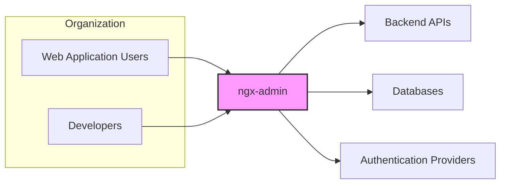
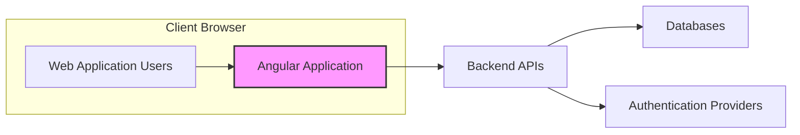
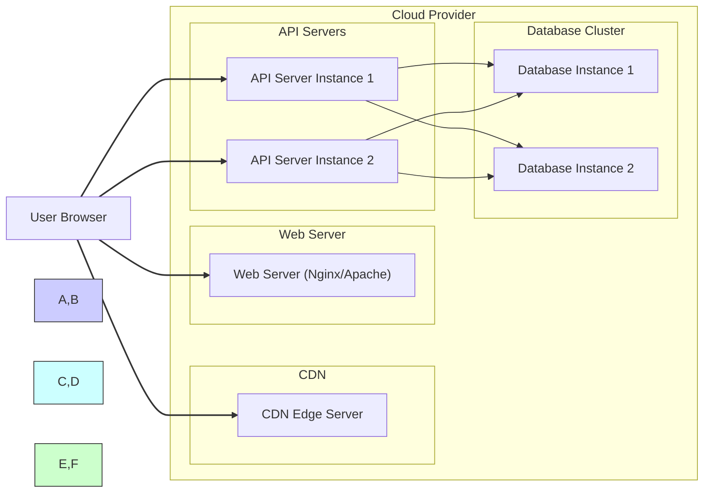
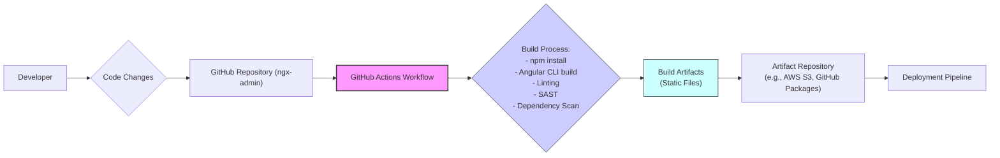

# BUSINESS POSTURE

- Business Priorities and Goals:
  - Provide a reusable, customizable, and feature-rich Angular admin dashboard template.
  - Accelerate the development of admin panels and back-office interfaces for web applications.
  - Offer a visually appealing and user-friendly interface to manage application data and configurations.
  - Reduce development costs and time-to-market for projects requiring admin dashboards.

- Business Risks:
  - Security vulnerabilities within the ngx-admin template could be inherited by applications built upon it, potentially leading to data breaches or unauthorized access.
  - Lack of proper customization and security hardening by developers using the template could result in insecure deployments.
  - Over-reliance on the template without understanding its underlying code and security implications can create blind spots in application security.
  - Potential for supply chain attacks if dependencies of ngx-admin are compromised.
  - If used in critical infrastructure or applications handling sensitive data, vulnerabilities could have significant business impact, including financial losses, reputational damage, and regulatory fines.

# SECURITY POSTURE

- Existing Security Controls:
  - security control: Angular Framework Security - ngx-admin is built using Angular, which provides built-in security features such as protection against Cross-Site Scripting (XSS) and Cross-Site Request Forgery (CSRF). Implemented within the Angular framework itself.
  - security control: Dependency Management - npm is used for managing project dependencies. Described in `package.json` and `package-lock.json`.
  - security control: Code Linting -  Likely uses linters (e.g., ESLint, TSLint - deprecated) for code quality and basic static analysis. Configuration files like `.eslintrc.js` might be present.

- Accepted Risks:
  - accepted risk: Reliance on Third-Party Components - Using a publicly available template inherently involves trusting the security of the template and its dependencies, which are maintained by external parties.
  - accepted risk: Developer Misconfiguration - Developers using the template might not fully understand or correctly implement security best practices when customizing and deploying applications based on ngx-admin.
  - accepted risk: Outdated Dependencies - Dependencies might become outdated over time, potentially introducing known vulnerabilities if not regularly updated.

- Recommended Security Controls:
  - security control: Security Audits - Conduct regular security audits and penetration testing of ngx-admin template to identify and remediate potential vulnerabilities.
  - security control: Dependency Scanning - Implement automated dependency scanning to detect known vulnerabilities in npm packages used by ngx-admin.
  - security control: Static Application Security Testing (SAST) - Integrate SAST tools into the development pipeline to automatically analyze the codebase for security vulnerabilities.
  - security control: Software Composition Analysis (SCA) - Utilize SCA tools to gain visibility into all open source components and their licenses, and identify security risks associated with them.
  - security control: Secure Development Guidelines - Provide clear and comprehensive security guidelines and best practices for developers using ngx-admin to build secure applications.
  - security control: Security Training - Offer security training to developers on secure coding practices, common web application vulnerabilities, and secure usage of ngx-admin.

- Security Requirements:
  - Authentication:
    - Requirement: ngx-admin itself does not handle authentication, but it should be designed to easily integrate with various authentication mechanisms (e.g., OAuth 2.0, OpenID Connect, JWT).
    - Requirement: Applications built with ngx-admin must implement robust authentication to verify the identity of users accessing the admin panel.
  - Authorization:
    - Requirement: ngx-admin should support role-based access control (RBAC) to manage user permissions and restrict access to specific features and data within the admin panel.
    - Requirement: Applications must implement authorization logic to ensure that authenticated users only have access to the resources and actions they are permitted to perform.
  - Input Validation:
    - Requirement: ngx-admin should implement basic client-side input validation to prevent common input-related vulnerabilities.
    - Requirement: Applications must perform comprehensive server-side input validation to sanitize and validate all user inputs before processing them.
    - Requirement: Protection against common injection attacks (e.g., SQL injection, command injection, XSS) must be implemented in applications using ngx-admin.
  - Cryptography:
    - Requirement: ngx-admin itself might not directly handle sensitive data, but applications using it will likely need to implement cryptography for data protection.
    - Requirement: Applications should use HTTPS to encrypt communication between the client and server.
    - Requirement: Sensitive data at rest should be encrypted using appropriate encryption algorithms and key management practices within the applications.

# DESIGN

## C4 CONTEXT

- Context Diagram Elements:
  - - Name: Web Application Users
    - Type: Person
    - Description: End-users who interact with web applications that utilize ngx-admin for their admin interfaces.
    - Responsibilities: Access and manage application data and configurations through the admin dashboard.
    - Security controls: Authentication and authorization implemented by the web application.
  - - Name: Developers
    - Type: Person
    - Description: Software developers who use ngx-admin as a template to build admin panels for their web applications.
    - Responsibilities: Customize, integrate, and deploy ngx-admin within their projects. Ensure secure configuration and usage of the template.
    - Security controls: Secure coding practices, adherence to security guidelines, and proper configuration of ngx-admin.
  - - Name: ngx-admin
    - Type: Software System
    - Description: An Angular-based admin dashboard template providing a user interface for managing web applications.
    - Responsibilities: Provide a customizable and feature-rich UI framework for admin panels. Handle front-end logic and presentation.
    - Security controls: Angular framework security features, input validation (basic), dependency management.
  - - Name: Backend APIs
    - Type: Software System
    - Description: Backend services that provide data and business logic for the web applications using ngx-admin.
    - Responsibilities: Data storage, processing, and retrieval. Business logic execution. API endpoint security.
    - Security controls: Authentication, authorization, input validation, secure API design, rate limiting, and data encryption.
  - - Name: Databases
    - Type: Software System
    - Description: Databases used by the backend APIs to store application data.
    - Responsibilities: Data persistence, integrity, and availability. Secure data storage and access control.
    - Security controls: Access control lists (ACLs), database encryption, regular backups, and vulnerability patching.
  - - Name: Authentication Providers
    - Type: Software System
    - Description: External services or systems used for user authentication (e.g., OAuth 2.0 providers, Active Directory).
    - Responsibilities: User identity verification, token issuance, and authentication management.
    - Security controls: Secure authentication protocols, multi-factor authentication (MFA), and secure token management.

## C4 CONTAINER

- Container Diagram Elements:
  - - Name: Angular Application
    - Type: Web Application
    - Description: The ngx-admin Angular application, running in the user's web browser, providing the admin dashboard interface.
    - Responsibilities: Rendering the user interface, handling user interactions, making API requests to the backend, and client-side input validation.
    - Security controls: Angular framework security features (XSS/CSRF protection), client-side input validation, secure coding practices in Angular components.
  - - Name: Backend APIs
    - Type: Web Application
    - Description: RESTful APIs (or similar) that handle data processing, business logic, and data access for the admin dashboard.
    - Responsibilities: API endpoint security, authentication and authorization, server-side input validation, data processing, and interaction with databases.
    - Security controls: API authentication (e.g., JWT, API keys), authorization mechanisms, input validation, rate limiting, secure coding practices in backend code, and database access controls.
  - - Name: Databases
    - Type: Database
    - Description: Relational or NoSQL databases storing application data accessed and managed through the admin dashboard.
    - Responsibilities: Secure data storage, data integrity, access control, and data backups.
    - Security controls: Database access control lists (ACLs), database encryption at rest and in transit, regular security patching, and database monitoring.
  - - Name: Authentication Providers
    - Type: External System
    - Description: External identity providers used for user authentication.
    - Responsibilities: User identity verification, authentication token issuance, and user account management.
    - Security controls: Secure authentication protocols (OAuth 2.0, OpenID Connect), multi-factor authentication (MFA), and secure token handling.

## DEPLOYMENT

- Deployment Architecture Options:
  - Option 1: Static File Hosting (CDN, Web Server) - ngx-admin as a static Angular application served from a CDN or web server (e.g., Nginx, Apache). Backend APIs deployed separately.
  - Option 2: Containerized Deployment (Docker, Kubernetes) - ngx-admin containerized and deployed within a container orchestration platform like Kubernetes. Backend APIs also containerized and deployed in the same or separate clusters.
  - Option 3: Server-Side Rendering (SSR) - ngx-admin with server-side rendering for improved performance and SEO, deployed on Node.js servers or similar environments.

- Detailed Deployment Architecture (Option 1: Static File Hosting):

- Deployment Diagram Elements (Option 1: Static File Hosting):
  - - Name: CDN Edge Server
    - Type: Infrastructure
    - Description: Content Delivery Network edge servers that cache and serve static assets of the ngx-admin application (HTML, CSS, JavaScript, images).
    - Responsibilities: Fast content delivery, reduced latency for users, and handling high traffic loads.
    - Security controls: DDoS protection, CDN security configurations, and HTTPS for content delivery.
  - - Name: Web Server (Nginx/Apache)
    - Type: Infrastructure
    - Description: Web server instances that serve the static ngx-admin application files if CDN is not used or for initial application load.
    - Responsibilities: Serving static content, handling HTTP requests, and potentially load balancing.
    - Security controls: Web server hardening, access controls, HTTPS configuration, and security patching.
  - - Name: API Server Instance 1 & 2
    - Type: Infrastructure
    - Description: Instances of backend API servers that process API requests from the ngx-admin application.
    - Responsibilities: Handling API requests, business logic execution, data processing, and interaction with databases.
    - Security controls: Server hardening, network security groups, API authentication and authorization, input validation, and security monitoring.
  - - Name: Database Instance 1 & 2
    - Type: Infrastructure
    - Description: Instances of database servers forming a database cluster for data persistence and high availability.
    - Responsibilities: Data storage, data retrieval, data integrity, and database management.
    - Security controls: Database access controls, database encryption at rest and in transit, regular backups, and database security hardening.
  - - Name: User Browser
    - Type: Client
    - Description: User's web browser accessing the ngx-admin application.
    - Responsibilities: Rendering the UI, executing client-side JavaScript code, and interacting with the application.
    - Security controls: Browser security features, user awareness of phishing and malware, and secure browsing practices.

## BUILD

- Build Process Description:
  - Developer makes code changes and commits them to the GitHub repository.
  - GitHub Actions workflow is triggered upon code changes (e.g., push, pull request).
  - Build process within GitHub Actions workflow includes:
    - `npm install`: Install project dependencies.
    - Angular CLI build: Compile Angular code and create production-ready build artifacts (static files).
    - Linting: Run linters (e.g., ESLint) to check code quality and style.
    - SAST: Perform Static Application Security Testing to identify potential vulnerabilities in the code.
    - Dependency Scan: Scan project dependencies for known vulnerabilities.
  - Build artifacts (static files) are generated.
  - Build artifacts are published to an artifact repository (e.g., AWS S3, GitHub Packages, or a container registry if containerized).
  - Deployment pipeline retrieves build artifacts from the repository for deployment to target environments.

- Build Process Security Controls:
  - security control: Automated Build Process - Using GitHub Actions workflow ensures a consistent and repeatable build process, reducing manual errors.
  - security control: Source Code Management - GitHub repository provides version control and audit trails for code changes.
  - security control: Static Application Security Testing (SAST) - Integrated SAST tools help identify and prevent security vulnerabilities early in the development lifecycle.
  - security control: Dependency Scanning - Automated dependency scanning detects vulnerable dependencies, enabling timely updates and mitigation.
  - security control: Code Linting - Enforces code quality and style guidelines, reducing potential for bugs and security issues.
  - security control: Artifact Repository - Securely stores build artifacts, controlling access and ensuring integrity.
  - security control: Supply Chain Security - Regularly review and update dependencies to minimize supply chain risks.

# RISK ASSESSMENT

- Critical Business Processes:
  - Secure access and management of application data and configurations through the admin dashboard.
  - Maintaining the availability and integrity of the admin panel to ensure continuous application management.
  - Protecting sensitive data displayed and managed within the admin dashboard from unauthorized access and modification.

- Data Sensitivity:
  - Data sensitivity depends on the applications built using ngx-admin. It can range from low to high sensitivity.
  - Examples of potentially sensitive data:
    - User credentials and personal information.
    - Financial transactions and data.
    - Business-critical configurations and settings.
    - Application logs and audit trails.
  - Sensitivity level should be determined based on the specific application context and data types managed through the admin panel. Applications handling PII, PHI, or financial data will have high data sensitivity.

# QUESTIONS & ASSUMPTIONS

- Questions:
  - What are the specific types of applications that will be built using ngx-admin? (e.g., e-commerce, CRM, internal tools)
  - What is the expected scale and user base of applications using ngx-admin?
  - What are the specific regulatory compliance requirements for applications using ngx-admin? (e.g., GDPR, HIPAA, PCI DSS)
  - What is the organization's risk appetite regarding the use of third-party templates and open-source components?
  - What level of security expertise is available within the development teams using ngx-admin?
  - What are the performance and scalability requirements for the admin dashboards built with ngx-admin?

- Assumptions:
  - ngx-admin is primarily used as a front-end template for admin dashboards and does not handle backend logic or data storage directly.
  - Applications built with ngx-admin will implement their own backend APIs and databases.
  - Security is a shared responsibility between the ngx-admin template and the developers who use it to build applications.
  - Developers using ngx-admin are expected to have a basic understanding of web application security principles.
  - The deployment environment for applications using ngx-admin will vary depending on the specific application requirements.
  - Regular updates and maintenance of ngx-admin and its dependencies are expected to address security vulnerabilities and improve overall security posture.