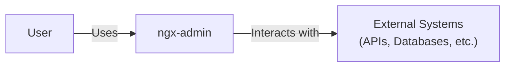
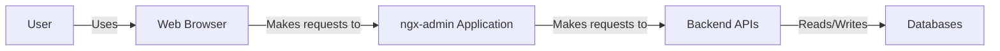
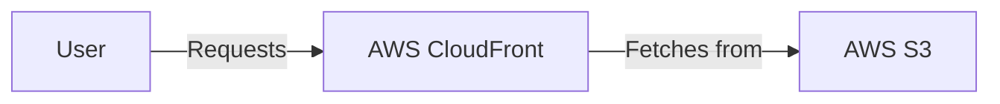
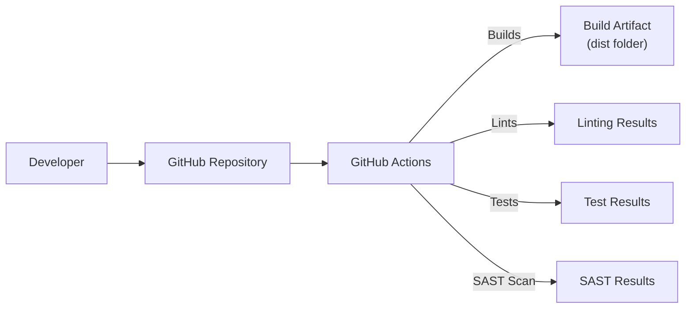

Okay, let's create a design document for the ngx-admin project.

# BUSINESS POSTURE

Business Priorities and Goals:

*   Provide a reusable and customizable admin dashboard template.
*   Reduce development time and cost for building admin interfaces.
*   Offer a wide range of UI components and features out-of-the-box.
*   Maintain a modern and visually appealing design.
*   Ensure good performance and responsiveness.
*   Provide clear documentation and examples.
*   Foster a community around the project.
*   Offer commercial support and additional features (Eva Design System).

Business Risks:

*   Security vulnerabilities in the template could be exploited in applications built upon it.
*   Lack of maintenance or updates could lead to incompatibility with newer Angular versions or libraries.
*   Poor performance or usability could deter adoption.
*   Insufficient documentation or support could hinder developer productivity.
*   Competition from other admin dashboard templates.
*   Dependency on third-party libraries introduces supply chain risks.
*   Licensing issues or restrictions could limit usage.

# SECURITY POSTURE

Existing Security Controls:

*   security control: The project is built using Angular, which provides some built-in protection against common web vulnerabilities like XSS (Cross-Site Scripting). (Described in Angular documentation).
*   security control: The project uses a modular architecture, which can help to isolate different parts of the application and limit the impact of potential vulnerabilities. (Described in project structure).
*   security control: The project includes unit tests, which can help to identify and prevent bugs that could lead to security vulnerabilities. (Described in project structure and testing documentation).
*   security control: Dependencies are managed using npm, allowing for version tracking and updates to address known vulnerabilities in third-party libraries. (Described in package.json).

Accepted Risks:

*   accepted risk: The project relies on numerous third-party libraries, each of which could potentially contain vulnerabilities.
*   accepted risk: The level of security testing and auditing performed on the project is not explicitly stated.
*   accepted risk: The project does not appear to implement specific authentication or authorization mechanisms, leaving this responsibility to the applications that use it.
*   accepted risk: Secure coding practices are encouraged but not enforced through automated tools (e.g., SAST).

Recommended Security Controls:

*   Implement a regular security audit and penetration testing process.
*   Integrate Static Application Security Testing (SAST) tools into the build process.
*   Integrate Dynamic Application Security Testing (DAST) tools for regular security scans.
*   Implement a Software Composition Analysis (SCA) tool to identify and manage vulnerabilities in third-party dependencies.
*   Provide clear security guidelines and documentation for developers using the template.
*   Consider implementing a Content Security Policy (CSP) to mitigate XSS risks.
*   Consider implementing mechanisms to prevent CSRF (Cross-Site Request Forgery) attacks.

Security Requirements:

*   Authentication: The template itself does not handle authentication. Applications built using the template *must* implement their own authentication mechanisms. This should include secure storage of credentials, protection against brute-force attacks, and proper session management.
*   Authorization: The template does not provide built-in authorization features. Applications *must* implement role-based access control (RBAC) or other authorization mechanisms to restrict access to sensitive data and functionality.
*   Input Validation: All user input *must* be validated on the server-side to prevent injection attacks (e.g., SQL injection, command injection). Client-side validation should be used for usability but is not sufficient for security.
*   Cryptography: Sensitive data (e.g., passwords, API keys) *must* be stored securely using appropriate cryptographic algorithms. Data in transit *must* be protected using TLS/SSL.
*   Output Encoding: All data rendered in the user interface *must* be properly encoded to prevent XSS vulnerabilities. Angular's built-in mechanisms should be used where possible.

# DESIGN

## C4 CONTEXT

Element Descriptions:

*   Element:
    *   Name: User
    *   Type: Person
    *   Description: A person who interacts with the ngx-admin dashboard.
    *   Responsibilities: Accessing and managing data through the admin interface.
    *   Security controls: Authentication and authorization mechanisms implemented in the application using ngx-admin.

*   Element:
    *   Name: ngx-admin
    *   Type: Software System
    *   Description: The ngx-admin dashboard template.
    *   Responsibilities: Providing a user interface for managing data and interacting with external systems.
    *   Security controls: Relies on Angular's built-in security features, secure coding practices, and security controls implemented in the application using the template.

*   Element:
    *   Name: External Systems
    *   Type: Software System
    *   Description: External systems that the ngx-admin dashboard interacts with, such as APIs, databases, and other services.
    *   Responsibilities: Providing data and functionality to the ngx-admin dashboard.
    *   Security controls: Authentication, authorization, input validation, and other security measures implemented by the external systems themselves.

## C4 CONTAINER

Element Descriptions:

*   Element:
    *   Name: User
    *   Type: Person
    *   Description: A person who interacts with the ngx-admin dashboard.
    *   Responsibilities: Accessing and managing data through the admin interface.
    *   Security controls: Authentication and authorization mechanisms implemented in the application using ngx-admin.

*   Element:
    *   Name: Web Browser
    *   Type: Software System
    *   Description: The user's web browser.
    *   Responsibilities: Rendering the ngx-admin dashboard and handling user interactions.
    *   Security controls: Browser security features, adherence to web standards.

*   Element:
    *   Name: ngx-admin Application
    *   Type: Web Application
    *   Description: The application built using the ngx-admin template, running within a web browser.
    *   Responsibilities: Providing the user interface, handling user input, and communicating with backend APIs.
    *   Security controls: Angular's built-in security features, secure coding practices, input validation, output encoding, and application-specific security logic.

*   Element:
    *   Name: Backend APIs
    *   Type: API
    *   Description: The backend APIs that the ngx-admin application interacts with.
    *   Responsibilities: Providing data and functionality to the frontend application.
    *   Security controls: Authentication, authorization, input validation, rate limiting, and other API security measures.

*   Element:
    *   Name: Databases
    *   Type: Database
    *   Description: The databases used to store data for the application.
    *   Responsibilities: Storing and retrieving data.
    *   Security controls: Access control, encryption at rest, auditing, and other database security measures.

## DEPLOYMENT

Possible Deployment Solutions:

1.  Static Hosting (e.g., Netlify, AWS S3 + CloudFront, Azure Static Web Apps, GitHub Pages): Suitable for simple deployments where the ngx-admin application is served as static files.
2.  Containerized Deployment (e.g., Docker, Kubernetes): Suitable for more complex deployments, especially when the backend APIs and databases are also containerized.
3.  Platform as a Service (PaaS) (e.g., Heroku, AWS Elastic Beanstalk, Azure App Service): Provides a managed environment for deploying and scaling web applications.

Chosen Solution (Example: Static Hosting with AWS S3 + CloudFront):

Element Descriptions:

*   Element:
    *   Name: User
    *   Type: Person
    *   Description: A person who interacts with the deployed ngx-admin application.
    *   Responsibilities: Accessing the application through a web browser.
    *   Security controls: Authentication and authorization mechanisms implemented within the application.

*   Element:
    *   Name: AWS CloudFront
    *   Type: Content Delivery Network (CDN)
    *   Description: Amazon's CDN service, used to distribute the ngx-admin application globally.
    *   Responsibilities: Caching static assets, reducing latency, and improving performance.
    *   Security controls: HTTPS support, DDoS protection, WAF integration (optional).

*   Element:
    *   Name: AWS S3
    *   Type: Object Storage
    *   Description: Amazon's Simple Storage Service, used to store the static files of the ngx-admin application.
    *   Responsibilities: Hosting the application's HTML, CSS, JavaScript, and other assets.
    *   Security controls: Access control policies, server-side encryption, versioning.

## BUILD

Build Process Description:

1.  Developer: The developer writes code and pushes changes to the GitHub repository.
2.  GitHub Repository: The source code is stored in a GitHub repository.
3.  GitHub Actions: GitHub Actions is used as the CI/CD platform. A workflow is triggered on push or pull request events.
4.  Linting: The workflow runs linters (e.g., ESLint, TSLint) to check for code style and potential errors.
5.  Testing: The workflow runs unit tests and potentially end-to-end tests.
6.  SAST Scan: A Static Application Security Testing (SAST) tool (e.g., SonarQube, Snyk) is integrated into the workflow to scan the code for security vulnerabilities.
7.  Build Artifact: If all checks pass, the workflow builds the application, producing a 'dist' folder containing the production-ready files.
8.  Deployment: A further step in the workflow (not shown in the diagram) would deploy the contents of the 'dist' folder to the chosen hosting environment (e.g., AWS S3).

Security Controls in Build Process:

*   security control: Linting: Enforces code style and helps prevent common coding errors.
*   security control: Testing: Automated tests help identify and prevent bugs, including potential security vulnerabilities.
*   security control: SAST Scanning: Scans the code for known security vulnerabilities.
*   security control: Dependency Management: npm is used to manage dependencies, allowing for updates and vulnerability patching.
*   security control: Build Automation: GitHub Actions provides a consistent and reproducible build process.

# RISK ASSESSMENT

Critical Business Processes:

*   Providing a functional and user-friendly admin dashboard.
*   Maintaining the security and integrity of applications built using the template.
*   Ensuring the ongoing development and maintenance of the project.

Data Sensitivity:

*   The ngx-admin template itself does not handle sensitive data directly. However, applications built using the template *will* likely handle sensitive data, such as:
    *   User credentials (passwords, API keys)
    *   Personal data (names, email addresses, etc.)
    *   Financial data (payment information, transaction history)
    *   Business-sensitive data (sales figures, customer lists)

The sensitivity of this data will vary depending on the specific application. Applications built using ngx-admin *must* implement appropriate security measures to protect this data according to its sensitivity level.

# QUESTIONS & ASSUMPTIONS

Questions:

*   What specific security audits or penetration tests have been conducted on the ngx-admin project?
*   What is the process for reporting and addressing security vulnerabilities discovered in the project?
*   Are there any plans to integrate additional security tools or features into the project (e.g., DAST, SCA)?
*   What level of support is provided for developers using the template, particularly regarding security best practices?
*   What are the specific licensing terms and conditions for using the ngx-admin template?

Assumptions:

*   BUSINESS POSTURE: It is assumed that users of ngx-admin will implement their own security measures, including authentication, authorization, and data protection.
*   SECURITY POSTURE: It is assumed that the Angular framework provides a reasonable level of baseline security against common web vulnerabilities.
*   DESIGN: It is assumed that the ngx-admin application will be deployed in a secure environment with appropriate network security controls.
*   DESIGN: It is assumed that backend APIs and databases will be properly secured and protected from unauthorized access.
*   DESIGN: It is assumed that developers using ngx-admin will follow secure coding practices.