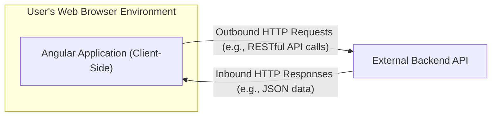
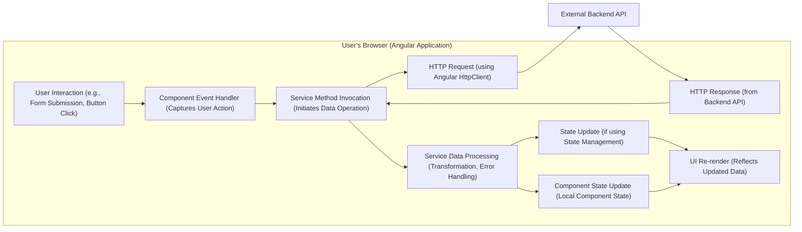

## Project Design Document: Angular Seed Advanced Application (Improved)

**1. Introduction**

This document provides a detailed design overview of the Angular Seed Advanced project, a robust starter kit for building sophisticated and maintainable Angular applications. The primary purpose of this document is to clearly articulate the project's architecture, key components, and data flow to facilitate effective threat modeling. Understanding these aspects is crucial for identifying potential vulnerabilities and designing appropriate security controls.

**2. Goals and Objectives**

*   Provide a precise and easily understandable description of the Angular Seed Advanced project's architecture and its intended functionality.
*   Clearly identify the core components of the system and detail their interactions with each other and external entities.
*   Thoroughly outline the flow of data within the application, highlighting potential points of data exposure or manipulation.
*   Explicitly highlight potential security considerations and areas of concern based on the architectural design.
*   Serve as the definitive reference document for subsequent threat modeling exercises, ensuring a common understanding of the system's structure.

**3. System Overview**

The Angular Seed Advanced project is fundamentally a client-side, single-page application (SPA) constructed using the Angular framework. It operates primarily within a user's web browser and relies on a separate, external backend API for persistent data storage and potentially other services like authentication and authorization.

*   **Angular Application (Client-Side):** This is the core of the project, responsible for rendering the user interface, managing user interactions, handling application logic within the browser, and managing the application's state.
*   **External Backend API:** An independent service responsible for data persistence, business logic execution, and potentially user authentication and authorization. The specific implementation details of this backend are not defined within the scope of the Angular Seed Advanced project itself.
*   **User's Web Browser Environment:** The runtime environment where the Angular application executes. This environment interprets HTML, CSS, and JavaScript, and provides access to browser APIs.

**4. Detailed Design**

The Angular Seed Advanced project follows a modular architecture, leveraging Angular's features to organize code and enhance maintainability.

*   **Core Module:**
    *   Contains essential, singleton services and application-wide configurations that are loaded once at application startup.
    *   Handles cross-cutting concerns such as HTTP request interception (for adding headers, handling errors, etc.), global error handling, and potentially core authentication-related services (though the primary authentication logic is expected on the backend).
*   **Shared Module:**
    *   Houses reusable components, directives, pipes, and services that are intended to be used across multiple feature modules.
    *   Promotes code reuse, reduces redundancy, and ensures a consistent user interface and application behavior.
*   **Feature Modules:**
    *   Organizes the application's functionality into distinct, self-contained modules, often corresponding to specific user workflows or business domains.
    *   Employs lazy loading to improve initial load times by loading feature modules only when they are needed. Examples might include modules for user profiles, data dashboards, or specific application features.
*   **App Routing Module:**
    *   Defines the application's navigation structure, mapping URLs to specific components and feature modules.
    *   Handles route parameters for dynamic content and implements route guards to control access to specific routes based on user roles or authentication status.
*   **Components:**
    *   The fundamental building blocks of the user interface in Angular.
    *   Responsible for rendering specific parts of the UI, handling user interactions within those parts, and managing their own internal state. Components can be either presentational (focused on displaying data) or container components (responsible for fetching data and managing business logic).
*   **Services:**
    *   Encapsulate business logic, data access logic, and interactions with external systems (like the backend API).
    *   Provide data to components and handle data manipulation. Services are typically injectable and can be shared across the application.
*   **Models/Interfaces:**
    *   Define the structure and types of data used within the application, providing type safety and improving code maintainability.
    *   Represent the data exchanged with the backend API and the internal data structures within the application.
*   **State Management (Likely Implementation):**
    *   Given the "Advanced" nature, the project likely integrates a state management library like NgRx or Akita to manage application state in a predictable and centralized manner.
    *   This centralizes application state, facilitates debugging, and provides mechanisms for managing asynchronous operations and data flow.
*   **Build Process (Angular CLI):**
    *   Relies on the Angular CLI for building, testing, and deploying the application.
    *   Involves compiling TypeScript code to JavaScript, bundling JavaScript files, optimizing assets (images, CSS), and generating deployment-ready artifacts. Configuration is managed through files like `angular.json`.
*   **External Libraries (npm Packages):**
    *   The project utilizes various third-party libraries installed via npm for functionalities such as UI components, utility functions, managing HTTP communication, and potentially more specialized tasks. These dependencies are defined in `package.json`.

**5. Data Flow (Detailed)**

The data flow within the Angular Seed Advanced application typically involves user interactions triggering events, which then initiate data requests to the backend and subsequent updates to the user interface.

*   **User Interaction:** The user interacts with the application through the browser's user interface (e.g., clicking a button, submitting a form, navigating).
*   **Component Event Handler:** The Angular component responsible for the interacted-with UI element captures the user's action.
*   **Service Method Invocation:** The component calls a method on an Angular service to perform a specific action, often involving data retrieval, creation, update, or deletion.
*   **HTTP Request:** The service utilizes Angular's `HttpClient` to construct and send an HTTP request to the external backend API. This request typically includes necessary data and authentication tokens (if applicable).
*   **HTTP Response:** The external backend API processes the request and sends back an HTTP response containing the requested data or confirmation of the action.
*   **Service Data Processing:** The service receives the HTTP response and processes the data. This may involve transforming the data into a usable format, handling potential errors, or performing other data manipulation tasks.
*   **State Update (if using State Management):** If a state management library is used, the service updates the central application state with the received or processed data.
*   **Component State Update (Local Component State):** Alternatively, or in addition to state management, the service updates the local state of the component that initiated the request.
*   **UI Re-render:** Angular detects the change in component or application state and re-renders the relevant parts of the user interface to reflect the updated data.

**6. Security Considerations (Relevant for Threat Modeling)**

This design presents several areas that require careful consideration during threat modeling to identify potential vulnerabilities:

*   **Client-Side Security Risks:**
    *   **Cross-Site Scripting (XSS):**  Vulnerability if the application renders user-supplied data without proper sanitization, allowing malicious scripts to be injected and executed in other users' browsers.
    *   **Dependency Vulnerabilities:** Security flaws present in third-party libraries used by the application. Regular dependency audits and updates are crucial.
    *   **Local Storage/Session Storage Security:**  Storing sensitive information in the browser's local or session storage can expose it to unauthorized access through client-side scripts.
    *   **Client-Side Logic Tampering:**  While less direct, malicious actors could potentially manipulate client-side JavaScript code if the application relies solely on client-side validation or authorization.
    *   **Source Code Exposure:**  The client-side code is inherently exposed. Sensitive logic or secrets should not be embedded directly in the frontend code.
*   **Communication Security Risks:**
    *   **Man-in-the-Middle (MITM) Attacks:**  The communication between the browser and the backend API must be secured using HTTPS to prevent eavesdropping and data manipulation.
    *   **Cross-Site Request Forgery (CSRF):**  The application needs mechanisms to prevent malicious websites from making unauthorized requests on behalf of an authenticated user.
*   **Build and Deployment Pipeline Security:**
    *   **Supply Chain Attacks:**  Compromised dependencies or vulnerabilities introduced during the build process. Secure dependency management and build environment security are essential.
    *   **Exposure of Build Artifacts:**  Ensuring that build artifacts are stored securely and access is restricted.
*   **Authentication and Authorization (Backend Responsibility, Frontend Handling):**
    *   While the backend handles the core logic, the frontend needs to securely manage authentication tokens (e.g., JWTs) and handle authorization decisions based on user roles or permissions received from the backend. Improper handling can lead to unauthorized access.
    *   **Token Storage and Handling:** Securely storing and transmitting authentication tokens is critical.
*   **Data Handling on the Client-Side:**
    *   **Sensitive Data in Memory:**  Consider the lifespan and security implications of sensitive data held in the application's memory.
    *   **Data Leakage through Browser History or Caching:**  Preventing sensitive data from being inadvertently stored in browser history or caches.

**7. Assumptions and Dependencies**

*   **Existence of a Secure Backend API:** This design assumes the presence of a separate, well-secured backend API responsible for data persistence, business logic, and robust authentication and authorization mechanisms.
*   **Secure Backend Development Practices:** It is assumed that the backend API is developed using secure coding practices and is protected against common web application vulnerabilities.
*   **Modern Web Browser Environment:** The application is designed to function correctly on modern web browsers that support the necessary JavaScript features and APIs.
*   **Reliable Network Connectivity:** The application requires stable network connectivity to communicate with the backend API.

**8. Out of Scope**

This design document specifically focuses on the architecture and functionality of the Angular Seed Advanced project. The following aspects are considered outside the scope of this document:

*   **Specific Implementation Details of the Backend API:** The architecture, technologies, and security measures of the backend API are not detailed here.
*   **Database Design and Implementation:** The structure and implementation of the backend database are not covered.
*   **Infrastructure and Deployment Environment Details:** Specific server configurations, deployment pipelines, and infrastructure components are not described.
*   **Detailed Code Implementation:** This document provides a high-level design and does not delve into the specifics of individual code files, functions, or algorithms.
*   **Specific Security Implementation Details:** While security considerations are highlighted, the detailed implementation of specific security controls (e.g., specific authentication protocols, CSRF protection mechanisms, content security policies) is not within the scope of this document. These will be addressed in subsequent security design and implementation documentation.

This improved design document provides a more detailed and nuanced understanding of the Angular Seed Advanced project, specifically tailored to facilitate thorough and effective threat modeling. By clearly outlining the architecture, data flow, and potential security considerations, this document serves as a valuable resource for identifying and mitigating potential risks.
