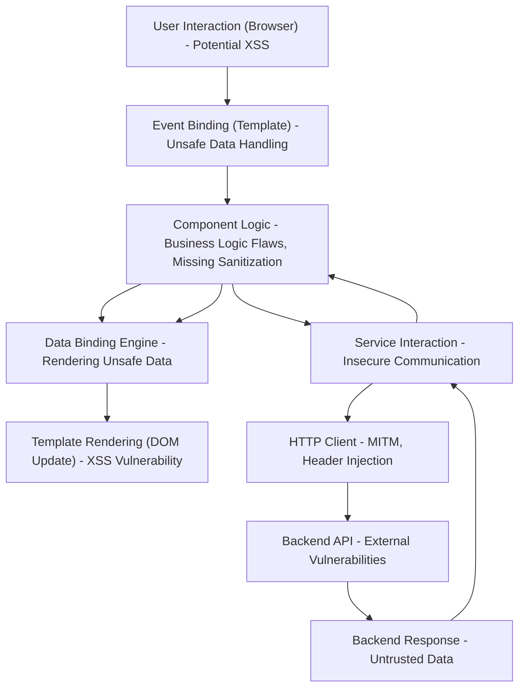

# Project Design Document: Angular Framework - Threat Modeling Focus

**Version:** 1.1
**Date:** October 26, 2023
**Author:** AI Software Architect

## 1. Introduction

This document provides an enhanced architectural overview of the Angular framework (as represented by the repository at [https://github.com/angular/angular](https://github.com/angular/angular)), specifically tailored for threat modeling. It details the framework's structure, key components, and their interactions, emphasizing aspects relevant to security analysis. This document serves as a crucial input for identifying potential vulnerabilities and attack vectors within Angular applications.

## 2. Goals and Objectives

*   Deliver a refined and more security-focused architectural description of the Angular framework.
*   Clearly identify key components and their security-relevant responsibilities.
*   Illustrate data flow and interactions, highlighting potential points of compromise.
*   Elaborate on potential architectural security concerns and attack surfaces.
*   Serve as a robust foundation for conducting comprehensive threat modeling exercises.

## 3. Architectural Overview

Angular is a front-end web application framework, primarily built with TypeScript, that enables the development of dynamic and complex single-page applications (SPAs). Its component-based architecture promotes modularity and reusability. The framework provides a rich set of features and tools for building scalable and maintainable applications.

### 3.1. High-Level Architecture

```mermaid
graph LR
    subgraph "Angular Application in Browser"
        direction LR
        A["Components"] --> B["Modules"];
        B --> C["Services"];
        C --> D["Dependency Injection Container"];
        A --> E["Templates"];
        E --> F["Data Binding Engine"];
        F --> A;
        B --> G["Router"];
        G --> A;
        B --> H["Forms Management"];
        H --> A;
        B --> I["HTTP Client"];
        I --> J["Backend Services (External)"];
        style A fill:#f9f,stroke:#333,stroke-width:2px
        style B fill:#ccf,stroke:#333,stroke-width:2px
        style C fill:#ddf,stroke:#333,stroke-width:2px
    end
    K["Angular CLI (Development/Build)"] --> "Angular Application in Browser";
    L["Node.js & npm/yarn (Development)"] --> "Angular CLI (Development/Build)";
    M["Web Browser Environment"] --> "Angular Application in Browser";
```

### 3.2. Key Architectural Layers

*   **Components:** Encapsulated units comprising a template (view), a class (logic), and associated styles. They manage a portion of the user interface.
*   **Modules:** Organizational units that group related components, services, and other modules, providing namespaces and encapsulation.
*   **Services:** Reusable, injectable classes that provide specific functionalities like data access, logging, or business logic. They promote code reusability and separation of concerns.
*   **Templates:** HTML-based structures that define the user interface of components, incorporating Angular-specific syntax for data binding and directives.
*   **Data Binding Engine:** The mechanism that synchronizes data between the component's class and its template, enabling dynamic updates to the view.
*   **Router:** Manages navigation between different views or components within the application, handling URL changes and component activation.
*   **Forms Management:** Provides tools for creating and managing user input forms, including validation and data handling.
*   **HTTP Client:** Facilitates communication with backend servers via HTTP requests, handling request construction and response processing.
*   **Dependency Injection Container:** A core subsystem that manages the creation and injection of dependencies (services) into components and other services, promoting loose coupling and testability.
*   **Angular CLI (Command Line Interface):** A development tool for scaffolding, building, testing, and deploying Angular applications. It interacts with the underlying build processes and tooling.
*   **Compiler:** Transforms Angular templates and TypeScript code into optimized JavaScript code that can be executed by web browsers. This process includes template parsing, type checking, and code generation.
*   **Renderer:** Responsible for updating the Document Object Model (DOM) in the browser based on changes in the application's state, ensuring the user interface reflects the current data.

## 4. Detailed Component Description (Security Focus)

This section provides a more detailed look at core Angular framework components, emphasizing their security implications.

*   **@angular/core:**  Fundamental building blocks. Security considerations include proper use of lifecycle hooks to prevent resource leaks and understanding the impact of dependency injection on component isolation.
*   **@angular/common:** Provides essential directives and pipes. Security risks can arise from improper use of directives like `[innerHTML]` which bypass Angular's built-in sanitization. The `HttpClient` requires careful configuration to prevent issues like exposing sensitive headers or improper error handling.
*   **@angular/compiler:**  Responsible for transforming templates and code. Vulnerabilities here could lead to code injection if the compilation process itself is compromised or if custom template compilers are used insecurely.
*   **@angular/platform-browser:**  Handles browser-specific interactions. Security concerns include the proper use of the `DomSanitizer` to prevent XSS attacks and managing browser security contexts.
*   **@angular/platform-browser-dynamic:** Enables Just-In-Time (JIT) compilation in the browser. While convenient for development, JIT compilation can introduce security risks in production environments due to the runtime code generation. Ahead-of-Time (AOT) compilation is generally recommended for production.
*   **@angular/router:** Manages navigation. Security implications include protecting routes that require authentication and authorization, preventing unauthorized access to application features. Improper route configuration can also lead to information disclosure.
*   **@angular/forms:**  Handles user input. Security is paramount here, requiring robust validation to prevent injection attacks and proper handling of sensitive data. Both template-driven and reactive forms need careful consideration.
*   **@angular/animations:** While primarily for visual effects, improper use of animations could potentially be exploited for denial-of-service or UI manipulation attacks.
*   **@angular/cli:**  The primary development tool. Security risks involve vulnerabilities in the CLI itself or in the dependencies it uses, potentially allowing for malicious code injection during the build process. Securely managing CLI dependencies is crucial.
*   **@angular/language-service:**  Provides IDE support. Security implications are less direct but could involve vulnerabilities that expose code or configuration information within the development environment.
*   **@angular/service-worker:** Enables PWA features. Security considerations include ensuring the service worker script itself is secure and doesn't introduce vulnerabilities related to caching sensitive data or intercepting requests improperly.

## 5. Data Flow and Interactions (Threat Perspective)

Understanding the data flow is crucial for identifying potential interception or manipulation points.

*   **User Interaction (Browser):**  The initial point of entry. Malicious input here is a primary concern (e.g., XSS payloads in form fields).
*   **Event Binding (Template):**  Connects user actions to component logic. Improperly sanitized data passed through event bindings can lead to vulnerabilities.
*   **Component Logic:** Processes user input and interacts with services. This is where business logic vulnerabilities can reside, and where data sanitization and validation should occur.
*   **Data Binding Engine:**  Synchronizes data between the component and the template. If data is not properly sanitized before binding, it can lead to XSS.
*   **Template Rendering (DOM Update):**  The final stage where data is displayed. If unsanitized data reaches this stage, it can be rendered as malicious code.
*   **Service Interaction:** Components often call services to fetch or send data. Insecure service implementations or communication protocols can introduce vulnerabilities.
*   **HTTP Client:**  Makes requests to backend APIs. Potential threats include man-in-the-middle attacks if HTTPS is not used, and vulnerabilities related to how request parameters and headers are constructed.
*   **Backend API:**  The external system Angular interacts with. Vulnerabilities in the backend API are outside the scope of Angular itself but are a critical part of the overall security posture.
*   **Backend Response:** Data received from the backend. This data must be treated as potentially untrusted and sanitized before being displayed or used within the Angular application.



## 6. Security Considerations (Architectural Level) - Expanded

This section expands on the architectural security considerations, providing more context and examples.

*   **Dependency Management:**  Regularly audit and update dependencies for known vulnerabilities. Use tools like `npm audit` or `yarn audit`. Implement Software Composition Analysis (SCA) to manage open-source risks.
*   **Client-Side Rendering (CSR):**  Be mindful that all client-side code is visible. Avoid storing sensitive information directly in the code. Implement proper authentication and authorization mechanisms on the backend.
*   **Cross-Site Scripting (XSS):**  Utilize Angular's built-in sanitization features. Be extremely cautious when using `[innerHTML]` or bypassing sanitization. Implement Content Security Policy (CSP) to further mitigate XSS risks.
*   **Cross-Site Request Forgery (CSRF):** Implement anti-CSRF tokens (Synchronizer Token Pattern) for all state-changing requests to the backend. Ensure the backend properly validates these tokens.
*   **Server-Side Rendering (SSR) Considerations:** If using SSR, protect the server-side environment from injection attacks and ensure proper handling of user input on the server. Be aware of potential security risks in the Node.js environment.
*   **Build Process Security:** Secure the development and build environments. Use trusted CI/CD pipelines. Implement checks for malicious code during the build process. Securely store and manage build artifacts.
*   **Source Code Exposure:**  While client-side code is exposed, avoid embedding sensitive secrets or API keys directly. Use environment variables or secure configuration management.
*   **Routing and Navigation:** Implement proper authentication and authorization guards to protect sensitive routes. Prevent route parameter manipulation vulnerabilities.
*   **State Management:** If using state management libraries, ensure the state is not inadvertently exposing sensitive data. Implement proper access controls and data handling within the state management system.
*   **Code Injection Vulnerabilities:**  Avoid dynamic code generation or evaluation whenever possible. If necessary, implement strict input validation and sanitization to prevent code injection. Be cautious with template injection vulnerabilities.
*   **Local Storage and Session Storage:**  Avoid storing sensitive information in local or session storage as they are susceptible to XSS attacks. Consider using secure, HTTP-only cookies for session management.
*   **Web Workers:** If using Web Workers, ensure the code loaded into workers is trusted and doesn't introduce new attack surfaces. Secure communication between the main thread and workers.

## 7. Assumptions and Constraints

*   This document focuses on the inherent architectural security aspects of the Angular framework itself. Security vulnerabilities introduced by developers in specific Angular applications are outside the primary scope.
*   It assumes a basic understanding of common web application security vulnerabilities and attack vectors.
*   The analysis is based on the current understanding of the Angular framework's architecture as represented in the provided repository. Future architectural changes may impact these considerations.
*   Specific security configurations and implementations within individual Angular applications are the responsibility of the application developers.

## 8. Future Considerations

*   Detailed threat modeling sessions using methodologies like STRIDE applied to specific Angular components and data flows.
*   Security code reviews of critical Angular framework components to identify potential vulnerabilities within the framework itself.
*   Analysis of the security implications of new features and updates to the Angular framework.
*   Development of secure coding guidelines and best practices specifically for Angular development.
*   Investigation of potential security vulnerabilities related to Angular's interaction with different browsers and platforms.
*   Assessment of the security of the Angular CLI and its dependencies.

## 9. Conclusion

This enhanced design document provides a more security-focused architectural overview of the Angular framework, serving as a valuable resource for threat modeling activities. By understanding the framework's components, data flow, and inherent security considerations, developers and security professionals can proactively identify and mitigate potential vulnerabilities, leading to more secure and resilient Angular applications. Continuous review and adaptation of this document are essential as the framework evolves.