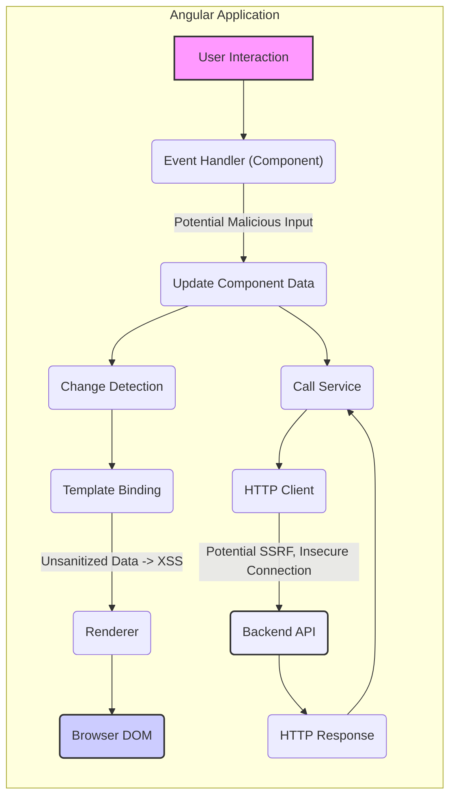
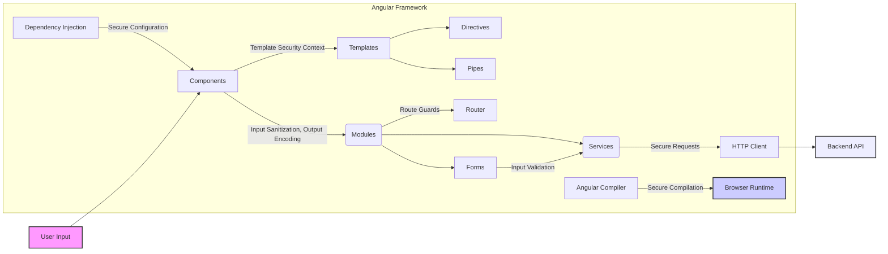
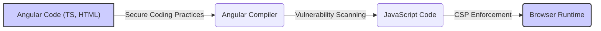

## Project Design Document: Angular Framework (Improved for Threat Modeling)

**1. Introduction**

This document provides a detailed architectural design overview of the Angular framework (as represented by the repository at [https://github.com/angular/angular](https://github.com/angular/angular)). It focuses on aspects relevant to security and threat modeling, capturing key components, their interactions, and potential vulnerabilities. This document will serve as a basis for subsequent threat modeling activities.

**2. Project Goals and Scope**

The primary goal of the Angular project is to provide a comprehensive platform for building complex, maintainable, and scalable client-side web applications. The scope of this design document focuses on the core framework components, the Angular CLI, and the general development and runtime environment of Angular applications. It does not delve into the specifics of individual applications built with Angular but aims to highlight potential risks inherent in the framework itself.

**3. High-Level Architecture**

Angular employs a component-based architecture, promoting modularity and reusability. The framework facilitates the development of single-page applications (SPAs) where the user interface is dynamically updated without requiring full page reloads. Key architectural concepts include:

*   **Components:** Encapsulated units of UI logic, presentation, and styling. They are the primary building blocks of Angular applications.
*   **Modules:**  Logical groupings of related components, directives, pipes, and services. They provide a compilation context and help organize the application into cohesive functional units.
*   **Services:**  Reusable classes that provide specific functionalities, such as data access, logging, or business logic. They are designed to be independent and injectable.
*   **Templates:**  HTML augmented with Angular-specific syntax for data binding, event handling, and structural directives. They define the view of a component.
*   **Directives:**  Markers on DOM elements that instruct Angular to manipulate the DOM in a specific way. They can be structural (changing the DOM layout) or attribute-based (changing the appearance or behavior of an element).
*   **Pipes:**  Functions that transform data for display in templates, such as formatting dates or currencies.
*   **Routing:**  A mechanism for navigating between different views or components within the application based on URL changes.
*   **State Management:**  Patterns and libraries (e.g., RxJS, NgRx) used to manage application data and state across different components, often crucial for complex applications.
*   **Angular CLI:**  A powerful command-line tool that streamlines the development workflow, providing commands for project creation, code generation, building, testing, and deployment.

**4. Key Components and Interactions**

This section details the major components within the Angular framework and their interactions, with a focus on security implications.

*   **Angular Compiler:**
    *   **Functionality:** Transforms Angular templates and TypeScript code into optimized JavaScript instructions that the browser can execute. It performs ahead-of-time (AOT) or just-in-time (JIT) compilation.
    *   **Inputs:** Angular component code (templates, TypeScript), module definitions.
    *   **Outputs:** Optimized JavaScript code.
    *   **Security Relevance:**  A compromised compiler could inject malicious code into the application build output, leading to widespread vulnerabilities. Incorrect compilation could also introduce subtle bugs exploitable by attackers.

*   **Template Parser:**
    *   **Functionality:** Analyzes Angular templates to understand their structure, data bindings, and directives.
    *   **Inputs:** Angular template HTML.
    *   **Outputs:** An abstract syntax tree (AST) representing the template.
    *   **Security Relevance:** Vulnerabilities in the template parser could allow for the injection of malicious HTML or scripts if user-controlled data is incorporated into templates without proper sanitization.

*   **Dependency Injection (DI) System:**
    *   **Functionality:** A core mechanism for managing dependencies between components and services, promoting loose coupling and testability.
    *   **Inputs:** Component and service definitions, provider configurations.
    *   **Outputs:** Instantiated and injected dependencies.
    *   **Security Relevance:**  Improperly configured or exploited DI could lead to the injection of malicious services or the exposure of sensitive information.

*   **Renderer:**
    *   **Functionality:** Abstracts away the underlying platform (e.g., browser DOM, NativeScript) and is responsible for updating the view based on changes in the component's data.
    *   **Inputs:** Component data, template instructions.
    *   **Outputs:** Updates to the rendered UI.
    *   **Security Relevance:**  Vulnerabilities in the renderer could lead to XSS attacks if it doesn't properly sanitize data before rendering it to the DOM.

*   **Zone.js:**
    *   **Functionality:** A mechanism for intercepting asynchronous operations, enabling Angular to detect changes and trigger updates to the view.
    *   **Inputs:** Asynchronous events and operations.
    *   **Outputs:** Notifications to Angular's change detection mechanism.
    *   **Security Relevance:** While not directly a security vulnerability itself, improper handling of asynchronous operations can lead to race conditions or unexpected state changes that could be exploited.

*   **Router:**
    *   **Functionality:** Manages navigation within the application, mapping URLs to specific components and handling route parameters and guards.
    *   **Inputs:** URL changes, route configurations.
    *   **Outputs:** Activation and deactivation of components.
    *   **Security Relevance:**  Misconfigured routes or lack of proper authorization checks on routes can allow unauthorized access to sensitive parts of the application.

*   **Forms Module:**
    *   **Functionality:** Provides mechanisms for creating and managing user input forms, including features for validation and data binding.
    *   **Inputs:** Form definitions, user input.
    *   **Outputs:** Form data, validation status.
    *   **Security Relevance:**  Insufficient validation can lead to vulnerabilities like SQL injection or command injection if form data is passed to backend systems without proper sanitization.

*   **HTTP Client Module:**
    *   **Functionality:** Facilitates communication with backend servers via HTTP, providing methods for making requests and handling responses.
    *   **Inputs:** Request configurations, data payloads.
    *   **Outputs:** HTTP responses.
    *   **Security Relevance:**  Improper handling of HTTP requests can lead to vulnerabilities such as information disclosure, SSRF (Server-Side Request Forgery), or the transmission of sensitive data over insecure connections.

*   **Angular CLI (Command Line Interface):**
    *   **Functionality:** Provides commands for project scaffolding, code generation, building, testing, and deployment.
    *   **Inputs:** User commands, project configuration.
    *   **Outputs:** Generated code, build artifacts, test results.
    *   **Security Relevance:**  A compromised CLI or its dependencies could be used to inject malicious code into the project during development or build processes.

*   **RxJS (Reactive Extensions for JavaScript):**
    *   **Functionality:** A library for asynchronous programming with observable streams, heavily used within Angular for handling events, data streams, and asynchronous operations.
    *   **Inputs:** Event streams, data streams, asynchronous operations.
    *   **Outputs:** Transformed data streams, event notifications.
    *   **Security Relevance:** While RxJS itself isn't inherently insecure, incorrect usage or lack of proper error handling in observable streams can lead to unexpected application behavior or resource leaks that could be exploited.

**5. Data Flow**

The typical data flow in an Angular application, highlighting potential security-relevant points, involves:

*   **"User Interaction"**: A user interacts with the application's UI (e.g., clicks a button, enters text in a form).
*   **"Event Handling (Component)"**: Angular captures the DOM event and triggers the corresponding event handler function within the relevant component. This is a potential entry point for malicious input.
*   **"Update Component Data"**: The event handler logic updates the component's internal data properties. This data might be directly influenced by user input and requires careful handling.
*   **"Change Detection"**: Angular's change detection mechanism detects changes in the component's data.
*   **"Template Binding"**: Angular uses data binding to update the DOM based on the changed component data. Improperly sanitized data at this stage can lead to XSS.
*   **"Renderer"**: The renderer updates the actual DOM elements in the browser.
*   **"Call Service"**: The component might invoke a service to perform tasks like fetching data from a backend.
*   **"HTTP Client"**: The service uses the HTTP client to make requests to external APIs. This is a critical point for potential SSRF or insecure communication.
*   **"Backend API"**: The external API processes the request and sends a response.
*   **"HTTP Response"**: The HTTP client receives the response.
*   **"Service Processes Response"**: The service handles the response, potentially updating component data.
*   **"View Update"**: The change detection and rendering process updates the view with data received from the backend.

**6. Security Considerations**

This section expands on the initial security considerations, providing more specific examples and potential mitigation strategies.

*   **Cross-Site Scripting (XSS):**
    *   **Threat:** Malicious scripts injected into the application's UI, potentially stealing user credentials or performing unauthorized actions.
    *   **Vulnerability Points:** Template rendering of user-provided data, use of `innerHTML`, bypassing Angular's built-in sanitization.
    *   **Mitigation:**  Strictly adhere to Angular's security guidelines, utilize Angular's built-in sanitization, avoid bypassing security contexts, and use Content Security Policy (CSP).

*   **Cross-Site Request Forgery (CSRF):**
    *   **Threat:** Unauthorized actions performed on behalf of an authenticated user without their knowledge.
    *   **Vulnerability Points:**  Forms submitting to the application's backend without proper CSRF protection.
    *   **Mitigation:** Implement anti-CSRF tokens synchronized between the client and server, utilize `HttpOnly` and `Secure` cookies.

*   **Dependency Vulnerabilities:**
    *   **Threat:** Security flaws in third-party libraries used by the Angular application.
    *   **Vulnerability Points:** Outdated or vulnerable npm packages.
    *   **Mitigation:** Regularly audit and update dependencies, use tools like `npm audit` or `yarn audit`, and consider using a Software Composition Analysis (SCA) tool.

*   **Build Process Security:**
    *   **Threat:** Malicious code injected during the build process, potentially compromising the entire application.
    *   **Vulnerability Points:** Compromised build tools, malicious dependencies, insecure CI/CD pipelines.
    *   **Mitigation:** Secure the build environment, use trusted build tools, verify the integrity of dependencies, and implement secure CI/CD practices.

*   **Server-Side Rendering (SSR) Security:**
    *   **Threat:** Security vulnerabilities in the server-side environment rendering the initial HTML.
    *   **Vulnerability Points:**  Node.js vulnerabilities, insecure server configurations, exposure of sensitive data during rendering.
    *   **Mitigation:** Follow secure coding practices for Node.js, secure the server environment, and sanitize data before rendering.

*   **Angular CLI Security:**
    *   **Threat:** A compromised Angular CLI could be used to inject malicious code or leak sensitive information.
    *   **Vulnerability Points:** Vulnerabilities in the CLI itself or its dependencies.
    *   **Mitigation:** Keep the Angular CLI updated, install it from trusted sources, and be cautious about running untrusted CLI commands.

*   **State Management Security:**
    *   **Threat:** Exposure or manipulation of sensitive data stored in the application's state.
    *   **Vulnerability Points:** Storing sensitive data in the client-side state without proper encryption or access controls.
    *   **Mitigation:** Avoid storing highly sensitive data in the client-side state, use appropriate encryption if necessary, and implement proper access control mechanisms.

*   **Routing Security:**
    *   **Threat:** Unauthorized access to specific parts of the application.
    *   **Vulnerability Points:** Missing or improperly implemented route guards.
    *   **Mitigation:** Implement robust authentication and authorization checks using Angular route guards.

**7. Technologies Used**

*   **TypeScript:**  The primary language for developing Angular applications and the framework itself, providing static typing and improved code maintainability.
*   **JavaScript:** The language that Angular code ultimately compiles to and runs in the browser.
*   **HTML:** Used for defining the structure of the user interface (templates). Security considerations involve proper sanitization of user-generated content within HTML.
*   **CSS:** Used for styling the user interface. While generally not a direct source of major security vulnerabilities, be mindful of potential CSS injection issues in specific scenarios.
*   **Node.js and npm (or yarn):** Required for development, building, and managing dependencies. The security of the Node.js environment and the integrity of npm packages are crucial.
*   **RxJS:** A reactive programming library. While powerful, incorrect usage can lead to unexpected behavior that might have security implications.
*   **Karma and Jasmine (or similar):** For unit testing. Secure testing practices help identify vulnerabilities early in the development cycle.
*   **Protractor (or similar):** For end-to-end testing. Security testing should be integrated into end-to-end tests.

**8. Deployment Environment**

Angular applications are typically deployed as static files (HTML, CSS, JavaScript) that can be served by any web server or CDN. The security of the deployment environment is critical:

*   **HTTPS:** Ensure the application is served over HTTPS to protect data in transit.
*   **Web Server Configuration:** Securely configure the web server to prevent common attacks.
*   **CDN Security:** If using a CDN, ensure its security and integrity.
*   **Content Security Policy (CSP):** Implement a strong CSP to mitigate XSS attacks.

**9. Diagrams**

*   **High-Level Component Diagram (Security Focused):**

*   **Simplified Compilation Process (Security Focused):**

**10. Future Considerations**

This document provides a comprehensive overview for threat modeling. Future improvements could include:

*   More detailed diagrams illustrating specific attack vectors and mitigation points.
*   Inclusion of specific security testing methodologies relevant to Angular applications.
*   A more detailed breakdown of security considerations for different deployment scenarios.
*   Integration with specific threat modeling frameworks (e.g., STRIDE).