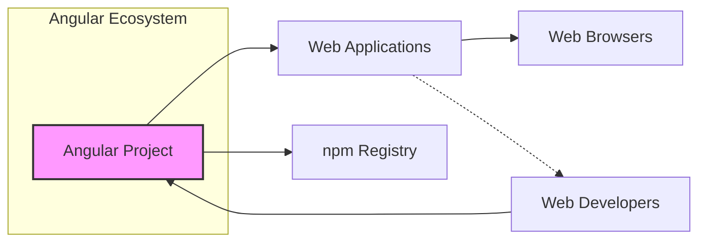
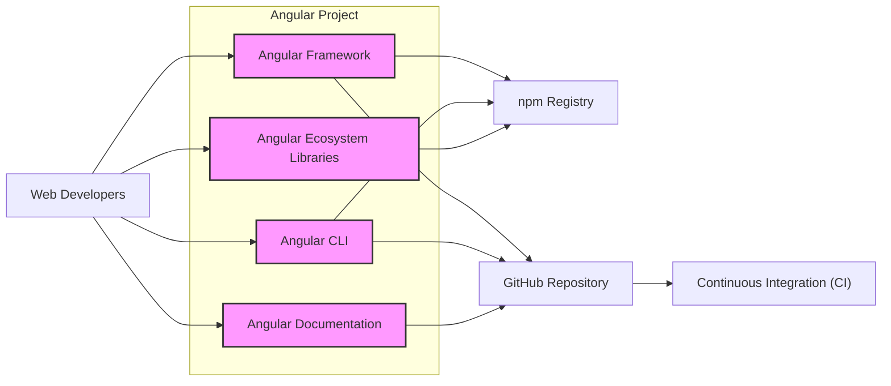
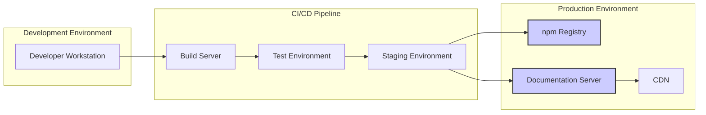
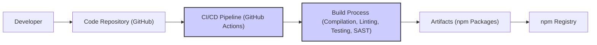

# BUSINESS POSTURE

This project, the Angular framework, aims to provide a comprehensive platform for building web, mobile, and desktop applications. It focuses on developer productivity, code maintainability, and application performance.

- Business priorities:
 - Provide a stable and reliable framework for building applications.
 - Ensure high performance of applications built with Angular.
 - Offer a rich set of features and tools to enhance developer productivity.
 - Maintain a strong and active community around the framework.
 - Ensure the security of the framework and applications built with it.

- Business goals:
 - Be a leading framework for modern web application development.
 - Enable developers to build complex and scalable applications efficiently.
 - Foster a large and engaged developer community.
 - Continuously improve the framework based on community feedback and evolving web standards.

- Business risks:
 - Security vulnerabilities in the framework could lead to widespread application security issues.
 - Performance regressions could negatively impact applications built with Angular.
 - Breaking changes in new versions could disrupt developers and projects.
 - Lack of community support or slow response to issues could deter adoption.
 - Competition from other frameworks could reduce Angular's market share.

# SECURITY POSTURE

- Security controls:
 - security control: Regular security audits and vulnerability scanning of the Angular framework code. (Location: Angular development process, likely documented internally)
 - security control: Public vulnerability reporting process and security advisories. (Location: Angular security policy, likely on angular.io or GitHub)
 - security control: Secure coding guidelines for Angular framework development. (Location: Internal Angular development documentation)
 - security control: Dependency management and vulnerability scanning of third-party libraries used by Angular. (Location: Build process, dependency management tools)
 - security control: Automated testing, including unit and integration tests, to ensure code quality and prevent regressions. (Location: CI/CD pipelines, GitHub Workflows)
 - security control: Community involvement in security reviews and vulnerability reporting. (Location: Open GitHub repository, community forums)

- Accepted risks:
 - accepted risk: As a large open-source project, there is an inherent risk of undiscovered vulnerabilities.
 - accepted risk:  Dependency vulnerabilities in third-party libraries may exist and require patching.
 - accepted risk:  Security misconfigurations in applications built with Angular are outside the scope of the framework itself.

- Recommended security controls:
 - security control: Implement static application security testing (SAST) tools in the CI/CD pipeline to automatically detect potential vulnerabilities in code changes.
 - security control: Implement dynamic application security testing (DAST) tools to test built applications for vulnerabilities.
 - security control: Conduct regular penetration testing by external security experts to identify vulnerabilities from an attacker's perspective.
 - security control: Enhance supply chain security by using signed dependencies and verifying checksums of downloaded packages.
 - security control: Implement a security champions program within the Angular development team to promote security awareness and best practices.

- Security requirements:
 - Authentication:
  - Applications built with Angular will need to implement their own authentication mechanisms, as Angular itself is a front-end framework and does not handle backend authentication.
  - Security Requirement: Applications should use secure authentication methods like OAuth 2.0, OpenID Connect, or SAML where applicable.
  - Security Requirement: Sensitive credentials should never be stored in the client-side code or local storage.

 - Authorization:
  - Applications built with Angular will need to implement authorization logic to control access to resources and functionalities based on user roles and permissions.
  - Security Requirement: Implement role-based access control (RBAC) or attribute-based access control (ABAC) in applications.
  - Security Requirement: Authorization checks should be performed on the backend API, not solely on the client-side.

 - Input validation:
  - Applications built with Angular must validate all user inputs to prevent injection attacks (e.g., XSS, SQL injection, command injection).
  - Security Requirement: Implement input validation on both client-side (for user experience) and server-side (for security enforcement).
  - Security Requirement: Use appropriate encoding and sanitization techniques to handle user inputs.

 - Cryptography:
  - Angular applications may need to use cryptography for secure communication and data protection.
  - Security Requirement: Use well-vetted and standard cryptographic libraries for any cryptographic operations.
  - Security Requirement: Properly manage cryptographic keys and avoid hardcoding secrets in the application code.
  - Security Requirement: Ensure secure communication channels (HTTPS) are used for transmitting sensitive data.

# DESIGN

## C4 CONTEXT

- Context Diagram Elements:
 - Element:
  - Name: Angular Project
  - Type: Software System
  - Description: The Angular framework itself, including the core libraries, CLI tools, and documentation.
  - Responsibilities: Provides a platform for building web applications, manages framework updates, and supports the developer community.
  - Security controls: Security audits, vulnerability scanning, secure development practices, public vulnerability reporting.

 - Element:
  - Name: Web Developers
  - Type: Person
  - Description: Developers who use Angular to build web applications.
  - Responsibilities: Develop, test, and deploy web applications using Angular, report issues and contribute to the Angular community.
  - Security controls: Secure coding practices, input validation in applications, secure dependency management in applications.

 - Element:
  - Name: Web Applications
  - Type: Software System
  - Description: Applications built using the Angular framework.
  - Responsibilities: Provide specific functionalities to end-users, handle user data, and interact with backend services.
  - Security controls: Authentication, authorization, input validation, secure data handling, secure communication (HTTPS).

 - Element:
  - Name: npm Registry
  - Type: External System
  - Description: Public registry for JavaScript packages, used to distribute Angular packages and third-party libraries.
  - Responsibilities: Host and distribute Angular packages, manage package versions and dependencies.
  - Security controls: Package signing, vulnerability scanning of packages, access control to package publishing.

 - Element:
  - Name: Web Browsers
  - Type: External System
  - Description: Web browsers used by end-users to access and run Angular applications.
  - Responsibilities: Execute JavaScript code, render web pages, provide user interface, and enforce browser security policies.
  - Security controls: Browser security features (CSP, XSS protection, etc.), same-origin policy, sandboxing.

## C4 CONTAINER

- Container Diagram Elements:
 - Element:
  - Name: Angular Framework
  - Type: Software Container
  - Description: Core Angular libraries and modules that provide the foundation for building applications (e.g., core, common, compiler, router, forms).
  - Responsibilities: Provides component-based architecture, data binding, routing, dependency injection, and other core functionalities.
  - Security controls: Secure coding practices, vulnerability scanning, automated testing, regular security updates.

 - Element:
  - Name: Angular CLI
  - Type: Software Container
  - Description: Command-line interface tool for creating, building, testing, and deploying Angular applications.
  - Responsibilities: Provides developer tooling, automates project setup, build processes, and code generation.
  - Security controls: Secure dependency management, vulnerability scanning of CLI dependencies, secure update mechanisms.

 - Element:
  - Name: Angular Documentation
  - Type: Software Container
  - Description: Official Angular documentation website and content.
  - Responsibilities: Provides comprehensive documentation, guides, tutorials, and API references for developers.
  - Security controls: Content security policy (CSP) for the documentation website, input validation for user-generated content (if any), secure hosting infrastructure.

 - Element:
  - Name: Angular Ecosystem Libraries
  - Type: Software Container
  - Description:  A wide range of community-developed and official Angular libraries and modules that extend the framework's functionality (e.g., Angular Material, NgRx).
  - Responsibilities: Provide reusable components, services, and utilities for specific functionalities, enhance developer productivity and application capabilities.
  - Security controls: Community-driven security reviews, vulnerability reporting for individual libraries, dependency management within libraries.

 - Element:
  - Name: Web Developers
  - Type: Person
  - Description: Developers who use Angular to build web applications. (Same as Context Diagram)
  - Responsibilities: Develop, test, and deploy web applications using Angular, report issues and contribute to the Angular community. (Same as Context Diagram)
  - Security controls: Secure coding practices, input validation in applications, secure dependency management in applications. (Same as Context Diagram)

 - Element:
  - Name: npm Registry
  - Type: External System
  - Description: Public registry for JavaScript packages. (Same as Context Diagram)
  - Responsibilities: Host and distribute Angular packages. (Same as Context Diagram)
  - Security controls: Package signing, vulnerability scanning of packages, access control to package publishing. (Same as Context Diagram)

 - Element:
  - Name: GitHub Repository
  - Type: External System
  - Description:  The official Angular GitHub repository hosting the source code, issue tracking, and collaboration platform.
  - Responsibilities: Version control, source code management, issue tracking, pull request management, community collaboration.
  - Security controls: Access control to repository, branch protection, code review processes, security scanning of code commits.

 - Element:
  - Name: Continuous Integration (CI)
  - Type: External System
  - Description: Automated build and testing infrastructure used to build, test, and publish Angular packages. (Likely GitHub Actions and internal infrastructure)
  - Responsibilities: Automate build, test, and release processes, ensure code quality, and perform security checks during build.
  - Security controls: Secure CI/CD pipeline configuration, access control to CI/CD system, security scanning tools integrated into CI/CD, artifact signing.

## DEPLOYMENT

For Angular framework development and distribution, the deployment is primarily focused on making the packages available on npm and the documentation accessible online. For applications built with Angular, typical deployment is client-side in web browsers.

Deployment Diagram for Angular Framework Distribution:

- Deployment Diagram Elements:
 - Element:
  - Name: Developer Workstation
  - Type: Infrastructure
  - Description: Developer's local machine used for coding, testing, and committing changes.
  - Responsibilities: Code development, local testing, version control.
  - Security controls: Developer workstation security practices (OS hardening, antivirus, firewall), access control, code signing (optional).

 - Element:
  - Name: Build Server
  - Type: Infrastructure
  - Description: Server in the CI/CD pipeline responsible for building Angular packages.
  - Responsibilities: Compiling code, running linters and SAST scanners, packaging artifacts.
  - Security controls: Secure build environment, access control, hardened OS, security scanning tools, build artifact integrity checks.

 - Element:
  - Name: Test Environment
  - Type: Infrastructure
  - Description: Environment for automated testing of Angular packages.
  - Responsibilities: Running unit tests, integration tests, and security tests.
  - Security controls: Isolated test environment, access control, secure test data management.

 - Element:
  - Name: Staging Environment
  - Type: Infrastructure
  - Description: Pre-production environment for final testing and validation before release.
  - Responsibilities: End-to-end testing, performance testing, security testing in a production-like environment.
  - Security controls: Production-like security configuration, access control, monitoring and logging.

 - Element:
  - Name: npm Registry
  - Type: Infrastructure
  - Description: Public npm registry for hosting and distributing Angular packages. (Same as Context and Container Diagrams)
  - Responsibilities: Hosting and distributing Angular packages. (Same as Context and Container Diagrams)
  - Security controls: Package signing, vulnerability scanning, access control to publishing. (Same as Context and Container Diagrams)

 - Element:
  - Name: Documentation Server
  - Type: Infrastructure
  - Description: Server hosting the Angular documentation website.
  - Responsibilities: Serving documentation content, handling user requests.
  - Security controls: Web server hardening, access control, DDoS protection, content security policy (CSP), HTTPS.

 - Element:
  - Name: CDN
  - Type: Infrastructure
  - Description: Content Delivery Network for distributing documentation assets globally.
  - Responsibilities: Caching and delivering documentation content efficiently to users worldwide.
  - Security controls: CDN security features (DDoS protection, WAF), secure content delivery (HTTPS).

## BUILD

- Build Process Elements:
 - Element:
  - Name: Developer
  - Type: Person
  - Description: Software developer contributing to the Angular project.
  - Responsibilities: Writing code, committing changes, creating pull requests.
  - Security controls: Secure coding practices, code review participation, workstation security.

 - Element:
  - Name: Code Repository (GitHub)
  - Type: System
  - Description: GitHub repository hosting the Angular source code. (Same as Container Diagram)
  - Responsibilities: Version control, source code management, collaboration platform. (Same as Container Diagram)
  - Security controls: Access control, branch protection, code review enforcement, security scanning of commits. (Same as Container Diagram)

 - Element:
  - Name: CI/CD Pipeline (GitHub Actions)
  - Type: System
  - Description: Automated CI/CD pipeline using GitHub Actions (and potentially other internal systems). (Same as Container Diagram)
  - Responsibilities: Automating build, test, and release processes. (Same as Container Diagram)
  - Security controls: Secure pipeline configuration, access control, secret management, security scanning tools integration. (Same as Container Diagram)

 - Element:
  - Name: Build Process (Compilation, Linting, Testing, SAST)
  - Type: Process
  - Description: Steps involved in building Angular packages within the CI/CD pipeline.
  - Responsibilities: Compiling TypeScript code, running linters, executing unit and integration tests, performing static application security testing (SAST).
  - Security controls: SAST tools, linters, secure build scripts, dependency vulnerability scanning.

 - Element:
  - Name: Artifacts (npm Packages)
  - Type: Data
  - Description: Built npm packages of Angular framework components.
  - Responsibilities: Distributable packages of Angular framework.
  - Security controls: Package signing, integrity checks (checksums), secure storage during build process.

 - Element:
  - Name: npm Registry
  - Type: System
  - Description: Public npm registry for distributing Angular packages. (Same as Context, Container, and Deployment Diagrams)
  - Responsibilities: Hosting and distributing Angular packages. (Same as Context, Container, and Deployment Diagrams)
  - Security controls: Package signing verification, vulnerability scanning of packages, access control to package publishing. (Same as Context, Container, and Deployment Diagrams)

# RISK ASSESSMENT

- Critical business processes:
 - Providing a secure and stable Angular framework for application development.
 - Maintaining developer trust and community engagement.
 - Ensuring the long-term viability and adoption of Angular.

- Data we are trying to protect and their sensitivity:
 - Angular framework source code: High sensitivity. Compromise could lead to vulnerabilities in the framework and applications built with it.
 - Build artifacts (npm packages): High sensitivity. Compromised packages could be distributed to millions of developers, leading to widespread supply chain attacks.
 - Angular documentation content: Medium sensitivity. Defacement or malicious content injection could harm developer trust and experience.
 - Developer and community data (GitHub issues, discussions): Low to Medium sensitivity. Protecting user privacy and preventing account compromise.

# QUESTIONS & ASSUMPTIONS

- Questions:
 - What specific SAST/DAST tools are currently used in the Angular CI/CD pipeline?
 - Are there regular penetration tests conducted for the Angular framework and related infrastructure?
 - What is the process for managing and rotating secrets used in the CI/CD pipeline?
 - Are there specific security champions or a dedicated security team within the Angular project?
 - What is the incident response plan in case of a security vulnerability discovery?

- Assumptions:
 - Angular follows secure software development lifecycle (SSDLC) principles.
 - Security is a high priority for the Angular development team.
 - The Angular project benefits from the security expertise of Google and the open-source community.
 - Public vulnerability reporting and disclosure process is in place and actively managed.
 - Standard security practices are applied to the infrastructure hosting Angular services (npm, documentation, etc.).