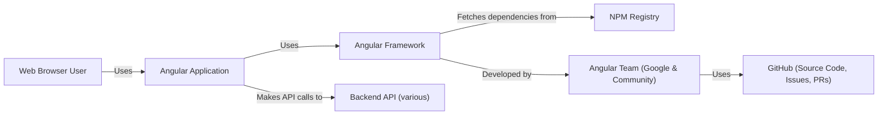
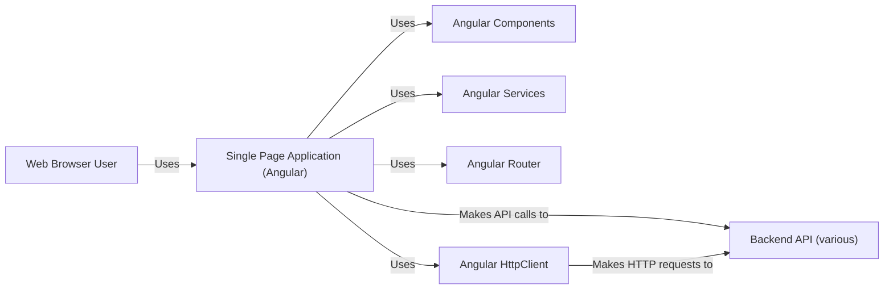
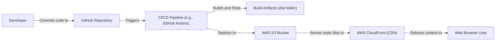
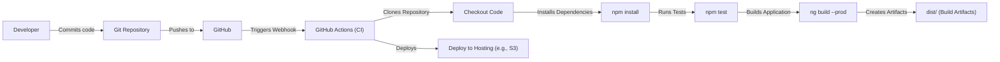

Okay, let's create a design document for the Angular project, focusing on aspects relevant for threat modeling.

# BUSINESS POSTURE

Angular is a critical open-source project used by a vast number of web applications, from small startups to large enterprises.  Its primary business goal is to provide a robust, performant, and maintainable framework for building client-side web applications.  It aims to improve developer productivity and enable the creation of complex, scalable applications.  The project is backed by Google, but its open-source nature means community contributions and adoption are crucial.

Business Priorities:

*   Maintainability and Stability:  Ensuring the framework remains stable and easy to update is paramount, as breaking changes can impact a large number of applications.
*   Developer Adoption and Community Growth:  Continued growth and a vibrant community are essential for the long-term success of the project.
*   Performance:  Applications built with Angular must be performant, especially on lower-powered devices and networks.
*   Security:  Given its widespread use, Angular must be secure to prevent vulnerabilities that could be exploited in countless applications.
*   Evolvability: The framework must be able to adapt to the ever-changing web landscape and incorporate new features and technologies.

Business Risks:

*   Security Vulnerabilities:  A major security vulnerability in Angular could have widespread repercussions, affecting a large number of applications and potentially exposing sensitive data. This is the most significant risk.
*   Loss of Community Trust:  Poor handling of security issues, breaking changes, or a decline in community engagement could lead to developers abandoning the framework.
*   Performance Degradation:  Performance regressions could make Angular less attractive compared to competing frameworks.
*   Inability to Adapt:  Failure to keep up with evolving web standards and technologies could render Angular obsolete.
*   Competition:  The JavaScript framework landscape is highly competitive.  New frameworks or significant improvements to existing ones could threaten Angular's market share.

# SECURITY POSTURE

Existing Security Controls:

*   security control: Regular Security Audits: The Angular team and external security researchers conduct regular audits. (Source: Angular documentation and public statements).
*   security control: Sanitization: Angular has built-in sanitization mechanisms to prevent Cross-Site Scripting (XSS) by treating all values as untrusted by default. (Source: Angular Security Guide).
*   security control: Content Security Policy (CSP) Compatibility: Angular is designed to be compatible with CSP, a browser security mechanism that helps mitigate XSS and other code injection attacks. (Source: Angular Security Guide).
*   security control: Dependency Management: The project uses package managers (like npm) to manage dependencies, and tools like Dependabot (or similar) are likely used to identify and update vulnerable dependencies. (Source: GitHub repository, common practice).
*   security control: Secure Coding Practices: The development team follows secure coding guidelines and best practices. (Source: Implied by Google's engineering standards and public statements).
*   security control: Regular Updates: Angular follows a regular release schedule, including security patches. (Source: Angular release documentation).
*   security control: HTTP Security: Angular provides interceptors to manage security aspects of HTTP requests, like adding authorization headers. (Source: Angular documentation).
*   security control: Code Reviews: All code changes undergo code reviews before being merged. (Source: GitHub pull request process).

Accepted Risks:

*   accepted risk: Third-Party Library Vulnerabilities: While efforts are made to vet and update dependencies, there's always a risk of vulnerabilities in third-party libraries used by Angular.
*   accepted risk: Misconfiguration by Developers: Angular provides security features, but developers can still introduce vulnerabilities if they misuse the framework or disable security mechanisms.
*   accepted risk: Zero-Day Exploits: Like any software, Angular is susceptible to zero-day exploits that are unknown to the development team.
*   accepted risk: Browser-Specific Vulnerabilities: Angular relies on the underlying browser's security mechanisms, and vulnerabilities in specific browsers could impact Angular applications.

Recommended Security Controls:

*   Implement a robust Software Bill of Materials (SBOM) management system to track all dependencies and their versions.
*   Integrate Static Application Security Testing (SAST) and Dynamic Application Security Testing (DAST) tools into the CI/CD pipeline.
*   Conduct regular penetration testing by independent security experts.
*   Establish a clear vulnerability disclosure program with bug bounty incentives.

Security Requirements:

*   Authentication: Angular itself does not handle authentication. It's the responsibility of the application built *using* Angular to implement authentication mechanisms. However, Angular provides tools (like HTTP interceptors) to facilitate integration with authentication systems.
*   Authorization: Similar to authentication, Angular does not provide built-in authorization mechanisms. Applications must implement their own authorization logic, potentially using route guards and other Angular features to control access to different parts of the application.
*   Input Validation: Angular provides built-in form validation capabilities, but developers must use them correctly to prevent injection attacks and other input-related vulnerabilities. Server-side validation is also crucial.
*   Cryptography: Angular does not directly handle cryptographic operations. Applications needing cryptography should use established libraries (e.g., Web Crypto API or a dedicated JavaScript cryptography library) and follow best practices for key management and algorithm selection. Angular's HTTP client can be used to communicate with secure backends that handle sensitive data.

# DESIGN

## C4 CONTEXT

Element Descriptions:

*   Element:
    *   Name: Web Browser User
    *   Type: Person
    *   Description: A person interacting with an Angular application through a web browser.
    *   Responsibilities: Interacts with the UI, triggers actions, views data.
    *   Security controls: Browser security mechanisms (same-origin policy, CSP, etc.).

*   Element:
    *   Name: Angular Application
    *   Type: Software System
    *   Description: A web application built using the Angular framework.
    *   Responsibilities: Provides specific functionality to the user, interacts with backend APIs.
    *   Security controls: Application-specific security logic, proper use of Angular's security features.

*   Element:
    *   Name: Angular Framework
    *   Type: Software System
    *   Description: The Angular framework itself, a library of code used to build web applications.
    *   Responsibilities: Provides building blocks for creating UIs, managing state, handling routing, etc.
    *   Security controls: Built-in sanitization, CSP compatibility, regular security audits.

*   Element:
    *   Name: Backend API (various)
    *   Type: Software System
    *   Description: Backend APIs that the Angular application interacts with. These could be REST APIs, GraphQL APIs, etc.
    *   Responsibilities: Provides data and business logic to the Angular application.
    *   Security controls: Authentication, authorization, input validation, encryption in transit (HTTPS).

*   Element:
    *   Name: NPM Registry
    *   Type: Software System
    *   Description: The public registry for Node.js packages, where Angular and its dependencies are hosted.
    *   Responsibilities: Provides a repository for downloading packages.
    *   Security controls: Package signing (optional), vulnerability scanning.

*   Element:
    *   Name: Angular Team (Google & Community)
    *   Type: Team
    *   Description: The team of developers at Google and the open-source community who maintain and develop Angular.
    *   Responsibilities: Develops new features, fixes bugs, addresses security vulnerabilities.
    *   Security controls: Secure coding practices, code reviews, security audits.

*   Element:
    *   Name: GitHub
    *   Type: Software System
    *   Description: The platform used for hosting the Angular source code, managing issues, and handling pull requests.
    *   Responsibilities: Provides version control, collaboration tools, and issue tracking.
    *   Security controls: Access controls, two-factor authentication, audit logs.

## C4 CONTAINER

Element Descriptions:

*   Element:
    *   Name: Web Browser User
    *   Type: Person
    *   Description: A person interacting with the Angular application.
    *   Responsibilities: Interacts with the UI, triggers actions, views data.
    *   Security controls: Browser security mechanisms.

*   Element:
    *   Name: Single Page Application (Angular)
    *   Type: Container (Web Application)
    *   Description: The Angular application running in the user's browser.
    *   Responsibilities: Renders the UI, handles user interactions, communicates with the backend.
    *   Security controls: Proper use of Angular's security features, input validation, output encoding.

*   Element:
    *   Name: Backend API (various)
    *   Type: Container (API Application)
    *   Description: Backend APIs providing data and business logic.
    *   Responsibilities: Processes requests from the Angular application, interacts with databases and other systems.
    *   Security controls: Authentication, authorization, input validation, encryption.

*   Element:
    *   Name: Angular Components
    *   Type: Component
    *   Description: Reusable UI elements that make up the application's interface.
    *   Responsibilities: Display data, handle user input.
    *   Security controls: Proper use of data binding and sanitization to prevent XSS.

*   Element:
    *   Name: Angular Services
    *   Type: Component
    *   Description: Reusable services that provide functionality to components, such as data fetching and business logic.
    *   Responsibilities: Encapsulate logic, interact with the backend.
    *   Security controls: Secure coding practices.

*   Element:
    *   Name: Angular Router
    *   Type: Component
    *   Description: Manages navigation within the application.
    *   Responsibilities: Handles routing, URL changes, and navigation guards.
    *   Security controls: Route guards can be used to enforce authorization.

*   Element:
    *   Name: Angular HttpClient
    *   Type: Component
    *   Description: Provides a way to make HTTP requests to backend APIs.
    *   Responsibilities: Sends HTTP requests, handles responses.
    *   Security controls: Can be used with interceptors to add authentication headers and handle CSRF protection.

## DEPLOYMENT

Possible Deployment Solutions:

1.  Static Web Hosting (e.g., AWS S3 + CloudFront, Azure Static Web Apps, Google Cloud Storage + CDN, Netlify, Vercel): This is the most common deployment model for Angular applications. The built application (static HTML, CSS, and JavaScript files) is uploaded to a static web hosting service.
2.  Containerized Deployment (e.g., Docker + Kubernetes): The Angular application can be packaged into a Docker container along with a web server (like Nginx) and deployed to a container orchestration platform like Kubernetes.
3.  Server-Side Rendering (SSR) with Angular Universal: For improved SEO and initial load performance, Angular Universal can be used to render the application on the server. This typically involves deploying a Node.js server that runs Angular Universal.
4.  Traditional Web Server (e.g., Apache, Nginx): The built Angular application can be deployed to a traditional web server, similar to static web hosting.

Chosen Solution (for detailed description): Static Web Hosting (AWS S3 + CloudFront)

Element Descriptions:

*   Element:
    *   Name: Developer
    *   Type: Person
    *   Description: A developer working on the Angular application.
    *   Responsibilities: Writes code, commits changes, initiates deployments.
    *   Security controls: Strong passwords, two-factor authentication, secure development environment.

*   Element:
    *   Name: GitHub Repository
    *   Type: System
    *   Description: The source code repository for the Angular application.
    *   Responsibilities: Stores code, tracks changes, manages versions.
    *   Security controls: Access controls, branch protection rules, code review policies.

*   Element:
    *   Name: CI/CD Pipeline (e.g., GitHub Actions)
    *   Type: System
    *   Description: The automated pipeline for building, testing, and deploying the application.
    *   Responsibilities: Automates the build process, runs tests, deploys the application.
    *   Security controls: Secure configuration, limited access, secrets management.

*   Element:
    *   Name: Build Artifacts (dist folder)
    *   Type: Artifact
    *   Description: The output of the build process, containing the static files for the Angular application.
    *   Responsibilities: Contains the deployable application.
    *   Security controls: Integrity checks (e.g., checksums).

*   Element:
    *   Name: AWS S3 Bucket
    *   Type: Infrastructure
    *   Description: An Amazon S3 bucket used to store the static files of the Angular application.
    *   Responsibilities: Stores the application files.
    *   Security controls: Bucket policies, access controls, encryption at rest.

*   Element:
    *   Name: AWS CloudFront (CDN)
    *   Type: Infrastructure
    *   Description: A Content Delivery Network (CDN) that distributes the Angular application globally.
    *   Responsibilities: Caches content, reduces latency, improves performance.
    *   Security controls: HTTPS, WAF (Web Application Firewall) integration, access logs.

*   Element:
    *   Name: Web Browser User
    *   Type: Person
    *   Description: A user accessing the Angular application through a web browser.
    *   Responsibilities: Interacts with the application.
    *   Security controls: Browser security mechanisms.

## BUILD

Build Process Description:

1.  Code Commit: A developer commits code changes to a local Git repository.
2.  Push to GitHub: The developer pushes the changes to a remote GitHub repository.
3.  Webhook Trigger: GitHub triggers a webhook, notifying GitHub Actions (or another CI system) of the new commit.
4.  CI Pipeline Start: The GitHub Actions workflow is initiated.
5.  Checkout Code: The workflow clones the repository's code.
6.  Dependency Installation: The workflow installs project dependencies using `npm install`.
7.  Security Checks:
    *   Linters: Linters (e.g., ESLint with security plugins) are run to check for code style and potential security issues.
    *   SAST: Static Application Security Testing (SAST) tools (e.g., SonarQube) are run to analyze the code for vulnerabilities.
    *   Dependency Scanning: Tools like `npm audit` or Snyk are used to scan for known vulnerabilities in project dependencies.
8.  Testing: Unit tests and end-to-end tests are executed using `npm test`.
9.  Build: The Angular application is built for production using `ng build --prod`. This command compiles the application, optimizes it for performance, and creates the `dist/` folder containing the build artifacts.
10. Artifact Creation: The `dist/` folder contains the static HTML, CSS, and JavaScript files that make up the Angular application.
11. Deployment: The workflow deploys the contents of the `dist/` folder to the target environment (e.g., AWS S3, Azure Static Web Apps, etc.).

Security Controls in Build Process:

*   Code Reviews: All code changes are reviewed before being merged into the main branch.
*   Automated Testing: Unit tests and end-to-end tests help ensure code quality and prevent regressions.
*   SAST: Static analysis tools identify potential vulnerabilities in the code.
*   Dependency Scanning: Regular scanning for vulnerable dependencies helps mitigate supply chain risks.
*   Secrets Management: Sensitive information (e.g., API keys, deployment credentials) are stored securely and not hardcoded in the repository.
*   Least Privilege: The CI/CD pipeline is configured with the minimum necessary permissions.

# RISK ASSESSMENT

Critical Business Processes:

*   Serving web applications built with Angular: The primary business process is enabling the creation and deployment of web applications. Any disruption to this process (e.g., a major vulnerability in Angular) would have significant consequences.
*   Maintaining the Angular framework: This includes ongoing development, bug fixes, security patches, and community engagement.
*   Providing documentation and support: Ensuring developers have access to clear documentation and support channels is crucial for adoption and successful use of Angular.

Data Sensitivity:

*   Angular Framework Code: The Angular framework code itself is not highly sensitive, as it is open source. However, vulnerabilities in the code could be exploited to compromise applications built with Angular.
*   Application Code (built *using* Angular): The sensitivity of application code depends on the specific application. Applications may handle sensitive user data, financial information, or other confidential data. Angular itself does not directly handle this data, but vulnerabilities in Angular could be leveraged to access or manipulate it.
*   Build Artifacts: The build artifacts (the compiled Angular application) have the same sensitivity level as the application code.
*   NPM Packages: The sensitivity of NPM packages varies. Some packages may contain proprietary code or sensitive information. Angular itself relies on many open-source packages.

# QUESTIONS & ASSUMPTIONS

Questions:

*   What specific SAST and DAST tools are used in the Angular CI/CD pipeline?
*   What is the exact process for handling security vulnerability reports?
*   Are there any specific security certifications or compliance requirements that Angular aims to meet?
*   What is the frequency and scope of external penetration testing?
*   What is the process for managing and rotating secrets used in the build and deployment process?
*   What kind of monitoring and alerting is in place to detect potential security incidents?

Assumptions:

*   BUSINESS POSTURE: Assumed that Google's backing provides significant resources and a commitment to security. Assumed that community contributions are vetted and reviewed.
*   SECURITY POSTURE: Assumed that secure coding practices are followed consistently. Assumed that regular security audits are conducted. Assumed that dependency management tools are used effectively.
*   DESIGN: Assumed a standard deployment model using static web hosting. Assumed the use of GitHub Actions for CI/CD, but other CI/CD systems could be used. Assumed that most applications built with Angular interact with backend APIs.