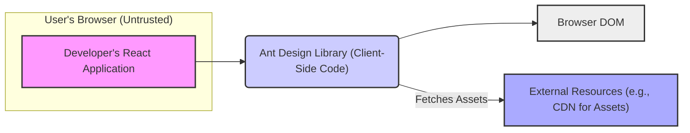
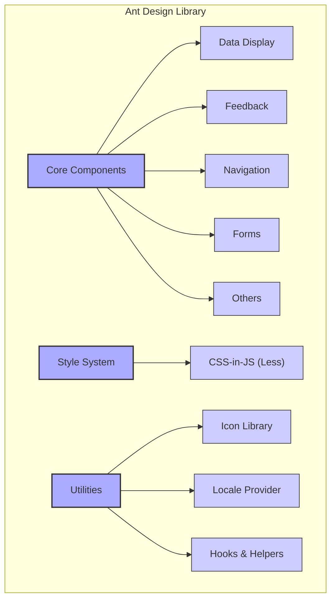
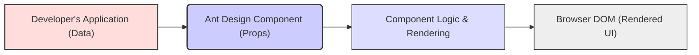

## Project Design Document: Ant Design Library (Improved for Threat Modeling)

**1. Introduction**

This document provides an enhanced design overview of the Ant Design library, a widely used UI component library for building React applications. This revised document is specifically tailored to facilitate threat modeling, offering a detailed understanding of the library's architecture, components, interactions, and potential security considerations.

**2. Goals and Objectives**

*   Provide a clear and detailed description of the Ant Design library's architecture and key components, focusing on aspects relevant to security.
*   Illustrate the data flow and interactions within the library and between the library and consuming applications, highlighting potential data exposure points.
*   Identify potential threat vectors and security concerns associated with the library's design and usage.
*   Serve as a comprehensive reference for security professionals and developers involved in threat modeling and security assessments of applications using Ant Design.

**3. System Architecture**

Ant Design operates primarily on the client-side within a user's web browser. It provides a collection of pre-built, customizable UI components and associated utilities that developers integrate into their React applications.

**3.1. High-Level Architecture with Trust Boundary**

*   **User's Browser (Untrusted):** The environment where the application and Ant Design code execute. This is considered an untrusted environment.
    *   **Developer's React Application:** The application code built by developers, which includes and utilizes Ant Design components.
*   **Ant Design Library (Client-Side Code):** The JavaScript, CSS, and other assets of the Ant Design library that are executed in the browser.
*   **Browser DOM:** The Document Object Model, representing the structure of the web page, which Ant Design components manipulate to render the UI.
*   **External Resources (e.g., CDN for Assets):**  Ant Design might load assets like fonts or icons from external sources.

**3.2. Detailed Component Architecture**

*   **Core Components:**  The central grouping of UI elements.
    *   **Data Display:** Components for rendering data (e.g., "Table", "List", "Card"). These often handle potentially sensitive data.
    *   **Feedback:** Components for user notifications and interactions (e.g., "Modal", "Message", "Notification"). These can be targets for UI redressing attacks.
    *   **Navigation:** Components for application navigation (e.g., "Menu", "Breadcrumb", "Pagination"). Incorrect configuration can lead to unauthorized access.
    *   **Forms:** Components for collecting user input (e.g., "Input", "Select", "Checkbox"). These are direct entry points for user-provided data, requiring careful validation.
    *   **Others:**  Miscellaneous components (e.g., "Button", "Icon", "Typography"). Even simple components can be vectors for XSS if not handled correctly.
*   **Style System:** Manages the visual presentation.
    *   **CSS-in-JS (Less):**  The styling mechanism. Vulnerabilities in the styling engine or improper use can lead to CSS injection attacks.
*   **Utilities:** Helper functions and services.
    *   **Icon Library:** Collection of icons. While seemingly benign, using externally loaded icons can introduce dependencies on third-party resources.
    *   **Locale Provider:** Handles internationalization. Improper handling of locale data could lead to unexpected behavior or vulnerabilities.
    *   **Hooks & Helpers:** Reusable logic. Security flaws in these utilities can affect multiple components.

**4. Data Flow and Interactions**

Data flows into Ant Design components primarily through props provided by the consuming application. User interactions trigger events that propagate back to the application.

**4.1. Component Rendering Data Flow**

*   **Developer's Application (Data):**  The source of data, which could be user input, data fetched from APIs, or application state. This data is often untrusted.
*   **Ant Design Component (Props):** Data passed to the Ant Design component as properties. This is a critical point for input validation and sanitization by the consuming application.
*   **Component Logic & Rendering:** The internal processing within the Ant Design component to generate the UI. Vulnerabilities here could lead to XSS if props are not handled securely.
*   **Browser DOM (Rendered UI):** The final output displayed to the user.

**4.2. User Interaction Data Flow**

```mermaid
graph LR
    A["User Interaction"] --> B["Browser Event"];
    B --> C["Ant Design Component (Event Handler)"];
    C --> D["Developer's Application (Event Callback)"];
    D --> E["Update Application State/Data"];
    E --> F["Re-render Ant Design Component"];
    style A fill:#adf,stroke:#333,stroke-width:2px
    style B fill:#eee,stroke:#333,stroke-width:1px
    style C fill:#ccf,stroke:#333,stroke-width:2px
    style D fill:#fdd,stroke:#333,stroke-width:2px
    style E fill:#fdd,stroke:#333,stroke-width:2px
    style F fill:#ccf,stroke:#333,stroke-width:2px
```

*   **User Interaction:** Actions performed by the user (e.g., clicking a button, typing in an input field).
*   **Browser Event:**  The browser generates an event corresponding to the user interaction.
*   **Ant Design Component (Event Handler):**  Internal event handlers within the Ant Design component that process the browser event. These handlers might perform actions or trigger callbacks.
*   **Developer's Application (Event Callback):**  Functions provided by the consuming application to handle events originating from Ant Design components. This is where the application logic responds to user actions.
*   **Update Application State/Data:** The application updates its internal state based on the user interaction.
*   **Re-render Ant Design Component:** Changes in application state trigger a re-render of the Ant Design component, reflecting the updated data.

**5. Key Components and Security Considerations**

*   **Input Components (e.g., `Input`, `TextArea`):**
    *   **Functionality:** Allow users to enter text.
    *   **Security Considerations:** Primary entry point for user-provided data. Susceptible to XSS if the application doesn't sanitize the input before passing it as props to other components or rendering it.
*   **Select Components (e.g., `Select`, `AutoComplete`):**
    *   **Functionality:** Provide dropdown lists for selecting options.
    *   **Security Considerations:** If options are dynamically generated based on user input or external data, ensure proper encoding to prevent XSS. Be mindful of potential information disclosure if sensitive data is present in the options.
*   **Table Component (`Table`):**
    *   **Functionality:** Displays data in a tabular format.
    *   **Security Considerations:** If table cells render user-provided content or links, ensure proper sanitization to prevent XSS. Be cautious about rendering actions or controls based on user roles without proper authorization checks in the consuming application.
*   **Modal Component (`Modal`):**
    *   **Functionality:** Creates popup windows.
    *   **Security Considerations:** Ensure that the content displayed within modals is properly sanitized. Be aware of potential UI redressing attacks if modals are not implemented correctly.
*   **Form Component (`Form`):**
    *   **Functionality:** Manages form state and validation.
    *   **Security Considerations:** While the component itself doesn't perform server-side validation, ensure that the consuming application performs robust validation on the server-side. Client-side validation is primarily for user experience and should not be relied upon for security.
*   **Icon Component (`Icon`):**
    *   **Functionality:** Displays vector icons.
    *   **Security Considerations:** If icons are loaded from external sources, ensure the integrity and trustworthiness of those sources to prevent supply chain attacks.

**6. Security Considerations and Potential Threats (STRIDE Framework)**

*   **Spoofing:**
    *   A malicious actor could potentially spoof the appearance of Ant Design components if the consuming application allows for extensive customization without proper input validation, potentially tricking users.
*   **Tampering:**
    *   Client-side manipulation of the DOM could alter the behavior or appearance of Ant Design components. While the library itself is not directly vulnerable, the application's logic relying on the state of these components could be affected.
    *   Tampering with data passed as props to components could lead to unexpected behavior or vulnerabilities if the component doesn't handle unexpected data types or formats.
*   **Repudiation:**
    *   Not directly applicable to the UI library itself, but the consuming application needs to ensure proper logging and auditing of user interactions with Ant Design components for accountability.
*   **Information Disclosure:**
    *   If Ant Design components are used to display sensitive data, ensure that the consuming application implements proper access controls and data masking.
    *   Improperly configured components or error messages could inadvertently reveal sensitive information.
*   **Denial of Service:**
    *   While less likely, excessive rendering or complex component interactions could potentially lead to client-side performance issues or a denial of service for the user.
    *   A malicious actor could potentially craft input that causes excessive resource consumption in certain components.
*   **Elevation of Privilege:**
    *   Not a direct vulnerability of the UI library, but if the consuming application relies on the UI for authorization decisions without proper server-side validation, manipulating the UI could potentially lead to unauthorized actions.

**7. Deployment**

Ant Design is deployed as a dependency within a React application. Developers install it using package managers (npm or yarn) and import components as needed. The application, including Ant Design, is then bundled (e.g., using Webpack) and deployed to a web server or CDN.

**8. Technologies Used**

*   **React:** The foundational JavaScript library.
*   **JavaScript (ES6+):** The primary programming language.
*   **Less:** CSS preprocessor for styling.
*   **CSS-in-JS:** Styling paradigm.
*   **npm/yarn:** Package managers.
*   **Webpack/Rollup/Parcel:** Bundlers.

**9. Trust Boundaries**

*   **Trusted:** The Ant Design library code itself (assuming it's from a trusted source and hasn't been tampered with). The developer's application code (to the extent it's been reviewed and secured).
*   **Untrusted:** The user's browser environment, user input, data fetched from external APIs (until validated), and external resources (like CDNs).

**10. Future Considerations for Threat Modeling**

*   Detailed analysis of specific component implementations and their potential vulnerabilities.
*   Review of the Ant Design theming system for potential CSS injection vulnerabilities.
*   Assessment of the security implications of any third-party dependencies used by Ant Design.
*   Dynamic analysis of applications using Ant Design to identify runtime vulnerabilities.

This improved design document provides a more security-focused perspective on the Ant Design library, facilitating more effective threat modeling and security assessments.
