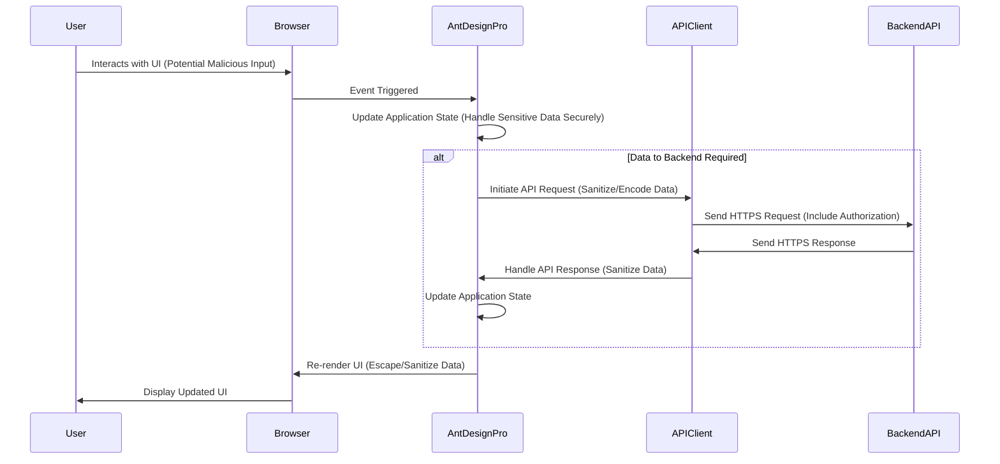

# Project Design Document: Ant Design Pro (Improved for Threat Modeling)

**Version:** 1.1
**Date:** October 26, 2023
**Prepared By:** [Your Name/Organization]

## 1. Introduction

This document provides an enhanced design overview of the Ant Design Pro project, an out-of-the-box UI solution for enterprise applications, as found on GitHub: [https://github.com/ant-design/ant-design-pro](https://github.com/ant-design/ant-design-pro). This revised document is specifically tailored to facilitate effective threat modeling by providing a detailed understanding of the system's architecture, components, data flow, and potential security implications.

## 2. Goals and Objectives

The primary goal of this document is to provide a security-focused design description of Ant Design Pro to enable comprehensive threat modeling. Specific objectives include:

*   Clearly identifying key components and their interactions, highlighting potential attack surfaces.
*   Mapping data flow within the application, emphasizing sensitive data handling.
*   Understanding the technologies and frameworks used, noting known security vulnerabilities associated with them.
*   Providing a solid foundation for identifying potential security threats, vulnerabilities, and attack vectors.

## 3. Target Audience

This document is primarily intended for:

*   Security engineers and architects responsible for performing threat modeling and security assessments of applications built with Ant Design Pro.
*   Development teams working with or extending Ant Design Pro who need to understand the security implications of their design choices.
*   Anyone requiring a detailed, security-conscious understanding of the application's architecture.

## 4. System Architecture

Ant Design Pro is a client-side, single-page application (SPA) framework built upon React and Ant Design. It provides a structured approach for developing complex enterprise user interfaces. The core architecture, emphasizing security-relevant interactions, can be visualized as follows:

```mermaid
graph LR
    subgraph "User's Browser Environment"
        A["User"]
        B["Browser (JavaScript Engine)"]
    end
    subgraph "Ant Design Pro Application (Client-Side)"
        C["Routing & Navigation"]
        D["Layouts"]
        E["Pages/Views"]
        F["Components (Ant Design & Custom)"]
        G["State Management (e.g., Redux, Zustand)"]
        H["Authentication & Authorization Logic"]
        I["API Client (HTTP Requests)"]
        J["Local Storage / Session Storage"]
    end
    subgraph "Backend API(s) (Server-Side)"
        K["Backend API 1"]
        L["Backend API 2"]
        M["..."]
    end

    A -- "User Interaction (e.g., Clicks, Input)" --> B
    B -- "Execution of JavaScript" --> C
    C --> D
    D --> E
    E --> F
    E --> G
    C --> H
    H --> G
    G --> J
    I -- "HTTPS Requests" --> K
    I -- "HTTPS Requests" --> L
    I -- "HTTPS Requests" --> M

    style A fill:#f9f,stroke:#333,stroke-width:2px
    style B fill:#ccf,stroke:#333,stroke-width:2px
    style C fill:#ccf,stroke:#333,stroke-width:2px
    style D fill:#ccf,stroke:#333,stroke-width:2px
    style E fill:#ccf,stroke:#333,stroke-width:2px
    style F fill:#ccf,stroke:#333,stroke-width:2px
    style G fill:#ccf,stroke:#333,stroke-width:2px
    style H fill:#ccf,stroke:#333,stroke-width:2px
    style I fill:#ccf,stroke:#333,stroke-width:2px
    style J fill:#ccf,stroke:#333,stroke-width:2px
    style K fill:#aaf,stroke:#333,stroke-width:2px
    style L fill:#aaf,stroke:#333,stroke-width:2px
    style M fill:#aaf,stroke:#333,stroke-width:2px
```

**Description of Components (with Security Focus):**

*   **User:** The end-user, a potential source of malicious input or target of social engineering.
*   **Browser (JavaScript Engine):** Executes the application's code, a potential target for client-side attacks.
*   **Routing & Navigation:** Determines which components are rendered based on the URL, potential for unauthorized access if not properly secured.
*   **Layouts:** Provide the structural framework, less directly involved in security vulnerabilities but can influence the context of other components.
*   **Pages/Views:** Display specific content and handle user interactions, a primary area for potential XSS vulnerabilities.
*   **Components (Ant Design & Custom):** Reusable UI elements; vulnerabilities in these components can be inherited by the application. Ensure proper input sanitization when using user-provided data.
*   **State Management:** Stores application data, including potentially sensitive information. Secure storage and handling are crucial.
*   **Authentication & Authorization Logic:** Handles user identity verification and access control. Flaws here can lead to unauthorized access.
*   **API Client:** Responsible for communicating with backend APIs. Secure transmission (HTTPS) and proper handling of API keys/tokens are essential.
*   **Local Storage / Session Storage:** Client-side storage for user data. Susceptible to XSS attacks if not handled carefully.

## 5. Component Breakdown (Security Focused)

This section provides a more detailed breakdown of key components, highlighting potential security considerations:

*   **Layout Components:**
    *   Basic Layout:  While structurally focused, ensure no sensitive information is inadvertently exposed in the default layout.
    *   User Layout:  Specifically used for authentication; ensure secure handling of login credentials and session information.
    *   Blank Layout:  Minimal layout; security considerations depend on the content rendered within it.
*   **Page Components (Examples with Security Relevance):**
    *   Dashboard Pages:  May display sensitive business data; ensure proper authorization controls.
    *   Form Pages (e.g., User Creation, Settings):  Critical for input validation to prevent injection attacks.
        *   Specific Input Fields: Text fields, dropdowns, date pickers - each a potential entry point for malicious input.
        *   Form Submission Logic: Ensure secure transmission of data to the backend.
    *   List Pages:  May display lists of users or sensitive data; ensure proper filtering and access controls.
    *   Profile Pages:  Display personal information; ensure only authorized users can access and modify profiles.
    *   Result Pages:  Feedback pages; avoid displaying sensitive information in success or error messages.
    *   Exception Pages:  Error handling; prevent leaking sensitive information in error messages.
    *   Account Pages (Login, Registration, Password Reset):  High-risk areas; require strong security measures (HTTPS, secure password handling, protection against brute-force attacks).
*   **Authentication Components:**
    *   Login Form:  Must be protected against brute-force attacks and credential stuffing. Use HTTPS.
    *   Registration Form:  Validate input to prevent malicious registrations.
    *   Password Reset Form:  Implement secure password reset mechanisms to prevent account takeover.
    *   Session Management:  Use secure tokens (e.g., HTTP-only, Secure cookies) and implement proper session invalidation.
*   **Data Visualization Components:**
    *   Charts and Graphs:  Ensure data displayed is properly authorized and does not reveal sensitive information to unauthorized users.
    *   Data Tables:  Implement server-side filtering and pagination to prevent excessive data exposure.
*   **API Client Implementation:**
    *   HTTP Request Functions:  Ensure all requests to backend APIs are made over HTTPS.
    *   Authorization Header Handling:  Securely manage and transmit authentication tokens (e.g., JWT).
    *   Error Handling:  Avoid exposing sensitive information in API error responses.

## 6. Data Flow (Security Context)

The typical data flow within Ant Design Pro, with a focus on security implications, involves the following steps:

1. **User Interaction:** The user interacts with the application, potentially providing input that could be malicious.
2. **Client-Side Input Handling:**  React components handle user input. Implement client-side validation as a first line of defense against malformed data, but **never rely on it solely for security**.
3. **State Update:** Application state is updated, potentially including sensitive user data. Ensure secure storage practices within the state management system.
4. **API Request (If Required):**
    *   **Data Sanitization/Encoding:** Before sending data to the backend, perform appropriate sanitization and encoding to prevent injection attacks on the backend.
    *   **Secure Transmission:** API requests **must** be made over HTTPS to protect data in transit.
    *   **Authorization:** Include necessary authorization headers (e.g., JWT) to authenticate the request.
5. **Backend Processing:** The backend API receives the request. **Crucially, the backend must perform its own robust validation and sanitization of all incoming data.**
6. **API Response Handling:**
    *   **Secure Reception:** The API client receives the response over HTTPS.
    *   **Data Handling:**  Carefully handle the response data. Avoid directly rendering unsanitized data in the UI to prevent XSS.
7. **State Update (Based on Response):** The application state is updated with data from the backend.
8. **UI Rendering:** React re-renders components. Ensure proper escaping and sanitization of data before rendering to prevent XSS vulnerabilities.

## 7. Security Considerations (Expanded)

This section expands on potential security concerns:

*   **Frontend Security:**
    *   **Cross-Site Scripting (XSS):**  A significant risk. Implement robust output encoding and consider using a Content Security Policy (CSP).
    *   **Cross-Site Request Forgery (CSRF):**  Implement anti-CSRF tokens to protect against unauthorized actions.
    *   **Client-Side Injection:** While less common, be aware of potential vulnerabilities if using client-side templating or dynamic code execution with user-provided data.
    *   **Local/Session Storage Security:**  Avoid storing highly sensitive information in local or session storage. If necessary, encrypt the data. Be mindful of XSS attacks that can access this storage.
    *   **Dependency Vulnerabilities:** Regularly scan dependencies for known vulnerabilities and update them promptly.
    *   **Sensitive Data Exposure:** Avoid hardcoding sensitive information in the frontend code.
*   **Authentication and Authorization:**
    *   **Authentication Strength:** Enforce strong password policies and consider multi-factor authentication.
    *   **Session Management Security:** Use secure cookies (HTTP-only, Secure flags) and implement proper session timeout and invalidation. Protect against session fixation attacks.
    *   **Authorization Enforcement:** Implement granular role-based access control (RBAC) or attribute-based access control (ABAC) and enforce it consistently.
*   **Communication Security:**
    *   **HTTPS Enforcement:**  Mandatory for all communication between the browser and backend APIs.
    *   **API Security:** Rely on the backend APIs to implement their own security measures, including authentication, authorization, input validation, and protection against common API attacks.
*   **Deployment Security:**
    *   **Secure Hosting Configuration:** Ensure the web server hosting the application is securely configured.
    *   **CDN Security:** If using a CDN, ensure its security configurations are appropriate.
    *   **Regular Security Audits:** Conduct regular security assessments and penetration testing.

## 8. Deployment Architecture (Security Implications)

The deployment architecture significantly impacts the security posture:

*   **Static Hosting (e.g., Netlify, Vercel, AWS S3):**
    *   **Pros:** Can be very secure for static content.
    *   **Cons:** Relies heavily on the security of the hosting provider. Ensure proper access controls and permissions are configured.
*   **Web Server (e.g., Nginx, Apache):**
    *   **Pros:** Allows for more control over server configuration and security settings.
    *   **Cons:** Requires careful configuration and maintenance to prevent vulnerabilities. Ensure proper HTTPS configuration, firewall rules, and regular security updates.
*   **Content Delivery Network (CDN):**
    *   **Pros:** Improves performance and availability.
    *   **Cons:** Ensure the CDN is configured to serve content over HTTPS. Be aware of potential CDN vulnerabilities and misconfigurations. Protect the origin server from direct access.

## 9. Technologies Used

*   **Frontend Framework:** React (Consider potential vulnerabilities in React and its ecosystem)
*   **UI Library:** Ant Design (Stay updated on security advisories for Ant Design)
*   **JavaScript:** ECMAScript (ES6+) (Be mindful of potential security issues in JavaScript code)
*   **State Management:** Potentially Redux, Zustand, or React Context (Ensure secure handling of sensitive data within the chosen state management solution)
*   **Routing:** React Router (Ensure proper route protection for authorized access only)
*   **Build Tooling:** Webpack, Create React App (or similar) (Keep build tools updated to avoid vulnerabilities)
*   **Package Manager:** npm or yarn (Regularly audit dependencies for security vulnerabilities)
*   **Testing Frameworks:** Jest, Enzyme (or React Testing Library) (Include security testing in the testing strategy)
*   **HTTP Client:** `fetch` API or libraries like `axios` (Ensure secure configuration and handling of requests)

## 10. Assumptions and Constraints

*   It is assumed that the backend APIs have their own dedicated security measures in place, but the frontend must still implement security best practices.
*   This document primarily focuses on the security aspects of the frontend application built with Ant Design Pro.
*   Specific security implementations will vary based on customizations and extensions made to the base Ant Design Pro template.
*   Threat modeling will require detailed knowledge of the specific backend APIs and their security controls.

This enhanced design document provides a more security-focused understanding of the Ant Design Pro project, crucial for conducting a thorough threat model and implementing appropriate security mitigations.