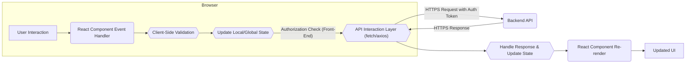
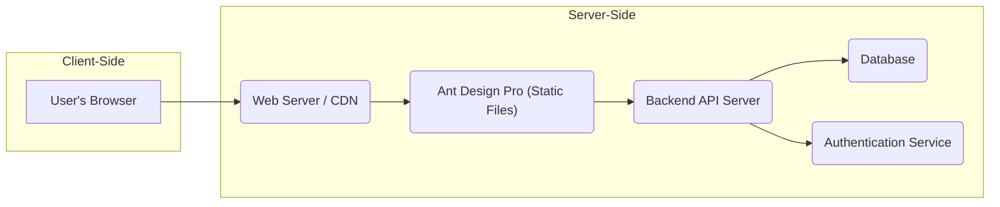

# Project Design Document: Ant Design Pro

**Version:** 1.1
**Date:** October 26, 2023
**Author:** Gemini (AI Language Model)

## 1. Introduction

This document provides a detailed architectural design for the Ant Design Pro project, a production-ready front-end solution for admin interfaces built on React and Ant Design. This document aims to clearly outline the system's components, their interactions, and the overall architecture, specifically for threat modeling purposes.

### 1.1. Purpose

The primary purpose of this document is to:

* Clearly describe the architecture and key components of Ant Design Pro.
* Illustrate the data flow within the application, highlighting potential security touchpoints.
* Identify potential areas of interest and specific threats for security analysis.
* Provide a robust foundation for conducting thorough threat modeling exercises.

### 1.2. Scope

This document covers the architectural design of the Ant Design Pro front-end application, with a strong emphasis on security considerations. It focuses on the client-side components, their interactions, and clearly stated assumptions about the backend services it interacts with. Backend details are included where they directly impact the front-end's security posture.

### 1.3. Goals

* Provide a comprehensive and security-focused overview of the Ant Design Pro architecture.
* Enable security stakeholders to understand the system's design and potential security vulnerabilities.
* Facilitate effective and targeted threat modeling sessions, leading to actionable security improvements.

## 2. System Overview

Ant Design Pro is a sophisticated front-end template engineered for building intricate admin dashboards. It leverages the Ant Design component library, offering a rich set of features and established best practices for developing scalable and maintainable applications. Its design emphasizes user experience, internationalization, and provides common administrative functionalities as core features.

## 3. Architectural Design

Ant Design Pro employs a modular and component-based architecture, characteristic of modern React applications. This modularity aids in understanding individual components and their potential security implications.

### 3.1. Key Components

* **Core Layout:**
    * Provides the foundational structure of the admin interface (navigation, header, content).
    * Security considerations:  Potential for UI redressing attacks if not properly implemented; ensures consistent security headers are applied across all pages.
* **Routing (React Router):**
    * Manages navigation between different views and components.
    * Security considerations:  Crucial for access control; misconfigured routes can lead to unauthorized access; susceptible to parameter tampering.
* **Menu System:**
    * Dynamically generates the navigation menu based on user roles and permissions.
    * Security considerations:  Must accurately reflect user privileges; vulnerabilities here can bypass authorization controls.
* **Authentication and Authorization:**
    * Handles user login, logout, and session management on the front-end.
    * Security considerations:  Relies heavily on secure backend authentication; front-end must securely store and handle tokens (e.g., using HttpOnly, Secure cookies or local storage with caution); vulnerable to replay attacks if not implemented correctly.
* **Form Management:**
    * Provides components for creating, validating, and submitting forms.
    * Security considerations:  Susceptible to injection attacks if input is not properly sanitized before sending to the backend; client-side validation is important but not a replacement for server-side validation.
* **Table Components:**
    * Displays and manipulates data in tabular format, often with features like sorting and filtering.
    * Security considerations:  Potential for data leakage if sensitive information is displayed without proper authorization; client-side filtering should not be relied upon for security.
* **Chart Components:**
    * Visualizes data using various chart types.
    * Security considerations:  Ensure data sources are trusted; potential for misleading visualizations if data is compromised.
* **Internationalization (i18n):**
    * Supports multiple languages and regional settings.
    * Security considerations:  Ensure translation files are not tampered with to inject malicious content.
* **State Management (e.g., Redux, Zustand, Context API):**
    * Manages application state and facilitates data sharing.
    * Security considerations:  Avoid storing sensitive information in the client-side state for extended periods; ensure state updates are handled securely.
* **API Interaction Layer:**
    * Handles communication with backend services.
    * Security considerations:  Must enforce secure communication (HTTPS); handle API keys and secrets securely (avoid storing them directly in the front-end code); implement proper error handling to avoid leaking sensitive information.
* **Component Library (Ant Design):**
    * Provides pre-built UI components.
    * Security considerations:  Rely on the security of the Ant Design library itself; stay updated with security patches for the library.
* **Build Process (Webpack, Parcel):**
    * Bundles and optimizes the application's code.
    * Security considerations:  Ensure dependencies are secure; prevent injection of malicious code during the build process; secure storage of build artifacts.

### 3.2. Data Flow (Security Focused)

The data flow within Ant Design Pro, with a focus on security checkpoints:

1. **User Interaction:** User interacts with UI elements.
2. **Event Handling:** React components capture user interactions.
3. **Input Validation (Client-Side):** Basic validation to improve user experience and catch simple errors *before* sending data. **Security Note:** Client-side validation is not a security measure and should not be solely relied upon.
4. **State Update:** Component or global state is updated.
5. **Authorization Check (Front-End):** Before making sensitive API calls or navigating to protected routes, the front-end checks if the user has the necessary permissions based on their roles. **Security Note:** This is a UI-level check and should be reinforced by backend authorization.
6. **API Request:** An API request is made through the API interaction layer. **Security Note:** Ensure HTTPS is used for all API communication. Include necessary authentication tokens in headers.
7. **Backend Processing (Out of Scope, but assumed secure):** The backend service receives the request, authenticates and authorizes the user, validates the input, processes the request, and returns a response.
8. **Response Handling:** The front-end receives the response. **Security Note:** Handle errors gracefully without revealing sensitive information.
9. **Data Update:** Application state is updated based on the response.
10. **Component Re-render:** React re-renders components.
11. **UI Update:** The user interface reflects the changes.

### 3.3. Deployment Architecture (Security Implications)

A common deployment setup for Ant Design Pro and associated security considerations:

* **Front-end Application (Static Files):**
    * Served via a web server or CDN.
    * Security considerations: Ensure proper security headers are configured (e.g., `Content-Security-Policy`, `Strict-Transport-Security`, `X-Frame-Options`); protect against unauthorized access to the static files.
* **Web Server/CDN (Nginx, Apache, Cloudflare):**
    * Serves static assets.
    * Security considerations:  Regularly update software to patch vulnerabilities; configure firewalls and intrusion detection systems; protect against DDoS attacks.
* **Backend API Server (Node.js, Python, Java):**
    * Handles API requests from the front-end.
    * Security considerations: Implement robust authentication and authorization; perform thorough input validation; protect against common web application vulnerabilities (OWASP Top 10); secure storage of sensitive data.
* **Database:**
    * Stores application data.
    * Security considerations: Secure access controls; encryption at rest and in transit; regular backups; follow database security best practices.
* **Authentication Service (Auth0, Okta, Custom):**
    * Manages user authentication and authorization.
    * Security considerations: Secure storage of user credentials; multi-factor authentication; protection against brute-force attacks; secure token generation and management.

## 4. Security Considerations (Detailed)

This section expands on the initial security thoughts, providing more specific potential threats.

* **Authentication and Authorization:**
    * **Threats:** Brute-force attacks, credential stuffing, session hijacking, insecure token storage, privilege escalation.
    * **Mitigations:** Implement strong password policies, rate limiting for login attempts, use HttpOnly and Secure cookies, consider using a dedicated authentication service, enforce the principle of least privilege.
* **Cross-Site Scripting (XSS):**
    * **Threats:** Injection of malicious scripts to steal user data, redirect users, or perform actions on their behalf.
    * **Mitigations:**  Strictly sanitize user inputs on both the client and server-side, use React's built-in protection against XSS, implement a strong `Content-Security-Policy`.
* **Cross-Site Request Forgery (CSRF):**
    * **Threats:** Unauthorized actions performed on behalf of an authenticated user.
    * **Mitigations:** Implement anti-CSRF tokens (synchronizer tokens), use the `SameSite` attribute for cookies.
* **API Security:**
    * **Threats:** Injection attacks (SQL injection, command injection), insecure direct object references, broken authentication and authorization, data breaches.
    * **Mitigations:** Use HTTPS, implement robust input validation on the backend, follow secure coding practices, implement rate limiting, secure API keys and secrets.
* **Dependency Management:**
    * **Threats:** Exploitation of known vulnerabilities in third-party libraries.
    * **Mitigations:** Regularly update dependencies, use vulnerability scanning tools (e.g., Snyk, npm audit), review dependency licenses.
* **Data Handling:**
    * **Threats:** Data breaches, unauthorized access to sensitive information, data manipulation.
    * **Mitigations:** Encrypt sensitive data at rest and in transit, implement strong access controls, comply with relevant data privacy regulations.
* **Routing and Navigation:**
    * **Threats:** Unauthorized access to specific routes or components, parameter tampering.
    * **Mitigations:** Implement robust authorization checks on both the front-end and backend, avoid exposing sensitive information in URL parameters.
* **State Management:**
    * **Threats:** Exposure of sensitive data stored in the client-side state.
    * **Mitigations:** Avoid storing sensitive information in the client-side state if possible, use secure storage mechanisms if necessary.
* **Build Process Security:**
    * **Threats:** Injection of malicious code during the build process, compromised build artifacts.
    * **Mitigations:** Secure the build environment, use trusted dependencies, implement integrity checks for build artifacts.

## 5. Future Considerations (Security Perspective)

* **Micro-frontend Architecture:**  Consider the security implications of inter-application communication and shared authentication mechanisms.
* **Real-time Features (WebSockets):**  Focus on secure WebSocket connections, input validation for real-time data, and authorization for real-time updates.
* **Server-Side Rendering (SSR):**  Evaluate potential vulnerabilities related to server-side rendering, such as the exposure of sensitive data in the initial HTML. Implement proper sanitization and security measures on the server.

## 6. Appendix

### 6.1. Glossary

* **API:** Application Programming Interface
* **CDN:** Content Delivery Network
* **CSRF:** Cross-Site Request Forgery
* **DDoS:** Distributed Denial of Service
* **HTTPS:** Hypertext Transfer Protocol Secure
* **i18n:** Internationalization
* **OWASP:** Open Web Application Security Project
* **React:** A JavaScript library for building user interfaces
* **RESTful:** Representational State Transfer
* **SEO:** Search Engine Optimization
* **SSR:** Server-Side Rendering
* **UI:** User Interface
* **XSS:** Cross-Site Scripting
