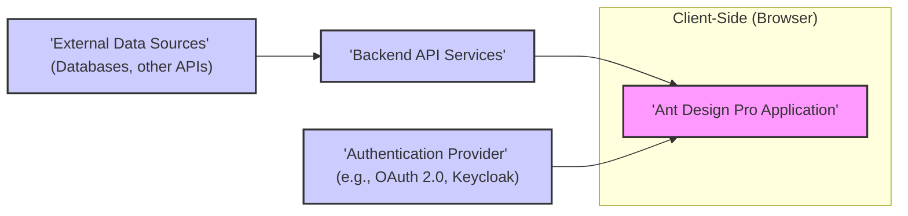
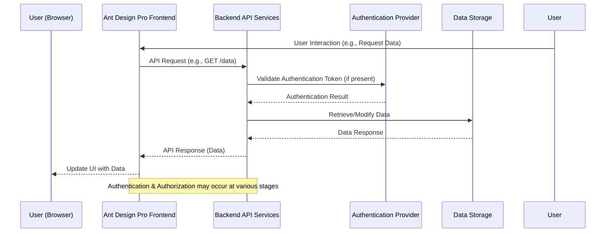

# Project Design Document: Ant Design Pro - Frontend Application Template

**Version:** 1.1
**Date:** 2023-10-27 (Revised)
**Author:** AI Software Architecture Expert

## 1. Project Overview

*   **Project Name:** Ant Design Pro
*   **Project URL:** [https://github.com/ant-design/ant-design-pro](https://github.com/ant-design/ant-design-pro)
*   **Project Description:** Ant Design Pro is a production-ready and out-of-the-box frontend application template based on Ant Design and React. It provides a comprehensive set of features and components for building enterprise-grade web applications. It is designed to accelerate development by offering pre-built layouts, routing, authentication, authorization, and common UI patterns.  **Crucially, it is primarily a frontend template.** It is designed to interact with external backend services for data persistence, business logic, and core application functionalities.  The actual backend implementation is **out of scope** for Ant Design Pro itself and needs to be developed and deployed separately.
*   **Purpose of this Document:** This document outlines the design of Ant Design Pro, specifically focusing on the frontend application template, for the purpose of threat modeling. It describes the architecture, key components, data flow, and security considerations of the frontend application to facilitate the identification and mitigation of potential security threats within the client-side application and its interactions with external systems.  This document assumes the existence of external backend services and an authentication provider, but their internal designs are not detailed here as they are external to the Ant Design Pro project itself.

## 2. Architecture Overview

*   **High-Level Architecture:** Ant Design Pro employs a client-side rendered (CSR) Single Page Application (SPA) architecture. The frontend application, running in the user's browser, handles UI rendering and user interactions. It communicates with external backend API services to retrieve and manipulate data. Authentication and authorization are typically delegated to a separate Authentication Provider.

*   **Architecture Description:**
    *   **Client-Side (Browser):** This layer encompasses the Ant Design Pro application, which is built using React and the Ant Design UI library. It is responsible for:
        *   Rendering the user interface and handling user interactions.
        *   Managing client-side routing and navigation.
        *   Managing application state within the browser.
        *   Communicating with backend API services via HTTP requests.
        *   Handling user authentication flows (redirects to Authentication Provider, token management).
    *   **Backend API Services (External):** These are external services that the Ant Design Pro frontend interacts with. They are responsible for:
        *   **Data Management:** Persistent storage and retrieval of application data (e.g., user data, product data, order data).
        *   **Business Logic Execution:** Implementing the core business rules and workflows of the application. Examples include:
            *   User management services (user registration, profile updates).
            *   Product catalog services (product listing, details, search).
            *   Order processing services (order creation, payment processing, order status updates).
        *   **Authorization:** Enforcing access control policies to protect resources and functionalities.
        *   **Integration with External Data Sources:** Connecting to databases, third-party APIs, and other external systems.
    *   **Authentication Provider (External):** A dedicated service responsible for user authentication. It handles:
        *   User identity verification (login, password management, multi-factor authentication).
        *   Issuance of authentication tokens (e.g., JWT).
        *   Potentially user authorization information (roles, permissions).
    *   **External Data Sources (External):**  These are the underlying data stores and external systems that the Backend API Services rely on. Examples include:
        *   Relational databases (PostgreSQL, MySQL).
        *   NoSQL databases (MongoDB, Cassandra).
        *   Third-party APIs (payment gateways, social media APIs).

## 3. Key Components

*   **Frontend Components (within Ant Design Pro Application):**
    *   **Layouts:** Provide pre-designed application structures (e.g., `'BasicLayout'`, `'SideMenuLayout'`, `'TopMenuLayout'`) defining the arrangement of header, sidebar, navigation, and content areas.
    *   **Routes:** Defined using React Router, these components manage client-side navigation and map URLs to specific application views or pages.
    *   **Pages/Views:** React components representing individual screens or functionalities within the application (e.g., `'DashboardPage'`, `'UserListPage'`, `'SettingsPage'`, `'FormPage'`).
    *   **Components (Ant Design & Custom):** Reusable UI elements.
        *   **Ant Design Components:**  A rich set of pre-built UI components from the Ant Design library (e.g., `'Button'`, `'Form'`, `'Table'`, `'Chart'`, `'Modal'`).
        *   **Custom Components:** Application-specific UI components built on top of Ant Design or from scratch to meet specific requirements.
    *   **State Management:** Libraries or patterns used to manage application data and component updates. Common choices include:
        *   `'React Context API'` (built-in React state management).
        *   `'Redux'` (predictable state container).
        *   `'Zustand'` (small, fast, and scalable bearbones state-management).
    *   **Authentication & Authorization Modules (Frontend-side logic):** Handles client-side authentication flows and authorization checks.
        *   Redirection to Authentication Provider for login.
        *   Storage and management of authentication tokens (e.g., in `'localStorage'`, `'sessionStorage'`, or secure cookies).
        *   Client-side authorization checks based on user roles or permissions (often for UI element visibility or route access, but backend should be the source of truth).
    *   **API Client:**  Handles communication with backend API services. Typically implemented using:
        *   `'fetch API'` (browser built-in).
        *   `'axios'` (popular HTTP client library).
    *   **Internationalization (i18n):**  Supports localization of the user interface for multiple languages, often using libraries like `'i18next'` or `'react-intl'`.
    *   **Theme Customization:** Allows modification of the application's visual appearance (colors, fonts, styles) to match branding requirements.

*   **Backend Components (External - Examples):**
    *   **API Gateway (Optional):** A reverse proxy and API management layer that can handle:
        *   Routing requests to appropriate backend services.
        *   Authentication and authorization enforcement.
        *   Rate limiting and traffic management.
        *   API monitoring and analytics.
    *   **Authentication Service (Example: User Service):**  Manages user accounts and authentication processes.
        *   User registration and login.
        *   Password management (reset, change).
        *   Token issuance and validation.
    *   **Authorization Service (Example: Role-Based Access Control Service):** Determines user access rights.
        *   Manages roles and permissions.
        *   Enforces access control policies based on user roles and resource permissions.
    *   **Business Logic Services (Example: Product Service, Order Service, Content Service):** Implement specific business functionalities.
        *   `'Product Service'`: Manages product catalog, product details, inventory.
        *   `'Order Service'`: Handles order placement, payment processing, order fulfillment.
        *   `'Content Service'`: Manages content creation, storage, and delivery (e.g., blog posts, articles).
    *   **Data Storage (Databases - Examples):** Persistent storage for application data.
        *   `'Relational Databases'`: (e.g., PostgreSQL, MySQL, SQL Server) for structured data.
        *   `'NoSQL Databases'`: (e.g., MongoDB, Cassandra, Redis) for flexible data models and scalability.

## 4. Data Flow

*   **User Interaction:**
    1.  A user interacts with the Ant Design Pro application in their web browser (e.g., navigates to a page, clicks a button, submits a form).
    2.  The frontend application processes the user interaction, potentially updating the local application state.
    3.  If the interaction requires data from or modification of data in the backend, the frontend application initiates an API request to the appropriate backend API service.

*   **API Request Flow:**
    1.  The frontend application constructs an HTTP request (e.g., `GET`, `POST`, `PUT`, `DELETE`) targeting a specific API endpoint exposed by a backend service.
    2.  **Authentication (if required):** The request may include authentication credentials, typically in the form of an access token (e.g., JWT) included in:
        *   `'Authorization'` header (e.g., `Authorization: Bearer <access_token>`).
        *   Cookies (for session-based authentication).
    3.  **API Gateway (if present):** The API Gateway receives the incoming request and may perform several functions:
        *   **Routing:** Directs the request to the relevant backend service based on the API endpoint.
        *   **Authentication & Authorization:** Verifies the user's identity and permissions.
        *   **Rate Limiting:** Prevents abuse by limiting the number of requests from a specific source.
        *   **Request Transformation:** Modifies the request before forwarding it to the backend service.
    4.  **Backend Service:** The designated backend service receives the request and processes it:
        *   **Business Logic Execution:** Executes the necessary business logic to fulfill the request.
        *   **Data Access:** Interacts with data storage (databases) to retrieve, create, update, or delete data.
        *   **Integration with External Services:** May call other external APIs or services if required.
    5.  **Data Retrieval/Modification:** The backend service interacts with databases or other external data sources to perform data operations as needed.
    6.  **Response:** The backend service generates an HTTP response, typically in JSON format, containing:
        *   The requested data (for `GET` requests).
        *   Status information indicating success or failure.
        *   Error details in case of errors.
    7.  The backend service sends the HTTP response back to the frontend application, potentially passing through the API Gateway.
    8.  The frontend application receives the API response, updates its state based on the received data or status, and re-renders the user interface to reflect the changes.

*   **Authentication Flow (Example - OAuth 2.0 Authorization Code Flow):**
    1.  A user attempts to access a protected resource within the Ant Design Pro application.
    2.  The frontend application detects that the user is not authenticated and redirects the user's browser to the Authentication Provider's authorization endpoint.
    3.  The user is presented with the Authentication Provider's login page and authenticates (e.g., enters username and password, uses multi-factor authentication).
    4.  Upon successful authentication, the Authentication Provider redirects the user's browser back to the Ant Design Pro application with an authorization code in the URL.
    5.  The frontend application extracts the authorization code from the URL.
    6.  The frontend application makes a backend API request (e.g., to a dedicated authentication backend service or directly to the Authentication Provider's token endpoint) to exchange the authorization code for access tokens (and potentially refresh tokens). This exchange typically happens server-side or via a secure backend proxy to protect client secrets.
    7.  The backend service securely exchanges the code and receives access and refresh tokens from the Authentication Provider.
    8.  The backend service securely stores the refresh token (if applicable) and returns the access token to the frontend application.
    9.  The frontend application securely stores the access token (e.g., in memory, secure cookies, or `sessionStorage` - `localStorage` is generally discouraged for sensitive tokens).
    10. For subsequent API requests to protected resources, the frontend application includes the access token in the `'Authorization'` header of each request.
    11. Backend API services or the API Gateway validate the access token against the Authentication Provider to authorize each request.

## 5. Technology Stack

*   **Frontend:**
    *   **UI Library:** `'Ant Design'` (React UI component library).
    *   **JavaScript Framework:** `'React'` (for building user interfaces).
    *   **Programming Language:** `'JavaScript'` / `'TypeScript'` (TypeScript is recommended for enhanced type safety and maintainability in larger projects).
    *   **Module Bundler:** `'Webpack'` / `'Vite'` (for bundling and optimizing frontend assets).
    *   **Routing:** `'React Router'` (for client-side routing and navigation).
    *   **State Management:**  `'React Context API'`, `'Redux'`, `'Zustand'`, or similar state management libraries.
    *   **HTTP Client:** `'fetch API'` (browser built-in) or `'axios'` (HTTP client library).
    *   **Markup & Styling:** `'HTML5'`, `'CSS3'` (for structure and styling).
    *   **Internationalization:** `'i18next'`, `'react-intl'`, or similar i18n libraries.

*   **Backend (Example Technologies - Implementation is External to Ant Design Pro):**
    *   **Programming Languages:** `'Node.js'`, `'Python'`, `'Java'`, `'Go'`, `'C#'`, etc. (depending on backend requirements and team expertise).
    *   **Frameworks:** `'Express.js'` (Node.js), `'Django'` / `'Flask'` (Python), `'Spring Boot'` (Java), `'ASP.NET Core'` (C#), etc.
    *   **Databases:** `'PostgreSQL'`, `'MySQL'`, `'MongoDB'`, `'SQL Server'`, `'Redis'`, etc. (chosen based on data requirements and scalability needs).
    *   **Authentication/Authorization:** `'OAuth 2.0'`, `'OpenID Connect'`, `'JWT'`, `'Keycloak'`, `'Auth0'`, etc. (integration with dedicated authentication providers or custom implementations).
    *   **API Gateway (Optional):** `'Kong'`, `'Nginx'`, `'AWS API Gateway'`, `'Azure API Management'`, `'Google Cloud API Gateway'`, etc.
    *   **Cloud Providers (Optional):** `'AWS'`, `'Azure'`, `'Google Cloud Platform'` (for hosting and managing backend infrastructure).

## 6. Deployment Model

*   **Frontend Deployment:**
    *   **Static Hosting:** The compiled Ant Design Pro frontend application (static HTML, CSS, JavaScript files, and assets) is typically deployed to a static hosting service.
    *   **CDN (Content Delivery Network):**  Serving static assets via a CDN (e.g., `'AWS CloudFront'`, `'Azure CDN'`, `'Google Cloud CDN'`) for improved performance, reduced latency, and global availability.
    *   **Web Servers:** Static files can be served by web servers like `'Nginx'`, `'Apache'`, `'Caddy'`, or cloud-based static website hosting services.
    *   **Cloud Storage:** Cloud storage services like `'AWS S3'`, `'Azure Blob Storage'`, `'Google Cloud Storage'` can host static files and be integrated with CDNs for efficient delivery.

*   **Backend Deployment (Dependent on Backend Implementation - Examples):**
    *   **Cloud Platforms (PaaS/IaaS):** Cloud providers offer various services for deploying backend applications:
        *   `'IaaS (Infrastructure as a Service)'`: `'AWS EC2'`, `'Azure Virtual Machines'`, `'Google Compute Engine'` (for more control over infrastructure).
        *   `'PaaS (Platform as a Service)'`: `'AWS Elastic Beanstalk'`, `'Azure App Service'`, `'Google App Engine'` (for simplified deployment and management).
        *   `'Container Orchestration'`: `'Kubernetes'` (e.g., `'AWS EKS'`, `'Azure AKS'`, `'Google GKE'`) for containerized applications and scalability.
    *   **Containerization (Docker, Kubernetes):** Packaging backend services into Docker containers and orchestrating them with Kubernetes for scalability, resilience, and portability.
    *   **Serverless Functions (FaaS):**  Using serverless functions (e.g., `'AWS Lambda'`, `'Azure Functions'`, `'Google Cloud Functions'`) for event-driven backend logic and cost optimization.
    *   **On-Premise Servers:** Deploying backend services on physical or virtual servers within an organization's own data center.

## 7. User Roles and Permissions (Example - Adapt to Specific Application Needs)

*   **Administrator:**
    *   Full access to all application features and data.
    *   Manages users, roles, and permissions within the system.
    *   Configures system-wide settings and parameters.
    *   Monitors system health, performance, and security.

*   **Editor/Manager:**
    *   Access to create, read, update, and delete specific types of data (e.g., content, products, orders, users within their department).
    *   May have limited access to system settings relevant to their responsibilities.
    *   Typically cannot manage system-wide users or roles.

*   **Viewer/User:**
    *   Read-only access to specific data and features relevant to their role.
    *   Cannot modify data or system settings.
    *   Represents typical end-users of the application who primarily consume information.

*   **Guest/Anonymous User:**
    *   Limited or no access to protected resources.
    *   May have access to public-facing parts of the application (e.g., public website content, product catalog browsing).

*   **Permission Model (Examples):**
    *   **Role-Based Access Control (RBAC):**  Users are assigned roles (e.g., `'administrator'`, `'editor'`, `'viewer'`), and each role is granted a predefined set of permissions. This is a common and manageable approach.
    *   **Attribute-Based Access Control (ABAC):** Access control decisions are based on attributes of the user (e.g., department, location), the resource being accessed (e.g., data sensitivity, resource type), and the environment (e.g., time of day, user location). More complex but provides finer-grained control.
    *   **Policy-Based Access Control (PBAC):** Access control is governed by policies that define rules for access. Policies can be more flexible and dynamic than roles or attributes.

## 8. External Interfaces

*   **Backend APIs:** The primary interface for communication between the Ant Design Pro frontend and backend services. Typically RESTful APIs using JSON for data exchange.
*   **Authentication Provider APIs:** APIs provided by the Authentication Provider for user authentication, token management, user profile information, and related functionalities (e.g., OAuth 2.0 endpoints, OpenID Connect endpoints).
*   **External Data Source APIs:** Interfaces to external databases, third-party APIs, or cloud services that the backend services integrate with to retrieve or send data.
*   **Browser APIs:** JavaScript APIs provided by web browsers that the frontend application utilizes:
    *   `'XMLHttpRequest'` / `'fetch API'` for making HTTP requests.
    *   `'Browser Storage'`: `'localStorage'`, `'sessionStorage'`, `'Cookies'` for client-side data persistence (use with caution for sensitive data).
    *   `'Web Workers'` for background processing.
    *   `'WebSockets'` for real-time communication.
*   **Logging and Monitoring Systems:** Integration with external logging and monitoring services (e.g., `'ELK Stack'`, `'Splunk'`, `'Datadog'`, `'Prometheus'`) for:
    *   Application logs (error logs, access logs).
    *   Performance metrics (response times, resource utilization).
    *   Error tracking and alerting.
*   **Payment Gateways (if applicable):** APIs for processing online payments (e.g., `'Stripe'`, `'PayPal'`, `'Braintree'`).
*   **Social Media APIs (if applicable):** APIs for social login, sharing, or integration with social media platforms (e.g., `'Facebook API'`, `'Twitter API'`, `'Google API'`).

## 9. Security Considerations (Initial Thoughts for Threat Modeling & Mitigation)

*   **Frontend Security:**
    *   **Cross-Site Scripting (XSS):**  Vulnerabilities arising from improper handling of user input or dynamic content, allowing malicious scripts to be injected and executed in a user's browser.
        *   **Mitigation:**
            *   **Input Validation and Sanitization:**  Validate and sanitize all user inputs on both the frontend and backend.
            *   **Output Encoding:**  Properly encode output data when rendering dynamic content in the frontend (e.g., using React's JSX which escapes by default, or using appropriate encoding functions).
            *   **Content Security Policy (CSP):**  Implement and configure a strict CSP to control the sources from which the browser is allowed to load resources, significantly reducing the impact of XSS attacks.
    *   **Cross-Site Request Forgery (CSRF):** Attacks that trick a user's browser into sending unauthorized requests to the backend on behalf of the user, exploiting existing user sessions.
        *   **Mitigation:**
            *   **CSRF Tokens:** Implement CSRF protection mechanisms using synchronizer tokens (CSRF tokens) in forms and API requests. Frameworks often provide built-in CSRF protection.
            *   **SameSite Cookies:** Utilize `'SameSite'` cookie attribute to mitigate CSRF risks for session cookies.
    *   **Content Security Policy (CSP) Misconfiguration:**  Improperly configured CSP can weaken security or even introduce vulnerabilities.
        *   **Mitigation:**
            *   **Strict CSP Directives:**  Use strict CSP directives and avoid overly permissive policies (e.g., avoid `'unsafe-inline'`, `'unsafe-eval'` unless absolutely necessary and understand the risks).
            *   **CSP Reporting:**  Enable CSP reporting to monitor policy violations and identify potential issues.
            *   **Regular CSP Review:** Periodically review and update CSP policies as application requirements change.
    *   **Dependency Vulnerabilities:** Using vulnerable frontend libraries and dependencies (e.g., outdated React libraries, vulnerable UI components).
        *   **Mitigation:**
            *   **Dependency Scanning:**  Use dependency scanning tools (e.g., `npm audit`, `yarn audit`, Snyk, OWASP Dependency-Check) to identify known vulnerabilities in frontend dependencies.
            *   **Regular Dependency Updates:**  Keep frontend dependencies up-to-date with security patches and updates.
            *   **Software Composition Analysis (SCA):** Implement SCA practices to manage and monitor open-source components used in the frontend.
    *   **Client-Side Data Storage Security:** Storing sensitive data insecurely in browser storage (e.g., `'localStorage'`, `'sessionStorage'`, cookies).
        *   **Mitigation:**
            *   **Avoid Storing Sensitive Data Client-Side:** Minimize storing sensitive data in browser storage. If necessary, encrypt data before storing it client-side.
            *   **Secure Cookies:**  Use secure cookies with `'HttpOnly'` and `'Secure'` flags for session management and sensitive information.
            *   **Backend-Only Session Management:**  Prefer backend-only session management for highly sensitive applications.
    *   **Code Injection (e.g., `eval()`):**  Using functions like `eval()` or `Function()` that can execute arbitrary code based on user input, creating severe security risks.
        *   **Mitigation:**
            *   **Avoid `eval()` and Similar Functions:**  Completely avoid using `eval()` and similar functions that execute arbitrary code from strings.
            *   **Secure Code Practices:**  Follow secure coding practices to prevent code injection vulnerabilities.
    *   **Open Redirects:**  Unvalidated redirects that can be exploited to redirect users to malicious websites after authentication or other actions.
        *   **Mitigation:**
            *   **Validate Redirect URLs:**  Thoroughly validate and sanitize redirect URLs to ensure they are within the application's domain or trusted domains.
            *   **Avoid User-Controlled Redirects:**  Minimize or eliminate user-controlled redirects where possible.

*   **Backend API Security:**
    *   **Authentication and Authorization Weaknesses:** Insufficient or improperly implemented authentication and authorization mechanisms, leading to unauthorized access to API endpoints and data.
        *   **Mitigation:**
            *   **Strong Authentication:** Implement robust authentication mechanisms (e.g., OAuth 2.0, OpenID Connect, JWT-based authentication).
            *   **Granular Authorization:** Implement fine-grained authorization controls to restrict access to specific API endpoints and resources based on user roles and permissions (RBAC, ABAC).
            *   **Principle of Least Privilege:**  Grant users and services only the minimum necessary permissions required for their functions.
    *   **API Rate Limiting and Throttling:** Lack of rate limiting and throttling, making APIs vulnerable to denial-of-service (DoS) attacks and abuse.
        *   **Mitigation:**
            *   **Implement Rate Limiting:**  Implement rate limiting to restrict the number of requests from a single IP address or user within a given time period.
            *   **Throttling:**  Implement throttling to gradually reduce the response rate for excessive requests.
            *   **API Gateway Rate Limiting:** Utilize API Gateway features for centralized rate limiting and management.
    *   **Input Validation Failures:**  Insufficient input validation on the backend, leading to injection attacks (SQL injection, command injection, NoSQL injection, etc.).
        *   **Mitigation:**
            *   **Strict Input Validation:**  Thoroughly validate all user inputs on the backend, including request parameters, headers, and body data.
            *   **Input Sanitization/Escaping:** Sanitize or escape user inputs before using them in database queries, commands, or other sensitive operations.
            *   **Prepared Statements/Parameterized Queries:** Use prepared statements or parameterized queries to prevent SQL injection vulnerabilities.
    *   **Output Encoding Failures:**  Improper output encoding on the backend, leading to XSS vulnerabilities when data is rendered in the frontend.
        *   **Mitigation:**
            *   **Context-Aware Output Encoding:**  Encode output data appropriately based on the context where it will be used in the frontend (e.g., HTML encoding, JavaScript encoding, URL encoding).
            *   **Framework Security Features:**  Utilize framework security features that provide automatic output encoding.
    *   **Insecure API Design (OWASP API Security Top 10):**  Vulnerabilities arising from common API security design flaws (e.g., broken authentication, broken authorization, excessive data exposure, lack of resources & rate limiting, security misconfiguration, injection, improper assets management, insufficient logging & monitoring, server-side request forgery (SSRF)).
        *   **Mitigation:**
            *   **Follow Secure API Design Principles:**  Adhere to secure API design principles and best practices, referencing resources like the OWASP API Security Top 10.
            *   **Security Reviews and Penetration Testing:**  Conduct regular security reviews and penetration testing of APIs to identify and address vulnerabilities.
    *   **CORS (Cross-Origin Resource Sharing) Misconfiguration:**  Improperly configured CORS policies that may allow unauthorized origins to access backend APIs.
        *   **Mitigation:**
            *   **Restrictive CORS Policy:**  Configure CORS policies to allow only trusted origins to access backend APIs.
            *   **Principle of Least Privilege for CORS:**  Grant CORS access only to the specific origins that require it.
            *   **Avoid Wildcard Origins (`'*'`):**  Avoid using wildcard origins (`'*'`) in production CORS configurations unless absolutely necessary and understand the security implications.
    *   **TLS/SSL Encryption Weaknesses:**  Lack of or weak TLS/SSL encryption for communication between the frontend and backend, exposing data in transit.
        *   **Mitigation:**
            *   **Enforce HTTPS:**  Enforce HTTPS for all communication between the frontend and backend.
            *   **Strong TLS Configuration:**  Use strong TLS configurations, including up-to-date TLS protocols and cipher suites.
            *   **HSTS (HTTP Strict Transport Security):**  Implement HSTS to instruct browsers to always use HTTPS for the application.
    *   **Dependency Vulnerabilities (Backend):**  Using vulnerable backend libraries and dependencies.
        *   **Mitigation:**
            *   **Dependency Scanning (Backend):**  Use dependency scanning tools (e.g., OWASP Dependency-Check, Snyk, vulnerability scanners specific to backend frameworks) to identify known vulnerabilities in backend dependencies.
            *   **Regular Dependency Updates (Backend):**  Keep backend dependencies up-to-date with security patches and updates.
            *   **Software Composition Analysis (SCA) (Backend):** Implement SCA practices for backend dependencies.
    *   **Insufficient Logging and Monitoring (Backend):**  Lack of adequate logging and monitoring, hindering the detection and response to security incidents.
        *   **Mitigation:**
            *   **Comprehensive Logging:**  Implement comprehensive logging of security-relevant events, API requests, errors, and user activities.
            *   **Centralized Logging:**  Use a centralized logging system to aggregate and analyze logs from backend services.
            *   **Security Monitoring and Alerting:**  Implement security monitoring and alerting to detect suspicious activities and potential security breaches in real-time.

*   **Authentication Provider Security:**
    *   **Insecure Configuration of Authentication Provider:** Misconfigurations in the Authentication Provider (e.g., weak password policies, insecure OAuth 2.0 settings, exposed client secrets).
        *   **Mitigation:**
            *   **Secure Configuration Review:**  Regularly review and harden the configuration of the Authentication Provider based on security best practices and vendor recommendations.
            *   **Strong Password Policies:**  Enforce strong password policies (complexity, length, expiration).
            *   **Secure OAuth 2.0 Settings:**  Properly configure OAuth 2.0 settings, including redirect URIs, grant types, and token lifetimes.
            *   **Client Secret Management:**  Securely manage client secrets and avoid embedding them directly in frontend code.
    *   **Compromised Authentication Provider Credentials:**  Compromise of API keys, client secrets, or other credentials used to interact with the Authentication Provider.
        *   **Mitigation:**
            *   **Credential Rotation:**  Regularly rotate API keys, client secrets, and other credentials.
            *   **Secret Management:**  Use secure secret management solutions (e.g., HashiCorp Vault, AWS Secrets Manager, Azure Key Vault, Google Cloud Secret Manager) to store and manage credentials securely.
            *   **Least Privilege for Credentials:**  Grant credentials only the minimum necessary permissions.
    *   **Account Takeover:**  Vulnerabilities that allow attackers to take over user accounts (e.g., password guessing, credential stuffing, session hijacking).
        *   **Mitigation:**
            *   **Multi-Factor Authentication (MFA):**  Implement MFA to add an extra layer of security to user logins.
            *   **Account Lockout Policies:**  Implement account lockout policies to prevent brute-force password guessing attacks.
            *   **Session Management Security:**  Implement secure session management practices to prevent session hijacking.
            *   **Password Reset Security:**  Secure password reset processes to prevent unauthorized password resets.

*   **Data Storage Security:**
    *   **Database Security Misconfigurations:**  Insecure database configurations, weak access controls, and default credentials.
        *   **Mitigation:**
            *   **Database Hardening:**  Harden database configurations based on security best practices and vendor guidelines.
            *   **Strong Access Controls:**  Implement strong access controls to restrict database access to authorized users and services only.
            *   **Principle of Least Privilege for Database Access:**  Grant database users and services only the minimum necessary privileges.
            *   **Remove Default Credentials:**  Change default database credentials immediately upon deployment.
    *   **Data Breaches and Data Leaks:**  Unauthorized access to sensitive data stored in databases or other data storage systems.
        *   **Mitigation:**
            *   **Data Encryption at Rest:**  Encrypt sensitive data at rest in databases and storage systems.
            *   **Data Encryption in Transit:**  Encrypt data in transit using TLS/SSL for database connections and API communication.
            *   **Data Masking and Anonymization:**  Use data masking and anonymization techniques to protect sensitive data in non-production environments.
            *   **Regular Security Audits and Vulnerability Scanning:**  Conduct regular security audits and vulnerability scanning of data storage systems.
    *   **Insufficient Data Backup and Recovery:**  Lack of proper data backup and recovery procedures, leading to potential data loss in case of incidents.
        *   **Mitigation:**
            *   **Regular Data Backups:**  Implement regular and automated data backups.
            *   **Offsite Backups:**  Store backups in a secure offsite location to protect against physical disasters.
            *   **Backup Testing and Recovery Drills:**  Regularly test backup and recovery procedures to ensure they are effective.
            *   **Disaster Recovery Plan:**  Develop and maintain a comprehensive disaster recovery plan.
    *   **Data Privacy and Compliance Violations (GDPR, HIPAA, etc.):**  Failure to comply with relevant data privacy regulations (e.g., GDPR, HIPAA, CCPA), leading to legal and reputational risks.
        *   **Mitigation:**
            *   **Data Privacy Impact Assessment (DPIA):**  Conduct DPIAs to assess and mitigate data privacy risks.
            *   **Data Minimization:**  Collect and store only the minimum necessary personal data.
            *   **Data Retention Policies:**  Implement data retention policies to define how long data is stored and when it is securely deleted.
            *   **Data Subject Rights Compliance:**  Implement processes to comply with data subject rights (e.g., right to access, right to erasure, right to rectification).
            *   **Legal and Compliance Reviews:**  Regularly review data privacy practices and compliance with relevant regulations with legal and compliance experts.

This improved document provides a more detailed and actionable foundation for threat modeling Ant Design Pro frontend applications and their interactions with backend systems. The added mitigation strategies for each security consideration will be helpful in developing a comprehensive security plan.