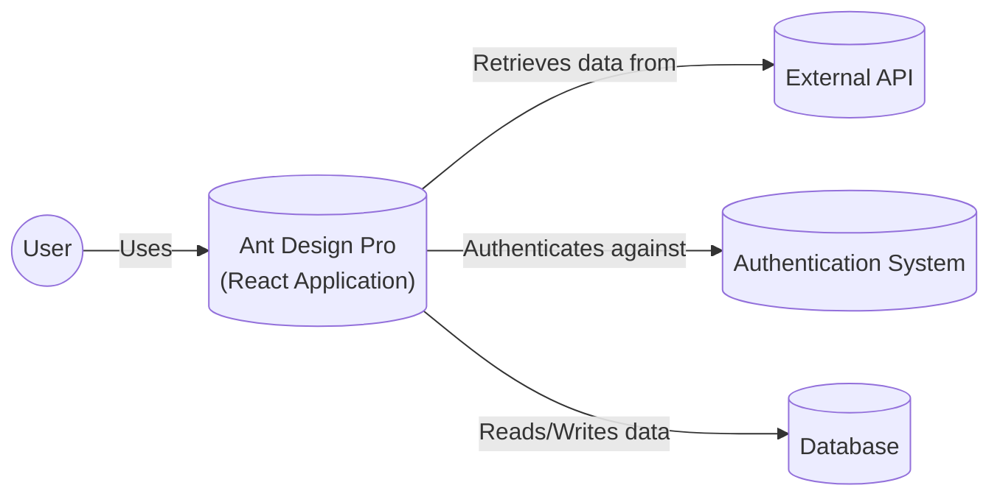
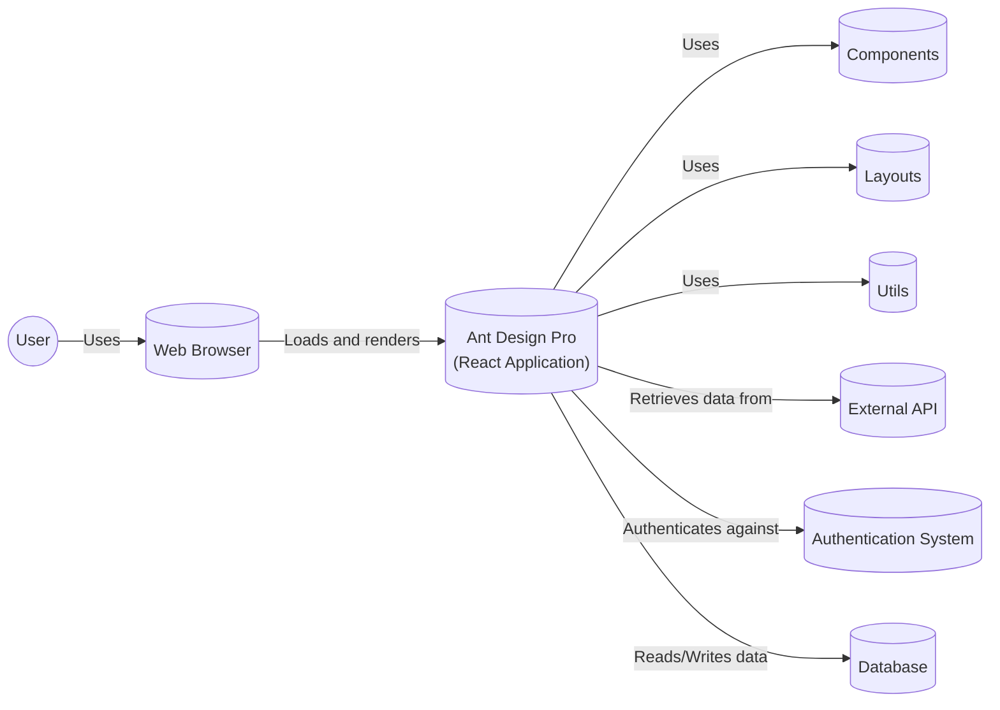

Okay, let's create a design document for the Ant Design Pro project, focusing on aspects relevant for threat modeling.

# BUSINESS POSTURE

Ant Design Pro is an out-of-the-box UI solution for enterprise applications. It's designed to streamline the development of complex, interactive web applications, particularly dashboards and management interfaces.  It's built on top of Ant Design, a popular React component library.  The primary business goals are:

*   Reduce development time and cost for enterprise applications.
*   Provide a consistent and aesthetically pleasing user experience.
*   Offer a wide range of pre-built components and layouts.
*   Enable rapid prototyping and development of internal tools.
*   Maintain a high level of code quality and maintainability.
*   Provide good documentation and examples.

Business priorities:

*   Developer productivity and ease of use.
*   Component reusability and consistency.
*   Performance and scalability of the resulting applications.
*   Maintainability and extensibility of the framework itself.

Most important business risks:

*   Security vulnerabilities in the framework could be exploited in applications built using it, leading to data breaches or system compromise.  This is the most critical risk, given its use in enterprise applications.
*   Performance bottlenecks could impact the usability of applications built with the framework.
*   Lack of flexibility or extensibility could limit its adoption for specific use cases.
*   Inadequate documentation or support could hinder developer productivity.
*   Bugs or defects in the framework could lead to instability in applications.
*   Dependency on third-party libraries introduces supply chain risks.

# SECURITY POSTURE

Existing security controls (based on the GitHub repository and common practices for similar projects):

*   security control: Dependency management: Uses package managers like npm or yarn to manage dependencies. (Visible in `package.json` and `yarn.lock` files).
*   security control: Code linting: Likely uses linters (e.g., ESLint) to enforce code style and identify potential issues. (Configuration files like `.eslintrc.js` are usually present).
*   security control: Regular updates: The project is actively maintained, with frequent updates and bug fixes. (Visible in the commit history and release notes).
*   security control: Community scrutiny: Being open-source, the codebase is subject to scrutiny by a large community of developers.
*   security control: Component-based architecture: Promotes modularity and separation of concerns, which can help contain the impact of vulnerabilities.
*   security control: Use of React: React itself has built-in mechanisms to prevent some common web vulnerabilities like XSS (when used correctly).

Accepted risks:

*   accepted risk: Reliance on third-party libraries: Introduces the risk of vulnerabilities in those libraries.  Mitigated by dependency management and regular updates, but the risk remains.
*   accepted risk: Complexity of the framework: The large codebase and numerous features increase the potential attack surface.
*   accepted risk: User-provided content: Applications built with Ant Design Pro may handle user-provided content, which requires careful validation and sanitization. This is primarily the responsibility of the application developer, but the framework should provide tools to help.
*   accepted risk: Configuration errors: Incorrect configuration of the framework or its components could introduce vulnerabilities.

Recommended security controls (high priority):

*   Implement a comprehensive security testing strategy, including static analysis (SAST), dynamic analysis (DAST), and software composition analysis (SCA).
*   Establish a clear vulnerability disclosure and response process.
*   Provide security documentation and guidelines for developers using the framework.
*   Consider implementing Content Security Policy (CSP) headers to mitigate XSS and other injection attacks.
*   Consider implementing Subresource Integrity (SRI) for included scripts and stylesheets.
*   Regularly audit dependencies for known vulnerabilities.

Security Requirements:

*   Authentication: The framework itself does not handle authentication. Applications built with Ant Design Pro will need to implement their own authentication mechanisms.
*   Authorization: Similar to authentication, authorization is the responsibility of the application developer. The framework may provide UI components for managing roles and permissions, but the underlying logic must be implemented separately.
*   Input Validation: Applications must validate all user inputs to prevent injection attacks and other vulnerabilities. The framework should provide helper functions or components to assist with this.
*   Cryptography: The framework should use secure cryptographic practices where necessary (e.g., for handling sensitive data or communicating with APIs). This includes using strong algorithms and securely managing keys. The framework itself likely doesn't handle much cryptography directly, but applications built with it may.

# DESIGN

## C4 CONTEXT



Element Descriptions:

*   Element:
    *   Name: User
    *   Type: Person
    *   Description: A user interacting with the application built using Ant Design Pro.
    *   Responsibilities: Interacting with the UI, providing input, viewing data.
    *   Security controls: Browser security features, user-side security software.

*   Element:
    *   Name: Ant Design Pro (React Application)
    *   Type: Software System
    *   Description: The core of the project; a React-based framework for building enterprise applications.
    *   Responsibilities: Providing UI components, layouts, and development tools. Rendering the user interface, handling user interactions, managing application state.
    *   Security controls: React's built-in XSS protection, secure coding practices, dependency management, linting.

*   Element:
    *   Name: External API
    *   Type: Software System
    *   Description: An external API that the application interacts with.
    *   Responsibilities: Providing data and services to the application.
    *   Security controls: API authentication, authorization, input validation, rate limiting, TLS encryption.

*   Element:
    *   Name: Authentication System
    *   Type: Software System
    *   Description: A system responsible for authenticating users.
    *   Responsibilities: Verifying user credentials, issuing tokens or sessions.
    *   Security controls: Strong password hashing, multi-factor authentication, secure session management.

*   Element:
    *   Name: Database
    *   Type: Software System
    *   Description: A database used to store application data.
    *   Responsibilities: Storing and retrieving data.
    *   Security controls: Access controls, encryption at rest and in transit, regular backups.

## C4 CONTAINER



Element Descriptions:

*   Element:
    *   Name: User
    *   Type: Person
    *   Description: A user interacting with the application built using Ant Design Pro.
    *   Responsibilities: Interacting with the UI, providing input, viewing data.
    *   Security controls: Browser security features, user-side security software.

*   Element:
    *   Name: Web Browser
    *   Type: Software System
    *   Description: The user's web browser, which hosts and renders the Ant Design Pro application.
    *   Responsibilities: Rendering HTML, CSS, and JavaScript; handling user input; making network requests.
    *   Security controls: Browser security features (e.g., same-origin policy, CSP), sandboxing.

*   Element:
    *   Name: Ant Design Pro (React Application)
    *   Type: Web Application
    *   Description: The core of the project; a React-based framework for building enterprise applications.
    *   Responsibilities: Providing UI components, layouts, and development tools. Rendering the user interface, handling user interactions, managing application state.
    *   Security controls: React's built-in XSS protection, secure coding practices, dependency management, linting.

*   Element:
    *   Name: Components
    *   Type: Container
    *   Description: Reusable UI components provided by Ant Design Pro (e.g., buttons, forms, tables).
    *   Responsibilities: Rendering specific UI elements, handling user interactions within those elements.
    *   Security controls: Input validation (where applicable), secure rendering of user-provided content.

*   Element:
    *   Name: Layouts
    *   Type: Container
    *   Description: Pre-built layout components for structuring the application's UI.
    *   Responsibilities: Defining the overall structure and arrangement of UI elements.
    *   Security controls: Secure use of CSS and layout techniques to prevent layout-related vulnerabilities.

*   Element:
    *   Name: Utils
    *   Type: Container
    *   Description: Utility functions and helpers used within the framework.
    *   Responsibilities: Providing common functionality (e.g., data formatting, API calls).
    *   Security controls: Secure coding practices, input validation (where applicable).

*   Element:
    *   Name: External API
    *   Type: Software System
    *   Description: An external API that the application interacts with.
    *   Responsibilities: Providing data and services to the application.
    *   Security controls: API authentication, authorization, input validation, rate limiting, TLS encryption.

*   Element:
    *   Name: Authentication System
    *   Type: Software System
    *   Description: A system responsible for authenticating users.
    *   Responsibilities: Verifying user credentials, issuing tokens or sessions.
    *   Security controls: Strong password hashing, multi-factor authentication, secure session management.

*   Element:
    *   Name: Database
    *   Type: Software System
    *   Description: A database used to store application data.
    *   Responsibilities: Storing and retrieving data.
    *   Security controls: Access controls, encryption at rest and in transit, regular backups.

## DEPLOYMENT

Possible deployment solutions:

1.  Static Hosting (e.g., AWS S3 + CloudFront, Netlify, Vercel): Suitable for applications that primarily consist of static assets (HTML, CSS, JavaScript).
2.  Containerized Deployment (e.g., Docker + Kubernetes, AWS ECS, Google Kubernetes Engine): Suitable for more complex applications with backend services or microservices.
3.  Serverless Deployment (e.g., AWS Lambda, Azure Functions, Google Cloud Functions): Suitable for applications with event-driven architectures or small, independent functions.

Chosen solution (for detailed description): Static Hosting (AWS S3 + CloudFront)

```mermaid
graph LR
    Developer((Developer))
    BuildServer[(Build Server)]
    S3Bucket[("AWS S3\n(Static Website Hosting)")]
    CloudFront[(AWS CloudFront\n(CDN))]
    User((User))
    Browser[(Web Browser)]

    Developer -- "Commits code" --> BuildServer
    BuildServer -- "Builds and deploys" --> S3Bucket
    S3Bucket -- "Serves static assets" --> CloudFront
    CloudFront -- "Delivers content to" --> Browser
    Browser -- "Render" --> User
```

Element Descriptions:

*   Element:
    *   Name: Developer
    *   Type: Person
    *   Description: A developer working on the Ant Design Pro project.
    *   Responsibilities: Writing code, committing changes, initiating builds.
    *   Security controls: Code reviews, secure coding practices, access controls to the code repository.

*   Element:
    *   Name: Build Server
    *   Type: Software System
    *   Description: A server that builds the application from source code (e.g., Jenkins, GitHub Actions).
    *   Responsibilities: Running build scripts, compiling code, running tests, deploying artifacts.
    *   Security controls: Access controls, secure build environment, dependency scanning.

*   Element:
    *   Name: AWS S3 (Static Website Hosting)
    *   Type: Infrastructure
    *   Description: An Amazon S3 bucket configured for static website hosting.
    *   Responsibilities: Storing and serving the static assets of the application (HTML, CSS, JavaScript).
    *   Security controls: Bucket policies, access controls, encryption at rest, logging.

*   Element:
    *   Name: AWS CloudFront (CDN)
    *   Type: Infrastructure
    *   Description: A content delivery network (CDN) that distributes the application's content globally.
    *   Responsibilities: Caching content, reducing latency, improving performance, providing DDoS protection.
    *   Security controls: HTTPS, WAF integration, access logs.

*   Element:
    *   Name: User
    *   Type: Person
    *   Description: A user interacting with the application built using Ant Design Pro.
    *   Responsibilities: Interacting with the UI, providing input, viewing data.
    *   Security controls: Browser security features, user-side security software.

*   Element:
    *   Name: Web Browser
    *   Type: Software System
    *   Description: The user's web browser, which hosts and renders the Ant Design Pro application.
    *   Responsibilities: Rendering HTML, CSS, and JavaScript; handling user input; making network requests.
    *   Security controls: Browser security features (e.g., same-origin policy, CSP), sandboxing.

## BUILD

The build process for Ant Design Pro likely involves the following steps:

1.  Developer commits code to the repository (e.g., GitHub).
2.  A build server (e.g., Jenkins, GitHub Actions) is triggered by the commit.
3.  The build server checks out the code.
4.  Dependencies are installed (using npm or yarn).
5.  Code linting is performed (e.g., using ESLint).
6.  Tests are run (e.g., unit tests, integration tests).
7.  The code is compiled and bundled (using tools like Webpack or Parcel).
8.  Static assets are optimized (e.g., minified, compressed).
9.  The built artifacts are deployed to the target environment (e.g., AWS S3).

```mermaid
graph LR
    Developer((Developer))
    CodeRepository[(Code Repository)]
    BuildServer[(Build Server)]
    DependencyManagement[("Dependency\nManagement\n(npm/yarn)")]
    Linter[(Linter\n(ESLint))]
    TestRunner[(Test Runner)]
    Bundler[(Bundler\n(Webpack/Parcel))]
    Artifacts[("Build\nArtifacts")]

    Developer -- "Commits code" --> CodeRepository
    CodeRepository -- "Triggers build" --> BuildServer
    BuildServer -- "Installs dependencies" --> DependencyManagement
    BuildServer -- "Runs linter" --> Linter
    BuildServer -- "Runs tests" --> TestRunner
    BuildServer -- "Bundles code" --> Bundler
    Bundler -- "Produces" --> Artifacts
```

Security Controls in Build Process:

*   Dependency Management: Uses npm or yarn to manage dependencies, allowing for auditing and vulnerability scanning.
*   Code Linting: Enforces code style and identifies potential security issues.
*   Testing: Includes unit and integration tests to catch bugs and regressions.
*   Static Analysis: Could be integrated into the build process to identify security vulnerabilities in the code.
*   Software Composition Analysis (SCA): Could be used to scan dependencies for known vulnerabilities.
*   Build Server Security: The build server itself should be secured to prevent unauthorized access or modification of the build process.

# RISK ASSESSMENT

Critical Business Processes:

*   Rapid development of enterprise applications.
*   Consistent and user-friendly UI/UX.
*   Maintainability and scalability of applications built with the framework.

Data to Protect:

*   Source code of the framework itself (low sensitivity, but important for integrity).
*   Documentation and examples (low sensitivity).
*   User data handled by applications built with the framework (sensitivity varies depending on the application). This is the most critical data to protect, but it's primarily the responsibility of the application developer, not the framework itself. The framework should, however, provide tools and guidance to help developers protect user data.

# QUESTIONS & ASSUMPTIONS

Questions:

*   What specific security testing tools and processes are currently used?
*   Is there a vulnerability disclosure program in place?
*   What are the specific performance targets for applications built with the framework?
*   What level of support is provided to developers using the framework?
*   Are there any plans to implement additional security features (e.g., CSP, SRI)?

Assumptions:

*   BUSINESS POSTURE: Assumes that the primary users are developers building enterprise applications.
*   SECURITY POSTURE: Assumes that basic security practices (e.g., dependency management, code linting) are followed. Assumes that developers using the framework are responsible for implementing application-specific security controls (e.g., authentication, authorization).
*   DESIGN: Assumes a typical React application structure. Assumes that the framework is primarily used for building web applications. Assumes that static hosting is a viable deployment option for many use cases.